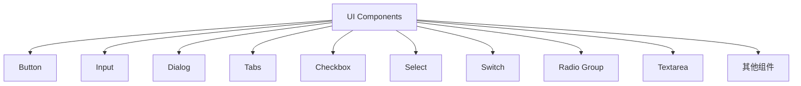
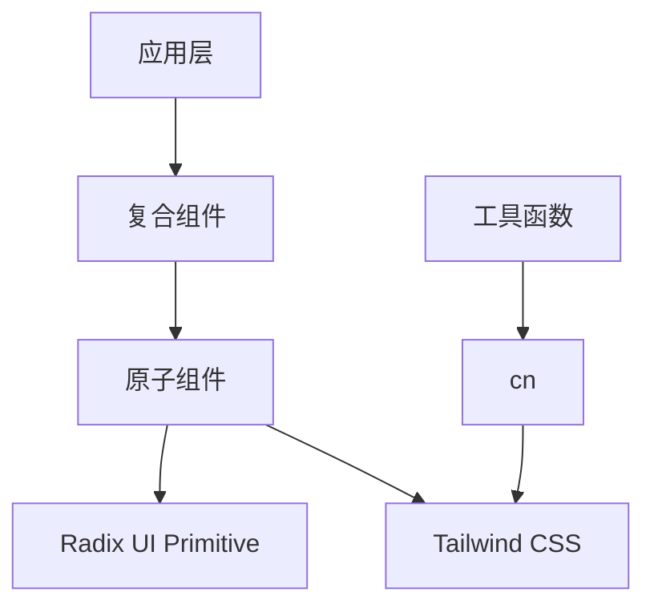
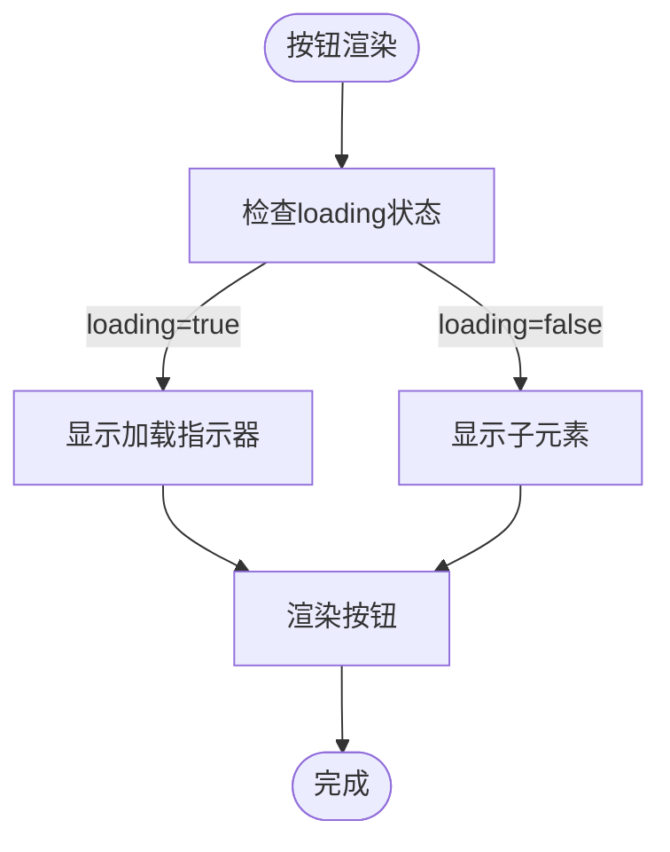
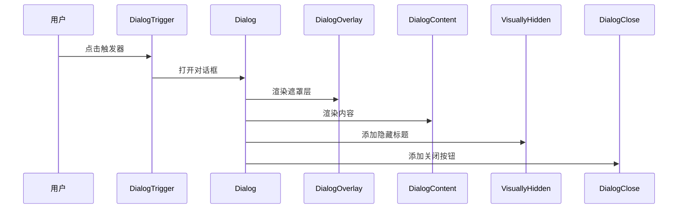
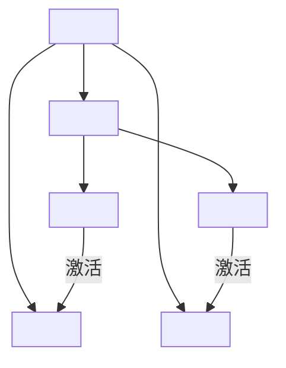
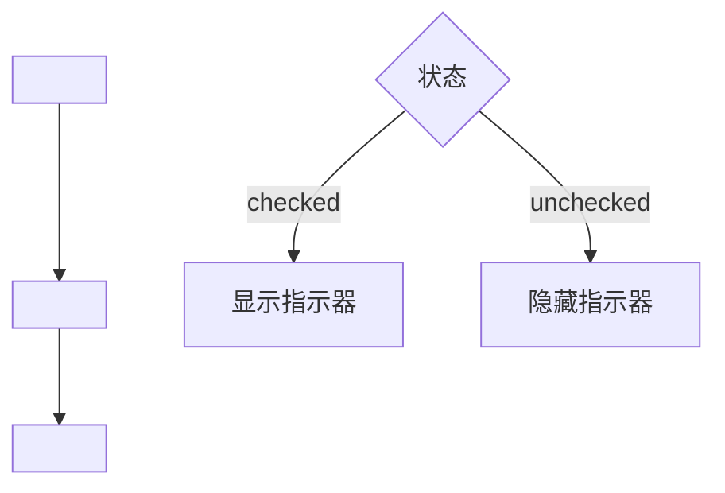
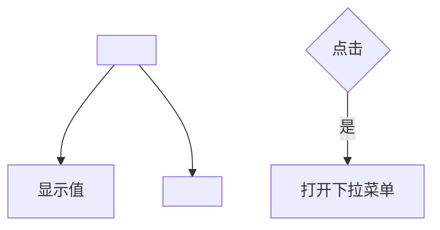
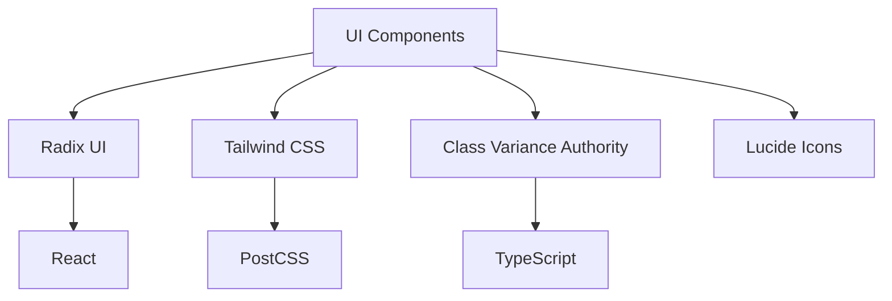

# 基础UI组件

<cite>
**本文档中引用的文件**  
- [button.tsx](file://vibe_surf/frontend/src/components/ui/button.tsx)
- [input.tsx](file://vibe_surf/frontend/src/components/ui/input.tsx)
- [dialog.tsx](file://vibe_surf/frontend/src/components/ui/dialog.tsx)
- [tabs.tsx](file://vibe_surf/frontend/src/components/ui/tabs.tsx)
- [checkbox.tsx](file://vibe_surf/frontend/src/components/ui/checkbox.tsx)
- [select.tsx](file://vibe_surf/frontend/src/components/ui/select.tsx)
- [switch.tsx](file://vibe_surf/frontend/src/components/ui/switch.tsx)
- [radio-group.tsx](file://vibe_surf/frontend/src/components/ui/radio-group.tsx)
- [textarea.tsx](file://vibe_surf/frontend/src/components/ui/textarea.tsx)
- [utils.ts](file://vibe_surf/frontend/src/utils/utils.ts)
- [custom-store-button.tsx](file://vibe_surf/frontend/src/customization/components/custom-store-button.tsx)
- [deleteConfirmationModal/index.tsx](file://vibe_surf/frontend/src/modals/deleteConfirmationModal/index.tsx)
</cite>

## 目录
1. [简介](#简介)
2. [项目结构](#项目结构)
3. [核心组件](#核心组件)
4. [架构概述](#架构概述)
5. [详细组件分析](#详细组件分析)
6. [依赖分析](#依赖分析)
7. [性能考虑](#性能考虑)
8. [故障排除指南](#故障排除指南)
9. [结论](#结论)

## 简介
本文档详细介绍了VibeSurf项目中基于Shadcn UI构建的基础UI组件。这些原子组件构成了整个应用的用户界面基础，提供了统一的设计语言和交互模式。文档将深入分析按钮、输入框、对话框、标签页、复选框和选择器等核心组件，阐述它们的Props接口定义、事件处理机制和样式定制方法。

## 项目结构
VibeSurf的前端UI组件主要位于`vibe_surf/frontend/src/components/ui`目录下，采用基于Shadcn UI的设计模式。该目录包含了所有基础原子组件，每个组件都以独立的TSX文件实现，遵循一致的架构和样式约定。



**图示来源**
- [button.tsx](file://vibe_surf/frontend/src/components/ui/button.tsx)
- [input.tsx](file://vibe_surf/frontend/src/components/ui/input.tsx)
- [dialog.tsx](file://vibe_surf/frontend/src/components/ui/dialog.tsx)

**章节来源**
- [vibe_surf/frontend/src/components/ui](file://vibe_surf/frontend/src/components/ui)

## 核心组件
VibeSurf的基础UI组件库包含了一系列精心设计的原子组件，这些组件基于Radix UI构建，并通过Tailwind CSS进行样式化。每个组件都经过优化，支持可访问性、响应式布局和主题定制。组件库的设计遵循原子设计原则，确保了UI的一致性和可维护性。

**章节来源**
- [button.tsx](file://vibe_surf/frontend/src/components/ui/button.tsx)
- [input.tsx](file://vibe_surf/frontend/src/components/ui/input.tsx)
- [dialog.tsx](file://vibe_surf/frontend/src/components/ui/dialog.tsx)

## 架构概述
VibeSurf的UI组件架构采用分层设计模式，上层组件依赖于底层的原子组件。这种架构确保了组件的高度可复用性和一致性。所有UI组件都通过`cn`工具函数进行样式组合，该函数封装了Tailwind CSS的类名合并逻辑。



**图示来源**
- [utils.ts](file://vibe_surf/frontend/src/utils/utils.ts)
- [button.tsx](file://vibe_surf/frontend/src/components/ui/button.tsx)

## 详细组件分析

### 按钮组件分析
按钮组件是用户界面中最常用的交互元素之一。VibeSurf的按钮组件提供了多种变体和尺寸选项，支持加载状态和图标集成。

#### 组件接口定义
按钮组件通过`ButtonProps`接口定义了其属性，扩展了原生HTML按钮元素的所有属性，并添加了自定义属性：

```typescript
export interface ButtonProps
  extends React.ButtonHTMLAttributes<HTMLButtonElement>,
    VariantProps<typeof buttonVariants> {
  asChild?: boolean;
  loading?: boolean;
  unstyled?: boolean;
  ignoreTitleCase?: boolean;
}
```

**图示来源**
- [button.tsx](file://vibe_surf/frontend/src/components/ui/button.tsx#L53-L60)

#### 变体和尺寸
按钮组件使用`cva`（Class Variance Authority）定义了多种视觉变体和尺寸：

- **变体**: default, destructive, outline, primary, warning, secondary, ghost, link等
- **尺寸**: default, md, sm, xs, lg, icon等

这些变体通过`buttonVariants`函数生成相应的CSS类名，实现了样式与逻辑的分离。

**图示来源**
- [button.tsx](file://vibe_surf/frontend/src/components/ui/button.tsx#L7-L49)

#### 事件处理机制
按钮组件处理了标准的DOM事件，如点击、聚焦和键盘事件。当`loading`属性为true时，组件会显示加载动画并禁用交互。



**图示来源**
- [button.tsx](file://vibe_surf/frontend/src/components/ui/button.tsx#L71-L133)

#### 样式定制方法
按钮组件通过`cn`函数组合Tailwind CSS类名，支持通过`className`属性进行额外的样式定制。组件还实现了文本标题化功能，除非`ignoreTitleCase`属性被设置为true。

**章节来源**
- [button.tsx](file://vibe_surf/frontend/src/components/ui/button.tsx)
- [utils.ts](file://vibe_surf/frontend/src/utils/utils.ts)

### 输入框组件分析
输入框组件提供了增强的输入体验，支持图标集成和占位符动画。

#### Props接口定义
输入框组件的Props接口扩展了原生输入元素的属性，并添加了自定义属性：

```typescript
export interface InputProps
  extends React.InputHTMLAttributes<HTMLInputElement> {
  icon?: string;
  inputClassName?: string;
  placeholder?: string;
}
```

**图示来源**
- [input.tsx](file://vibe_surf/frontend/src/components/ui/input.tsx#L5-L10)

#### 结构和样式

```mermaid
flowchart TD
Label["<label>"] --> Input["<input>"]
Label --> Placeholder["<span>占位符</span>"]
Condition{"有值?"} --> |是| HidePlaceholder["隐藏占位符"]
Condition --> |否| ShowPlaceholder["显示占位符"]
Input --> Condition
```

输入框组件使用了`<label>`包装`<input>`元素，实现了浮动标签效果。当输入框有值时，占位符文本会隐藏，提供更好的用户体验。



**图示来源**
- [input.tsx](file://vibe_surf/frontend/src/components/ui/input.tsx#L12-L54)

#### 图标集成
组件支持通过`icon`属性集成图标，图标会自动定位在输入框的左侧。`ForwardedIconComponent`用于渲染指定的图标。

**章节来源**
- [input.tsx](file://vibe_surf/frontend/src/components/ui/input.tsx)
- [genericIconComponent](file://vibe_surf/frontend/src/components/common/genericIconComponent)

### 对话框组件分析
对话框组件提供了模态对话框功能，支持可访问性和键盘导航。

#### 组件组成
对话框由多个子组件组成：
- `Dialog`: 根组件
- `DialogTrigger`: 触发器
- `DialogContent`: 内容区域
- `DialogHeader`: 头部
- `DialogFooter`: 底部
- `DialogTitle`: 标题
- `DialogDescription`: 描述

**图示来源**
- [dialog.tsx](file://vibe_surf/frontend/src/components/ui/dialog.tsx#L9-L170)

#### 可访问性设计
组件实现了多种可访问性特性：
- 使用`VisuallyHidden`组件为屏幕阅读器提供隐藏的标题
- 支持键盘导航和焦点管理
- 提供关闭按钮的屏幕阅读器文本



**图示来源**
- [dialog.tsx](file://vibe_surf/frontend/src/components/ui/dialog.tsx)

#### 响应式布局
对话框组件使用固定定位和最大宽度，确保在不同屏幕尺寸下都能良好显示。CSS动画通过`data-[state]`属性控制，提供了平滑的打开和关闭效果。

**章节来源**
- [dialog.tsx](file://vibe_surf/frontend/src/components/ui/dialog.tsx)

### 标签页组件分析
标签页组件提供了选项卡式导航功能。

#### 结构分析
标签页由以下组件构成：
- `Tabs`: 根容器
- `TabsList`: 标签列表
- `TabsTrigger`: 标签项
- `TabsContent`: 内容面板

**图示来源**
- [tabs.tsx](file://vibe_surf/frontend/src/components/ui/tabs.tsx#L7-L51)

#### 交互机制
组件使用Radix UI的原生状态管理，自动处理标签的激活状态和内容切换。CSS通过`data-[state=active]`选择器实现视觉反馈。



**图示来源**
- [tabs.tsx](file://vibe_surf/frontend/src/components/ui/tabs.tsx)

#### 样式特点
标签页使用底部边框指示当前激活的标签，提供了清晰的视觉反馈。过渡动画确保了平滑的状态切换。

**章节来源**
- [tabs.tsx](file://vibe_surf/frontend/src/components/ui/tabs.tsx)

### 复选框组件分析
复选框组件提供了增强的复选框体验。

#### 实现方式
组件基于Radix UI的`CheckboxPrimitive`构建，使用CSS类名控制不同状态的样式：

- 未选中: 边框为`border-muted-foreground`
- 选中: 背景为`bg-primary`，边框为`border-primary`
- 禁用: 透明度降低

**图示来源**
- [checkbox.tsx](file://vibe_surf/frontend/src/components/ui/checkbox.tsx#L8-L27)

#### 指示器
选中状态通过`CheckboxPrimitive.Indicator`显示，内部使用`Check`图标。



**图示来源**
- [checkbox.tsx](file://vibe_surf/frontend/src/components/ui/checkbox.tsx)

#### 辅助组件
组件还导出了`CheckBoxDiv`，提供了另一种样式的复选框实现。

**章节来源**
- [checkbox.tsx](file://vibe_surf/frontend/src/components/ui/checkbox.tsx)

### 选择器组件分析
选择器组件提供了下拉选择功能。

#### 组件结构
选择器由多个部分组成：
- `Select`: 根组件
- `SelectTrigger`: 触发器
- `SelectContent`: 下拉内容
- `SelectItem`: 选项项
- `SelectValue`: 显示值

**图示来源**
- [select.tsx](file://vibe_surf/frontend/src/components/ui/select.tsx#L8-L128)

#### 触发器
触发器显示当前选中的值和下拉箭头图标，支持向上和向下两种方向。



**图示来源**
- [select.tsx](file://vibe_surf/frontend/src/components/ui/select.tsx#L14-L38)

#### 下拉内容
下拉内容使用Portal渲染到DOM树的顶层，确保不会被其他元素裁剪。支持动画效果和位置调整。

**章节来源**
- [select.tsx](file://vibe_surf/frontend/src/components/ui/select.tsx)

## 依赖分析
基础UI组件库依赖于多个关键库和技术：



**图示来源**
- [package.json](file://vibe_surf/frontend/package.json)
- [tailwind.config.mjs](file://vibe_surf/frontend/tailwind.config.mjs)

**章节来源**
- [button.tsx](file://vibe_surf/frontend/src/components/ui/button.tsx)
- [input.tsx](file://vibe_surf/frontend/src/components/ui/input.tsx)

## 性能考虑
UI组件在设计时考虑了性能优化：

1. **样式优化**: 使用Tailwind CSS的原子类，减少CSS文件大小
2. **组件复用**: 原子组件设计提高了复用性，减少了重复代码
3. **按需加载**: 组件可以独立导入，支持tree-shaking
4. **虚拟化**: 复杂列表组件可以结合虚拟化技术提高性能

## 故障排除指南
在使用基础UI组件时可能遇到的常见问题及解决方案：

1. **样式冲突**: 确保Tailwind CSS正确配置，避免全局样式冲突
2. **图标不显示**: 检查`ForwardedIconComponent`的图标名称是否正确
3. **响应式问题**: 确认断点设置与设计系统一致
4. **可访问性问题**: 使用屏幕阅读器测试，确保所有交互元素都有适当的ARIA属性

**章节来源**
- [button.tsx](file://vibe_surf/frontend/src/components/ui/button.tsx)
- [dialog.tsx](file://vibe_surf/frontend/src/components/ui/dialog.tsx)

## 结论
VibeSurf的基础UI组件库提供了一套完整、一致且可扩展的原子组件。这些组件基于现代前端最佳实践构建，支持可访问性、响应式设计和主题定制。通过遵循原子设计原则，这些组件可以作为构建更复杂UI的可靠基础，确保了整个应用的用户体验一致性。