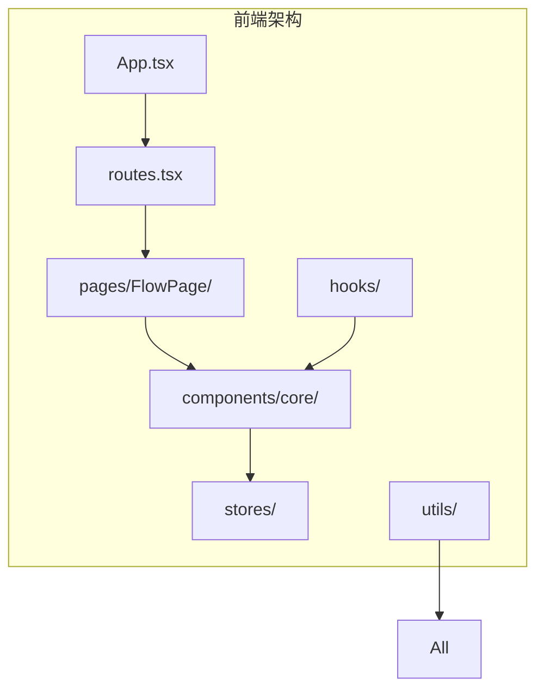
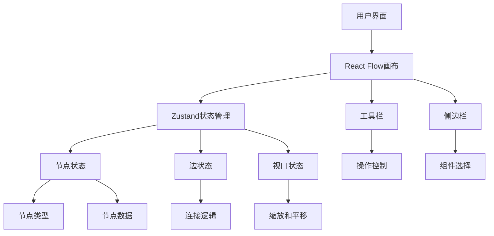
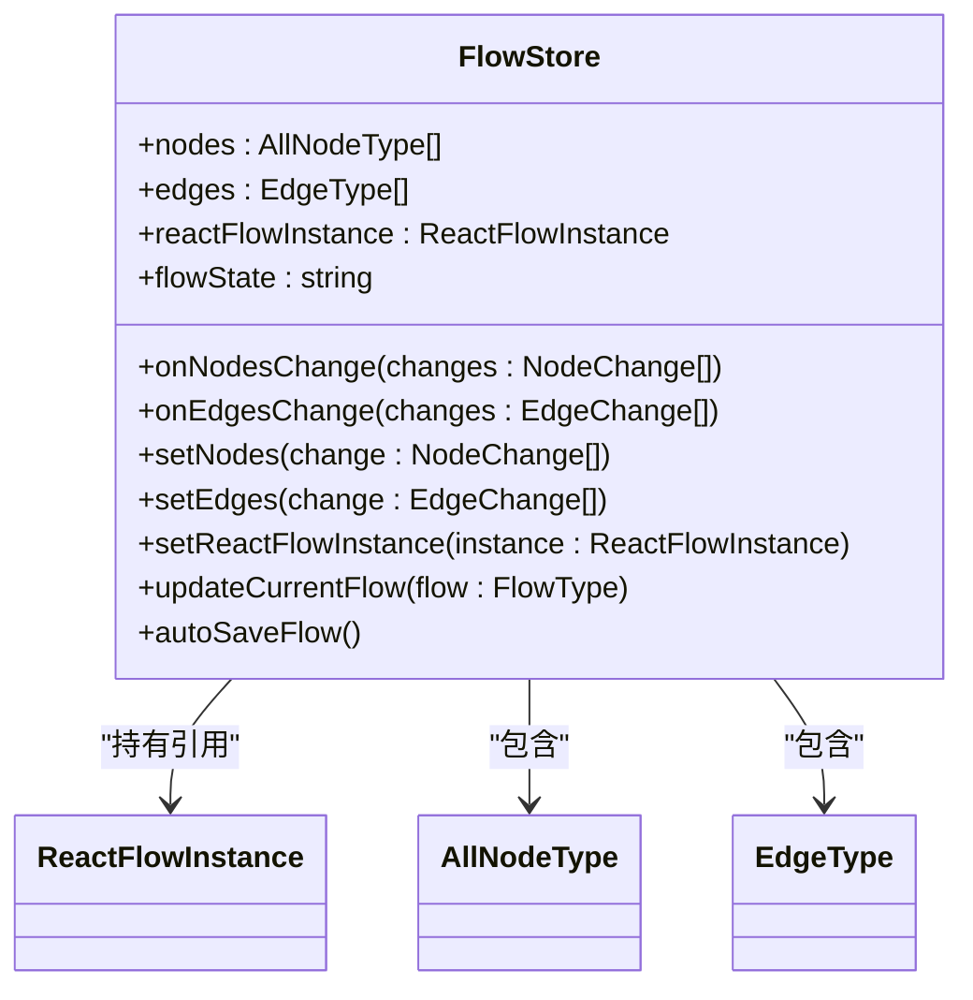
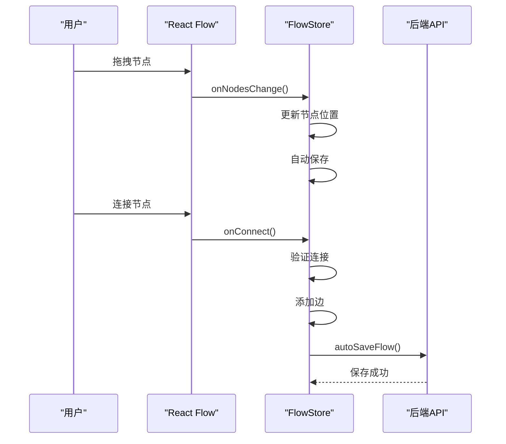
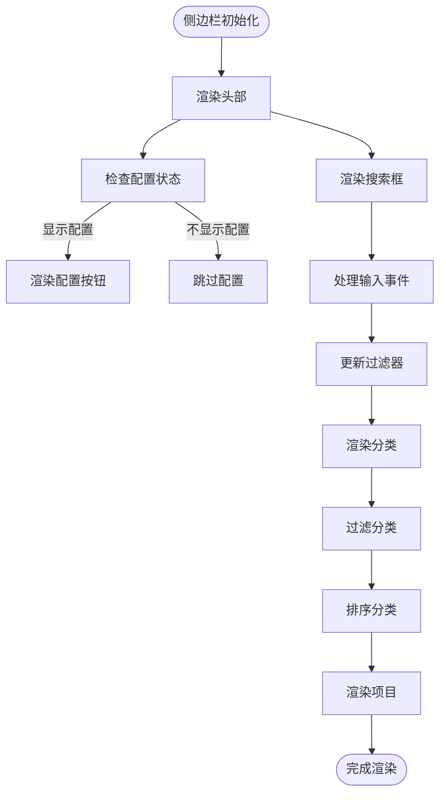
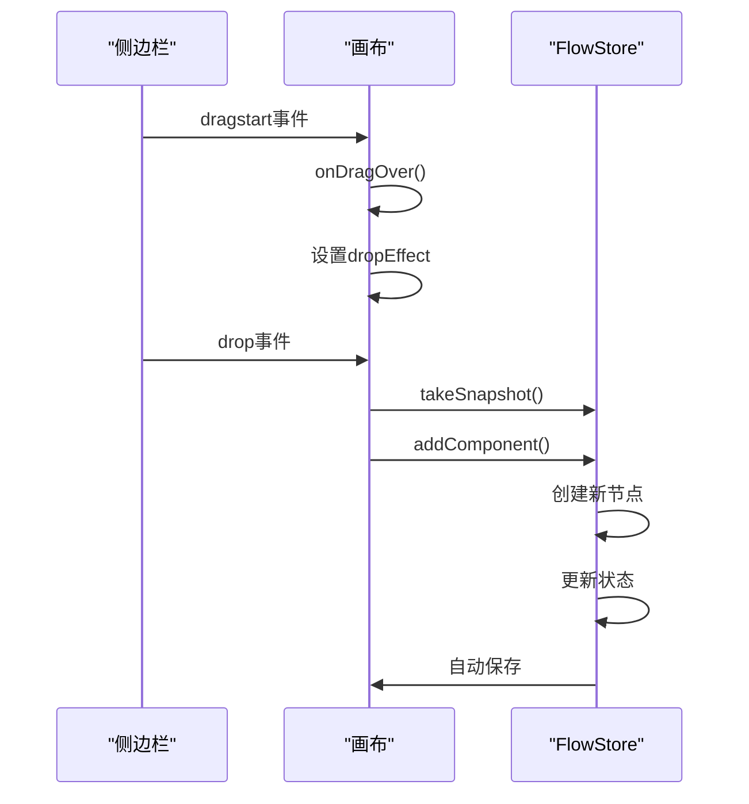
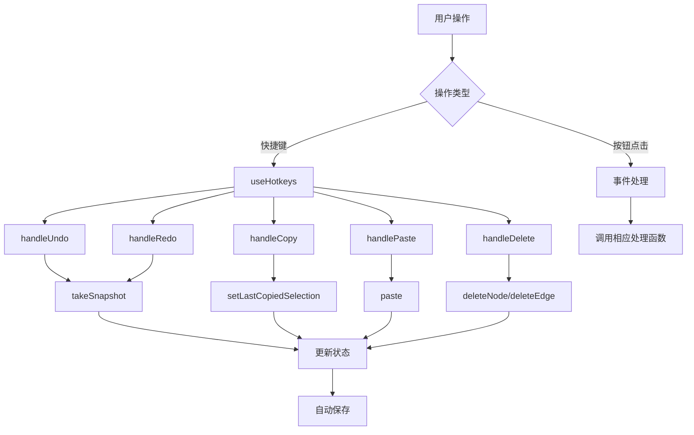
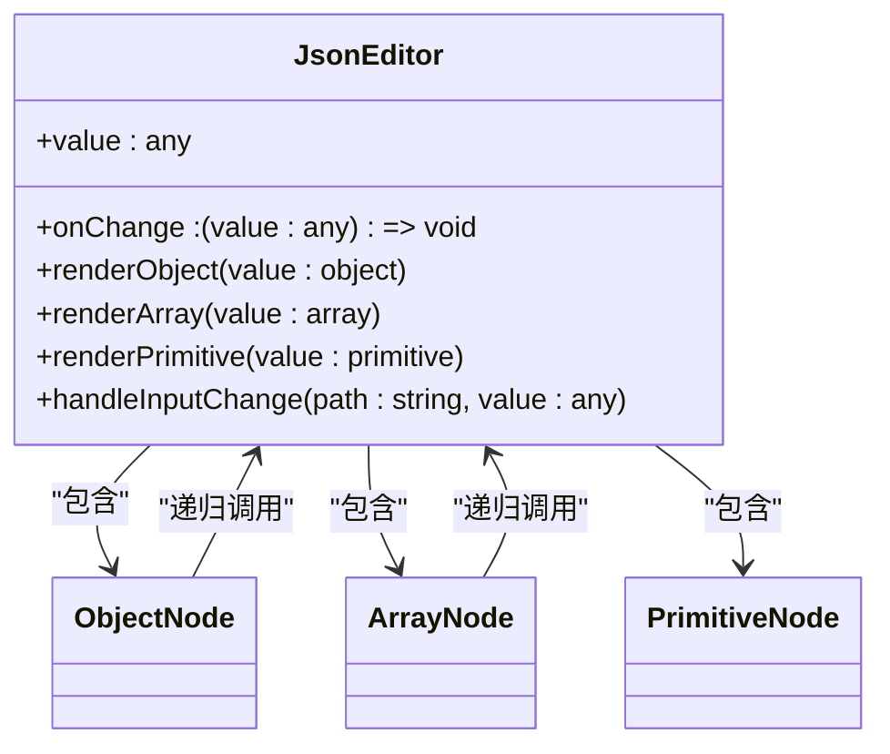
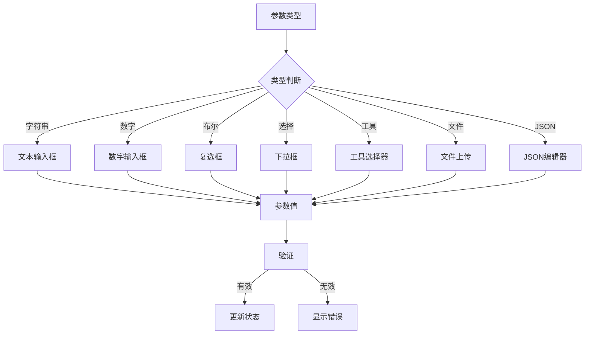
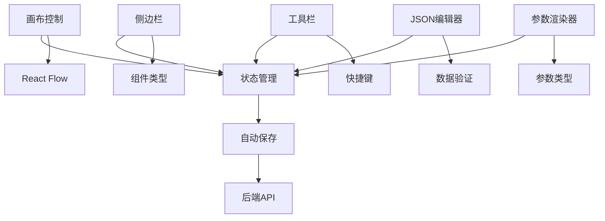

# 核心功能组件

<cite>
**本文档中引用的文件**  
- [App.tsx](file://vibe_surf/frontend/src/App.tsx)
- [routes.tsx](file://vibe_surf/frontend/src/routes.tsx)
- [flowStore.ts](file://vibe_surf/frontend/src/stores/flowStore.ts)
- [PageComponent/index.tsx](file://vibe_surf/frontend/src/pages/FlowPage/components/PageComponent/index.tsx)
- [CanvasControls.tsx](file://vibe_surf/frontend/src/components/core/canvasControlsComponent/CanvasControls.tsx)
- [use-add-component.ts](file://vibe_surf/frontend/src/hooks/use-add-component.ts)
- [reactflowUtils.ts](file://vibe_surf/frontend/src/utils/reactflowUtils.ts)
- [storeUtils.ts](file://vibe_surf/frontend/src/utils/storeUtils.ts)
- [use-autosave-flow.ts](file://vibe_surf/frontend/src/hooks/flows/use-autosave-flow.ts)
- [use-save-flow.ts](file://vibe_surf/frontend/src/hooks/flows/use-save-flow.ts)
- [CategoryGroup.tsx](file://vibe_surf/frontend/src/pages/FlowPage/components/flowSidebarComponent/components/categoryGroup.tsx)
- [SidebarHeaderComponent.tsx](file://vibe_surf/frontend/src/pages/FlowPage/components/flowSidebarComponent/components/sidebarHeader.tsx)
- [FlowToolbar.tsx](file://vibe_surf/frontend/src/components/core/flowToolbarComponent/FlowToolbar.tsx)
- [JsonEditor.tsx](file://vibe_surf/frontend/src/components/core/jsonEditorComponent/JsonEditor.tsx)
- [ParameterRenderer.tsx](file://vibe_surf/frontend/src/components/core/parameterRenderComponent/ParameterRenderer.tsx)
- [ToolsComponent.tsx](file://vibe_surf/frontend/src/components/core/parameterRenderComponent/components/ToolsComponent/index.tsx)
- [ToolsModal.tsx](file://vibe_surf/frontend/src/modals/toolsModal/index.tsx)
</cite>

## 目录
1. [引言](#引言)
2. [项目结构](#项目结构)
3. [核心组件](#核心组件)
4. [架构概述](#架构概述)
5. [详细组件分析](#详细组件分析)
6. [依赖分析](#依赖分析)
7. [性能考虑](#性能考虑)
8. [故障排除指南](#故障排除指南)
9. [结论](#结论)

## 引言
本文档详细分析了VibeSurf核心功能组件的实现机制，重点介绍画布控制、侧边栏、流程工具栏、JSON编辑器和参数渲染器等复合组件。这些组件共同构建了复杂的工作流界面，通过React Flow库实现可视化编程体验。文档将深入探讨这些组件的架构设计、状态管理策略以及它们之间的集成方式。

## 项目结构
VibeSurf前端项目采用模块化架构，核心功能组件主要位于`frontend/src`目录下。系统通过React Flow库实现可视化工作流编辑器，结合Zustand进行状态管理，构建了一个功能丰富的低代码平台。

**Diagram sources**
- [App.tsx](file://vibe_surf/frontend/src/App.tsx#L1-L23)
- [routes.tsx](file://vibe_surf/frontend/src/routes.tsx#L1-L211)

**Section sources**
- [App.tsx](file://vibe_surf/frontend/src/App.tsx#L1-L23)
- [routes.tsx](file://vibe_surf/frontend/src/routes.tsx#L1-L211)

## 核心组件
VibeSurf的核心功能组件包括画布控制、侧边栏、流程工具栏、JSON编辑器和参数渲染器。这些组件通过组合基础UI组件构建复杂的用户交互体验，实现了可视化工作流的设计和编辑功能。

**Section sources**
- [flowStore.ts](file://vibe_surf/frontend/src/stores/flowStore.ts#L257-L315)
- [PageComponent/index.tsx](file://vibe_surf/frontend/src/pages/FlowPage/components/PageComponent/index.tsx#L1-L800)

## 架构概述
VibeSurf采用基于React Flow的可视化工作流架构，通过Zustand进行全局状态管理。系统将工作流表示为节点和边的有向图，每个节点代表一个功能组件，边表示数据流和控制流。

**Diagram sources**
- [flowStore.ts](file://vibe_surf/frontend/src/stores/flowStore.ts#L257-L315)
- [PageComponent/index.tsx](file://vibe_surf/frontend/src/pages/FlowPage/components/PageComponent/index.tsx#L782-L794)

## 详细组件分析
本节深入分析VibeSurf的核心功能组件，包括画布控制、侧边栏、流程工具栏、JSON编辑器和参数渲染器的实现机制。

### 画布控制组件分析
画布控制组件负责管理React Flow画布的交互和状态，包括节点和边的增删改查、视口控制、连接验证等功能。

#### 状态管理机制
画布控制组件通过Zustand store管理所有状态，包括节点、边、视口和流程状态。

**Diagram sources**
- [flowStore.ts](file://vibe_surf/frontend/src/stores/flowStore.ts#L263-L315)

#### 与React Flow库的交互
画布控制组件通过回调函数与React Flow库进行交互，处理节点和边的变化。

**Diagram sources**
- [PageComponent/index.tsx](file://vibe_surf/frontend/src/pages/FlowPage/components/PageComponent/index.tsx#L782-L794)
- [flowStore.ts](file://vibe_surf/frontend/src/stores/flowStore.ts#L266-L275)

**Section sources**
- [flowStore.ts](file://vibe_surf/frontend/src/stores/flowStore.ts#L257-L315)
- [PageComponent/index.tsx](file://vibe_surf/frontend/src/pages/FlowPage/components/PageComponent/index.tsx#L782-L794)

### 侧边栏组件分析
侧边栏组件负责管理组件导航和选择，提供用户浏览和选择工作流组件的界面。

#### 导航状态管理
侧边栏通过状态管理组件类别、搜索过滤和配置显示。

**Diagram sources**
- [CategoryGroup.tsx](file://vibe_surf/frontend/src/pages/FlowPage/components/flowSidebarComponent/components/categoryGroup.tsx#L14-L55)
- [SidebarHeaderComponent.tsx](file://vibe_surf/frontend/src/pages/FlowPage/components/flowSidebarComponent/components/sidebarHeader.tsx#L18-L57)

#### 组件选择机制
侧边栏支持组件拖拽添加到画布，通过HTML5拖拽API实现。

**Diagram sources**
- [PageComponent/index.tsx](file://vibe_surf/frontend/src/pages/FlowPage/components/PageComponent/index.tsx#L486-L534)
- [use-add-component.ts](file://vibe_surf/frontend/src/hooks/use-add-component.ts#L1-L43)

**Section sources**
- [CategoryGroup.tsx](file://vibe_surf/frontend/src/pages/FlowPage/components/flowSidebarComponent/components/categoryGroup.tsx#L14-L55)
- [SidebarHeaderComponent.tsx](file://vibe_surf/frontend/src/pages/FlowPage/components/flowSidebarComponent/components/sidebarHeader.tsx#L18-L57)

### 流程工具栏组件分析
流程工具栏组件提供工作流操作的快捷方式，包括撤销、重做、复制、粘贴等操作。

#### 工作流操作触发
工具栏通过快捷键和按钮点击触发工作流操作。

**Diagram sources**
- [PageComponent/index.tsx](file://vibe_surf/frontend/src/pages/FlowPage/components/PageComponent/index.tsx#L228-L363)
- [FlowToolbar.tsx](file://vibe_surf/frontend/src/components/core/flowToolbarComponent/FlowToolbar.tsx)

**Section sources**
- [PageComponent/index.tsx](file://vibe_surf/frontend/src/pages/FlowPage/components/PageComponent/index.tsx#L228-L363)

### JSON编辑器组件分析
JSON编辑器组件处理复杂数据结构的编辑，提供结构化数据的可视化编辑界面。

#### 数据结构编辑
JSON编辑器通过递归渲染实现复杂数据结构的编辑。

**Diagram sources**
- [JsonEditor.tsx](file://vibe_surf/frontend/src/components/core/jsonEditorComponent/JsonEditor.tsx)

### 参数渲染器组件分析
参数渲染器组件负责渲染和编辑组件参数，支持多种参数类型和验证。

#### 参数类型处理
参数渲染器根据参数类型选择相应的渲染组件。

**Diagram sources**
- [ParameterRenderer.tsx](file://vibe_surf/frontend/src/components/core/parameterRenderComponent/ParameterRenderer.tsx)
- [ToolsComponent.tsx](file://vibe_surf/frontend/src/components/core/parameterRenderComponent/components/ToolsComponent/index.tsx)

**Section sources**
- [ParameterRenderer.tsx](file://vibe_surf/frontend/src/components/core/parameterRenderComponent/ParameterRenderer.tsx)
- [ToolsComponent.tsx](file://vibe_surf/frontend/src/components/core/parameterRenderComponent/components/ToolsComponent/index.tsx)

## 依赖分析
VibeSurf核心组件之间存在紧密的依赖关系，通过状态管理和事件系统实现组件间的通信。

**Diagram sources**
- [flowStore.ts](file://vibe_surf/frontend/src/stores/flowStore.ts)
- [use-autosave-flow.ts](file://vibe_surf/frontend/src/hooks/flows/use-autosave-flow.ts)
- [use-save-flow.ts](file://vibe_surf/frontend/src/hooks/flows/use-save-flow.ts)

**Section sources**
- [flowStore.ts](file://vibe_surf/frontend/src/stores/flowStore.ts)
- [use-autosave-flow.ts](file://vibe_surf/frontend/src/hooks/flows/use-autosave-flow.ts)

## 性能考虑
VibeSurf在性能方面采用了多种优化策略，包括状态管理优化、渲染优化和数据处理优化。

- **状态管理优化**：使用Zustand的`useShallow`钩子避免不必要的重新渲染
- **渲染优化**：使用`React.memo`和`useCallback`进行组件记忆化
- **数据处理优化**：使用`lodash`的`cloneDeep`进行深拷贝，避免状态污染
- **异步操作优化**：使用防抖和节流控制自动保存频率

## 故障排除指南
当遇到VibeSurf核心组件问题时，可以参考以下排查步骤：

1. **画布不响应**：检查`reactFlowInstance`是否正确初始化
2. **节点无法拖拽**：确认`nodesDraggable`状态是否正确设置
3. **连接失败**：验证`isValidConnection`函数的逻辑
4. **自动保存失败**：检查网络连接和API端点
5. **侧边栏不显示**：确认`SidebarProvider`是否正确包裹

**Section sources**
- [CanvasControls.tsx](file://vibe_surf/frontend/src/components/core/canvasControlsComponent/CanvasControls.tsx)
- [flowStore.ts](file://vibe_surf/frontend/src/stores/flowStore.ts)

## 结论
VibeSurf的核心功能组件通过精心设计的架构和状态管理策略，实现了强大的可视化工作流编辑功能。画布控制组件与React Flow库紧密集成，侧边栏组件提供了直观的组件导航，流程工具栏组件简化了工作流操作，JSON编辑器和参数渲染器组件则处理了复杂的数据编辑需求。这些组件通过组合基础UI组件，构建了一个功能丰富、用户体验良好的低代码开发平台。