# 可视化节点架构

<cite>
**本文档引用的文件**
- [GenericNode/index.tsx](file://vibe_surf/frontend/src/CustomNodes/GenericNode/index.tsx)
- [MediaPlayerNode/index.tsx](file://vibe_surf/frontend/src/CustomNodes/MediaPlayerNode/index.tsx)
- [NoteNode/index.tsx](file://vibe_surf/frontend/src/CustomNodes/NoteNode/index.tsx)
- [helpers/check-code-validity.ts](file://vibe_surf/frontend/src/CustomNodes/helpers/check-code-validity.ts)
- [helpers/check-lucide-icons.ts](file://vibe_surf/frontend/src/CustomNodes/helpers/check-lucide-icons.ts)
- [hooks/use-update-node-code.ts](file://vibe_surf/frontend/src/CustomNodes/hooks/use-update-node-code.ts)
- [hooks/use-validation-status-string.ts](file://vibe_surf/frontend/src/CustomNodes/hooks/use-validation-status-string.ts)
- [GenericNode/components/NodeStatus/index.tsx](file://vibe_surf/frontend/src/CustomNodes/GenericNode/components/NodeStatus/index.tsx)
- [GenericNode/components/RenderInputParameters/index.tsx](file://vibe_surf/frontend/src/CustomNodes/GenericNode/components/RenderInputParameters/index.tsx)
- [GenericNode/components/NodeInputField/index.tsx](file://vibe_surf/frontend/src/CustomNodes/GenericNode/components/NodeInputField/index.tsx)
- [GenericNode/components/NodeOutputParameter/index.tsx](file://vibe_surf/frontend/src/CustomNodes/GenericNode/components/NodeOutputParameter/index.tsx)
- [GenericNode/components/NodeOutputParameter/NodeOutputs.tsx](file://vibe_surf/frontend/src/CustomNodes/GenericNode/components/NodeOutputParameter/NodeOutputs.tsx)
</cite>

## 目录
1. [简介](#简介)
2. [项目结构](#项目结构)
3. [核心组件](#核心组件)
4. [架构概述](#架构概述)
5. [详细组件分析](#详细组件分析)
6. [依赖分析](#依赖分析)
7. [性能考虑](#性能考虑)
8. [故障排除指南](#故障排除指南)
9. [结论](#结论)
10. [附录](#附录)（如有必要）

## 简介
本文档详细阐述了VibeSurf可视化节点架构的设计与实现。该架构基于React Flow构建，提供了一套完整的可视化编程解决方案。文档重点分析了GenericNode作为基础节点模板的设计模式，以及MediaPlayerNode和NoteNode等特定节点类型的扩展实现。通过深入探讨节点的组件化结构、输入输出端口管理、状态显示和交互逻辑，本文档为开发者提供了全面的节点扩展开发指南。

## 项目结构
VibeSurf的可视化节点架构主要位于前端源码的`CustomNodes`目录下，采用模块化设计，将通用功能与特定功能分离。架构以GenericNode为核心基础，通过组件化方式构建节点的各个部分，同时提供MediaPlayerNode和NoteNode等特定用途的节点实现。

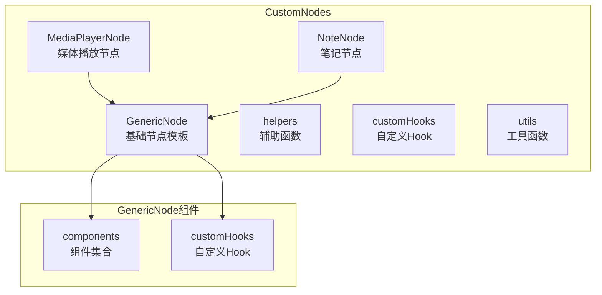

**图表来源**
- [GenericNode/index.tsx](file://vibe_surf/frontend/src/CustomNodes/GenericNode/index.tsx)
- [MediaPlayerNode/index.tsx](file://vibe_surf/frontend/src/CustomNodes/MediaPlayerNode/index.tsx)
- [NoteNode/index.tsx](file://vibe_surf/frontend/src/CustomNodes/NoteNode/index.tsx)

**章节来源**
- [GenericNode/index.tsx](file://vibe_surf/frontend/src/CustomNodes/GenericNode/index.tsx)

## 核心组件
VibeSurf的可视化节点架构由多个核心组件构成，其中GenericNode作为所有节点的基础模板，定义了节点的基本结构和行为。MediaPlayerNode和NoteNode则基于GenericNode进行扩展，实现了特定功能。架构通过一系列辅助函数和自定义Hook来管理节点状态、验证代码有效性、处理图标等核心功能。

**章节来源**
- [GenericNode/index.tsx](file://vibe_surf/frontend/src/CustomNodes/GenericNode/index.tsx)
- [MediaPlayerNode/index.tsx](file://vibe_surf/frontend/src/CustomNodes/MediaPlayerNode/index.tsx)
- [NoteNode/index.tsx](file://vibe_surf/frontend/src/CustomNodes/NoteNode/index.tsx)

## 架构概述
VibeSurf的可视化节点架构采用分层设计模式，将节点的UI展示、状态管理、数据处理和交互逻辑分离。架构以React Flow为基础，通过自定义节点组件实现丰富的可视化功能。GenericNode作为基础节点模板，提供了可复用的组件和逻辑，而特定节点类型则通过继承和扩展GenericNode来实现特定功能。

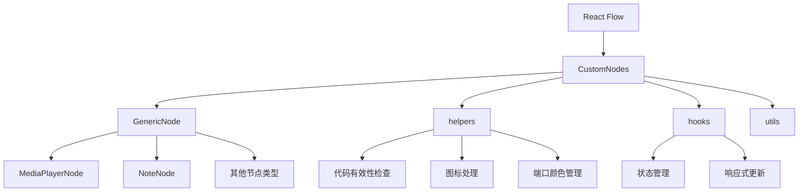

**图表来源**
- [GenericNode/index.tsx](file://vibe_surf/frontend/src/CustomNodes/GenericNode/index.tsx)
- [helpers/check-code-validity.ts](file://vibe_surf/frontend/src/CustomNodes/helpers/check-code-validity.ts)
- [hooks/use-update-node-code.ts](file://vibe_surf/frontend/src/CustomNodes/hooks/use-update-node-code.ts)

## 详细组件分析
本文档对VibeSurf可视化节点架构中的关键组件进行深入分析，包括基础节点模板GenericNode的设计与实现，特定节点类型MediaPlayerNode和NoteNode的扩展机制，以及支撑整个架构的辅助函数和自定义Hook。

### GenericNode分析
GenericNode是VibeSurf可视化节点架构的基础模板，采用组件化设计模式，将节点的不同功能模块分解为独立的可复用组件。这种设计提高了代码的可维护性和可扩展性，使得新节点类型的开发更加高效。

#### 组件化结构
GenericNode通过导入和组合多个子组件来构建完整的节点UI，每个子组件负责特定的功能：

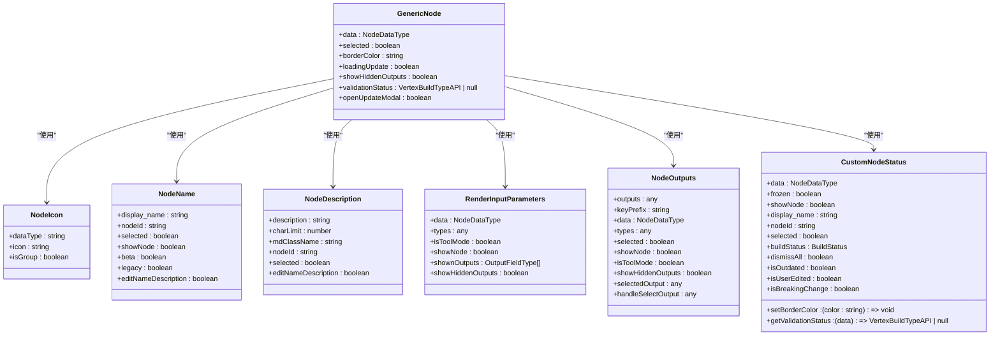

**图表来源**
- [GenericNode/index.tsx](file://vibe_surf/frontend/src/CustomNodes/GenericNode/index.tsx)
- [GenericNode/components/nodeIcon/index.tsx](file://vibe_surf/frontend/src/CustomNodes/GenericNode/components/nodeIcon/index.tsx)
- [GenericNode/components/NodeName/index.tsx](file://vibe_surf/frontend/src/CustomNodes/GenericNode/components/NodeName/index.tsx)
- [GenericNode/components/NodeDescription/index.tsx](file://vibe_surf/frontend/src/CustomNodes/GenericNode/components/NodeDescription/index.tsx)
- [GenericNode/components/RenderInputParameters/index.tsx](file://vibe_surf/frontend/src/CustomNodes/GenericNode/components/RenderInputParameters/index.tsx)
- [GenericNode/components/NodeOutputParameter/NodeOutputs.tsx](file://vibe_surf/frontend/src/CustomNodes/GenericNode/components/NodeOutputParameter/NodeOutputs.tsx)
- [GenericNode/components/NodeStatus/index.tsx](file://vibe_surf/frontend/src/CustomNodes/GenericNode/components/NodeStatus/index.tsx)

#### 输入输出端口管理
GenericNode通过RenderInputParameters和NodeOutputs组件实现输入输出端口的管理。输入端口管理包括字段排序、工具模式处理和颜色管理，而输出端口管理则支持多输出选择和隐藏输出的显示控制。

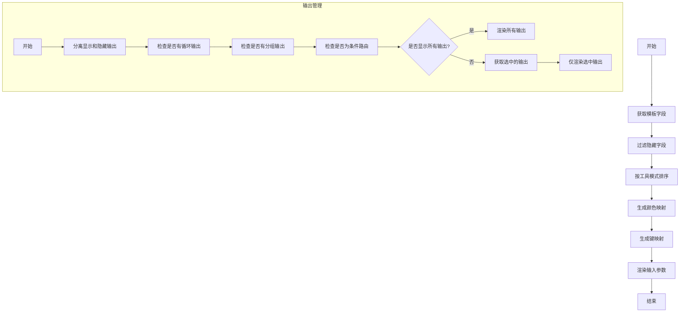

**图表来源**
- [GenericNode/components/RenderInputParameters/index.tsx](file://vibe_surf/frontend/src/CustomNodes/GenericNode/components/RenderInputParameters/index.tsx)
- [GenericNode/components/NodeOutputParameter/NodeOutputs.tsx](file://vibe_surf/frontend/src/CustomNodes/GenericNode/components/NodeOutputParameter/NodeOutputs.tsx)

#### 状态显示和交互逻辑
GenericNode的状态显示通过CustomNodeStatus组件实现，该组件集成了构建状态、验证状态和连接状态的显示。交互逻辑包括节点更新、代码验证、运行控制和连接管理等功能。

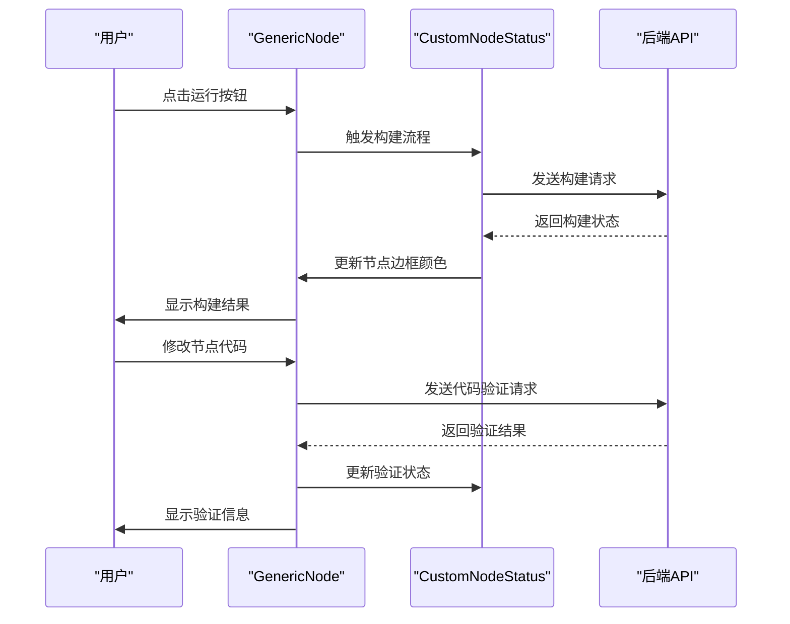

**图表来源**
- [GenericNode/index.tsx](file://vibe_surf/frontend/src/CustomNodes/GenericNode/index.tsx)
- [GenericNode/components/NodeStatus/index.tsx](file://vibe_surf/frontend/src/CustomNodes/GenericNode/components/NodeStatus/index.tsx)

### MediaPlayerNode分析
MediaPlayerNode是基于GenericNode扩展的特定节点类型，用于播放和显示媒体内容。该节点支持URL输入、手动调整尺寸和执行结果展示等功能。

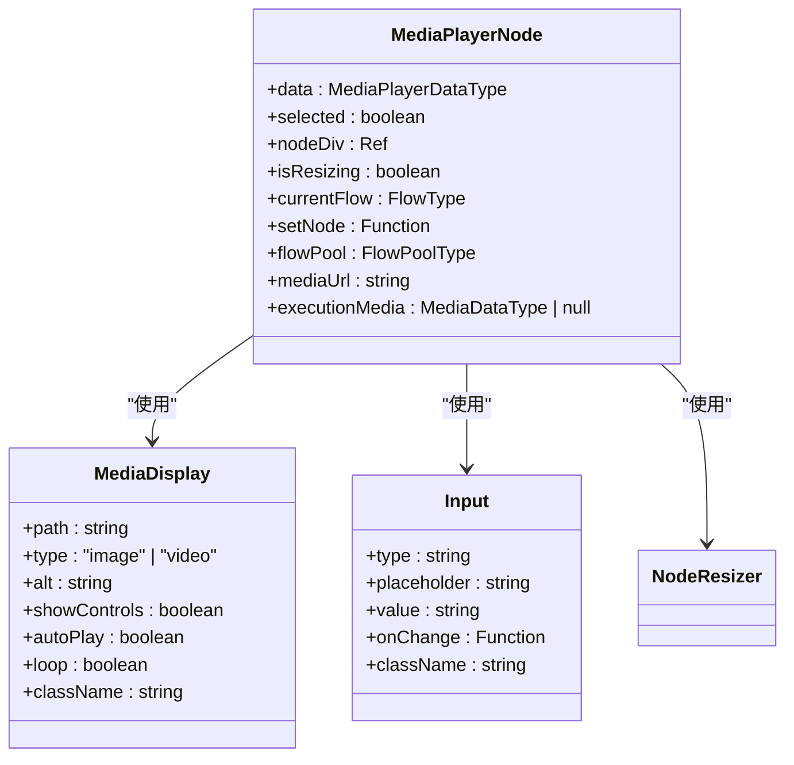

**图表来源**
- [MediaPlayerNode/index.tsx](file://vibe_surf/frontend/src/CustomNodes/MediaPlayerNode/index.tsx)
- [components/MediaDisplay.tsx](file://vibe_surf/frontend/src/components/MediaDisplay.tsx)

### NoteNode分析
NoteNode是基于GenericNode扩展的笔记节点，支持富文本编辑、颜色选择和尺寸调整等功能。该节点提供了一个类似便签的UI体验。

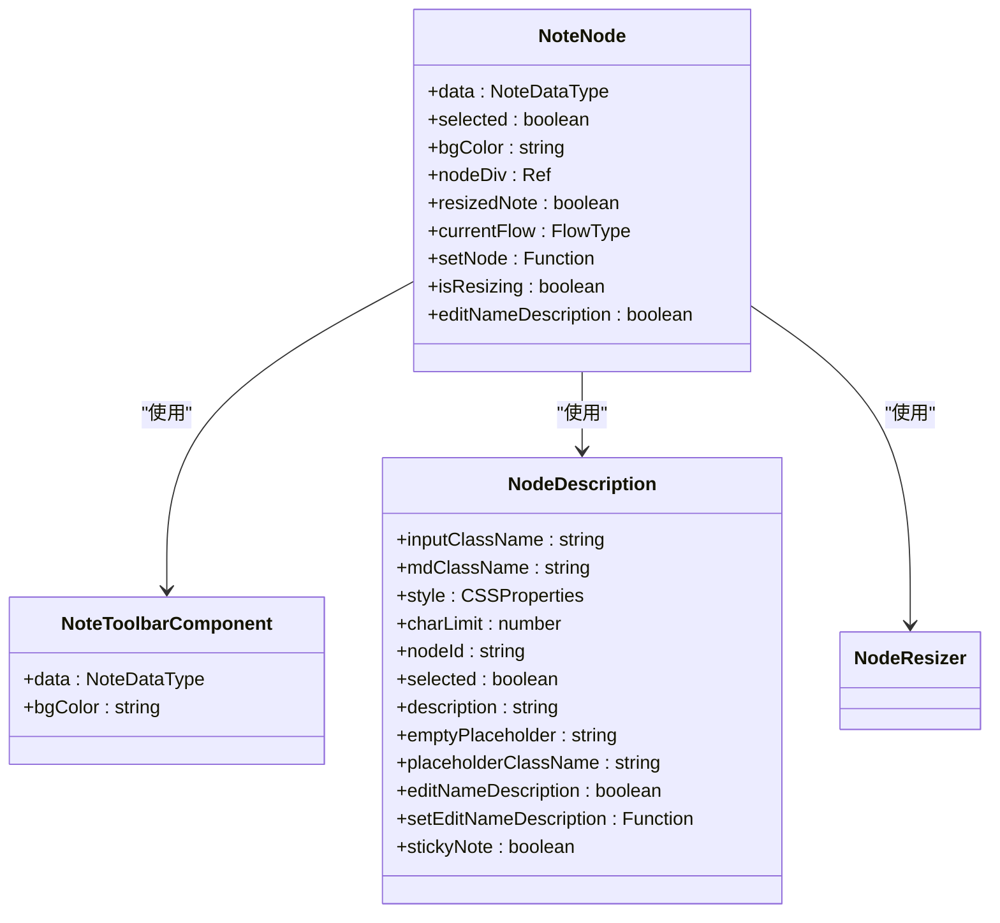

**图表来源**
- [NoteNode/index.tsx](file://vibe_surf/frontend/src/CustomNodes/NoteNode/index.tsx)
- [NoteNode/NoteToolbarComponent/index.tsx](file://vibe_surf/frontend/src/CustomNodes/NoteNode/NoteToolbarComponent/index.tsx)
- [GenericNode/components/NodeDescription/index.tsx](file://vibe_surf/frontend/src/CustomNodes/GenericNode/components/NodeDescription/index.tsx)

### 节点辅助函数分析
VibeSurf提供了多个辅助函数来支持节点的开发和维护，这些函数主要位于`helpers`目录下。

#### 代码有效性检查
`check-code-validity.ts`文件提供了代码有效性检查功能，用于判断节点代码是否过时或存在破坏性变更。

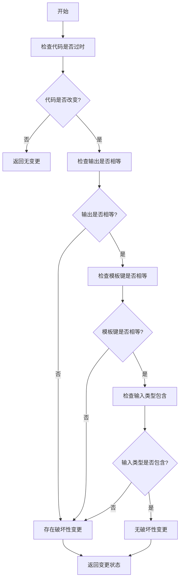

**图表来源**
- [helpers/check-code-validity.ts](file://vibe_surf/frontend/src/CustomNodes/helpers/check-code-validity.ts)

#### 图标处理
`check-lucide-icons.ts`文件提供了图标处理功能，用于验证图标名称的有效性。

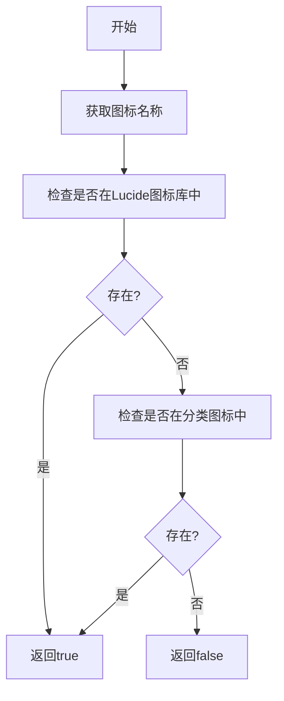

**图表来源**
- [helpers/check-lucide-icons.ts](file://vibe_surf/frontend/src/CustomNodes/helpers/check-lucide-icons.ts)

#### 端口颜色管理
`get-node-input-colors.ts`和`get-node-output-colors.ts`文件提供了端口颜色管理功能，根据端口类型和输入类型返回相应的颜色。

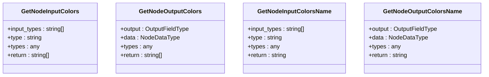

**图表来源**
- [helpers/get-node-input-colors.ts](file://vibe_surf/frontend/src/CustomNodes/helpers/get-node-input-colors.ts)
- [helpers/get-node-output-colors.ts](file://vibe_surf/frontend/src/CustomNodes/helpers/get-node-output-colors.ts)
- [helpers/get-node-input-colors-name.ts](file://vibe_surf/frontend/src/CustomNodes/helpers/get-node-input-colors-name.ts)
- [helpers/get-node-output-colors-name.ts](file://vibe_surf/frontend/src/CustomNodes/helpers/get-node-output-colors-name.ts)

### React Hooks分析
VibeSurf提供了多个自定义Hook来实现节点状态管理和响应式更新。

#### use-update-node-code
`use-update-node-code.ts`Hook用于更新节点代码，处理节点模板、输出和内部状态的更新。

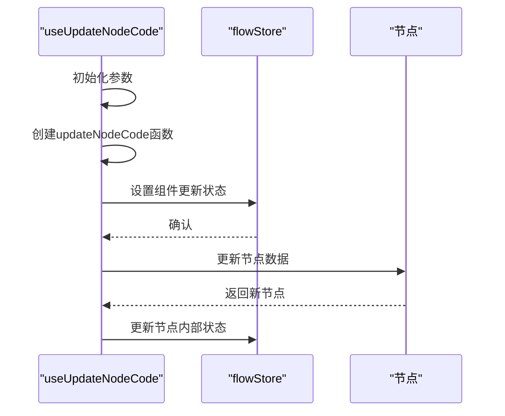

**图表来源**
- [hooks/use-update-node-code.ts](file://vibe_surf/frontend/src/CustomNodes/hooks/use-update-node-code.ts)

#### use-validation-status-string
`use-validation-status-string.ts`Hook用于处理验证状态字符串，将验证结果转换为可显示的字符串。

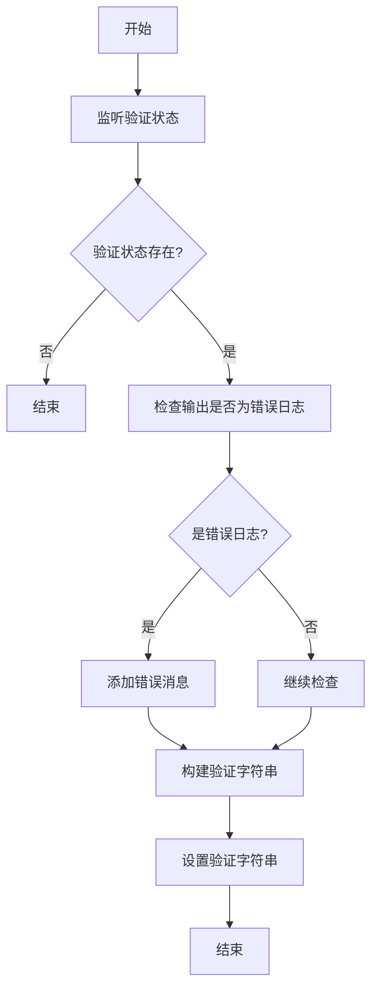

**图表来源**
- [hooks/use-validation-status-string.ts](file://vibe_surf/frontend/src/CustomNodes/hooks/use-validation-status-string.ts)

## 依赖分析
VibeSurf可视化节点架构依赖于多个外部库和内部模块，这些依赖关系确保了架构的完整性和功能性。

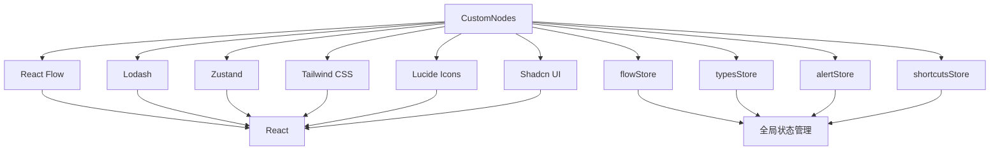

**图表来源**
- [GenericNode/index.tsx](file://vibe_surf/frontend/src/CustomNodes/GenericNode/index.tsx)
- [package.json](file://vibe_surf/frontend/package.json)

## 性能考虑
VibeSurf可视化节点架构在设计时考虑了性能优化，通过多种技术手段确保了良好的用户体验。

1. **组件记忆化**: 使用`memo`高阶组件对频繁渲染的子组件进行记忆化，避免不必要的重新渲染。
2. **状态优化**: 使用`useShallow`钩子进行浅比较，减少状态更新时的不必要渲染。
3. **防抖处理**: 对频繁触发的操作（如调整节点大小）使用`debounce`进行防抖处理，减少API调用频率。
4. **懒加载**: 对图标等资源使用动态导入，实现按需加载，减少初始加载时间。
5. **虚拟滚动**: 对长列表使用虚拟滚动技术，只渲染可见区域的内容，提高渲染性能。

## 故障排除指南
当遇到VibeSurf可视化节点相关问题时，可以参考以下故障排除步骤：

1. **节点不显示**: 检查节点模板是否存在，确保`data.node!.template`不为空。
2. **代码更新失败**: 检查组件是否在忽略更新列表中，确认代码变更是否包含破坏性变更。
3. **连接问题**: 检查认证信息是否正确，确认OAuth流程是否正常完成。
4. **性能问题**: 检查是否有频繁的状态更新，确认是否需要添加记忆化或防抖处理。
5. **样式问题**: 检查Tailwind CSS类名是否正确，确认主题配置是否正确应用。

**章节来源**
- [GenericNode/index.tsx](file://vibe_surf/frontend/src/CustomNodes/GenericNode/index.tsx)
- [helpers/check-code-validity.ts](file://vibe_surf/frontend/src/CustomNodes/helpers/check-code-validity.ts)

## 结论
VibeSurf可视化节点架构通过精心设计的组件化结构和模块化架构，提供了一个强大而灵活的可视化编程平台。GenericNode作为基础模板，通过组合多个可复用的子组件实现了节点的基本功能。MediaPlayerNode和NoteNode等特定节点类型展示了如何基于基础模板进行功能扩展。辅助函数和自定义Hook为节点开发提供了必要的支持工具，使得新节点类型的开发更加高效。整体架构设计合理，性能优化到位，为用户提供了良好的使用体验。

## 附录

### 节点扩展开发指南
要创建新的节点类型，可以遵循以下步骤：

1. **创建新节点文件**: 在`CustomNodes`目录下创建新的节点文件，如`MyCustomNode/index.tsx`。
2. **继承GenericNode**: 基于GenericNode进行扩展，复用其基础功能。
3. **定义输入输出字段**: 在节点模板中定义所需的输入输出字段。
4. **集成自定义UI组件**: 根据需要集成自定义的UI组件，如表单、图表等。
5. **实现特定逻辑**: 添加节点特有的业务逻辑和交互功能。
6. **注册节点类型**: 在应用的节点注册系统中注册新的节点类型。

### 核心API参考
| API | 描述 | 参数 | 返回值 |
| --- | --- | --- | --- |
| `useUpdateNodeCode` | 更新节点代码 | dataId, dataNode, setNode, updateNodeInternals | updateNodeCode函数 |
| `checkCodeValidity` | 检查代码有效性 | data, templates | 包含outdated、breakingChange、userEdited的对象 |
| `useValidationStatusString` | 处理验证状态字符串 | validationStatus, setValidationString | 无 |

**章节来源**
- [hooks/use-update-node-code.ts](file://vibe_surf/frontend/src/CustomNodes/hooks/use-update-node-code.ts)
- [helpers/check-code-validity.ts](file://vibe_surf/frontend/src/CustomNodes/helpers/check-code-validity.ts)
- [hooks/use-validation-status-string.ts](file://vibe_surf/frontend/src/CustomNodes/hooks/use-validation-status-string.ts)