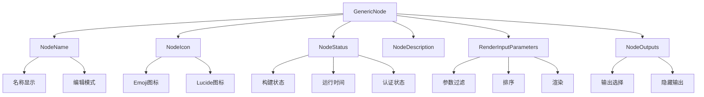
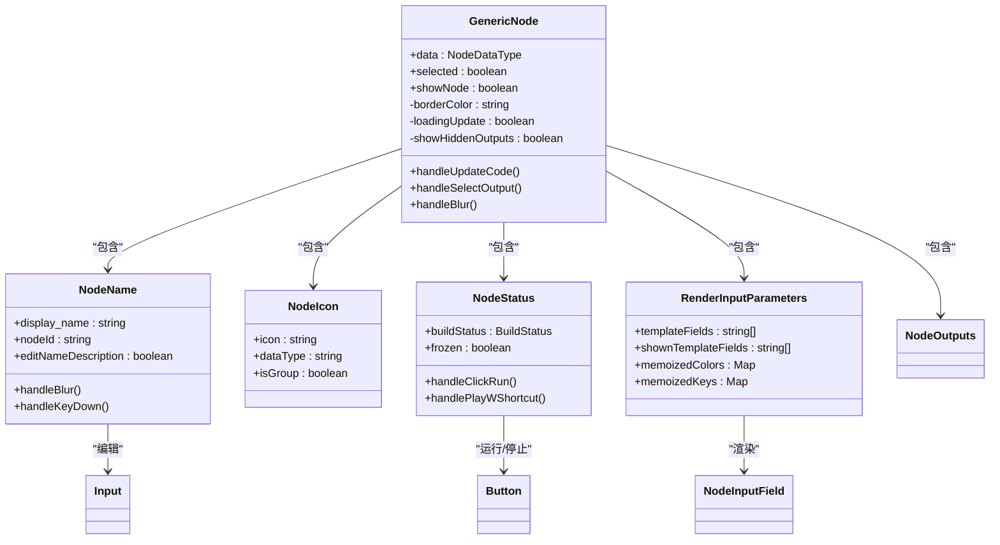

# 基础节点设计

<cite>
**本文档引用的文件**   
- [GenericNode/index.tsx](file://vibe_surf/frontend/src/CustomNodes/GenericNode/index.tsx)
- [GenericNode/components/NodeName/index.tsx](file://vibe_surf/frontend/src/CustomNodes/GenericNode/components/NodeName/index.tsx)
- [GenericNode/components/nodeIcon/index.tsx](file://vibe_surf/frontend/src/CustomNodes/GenericNode/components/nodeIcon/index.tsx)
- [GenericNode/components/NodeStatus/index.tsx](file://vibe_surf/frontend/src/CustomNodes/GenericNode/components/NodeStatus/index.tsx)
- [GenericNode/components/NodeOutputParameter/NodeOutputs.tsx](file://vibe_surf/frontend/src/CustomNodes/GenericNode/components/NodeOutputParameter/NodeOutputs.tsx)
- [GenericNode/components/RenderInputParameters/index.tsx](file://vibe_surf/frontend/src/CustomNodes/GenericNode/components/RenderInputParameters/index.tsx)
- [GenericNode/components/NodeDescription/index.tsx](file://vibe_surf/frontend/src/CustomNodes/GenericNode/components/NodeDescription/index.tsx)
- [GenericNode/hooks/use-get-build-status.ts](file://vibe_surf/frontend/src/CustomNodes/GenericNode/hooks/use-get-build-status.ts)
</cite>

## 目录
1. [简介](#简介)
2. [核心组件分析](#核心组件分析)
3. [节点UI布局系统](#节点ui布局系统)
4. [节点交互逻辑](#节点交互逻辑)
5. [样式系统与响应式设计](#样式系统与响应式设计)

## 简介
VibeSurf基础节点设计采用React组件架构，以GenericNode作为所有可视化节点的基础模板。该设计实现了灵活的节点输入输出端口管理、动态UI布局和丰富的交互功能，为可视化工作流提供了坚实的基础。

## 核心组件分析

### React组件结构
GenericNode采用函数式组件模式，通过组合多个子组件实现完整的节点功能。主要组件包括：
- **NodeName**: 节点名称显示和编辑组件
- **NodeIcon**: 节点图标渲染组件
- **NodeStatus**: 节点状态指示器
- **NodeDescription**: 节点描述信息组件
- **RenderInputParameters**: 输入参数渲染组件
- **NodeOutputs**: 输出端口渲染组件

这些组件通过props传递数据和回调函数，实现了高内聚低耦合的设计。

### Props接口定义
GenericNode的主要props接口定义如下：
- **data**: 包含节点数据的对象，类型为NodeDataType
- **selected**: 布尔值，表示节点是否被选中
- **showNode**: 布尔值，控制节点的显示状态

组件通过useMemo和useCallback等React Hooks优化性能，避免不必要的重新渲染。

### 状态管理机制
组件使用useState管理内部状态，包括：
- 边框颜色(borderColor)
- 更新加载状态(loadingUpdate)
- 隐藏输出显示状态(showHiddenOutputs)
- 验证状态(validationStatus)
- 更新模态框状态(openUpdateModal)

同时，通过Zustand状态管理库与全局状态(store)进行交互，如使用useFlowStore获取和更新节点状态。

### 节点输入输出端口管理
节点的输入输出端口通过动态生成和管理，实现了灵活的数据连接功能。

#### 端口颜色与类型
端口颜色和类型通过getNodeInputColors和getNodeInputColorsName辅助函数确定，根据输入类型(input_types)和字段类型(type)映射到相应的CSS类名。

#### 端口连接逻辑
输出端口的连接逻辑在handleSelectOutput回调函数中实现：
1. 当用户选择输出端口时，更新边(edge)的sourceHandle属性
2. 更新节点数据中的selected_output字段
3. 触发节点内部更新(useUpdateNodeInternals)

对于隐藏的输出端口，组件通过hiddenOutputs状态管理，并提供切换按钮控制显示/隐藏状态。

**Section sources**
- [GenericNode/index.tsx](file://vibe_surf/frontend/src/CustomNodes/GenericNode/index.tsx#L70-L749)
- [GenericNode/components/NodeOutputParameter/NodeOutputs.tsx](file://vibe_surf/frontend/src/CustomNodes/GenericNode/components/NodeOutputParameter/NodeOutputs.tsx#L1-L121)
- [GenericNode/components/RenderInputParameters/index.tsx](file://vibe_surf/frontend/src/CustomNodes/GenericNode/components/RenderInputParameters/index.tsx#L1-L130)

## 节点UI布局系统

### 标题区域
标题区域由NodeName组件实现，包含：
- 节点图标
- 节点名称
- Beta/Legacy标签
- 名称编辑功能

当处于编辑模式时，显示输入框允许用户修改节点名称。

### 图标系统
NodeIcon组件负责渲染节点图标，支持多种图标类型：
- Emoji图标
- Lucide图标
- 自定义图标

图标选择逻辑优先使用节点定义的icon属性，否则根据节点类型(dataType)选择默认图标。

### 参数区域
输入参数区域由RenderInputParameters组件渲染，实现逻辑如下：
1. 过滤模板字段，排除以"_"开头的字段
2. 根据field_order和tool_mode对字段进行排序
3. 仅显示show=true且非高级(advanced)的字段
4. 为每个字段创建NodeInputField组件

参数区域支持工具模式(tool_mode)，可隐藏特定字段。

### 状态指示器
NodeStatus组件提供丰富的状态反馈：
- 构建状态(BuildStatus)显示
- 运行时间显示
- 认证连接状态
- 运行/停止按钮

状态指示器根据构建状态动态改变边框颜色，并提供工具提示显示详细信息。

**Diagram sources**
- [GenericNode/index.tsx](file://vibe_surf/frontend/src/CustomNodes/GenericNode/index.tsx#L70-L749)
- [GenericNode/components/NodeName/index.tsx](file://vibe_surf/frontend/src/CustomNodes/GenericNode/components/NodeName/index.tsx#L1-L127)
- [GenericNode/components/nodeIcon/index.tsx](file://vibe_surf/frontend/src/CustomNodes/GenericNode/components/nodeIcon/index.tsx#L1-L50)
- [GenericNode/components/NodeStatus/index.tsx](file://vibe_surf/frontend/src/CustomNodes/GenericNode/components/NodeStatus/index.tsx#L1-L499)

**Section sources**
- [GenericNode/index.tsx](file://vibe_surf/frontend/src/CustomNodes/GenericNode/index.tsx#L70-L749)
- [GenericNode/components/NodeName/index.tsx](file://vibe_surf/frontend/src/CustomNodes/GenericNode/components/NodeName/index.tsx#L1-L127)
- [GenericNode/components/nodeIcon/index.tsx](file://vibe_surf/frontend/src/CustomNodes/GenericNode/components/nodeIcon/index.tsx#L1-L50)
- [GenericNode/components/NodeStatus/index.tsx](file://vibe_surf/frontend/src/CustomNodes/GenericNode/components/NodeStatus/index.tsx#L1-L499)
- [GenericNode/components/NodeDescription/index.tsx](file://vibe_surf/frontend/src/CustomNodes/GenericNode/components/NodeDescription/index.tsx#L1-L202)

## 节点交互逻辑

### 拖拽与选择
节点通过React Flow库的内置功能支持拖拽操作。选择状态通过selected prop传递，影响节点的视觉样式和可用操作。

### 编辑操作
节点提供多种编辑功能：
- **名称编辑**: 点击铅笔图标进入编辑模式
- **描述编辑**: 双击描述区域进入编辑模式
- **参数编辑**: 在参数区域直接输入值

编辑操作通过useChangeOnUnfocus Hook管理，当用户失焦时自动保存更改。

### 删除操作
删除功能通过NodeToolbarComponent提供，调用deleteNode函数从流程中移除节点，并触发快照保存。

### 更新操作
节点更新逻辑在handleUpdateCode函数中实现：
1. 检查是否有破坏性变更(hasBreakingChange)
2. 如有变更，显示更新确认模态框
3. 调用validateComponentCode API验证新代码
4. 更新节点代码并重建

快捷键支持通过useHotkeys Hook实现，允许用户通过键盘快捷方式执行更新。

**Section sources**
- [GenericNode/index.tsx](file://vibe_surf/frontend/src/CustomNodes/GenericNode/index.tsx#L70-L749)
- [GenericNode/components/NodeName/index.tsx](file://vibe_surf/frontend/src/CustomNodes/GenericNode/components/NodeName/index.tsx#L1-L127)
- [GenericNode/components/NodeDescription/index.tsx](file://vibe_surf/frontend/src/CustomNodes/GenericNode/components/NodeDescription/index.tsx#L1-L202)

## 样式系统与响应式设计

### CSS变量与Tailwind CSS
组件样式系统基于Tailwind CSS框架，结合CSS变量实现主题化：
- 使用cn工具函数合并CSS类名
- 通过data-testid属性支持测试
- 利用Tailwind的响应式前缀实现自适应布局

### 主题化实现
通过CSS变量和条件类名实现主题切换：
- 边框颜色根据构建状态动态变化
- 悬停效果使用group-hover类
- 状态指示器使用语义化颜色类

### 响应式设计
节点布局支持两种显示模式：
- **紧凑模式**: 宽度48，显示核心信息
- **展开模式**: 宽度80，显示完整信息

媒体查询和flex布局确保在不同屏幕尺寸下的良好显示效果。

### 实际使用示例
配置基础节点的基本步骤：
1. 定义节点数据结构，包含type、display_name等属性
2. 设置模板(template)定义输入输出参数
3. 通过data prop传递节点数据
4. 根据需要配置显示选项(showNode)

**Diagram sources**
- [GenericNode/index.tsx](file://vibe_surf/frontend/src/CustomNodes/GenericNode/index.tsx#L70-L749)
- [GenericNode/components/NodeName/index.tsx](file://vibe_surf/frontend/src/CustomNodes/GenericNode/components/NodeName/index.tsx#L1-L127)
- [GenericNode/components/nodeIcon/index.tsx](file://vibe_surf/frontend/src/CustomNodes/GenericNode/components/nodeIcon/index.tsx#L1-L50)
- [GenericNode/components/NodeStatus/index.tsx](file://vibe_surf/frontend/src/CustomNodes/GenericNode/components/NodeStatus/index.tsx#L1-L499)
- [GenericNode/components/RenderInputParameters/index.tsx](file://vibe_surf/frontend/src/CustomNodes/GenericNode/components/RenderInputParameters/index.tsx#L1-L130)

**Section sources**
- [GenericNode/index.tsx](file://vibe_surf/frontend/src/CustomNodes/GenericNode/index.tsx#L70-L749)
- [GenericNode/components/NodeName/index.tsx](file://vibe_surf/frontend/src/CustomNodes/GenericNode/components/NodeName/index.tsx#L1-L127)
- [GenericNode/components/nodeIcon/index.tsx](file://vibe_surf/frontend/src/CustomNodes/GenericNode/components/nodeIcon/index.tsx#L1-L50)
- [GenericNode/components/NodeStatus/index.tsx](file://vibe_surf/frontend/src/CustomNodes/GenericNode/components/NodeStatus/index.tsx#L1-L499)
- [GenericNode/components/RenderInputParameters/index.tsx](file://vibe_surf/frontend/src/CustomNodes/GenericNode/components/RenderInputParameters/index.tsx#L1-L130)