# 特定节点实现

<cite>
**本文档引用的文件**
- [MediaPlayerNode/index.tsx](file://vibe_surf/frontend/src/CustomNodes/MediaPlayerNode/index.tsx)
- [NoteNode/index.tsx](file://vibe_surf/frontend/src/CustomNodes/NoteNode/index.tsx)
- [GenericNode/index.tsx](file://vibe_surf/frontend/src/CustomNodes/GenericNode/index.tsx)
- [constants.ts](file://vibe_surf/frontend/src/constants/constants.ts)
- [schema.py](file://vibe_surf/langflow/graph/vertex/schema.py)
- [PageComponent/index.tsx](file://vibe_surf/frontend/src/pages/FlowPage/components/PageComponent/index.tsx)
- [flowStore.ts](file://vibe_surf/frontend/src/stores/flowStore.ts)
</cite>

## 目录
1. [引言](#引言)
2. [基础节点架构](#基础节点架构)
3. [MediaPlayerNode 实现](#mediaplayernode-实现)
4. [NoteNode 实现](#notenode-实现)
5. [节点类型注册与使用](#节点类型注册与使用)
6. [工作流集成](#工作流集成)

## 引言
本文档详细阐述了VibeSurf项目中特定节点类型的实现机制，重点分析MediaPlayerNode和NoteNode如何继承和扩展GenericNode基础功能。文档将深入探讨这些特定节点的扩展实现机制，包括媒体播放控制、富文本编辑等特性，以及它们在工作流中的使用方式。

## 基础节点架构
VibeSurf项目中的节点系统基于React Flow库构建，采用分层架构设计。所有特定节点类型都继承自GenericNode基础组件，通过扩展和定制实现特定功能。

GenericNode作为所有节点类型的基础，提供了核心功能和通用UI组件，包括：
- 节点状态管理
- 输入输出参数处理
- 工具栏和上下文菜单
- 节点大小调整和位置管理
- 错误处理和验证机制

节点类型通过枚举定义，确保类型安全和一致性：
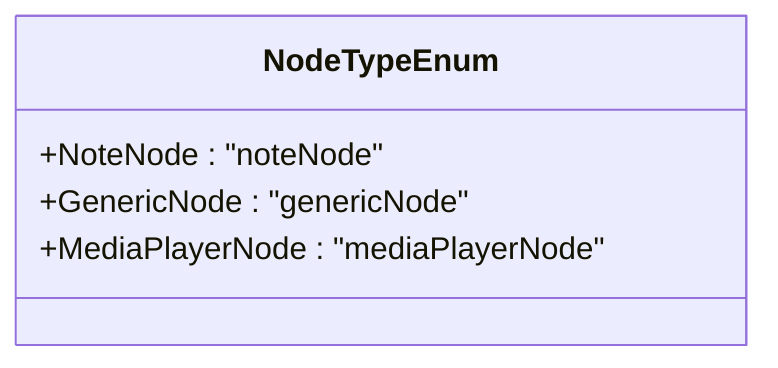

**Diagram sources**
- [schema.py](file://vibe_surf/langflow/graph/vertex/schema.py#L6-L9)

**Section sources**
- [schema.py](file://vibe_surf/langflow/graph/vertex/schema.py#L6-L9)
- [GenericNode/index.tsx](file://vibe_surf/frontend/src/CustomNodes/GenericNode/index.tsx)

## MediaPlayerNode 实现
MediaPlayerNode是GenericNode的特定扩展，专注于媒体内容的显示和控制。它继承了GenericNode的基础功能，并添加了媒体播放特有的特性。

### 媒体播放控制
MediaPlayerNode实现了完整的媒体播放控制功能，包括：
- URL输入和验证
- 自动媒体类型检测
- 执行结果显示

节点通过监听flowPool状态来获取执行结果，并自动显示媒体内容：
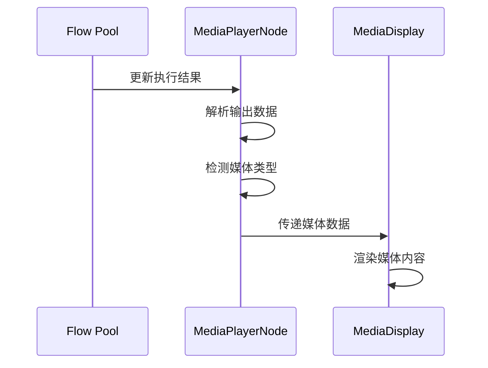

**Diagram sources**
- [MediaPlayerNode/index.tsx](file://vibe_surf/frontend/src/CustomNodes/MediaPlayerNode/index.tsx#L68-L116)
- [MediaDisplay](file://vibe_surf/frontend/src/components/MediaDisplay)

### 进度条显示与音视频格式支持
MediaPlayerNode支持多种音视频格式，通过URL扩展名自动检测媒体类型：
- 图像格式：jpg, jpeg, png, gif, bmp, webp, svg
- 视频格式：mp4, avi, mov, wmv, webm, mkv

节点实现了智能媒体类型检测逻辑，确保正确渲染不同类型的媒体内容：
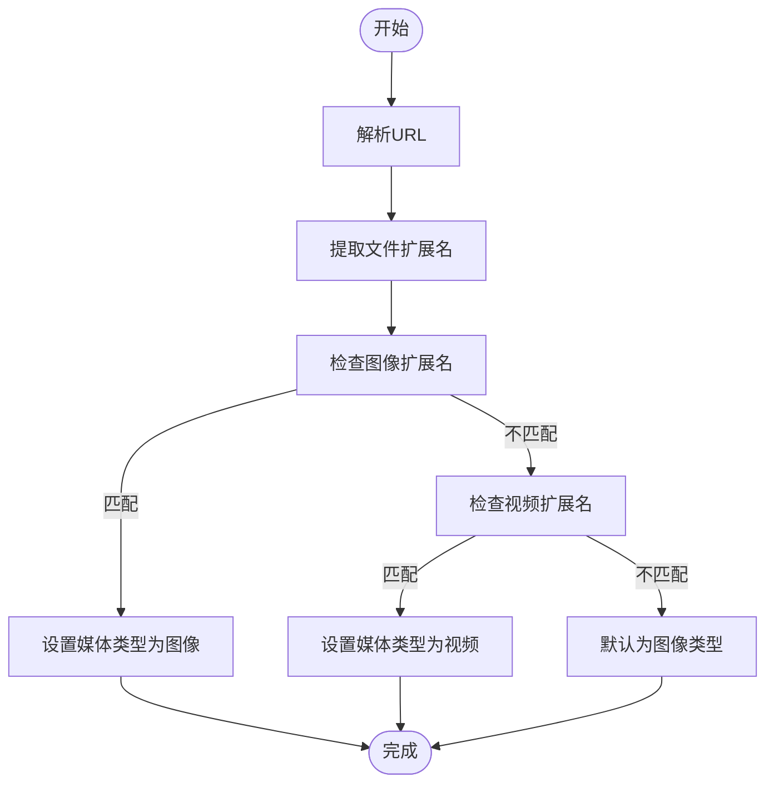

**Diagram sources**
- [MediaPlayerNode/index.tsx](file://vibe_surf/frontend/src/CustomNodes/MediaPlayerNode/index.tsx#L123-L138)

### 输入输出接口与参数配置
MediaPlayerNode定义了独特的输入输出接口：
- 输入：媒体URL字符串
- 输出：媒体执行结果（包含路径、类型、控制选项等）

参数配置通过节点数据结构实现，支持动态调整：
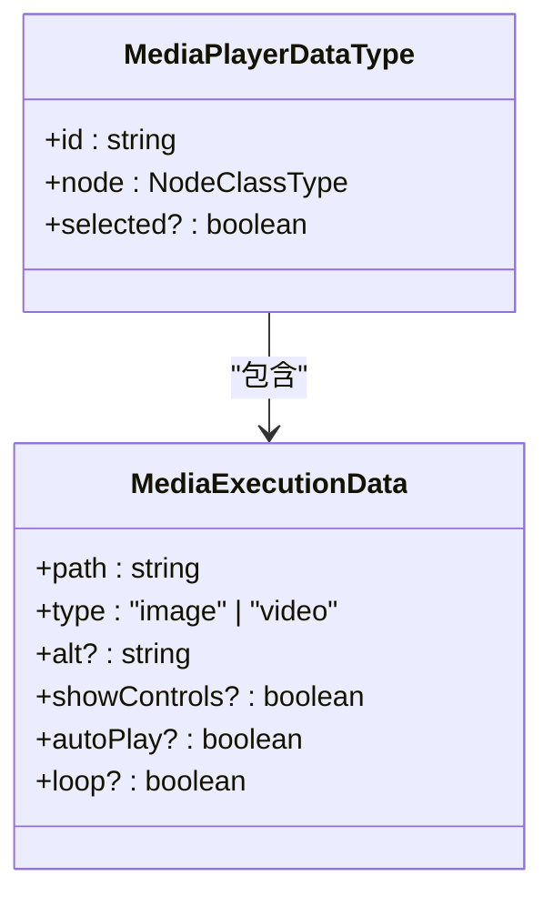

**Diagram sources**
- [MediaPlayerNode/index.tsx](file://vibe_surf/frontend/src/CustomNodes/MediaPlayerNode/index.tsx#L29-L37)
- [flowStore.ts](file://vibe_surf/frontend/src/stores/flowStore.ts)

**Section sources**
- [MediaPlayerNode/index.tsx](file://vibe_surf/frontend/src/CustomNodes/MediaPlayerNode/index.tsx)
- [constants.ts](file://vibe_surf/frontend/src/constants/constants.ts)

## NoteNode 实现
NoteNode是另一个GenericNode的特定扩展，专注于富文本编辑和笔记管理功能。

### 富文本编辑与笔记工具栏
NoteNode提供了完整的富文本编辑功能，包括：
- Markdown支持
- 字符数限制（2500字符）
- 颜色主题选择

工具栏组件在节点选中时显示，提供便捷的操作入口：
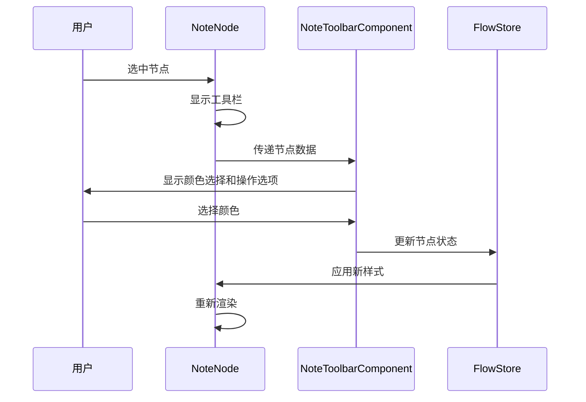

**Diagram sources**
- [NoteNode/index.tsx](file://vibe_surf/frontend/src/CustomNodes/NoteNode/index.tsx#L75-L85)
- [NoteToolbarComponent/index.tsx](file://vibe_surf/frontend/src/CustomNodes/NoteNode/NoteToolbarComponent/index.tsx)

### 内容保存与版本管理
NoteNode实现了内容保存和版本管理功能，通过以下机制确保数据持久化：
- 自动保存机制
- 状态变更监听
- 快照管理

节点使用防抖技术优化性能，避免频繁的状态更新：
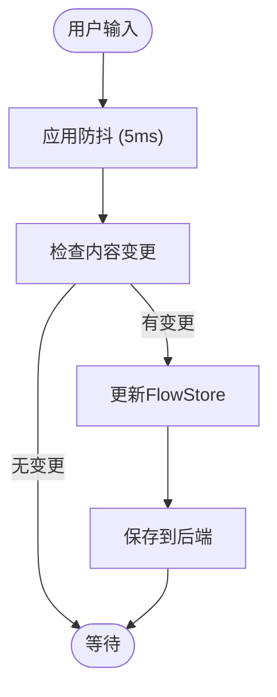

**Diagram sources**
- [NoteNode/index.tsx](file://vibe_surf/frontend/src/CustomNodes/NoteNode/index.tsx#L59-L71)

### 输入输出接口与参数配置
NoteNode定义了独特的输入输出接口和参数配置：
- 输入：笔记内容、背景颜色
- 输出：编辑后的文本内容

参数配置通过模板系统实现，支持灵活的样式定制：
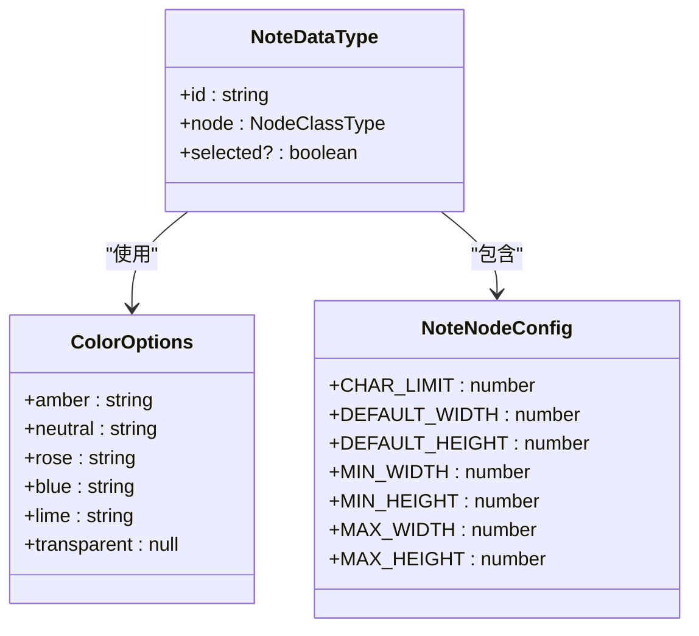

**Diagram sources**
- [NoteNode/index.tsx](file://vibe_surf/frontend/src/CustomNodes/NoteNode/index.tsx)
- [constants.ts](file://vibe_surf/frontend/src/constants/constants.ts#L1003-L1015)

**Section sources**
- [NoteNode/index.tsx](file://vibe_surf/frontend/src/CustomNodes/NoteNode/index.tsx)
- [NoteToolbarComponent/index.tsx](file://vibe_surf/frontend/src/CustomNodes/NoteNode/NoteToolbarComponent/index.tsx)
- [constants.ts](file://vibe_surf/frontend/src/constants/constants.ts)

## 节点类型注册与使用
VibeSurf项目通过系统化的机制注册和使用特定节点类型，确保节点的可扩展性和一致性。

### 节点注册机制
节点类型通过枚举和类型系统进行注册，确保类型安全：
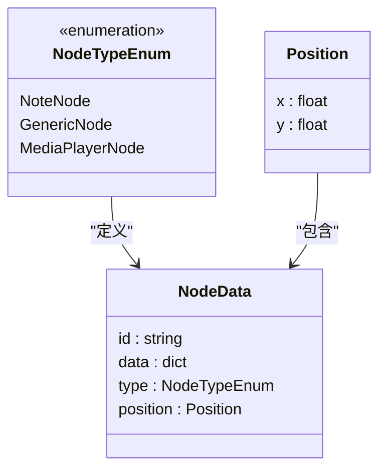

**Diagram sources**
- [schema.py](file://vibe_surf/langflow/graph/vertex/schema.py)

### 节点创建与初始化
节点创建通过PageComponent组件处理，支持动态添加不同类型的节点：
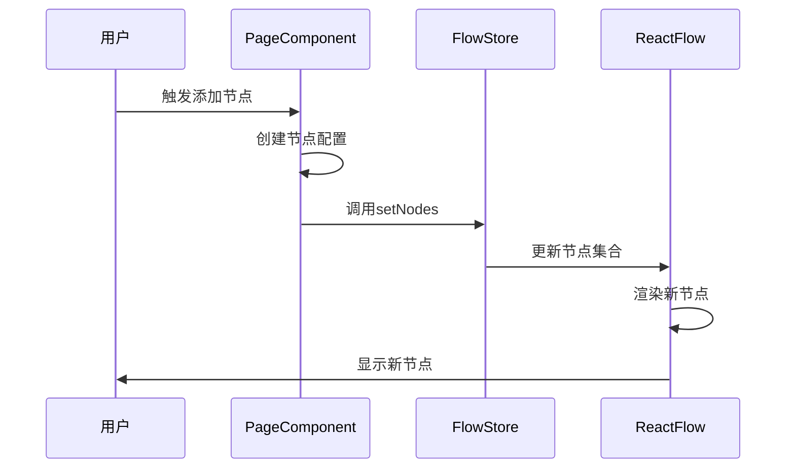

**Diagram sources**
- [PageComponent/index.tsx](file://vibe_surf/frontend/src/pages/FlowPage/components/PageComponent/index.tsx#611-658)
- [flowStore.ts](file://vibe_surf/frontend/src/stores/flowStore.ts#L276-L289)

### 状态管理与数据流
节点状态通过Zustand store进行管理，实现全局状态同步：
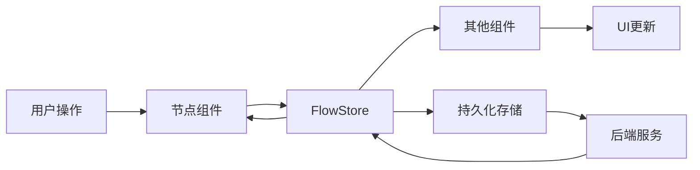

**Diagram sources**
- [flowStore.ts](file://vibe_surf/frontend/src/stores/flowStore.ts)
- [useFlowStore](file://vibe_surf/frontend/src/stores/flowStore.ts)

**Section sources**
- [PageComponent/index.tsx](file://vibe_surf/frontend/src/pages/FlowPage/components/PageComponent/index.tsx)
- [flowStore.ts](file://vibe_surf/frontend/src/stores/flowStore.ts)

## 工作流集成
特定节点通过React Flow API集成到可视化编辑器中，实现无缝的工作流体验。

### React Flow API 集成
节点通过React Flow的标准API进行集成，包括：
- 节点渲染
- 边连接
- 交互处理

集成过程遵循标准模式，确保兼容性和可维护性：
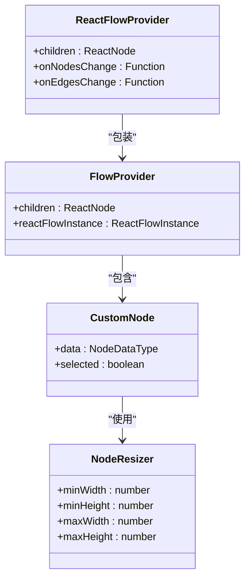

**Diagram sources**
- [MediaPlayerNode/index.tsx](file://vibe_surf/frontend/src/CustomNodes/MediaPlayerNode/index.tsx#L144-L162)
- [NoteNode/index.tsx](file://vibe_surf/frontend/src/CustomNodes/NoteNode/index.tsx#L89-L108)

### 具体使用示例
以下是特定节点在工作流中的使用示例：

**创建MediaPlayerNode:**
```typescript
const newNode: MediaPlayerNodeType = {
  id: newId,
  type: "mediaPlayerNode",
  position: position || { x: 0, y: 0 },
  data: {
    node: {
      description: "",
      display_name: "Media Player",
      documentation: "",
      template: {
        mediaUrl: { value: "" },
      },
    },
    type: "mediaPlayerNode",
    id: newId,
  },
};
setNodes((nds) => nds.concat(newNode));
```

**创建NoteNode:**
```typescript
const newNode: NoteNodeType = {
  id: newId,
  type: "noteNode",
  position: position || { x: 0, y: 0 },
  data: {
    ...data,
    id: newId,
  },
};
setNodes((nds) => nds.concat(newNode));
```

这些示例展示了如何通过标准API创建和添加特定节点到工作流中。

**Section sources**
- [PageComponent/index.tsx](file://vibe_surf/frontend/src/pages/FlowPage/components/PageComponent/index.tsx#611-658)
- [MediaPlayerNode/index.tsx](file://vibe_surf/frontend/src/CustomNodes/MediaPlayerNode/index.tsx)
- [NoteNode/index.tsx](file://vibe_surf/frontend/src/CustomNodes/NoteNode/index.tsx)