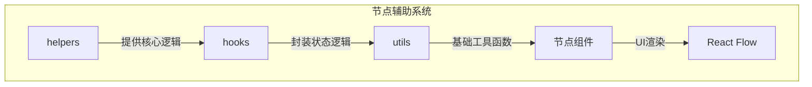
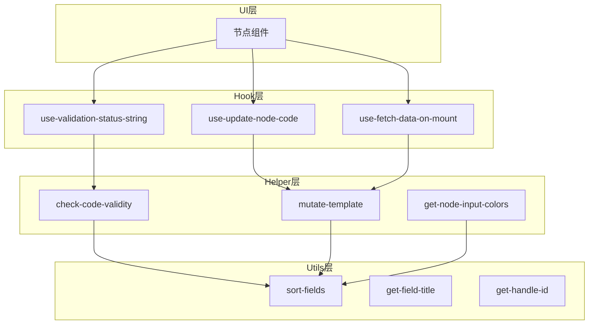
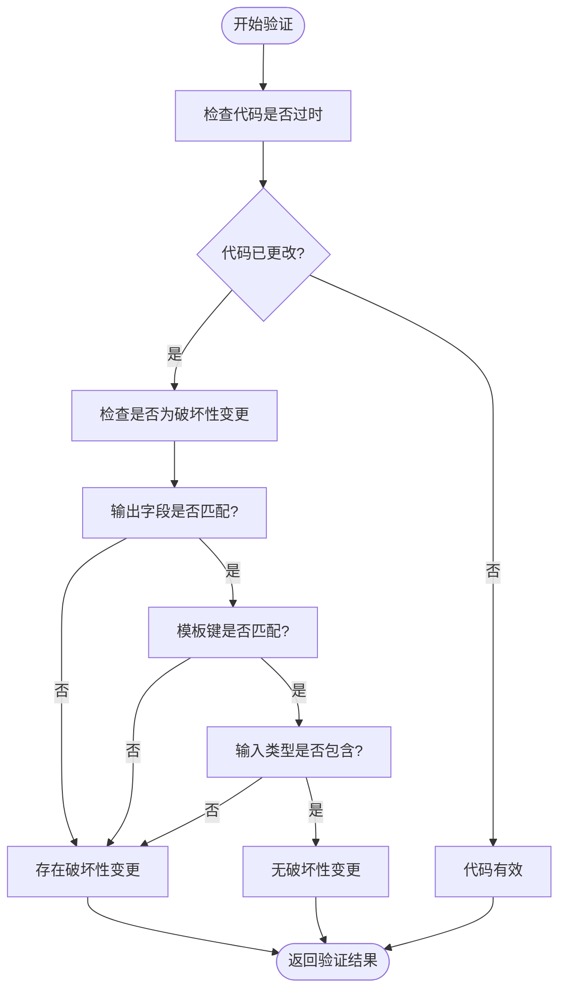
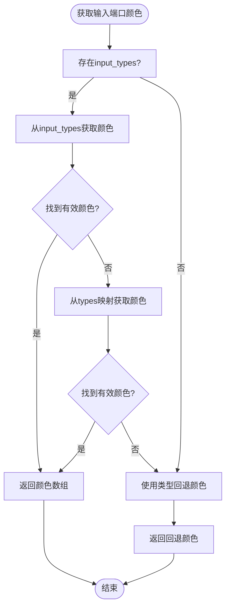
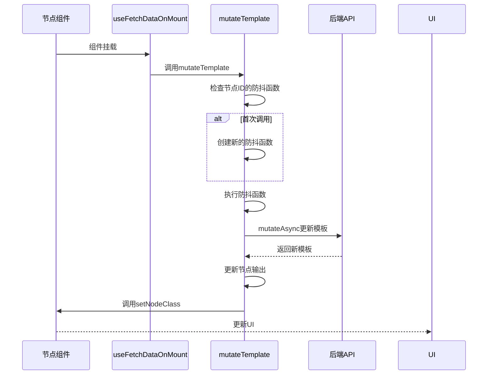
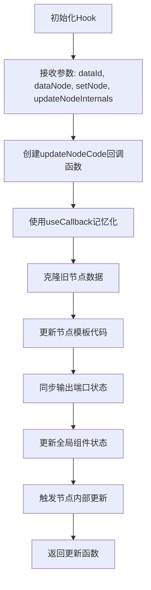
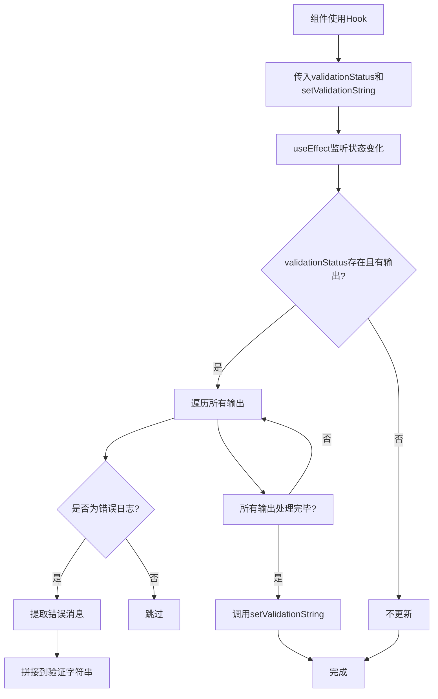
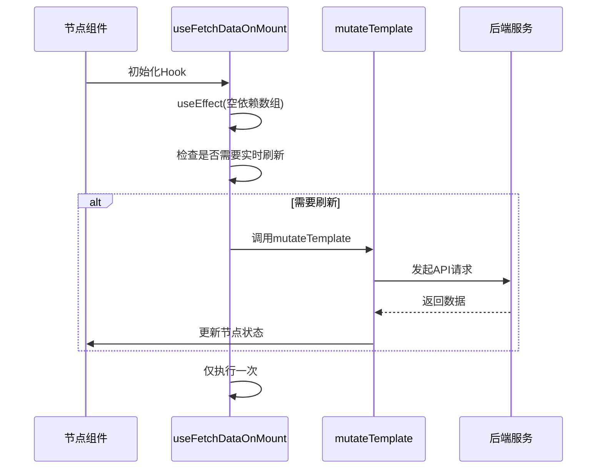
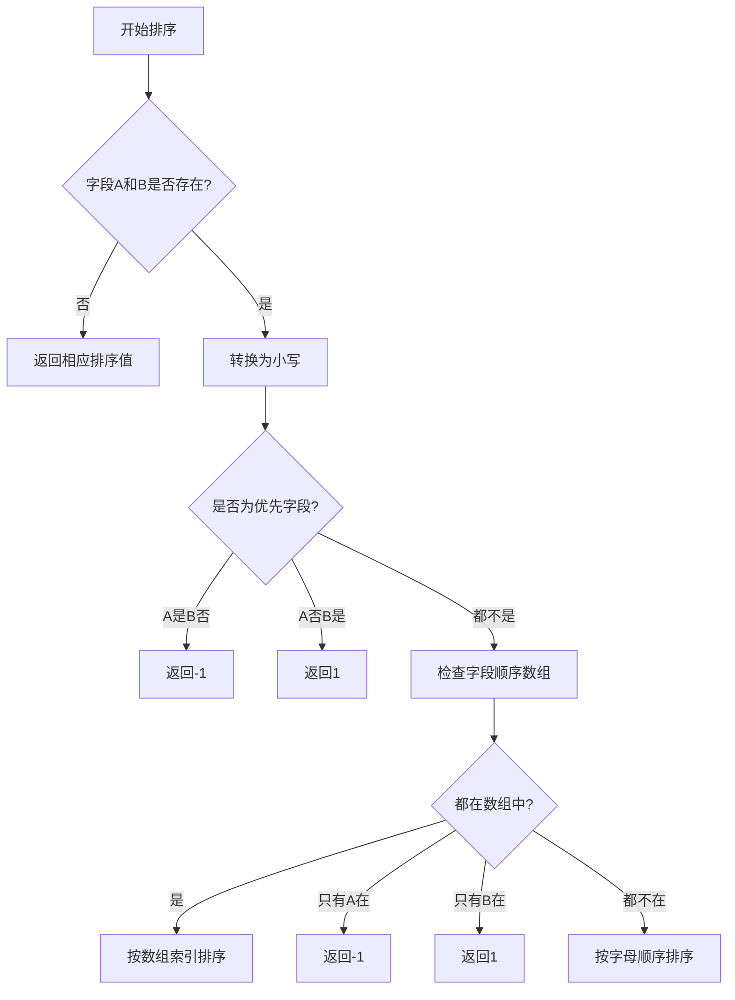
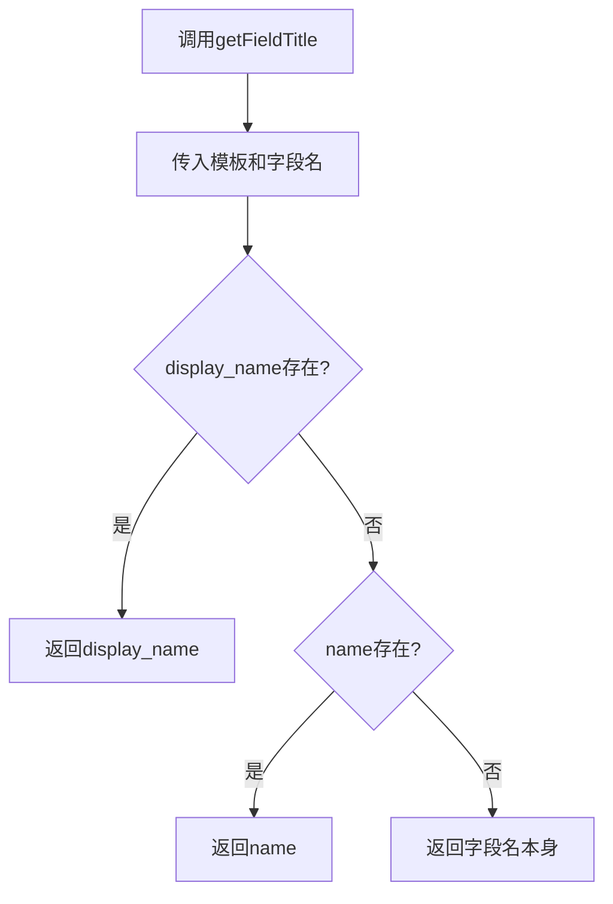

# 节点辅助系统

<cite>
**本文档中引用的文件**  
- [check-code-validity.ts](file://vibe_surf/frontend/src/CustomNodes/helpers/check-code-validity.ts)
- [get-node-input-colors.ts](file://vibe_surf/frontend/src/CustomNodes/helpers/get-node-input-colors.ts)
- [mutate-template.ts](file://vibe_surf/frontend/src/CustomNodes/helpers/mutate-template.ts)
- [use-update-node-code.ts](file://vibe_surf/frontend/src/CustomNodes/hooks/use-update-node-code.ts)
- [use-validation-status-string.ts](file://vibe_surf/frontend/src/CustomNodes/hooks/use-validation-status-string.ts)
- [use-fetch-data-on-mount.ts](file://vibe_surf/frontend/src/CustomNodes/hooks/use-fetch-data-on-mount.ts)
- [update-hidden-outputs.ts](file://vibe_surf/frontend/src/CustomNodes/helpers/update-hidden-outputs.ts)
- [sort-fields.tsx](file://vibe_surf/frontend/src/CustomNodes/utils/sort-fields.tsx)
- [get-field-title.tsx](file://vibe_surf/frontend/src/CustomNodes/utils/get-field-title.tsx)
- [get-handle-id.tsx](file://vibe_surf/frontend/src/CustomNodes/utils/get-handle-id.tsx)
- [process-node-advanced-fields.ts](file://vibe_surf/frontend/src/CustomNodes/helpers/process-node-advanced-fields.ts)
- [sort-tool-mode-field.ts](file://vibe_surf/frontend/src/CustomNodes/helpers/sort-tool-mode-field.ts)
- [count-handles.ts](file://vibe_surf/frontend/src/CustomNodes/helpers/count-handles.ts)
- [get-node-output-colors.ts](file://vibe_surf/frontend/src/CustomNodes/helpers/get-node-output-colors.ts)
</cite>

## 目录
1. [简介](#简介)
2. [项目结构](#项目结构)
3. [核心组件](#核心组件)
4. [架构概述](#架构概述)
5. [详细组件分析](#详细组件分析)
6. [依赖分析](#依赖分析)
7. [性能考虑](#性能考虑)
8. [故障排除指南](#故障排除指南)
9. [结论](#结论)

## 简介
本文档深入分析VibeSurf平台中节点辅助系统的实现机制，重点阐述`helpers`、`hooks`和`utils`三个核心目录下的工具函数与React Hooks。系统通过这些辅助组件实现节点状态管理、代码有效性验证、UI动态更新和数据流控制，为复杂节点行为提供底层支持。

## 项目结构
VibeSurf的节点辅助系统主要位于前端代码库的`CustomNodes`模块中，采用分层架构设计：



**Diagram sources**
- [helpers](file://vibe_surf/frontend/src/CustomNodes/helpers)
- [hooks](file://vibe_surf/frontend/src/CustomNodes/hooks)
- [utils](file://vibe_surf/frontend/src/CustomNodes/utils)

**Section sources**
- [project_structure](file://README.md)

## 核心组件
节点辅助系统由三大核心模块构成：`helpers`目录提供业务逻辑处理，`hooks`目录封装React状态管理，`utils`目录提供基础工具函数。这些组件协同工作，实现节点的动态行为管理和UI响应式更新。

**Section sources**
- [helpers](file://vibe_surf/frontend/src/CustomNodes/helpers)
- [hooks](file://vibe_surf/frontend/src/CustomNodes/hooks)
- [utils](file://vibe_surf/frontend/src/CustomNodes/utils)

## 架构概述
系统采用分层架构模式，各层职责分明：



**Diagram sources**
- [hooks](file://vibe_surf/frontend/src/CustomNodes/hooks)
- [helpers](file://vibe_surf/frontend/src/CustomNodes/helpers)
- [utils](file://vibe_surf/frontend/src/CustomNodes/utils)

## 详细组件分析

### 工具函数分析

#### 代码有效性检查
`check-code-validity.ts`模块提供节点代码状态验证功能，通过多维度比较判断节点是否需要更新：



**Diagram sources**
- [check-code-validity.ts](file://vibe_surf/frontend/src/CustomNodes/helpers/check-code-validity.ts)

**Section sources**
- [check-code-validity.ts](file://vibe_surf/frontend/src/CustomNodes/helpers/check-code-validity.ts)

#### 节点输入端口颜色管理
`get-node-input-colors.ts`模块根据节点类型和输入类型动态计算端口颜色：



**Diagram sources**
- [get-node-input-colors.ts](file://vibe_surf/frontend/src/CustomNodes/helpers/get-node-input-colors.ts)

**Section sources**
- [get-node-input-colors.ts](file://vibe_surf/frontend/src/CustomNodes/helpers/get-node-input-colors.ts)

#### 模板修改
`mutate-template.ts`模块实现模板数据的异步更新，包含防抖机制：



**Diagram sources**
- [mutate-template.ts](file://vibe_surf/frontend/src/CustomNodes/helpers/mutate-template.ts)
- [use-fetch-data-on-mount.ts](file://vibe_surf/frontend/src/CustomNodes/hooks/use-fetch-data-on-mount.ts)

**Section sources**
- [mutate-template.ts](file://vibe_surf/frontend/src/CustomNodes/helpers/mutate-template.ts)

### 自定义React Hooks分析

#### 节点代码更新
`use-update-node-code` Hook封装节点代码更新逻辑：



**Diagram sources**
- [use-update-node-code.ts](file://vibe_surf/frontend/src/CustomNodes/hooks/use-update-node-code.ts)

**Section sources**
- [use-update-node-code.ts](file://vibe_surf/frontend/src/CustomNodes/hooks/use-update-node-code.ts)

#### 验证状态字符串生成
`use-validation-status-string` Hook监听验证状态并生成错误信息字符串：



**Diagram sources**
- [use-validation-status-string.ts](file://vibe_surf/frontend/src/CustomNodes/hooks/use-validation-status-string.ts)

**Section sources**
- [use-validation-status-string.ts](file://vibe_surf/frontend/src/CustomNodes/hooks/use-validation-status-string.ts)

#### 组件挂载时数据获取
`use-fetch-data-on-mount` Hook在组件挂载时自动获取数据：



**Diagram sources**
- [use-fetch-data-on-mount.ts](file://vibe_surf/frontend/src/CustomNodes/hooks/use-fetch-data-on-mount.ts)

**Section sources**
- [use-fetch-data-on-mount.ts](file://vibe_surf/frontend/src/CustomNodes/hooks/use-fetch-data-on-mount.ts)

### 工具函数在参数处理中的作用

#### 字段排序
`sort-fields.tsx`模块实现字段的智能排序：



**Diagram sources**
- [sort-fields.tsx](file://vibe_surf/frontend/src/CustomNodes/utils/sort-fields.tsx)

**Section sources**
- [sort-fields.tsx](file://vibe_surf/frontend/src/CustomNodes/utils/sort-fields.tsx)

#### 字段标题获取
`get-field-title.tsx`模块获取字段的显示名称：



**Diagram sources**
- [get-field-title.tsx](file://vibe_surf/frontend/src/CustomNodes/utils/get-field-title.tsx)

**Section sources**
- [get-field-title.tsx](file://vibe_surf/frontend/src/CustomNodes/utils/get-field-title.tsx)

## 依赖分析
系统各组件间存在明确的依赖关系：

```mermaid
graph LR
A[节点组件] --> B[自定义Hooks]
B --> C[Helper函数]
C --> D[Utils工具]
D --> E[基础库]
subgraph "基础库"
E1[lodash]
E2[@tanstack/react-query]
E3[React]
end
subgraph "状态管理"
F[flowStore]
G[alertStore]
end
B --> F
C --> G
```

**Diagram sources**
- [package.json](file://vibe_surf/frontend/package.json)
- [flowStore.ts](file://vibe_surf/frontend/src/stores/flowStore.ts)
- [alertStore.ts](file://vibe_surf/frontend/src/stores/alertStore.ts)

**Section sources**
- [package.json](file://vibe_surf/frontend/package.json)

## 性能考虑
系统在设计时考虑了多项性能优化：

1. **防抖机制**：`mutate-template.ts`中的防抖确保频繁更新不会导致过多API调用
2. **记忆化**：React Hooks使用`useCallback`避免不必要的重新渲染
3. **条件渲染**：仅在必要时才获取和更新数据
4. **深克隆优化**：使用`lodash`的`cloneDeep`确保状态不可变性

## 故障排除指南
常见问题及解决方案：

**Section sources**
- [errors.ts](file://vibe_surf/frontend/src/types/api.ts)
- [logging.ts](file://vibe_surf/frontend/src/logger.ts)

## 结论
VibeSurf的节点辅助系统通过精心设计的分层架构，实现了节点行为的灵活管理和高效更新。`helpers`、`hooks`和`utils`三个模块各司其职，协同工作，为复杂节点提供了强大的底层支持。系统采用现代前端最佳实践，包括状态管理、防抖优化和响应式设计，确保了良好的用户体验和系统性能。