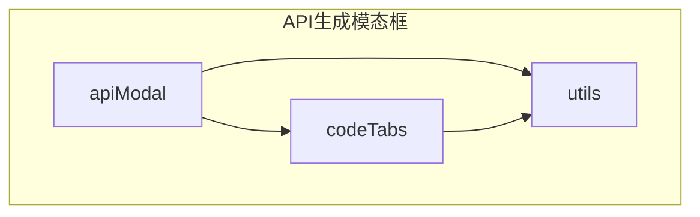
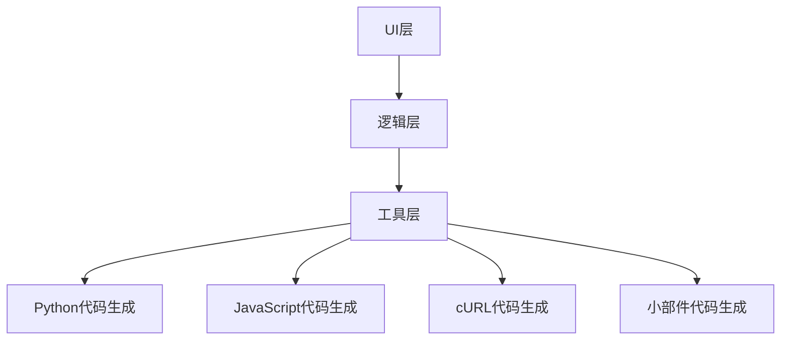
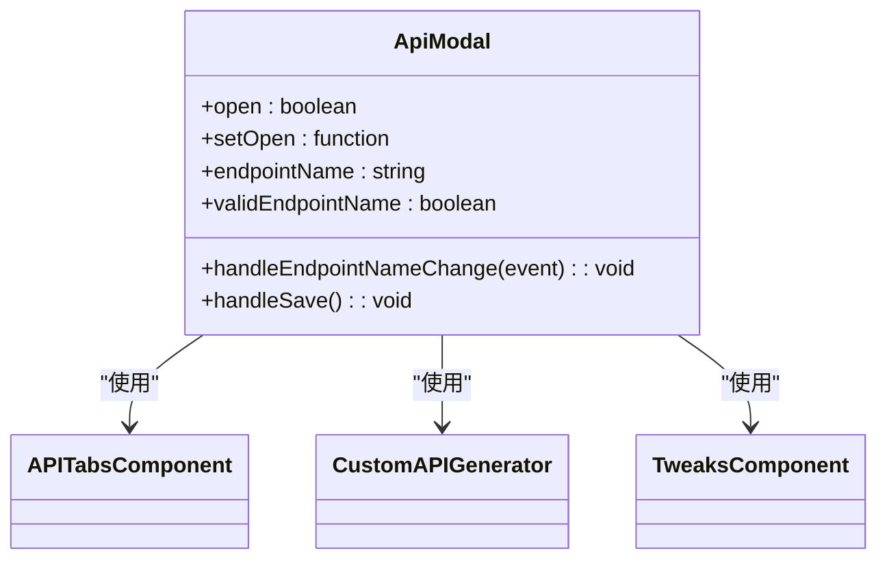
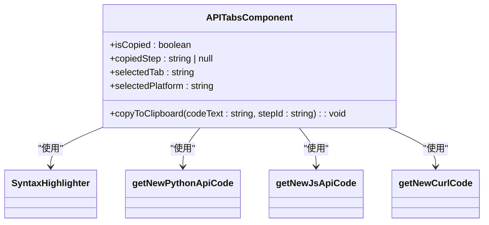
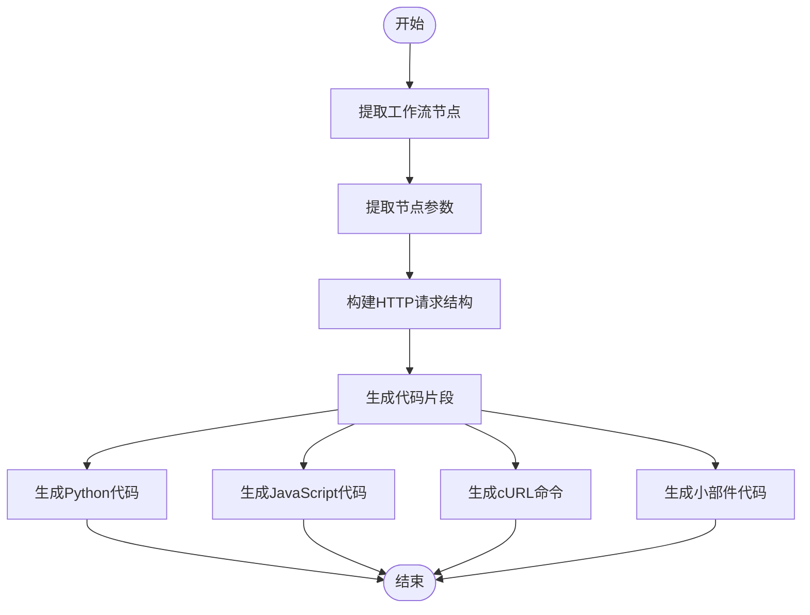
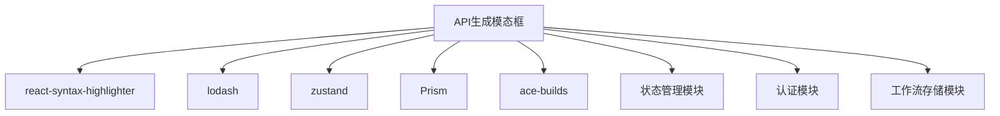

# API生成模态框

<cite>
**本文档引用的文件**
- [apiModal/index.tsx](file://vibe_surf/frontend/src/modals/apiModal/index.tsx)
- [codeTabs/code-tabs.tsx](file://vibe_surf/frontend/src/modals/apiModal/codeTabs/code-tabs.tsx)
- [utils/get-python-api-code.tsx](file://vibe_surf/frontend/src/modals/apiModal/utils/get-python-api-code.tsx)
- [utils/get-js-api-code.tsx](file://vibe_surf/frontend/src/modals/apiModal/utils/get-js-api-code.tsx)
- [utils/get-curl-code.tsx](file://vibe_surf/frontend/src/modals/apiModal/utils/get-curl-code.tsx)
- [utils/get-widget-code.tsx](file://vibe_surf/frontend/src/modals/apiModal/utils/get-widget-code.tsx)
- [utils/filter-tweaks.ts](file://vibe_surf/frontend/src/modals/apiModal/utils/filter-tweaks.ts)
</cite>

## 目录
1. [简介](#简介)
2. [项目结构](#项目结构)
3. [核心组件](#核心组件)
4. [架构概述](#架构概述)
5. [详细组件分析](#详细组件分析)
6. [依赖分析](#依赖分析)
7. [性能考虑](#性能考虑)
8. [故障排除指南](#故障排除指南)
9. [结论](#结论)

## 简介
API生成模态框(apiModal)是VibeSurf平台中的一个关键功能，它允许用户将可视化工作流转换为可执行的API调用代码。该功能支持生成多种编程语言的代码片段，包括Python、JavaScript和cURL命令，同时还支持生成前端小部件代码。模态框通过分析工作流的节点结构、参数配置和用户设置，动态生成相应的HTTP请求代码，使用户能够轻松地将可视化工作流集成到自己的应用程序中。

## 项目结构
API生成模态框的实现主要位于前端代码库的`modals/apiModal`目录下，该目录包含多个子模块和工具函数，共同协作完成代码生成任务。

**Diagram sources**
- [index.tsx](file://vibe_surf/frontend/src/modals/apiModal/index.tsx)
- [code-tabs.tsx](file://vibe_surf/frontend/src/modals/apiModal/codeTabs/code-tabs.tsx)

**Section sources**
- [index.tsx](file://vibe_surf/frontend/src/modals/apiModal/index.tsx)
- [code-tabs.tsx](file://vibe_surf/frontend/src/modals/apiModal/codeTabs/code-tabs.tsx)

## 核心组件
API生成模态框的核心组件包括主模态框组件、代码标签页组件和一系列代码生成工具函数。这些组件协同工作，实现了从可视化工作流到API代码的转换。

**Section sources**
- [index.tsx](file://vibe_surf/frontend/src/modals/apiModal/index.tsx)
- [code-tabs.tsx](file://vibe_surf/frontend/src/modals/apiModal/codeTabs/code-tabs.tsx)

## 架构概述
API生成模态框的架构采用分层设计，分为UI层、逻辑层和工具层。UI层负责展示模态框和代码标签页，逻辑层处理用户交互和状态管理，工具层则包含具体的代码生成算法。

**Diagram sources**
- [index.tsx](file://vibe_surf/frontend/src/modals/apiModal/index.tsx)
- [code-tabs.tsx](file://vibe_surf/frontend/src/modals/apiModal/codeTabs/code-tabs.tsx)

## 详细组件分析

### 主模态框组件分析
主模态框组件(ApiModal)是API生成功能的入口点，负责管理模态框的显示状态、处理用户输入和协调其他组件的工作。

**Diagram sources**
- [index.tsx](file://vibe_surf/frontend/src/modals/apiModal/index.tsx)

**Section sources**
- [index.tsx](file://vibe_surf/frontend/src/modals/apiModal/index.tsx)

### 代码标签页组件分析
代码标签页组件(APITabsComponent)负责展示不同编程语言的代码片段，并提供代码高亮和复制功能。

**Diagram sources**
- [code-tabs.tsx](file://vibe_surf/frontend/src/modals/apiModal/codeTabs/code-tabs.tsx)

**Section sources**
- [code-tabs.tsx](file://vibe_surf/frontend/src/modals/apiModal/codeTabs/code-tabs.tsx)

### 代码生成逻辑分析
代码生成逻辑是API生成模态框的核心，它通过分析工作流节点、提取参数并构建HTTP请求结构来生成相应的代码片段。

**Diagram sources**
- [get-python-api-code.tsx](file://vibe_surf/frontend/src/modals/apiModal/utils/get-python-api-code.tsx)
- [get-js-api-code.tsx](file://vibe_surf/frontend/src/modals/apiModal/utils/get-js-api-code.tsx)
- [get-curl-code.tsx](file://vibe_surf/frontend/src/modals/apiModal/utils/get-curl-code.tsx)
- [get-widget-code.tsx](file://vibe_surf/frontend/src/modals/apiModal/utils/get-widget-code.tsx)

**Section sources**
- [get-python-api-code.tsx](file://vibe_surf/frontend/src/modals/apiModal/utils/get-python-api-code.tsx)
- [get-js-api-code.tsx](file://vibe_surf/frontend/src/modals/apiModal/utils/get-js-api-code.tsx)
- [get-curl-code.tsx](file://vibe_surf/frontend/src/modals/apiModal/utils/get-curl-code.tsx)
- [get-widget-code.tsx](file://vibe_surf/frontend/src/modals/apiModal/utils/get-widget-code.tsx)

## 依赖分析
API生成模态框依赖于多个外部库和内部模块，这些依赖关系确保了功能的完整性和可维护性。

**Diagram sources**
- [index.tsx](file://vibe_surf/frontend/src/modals/apiModal/index.tsx)
- [code-tabs.tsx](file://vibe_surf/frontend/src/modals/apiModal/codeTabs/code-tabs.tsx)

**Section sources**
- [index.tsx](file://vibe_surf/frontend/src/modals/apiModal/index.tsx)
- [code-tabs.tsx](file://vibe_surf/frontend/src/modals/apiModal/codeTabs/code-tabs.tsx)

## 性能考虑
API生成模态框在设计时考虑了性能优化，通过合理的状态管理和代码生成算法，确保了快速响应和流畅的用户体验。

## 故障排除指南
当API生成模态框出现问题时，可以检查以下常见问题：
- 确保工作流已正确保存
- 检查认证状态是否正常
- 验证节点参数是否完整
- 确认网络连接是否稳定

**Section sources**
- [index.tsx](file://vibe_surf/frontend/src/modals/apiModal/index.tsx)
- [code-tabs.tsx](file://vibe_surf/frontend/src/modals/apiModal/codeTabs/code-tabs.tsx)

## 结论
API生成模态框是一个功能强大且设计精良的组件，它成功地将复杂的可视化工作流转换为易于使用的API代码。通过分层架构和模块化设计，该组件具有良好的可维护性和扩展性，为用户提供了便捷的代码生成功能。