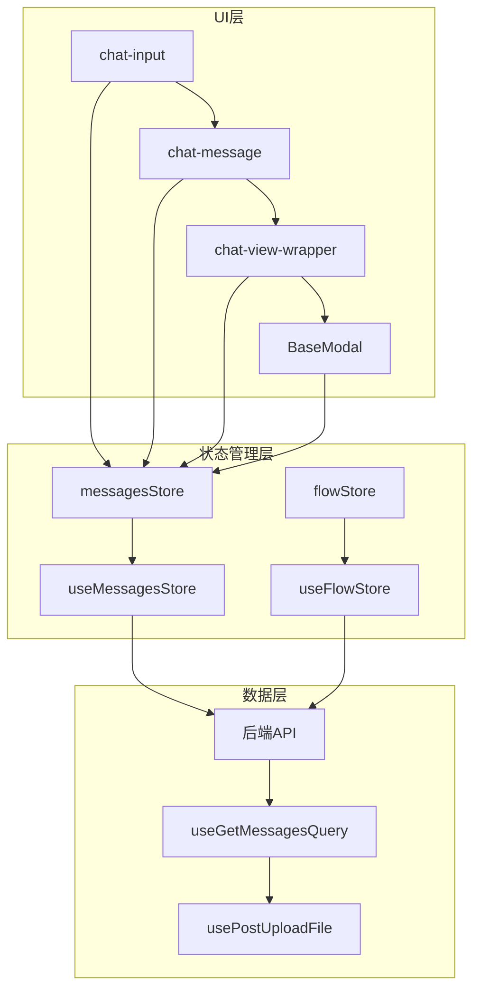
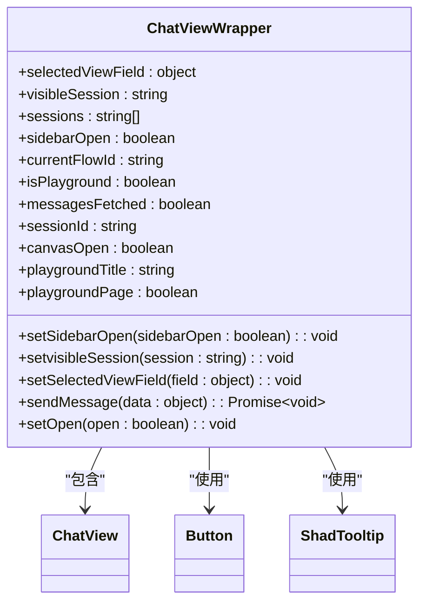
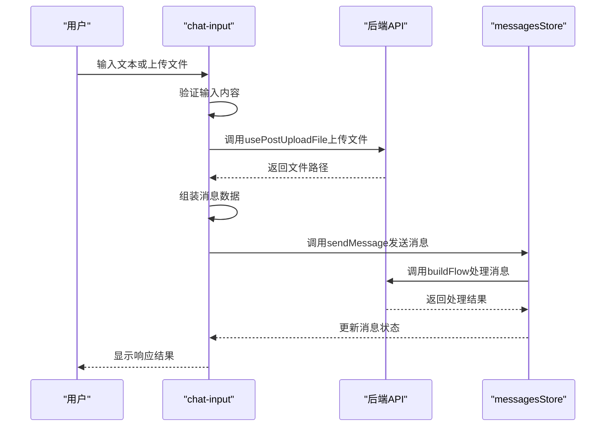
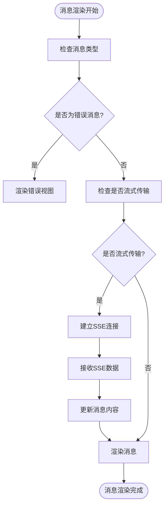
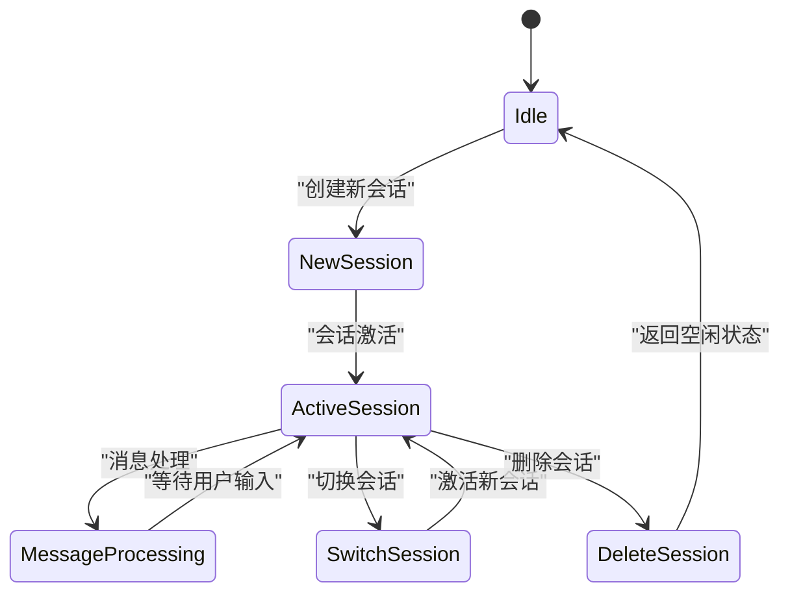
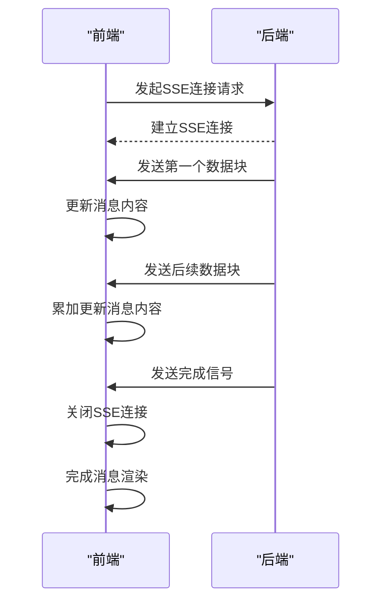
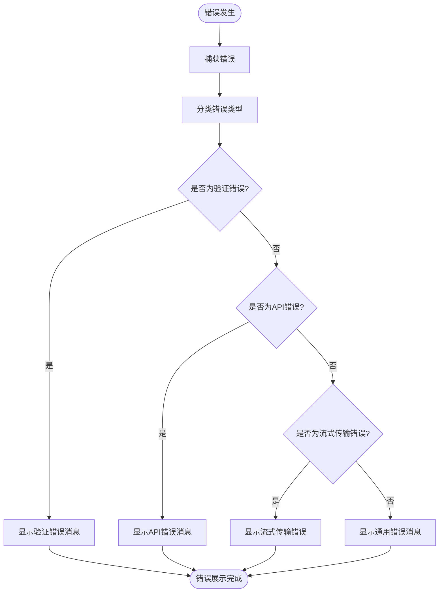
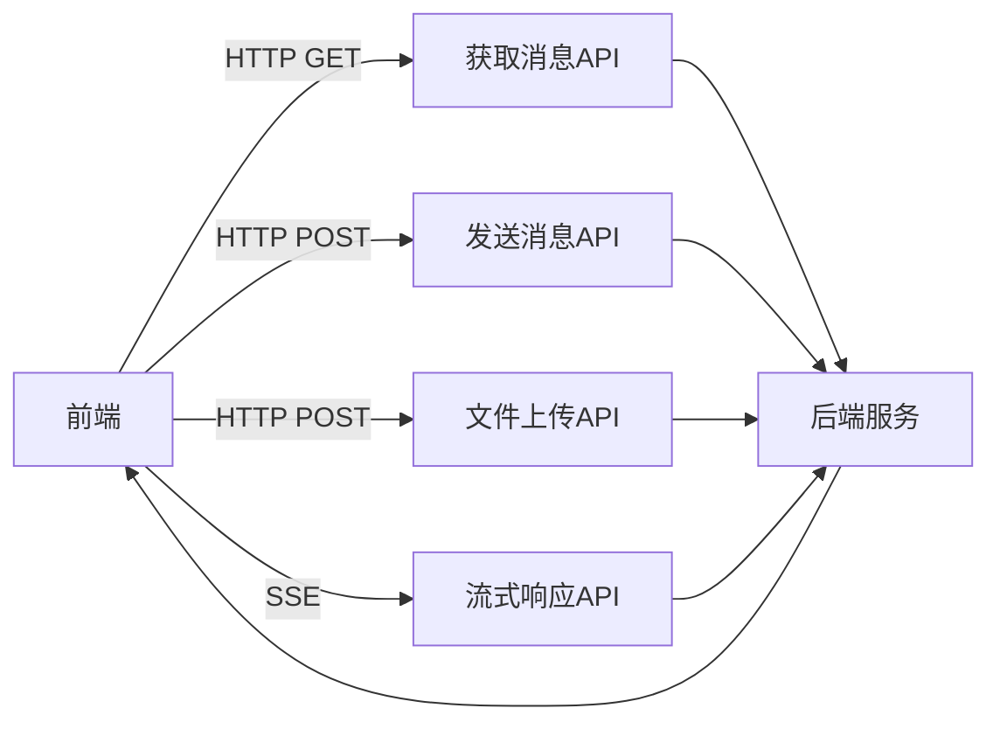

# 交互式测试模态框

<cite>
**本文档中引用的文件**  
- [playground-modal.tsx](file://vibe_surf/frontend/src/modals/IOModal/playground-modal.tsx)
- [chat-view-wrapper.tsx](file://vibe_surf/frontend/src/modals/IOModal/components/chat-view-wrapper.tsx)
- [chat-input.tsx](file://vibe_surf/frontend/src/modals/IOModal/components/chatView/chatInput/chat-input.tsx)
- [chat-message.tsx](file://vibe_surf/frontend/src/modals/IOModal/components/chatView/chatMessage/chat-message.tsx)
- [messagesStore.ts](file://vibe_surf/frontend/src/stores/messagesStore.ts)
- [chatView.tsx](file://vibe_surf/frontend/src/modals/IOModal/components/chatView/components/chat-view.tsx)
</cite>

## 目录
1. [简介](#简介)
2. [核心组件分析](#核心组件分析)
3. [架构概览](#架构概览)
4. [详细组件分析](#详细组件分析)
5. [会话管理与状态保持](#会话管理与状态保持)
6. [流式响应处理](#流式响应处理)
7. [错误处理机制](#错误处理机制)
8. [通信协议分析](#通信协议分析)
9. [结论](#结论)

## 简介
交互式测试模态框（playground-modal）是VibeSurf平台中用于工作流实时测试和调试的核心功能模块。该模态框提供了一个聊天式交互界面，允许用户在开发过程中实时测试和调试工作流。它支持多轮对话状态保持、流式响应处理、输入/输出数据展示等关键功能，为用户提供了一个完整的测试环境。

**交互式测试模态框**的主要特点包括：
- 聊天式交互界面，模拟真实用户对话场景
- 支持文本、文件等多种输入方式
- 实时流式响应，提供即时反馈
- 完整的会话管理功能，支持多轮对话
- 错误消息可视化展示，便于调试
- 与后端聊天API的无缝通信

该模态框作为开发者测试和验证工作流的重要工具，极大地提升了开发效率和用户体验。

## 核心组件分析
交互式测试模态框由多个核心组件构成，每个组件负责特定的功能模块。这些组件协同工作，共同实现了完整的测试和调试功能。

**核心组件包括**：
- **chat-view-wrapper**：负责整体布局管理
- **chat-input**：处理用户输入
- **chat-message**：渲染对话历史
- **BaseModal**：提供模态框基础功能
- **SidebarOpenView**：管理侧边栏视图

这些组件通过清晰的职责划分和良好的接口设计，确保了系统的可维护性和扩展性。

**Section sources**
- [playground-modal.tsx](file://vibe_surf/frontend/src/modals/IOModal/playground-modal.tsx#L32-L493)
- [chat-view-wrapper.tsx](file://vibe_surf/frontend/src/modals/IOModal/components/chat-view-wrapper.tsx#L9-L113)

## 架构概览
交互式测试模态框采用分层架构设计，各组件之间通过明确的接口进行通信。整体架构分为UI层、状态管理层和数据层三个主要部分。

**Diagram sources**
- [playground-modal.tsx](file://vibe_surf/frontend/src/modals/IOModal/playground-modal.tsx#L32-L493)
- [messagesStore.ts](file://vibe_surf/frontend/src/stores/messagesStore.ts#L4-L89)

## 详细组件分析
### chat-view-wrapper 组件分析
chat-view-wrapper组件是交互式测试模态框的布局管理器，负责协调各个子组件的显示和交互。它管理着聊天视图的整体布局，包括标题栏、会话管理按钮和聊天内容区域。

**Diagram sources**
- [chat-view-wrapper.tsx](file://vibe_surf/frontend/src/modals/IOModal/components/chat-view-wrapper.tsx#L9-L113)

**Section sources**
- [chat-view-wrapper.tsx](file://vibe_surf/frontend/src/modals/IOModal/components/chat-view-wrapper.tsx#L9-L113)

### chat-input 组件分析
chat-input组件负责处理用户的所有输入操作，包括文本输入、文件上传和语音输入。它是用户与系统交互的主要入口点。

**Diagram sources**
- [chat-input.tsx](file://vibe_surf/frontend/src/modals/IOModal/components/chatView/chatInput/chat-input.tsx#L28-L264)

**Section sources**
- [chat-input.tsx](file://vibe_surf/frontend/src/modals/IOModal/components/chatView/chatInput/chat-input.tsx#L28-L264)

### chat-message 组件分析
chat-message组件负责渲染对话历史中的每一条消息，包括用户发送的消息和系统返回的响应。它支持多种消息类型，如文本、文件、错误信息等。

**Diagram sources**
- [chat-message.tsx](file://vibe_surf/frontend/src/modals/IOModal/components/chatView/chatMessage/chat-message.tsx#L25-L438)

**Section sources**
- [chat-message.tsx](file://vibe_surf/frontend/src/modals/IOModal/components/chatView/chatMessage/chat-message.tsx#L25-L438)

## 会话管理与状态保持
交互式测试模态框实现了完整的会话管理功能，支持多轮对话状态的保持。系统通过会话ID来区分不同的对话会话，并在用户切换会话时保持各自的状态。

会话管理的核心功能包括：
- 会话创建和删除
- 会话切换和持久化
- 多轮对话状态保持
- 会话历史记录

系统使用Zustand状态管理库来维护会话状态，确保状态的一致性和可预测性。

**Diagram sources**
- [playground-modal.tsx](file://vibe_surf/frontend/src/modals/IOModal/playground-modal.tsx#L79-L161)
- [messagesStore.ts](file://vibe_surf/frontend/src/stores/messagesStore.ts#L6-L12)

**Section sources**
- [playground-modal.tsx](file://vibe_surf/frontend/src/modals/IOModal/playground-modal.tsx#L79-L161)
- [messagesStore.ts](file://vibe_surf/frontend/src/stores/messagesStore.ts#L6-L12)

## 流式响应处理
交互式测试模态框通过SSE（Server-Sent Events）技术实现了流式响应处理，为用户提供即时的反馈体验。当后端处理耗时较长的操作时，系统可以通过流式传输逐步返回结果。

流式响应处理的关键特性包括：
- 实时数据流传输
- 逐步结果展示
- 连接状态管理
- 错误处理和重试机制

系统在chat-message组件中实现了SSE客户端，负责建立连接、接收数据和更新UI。

**Diagram sources**
- [chat-message.tsx](file://vibe_surf/frontend/src/modals/IOModal/components/chatView/chatMessage/chat-message.tsx#L61-L90)
- [playground-modal.tsx](file://vibe_surf/frontend/src/modals/IOModal/playground-modal.tsx#L203-L228)

**Section sources**
- [chat-message.tsx](file://vibe_surf/frontend/src/modals/IOModal/components/chatView/chatMessage/chat-message.tsx#L61-L90)
- [playground-modal.tsx](file://vibe_surf/frontend/src/modals/IOModal/playground-modal.tsx#L203-L228)

## 错误处理机制
交互式测试模态框实现了完善的错误处理机制，能够捕获和展示各种类型的错误信息。系统通过统一的错误处理流程，确保用户能够及时了解和解决遇到的问题。

错误处理的主要类型包括：
- 输入验证错误
- 文件上传错误
- API调用错误
- 流式传输错误
- 会话管理错误

系统使用全局的alertStore来管理错误状态，并在UI中以醒目的方式展示错误信息。

**Diagram sources**
- [chat-message.tsx](file://vibe_surf/frontend/src/modals/IOModal/components/chatView/chatMessage/chat-message.tsx#L71-L82)
- [chat-input.tsx](file://vibe_surf/frontend/src/modals/IOModal/components/chatView/chatInput/chat-input.tsx#L99-L114)

**Section sources**
- [chat-message.tsx](file://vibe_surf/frontend/src/modals/IOModal/components/chatView/chatMessage/chat-message.tsx#L71-L82)
- [chat-input.tsx](file://vibe_surf/frontend/src/modals/IOModal/components/chatView/chatInput/chat-input.tsx#L99-L114)

## 通信协议分析
交互式测试模态框与后端服务通过REST API和SSE协议进行通信。系统定义了清晰的通信协议，确保前后端之间的数据交换高效可靠。

主要通信接口包括：
- 消息获取API：获取会话历史消息
- 消息发送API：发送用户输入消息
- 文件上传API：上传用户文件
- 会话管理API：创建、删除和管理会话

通信协议的设计考虑了性能、安全性和可扩展性，为系统的稳定运行提供了保障。

**Diagram sources**
- [playground-modal.tsx](file://vibe_surf/frontend/src/modals/IOModal/playground-modal.tsx#L188-L197)
- [chat-input.tsx](file://vibe_surf/frontend/src/modals/IOModal/components/chatView/chatInput/chat-input.tsx#L66-L153)

**Section sources**
- [playground-modal.tsx](file://vibe_surf/frontend/src/modals/IOModal/playground-modal.tsx#L188-L197)
- [chat-input.tsx](file://vibe_surf/frontend/src/modals/IOModal/components/chatView/chatInput/chat-input.tsx#L66-L153)

## 结论
交互式测试模态框作为VibeSurf平台的核心功能之一，通过精心设计的组件架构和完善的交互逻辑，为用户提供了一个强大而直观的工作流测试和调试环境。系统采用现代化的前端技术栈，结合SSE流式传输、Zustand状态管理等先进技术，实现了高性能、高可用的实时交互体验。

该模态框的设计充分考虑了用户体验和开发效率，通过清晰的组件划分和良好的接口设计，确保了系统的可维护性和可扩展性。未来可以通过增加更多输入类型支持、优化流式传输性能、增强错误诊断能力等方式进一步提升系统功能。

**Section sources**
- [playground-modal.tsx](file://vibe_surf/frontend/src/modals/IOModal/playground-modal.tsx#L32-L493)
- [chat-view-wrapper.tsx](file://vibe_surf/frontend/src/modals/IOModal/components/chat-view-wrapper.tsx#L9-L113)
- [chat-input.tsx](file://vibe_surf/frontend/src/modals/IOModal/components/chatView/chatInput/chat-input.tsx#L28-L264)
- [chat-message.tsx](file://vibe_surf/frontend/src/modals/IOModal/components/chatView/chatMessage/chat-message.tsx#L25-L438)