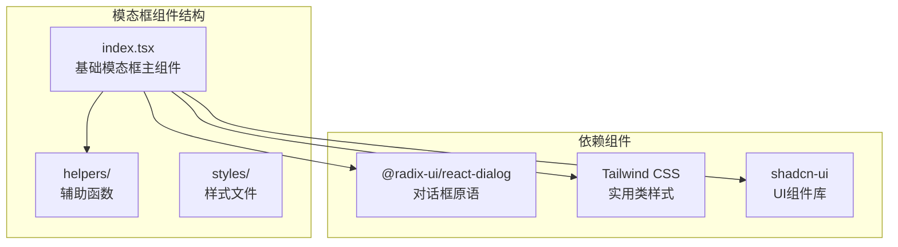
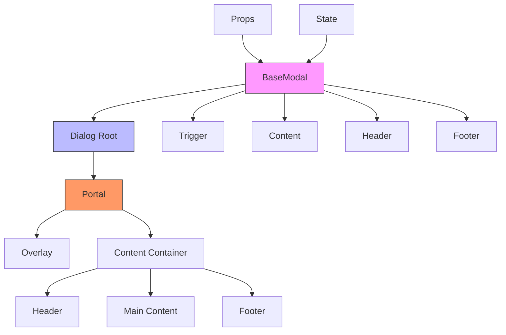
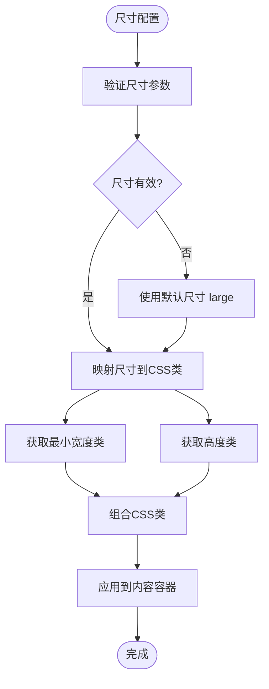
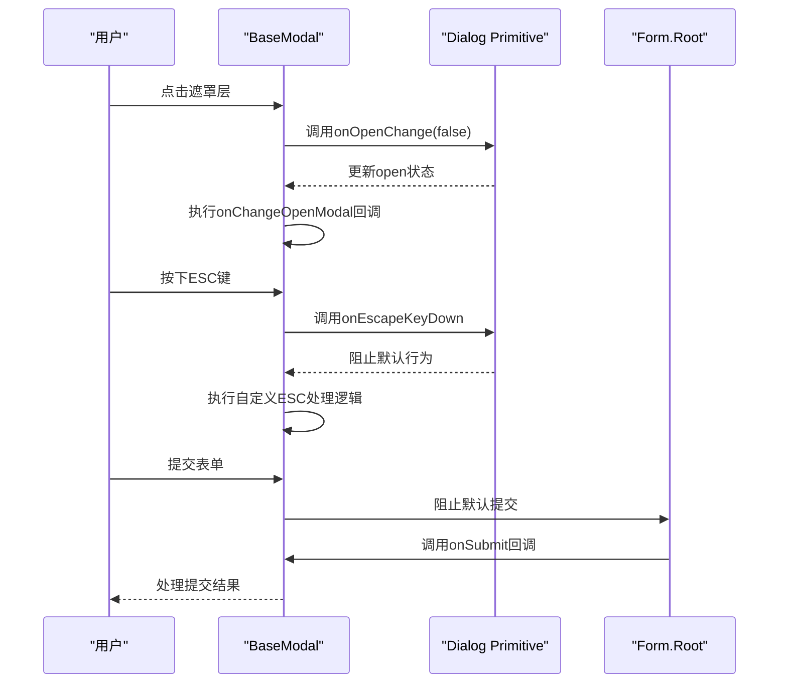
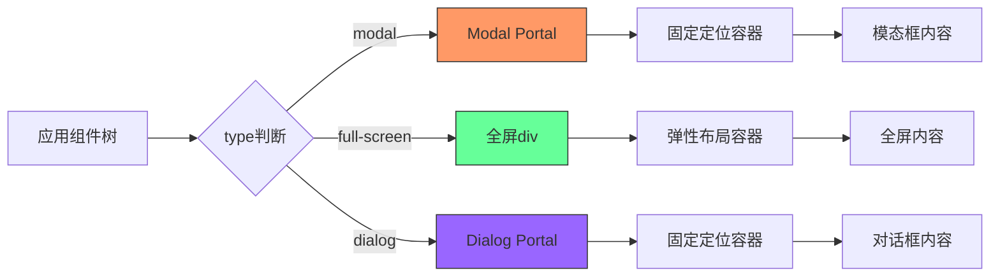

# 基础模态框

<cite>
**本文档引用的文件**   
- [index.tsx](file://vibe_surf/frontend/src/modals/baseModal/index.tsx)
- [switch-case-size.ts](file://vibe_surf/frontend/src/modals/baseModal/helpers/switch-case-size.ts)
- [dialog.tsx](file://vibe_surf/frontend/src/components/ui/dialog.tsx)
- [dialog-with-no-close.tsx](file://vibe_surf/frontend/src/components/ui/dialog-with-no-close.tsx)
- [components.css](file://vibe_surf/chrome_extension/styles/components.css)
- [modal-manager.js](file://vibe_surf/chrome_extension/scripts/modal-manager.js)
- [types/index.ts](file://vibe_surf/frontend/src/types/components/index.ts)
</cite>

## 目录
1. [简介](#简介)
2. [项目结构](#项目结构)
3. [核心组件](#核心组件)
4. [架构概述](#架构概述)
5. [详细组件分析](#详细组件分析)
6. [依赖分析](#依赖分析)
7. [性能考虑](#性能考虑)
8. [故障排除指南](#故障排除指南)
9. [结论](#结论)
10. [附录](#附录)（如有必要）

## 简介
本文档深入分析VibeSurf基础模态框(baseModal)的架构设计与实现机制。该组件作为所有模态框组件的基类，提供了可配置的尺寸控制、动态内容渲染、遮罩层交互和键盘事件处理等核心功能。通过React Portal实现DOM结构分离，并通过props传递实现高度可定制化，包括标题、按钮和关闭行为等。文档详细阐述了其生命周期管理、CSS类名应用逻辑和响应式设计实现，以及继承baseModal创建新模态框组件的最佳实践。

## 项目结构
VibeSurf项目中的基础模态框组件位于前端源码的模态框目录中，采用模块化设计，将核心功能与样式、辅助函数分离。该组件依赖于Radix UI的对话框原语，并通过Tailwind CSS进行样式控制。



**图源**
- [index.tsx](file://vibe_surf/frontend/src/modals/baseModal/index.tsx)
- [helpers/switch-case-size.ts](file://vibe_surf/frontend/src/modals/baseModal/helpers/switch-case-size.ts)

**节源**
- [index.tsx](file://vibe_surf/frontend/src/modals/baseModal/index.tsx)

## 核心组件
基础模态框(baseModal)是VibeSurf应用中所有模态框的基类组件，提供统一的API和行为规范。它通过组合式API设计，允许子组件灵活地构建各种类型的模态框，同时保持一致的用户体验。

**节源**
- [index.tsx](file://vibe_surf/frontend/src/modals/baseModal/index.tsx#L1-L322)

## 架构概述
基础模态框采用分层架构设计，将展示逻辑、交互逻辑和样式逻辑分离。核心架构基于Radix UI的Dialog组件，通过封装提供更高级别的API，简化了模态框的创建和管理。



**图源**
- [index.tsx](file://vibe_surf/frontend/src/modals/baseModal/index.tsx)
- [dialog.tsx](file://vibe_surf/frontend/src/components/ui/dialog.tsx)

## 详细组件分析

### 基础模态框分析
基础模态框组件通过React的组合模式提供灵活的内容组织方式。它定义了Content、Header、Trigger和Footer四个子组件，允许开发者以声明式的方式构建模态框。

#### 组件关系图
```mermaid
classDiagram
class BaseModal {
+Content : React.FC
+Header : React.FC
+Trigger : React.FC
+Footer : React.FC
-switchCaseModalSize(size) : {minWidth, height}
-useEffect(open)
}
class Content {
+children : ReactNode
+overflowHidden? : boolean
+className? : string
}
class Header {
+children : ReactNode
+description? : string
+clampDescription? : number
}
class Trigger {
+children : ReactNode
+asChild? : boolean
+disable? : boolean
+className? : string
}
class Footer {
+children? : ReactNode
+submit? : {label, icon, loading, disabled, onClick}
+close? : boolean
+centered? : boolean
+className? : string
}
BaseModal --> Content : "包含"
BaseModal --> Header : "包含"
BaseModal --> Trigger : "包含"
BaseModal --> Footer : "包含"
```

**图源**
- [index.tsx](file://vibe_surf/frontend/src/modals/baseModal/index.tsx#L36-L156)

### 尺寸配置机制
基础模态框支持多种预定义尺寸，通过switch-case-size辅助函数将尺寸标识符映射为具体的CSS类名，实现响应式布局。

#### 尺寸映射流程图


**图源**
- [switch-case-size.ts](file://vibe_surf/frontend/src/modals/baseModal/helpers/switch-case-size.ts#L1-L108)

**节源**
- [switch-case-size.ts](file://vibe_surf/frontend/src/modals/baseModal/helpers/switch-case-size.ts#L1-L108)

### 交互逻辑分析
基础模态框实现了完整的交互逻辑，包括遮罩层点击关闭、ESC键关闭和表单提交处理。

#### 交互事件序列图


**图源**
- [index.tsx](file://vibe_surf/frontend/src/modals/baseModal/index.tsx#L201-L322)

### DOM结构分离策略
基础模态框利用React Portal将模态框内容渲染到DOM树的顶层，避免样式继承和z-index冲突问题。

#### Portal渲染流程


**图源**
- [index.tsx](file://vibe_surf/frontend/src/modals/baseModal/index.tsx#L254-L314)
- [dialog.tsx](file://vibe_surf/frontend/src/components/ui/dialog.tsx#L13-L22)

## 依赖分析
基础模态框组件依赖于多个外部库和内部模块，形成了清晰的依赖关系网络。

```mermaid
graph LR
BaseModal --> RadixUI
BaseModal --> Tailwind
BaseModal --> Shadcn
BaseModal --> Utils
BaseModal --> Types
RadixUI[@radix-ui/react-dialog]
Tailwind[tailwindcss]
Shadcn[shadcn-ui]
Utils[utils/utils]
Types[types/components]
style BaseModal fill:#f9f,stroke:#333
style RadixUI fill:#bbf,stroke:#333
style Tailwind fill:#9f9,stroke:#333
style Shadcn fill:#ff9,stroke:#333
```

**图源**
- [index.tsx](file://vibe_surf/frontend/src/modals/baseModal/index.tsx#L1-L10)
- [types/index.ts](file://vibe_surf/frontend/src/types/components/index.ts)

**节源**
- [index.tsx](file://vibe_surf/frontend/src/modals/baseModal/index.tsx)
- [types/index.ts](file://vibe_surf/frontend/src/types/components/index.ts)

## 性能考虑
基础模态框在性能方面进行了优化，包括使用React.memo进行组件记忆化、避免不必要的重渲染，以及通过Portal减少DOM操作对主应用的影响。

## 故障排除指南
当基础模态框出现显示或交互问题时，应检查以下常见问题：
- 确认open状态的正确管理
- 检查Portal是否正确渲染到body元素
- 验证键盘事件监听器是否正常工作
- 确保遮罩层点击事件未被阻止

**节源**
- [index.tsx](file://vibe_surf/frontend/src/modals/baseModal/index.tsx)
- [modal-manager.js](file://vibe_surf/chrome_extension/scripts/modal-manager.js)

## 结论
VibeSurf的基础模态框组件通过精心设计的架构和实现，提供了一个强大而灵活的基类，支持各种类型的模态框创建。其基于Radix UI的底层实现确保了可访问性和跨浏览器兼容性，而丰富的props API则提供了高度的可定制性。该组件的成功设计模式可以作为其他UI组件开发的参考。

## 附录
### 支持的尺寸类型
| 尺寸标识符 | 最小宽度 | 高度 |
|-----------|---------|------|
| small | min-w-[40vw] | h-[40vh] |
| medium | min-w-[60vw] | h-[60vh] |
| large | min-w-[85vw] | h-[80vh] |
| auth | min-w-[600px] | "" |
| x-large | min-w-[95vw] | h-[95vh] |

**节源**
- [switch-case-size.ts](file://vibe_surf/frontend/src/modals/baseModal/helpers/switch-case-size.ts)