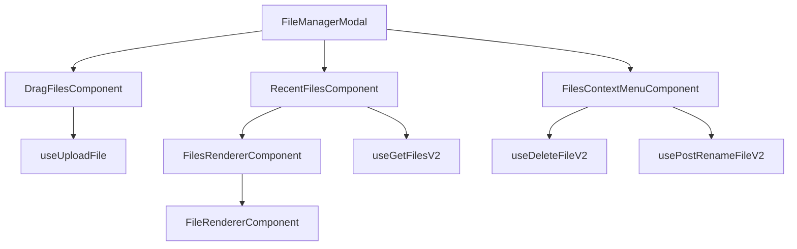
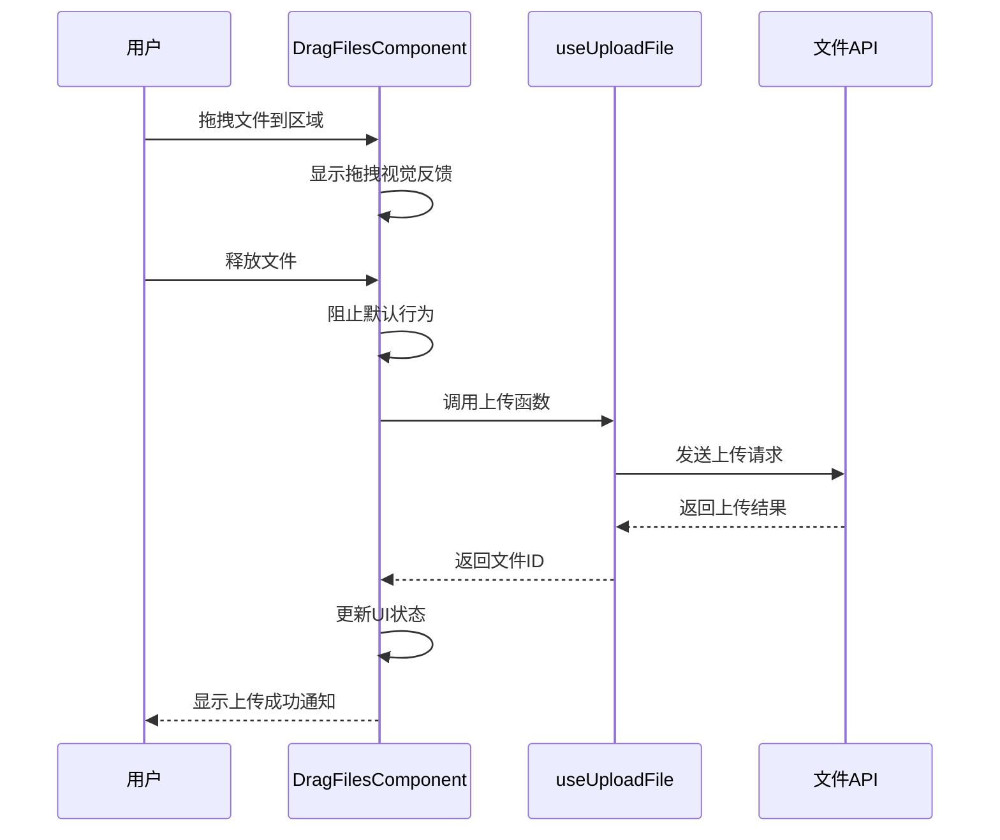
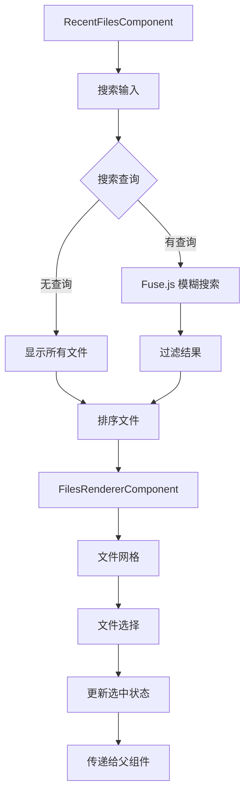
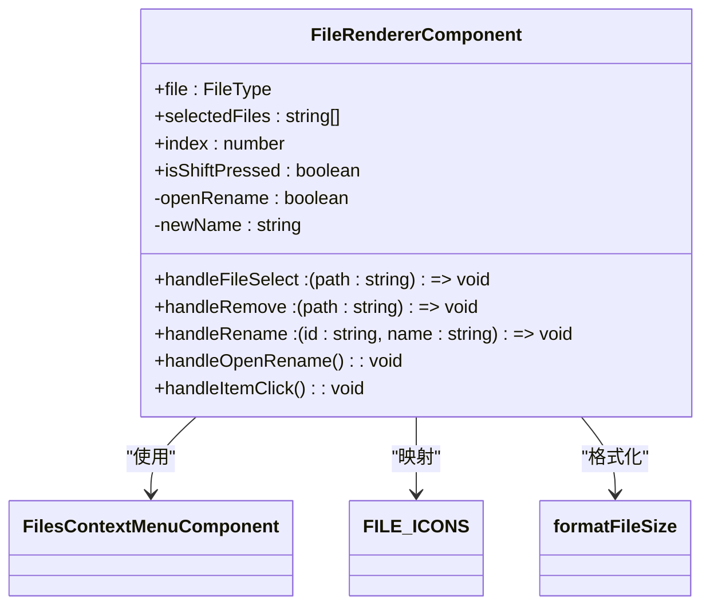
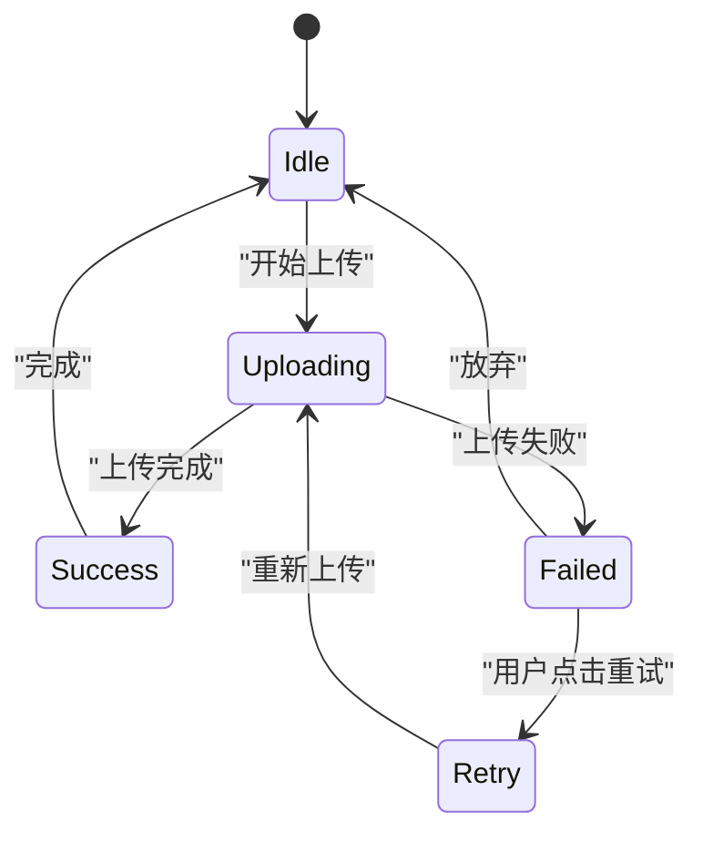
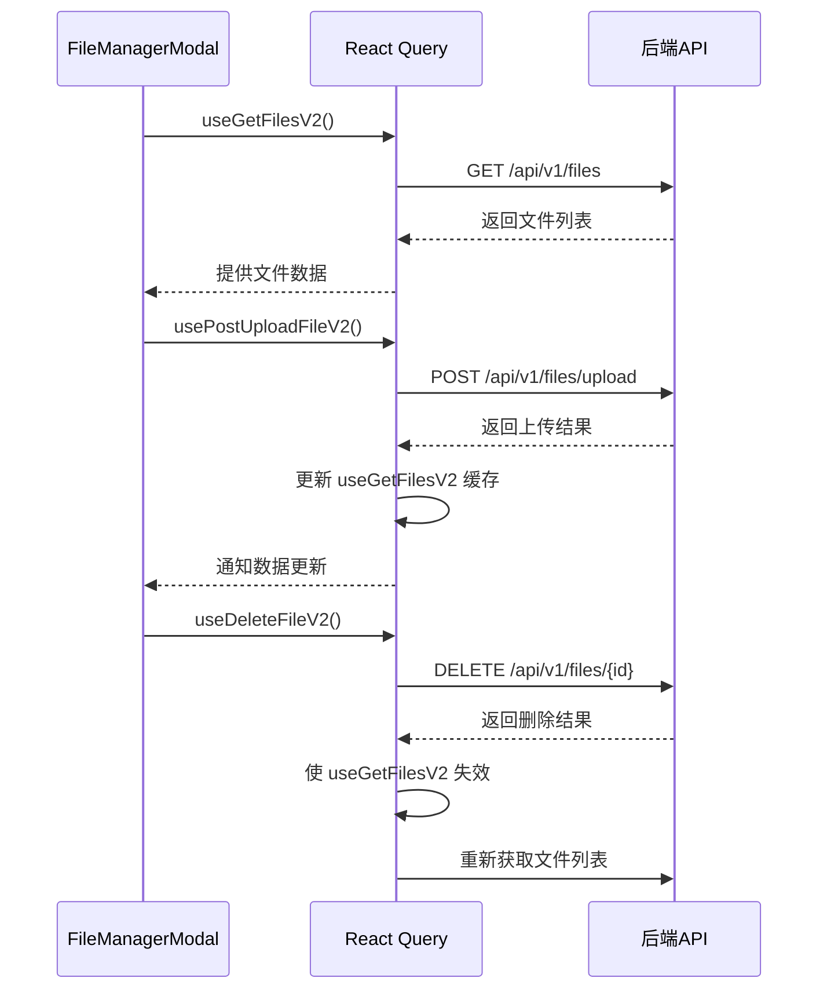

# 文件管理模态框

<cite>
**本文档引用的文件**   
- [fileManagerModal/index.tsx](file://vibe_surf/frontend/src/modals/fileManagerModal/index.tsx)
- [dragFilesComponent/index.tsx](file://vibe_surf/frontend/src/modals/fileManagerModal/components/dragFilesComponent/index.tsx)
- [recentFilesComponent/index.tsx](file://vibe_surf/frontend/src/modals/fileManagerModal/components/recentFilesComponent/index.tsx)
- [filesRendererComponent/index.tsx](file://vibe_surf/frontend/src/modals/fileManagerModal/components/filesRendererComponent/index.tsx)
- [filesRendererComponent/components/fileRendererComponent/index.tsx](file://vibe_surf/frontend/src/modals/fileManagerModal/components/filesRendererComponent/components/fileRendererComponent/index.tsx)
- [filesContextMenuComponent/index.tsx](file://vibe_surf/frontend/src/modals/fileManagerModal/components/filesContextMenuComponent/index.tsx)
- [use-get-files.ts](file://vibe_surf/frontend/src/controllers/API/queries/file-management/use-get-files.ts)
- [use-post-upload-file.ts](file://vibe_surf/frontend/src/controllers/API/queries/file-management/use-post-upload-file.ts)
- [use-delete-file.ts](file://vibe_surf/frontend/src/controllers/API/queries/file-management/use-delete-file.ts)
- [use-put-rename-file.ts](file://vibe_surf/frontend/src/controllers/API/queries/file-management/use-put-rename-file.ts)
- [styleUtils.ts](file://vibe_surf/frontend/src/utils/styleUtils.ts)
- [file_management/index.ts](file://vibe_surf/frontend/src/types/file_management/index.ts)
</cite>

## 目录
1. [简介](#简介)
2. [架构概览](#架构概览)
3. [核心组件分析](#核心组件分析)
4. [文件类型图标映射](#文件类型图标映射)
5. [上传状态与错误处理](#上传状态与错误处理)
6. [与Store和API的集成](#与store和api的集成)
7. [上下文菜单功能](#上下文菜单功能)
8. [结论](#结论)

## 简介
文件管理模态框(fileManagerModal)是系统中用于文件上传、浏览和管理的核心组件。该模态框提供了一个集中的界面，允许用户通过拖拽或点击方式上传文件，浏览最近使用的文件，并对文件进行管理操作。作为文件操作的中枢，它集成了文件列表渲染、拖拽上传支持、最近文件展示和上下文菜单等多种功能，为用户提供了一个完整的文件管理解决方案。

**Section sources**
- [fileManagerModal/index.tsx](file://vibe_surf/frontend/src/modals/fileManagerModal/index.tsx#L1-L114)

## 架构概览
文件管理模态框采用组件化设计，由多个独立的子组件构成，每个组件负责特定的功能。主模态框组件(fileManagerModal)作为容器，协调各个子组件的工作。其架构主要包括三个核心组件：dragFilesComponent负责处理拖拽上传交互，recentFilesComponent管理最近文件的展示和搜索，filesRendererComponent则负责文件网格的渲染。这种组件化设计使得各个功能模块职责清晰，便于维护和扩展。



**Diagram sources **
- [fileManagerModal/index.tsx](file://vibe_surf/frontend/src/modals/fileManagerModal/index.tsx#L7-L9)
- [dragFilesComponent/index.tsx](file://vibe_surf/frontend/src/modals/fileManagerModal/components/dragFilesComponent/index.tsx#L9-L17)
- [recentFilesComponent/index.tsx](file://vibe_surf/frontend/src/modals/fileManagerModal/components/recentFilesComponent/index.tsx#L11-L17)

## 核心组件分析

### DragFilesComponent 分析
DragFilesComponent 组件实现了文件拖拽上传的核心功能。它通过监听 dragover、dragenter、dragleave 和 drop 等事件来处理文件拖拽交互。当用户将文件拖拽到指定区域时，组件会显示视觉反馈，提示用户可以释放文件。在文件被释放后，组件会调用上传钩子(useUploadFile)来处理文件上传。该组件还支持点击上传，为用户提供多种上传方式的选择。



**Diagram sources **
- [dragFilesComponent/index.tsx](file://vibe_surf/frontend/src/modals/fileManagerModal/components/dragFilesComponent/index.tsx#L27-L102)
- [use-post-upload-file.ts](file://vibe_surf/frontend/src/controllers/API/queries/file-management/use-post-upload-file.ts#L18-L32)

**Section sources**
- [dragFilesComponent/index.tsx](file://vibe_surf/frontend/src/modals/fileManagerModal/components/dragFilesComponent/index.tsx#L1-L158)

### RecentFilesComponent 分析
RecentFilesComponent 组件负责展示和管理最近使用的文件列表。它集成了搜索功能，使用 Fuse.js 库实现模糊搜索，允许用户通过文件名或文件类型快速查找文件。组件还处理文件选择逻辑，支持 Shift 键进行范围选择和 Ctrl/Cmd 键进行多选。文件列表按更新时间排序，最近修改的文件显示在前面。该组件通过 useGetFilesV2 钩子从后端获取文件列表，并在文件状态变化时自动刷新。



**Diagram sources **
- [recentFilesComponent/index.tsx](file://vibe_surf/frontend/src/modals/fileManagerModal/components/recentFilesComponent/index.tsx#L36-L43)
- [recentFilesComponent/index.tsx](file://vibe_surf/frontend/src/modals/fileManagerModal/components/recentFilesComponent/index.tsx#L50-L55)

**Section sources**
- [recentFilesComponent/index.tsx](file://vibe_surf/frontend/src/modals/fileManagerModal/components/recentFilesComponent/index.tsx#L1-L193)

### FilesRendererComponent 分析
FilesRendererComponent 是文件网格的渲染组件，负责将文件数据转换为可视化的文件项列表。它接收文件数组作为输入，为每个文件创建一个 FileRendererComponent 实例。该组件处理文件的批量操作，如多选和取消选择。它还负责传递文件选择、重命名和删除等回调函数，确保用户交互能够正确传递到上层组件。

**Section sources**
- [filesRendererComponent/index.tsx](file://vibe_surf/frontend/src/modals/fileManagerModal/components/filesRendererComponent/index.tsx#L1-L34)

### FileRendererComponent 分析
FileRendererComponent 是单个文件项的渲染组件，负责展示文件的详细信息和操作按钮。每个文件项显示文件图标、文件名、文件大小和操作按钮。组件根据文件扩展名动态选择合适的图标，并通过 FILE_ICONS 映射确定图标的颜色。文件项支持点击选择、重命名和删除操作。上传失败的文件会显示"重试"链接，允许用户重新上传。



**Diagram sources **
- [filesRendererComponent/components/fileRendererComponent/index.tsx](file://vibe_surf/frontend/src/modals/fileManagerModal/components/filesRendererComponent/components/fileRendererComponent/index.tsx#L14-L30)
- [styleUtils.ts](file://vibe_surf/frontend/src/utils/styleUtils.ts#L191-L200)

**Section sources**
- [filesRendererComponent/components/fileRendererComponent/index.tsx](file://vibe_surf/frontend/src/modals/fileManagerModal/components/filesRendererComponent/components/fileRendererComponent/index.tsx#L1-L224)

## 文件类型图标映射
文件管理模态框通过 FILE_ICONS 常量实现了文件类型与图标的映射关系。该映射定义了不同文件扩展名对应的图标名称和颜色。目前支持的主要文件类型包括 JSON、CSV 和 TXT 文件。JSON 文件使用 "FileJson" 图标并显示为靛蓝色，CSV 文件使用 "FileChartColumn" 图标并显示为翡翠色，TXT 文件使用默认的 "File" 图标。这种映射机制使得用户能够通过视觉快速识别文件类型，提高了用户体验。

```mermaid
erDiagram
FILE_ICONS {
string extension PK
string icon
string color
}
FILE_ICONS ||--o{ FileType : "映射"
FILE_ICONS {
"json" "FileJson" "text-datatype-indigo"
"csv" "FileChartColumn" "text-datatype-emerald"
"txt" "File" "default"
}
```

**Diagram sources **
- [styleUtils.ts](file://vibe_surf/frontend/src/utils/styleUtils.ts#L191-L200)
- [file_management/index.ts](file://vibe_surf/frontend/src/types/file_management/index.ts#L1-L14)

**Section sources**
- [styleUtils.ts](file://vibe_surf/frontend/src/utils/styleUtils.ts#L191-L200)

## 上传状态与错误处理
文件管理模态框实现了完善的上传状态管理和错误处理机制。文件上传状态通过 FileType 接口中的 progress 字段表示，该字段的值范围为 0 到 1，表示上传进度。上传过程中，文件项会显示进度百分比；上传成功后，progress 字段被移除；上传失败时，progress 值为 -1，并显示"重试"链接。

错误处理主要通过 useAlertStore 实现，当上传失败时，系统会显示错误通知，包含错误标题和详细信息列表。组件还实现了文件大小验证和文件类型验证，阻止不符合要求的文件上传。文件大小限制通过 useUtilityStore 中的 maxFileSizeUpload 配置项获取，确保用户不会上传过大的文件。



**Diagram sources **
- [file_management/index.ts](file://vibe_surf/frontend/src/types/file_management/index.ts#L10)
- [dragFilesComponent/index.tsx](file://vibe_surf/frontend/src/modals/fileManagerModal/components/dragFilesComponent/index.tsx#L65-L70)
- [filesRendererComponent/components/fileRendererComponent/index.tsx](file://vibe_surf/frontend/src/modals/fileManagerModal/components/filesRendererComponent/components/fileRendererComponent/index.tsx#L96-L101)

**Section sources**
- [dragFilesComponent/index.tsx](file://vibe_surf/frontend/src/modals/fileManagerModal/components/dragFilesComponent/index.tsx#L65-L70)
- [filesRendererComponent/components/fileRendererComponent/index.tsx](file://vibe_surf/frontend/src/modals/fileManagerModal/components/filesRendererComponent/components/fileRendererComponent/index.tsx#L96-L174)

## 与Store和API的集成
文件管理模态框通过 React Query 与后端 API 进行集成，实现了数据的高效管理和同步。组件使用 useGetFilesV2 钩子从 /api/v1/files 端点获取文件列表，并在模态框打开时自动刷新数据。文件上传通过 usePostUploadFileV2 钩子实现，上传成功后会立即更新本地缓存，提供即时的UI反馈。

对于文件删除和重命名操作，组件分别使用 useDeleteFileV2 和 usePostRenameFileV2 钩子。这些操作完成后，系统会自动使 useGetFilesV2 查询失效，触发文件列表的重新获取，确保UI与后端数据保持同步。这种基于 React Query 的数据管理策略避免了手动管理状态的复杂性，提高了应用的可靠性和性能。



**Diagram sources **
- [use-get-files.ts](file://vibe_surf/frontend/src/controllers/API/queries/file-management/use-get-files.ts#L15-L18)
- [use-post-upload-file.ts](file://vibe_surf/frontend/src/controllers/API/queries/file-management/use-post-upload-file.ts#L22-L24)
- [use-delete-file.ts](file://vibe_surf/frontend/src/controllers/API/queries/file-management/use-delete-file.ts#L18-L20)

**Section sources**
- [use-get-files.ts](file://vibe_surf/frontend/src/controllers/API/queries/file-management/use-get-files.ts#L1-L28)
- [use-post-upload-file.ts](file://vibe_surf/frontend/src/controllers/API/queries/file-management/use-post-upload-file.ts#L1-L35)
- [use-delete-file.ts](file://vibe_surf/frontend/src/controllers/API/queries/file-management/use-delete-file.ts#L1-L40)
- [use-put-rename-file.ts](file://vibe_surf/frontend/src/controllers/API/queries/file-management/use-put-rename-file.ts#L1-L45)

## 上下文菜单功能
文件管理模态框集成了功能丰富的上下文菜单(FilesContextMenuComponent)，为用户提供了一键式的文件操作。通过点击文件项上的三点图标，用户可以访问包含重命名、下载、复制和删除/移除等操作的菜单。上下文菜单根据文件来源(本地或云存储)智能调整选项标签，本地文件显示"删除"，云存储文件显示"移除"。

菜单操作通过 React Query 的 mutation 钩子实现，确保操作的原子性和错误处理。删除操作会显示确认对话框，防止误操作。所有操作完成后，系统会显示相应的成功通知，提供操作反馈。这种设计既保证了功能的完整性，又确保了用户操作的安全性。

**Section sources**
- [filesContextMenuComponent/index.tsx](file://vibe_surf/frontend/src/modals/fileManagerModal/components/filesContextMenuComponent/index.tsx#L1-L164)

## 结论
文件管理模态框通过组件化设计和现代化的技术栈，构建了一个功能完整、用户体验优良的文件管理中枢。其架构清晰，各组件职责分明，便于维护和扩展。通过与 React Query 的深度集成，实现了高效的数据管理和同步。文件类型图标映射、上传状态管理和错误处理机制共同提升了用户体验。上下文菜单的集成使得文件操作更加便捷。整体设计体现了现代前端开发的最佳实践，为系统的文件管理功能提供了坚实的基础。