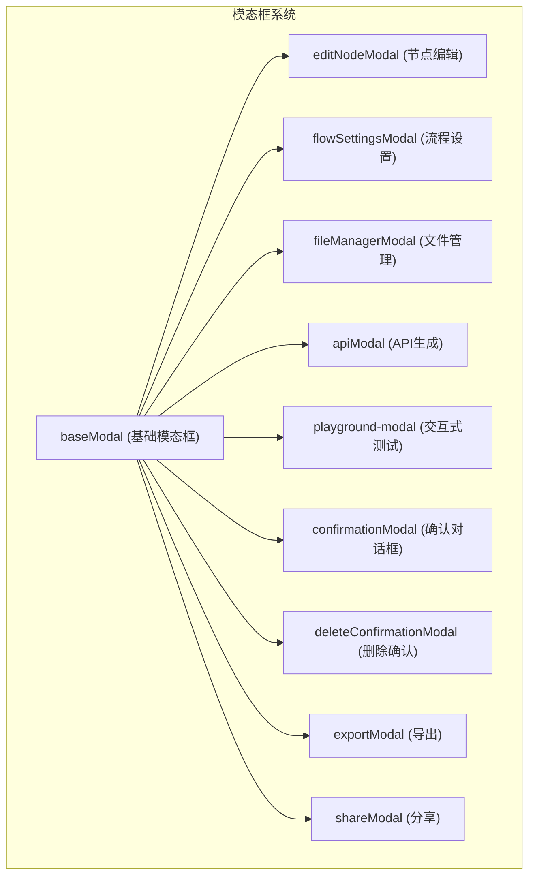
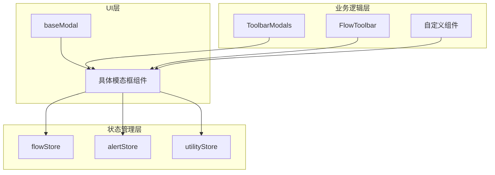
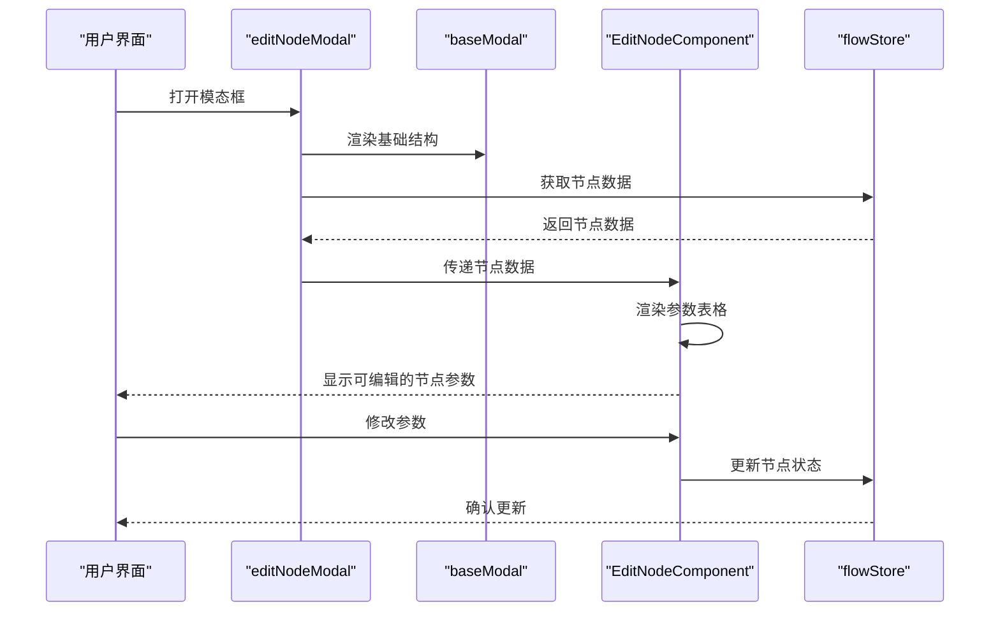
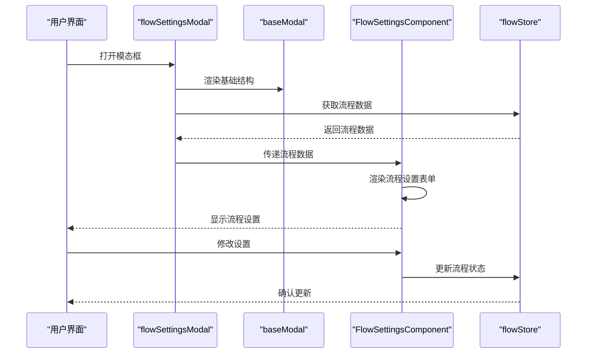
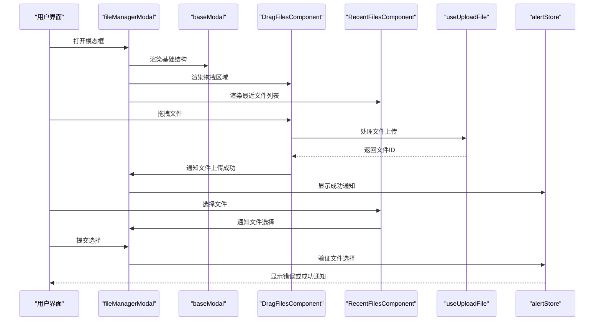
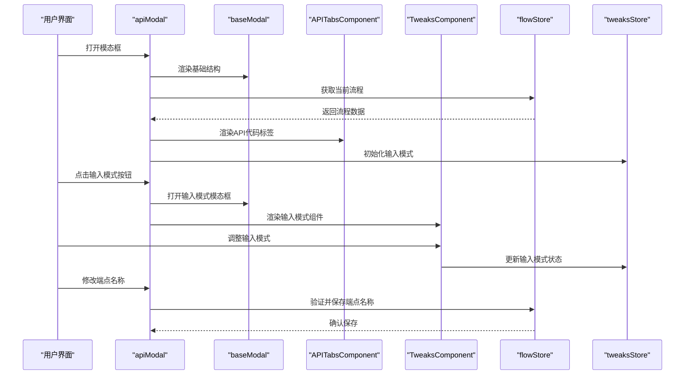
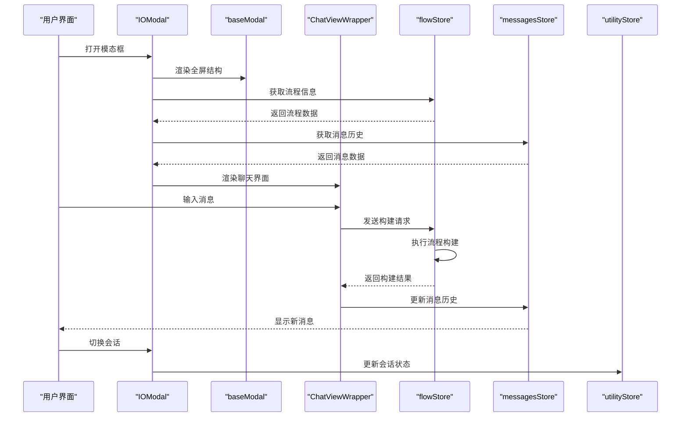
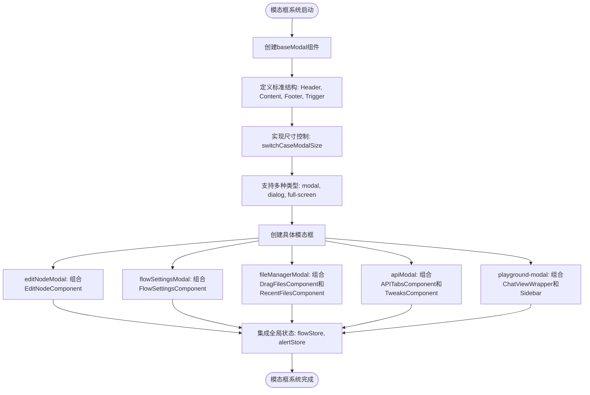

# 模态框系统

<cite>
**本文档引用的文件**   
- [baseModal/index.tsx](file://vibe_surf/frontend/src/modals/baseModal/index.tsx)
- [editNodeModal/index.tsx](file://vibe_surf/frontend/src/modals/editNodeModal/index.tsx)
- [flowSettingsModal/index.tsx](file://vibe_surf/frontend/src/modals/flowSettingsModal/index.tsx)
- [fileManagerModal/index.tsx](file://vibe_surf/frontend/src/modals/fileManagerModal/index.tsx)
- [apiModal/index.tsx](file://vibe_surf/frontend/src/modals/apiModal/index.tsx)
- [playground-modal.tsx](file://vibe_surf/frontend/src/modals/IOModal/playground-modal.tsx)
- [switch-case-size.ts](file://vibe_surf/frontend/src/modals/baseModal/helpers/switch-case-size.ts)
- [flowStore.ts](file://vibe_surf/frontend/src/stores/flowStore.ts)
- [alertStore.ts](file://vibe_surf/frontend/src/stores/alertStore.ts)
- [modal-manager.js](file://vibe_surf/chrome_extension/scripts/modal-manager.js)
</cite>

## 目录
1. [简介](#简介)
2. [项目结构](#项目结构)
3. [核心组件](#核心组件)
4. [架构概述](#架构概述)
5. [详细组件分析](#详细组件分析)
6. [依赖分析](#依赖分析)
7. [性能考虑](#性能考虑)
8. [故障排除指南](#故障排除指南)
9. [结论](#结论)

## 简介
本文档深入分析VibeSurf模态框系统的架构设计，重点描述baseModal作为基础模态框组件的实现机制，包括其可配置性、尺寸控制和嵌套支持。详细说明各类具体模态框的功能和实现，如editNodeModal（节点编辑）、flowSettingsModal（流程设置）、fileManagerModal（文件管理）、apiModal（API生成）和playground-modal（交互式测试）。解释模态框的状态管理策略、动态加载机制和跨组件通信模式。提供模态框扩展开发指南，包括如何创建新的模态框类型、定义其UI结构和集成业务逻辑。阐述模态框与全局状态（如flowStore、alertStore）的交互方式，以及错误处理和用户体验优化策略。

## 项目结构
VibeSurf模态框系统位于前端源码的`modals`目录下，采用模块化设计，每个模态框都有独立的目录和文件结构。系统以`baseModal`作为基础组件，其他所有模态框都基于此基础组件进行扩展和定制。



**Diagram sources**
- [baseModal/index.tsx](file://vibe_surf/frontend/src/modals/baseModal/index.tsx)
- [editNodeModal/index.tsx](file://vibe_surf/frontend/src/modals/editNodeModal/index.tsx)
- [flowSettingsModal/index.tsx](file://vibe_surf/frontend/src/modals/flowSettingsModal/index.tsx)
- [fileManagerModal/index.tsx](file://vibe_surf/frontend/src/modals/fileManagerModal/index.tsx)
- [apiModal/index.tsx](file://vibe_surf/frontend/src/modals/apiModal/index.tsx)
- [playground-modal.tsx](file://vibe_surf/frontend/src/modals/IOModal/playground-modal.tsx)

**Section sources**
- [baseModal/index.tsx](file://vibe_surf/frontend/src/modals/baseModal/index.tsx)
- [editNodeModal/index.tsx](file://vibe_surf/frontend/src/modals/editNodeModal/index.tsx)
- [flowSettingsModal/index.tsx](file://vibe_surf/frontend/src/modals/flowSettingsModal/index.tsx)
- [fileManagerModal/index.tsx](file://vibe_surf/frontend/src/modals/fileManagerModal/index.tsx)
- [apiModal/index.tsx](file://vibe_surf/frontend/src/modals/apiModal/index.tsx)
- [playground-modal.tsx](file://vibe_surf/frontend/src/modals/IOModal/playground-modal.tsx)

## 核心组件
模态框系统的核心是`baseModal`组件，它提供了模态框的基本结构和功能。所有其他模态框组件都继承自`baseModal`，通过组合不同的内容、头部、触发器和底部组件来实现特定功能。`baseModal`支持多种尺寸配置，通过`switchCaseModalSize`函数实现灵活的尺寸控制。

**Section sources**
- [baseModal/index.tsx](file://vibe_surf/frontend/src/modals/baseModal/index.tsx)
- [baseModal/helpers/switch-case-size.ts](file://vibe_surf/frontend/src/modals/baseModal/helpers/switch-case-size.ts)

## 架构概述
VibeSurf模态框系统采用分层架构设计，底层是`baseModal`基础组件，中间层是各种具体模态框实现，上层是业务逻辑组件对模态框的调用。系统通过Zustand状态管理库与全局状态进行交互，实现了模态框状态的集中管理和跨组件通信。



**Diagram sources**
- [baseModal/index.tsx](file://vibe_surf/frontend/src/modals/baseModal/index.tsx)
- [flowStore.ts](file://vibe_surf/frontend/src/stores/flowStore.ts)
- [alertStore.ts](file://vibe_surf/frontend/src/stores/alertStore.ts)
- [toolbar-modals.tsx](file://vibe_surf/frontend/src/pages/FlowPage/components/nodeToolbarComponent/components/toolbar-modals.tsx)
- [flowToolbarComponent/index.tsx](file://vibe_surf/frontend/src/components/core/flowToolbarComponent/index.tsx)

## 详细组件分析

### baseModal分析
`baseModal`是整个模态框系统的基础组件，提供了模态框的核心功能和结构。它通过React的组合模式，允许子组件以声明式的方式定义模态框的内容、头部、触发器和底部。

#### 对象导向组件：
```mermaid
classDiagram
class BaseModal {
+children : ReactNode
+open : boolean
+setOpen : (open : boolean) => void
+size : string
+className : string
+disable : boolean
+onChangeOpenModal : (open? : boolean) => void
+type : "modal" | "dialog" | "full-screen"
+onSubmit : () => void
+onEscapeKeyDown : (e : KeyboardEvent) => void
+closeButtonClassName : string
+dialogContentWithouFixed : boolean
}
class Content {
+children : ReactNode
+overflowHidden : boolean
+className : string
}
class Header {
+children : ReactNode
+description : string | JSX.Element | null
+clampDescription : number
}
class Trigger {
+children : ReactNode
+asChild : boolean
+disable : boolean
+className : string
}
class Footer {
+children : ReactNode
+submit : { label : string, icon? : ReactNode, loading? : boolean, disabled? : boolean, dataTestId? : string, onClick? : () => void }
+close : boolean
+centered : boolean
+className : string
}
BaseModal --> Content : "包含"
BaseModal --> Header : "包含"
BaseModal --> Trigger : "包含"
BaseModal --> Footer : "包含"
BaseModal --> switchCaseModalSize : "使用"
```

**Diagram sources**
- [baseModal/index.tsx](file://vibe_surf/frontend/src/modals/baseModal/index.tsx)
- [baseModal/helpers/switch-case-size.ts](file://vibe_surf/frontend/src/modals/baseModal/helpers/switch-case-size.ts)

**Section sources**
- [baseModal/index.tsx](file://vibe_surf/frontend/src/modals/baseModal/index.tsx)

### 具体模态框分析

#### editNodeModal分析
`editNodeModal`用于编辑流程中的节点，允许用户修改节点的配置和参数。它基于`baseModal`构建，使用`EditNodeComponent`作为主要内容，提供了一个表格界面来展示和编辑节点属性。



**Diagram sources**
- [editNodeModal/index.tsx](file://vibe_surf/frontend/src/modals/editNodeModal/index.tsx)
- [editNodeComponent/index.tsx](file://vibe_surf/frontend/src/modals/editNodeModal/components/editNodeComponent/index.tsx)
- [flowStore.ts](file://vibe_surf/frontend/src/stores/flowStore.ts)

**Section sources**
- [editNodeModal/index.tsx](file://vibe_surf/frontend/src/modals/editNodeModal/index.tsx)

#### flowSettingsModal分析
`flowSettingsModal`用于显示和编辑流程的详细信息，如名称、描述和图标。它提供了一个简洁的界面来管理流程的基本属性。



**Diagram sources**
- [flowSettingsModal/index.tsx](file://vibe_surf/frontend/src/modals/flowSettingsModal/index.tsx)
- [flowStore.ts](file://vibe_surf/frontend/src/stores/flowStore.ts)

**Section sources**
- [flowSettingsModal/index.tsx](file://vibe_surf/frontend/src/modals/flowSettingsModal/index.tsx)

#### fileManagerModal分析
`fileManagerModal`用于管理和选择文件，支持文件拖拽上传和最近文件列表。它提供了文件管理的完整功能，包括文件上传、选择和验证。



**Diagram sources**
- [fileManagerModal/index.tsx](file://vibe_surf/frontend/src/modals/fileManagerModal/index.tsx)
- [dragFilesComponent/index.tsx](file://vibe_surf/frontend/src/modals/fileManagerModal/components/dragFilesComponent/index.tsx)
- [alertStore.ts](file://vibe_surf/frontend/src/stores/alertStore.ts)

**Section sources**
- [fileManagerModal/index.tsx](file://vibe_surf/frontend/src/modals/fileManagerModal/index.tsx)

#### apiModal分析
`apiModal`用于生成和管理API访问，支持API代码生成和输入模式配置。它提供了API访问的完整解决方案，包括端点名称配置、代码生成和输入模式调整。



**Diagram sources**
- [apiModal/index.tsx](file://vibe_surf/frontend/src/modals/apiModal/index.tsx)
- [flowStore.ts](file://vibe_surf/frontend/src/stores/flowStore.ts)
- [tweaksStore.ts](file://vibe_surf/frontend/src/stores/tweaksStore.ts)

**Section sources**
- [apiModal/index.tsx](file://vibe_surf/frontend/src/modals/apiModal/index.tsx)

#### playground-modal分析
`playground-modal`是交互式测试环境，允许用户在全屏模式下测试流程。它提供了完整的测试界面，包括会话管理、消息历史和输入输出控制。



**Diagram sources**
- [playground-modal.tsx](file://vibe_surf/frontend/src/modals/IOModal/playground-modal.tsx)
- [flowStore.ts](file://vibe_surf/frontend/src/stores/flowStore.ts)
- [messagesStore.ts](file://vibe_surf/frontend/src/stores/messagesStore.ts)
- [utilityStore.ts](file://vibe_surf/frontend/src/stores/utilityStore.ts)

**Section sources**
- [playground-modal.tsx](file://vibe_surf/frontend/src/modals/IOModal/playground-modal.tsx)

### 概念概述
模态框系统通过组合模式实现了高度的可复用性和灵活性。`baseModal`作为基础组件，定义了模态框的标准结构和行为，而具体的模态框组件则通过组合不同的子组件来实现特定功能。这种设计模式使得系统易于扩展和维护，同时也保证了用户界面的一致性。



[无来源，因为此图表显示的是概念性工作流程，而非实际代码结构]

[无来源，因为此部分不分析特定文件]

## 依赖分析
模态框系统依赖于多个核心库和组件，形成了复杂的依赖关系网络。系统主要依赖于Radix UI的对话框组件作为底层实现，使用Zustand进行状态管理，并与各种业务逻辑组件进行交互。

```mermaid
graph TD
subgraph "外部依赖"
RadixUI["Radix UI (对话框组件)"]
React["React"]
Zustand["Zustand (状态管理)"]
end
subgraph "内部依赖"
baseModal["baseModal"]
flowStore["flowStore"]
alertStore["alertStore"]
utilityStore["utilityStore"]
typesStore["typesStore"]
darkStore["darkStore"]
end
subgraph "UI组件"
Button["Button"]
Badge["Badge"]
Input["Input"]
Label["Label"]
Separator["Separator"]
ThemeButtons["ThemeButtons"]
ShadTooltip["ShadTooltip"]
end
subgraph "业务组件"
FlowSettingsComponent["FlowSettingsComponent"]
EditNodeComponent["EditNodeComponent"]
DragFilesComponent["DragFilesComponent"]
RecentFilesComponent["RecentFilesComponent"]
APITabsComponent["APITabsComponent"]
TweaksComponent["TweaksComponent"]
ChatViewWrapper["ChatViewWrapper"]
SidebarOpenView["SidebarOpenView"]
SelectedViewField["SelectedViewField"]
end
RadixUI --> baseModal
React --> baseModal
Zustand --> flowStore
Zustand --> alertStore
Zustand --> utilityStore
Zustand --> typesStore
Zustand --> darkStore
baseModal --> Button
baseModal --> Badge
baseModal --> Input
baseModal --> Label
baseModal --> Separator
baseModal --> ThemeButtons
baseModal --> ShadTooltip
baseModal --> FlowSettingsComponent
baseModal --> EditNodeComponent
baseModal --> DragFilesComponent
baseModal --> RecentFilesComponent
baseModal --> APITabsComponent
baseModal --> TweaksComponent
baseModal --> ChatViewWrapper
baseModal --> SidebarOpenView
baseModal --> SelectedViewField
FlowSettingsComponent --> flowStore
EditNodeComponent --> flowStore
DragFilesComponent --> utilityStore
DragFilesComponent --> alertStore
RecentFilesComponent --> flowStore
APITabsComponent --> flowStore
APITabsComponent --> tweaksStore
ChatViewWrapper --> flowStore
ChatViewWrapper --> messagesStore
ChatViewWrapper --> utilityStore
SidebarOpenView --> flowStore
SidebarOpenView --> messagesStore
SelectedViewField --> flowStore
```



**Diagram sources**
- [baseModal/index.tsx](file://vibe_surf/frontend/src/modals/baseModal/index.tsx)
- [flowStore.ts](file://vibe_surf/frontend/src/stores/flowStore.ts)
- [alertStore.ts](file://vibe_surf/frontend/src/stores/alertStore.ts)
- [utilityStore.ts](file://vibe_surf/frontend/src/stores/utilityStore.ts)
- [typesStore.ts](file://vibe_surf/frontend/src/stores/typesStore.ts)
- [darkStore.ts](file://vibe_surf/frontend/src/stores/darkStore.ts)

**Section sources**
- [baseModal/index.tsx](file://vibe_surf/frontend/src/modals/baseModal/index.tsx)
- [flowStore.ts](file://vibe_surf/frontend/src/stores/flowStore.ts)
- [alertStore.ts](file://vibe_surf/frontend/src/stores/alertStore.ts)

## 性能考虑
模态框系统在性能方面进行了多项优化，包括使用React的memo和useMemo钩子避免不必要的重新渲染，通过Zustand的选择器精确订阅状态变化，以及在文件上传等操作中使用异步处理避免阻塞UI。系统还实现了会话数据的本地缓存，减少了对后端API的频繁调用。

[无来源，因为此部分提供一般性指导]

## 故障排除指南
模态框系统与全局状态管理紧密集成，特别是与`flowStore`和`alertStore`的交互。当出现模态框无法正常显示或状态更新问题时，应首先检查相关状态存储的实现。

**Section sources**
- [flowStore.ts](file://vibe_surf/frontend/src/stores/flowStore.ts)
- [alertStore.ts](file://vibe_surf/frontend/src/stores/alertStore.ts)

## 结论
VibeSurf模态框系统是一个高度模块化和可扩展的UI组件系统，以`baseModal`为基础，通过组合模式实现了丰富的功能。系统设计遵循了现代前端开发的最佳实践，包括组件化、状态管理和类型安全。通过深入理解系统架构和组件关系，开发者可以有效地扩展和定制模态框功能，满足各种业务需求。

[无来源，因为此部分总结而不分析特定文件]