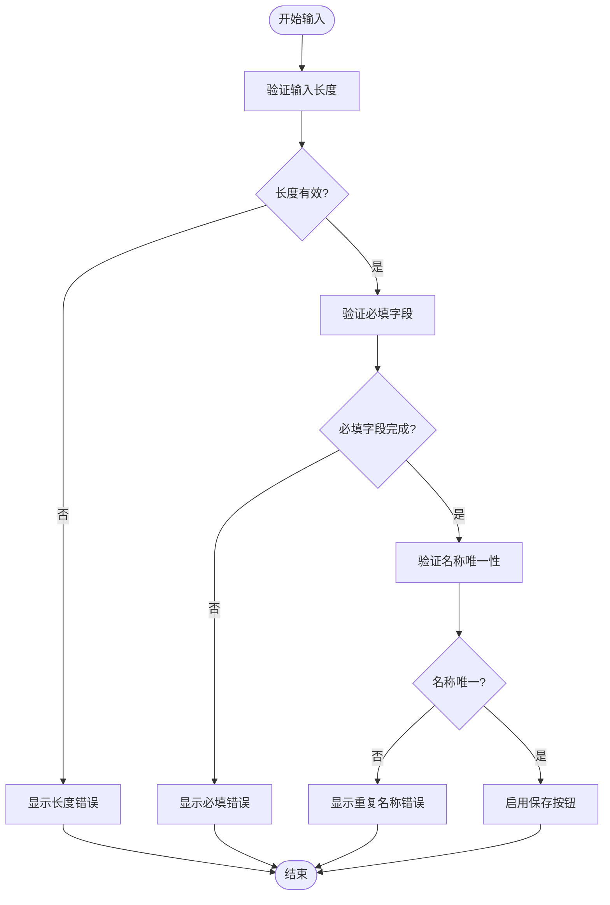
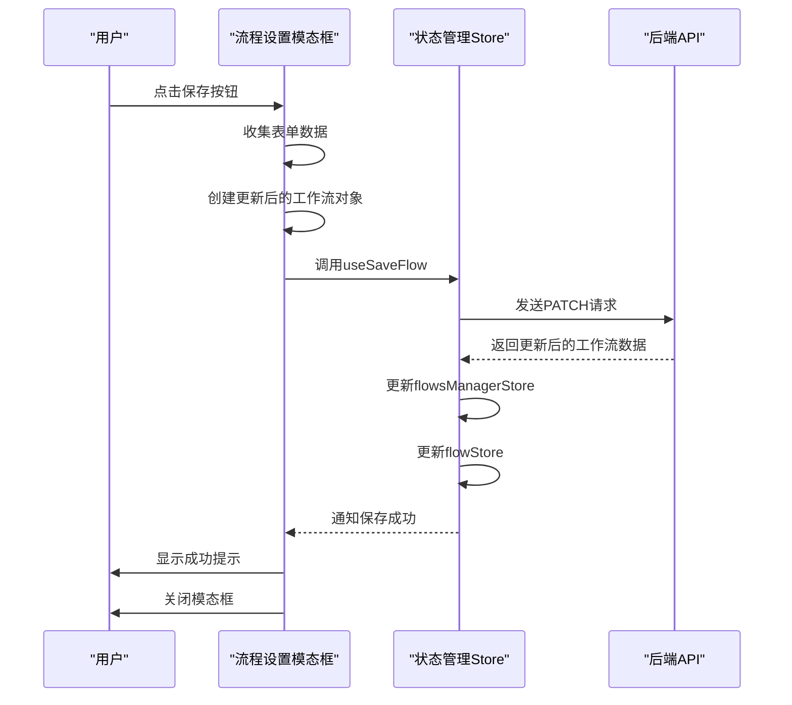

# 流程设置模态框

<cite>
**本文档引用的文件**
- [flowSettingsModal/index.tsx](file://vibe_surf/frontend/src/modals/flowSettingsModal/index.tsx)
- [flowSettingsComponent/index.tsx](file://vibe_surf/frontend/src/components/core/flowSettingsComponent/index.tsx)
- [editFlowSettingsComponent/index.tsx](file://vibe_surf/frontend/src/components/core/editFlowSettingsComponent/index.tsx)
- [use-save-flow.ts](file://vibe_surf/frontend/src/hooks/flows/use-save-flow.ts)
- [flowsManagerStore.ts](file://vibe_surf/frontend/src/stores/flowsManagerStore.ts)
- [flowStore.ts](file://vibe_surf/frontend/src/stores/flowStore.ts)
- [use-patch-update-flow.ts](file://vibe_surf/frontend/src/controllers/API/queries/flows/use-patch-update-flow.ts)
</cite>

## 目录
1. [简介](#简介)
2. [UI布局与组件结构](#ui布局与组件结构)
3. [表单验证逻辑](#表单验证逻辑)
4. [数据持久化同步机制](#数据持久化同步机制)
5. [触发机制与状态管理](#触发机制与状态管理)
6. [权限管理功能](#权限管理功能)
7. [结论](#结论)

## 简介
流程设置模态框（flowSettingsModal）为用户提供了一个配置工作流元数据的界面，允许用户设置工作流的名称、描述和访问权限。该模态框通过与后端API和前端状态管理store（flowStore）的协同工作，实现了数据的持久化同步。本文档将详细阐述其功能实现，包括UI布局、表单验证逻辑、数据同步机制以及在创建或编辑工作流时的触发机制。

**Section sources**
- [flowSettingsModal/index.tsx](file://vibe_surf/frontend/src/modals/flowSettingsModal/index.tsx)

## UI布局与组件结构
流程设置模态框采用分层组件结构，由外层容器`FlowSettingsModal`和内层内容组件`FlowSettingsComponent`组成。外层模态框基于`BaseModal`构建，设置了固定的尺寸（small-update）和内边距（p-4），包含标题"Flow Details"和内容区域。内层组件`FlowSettingsComponent`负责渲染具体的表单内容，包括名称输入框、描述文本域和权限开关。

表单布局采用垂直排列方式，分为两个主要部分：元数据输入区和操作按钮区。元数据输入区包含名称和描述字段，每个字段都有相应的标签和验证消息显示区域。操作按钮区位于底部，包含"Cancel"和"Save"两个按钮，分别用于取消操作和保存更改。

**Section sources**
- [flowSettingsModal/index.tsx](file://vibe_surf/frontend/src/modals/flowSettingsModal/index.tsx)
- [flowSettingsComponent/index.tsx](file://vibe_surf/frontend/src/components/core/flowSettingsComponent/index.tsx)

## 表单验证逻辑
流程设置模态框实现了多层次的表单验证机制，确保用户输入的数据符合要求。验证逻辑主要在`EditFlowSettings`组件中实现，包含以下几种验证类型：

1. **必填验证**：使用Radix UI的Form组件内置验证功能，通过`required`属性确保名称字段不能为空。
2. **长度验证**：对名称和描述字段实施长度限制。名称字段最大长度为50个字符，最小长度为1个字符；描述字段最大长度为250个字符。当输入长度达到限制时，会显示"Character limit reached"提示。
3. **唯一性验证**：检查工作流名称是否已存在。通过比较当前名称与系统中其他工作流名称列表，若发现重复则显示"Flow name already exists"提示。
4. **变更检测**：只有当用户修改了名称、描述或权限设置时，保存按钮才处于启用状态。这种智能禁用机制避免了不必要的保存操作。

**Diagram sources**
- [editFlowSettingsComponent/index.tsx](file://vibe_surf/frontend/src/components/core/editFlowSettingsComponent/index.tsx)

**Section sources**
- [editFlowSettingsComponent/index.tsx](file://vibe_surf/frontend/src/components/core/editFlowSettingsComponent/index.tsx)
- [flowSettingsComponent/index.tsx](file://vibe_surf/frontend/src/components/core/flowSettingsComponent/index.tsx)

## 数据持久化同步机制
流程设置模态框通过与后端API和前端状态管理store的协同工作，实现了数据的持久化同步。当用户点击保存按钮时，触发以下数据同步流程：

1. **数据收集**：从表单中收集用户输入的名称、描述和权限设置。
2. **状态更新**：调用`updateFlowWithFormValues`函数创建新的工作流对象，包含更新后的元数据。
3. **API调用**：通过`useSaveFlow` Hook触发`usePatchUpdateFlow` mutation，向后端发送PATCH请求更新工作流数据。
4. **状态同步**：API调用成功后，更新`flowsManagerStore`中的工作流列表和`flowStore`中的当前工作流状态。
5. **反馈显示**：显示成功提示信息，并关闭模态框。

**Diagram sources**
- [use-save-flow.ts](file://vibe_surf/frontend/src/hooks/flows/use-save-flow.ts)
- [use-patch-update-flow.ts](file://vibe_surf/frontend/src/controllers/API/queries/flows/use-patch-update-flow.ts)

**Section sources**
- [use-save-flow.ts](file://vibe_surf/frontend/src/hooks/flows/use-save-flow.ts)
- [flowsManagerStore.ts](file://vibe_surf/frontend/src/stores/flowsManagerStore.ts)
- [flowStore.ts](file://vibe_surf/frontend/src/stores/flowStore.ts)

## 触发机制与状态管理
流程设置模态框的触发机制基于React的props传递和状态管理。当需要显示模态框时，父组件通过`open` prop将其设置为true，并传递当前工作流数据`flowData`。模态框根据`open`状态决定是否渲染，实现了条件显示。

状态管理采用Zustand store模式，`flowStore`负责管理当前工作流的状态，而`flowsManagerStore`管理所有工作流的列表。当编辑现有工作流时，模态框从`flowStore`获取当前工作流数据；当创建新工作流时，通过`flowData` prop传递初始数据。

用户操作的状态更新流程如下：
- **取消操作**：点击取消按钮调用`close`回调函数，将`open`状态设置为false，关闭模态框而不保存任何更改。
- **保存操作**：点击保存按钮触发表单提交，经过验证后调用API更新数据，成功后更新store状态并关闭模态框。

**Section sources**
- [flowSettingsModal/index.tsx](file://vibe_surf/frontend/src/modals/flowSettingsModal/index.tsx)
- [flowSettingsComponent/index.tsx](file://vibe_surf/frontend/src/components/core/flowSettingsComponent/index.tsx)
- [flowStore.ts](file://vibe_surf/frontend/src/stores/flowStore.ts)

## 权限管理功能
流程设置模态框提供了工作流锁定功能，允许用户通过开关控件设置工作流的访问权限。当"Lock Flow"开关处于开启状态时，工作流被标记为`locked: true`，防止意外修改。

权限管理功能的实现特点包括：
1. **视觉反馈**：使用锁形图标直观显示当前锁定状态，锁定时显示闭合锁，解锁时显示打开锁。
2. **输入禁用**：当工作流被锁定时，名称和描述输入框自动禁用，防止编辑。
3. **状态同步**：锁定状态作为工作流元数据的一部分，与名称和描述一同保存到后端。
4. **提示信息**：提供清晰的提示文字"Lock your flow to prevent edits or accidental changes"，帮助用户理解功能用途。

**Section sources**
- [editFlowSettingsComponent/index.tsx](file://vibe_surf/frontend/src/components/core/editFlowSettingsComponent/index.tsx)

## 结论
流程设置模态框通过精心设计的UI布局、严格的表单验证、可靠的数据同步机制和直观的权限管理，为用户提供了一个完整的配置工作流元数据的解决方案。其组件化架构和状态管理设计确保了代码的可维护性和扩展性，为工作流的创建和编辑提供了稳定可靠的支持。