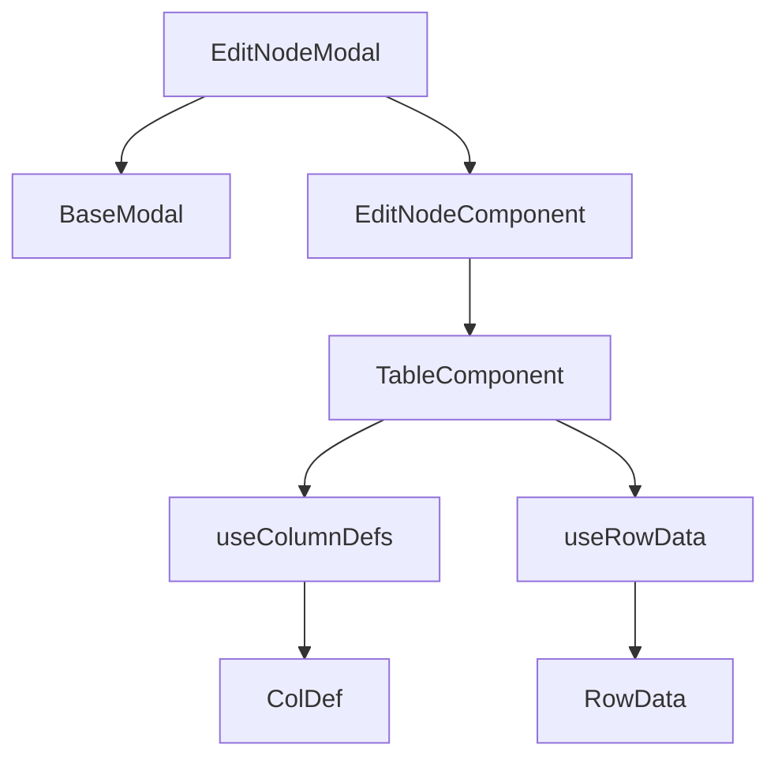
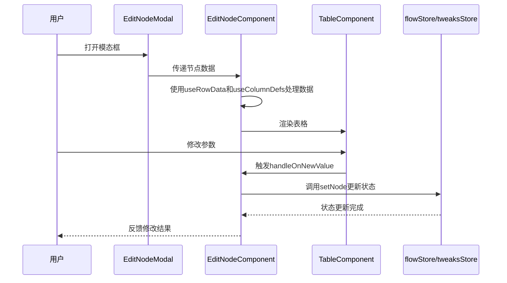

# 节点编辑模态框

<cite>
**本文档引用的文件**   
- [editNodeModal/index.tsx](file://vibe_surf/frontend/src/modals/editNodeModal/index.tsx)
- [editNodeModal/components/editNodeComponent/index.tsx](file://vibe_surf/frontend/src/modals/editNodeModal/components/editNodeComponent/index.tsx)
- [editNodeModal/hooks/use-column-defs.ts](file://vibe_surf/frontend/src/modals/editNodeModal/hooks/use-column-defs.ts)
- [editNodeModal/hooks/use-row-data.ts](file://vibe_surf/frontend/src/modals/editNodeModal/hooks/use-row-data.ts)
- [components/core/parameterRenderComponent/components/tableComponent/index.tsx](file://vibe_surf/frontend/src/components/core/parameterRenderComponent/components/tableComponent/index.tsx)
- [components/core/parameterRenderComponent/components/tableComponent/components/tableNodeCellRender/index.tsx](file://vibe_surf/frontend/src/components/core/parameterRenderComponent/components/tableComponent/components/tableNodeCellRender/index.tsx)
- [components/core/parameterRenderComponent/components/tableComponent/components/tableAdvancedToggleCellRender/index.tsx](file://vibe_surf/frontend/src/components/core/parameterRenderComponent/components/tableComponent/components/tableAdvancedToggleCellRender/index.tsx)
- [CustomNodes/hooks/use-handle-new-value.ts](file://vibe_surf/frontend/src/CustomNodes/hooks/use-handle-new-value.ts)
- [stores/flowStore.ts](file://vibe_surf/frontend/src/stores/flowStore.ts)
- [stores/tweaksStore.ts](file://vibe_surf/frontend/src/stores/tweaksStore.ts)
</cite>

## 目录
1. [简介](#简介)
2. [核心架构与实现](#核心架构与实现)
3. [数据流与状态管理](#数据流与状态管理)
4. [参数验证与用户体验](#参数验证与用户体验)
5. [深度集成与扩展性](#深度集成与扩展性)
6. [结论](#结论)

## 简介

节点编辑模态框（editNodeModal）是工作流编辑器中的核心功能组件，负责提供一个交互式界面来配置和编辑工作流中的各个节点。该模态框通过动态加载和渲染特定节点的配置参数，实现了对复杂表单输入（如高级字段、数据表）的处理，并与React Flow图编辑器进行了深度集成。通过使用Ag-Grid实现数据表格展示，并结合自定义hooks（如use-column-defs, use-row-data）管理表格状态，该组件展现了高度的灵活性和可维护性。此外，它还实现了参数验证、默认值处理、实时预览更新等用户体验优化策略，并通过与flowStore和tweaksStore的数据同步，确保了工作流状态的一致性和持久性。

## 核心架构与实现

节点编辑模态框的设计采用了分层架构，将UI展示、数据处理和状态管理分离，以提高代码的可读性和可维护性。其核心实现包括以下几个关键部分：

- **模态框容器**：`EditNodeModal`组件作为模态框的容器，负责管理模态框的打开和关闭状态，并接收来自父组件的节点数据。
- **表格组件**：`TableComponent`是基于Ag-Grid构建的数据表格组件，用于展示和编辑节点的配置参数。它支持动态列定义、行数据绑定和丰富的交互功能。
- **自定义hooks**：`useColumnDefs`和`useRowData`是两个自定义hooks，分别用于生成表格的列定义和行数据。它们通过接收节点类和节点ID等参数，动态地构建出适合当前节点的表格结构。

**图表来源**
- [editNodeModal/index.tsx](file://vibe_surf/frontend/src/modals/editNodeModal/index.tsx)
- [editNodeModal/components/editNodeComponent/index.tsx](file://vibe_surf/frontend/src/modals/editNodeModal/components/editNodeComponent/index.tsx)
- [components/core/parameterRenderComponent/components/tableComponent/index.tsx](file://vibe_surf/frontend/src/components/core/parameterRenderComponent/components/tableComponent/index.tsx)

**章节来源**
- [editNodeModal/index.tsx](file://vibe_surf/frontend/src/modals/editNodeModal/index.tsx)
- [editNodeModal/components/editNodeComponent/index.tsx](file://vibe_surf/frontend/src/modals/editNodeModal/components/editNodeComponent/index.tsx)

## 数据流与状态管理

节点编辑模态框的数据流设计遵循单向数据流原则，确保数据的流动清晰且可预测。当用户打开模态框时，`EditNodeModal`组件会接收节点数据，并将其传递给`EditNodeComponent`。后者通过`useRowData`hook从节点类中提取出需要展示的参数，并通过`useColumnDefs`hook生成相应的列定义。这些数据随后被传递给`TableComponent`进行渲染。

状态管理方面，该组件依赖于Zustand库提供的全局状态管理机制。`flowStore`和`tweaksStore`是两个关键的状态存储，分别用于管理工作流的整体状态和节点的微调参数。当用户在模态框中修改节点参数时，`handleOnNewValue`函数会被调用，它会触发`setNode`操作，从而更新`flowStore`中的节点状态。同时，如果涉及到微调参数的修改，`tweaksStore`也会相应地更新，以确保所有更改都能被正确保存和同步。

**图表来源**
- [editNodeModal/index.tsx](file://vibe_surf/frontend/src/modals/editNodeModal/index.tsx)
- [editNodeModal/components/editNodeComponent/index.tsx](file://vibe_surf/frontend/src/modals/editNodeModal/components/editNodeComponent/index.tsx)
- [CustomNodes/hooks/use-handle-new-value.ts](file://vibe_surf/frontend/src/CustomNodes/hooks/use-handle-new-value.ts)
- [stores/flowStore.ts](file://vibe_surf/frontend/src/stores/flowStore.ts)
- [stores/tweaksStore.ts](file://vibe_surf/frontend/src/stores/tweaksStore.ts)

**章节来源**
- [editNodeModal/index.tsx](file://vibe_surf/frontend/src/modals/editNodeModal/index.tsx)
- [editNodeModal/components/editNodeComponent/index.tsx](file://vibe_surf/frontend/src/modals/editNodeComponent/index.tsx)
- [CustomNodes/hooks/use-handle-new-value.ts](file://vibe_surf/frontend/src/CustomNodes/hooks/use-handle-new-value.ts)

## 参数验证与用户体验

为了提升用户体验，节点编辑模态框实现了一系列参数验证和优化策略。首先，通过`useHandleOnNewValue`hook中的`mutateTemplate`函数，组件能够在用户输入时实时验证参数的有效性，并根据需要自动刷新节点状态。其次，对于某些特定类型的输入字段（如代码编辑器），组件提供了防抖功能，避免频繁的API调用影响性能。

此外，模态框还支持默认值处理和实时预览更新。当用户首次打开某个节点的编辑界面时，未显式设置的参数将显示其默认值。用户在编辑过程中所做的任何更改都会立即反映在预览区域，使用户能够直观地看到修改效果。这种即时反馈机制极大地提高了工作效率，减少了试错成本。

**章节来源**
- [CustomNodes/hooks/use-handle-new-value.ts](file://vibe_surf/frontend/src/CustomNodes/hooks/use-handle-new-value.ts)
- [components/core/parameterRenderComponent/index.tsx](file://vibe_surf/frontend/src/components/core/parameterRenderComponent/index.tsx)

## 深度集成与扩展性

节点编辑模态框与React Flow图编辑器的深度集成体现在多个层面。一方面，它能够准确地反映图编辑器中节点的当前状态，包括位置、连接关系等；另一方面，它还能响应图编辑器中的事件，如节点选择变化、连接建立或断开等，确保两者之间的状态始终保持一致。

在扩展性方面，该组件的设计充分考虑了未来可能的需求变化。通过使用自定义hooks和可配置的表格组件，开发者可以轻松地添加新的参数类型或修改现有参数的展示方式，而无需改动核心逻辑。此外，Ag-Grid的强大功能也为后续的功能增强提供了坚实的基础，例如支持更复杂的排序、过滤和分组操作。

**章节来源**
- [editNodeModal/index.tsx](file://vibe_surf/frontend/src/modals/editNodeModal/index.tsx)
- [components/core/parameterRenderComponent/components/tableComponent/index.tsx](file://vibe_surf/frontend/src/components/core/parameterRenderComponent/components/tableComponent/index.tsx)

## 结论

综上所述，节点编辑模态框是一个设计精良、功能全面的组件，它不仅满足了基本的节点配置需求，还通过一系列高级特性和优化策略显著提升了用户体验。通过对数据流的精心设计和状态管理的有效实施，该组件确保了工作流编辑过程的流畅性和可靠性。未来，随着更多功能的加入和技术的演进，相信这一组件将在工作流自动化领域发挥更加重要的作用。