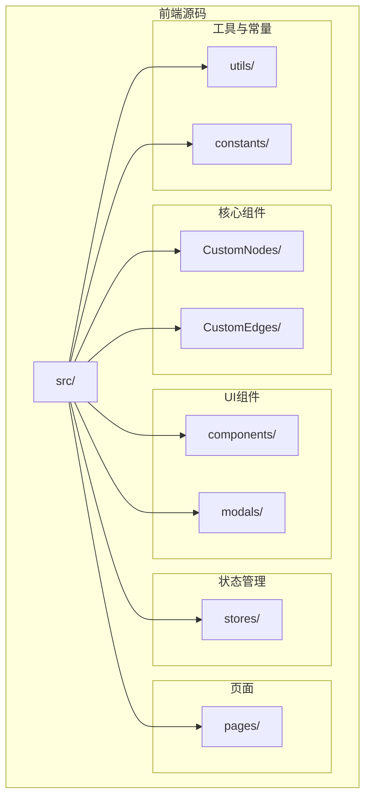
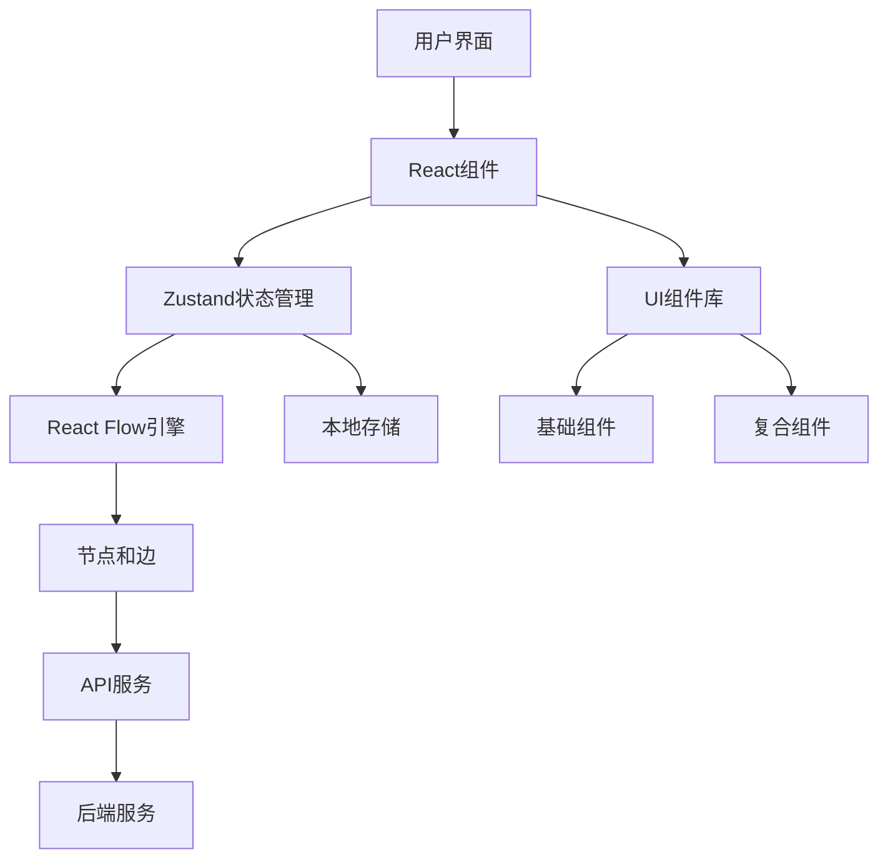
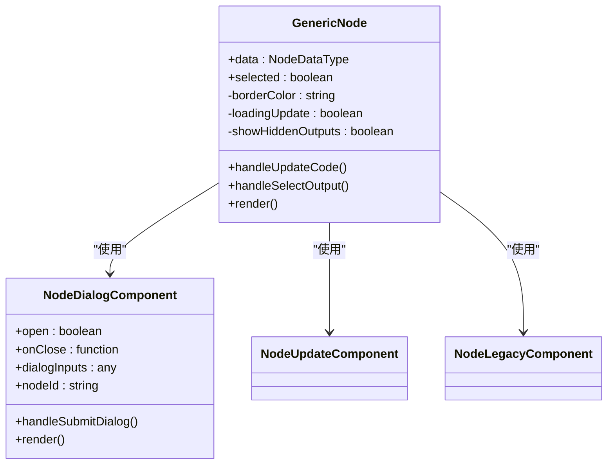
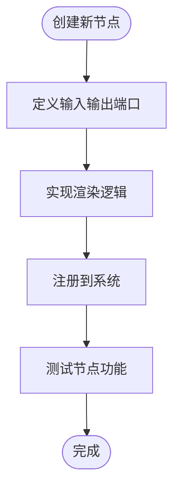
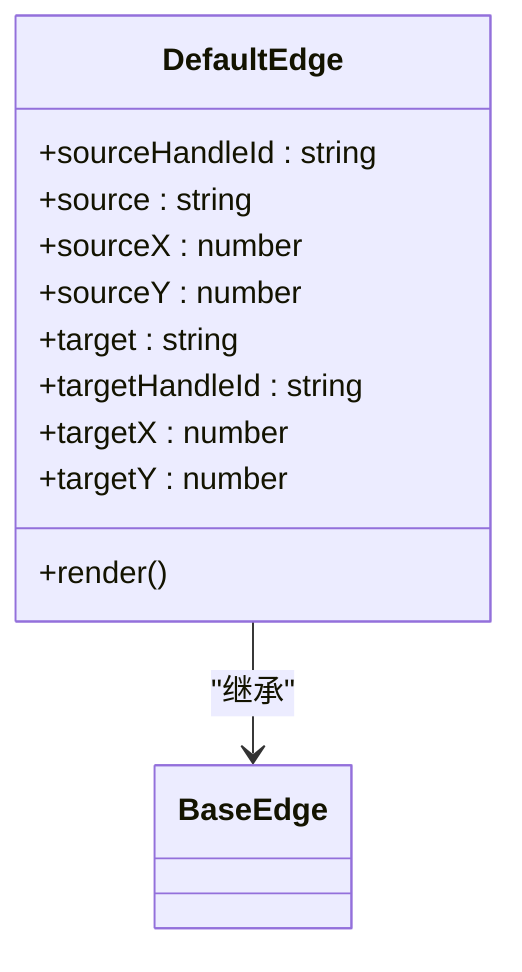
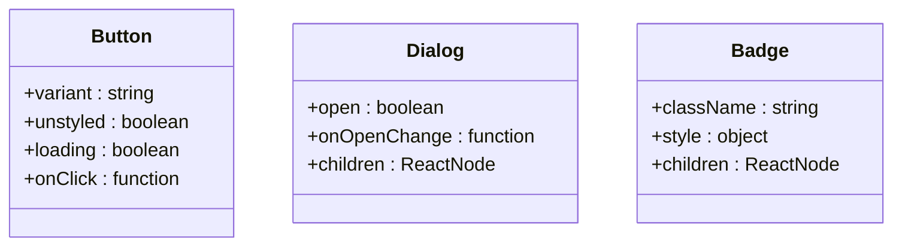
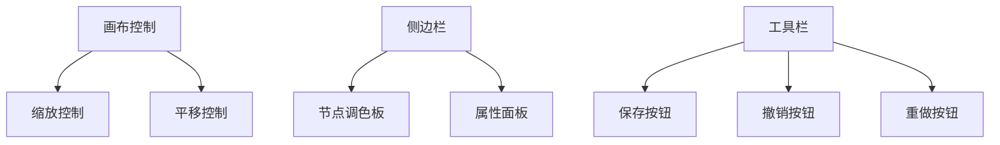
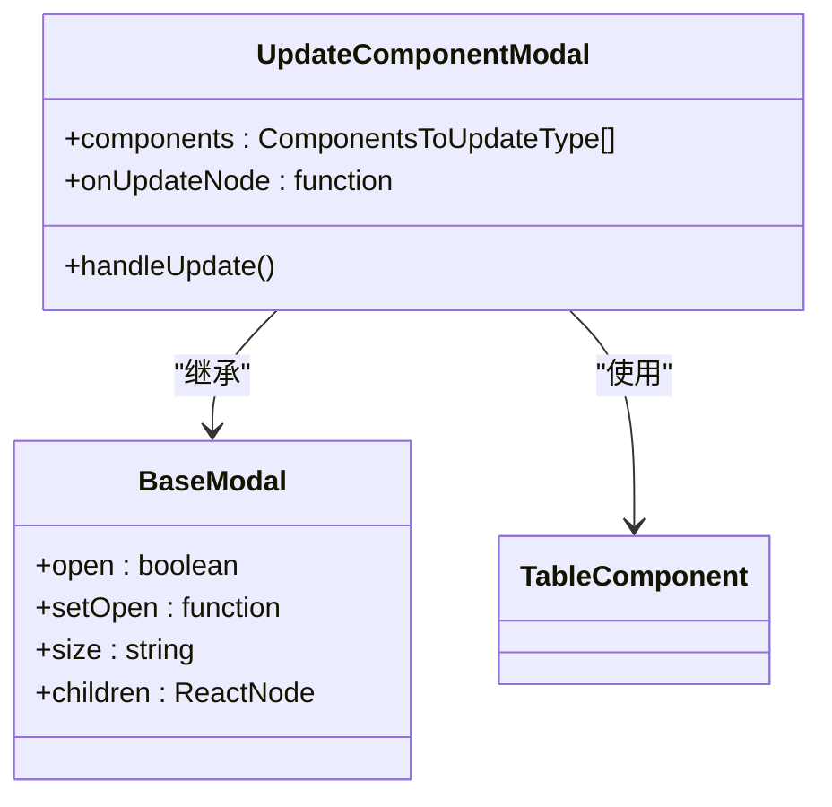

# 组件架构

<cite>
**本文档引用的文件**  
- [App.tsx](file://vibe_surf/frontend/src/App.tsx)
- [index.tsx](file://vibe_surf/frontend/src/index.tsx)
- [routes.tsx](file://vibe_surf/frontend/src/routes.tsx)
- [CustomEdges/index.tsx](file://vibe_surf/frontend/src/CustomEdges/index.tsx)
- [CustomNodes/GenericNode/index.tsx](file://vibe_surf/frontend/src/CustomNodes/GenericNode/index.tsx)
- [CustomNodes/GenericNode/components/NodeDialogComponent/index.tsx](file://vibe_surf/frontend/src/CustomNodes/GenericNode/components/NodeDialogComponent/index.tsx)
- [CustomNodes/GenericNode/components/HandleTooltipComponent/index.tsx](file://vibe_surf/frontend/src/CustomNodes/GenericNode/components/HandleTooltipComponent/index.tsx)
- [modals/updateComponentModal/index.tsx](file://vibe_surf/frontend/src/modals/updateComponentModal/index.tsx)
- [stores/flowStore.ts](file://vibe_surf/frontend/src/stores/flowStore.ts)
- [CustomNodes/helpers/process-node-advanced-fields.ts](file://vibe_surf/frontend/src/CustomNodes/helpers/process-node-advanced-fields.ts)
- [CustomNodes/hooks/use-update-node-code.ts](file://vibe_surf/frontend/src/CustomNodes/hooks/use-update-node-code.ts)
</cite>

## 目录
1. [简介](#简介)
2. [项目结构](#项目结构)
3. [核心组件](#核心组件)
4. [架构概述](#架构概述)
5. [详细组件分析](#详细组件分析)
6. [依赖分析](#依赖分析)
7. [性能考虑](#性能考虑)
8. [故障排除指南](#故障排除指南)
9. [结论](#结论)

## 简介
VibeSurf前端组件架构基于React构建，采用模块化设计，专注于工作流可视化编辑器的实现。系统核心是CustomNodes和CustomEdges组件，它们与React Flow库深度集成，实现了可视化工作流的构建和交互。UI组件库组织清晰，包含基础组件（如按钮、对话框）和复合组件（如画布控制、侧边栏），支持高度可复用性和灵活的扩展性。

## 项目结构
VibeSurf前端项目位于`vibe_surf/frontend/src`目录下，采用功能驱动的组织结构。核心组件分为CustomNodes和CustomEdges，分别处理工作流中的节点和连接线。`components`目录包含UI组件库，`stores`目录管理全局状态，`modals`目录处理模态框系统，`pages`目录组织应用页面。



**Diagram sources**
- [App.tsx](file://vibe_surf/frontend/src/App.tsx)
- [index.tsx](file://vibe_surf/frontend/src/index.tsx)

**Section sources**
- [App.tsx](file://vibe_surf/frontend/src/App.tsx)
- [index.tsx](file://vibe_surf/frontend/src/index.tsx)

## 核心组件
VibeSurf的核心组件包括CustomNodes和CustomEdges，它们构成了工作流可视化编辑器的基础。CustomNodes实现了可配置的节点组件，支持输入输出端口、状态显示和动态内容渲染。CustomEdges则负责连接线的渲染和交互，支持贝塞尔曲线和条件样式。

**Section sources**
- [CustomEdges/index.tsx](file://vibe_surf/frontend/src/CustomEdges/index.tsx)
- [CustomNodes/GenericNode/index.tsx](file://vibe_surf/frontend/src/CustomNodes/GenericNode/index.tsx)

## 架构概述
VibeSurf前端采用React + Zustand + React Flow的技术栈，实现了高效的状态管理和可视化渲染。应用通过React Router进行路由管理，Zustand store管理全局状态，React Flow提供画布和节点交互能力。



**Diagram sources**
- [routes.tsx](file://vibe_surf/frontend/src/routes.tsx)
- [stores/flowStore.ts](file://vibe_surf/frontend/src/stores/flowStore.ts)

## 详细组件分析

### CustomNodes分析
CustomNodes是工作流编辑器的核心，实现了GenericNode组件，支持多种节点类型和复杂交互。

#### 节点实现机制


**Diagram sources**
- [CustomNodes/GenericNode/index.tsx](file://vibe_surf/frontend/src/CustomNodes/GenericNode/index.tsx)
- [CustomNodes/GenericNode/components/NodeDialogComponent/index.tsx](file://vibe_surf/frontend/src/CustomNodes/GenericNode/components/NodeDialogComponent/index.tsx)

**Section sources**
- [CustomNodes/GenericNode/index.tsx](file://vibe_surf/frontend/src/CustomNodes/GenericNode/index.tsx)

#### 节点扩展开发指南
创建新的节点类型需要遵循以下步骤：
1. 在`CustomNodes`目录下创建新的节点组件
2. 定义节点的输入输出端口
3. 实现节点的渲染逻辑
4. 注册节点到系统



**Diagram sources**
- [CustomNodes/GenericNode/index.tsx](file://vibe_surf/frontend/src/CustomNodes/GenericNode/index.tsx)

### CustomEdges分析
CustomEdges组件负责工作流中连接线的渲染和交互，支持条件样式和动态路径计算。



**Diagram sources**
- [CustomEdges/index.tsx](file://vibe_surf/frontend/src/CustomEdges/index.tsx)

**Section sources**
- [CustomEdges/index.tsx](file://vibe_surf/frontend/src/CustomEdges/index.tsx)

### UI组件库分析
UI组件库组织在`components`目录下，分为基础组件和复合组件。

#### 基础组件
基础组件包括按钮、对话框、表格等，提供一致的UI风格和交互体验。



**Diagram sources**
- [components/ui/button](file://vibe_surf/frontend/src/components/ui/button)
- [components/ui/dialog](file://vibe_surf/frontend/src/components/ui/dialog)
- [components/ui/badge](file://vibe_surf/frontend/src/components/ui/badge)

#### 复合组件
复合组件包括画布控制、侧边栏、工具栏等，由多个基础组件组合而成。



**Diagram sources**
- [components/core](file://vibe_surf/frontend/src/components/core)
- [pages/FlowPage](file://vibe_surf/frontend/src/pages/FlowPage)

### 模态框系统架构
模态框系统采用分层设计，支持嵌套模态和动态加载。



**Diagram sources**
- [modals/updateComponentModal/index.tsx](file://vibe_surf/frontend/src/modals/updateComponentModal/index.tsx)
- [modals/baseModal](file://vibe_surf/frontend/src/modals/baseModal)

**Section sources**
- [modals/updateComponentModal/index.tsx](file://vibe_surf/frontend/src/modals/updateComponentModal/index.tsx)

## 依赖分析
VibeSurf前端组件之间存在清晰的依赖关系，通过Zustand store进行状态共享和通信。

```mermaid
graph TD
GenericNode --> flowStore : "读取节点和边"
GenericNode --> alertStore : "显示错误信息"
GenericNode --> typesStore : "获取类型信息"
CustomEdges --> flowStore : "读取节点位置"
UpdateComponentModal --> flowStore : "获取当前流程"
UpdateComponentModal --> duplicateFlow : "创建备份"
```

**Diagram sources**
- [stores/flowStore.ts](file://vibe_surf/frontend/src/stores/flowStore.ts)
- [CustomNodes/GenericNode/index.tsx](file://vibe_surf/frontend/src/CustomNodes/GenericNode/index.tsx)
- [modals/updateComponentModal/index.tsx](file://vibe_surf/frontend/src/modals/updateComponentModal/index.tsx)

**Section sources**
- [stores/flowStore.ts](file://vibe_surf/frontend/src/stores/flowStore.ts)

## 性能考虑
VibeSurf前端在性能方面做了多项优化：
- 使用React.memo进行组件记忆化
- 采用useCallback和useMemo优化函数和值的创建
- 实现虚拟滚动和懒加载
- 优化状态更新频率

## 故障排除指南
常见问题及解决方案：

| 问题 | 可能原因 | 解决方案 |
|------|--------|---------|
| 节点无法连接 | 类型不兼容 | 检查输入输出类型匹配 |
| 更新组件失败 | 网络问题 | 检查网络连接 |
| 模态框不显示 | 状态错误 | 检查open状态设置 |
| 性能下降 | 节点过多 | 优化节点渲染 |

**Section sources**
- [CustomNodes/GenericNode/index.tsx](file://vibe_surf/frontend/src/CustomNodes/GenericNode/index.tsx)
- [stores/flowStore.ts](file://vibe_surf/frontend/src/stores/flowStore.ts)

## 结论
VibeSurf前端组件架构设计合理，采用模块化和可扩展的设计原则。CustomNodes和CustomEdges的实现机制灵活，支持复杂的工作流可视化需求。UI组件库组织清晰，基础组件和复合组件分离，便于维护和扩展。模态框系统支持嵌套和动态加载，提供了良好的用户体验。整体架构具有良好的可维护性和扩展性，为未来的功能开发奠定了坚实基础。