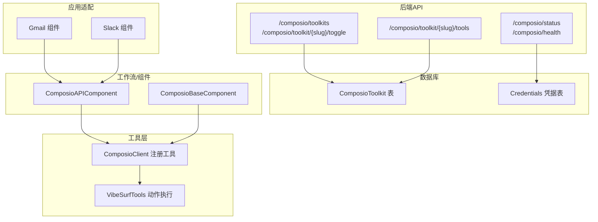
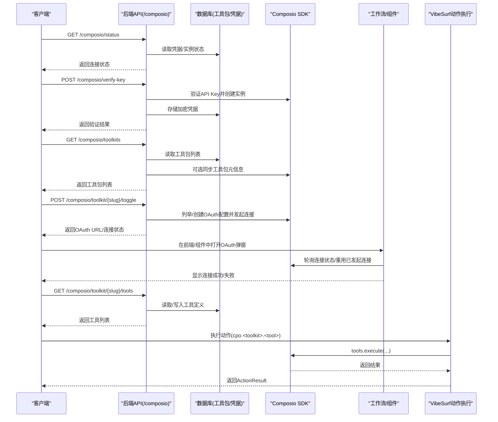
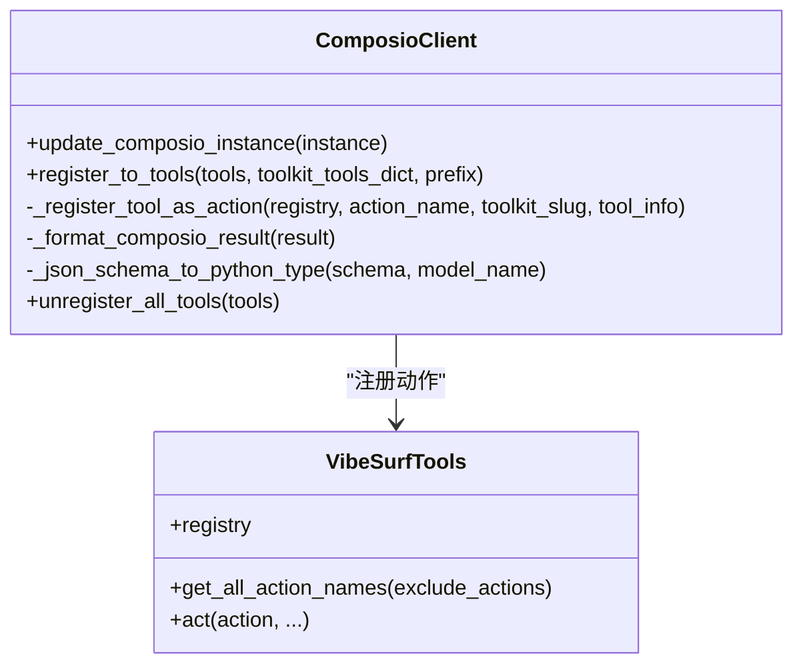
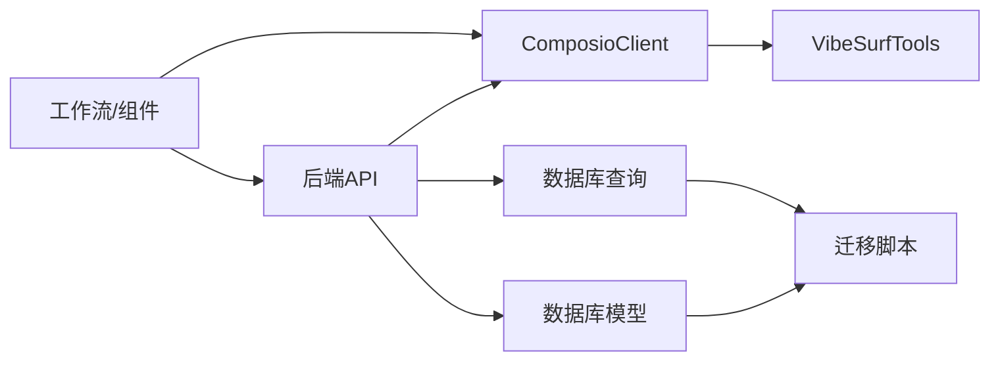
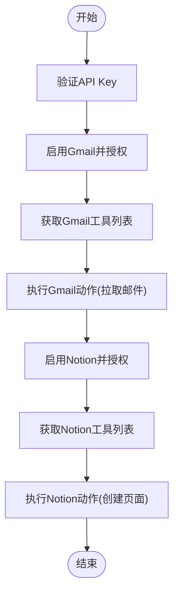

# Composio集成API

<cite>
**本文引用的文件**
- [vibe_surf/backend/api/composio.py](file://vibe_surf/backend/api/composio.py)
- [vibe_surf/tools/composio_client.py](file://vibe_surf/tools/composio_client.py)
- [vibe_surf/workflows/Integrations/composio_api.py](file://vibe_surf/workflows/Integrations/composio_api.py)
- [vibe_surf/backend/database/models.py](file://vibe_surf/backend/database/models.py)
- [vibe_surf/backend/database/queries.py](file://vibe_surf/backend/database/queries.py)
- [vibe_surf/backend/database/migrations/v005_add_composio_integration.sql](file://vibe_surf/backend/database/migrations/v005_add_composio_integration.sql)
- [vibe_surf/backend/database/migrations/v006_add_credentials_table.sql](file://vibe_surf/backend/database/migrations/v006_add_credentials_table.sql)
- [vibe_surf/workflows/Integrations/gmail_composio.py](file://vibe_surf/workflows/Integrations/gmail_composio.py)
- [vibe_surf/workflows/Integrations/slack_composio.py](file://vibe_surf/workflows/Integrations/slack_composio.py)
- [vibe_surf/langflow/base/composio/composio_base.py](file://vibe_surf/langflow/base/composio/composio_base.py)
</cite>

## 目录
1. [简介](#简介)
2. [项目结构](#项目结构)
3. [核心组件](#核心组件)
4. [架构总览](#架构总览)
5. [详细组件分析](#详细组件分析)
6. [依赖关系分析](#依赖关系分析)
7. [性能与并发特性](#性能与并发特性)
8. [故障排查指南](#故障排查指南)
9. [结论](#结论)
10. [附录：端点与使用示例](#附录端点与使用示例)

## 简介
本文件系统性梳理 VibeSurf 中的 Composio 集成 API，覆盖后端 FastAPI 路由、数据库模型与查询、前端/工作流组件、以及工具注册与动作执行链路。重点说明：
- 支持的端点与请求/响应模式（含 OAuth2 流程、令牌管理与刷新机制）
- 应用与工具清单、连接状态查询
- 动作执行（工具调用）与返回结果格式
- 常见错误场景（认证失败、配额/速率限制等）与排障建议
- 实际调用示例与跨应用自动化工作流思路

## 项目结构
围绕 Composio 的关键模块分布如下：
- 后端 API：提供 Composio 状态、工具包、工具列表、连接开关、健康检查等接口
- 数据库：存储 Composio 工具包元数据、启用状态、工具定义、加密凭据
- 工具层：将 Composio 工具动态注册为 VibeSurf 动作，统一参数校验与结果格式
- 工作流/组件：在 Langflow/前端侧封装 Composio 组件，负责 OAuth 引导与工具选择
- 应用适配器：针对具体应用（如 Gmail、Slack）提供默认工具与后处理

图表来源
- [vibe_surf/backend/api/composio.py](file://vibe_surf/backend/api/composio.py#L225-L1047)
- [vibe_surf/backend/database/models.py](file://vibe_surf/backend/database/models.py#L192-L215)
- [vibe_surf/backend/database/migrations/v005_add_composio_integration.sql](file://vibe_surf/backend/database/migrations/v005_add_composio_integration.sql#L1-L33)
- [vibe_surf/backend/database/migrations/v006_add_credentials_table.sql](file://vibe_surf/backend/database/migrations/v006_add_credentials_table.sql#L1-L26)
- [vibe_surf/tools/composio_client.py](file://vibe_surf/tools/composio_client.py#L1-L458)
- [vibe_surf/workflows/Integrations/composio_api.py](file://vibe_surf/workflows/Integrations/composio_api.py#L1-L280)
- [vibe_surf/langflow/base/composio/composio_base.py](file://vibe_surf/langflow/base/composio/composio_base.py#L59-L108)
- [vibe_surf/workflows/Integrations/gmail_composio.py](file://vibe_surf/workflows/Integrations/gmail_composio.py#L1-L39)
- [vibe_surf/workflows/Integrations/slack_composio.py](file://vibe_surf/workflows/Integrations/slack_composio.py#L1-L12)

章节来源
- [vibe_surf/backend/api/composio.py](file://vibe_surf/backend/api/composio.py#L225-L1047)
- [vibe_surf/backend/database/models.py](file://vibe_surf/backend/database/models.py#L192-L215)
- [vibe_surf/backend/database/migrations/v005_add_composio_integration.sql](file://vibe_surf/backend/database/migrations/v005_add_composio_integration.sql#L1-L33)
- [vibe_surf/backend/database/migrations/v006_add_credentials_table.sql](file://vibe_surf/backend/database/migrations/v006_add_credentials_table.sql#L1-L26)

## 核心组件
- Composio 后端路由与模型
  - 提供状态检查、工具包列表、工具切换（含 OAuth2 引导）、工具列表、健康检查等接口
  - 使用 Pydantic 模型定义请求/响应结构，确保类型安全
- ComposioClient 工具注册器
  - 将 Composio 工具转换为 VibeSurf 动作，自动解析参数 JSON Schema 并生成 Pydantic 参数模型
  - 统一动作包装器，捕获异常并记录遥测
- 数据库模型与查询
  - ComposioToolkit：存储工具包元信息、启用状态、工具定义（JSON）
  - Credentials：存储加密凭据（如 Composio API Key）
  - 查询类提供 CRUD、启用状态切换、按 slug 更新等能力
- 工作流/组件层
  - ComposioAPIComponent：在 Langflow/前端侧提供 API Key 输入、工具选择、OAuth 引导、连接状态检查
  - ComposioBaseComponent：通用 OAuth 引导、连接状态轮询、重用已发起的连接
- 应用适配器
  - Gmail、Slack 等组件基于基础组件扩展默认工具与后处理逻辑

章节来源
- [vibe_surf/backend/api/composio.py](file://vibe_surf/backend/api/composio.py#L31-L120)
- [vibe_surf/tools/composio_client.py](file://vibe_surf/tools/composio_client.py#L1-L120)
- [vibe_surf/backend/database/models.py](file://vibe_surf/backend/database/models.py#L192-L215)
- [vibe_surf/backend/database/queries.py](file://vibe_surf/backend/database/queries.py#L1249-L1328)
- [vibe_surf/workflows/Integrations/composio_api.py](file://vibe_surf/workflows/Integrations/composio_api.py#L1-L120)
- [vibe_surf/langflow/base/composio/composio_base.py](file://vibe_surf/langflow/base/composio/composio_base.py#L59-L108)
- [vibe_surf/workflows/Integrations/gmail_composio.py](file://vibe_surf/workflows/Integrations/gmail_composio.py#L1-L39)
- [vibe_surf/workflows/Integrations/slack_composio.py](file://vibe_surf/workflows/Integrations/slack_composio.py#L1-L12)

## 架构总览
下图展示从 API 请求到工具执行的完整链路，以及 OAuth2 连接引导流程。

图表来源
- [vibe_surf/backend/api/composio.py](file://vibe_surf/backend/api/composio.py#L225-L1047)
- [vibe_surf/tools/composio_client.py](file://vibe_surf/tools/composio_client.py#L180-L299)
- [vibe_surf/workflows/Integrations/composio_api.py](file://vibe_surf/workflows/Integrations/composio_api.py#L122-L235)
- [vibe_surf/langflow/base/composio/composio_base.py](file://vibe_surf/langflow/base/composio/composio_base.py#L752-L802)

## 详细组件分析

### 后端 API 路由与数据模型
- 端点概览
  - GET /composio/status：检查 Composio 连接状态（是否已配置 API Key、实例是否可用）
  - POST /composio/verify-key：验证并保存 Composio API Key（加密存储于凭据表）
  - GET /composio/toolkits：列出工具包（可选与远端同步），返回工具包列表与计数
  - POST /composio/toolkit/{slug}/toggle：启用/禁用工具包；若需 OAuth2，返回 OAuth URL 与连接状态
  - GET /composio/toolkit/{slug}/tools：获取指定工具包的工具列表（优先从本地缓存，否则拉取远端并落库）
  - GET /composio/health：健康检查（无 API Key 时返回提示）
- 关键数据模型
  - ComposioToolkit：id、name、slug、description、logo、app_url、enabled、tools(JSON)、时间戳
  - Credentials：key_name 唯一、encrypted_value、描述、时间戳
- 请求/响应模式
  - verify-key：请求体包含 api_key；响应体包含 valid、message、可选 user_info
  - toolkits/toggle/tools：使用 Pydantic 模型定义，字段覆盖 id、name、slug、tools、enabled、connection_status 等
- OAuth2 流程
  - 后端在 toggle 时根据工具包的 auth_schemes 判断是否需要 OAuth2
  - 若需要，后端创建/复用 auth config，并通过 connected_accounts.initiate 发起连接，返回 redirect_url
  - 前端/组件侧在弹窗中完成授权，随后轮询连接状态或重用已发起的连接

章节来源
- [vibe_surf/backend/api/composio.py](file://vibe_surf/backend/api/composio.py#L225-L1047)
- [vibe_surf/backend/database/models.py](file://vibe_surf/backend/database/models.py#L192-L215)
- [vibe_surf/backend/database/migrations/v005_add_composio_integration.sql](file://vibe_surf/backend/database/migrations/v005_add_composio_integration.sql#L1-L33)
- [vibe_surf/backend/database/migrations/v006_add_credentials_table.sql](file://vibe_surf/backend/database/migrations/v006_add_credentials_table.sql#L1-L26)

### 工具注册与动作执行（ComposioClient）
- 注册流程
  - 从数据库/后端获取工具包工具列表（JSON Schema）
  - 解析参数 JSON Schema，动态生成 Pydantic 参数模型
  - 将每个工具注册为 VibeSurf 动作，前缀为 cpo.<toolkit>.<tool>
- 执行流程
  - 动作被调用时，ComposioClient 包装器将参数转为字典并调用 composio_instance.tools.execute
  - 结果统一格式化为 ActionResult，包含提取内容与长记忆
  - 捕获异常并记录遥测事件（工具名、耗时、错误信息）

图表来源
- [vibe_surf/tools/composio_client.py](file://vibe_surf/tools/composio_client.py#L1-L120)
- [vibe_surf/tools/composio_client.py](file://vibe_surf/tools/composio_client.py#L128-L299)
- [vibe_surf/tools/vibesurf_tools.py](file://vibe_surf/tools/vibesurf_tools.py#L2228-L2255)

章节来源
- [vibe_surf/tools/composio_client.py](file://vibe_surf/tools/composio_client.py#L1-L458)
- [vibe_surf/tools/vibesurf_tools.py](file://vibe_surf/tools/vibesurf_tools.py#L2228-L2255)

### 工作流/组件层（Langflow/前端）
- ComposioAPIComponent
  - 输入：entity_id、api_key、tool_name、actions
  - 功能：更新构建配置（列出工具、检查连接、触发 OAuth）、构建工具集合
  - 连接检查：connected_accounts.list 查询 ACTIVE 连接；若无则创建 auth config 并发起连接，返回 redirect_url
- ComposioBaseComponent
  - 通用 OAuth 引导：_initiate_connection 创建 auth config 并发起连接，返回 redirect_url 与 connection_id
  - 状态轮询：_check_connection_status_by_id 通过 nanoid 获取连接状态

章节来源
- [vibe_surf/workflows/Integrations/composio_api.py](file://vibe_surf/workflows/Integrations/composio_api.py#L1-L235)
- [vibe_surf/langflow/base/composio/composio_base.py](file://vibe_surf/langflow/base/composio/composio_base.py#L752-L802)

### 应用适配器（示例）
- Gmail 组件：提供默认工具与响应后处理（如发送邮件返回 message_id、thread_id 等）
- Slack 组件：提供默认工具（显示名称、图标、文档链接）

章节来源
- [vibe_surf/workflows/Integrations/gmail_composio.py](file://vibe_surf/workflows/Integrations/gmail_composio.py#L1-L39)
- [vibe_surf/workflows/Integrations/slack_composio.py](file://vibe_surf/workflows/Integrations/slack_composio.py#L1-L12)

## 依赖关系分析
- 后端 API 依赖数据库模型与查询类，用于持久化工具包与凭据
- ComposioClient 依赖 VibeSurf 动作注册器，将外部工具映射为内部动作
- 工作流/组件依赖 Composio SDK，负责 OAuth 引导与工具集合构建
- 数据库迁移脚本确保工具包表与凭据表存在并具备索引与触发器

图表来源
- [vibe_surf/backend/api/composio.py](file://vibe_surf/backend/api/composio.py#L225-L1047)
- [vibe_surf/backend/database/models.py](file://vibe_surf/backend/database/models.py#L192-L215)
- [vibe_surf/backend/database/queries.py](file://vibe_surf/backend/database/queries.py#L1249-L1328)
- [vibe_surf/backend/database/migrations/v005_add_composio_integration.sql](file://vibe_surf/backend/database/migrations/v005_add_composio_integration.sql#L1-L33)
- [vibe_surf/backend/database/migrations/v006_add_credentials_table.sql](file://vibe_surf/backend/database/migrations/v006_add_credentials_table.sql#L1-L26)

章节来源
- [vibe_surf/backend/api/composio.py](file://vibe_surf/backend/api/composio.py#L225-L1047)
- [vibe_surf/backend/database/models.py](file://vibe_surf/backend/database/models.py#L192-L215)
- [vibe_surf/backend/database/queries.py](file://vibe_surf/backend/database/queries.py#L1249-L1328)
- [vibe_surf/backend/database/migrations/v005_add_composio_integration.sql](file://vibe_surf/backend/database/migrations/v005_add_composio_integration.sql#L1-L33)
- [vibe_surf/backend/database/migrations/v006_add_credentials_table.sql](file://vibe_surf/backend/database/migrations/v006_add_credentials_table.sql#L1-L26)

## 性能与并发特性
- 异步数据库访问：API 路由使用 AsyncSession，避免阻塞
- 线程池调用：对 Composio SDK 的阻塞调用使用 asyncio.to_thread 包裹，避免阻塞事件循环
- 缓存策略：工具包与工具列表优先从本地缓存读取，减少远端调用次数
- 参数解析：ComposioClient 动态生成 Pydantic 模型，避免运行时反射开销过大

章节来源
- [vibe_surf/backend/api/composio.py](file://vibe_surf/backend/api/composio.py#L423-L529)
- [vibe_surf/tools/composio_client.py](file://vibe_surf/tools/composio_client.py#L128-L299)

## 故障排查指南
- 认证失败/未配置 API Key
  - 现象：/composio/status 返回未配置；/composio/verify-key 返回无效
  - 处理：先调用 /composio/verify-key 验证并保存 API Key；确认凭据表中已加密存储
- OAuth2 授权未完成
  - 现象：toggle 返回 pending_auth 或 error；前端弹窗无法完成授权
  - 处理：检查 redirect_url 是否有效；在组件侧重试连接或轮询连接状态；必要时设置 force_reauth
- 工具包/工具列表为空
  - 现象：/composio/toolkits 或 /composio/toolkit/{slug}/tools 返回空
  - 处理：确认已启用工具包且连接成功；必要时强制重新授权；检查本地缓存是否已写入
- 健康检查异常
  - 现象：/composio/health 返回 no_api_key 或 error
  - 处理：检查 API Key 是否正确；查看后端日志定位异常

章节来源
- [vibe_surf/backend/api/composio.py](file://vibe_surf/backend/api/composio.py#L225-L364)
- [vibe_surf/backend/api/composio.py](file://vibe_surf/backend/api/composio.py#L531-L728)
- [vibe_surf/backend/api/composio.py](file://vibe_surf/backend/api/composio.py#L731-L800)
- [vibe_surf/backend/api/composio.py](file://vibe_surf/backend/api/composio.py#L999-L1047)
- [vibe_surf/langflow/base/composio/composio_base.py](file://vibe_surf/langflow/base/composio/composio_base.py#L752-L802)

## 结论
VibeSurf 的 Composio 集成以“后端 API + 工具注册 + 工作流组件”三层架构实现，具备完善的 OAuth2 引导、工具包与工具缓存、动作执行与遥测记录能力。通过统一的动作包装与参数模型生成，实现了跨应用自动化工作流的可组合性与可观测性。

## 附录：端点与使用示例

### 端点定义与请求/响应模式
- GET /composio/status
  - 描述：检查 Composio 连接状态（是否已配置 API Key、实例是否可用）
  - 响应：connected、key_valid、has_key、message、instance_available
- POST /composio/verify-key
  - 请求体：api_key
  - 响应体：valid、message、可选 user_info
- GET /composio/toolkits
  - 查询参数：sync_with_api（默认 false）
  - 响应体：toolkits[]（包含 id、name、slug、description、logo、app_url、enabled、tools、connection_status、created_at、updated_at）、total_count、synced_count
- POST /composio/toolkit/{slug}/toggle
  - 请求体：enabled、force_reauth
  - 响应体：success、message、enabled、requires_oauth、oauth_url、connected、connection_status
- GET /composio/toolkit/{slug}/tools
  - 响应体：toolkit_slug、tools[]（name、description、parameters、enabled）、total_tools
- GET /composio/health
  - 响应体：status、message、timestamp

章节来源
- [vibe_surf/backend/api/composio.py](file://vibe_surf/backend/api/composio.py#L225-L1047)

### OAuth2.0 集成流程与令牌管理
- 流程要点
  - 后端在 toggle 时检测工具包是否需要 OAuth2
  - 若需要，后端创建/复用 auth config 并发起连接，返回 redirect_url
  - 前端/组件在弹窗中完成授权；可轮询连接状态或重用已发起的连接
  - 成功后，后端可拉取工具列表并缓存至数据库
- 令牌管理与刷新
  - 当前实现采用 Composio 的托管 OAuth2 流程，SDK 内部负责令牌生命周期管理
  - 若出现连接失效，可在 toggle 时设置 force_reauth 以重新发起授权

章节来源
- [vibe_surf/backend/api/composio.py](file://vibe_surf/backend/api/composio.py#L531-L728)
- [vibe_surf/workflows/Integrations/composio_api.py](file://vibe_surf/workflows/Integrations/composio_api.py#L122-L235)
- [vibe_surf/langflow/base/composio/composio_base.py](file://vibe_surf/langflow/base/composio/composio_base.py#L752-L802)

### 支持的应用与典型操作
- Gmail
  - 默认工具：发送邮件、拉取邮件等
  - 后处理：发送邮件返回 message_id、thread_id 等
- Slack
  - 默认工具：消息发送、频道查询等
- 其他应用
  - 组件层已声明支持多个应用（如 confluence、discord、dropbox、github、linkedin、notion、youtube 等），具体工具集以实际拉取为准

章节来源
- [vibe_surf/workflows/Integrations/gmail_composio.py](file://vibe_surf/workflows/Integrations/gmail_composio.py#L1-L39)
- [vibe_surf/workflows/Integrations/slack_composio.py](file://vibe_surf/workflows/Integrations/slack_composio.py#L1-L12)
- [vibe_surf/workflows/Integrations/composio_api.py](file://vibe_surf/workflows/Integrations/composio_api.py#L21-L23)

### 错误处理示例
- 认证失败
  - 现象：/composio/verify-key 返回 invalid；/composio/status 返回未配置
  - 处理：重新输入有效 API Key；检查凭据表是否已加密存储
- 连接失败/超时
  - 现象：toggle 返回 error；OAuth URL 为空
  - 处理：重试授权；检查网络与弹窗拦截；必要时 force_reauth
- 工具包/工具列表为空
  - 现象：/composio/toolkits 或 /composio/toolkit/{slug}/tools 返回空
  - 处理：确认已启用工具包并连接成功；检查本地缓存是否已写入

章节来源
- [vibe_surf/backend/api/composio.py](file://vibe_surf/backend/api/composio.py#L367-L421)
- [vibe_surf/backend/api/composio.py](file://vibe_surf/backend/api/composio.py#L531-L728)
- [vibe_surf/backend/api/composio.py](file://vibe_surf/backend/api/composio.py#L731-L800)

### 实际调用示例（跨应用自动化工作流）
- 场景：从 Gmail 拉取邮件，解析后写入 Notion 页面
- 步骤
  1) 配置并验证 Composio API Key：POST /composio/verify-key
  2) 启用 Gmail 工具包并完成 OAuth2 授权：POST /composio/toolkit/gmail/toggle
  3) 拉取工具列表：GET /composio/toolkit/gmail/tools
  4) 执行动作：调用 cpo.gmail.GMAIL_FETCH_EMAILS 获取邮件
  5) 启用 Notion 工具包并完成 OAuth2 授权：POST /composio/toolkit/notion/toggle
  6) 执行动作：调用 cpo.notion.NOTION_CREATE_PAGE 或相关动作写入页面
  7) 查看结果：动作返回统一的 ActionResult，包含提取内容与长记忆

图表来源
- [vibe_surf/backend/api/composio.py](file://vibe_surf/backend/api/composio.py#L367-L421)
- [vibe_surf/backend/api/composio.py](file://vibe_surf/backend/api/composio.py#L531-L728)
- [vibe_surf/backend/api/composio.py](file://vibe_surf/backend/api/composio.py#L731-L800)
- [vibe_surf/tools/composio_client.py](file://vibe_surf/tools/composio_client.py#L180-L299)