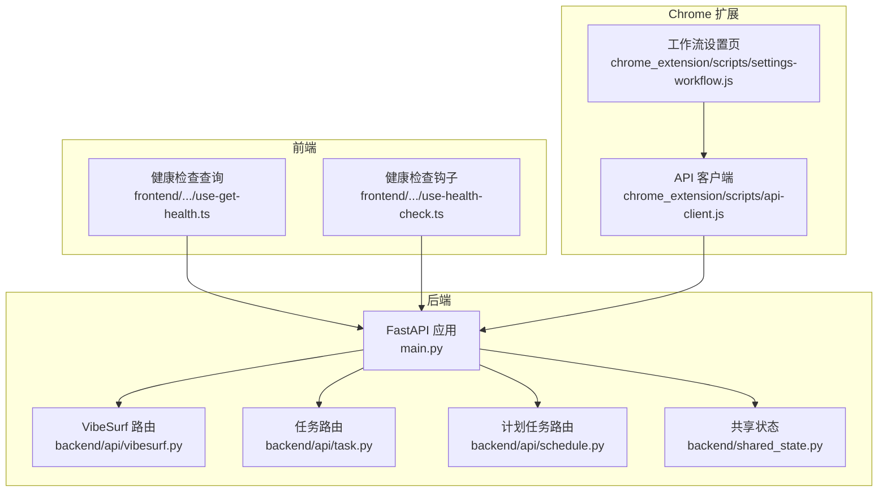
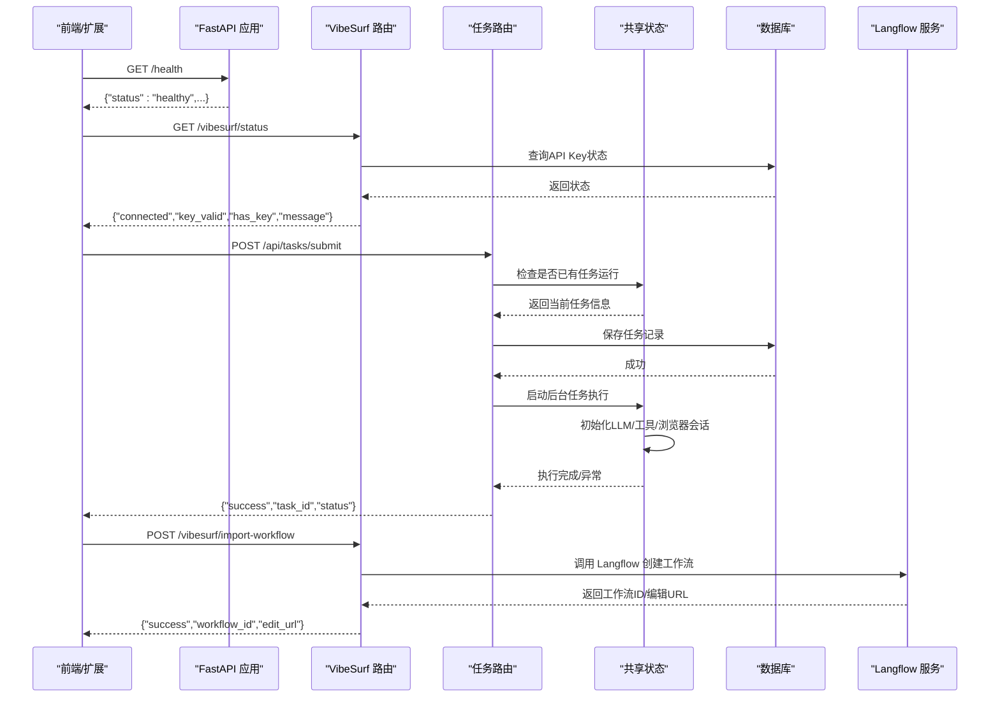
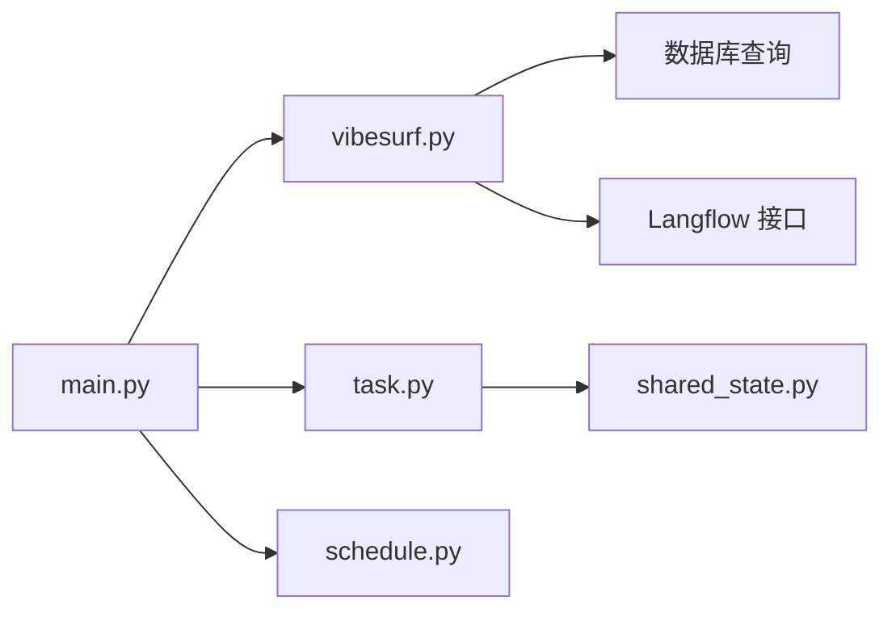

# VibeSurf核心API

<cite>
**本文引用的文件列表**
- [main.py](file://vibe_surf/backend/main.py)
- [vibesurf.py](file://vibe_surf/backend/api/vibesurf.py)
- [task.py](file://vibe_surf/backend/api/task.py)
- [models.py](file://vibe_surf/backend/api/models.py)
- [shared_state.py](file://vibe_surf/backend/shared_state.py)
- [schedule.py](file://vibe_surf/backend/api/schedule.py)
- [api-client.js](file://vibe_surf/chrome_extension/scripts/api-client.js)
- [settings-workflow.js](file://vibe_surf/chrome_extension/scripts/settings-workflow.js)
- [use-get-health.ts](file://vibe_surf/frontend/src/controllers/API/queries/health/use-get-health.ts)
- [use-health-check.ts](file://vibe_surf/frontend/src/pages/AppWrapperPage/hooks/use-health-check.ts)
- [opentelemetry.py](file://vibe_surf/langflow/services/telemetry/opentelemetry.py)
</cite>

## 目录
1. [简介](#简介)
2. [项目结构](#项目结构)
3. [核心组件](#核心组件)
4. [架构总览](#架构总览)
5. [详细组件分析](#详细组件分析)
6. [依赖关系分析](#依赖关系分析)
7. [性能考量](#性能考量)
8. [故障排查指南](#故障排查指南)
9. [结论](#结论)
10. [附录：端点清单与示例](#附录端点清单与示例)

## 简介
本文件为 VibeSurf 核心API的权威技术文档，面向开发者与集成方，覆盖以下目标：
- 全面梳理后端API端点，包括系统状态、任务执行、工作流导入导出、版本信息等
- 详解核心操作模式（任务提交、暂停/恢复/停止、工作流录制与转换）
- 解释系统健康检查、资源监控与性能指标
- 描述与前端与Chrome扩展的集成点
- 提供错误处理示例（系统过载、依赖服务不可用等）
- 给出可直接参考的调用路径与流程图，帮助快速落地

## 项目结构
VibeSurf 后端基于 FastAPI 构建，采用模块化路由组织，核心API集中在 backend/api 下；同时通过共享状态模块协调浏览器、工具、数据库等全局组件。前端与Chrome扩展通过统一的HTTP接口与后端交互。

图表来源
- [main.py](file://vibe_surf/backend/main.py#L543-L731)
- [vibesurf.py](file://vibe_surf/backend/api/vibesurf.py#L1-L120)
- [task.py](file://vibe_surf/backend/api/task.py#L1-L120)
- [schedule.py](file://vibe_surf/backend/api/schedule.py#L1-L120)
- [shared_state.py](file://vibe_surf/backend/shared_state.py#L1-L120)
- [api-client.js](file://vibe_surf/chrome_extension/scripts/api-client.js#L1-L120)
- [settings-workflow.js](file://vibe_surf/chrome_extension/scripts/settings-workflow.js#L1288-L1320)
- [use-get-health.ts](file://vibe_surf/frontend/src/controllers/API/queries/health/use-get-health.ts#L1-L83)
- [use-health-check.ts](file://vibe_surf/frontend/src/pages/AppWrapperPage/hooks/use-health-check.ts#L1-L56)

章节来源
- [main.py](file://vibe_surf/backend/main.py#L543-L731)

## 核心组件
- FastAPI 应用与生命周期管理：负责启动/关闭、中间件、异常处理、静态文件挂载、Langflow初始化与后台任务调度
- VibeSurf API 路由：提供系统状态、API Key管理、工作流导入导出、新闻源与内容、文件服务等
- 任务路由：单任务执行模型，支持提交、暂停/恢复/停止、状态查询
- 计划任务路由：基于 Cron 的工作流定时执行
- 共享状态模块：集中管理浏览器、工具、LLM、数据库、MCP、调度器等全局组件
- 前端与Chrome扩展：通过统一HTTP接口与后端交互，前端使用React Query进行健康检查与重试策略

章节来源
- [main.py](file://vibe_surf/backend/main.py#L327-L482)
- [vibesurf.py](file://vibe_surf/backend/api/vibesurf.py#L1-L120)
- [task.py](file://vibe_surf/backend/api/task.py#L1-L120)
- [schedule.py](file://vibe_surf/backend/api/schedule.py#L1-L120)
- [shared_state.py](file://vibe_surf/backend/shared_state.py#L1-L120)

## 架构总览
下图展示了从浏览器/前端到后端API再到共享状态与外部服务的整体调用链路。

图表来源
- [main.py](file://vibe_surf/backend/main.py#L649-L693)
- [vibesurf.py](file://vibe_surf/backend/api/vibesurf.py#L141-L215)
- [task.py](file://vibe_surf/backend/api/task.py#L43-L146)
- [shared_state.py](file://vibe_surf/backend/shared_state.py#L118-L200)

## 详细组件分析

### VibeSurf API 路由（/api/v1/vibesurf）
该路由提供系统状态、API Key管理、工作流导入导出、版本信息、新闻源与内容、文件服务等能力。

- 系统状态
  - GET /api/v1/vibesurf/status：返回连接状态、密钥有效性、配置提示
  - 参考实现路径：[vibesurf.py](file://vibe_surf/backend/api/vibesurf.py#L141-L178)

- API Key 管理
  - POST /api/v1/vibesurf/verify-key：校验并存储 VibeSurf API Key
  - DELETE /api/v1/vibesurf/key：删除已存储的 API Key
  - GET /api/v1/vibesurf/validate：验证当前存储的 API Key
  - 参考实现路径：[vibesurf.py](file://vibe_surf/backend/api/vibesurf.py#L92-L140)、[vibesurf.py](file://vibe_surf/backend/api/vibesurf.py#L179-L195)、[vibesurf.py](file://vibe_surf/backend/api/vibesurf.py#L196-L215)

- 工作流导入/导出
  - POST /api/v1/vibesurf/import-workflow：从JSON导入工作流，并转发至 Langflow 创建
  - GET /api/v1/vibesurf/export-workflow/{flow_id}：导出指定工作流为JSON文件
  - 参考实现路径：[vibesurf.py](file://vibe_surf/backend/api/vibesurf.py#L227-L368)、[vibesurf.py](file://vibe_surf/backend/api/vibesurf.py#L369-L468)

- 版本与扩展路径
  - GET /api/v1/vibesurf/version：返回包版本
  - GET /api/v1/vibesurf/extension-path：返回Chrome扩展目录路径
  - 参考实现路径：[vibesurf.py](file://vibe_surf/backend/api/vibesurf.py#L470-L481)、[vibesurf.py](file://vibe_surf/backend/api/vibesurf.py#L575-L586)

- 工作流录制与转换
  - POST /api/v1/vibesurf/workflows/save-recording：保存原始录制数据并转换为Langflow格式
  - 参考实现路径：[vibesurf.py](file://vibe_surf/backend/api/vibesurf.py#L482-L574)

- 新闻源与内容
  - GET /api/v1/vibesurf/news/sources：获取可用新闻源
  - GET /api/v1/vibesurf/news：按源/类型/数量获取新闻
  - 参考实现路径：[vibesurf.py](file://vibe_surf/backend/api/vibesurf.py#L616-L681)

- 文件服务
  - GET /api/v1/vibesurf/serve：安全地提供本地文件
  - 参考实现路径：[vibesurf.py](file://vibe_surf/backend/api/vibesurf.py#L587-L614)

- 通用UUID生成
  - GET /api/v1/vibesurf/generate-uuid：生成UUID v4
  - 参考实现路径：[vibesurf.py](file://vibe_surf/backend/api/vibesurf.py#L216-L226)

章节来源
- [vibesurf.py](file://vibe_surf/backend/api/vibesurf.py#L92-L178)
- [vibesurf.py](file://vibe_surf/backend/api/vibesurf.py#L179-L215)
- [vibesurf.py](file://vibe_surf/backend/api/vibesurf.py#L227-L368)
- [vibesurf.py](file://vibe_surf/backend/api/vibesurf.py#L369-L468)
- [vibesurf.py](file://vibe_surf/backend/api/vibesurf.py#L470-L481)
- [vibesurf.py](file://vibe_surf/backend/api/vibesurf.py#L482-L574)
- [vibesurf.py](file://vibe_surf/backend/api/vibesurf.py#L575-L614)
- [vibesurf.py](file://vibe_surf/backend/api/vibesurf.py#L616-L681)

### 任务路由（/api/tasks）
单任务执行模型，支持任务提交、状态查询、暂停/恢复/停止。

- 任务状态
  - GET /api/tasks/status：快速判断是否有活动任务及活动任务详情
  - 参考实现路径：[task.py](file://vibe_surf/backend/api/task.py#L34-L41)

- 任务提交
  - POST /api/tasks/submit：提交新任务，若已有任务在运行则拒绝
  - 参数模型：TaskCreateRequest（会话ID、任务描述、LLM配置、上传文件、MCP配置、代理模式）
  - 参考实现路径：[task.py](file://vibe_surf/backend/api/task.py#L43-L146)，[models.py](file://vibe_surf/backend/api/models.py#L102-L110)

- 任务控制
  - POST /api/tasks/pause：暂停当前任务
  - POST /api/tasks/resume：恢复当前任务
  - POST /api/tasks/stop：停止当前任务
  - 参考实现路径：[task.py](file://vibe_surf/backend/api/task.py#L197-L240)

- LLM 连接性测试
  - 内部函数 _ensure_llm_initialized：创建LLM实例并进行连通性测试
  - 参考实现路径：[task.py](file://vibe_surf/backend/api/task.py#L154-L195)

- 后台执行流程
  - execute_task_background：更新活动任务状态、执行代理、保存结果、写入数据库
  - 参考实现路径：[shared_state.py](file://vibe_surf/backend/shared_state.py#L118-L200)

章节来源
- [task.py](file://vibe_surf/backend/api/task.py#L34-L146)
- [task.py](file://vibe_surf/backend/api/task.py#L154-L195)
- [task.py](file://vibe_surf/backend/api/task.py#L197-L240)
- [models.py](file://vibe_surf/backend/api/models.py#L102-L110)
- [shared_state.py](file://vibe_surf/backend/shared_state.py#L118-L200)

### 计划任务路由（/api/schedule）
基于 Cron 表达式的工作流定时执行管理。

- 获取全部计划
  - GET /api/schedule：返回所有计划列表
  - 参考实现路径：[schedule.py](file://vibe_surf/backend/api/schedule.py#L77-L100)

- 创建计划
  - POST /api/schedule：创建新的计划（flow_id、cron表达式、启用状态、描述）
  - 参考实现路径：[schedule.py](file://vibe_surf/backend/api/schedule.py#L108-L149)

- 查询计划
  - GET /api/schedule/{flow_id}：按flow_id查询计划
  - 参考实现路径：[schedule.py](file://vibe_surf/backend/api/schedule.py#L159-L185)

- 更新计划
  - PUT /api/schedule/{flow_id}：更新现有计划
  - 参考实现路径：[schedule.py](file://vibe_surf/backend/api/schedule.py#L195-L240)

- 删除计划
  - DELETE /api/schedule/{flow_id}：删除计划
  - 参考实现路径：[schedule.py](file://vibe_surf/backend/api/schedule.py#L241-L280)

章节来源
- [schedule.py](file://vibe_surf/backend/api/schedule.py#L77-L185)
- [schedule.py](file://vibe_surf/backend/api/schedule.py#L195-L280)

### 健康检查与异常处理
- 后端健康检查
  - GET /health：返回服务健康状态
  - 参考实现路径：[main.py](file://vibe_surf/backend/main.py#L649-L658)

- 前端健康检查
  - React Query 查询 useGetHealthQuery：周期性拉取健康状态，超时/繁忙自动重试
  - 参考实现路径：[use-get-health.ts](file://vibe_surf/frontend/src/controllers/API/queries/health/use-get-health.ts#L1-L83)

- 健康检查钩子
  - use-health-check：根据错误码（503/429）进行指数退避重试
  - 参考实现路径：[use-health-check.ts](file://vibe_surf/frontend/src/pages/AppWrapperPage/hooks/use-health-check.ts#L1-L56)

- 异常处理
  - 通用异常处理器：捕获未处理异常并返回JSON
  - Pydantic序列化异常：返回特定错误消息
  - 参考实现路径：[main.py](file://vibe_surf/backend/main.py#L695-L724)

章节来源
- [main.py](file://vibe_surf/backend/main.py#L649-L658)
- [main.py](file://vibe_surf/backend/main.py#L695-L724)
- [use-get-health.ts](file://vibe_surf/frontend/src/controllers/API/queries/health/use-get-health.ts#L1-L83)
- [use-health-check.ts](file://vibe_surf/frontend/src/pages/AppWrapperPage/hooks/use-health-check.ts#L1-L56)

### 与前端和Chrome扩展的集成
- 健康检查与错误提示
  - 前端在页面顶层显示“服务器繁忙/离线”错误弹窗，并提供重试按钮
  - 参考实现路径：[use-health-check.ts](file://vibe_surf/frontend/src/pages/AppWrapperPage/hooks/use-health-check.ts#L1-L56)

- Chrome 扩展 API 客户端
  - 统一构建URL、请求封装、重试策略、超时控制
  - 支持健康检查、系统状态、任务提交、任务状态查询等
  - 参考实现路径：[api-client.js](file://vibe_surf/chrome_extension/scripts/api-client.js#L1-L120)、[api-client.js](file://vibe_surf/chrome_extension/scripts/api-client.js#L121-L200)

- 工作流管理界面
  - 扩展侧加载工作流列表、运行/暂停/删除、事件监控、缓存策略
  - 参考实现路径：[settings-workflow.js](file://vibe_surf/chrome_extension/scripts/settings-workflow.js#L458-L488)、[settings-workflow.js](file://vibe_surf/chrome_extension/scripts/settings-workflow.js#L1288-L1320)

章节来源
- [api-client.js](file://vibe_surf/chrome_extension/scripts/api-client.js#L1-L120)
- [api-client.js](file://vibe_surf/chrome_extension/scripts/api-client.js#L121-L200)
- [settings-workflow.js](file://vibe_surf/chrome_extension/scripts/settings-workflow.js#L458-L488)
- [settings-workflow.js](file://vibe_surf/chrome_extension/scripts/settings-workflow.js#L1288-L1320)
- [use-health-check.ts](file://vibe_surf/frontend/src/pages/AppWrapperPage/hooks/use-health-check.ts#L1-L56)

## 依赖关系分析
- 组件耦合
  - FastAPI 应用通过 include_router 将各模块路由整合，避免循环导入
  - 任务路由依赖共享状态模块以访问全局组件（浏览器、工具、LLM、调度器）
  - VibeSurf 路由依赖数据库查询以管理API Key与工作流导入导出
- 外部依赖
  - Langflow：工作流导入导出、项目/流管理
  - 数据库：任务、计划、凭据等持久化
  - 浏览器：自动化执行与会话管理
- 循环依赖规避
  - 共享状态模块集中定义全局变量，避免路由器与主应用互相导入

图表来源
- [main.py](file://vibe_surf/backend/main.py#L580-L648)
- [vibesurf.py](file://vibe_surf/backend/api/vibesurf.py#L1-L120)
- [task.py](file://vibe_surf/backend/api/task.py#L1-L120)
- [schedule.py](file://vibe_surf/backend/api/schedule.py#L1-L120)
- [shared_state.py](file://vibe_surf/backend/shared_state.py#L1-L120)

## 性能考量
- 后台任务与并发
  - 任务采用单任务串行执行模型，避免资源竞争；后台任务通过共享状态模块统一调度
  - 参考实现路径：[shared_state.py](file://vibe_surf/backend/shared_state.py#L118-L200)
- 健康检查与重试
  - 前端对503/429采用指数退避重试，降低系统压力
  - 参考实现路径：[use-health-check.ts](file://vibe_surf/frontend/src/pages/AppWrapperPage/hooks/use-health-check.ts#L1-L56)
- 监控与指标
  - Langflow 使用 OpenTelemetry 与 Prometheus 进行指标采集
  - 参考实现路径：[opentelemetry.py](file://vibe_surf/langflow/services/telemetry/opentelemetry.py#L144-L210)

章节来源
- [shared_state.py](file://vibe_surf/backend/shared_state.py#L118-L200)
- [use-health-check.ts](file://vibe_surf/frontend/src/pages/AppWrapperPage/hooks/use-health-check.ts#L1-L56)
- [opentelemetry.py](file://vibe_surf/langflow/services/telemetry/opentelemetry.py#L144-L210)

## 故障排查指南
- 系统过载/繁忙
  - 现象：前端健康检查返回503/429，出现“服务器繁忙”提示
  - 处理：前端自动指数退避重试；后端异常处理器返回标准JSON错误
  - 参考实现路径：[use-health-check.ts](file://vibe_surf/frontend/src/pages/AppWrapperPage/hooks/use-health-check.ts#L1-L56)、[main.py](file://vibe_surf/backend/main.py#L695-L724)

- LLM 连接失败
  - 现象：任务提交返回 llm_connection_failed
  - 处理：检查LLM配置、网络连通性；确保API Key有效
  - 参考实现路径：[task.py](file://vibe_surf/backend/api/task.py#L154-L195)

- 依赖服务不可用（Langflow/浏览器）
  - 现象：工作流导入/导出失败、浏览器监控任务触发退出
  - 处理：确认Langflow服务可用、浏览器进程正常；查看日志定位具体错误
  - 参考实现路径：[vibesurf.py](file://vibe_surf/backend/api/vibesurf.py#L227-L368)、[main.py](file://vibe_surf/backend/main.py#L103-L148)

- 响应序列化异常
  - 现象：Pydantic序列化错误导致500
  - 处理：检查响应对象结构与类型；必要时调整模型字段
  - 参考实现路径：[main.py](file://vibe_surf/backend/main.py#L521-L541)

章节来源
- [use-health-check.ts](file://vibe_surf/frontend/src/pages/AppWrapperPage/hooks/use-health-check.ts#L1-L56)
- [main.py](file://vibe_surf/backend/main.py#L521-L541)
- [task.py](file://vibe_surf/backend/api/task.py#L154-L195)
- [vibesurf.py](file://vibe_surf/backend/api/vibesurf.py#L227-L368)
- [main.py](file://vibe_surf/backend/main.py#L103-L148)

## 结论
VibeSurf 核心API围绕“单任务执行+工作流编排”的设计，提供了稳定的状态查询、任务控制、工作流导入导出与健康检查机制。通过共享状态模块与Langflow集成，系统实现了对浏览器、工具、LLM与数据库的统一协调。前端与Chrome扩展通过标准化HTTP接口与后端交互，具备完善的错误处理与重试策略，适合在复杂业务场景中可靠落地。

## 附录：端点清单与示例

### 系统与状态
- GET /health：健康检查
  - 示例路径：[main.py](file://vibe_surf/backend/main.py#L649-L658)
- GET /api/status：系统状态（活动任务、Langflow初始化状态）
  - 示例路径：[main.py](file://vibe_surf/backend/main.py#L671-L693)
- GET /api/v1/vibesurf/status：VibeSurf连接状态
  - 示例路径：[vibesurf.py](file://vibe_surf/backend/api/vibesurf.py#L141-L178)

### 任务相关
- POST /api/tasks/submit：提交任务
  - 请求体：TaskCreateRequest
  - 示例路径：[task.py](file://vibe_surf/backend/api/task.py#L43-L146)，[models.py](file://vibe_surf/backend/api/models.py#L102-L110)
- GET /api/tasks/status：任务状态
  - 示例路径：[task.py](file://vibe_surf/backend/api/task.py#L34-L41)
- POST /api/tasks/pause：暂停任务
  - 示例路径：[task.py](file://vibe_surf/backend/api/task.py#L197-L240)
- POST /api/tasks/resume：恢复任务
  - 示例路径：[task.py](file://vibe_surf/backend/api/task.py#L240-L300)
- POST /api/tasks/stop：停止任务
  - 示例路径：[task.py](file://vibe_surf/backend/api/task.py#L300-L379)

### 工作流与版本
- POST /api/v1/vibesurf/import-workflow：导入工作流
  - 请求体：ImportWorkflowRequest（workflow_json）
  - 示例路径：[vibesurf.py](file://vibe_surf/backend/api/vibesurf.py#L227-L368)
- GET /api/v1/vibesurf/export-workflow/{flow_id}：导出工作流
  - 示例路径：[vibesurf.py](file://vibe_surf/backend/api/vibesurf.py#L369-L468)
- POST /api/v1/vibesurf/workflows/save-recording：保存工作流录制
  - 请求体：SaveWorkflowRecordingRequest（name、description、workflows）
  - 示例路径：[vibesurf.py](file://vibe_surf/backend/api/vibesurf.py#L482-L574)
- GET /api/v1/vibesurf/version：版本信息
  - 示例路径：[vibesurf.py](file://vibe_surf/backend/api/vibesurf.py#L470-L481)
- GET /api/v1/vibesurf/extension-path：扩展路径
  - 示例路径：[vibesurf.py](file://vibe_surf/backend/api/vibesurf.py#L575-L586)

### 新闻与文件
- GET /api/v1/vibesurf/news/sources：新闻源
  - 示例路径：[vibesurf.py](file://vibe_surf/backend/api/vibesurf.py#L616-L638)
- GET /api/v1/vibesurf/news：新闻内容
  - 示例路径：[vibesurf.py](file://vibe_surf/backend/api/vibesurf.py#L639-L681)
- GET /api/v1/vibesurf/serve：文件服务
  - 示例路径：[vibesurf.py](file://vibe_surf/backend/api/vibesurf.py#L587-L614)

### 计划任务
- GET /api/schedule：获取全部计划
  - 示例路径：[schedule.py](file://vibe_surf/backend/api/schedule.py#L77-L100)
- POST /api/schedule：创建计划
  - 示例路径：[schedule.py](file://vibe_surf/backend/api/schedule.py#L108-L149)
- GET /api/schedule/{flow_id}：查询计划
  - 示例路径：[schedule.py](file://vibe_surf/backend/api/schedule.py#L159-L185)
- PUT /api/schedule/{flow_id}：更新计划
  - 示例路径：[schedule.py](file://vibe_surf/backend/api/schedule.py#L195-L240)
- DELETE /api/schedule/{flow_id}：删除计划
  - 示例路径：[schedule.py](file://vibe_surf/backend/api/schedule.py#L241-L280)

### 集成与调用示例（路径参考）
- 前端健康检查与重试
  - [use-get-health.ts](file://vibe_surf/frontend/src/controllers/API/queries/health/use-get-health.ts#L1-L83)
  - [use-health-check.ts](file://vibe_surf/frontend/src/pages/AppWrapperPage/hooks/use-health-check.ts#L1-L56)
- Chrome 扩展 API 客户端
  - [api-client.js](file://vibe_surf/chrome_extension/scripts/api-client.js#L1-L120)
  - [api-client.js](file://vibe_surf/chrome_extension/scripts/api-client.js#L121-L200)
- 扩展工作流管理
  - [settings-workflow.js](file://vibe_surf/chrome_extension/scripts/settings-workflow.js#L1288-L1320)