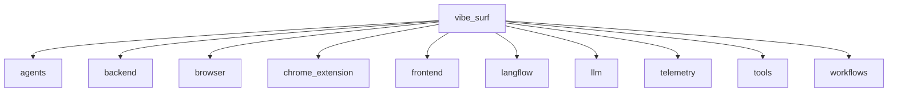
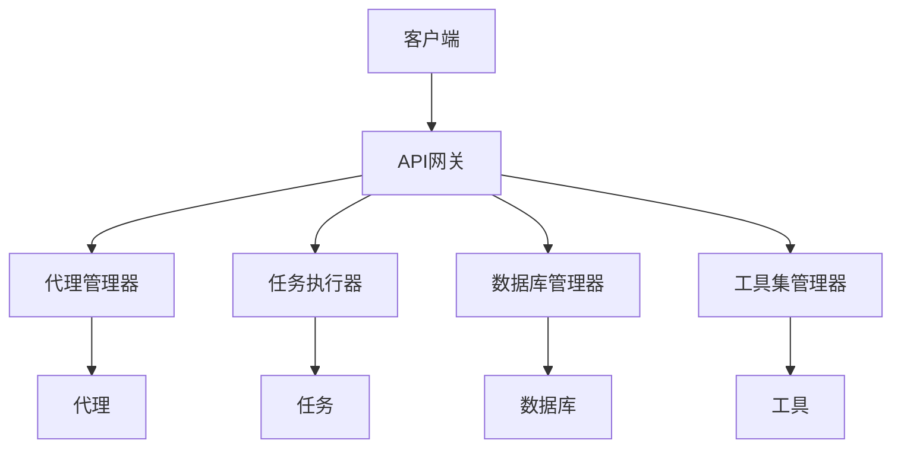
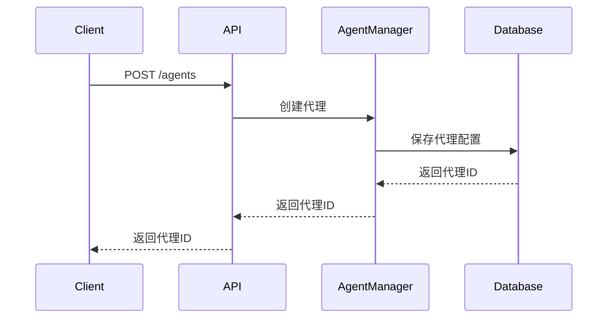
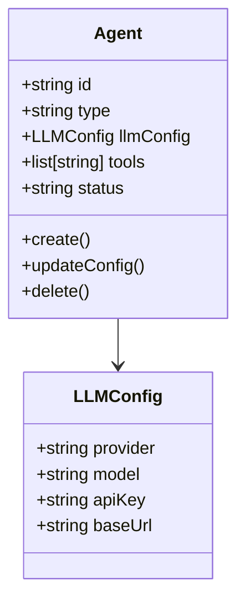
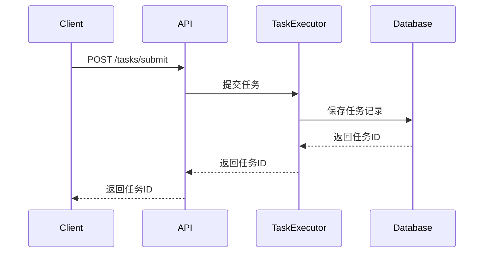
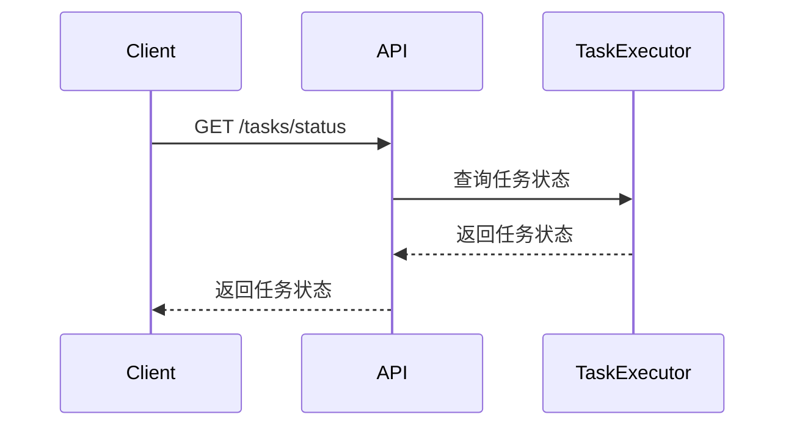
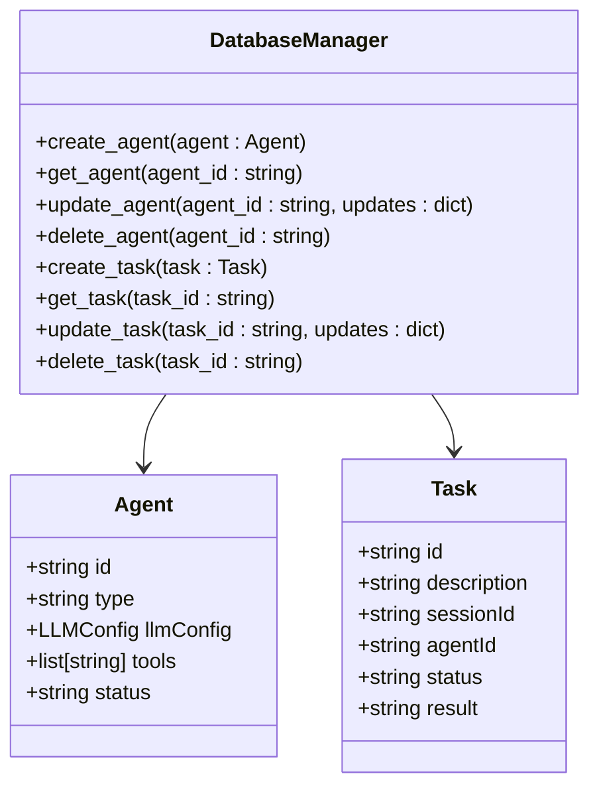
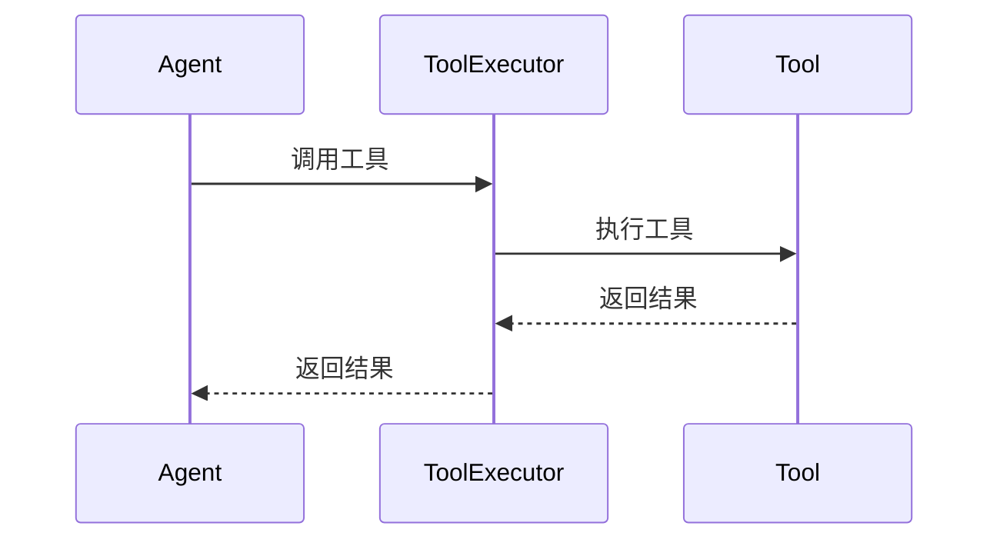
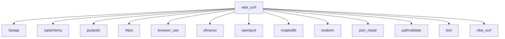

# 代理API

<cite>
**本文档引用的文件**  
- [agent.py](file://vibe_surf/backend/api/agent.py)
- [task.py](file://vibe_surf/backend/api/task.py)
- [models.py](file://vibe_surf/backend/api/models.py)
- [shared_state.py](file://vibe_surf/backend/shared_state.py)
- [vibesurf_tools.py](file://vibe_surf/tools/vibesurf_tools.py)
- [vibe_surf_agent.py](file://vibe_surf/agents/vibe_surf_agent.py)
- [database/models.py](file://vibe_surf/backend/database/models.py)
- [database/queries.py](file://vibe_surf/backend/database/queries.py)
- [database/schemas.py](file://vibe_surf/backend/database/schemas.py)
</cite>

## 目录
1. [简介](#简介)
2. [项目结构](#项目结构)
3. [核心组件](#核心组件)
4. [架构概述](#架构概述)
5. [详细组件分析](#详细组件分析)
6. [依赖分析](#依赖分析)
7. [性能考虑](#性能考虑)
8. [故障排除指南](#故障排除指南)
9. [结论](#结论)

## 简介
VibeSurf代理API是一个用于动态创建和管理AI代理的系统，支持多种端点操作，包括获取代理列表、创建新代理、获取特定代理、更新代理配置和删除代理。该API详细说明了代理配置的请求/响应模式，包括代理类型、LLM配置、工具集和状态。此外，它还解释了代理生命周期管理、并发控制和资源分配策略，并描述了错误处理机制，如代理创建失败或配置验证错误。文档提供了使用curl和Python客户端的实际示例，展示如何动态创建和管理AI代理。

## 项目结构
VibeSurf项目包含多个目录和文件，主要分为以下几个部分：
- `docs/`：包含可执行构建、Nuitka构建和PyPI设置的文档。
- `scripts/`：包含构建安装程序和wheel包的脚本。
- `tests/`：包含各种测试文件，如代理测试、API工具测试、后端API测试等。
- `vibe_surf/`：核心代码目录，包含代理、后端、浏览器、Chrome扩展、前端、langflow、LLM、遥测、工具和工作流等子目录。
- `README.md` 和 `pyproject.toml`：项目的主要文档和配置文件。



**Diagram sources**
- [vibe_surf/backend/api/agent.py](file://vibe_surf/backend/api/agent.py)
- [vibe_surf/backend/api/task.py](file://vibe_surf/backend/api/task.py)

**Section sources**
- [vibe_surf/backend/api/agent.py](file://vibe_surf/backend/api/agent.py)
- [vibe_surf/backend/api/task.py](file://vibe_surf/backend/api/task.py)

## 核心组件
VibeSurf代理API的核心组件包括代理管理、任务执行、数据库操作和工具集管理。这些组件协同工作，确保代理的创建、配置、执行和管理能够高效进行。

**Section sources**
- [vibe_surf/backend/api/agent.py](file://vibe_surf/backend/api/agent.py)
- [vibe_surf/backend/api/task.py](file://vibe_surf/backend/api/task.py)
- [vibe_surf/backend/shared_state.py](file://vibe_surf/backend/shared_state.py)

## 架构概述
VibeSurf代理API的架构设计旨在提供一个灵活且可扩展的系统，支持多种代理类型和工具集。系统通过RESTful API提供服务，允许客户端通过HTTP请求与代理进行交互。核心组件包括代理管理器、任务执行器、数据库管理器和工具集管理器。



**Diagram sources**
- [vibe_surf/backend/api/agent.py](file://vibe_surf/backend/api/agent.py)
- [vibe_surf/backend/api/task.py](file://vibe_surf/backend/api/task.py)
- [vibe_surf/backend/shared_state.py](file://vibe_surf/backend/shared_state.py)

## 详细组件分析
### 代理管理
代理管理组件负责代理的创建、配置、启动、暂停、恢复和删除。每个代理都有一个唯一的ID，并且可以配置不同的LLM模型和工具集。

#### 代理创建
创建新代理的API端点为`POST /agents`，请求体包含代理的配置信息，如代理类型、LLM配置、工具集等。



**Diagram sources**
- [vibe_surf/backend/api/agent.py](file://vibe_surf/backend/api/agent.py)
- [vibe_surf/backend/shared_state.py](file://vibe_surf/backend/shared_state.py)

#### 代理配置
代理配置信息存储在数据库中，包括代理类型、LLM配置、工具集和状态。配置信息可以通过`PUT /agents/{id}`端点进行更新。



**Diagram sources**
- [vibe_surf/backend/database/models.py](file://vibe_surf/backend/database/models.py)
- [vibe_surf/backend/database/queries.py](file://vibe_surf/backend/database/queries.py)

### 任务执行
任务执行组件负责执行代理的任务，包括任务的提交、状态查询和结果获取。

#### 任务提交
提交任务的API端点为`POST /tasks/submit`，请求体包含任务描述、会话ID和LLM配置。



**Diagram sources**
- [vibe_surf/backend/api/task.py](file://vibe_surf/backend/api/task.py)
- [vibe_surf/backend/shared_state.py](file://vibe_surf/backend/shared_state.py)

#### 任务状态查询
查询任务状态的API端点为`GET /tasks/status`，返回当前是否有活动任务及其详细信息。



**Diagram sources**
- [vibe_surf/backend/api/task.py](file://vibe_surf/backend/api/task.py)
- [vibe_surf/backend/shared_state.py](file://vibe_surf/backend/shared_state.py)

### 数据库操作
数据库操作组件负责与数据库的交互，包括代理和任务的增删改查操作。

#### 代理和任务的CRUD操作
数据库操作通过SQLAlchemy ORM实现，支持代理和任务的创建、读取、更新和删除。



**Diagram sources**
- [vibe_surf/backend/database/queries.py](file://vibe_surf/backend/database/queries.py)
- [vibe_surf/backend/database/models.py](file://vibe_surf/backend/database/models.py)

### 工具集管理
工具集管理组件负责管理代理可用的工具集，包括工具的注册、调用和结果处理。

#### 工具注册
工具通过装饰器注册到代理的工具集中，每个工具都有一个描述和参数模型。

```python
@self.registry.action(
    'Advanced search',
    param_model=SkillSearchAction,
)
async def skill_search(
    params: SkillSearchAction,
    browser_manager: BrowserManager,
    page_extraction_llm: BaseChatModel
):
    # 工具实现
    pass
```

**Section sources**
- [vibe_surf/tools/vibesurf_tools.py](file://vibe_surf/tools/vibesurf_tools.py)

#### 工具调用
工具通过代理的执行器调用，执行结果返回给代理进行进一步处理。



**Diagram sources**
- [vibe_surf/tools/vibesurf_tools.py](file://vibe_surf/tools/vibesurf_tools.py)
- [vibe_surf/agents/vibe_surf_agent.py](file://vibe_surf/agents/vibe_surf_agent.py)

## 依赖分析
VibeSurf代理API依赖于多个外部库和内部模块，确保系统的稳定性和功能性。



**Diagram sources**
- [pyproject.toml](file://pyproject.toml)

## 性能考虑
为了确保系统的高性能，VibeSurf代理API采用了异步编程模型，利用`asyncio`和`aiohttp`库实现非阻塞I/O操作。此外，数据库操作通过连接池管理，减少连接开销。缓存机制也被用于频繁访问的数据，如代理配置和工具集信息。

## 故障排除指南
### 代理创建失败
如果代理创建失败，检查以下几点：
- 确保LLM配置正确，API密钥有效。
- 检查数据库连接是否正常。
- 查看日志文件，查找具体的错误信息。

### 配置验证错误
如果配置验证失败，检查以下几点：
- 确保配置文件格式正确，没有语法错误。
- 检查必填字段是否已填写。
- 查看日志文件，查找具体的验证错误信息。

## 结论
VibeSurf代理API提供了一个强大且灵活的系统，用于动态创建和管理AI代理。通过详细的文档和示例，开发者可以轻松地集成和使用该API，实现复杂的自动化任务。系统的模块化设计和丰富的功能使其适用于各种应用场景，从简单的任务执行到复杂的多代理协作。