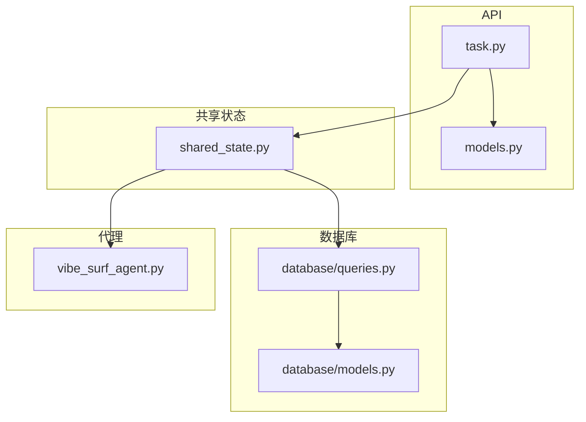
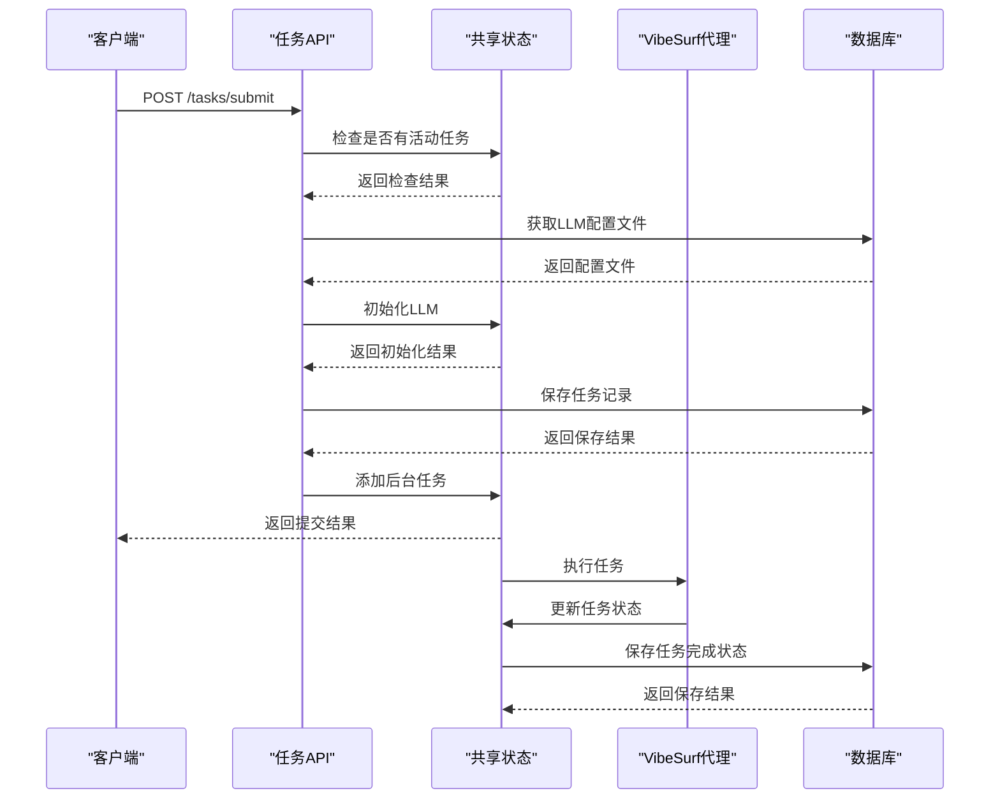
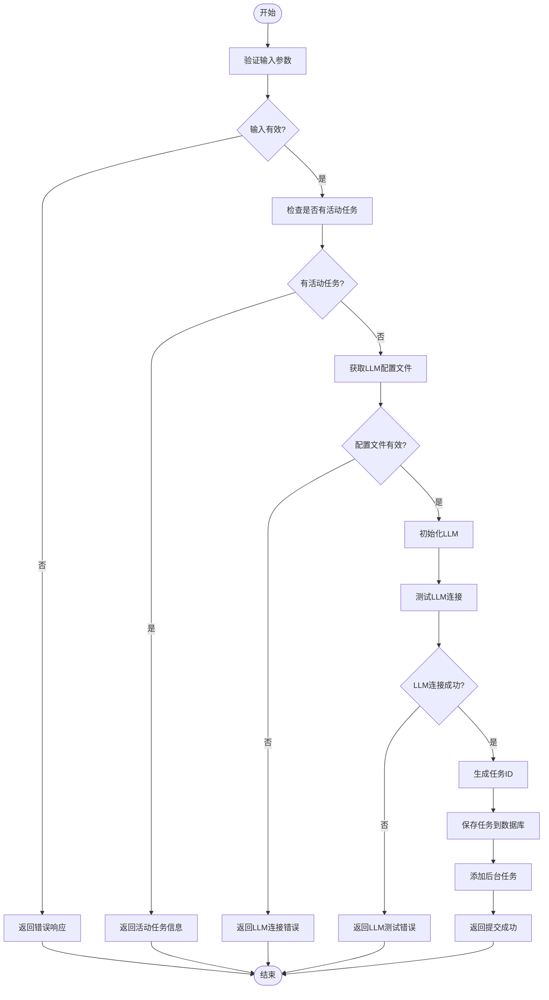
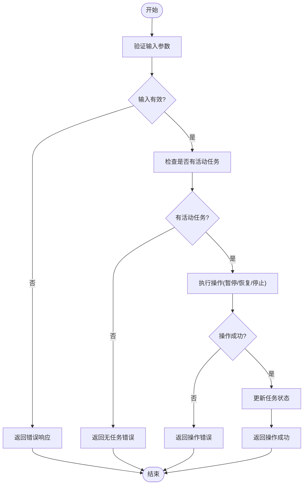
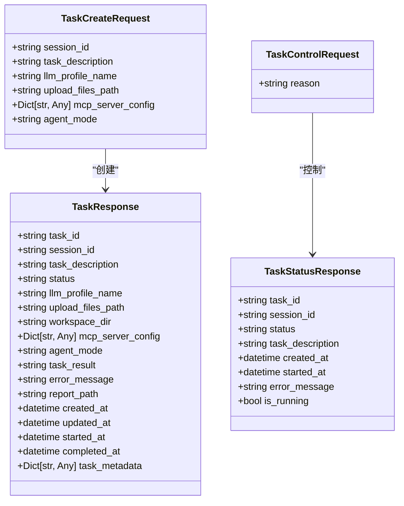
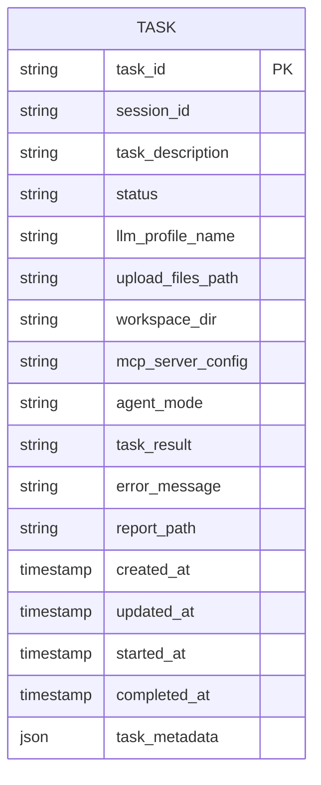
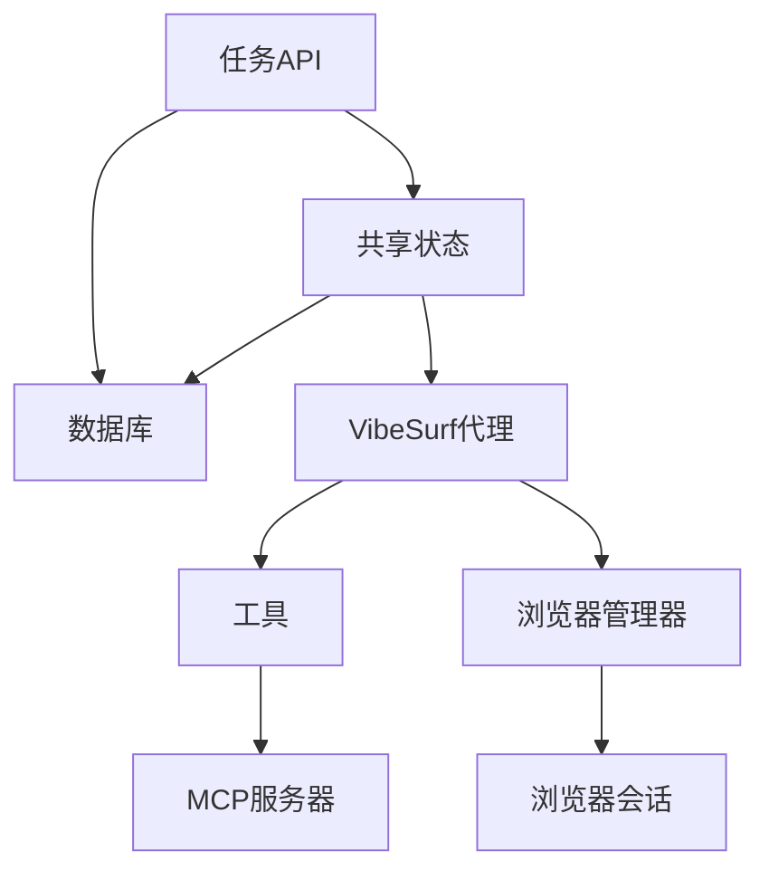

# 任务API

<cite>
**本文档引用的文件**   
- [task.py](file://vibe_surf/backend/api/task.py)
- [models.py](file://vibe_surf/backend/api/models.py)
- [models.py](file://vibe_surf/backend/database/models.py)
- [queries.py](file://vibe_surf/backend/database/queries.py)
- [shared_state.py](file://vibe_surf/backend/shared_state.py)
- [vibe_surf_agent.py](file://vibe_surf/agents/vibe_surf_agent.py)
- [main.py](file://vibe_surf/backend/main.py)
</cite>

## 目录
1. [简介](#简介)
2. [项目结构](#项目结构)
3. [核心组件](#核心组件)
4. [架构概述](#架构概述)
5. [详细组件分析](#详细组件分析)
6. [依赖分析](#依赖分析)
7. [性能考虑](#性能考虑)
8. [故障排除指南](#故障排除指南)
9. [结论](#结论)
10. [附录](#附录) (如有必要)

## 简介
本文档详细介绍了VibeSurf任务API，涵盖了所有端点、任务模式、执行状态机、结果存储、错误处理和重试机制。文档还提供了实际示例，展示如何通过API提交和监控AI自动化任务。

## 项目结构
VibeSurf项目包含多个模块，其中任务API主要位于`vibe_surf/backend/api/`目录下。关键文件包括`task.py`（任务API实现）、`models.py`（数据模型定义）和`shared_state.py`（共享状态管理）。

**Diagram sources**
- [task.py](file://vibe_surf/backend/api/task.py#L1-L379)
- [models.py](file://vibe_surf/backend/api/models.py#L1-L260)
- [models.py](file://vibe_surf/backend/database/models.py#L1-L289)
- [queries.py](file://vibe_surf/backend/database/queries.py#L1-L800)
- [shared_state.py](file://vibe_surf/backend/shared_state.py#L1-L800)
- [vibe_surf_agent.py](file://vibe_surf/agents/vibe_surf_agent.py#L1-L800)

**Section sources**
- [task.py](file://vibe_surf/backend/api/task.py#L1-L379)
- [models.py](file://vibe_surf/backend/api/models.py#L1-L260)
- [models.py](file://vibe_surf/backend/database/models.py#L1-L289)
- [queries.py](file://vibe_surf/backend/database/queries.py#L1-L800)
- [shared_state.py](file://vibe_surf/backend/shared_state.py#L1-L800)
- [vibe_surf_agent.py](file://vibe_surf/agents/vibe_surf_agent.py#L1-L800)

## 核心组件
任务API的核心组件包括任务提交、执行控制（暂停/恢复/停止）和状态监控。这些功能通过FastAPI路由实现，支持单任务模式的执行。

**Section sources**
- [task.py](file://vibe_surf/backend/api/task.py#L1-L379)
- [shared_state.py](file://vibe_surf/backend/shared_state.py#L1-L800)

## 架构概述
VibeSurf任务API采用单任务执行模型，通过共享状态管理当前活动任务。任务提交后，系统会检查是否有其他任务正在运行，如果有，则拒绝新任务的提交。

**Diagram sources**
- [task.py](file://vibe_surf/backend/api/task.py#L1-L379)
- [shared_state.py](file://vibe_surf/backend/shared_state.py#L1-L800)
- [vibe_surf_agent.py](file://vibe_surf/agents/vibe_surf_agent.py#L1-L800)
- [queries.py](file://vibe_surf/backend/database/queries.py#L1-L800)

## 详细组件分析
### 任务API分析
任务API提供了多个端点，用于任务的提交、控制和状态查询。

#### 任务提交

**Diagram sources**
- [task.py](file://vibe_surf/backend/api/task.py#L43-L145)

#### 任务控制

**Diagram sources**
- [task.py](file://vibe_surf/backend/api/task.py#L197-L302)

**Section sources**
- [task.py](file://vibe_surf/backend/api/task.py#L1-L379)

### 任务模型分析
任务模型定义了任务的结构和属性，包括任务描述、状态、LLM配置文件等。

**Diagram sources**
- [models.py](file://vibe_surf/backend/api/models.py#L102-L137)

**Section sources**
- [models.py](file://vibe_surf/backend/api/models.py#L1-L260)

### 数据库模型分析
数据库模型定义了任务在数据库中的存储结构，包括任务状态、创建时间、更新时间等。

**Diagram sources**
- [models.py](file://vibe_surf/backend/database/models.py#L94-L137)

**Section sources**
- [models.py](file://vibe_surf/backend/database/models.py#L1-L289)

## 依赖分析
任务API依赖于多个组件，包括数据库、共享状态、VibeSurf代理等。这些组件通过依赖注入的方式进行管理。

**Diagram sources**
- [task.py](file://vibe_surf/backend/api/task.py#L1-L379)
- [shared_state.py](file://vibe_surf/backend/shared_state.py#L1-L800)
- [vibe_surf_agent.py](file://vibe_surf/agents/vibe_surf_agent.py#L1-L800)

**Section sources**
- [task.py](file://vibe_surf/backend/api/task.py#L1-L379)
- [shared_state.py](file://vibe_surf/backend/shared_state.py#L1-L800)
- [vibe_surf_agent.py](file://vibe_surf/agents/vibe_surf_agent.py#L1-L800)

## 性能考虑
任务API在设计时考虑了性能因素，包括数据库查询优化、异步任务处理和缓存机制。

**Section sources**
- [queries.py](file://vibe_surf/backend/database/queries.py#L1-L800)
- [shared_state.py](file://vibe_surf/backend/shared_state.py#L1-L800)

## 故障排除指南
### 任务提交失败
当任务提交失败时，可能的原因包括：
- 有其他任务正在运行
- LLM配置文件无效
- LLM连接测试失败

### 任务控制失败
当任务控制操作失败时，可能的原因包括：
- 没有活动任务
- 代理未初始化
- 操作执行失败

**Section sources**
- [task.py](file://vibe_surf/backend/api/task.py#L147-L151)
- [task.py](file://vibe_surf/backend/api/task.py#L227-L229)
- [task.py](file://vibe_surf/backend/api/task.py#L261-L263)
- [task.py](file://vibe_surf/backend/api/task.py#L300-L302)

## 结论
VibeSurf任务API提供了一套完整的任务管理功能，包括任务提交、控制和状态查询。通过合理的架构设计和依赖管理，API能够高效地处理任务执行和状态监控。

## 附录
### API端点列表
- `POST /tasks/submit`: 提交新任务
- `POST /tasks/pause`: 暂停当前任务
- `POST /tasks/resume`: 恢复当前任务
- `POST /tasks/stop`: 停止当前任务
- `GET /tasks/status`: 检查任务状态
- `GET /tasks/detailed-status`: 获取详细任务状态

### 任务状态
- `pending`: 待处理
- `running`: 运行中
- `paused`: 已暂停
- `completed`: 已完成
- `failed`: 失败
- `stopped`: 已停止