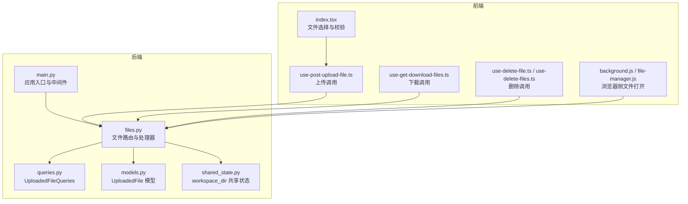
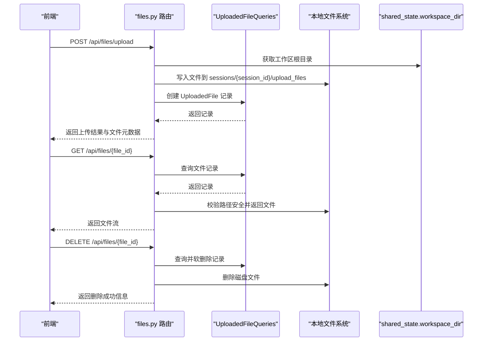
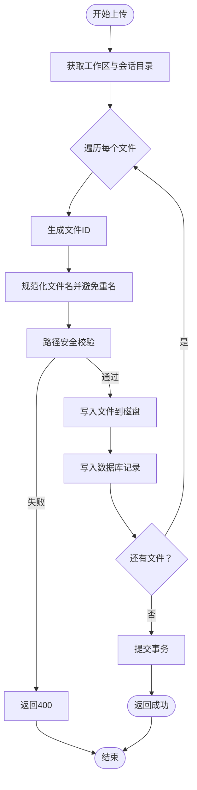
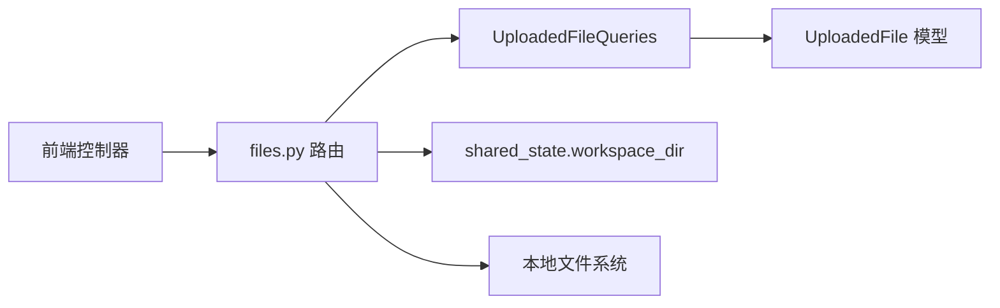

# 文件API

<cite>
**本文引用的文件**
- [files.py](file://vibe_surf/backend/api/files.py)
- [queries.py](file://vibe_surf/backend/database/queries.py)
- [models.py](file://vibe_surf/backend/database/models.py)
- [schemas.py](file://vibe_surf/backend/database/schemas.py)
- [shared_state.py](file://vibe_surf/backend/shared_state.py)
- [main.py](file://vibe_surf/backend/main.py)
- [index.tsx](file://vibe_surf/frontend/src/components/core/parameterRenderComponent/components/inputFileComponent/index.tsx)
- [use-post-upload-file.ts](file://vibe_surf/frontend/src/controllers/API/queries/files/use-post-upload-file.ts)
- [use-get-download-files.ts](file://vibe_surf/frontend/src/controllers/API/queries/file-management/use-get-download-files.ts)
- [use-delete-file.ts](file://vibe_surf/frontend/src/controllers/API/queries/file-management/use-delete-file.ts)
- [use-delete-files.ts](file://vibe_surf/frontend/src/controllers/API/queries/file-management/use-delete-files.ts)
- [background.js](file://vibe_surf/chrome_extension/background.js)
- [file-manager.js](file://vibe_surf/chrome_extension/scripts/file-manager.js)
</cite>

## 目录
1. [简介](#简介)
2. [项目结构](#项目结构)
3. [核心组件](#核心组件)
4. [架构总览](#架构总览)
5. [详细组件分析](#详细组件分析)
6. [依赖关系分析](#依赖关系分析)
7. [性能与可扩展性](#性能与可扩展性)
8. [故障排查指南](#故障排查指南)
9. [结论](#结论)
10. [附录：端点与示例](#附录端点与示例)

## 简介
本文件API为VibeSurf提供项目文件的统一管理能力，支持：
- 列出已上传文件
- 上传文件到工作区目录（支持会话隔离）
- 下载指定文件
- 删除指定文件
- 列出会话目录中的文件与子目录

同时，文档化了文件元数据模型、存储后端、安全与合规策略、错误处理与使用示例，帮助开发者与使用者正确集成与使用。

## 项目结构
文件API位于后端路由模块中，并与数据库查询层、共享状态（工作区路径）以及前端控制器配合使用。

图表来源
- [files.py](file://vibe_surf/backend/api/files.py#L1-L332)
- [queries.py](file://vibe_surf/backend/database/queries.py#L755-L860)
- [models.py](file://vibe_surf/backend/database/models.py#L138-L156)
- [shared_state.py](file://vibe_surf/backend/shared_state.py#L47-L56)
- [main.py](file://vibe_surf/backend/main.py#L580-L626)
- [index.tsx](file://vibe_surf/frontend/src/components/core/parameterRenderComponent/components/inputFileComponent/index.tsx#L1-L120)
- [use-post-upload-file.ts](file://vibe_surf/frontend/src/controllers/API/queries/files/use-post-upload-file.ts)
- [use-get-download-files.ts](file://vibe_surf/frontend/src/controllers/API/queries/file-management/use-get-download-files.ts#L1-L46)
- [use-delete-file.ts](file://vibe_surf/frontend/src/controllers/API/queries/file-management/use-delete-file.ts#L1-L40)
- [use-delete-files.ts](file://vibe_surf/frontend/src/controllers/API/queries/file-management/use-delete-files.ts#L1-L43)
- [background.js](file://vibe_surf/chrome_extension/background.js#L604-L695)
- [file-manager.js](file://vibe_surf/chrome_extension/scripts/file-manager.js#L275-L313)

章节来源
- [files.py](file://vibe_surf/backend/api/files.py#L1-L332)
- [main.py](file://vibe_surf/backend/main.py#L580-L626)

## 核心组件
- 路由器与端点
  - POST /api/files/upload：上传文件，支持多文件与会话隔离
  - GET /api/files：列出已上传文件（可按会话过滤）
  - GET /api/files/{file_id}：下载指定文件
  - DELETE /api/files/{file_id}：删除指定文件
  - GET /api/files/session/{session_id}：列出会话目录中的文件与可选目录
- 数据模型
  - UploadedFile：记录文件的原始名、存储名、路径、会话、大小、MIME类型、上传时间等
- 查询层
  - UploadedFileQueries：创建记录、查询、计数、软删除等
- 存储后端
  - 本地文件系统：基于共享状态中的工作区目录，按会话组织上传文件
- 安全与合规
  - 路径安全校验（防止路径穿越）
  - 上传请求格式校验（multipart/form-data 边界）
  - 前端文件类型与大小限制
  - 下载时的安全路径检查与拒绝越权访问

章节来源
- [files.py](file://vibe_surf/backend/api/files.py#L57-L332)
- [models.py](file://vibe_surf/backend/database/models.py#L138-L156)
- [queries.py](file://vibe_surf/backend/database/queries.py#L755-L860)
- [shared_state.py](file://vibe_surf/backend/shared_state.py#L47-L56)
- [main.py](file://vibe_surf/backend/main.py#L592-L626)

## 架构总览
文件API采用“路由-查询-模型-共享状态”的分层设计，上传与下载均以数据库记录为权威，确保一致性与可观测性。

图表来源
- [files.py](file://vibe_surf/backend/api/files.py#L57-L262)
- [queries.py](file://vibe_surf/backend/database/queries.py#L755-L860)
- [shared_state.py](file://vibe_surf/backend/shared_state.py#L47-L56)

## 详细组件分析

### 1) 上传流程（POST /api/files/upload）
- 输入
  - 多文件表单字段（multipart/form-data），可选 session_id
- 处理
  - 生成唯一文件ID
  - 选择安全的存储路径（工作区/会话目录）
  - 避免同名冲突（自动加序号）
  - 路径安全校验（防止路径穿越）
  - 写入文件并记录元数据（大小、MIME类型、相对路径）
  - 数据库事务提交
- 输出
  - 成功响应包含每个文件的元数据与上传目录
- 错误
  - 文件保存失败时清理数据库记录并返回500
  - 上传参数不合法或边界格式错误时返回422

图表来源
- [files.py](file://vibe_surf/backend/api/files.py#L57-L149)
- [main.py](file://vibe_surf/backend/main.py#L592-L626)

章节来源
- [files.py](file://vibe_surf/backend/api/files.py#L57-L149)
- [main.py](file://vibe_surf/backend/main.py#L592-L626)

### 2) 列出文件（GET /api/files）
- 输入
  - 可选 session_id、limit、offset
- 处理
  - 查询数据库记录并统计总数
  - 过滤已删除记录（软删除）
  - 排除敏感字段（如绝对路径）返回
- 输出
  - files 数组（含 file_id、original_filename、stored_filename、session_id、file_size、mime_type、upload_time、file_path）
  - total_count、limit、offset、has_more、session_id

章节来源
- [files.py](file://vibe_surf/backend/api/files.py#L181-L226)
- [queries.py](file://vibe_surf/backend/database/queries.py#L800-L860)

### 3) 下载文件（GET /api/files/{file_id}）
- 输入
  - file_id
- 处理
  - 查询记录并检查磁盘是否存在
  - 路径安全校验（仅允许在工作区内）
  - 返回文件流（媒体类型来自MIME）
- 输出
  - 文件二进制流（按原名下载）

章节来源
- [files.py](file://vibe_surf/backend/api/files.py#L156-L179)

### 4) 删除文件（DELETE /api/files/{file_id}）
- 输入
  - file_id
- 处理
  - 查询记录，若不存在返回404
  - 删除磁盘文件（存在则删）
  - 软删除数据库记录
  - 提交事务
- 输出
  - 成功消息与被删除文件名

章节来源
- [files.py](file://vibe_surf/backend/api/files.py#L232-L262)
- [queries.py](file://vibe_surf/backend/database/queries.py#L860-L920)

### 5) 列出会话文件（GET /api/files/session/{session_id}）
- 输入
  - session_id
  - 可选 include_directories
- 处理
  - 遍历会话目录，收集文件与可选目录
  - 统计文件大小、修改时间、MIME类型
- 输出
  - session_id、files、directories、数量统计

章节来源
- [files.py](file://vibe_surf/backend/api/files.py#L264-L332)

### 6) 文件元数据模型
- 字段
  - file_id：UUID7字符串
  - original_filename：原始文件名
  - stored_filename：存储文件名（可能带序号）
  - file_path：绝对路径（用于读取）
  - session_id：所属会话（可空）
  - file_size：字节数
  - mime_type：MIME类型
  - upload_time：上传时间（UTC）
  - relative_path：相对于工作区的相对路径
  - is_deleted：软删除标记
  - deleted_at：删除时间（可空）

章节来源
- [models.py](file://vibe_surf/backend/database/models.py#L138-L156)

### 7) 存储后端与会话隔离
- 后端
  - 本地文件系统：基于共享状态中的 workspace_dir
  - 上传目录：sessions/{session_id}/upload_files 或全局 upload_files
- 会话隔离
  - 未提供 session_id 时使用全局目录
  - 提供 session_id 时写入对应会话目录

章节来源
- [files.py](file://vibe_surf/backend/api/files.py#L31-L41)
- [shared_state.py](file://vibe_surf/backend/shared_state.py#L47-L56)

### 8) 安全与合规
- 路径安全
  - is_safe_path：确保目标路径在工作区根目录内
- 上传格式校验
  - 中间件强制 multipart/form-data 并校验边界格式
- 前端限制
  - 文件大小上限与扩展名白名单
- 下载访问控制
  - 严格路径校验，拒绝越权访问

章节来源
- [files.py](file://vibe_surf/backend/api/files.py#L44-L56)
- [main.py](file://vibe_surf/backend/main.py#L592-L626)
- [index.tsx](file://vibe_surf/frontend/src/components/core/parameterRenderComponent/components/inputFileComponent/index.tsx#L1-L60)

### 9) 分块上传与大文件处理
- 当前实现
  - 使用标准 multipart/form-data 单次上传
  - 无内置分块上传接口
- 建议策略
  - 前端拆分文件并在后端合并（需自定义端点）
  - 使用临时目录与校验和，完成后原子移动
  - 结合数据库记录跟踪进度与完整性

章节来源
- [files.py](file://vibe_surf/backend/api/files.py#L57-L149)

### 10) 病毒扫描与类型验证
- 类型验证
  - 前端：扩展名校验与大小限制
  - 后端：MIME类型推断（不作为安全约束）
- 病毒扫描
  - 仓库未发现内置扫描逻辑
  - 建议在上传后异步扫描并标记文件状态

章节来源
- [index.tsx](file://vibe_surf/frontend/src/components/core/parameterRenderComponent/components/inputFileComponent/index.tsx#L1-L60)
- [files.py](file://vibe_surf/backend/api/files.py#L94-L116)

### 11) 浏览器侧文件打开
- 扩展脚本
  - 支持打开本地文件链接与系统默认应用
  - 对 file:// 的限制给出明确提示

章节来源
- [background.js](file://vibe_surf/chrome_extension/background.js#L604-L695)
- [file-manager.js](file://vibe_surf/chrome_extension/scripts/file-manager.js#L275-L313)

## 依赖关系分析
- 路由依赖查询层与模型层，保证数据一致性
- 查询层依赖 SQLAlchemy 异步会话与索引优化
- 存储依赖共享状态中的工作区目录
- 前端通过控制器封装调用，统一错误处理

图表来源
- [files.py](file://vibe_surf/backend/api/files.py#L57-L332)
- [queries.py](file://vibe_surf/backend/database/queries.py#L755-L860)
- [models.py](file://vibe_surf/backend/database/models.py#L138-L156)
- [shared_state.py](file://vibe_surf/backend/shared_state.py#L47-L56)

章节来源
- [files.py](file://vibe_surf/backend/api/files.py#L57-L332)
- [queries.py](file://vibe_surf/backend/database/queries.py#L755-L860)

## 性能与可扩展性
- 索引优化
  - UploadedFile 表对 session_id、upload_time、is_deleted 建有索引，提升查询与统计效率
- I/O 优化
  - 上传采用顺序写入，建议在高并发场景下结合队列与限速
- 扩展方向
  - 引入 S3 等对象存储：替换本地文件系统为抽象存储服务
  - 分块上传：新增端点与校验和机制
  - 增量扫描：上传后异步扫描并标记状态

章节来源
- [models.py](file://vibe_surf/backend/database/models.py#L236-L239)

## 故障排查指南
- 上传失败
  - 症状：返回500，日志包含保存失败
  - 排查：确认磁盘空间、权限；检查路径安全校验是否触发
  - 参考
    - [files.py](file://vibe_surf/backend/api/files.py#L133-L141)
- 文件不存在
  - 症状：下载/删除返回404
  - 排查：确认 file_id 是否正确；检查数据库记录与磁盘文件是否存在
  - 参考
    - [files.py](file://vibe_surf/backend/api/files.py#L161-L169)
    - [files.py](file://vibe_surf/backend/api/files.py#L236-L239)
- 跨目录访问
  - 症状：下载返回403
  - 排查：确认 file_path 在工作区范围内
  - 参考
    - [files.py](file://vibe_surf/backend/api/files.py#L170-L173)
- 上传格式错误
  - 症状：返回422，提示 multipart 边界
  - 排查：确认 Content-Type 与边界格式
  - 参考
    - [main.py](file://vibe_surf/backend/main.py#L592-L626)

章节来源
- [files.py](file://vibe_surf/backend/api/files.py#L133-L173)
- [main.py](file://vibe_surf/backend/main.py#L592-L626)

## 结论
VibeSurf 文件API以本地文件系统为基础，提供简洁可靠的文件管理能力。通过路径安全校验、上传格式校验与前端限制，保障了基本的安全性。建议后续引入对象存储适配、分块上传与病毒扫描增强，以满足更大规模与更严格合规需求。

## 附录：端点与示例

### 端点一览
- POST /api/files/upload
  - 功能：上传文件（支持多文件与会话隔离）
  - 请求体：multipart/form-data，字段
    - files：文件列表
    - session_id：可选，会话标识
  - 响应：包含每个文件的元数据与上传目录
  - 参考
    - [files.py](file://vibe_surf/backend/api/files.py#L57-L149)
    - [main.py](file://vibe_surf/backend/main.py#L592-L626)

- GET /api/files
  - 功能：列出已上传文件
  - 查询参数：session_id、limit、offset
  - 响应：files、total_count、has_more 等
  - 参考
    - [files.py](file://vibe_surf/backend/api/files.py#L181-L226)
    - [queries.py](file://vibe_surf/backend/database/queries.py#L800-L860)

- GET /api/files/{file_id}
  - 功能：下载指定文件
  - 响应：文件二进制流
  - 参考
    - [files.py](file://vibe_surf/backend/api/files.py#L156-L179)

- DELETE /api/files/{file_id}
  - 功能：删除指定文件（软删除）
  - 响应：成功消息
  - 参考
    - [files.py](file://vibe_surf/backend/api/files.py#L232-L262)
    - [queries.py](file://vibe_surf/backend/database/queries.py#L860-L920)

- GET /api/files/session/{session_id}
  - 功能：列出会话目录中的文件与可选目录
  - 查询参数：include_directories
  - 响应：files、directories、数量统计
  - 参考
    - [files.py](file://vibe_surf/backend/api/files.py#L264-L332)

### 前端调用示例（参考路径）
- 上传文件
  - [use-post-upload-file.ts](file://vibe_surf/frontend/src/controllers/API/queries/files/use-post-upload-file.ts)
  - [index.tsx](file://vibe_surf/frontend/src/components/core/parameterRenderComponent/components/inputFileComponent/index.tsx#L60-L120)
- 下载文件
  - [use-get-download-files.ts](file://vibe_surf/frontend/src/controllers/API/queries/file-management/use-get-download-files.ts#L1-L46)
- 删除文件
  - [use-delete-file.ts](file://vibe_surf/frontend/src/controllers/API/queries/file-management/use-delete-file.ts#L1-L40)
  - [use-delete-files.ts](file://vibe_surf/frontend/src/controllers/API/queries/file-management/use-delete-files.ts#L1-L43)