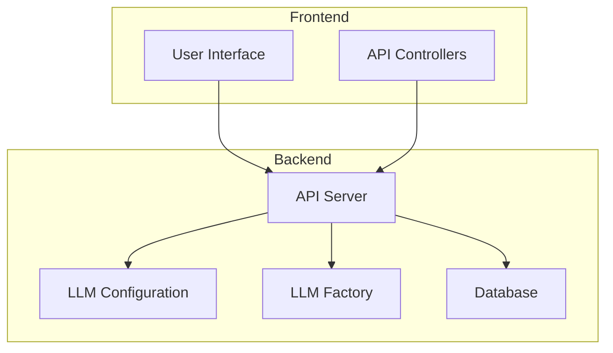
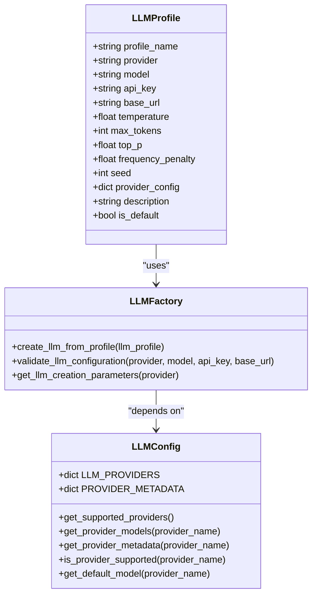
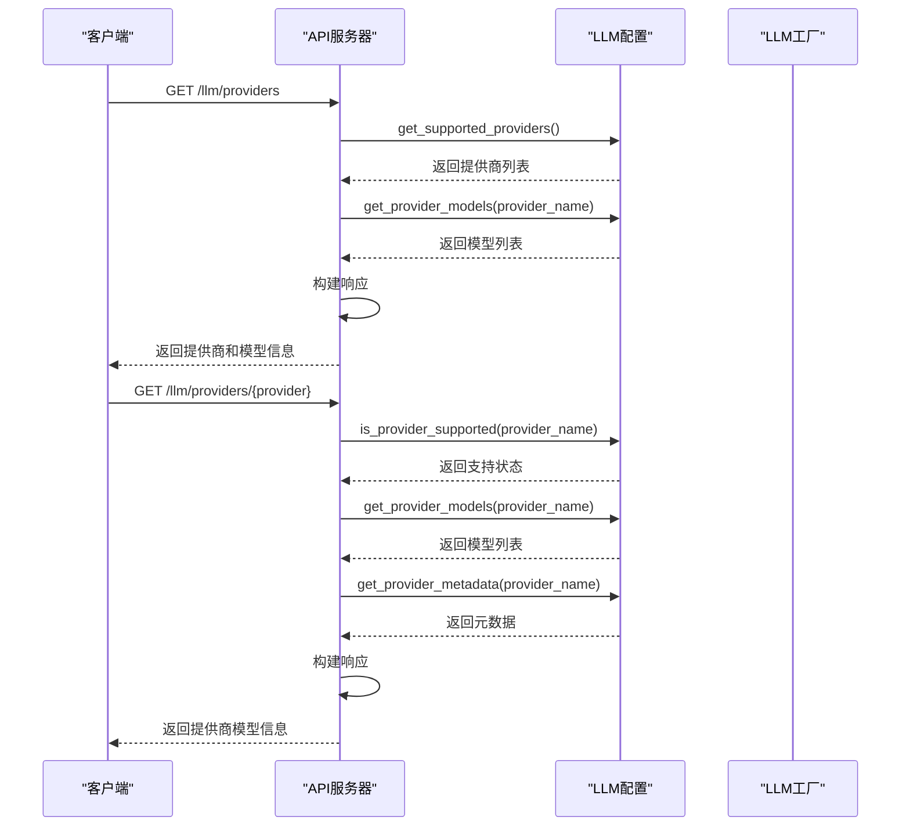
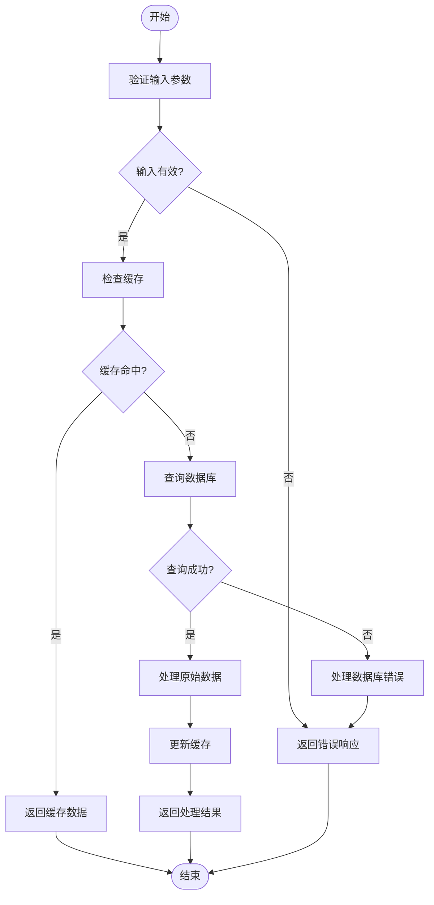
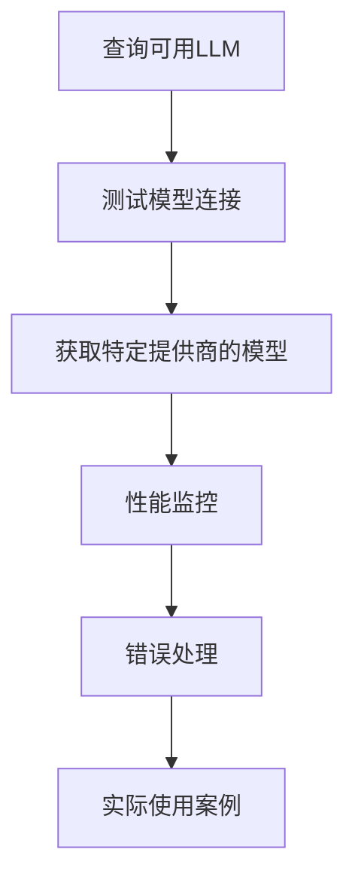
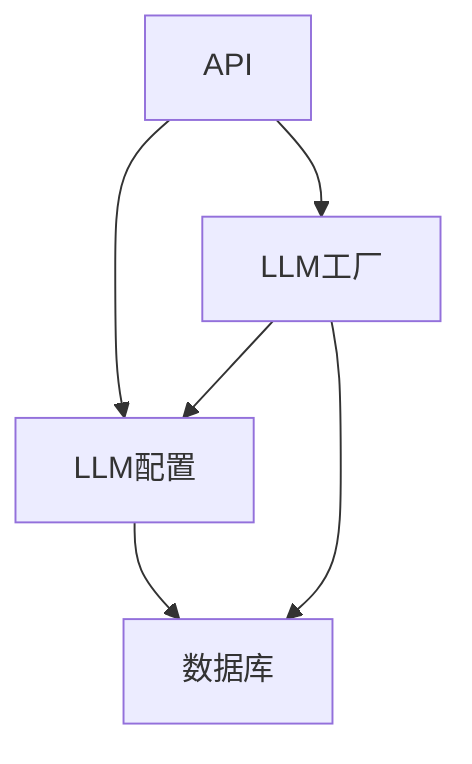

# 模型API

<cite>
**本文档中引用的文件**   
- [config.py](file://vibe_surf/backend/api/config.py)
- [llm_config.py](file://vibe_surf/backend/llm_config.py)
- [llm_factory.py](file://vibe_surf/backend/utils/llm_factory.py)
- [models.py](file://vibe_surf/backend/api/models.py)
- [openai_compatible.py](file://vibe_surf/llm/openai_compatible.py)
</cite>

## 目录
1. [简介](#简介)
2. [项目结构](#项目结构)
3. [核心组件](#核心组件)
4. [架构概述](#架构概述)
5. [详细组件分析](#详细组件分析)
6. [依赖分析](#依赖分析)
7. [性能考虑](#性能考虑)
8. [故障排除指南](#故障排除指南)
9. [结论](#结论)
10. [附录](#附录) (如有必要)

## 简介
本文档详细介绍了VibeSurf模型API，涵盖了所有端点、模型元数据、发现机制、健康检查、性能监控、自定义模型注册流程和API兼容性层。文档还提供了错误处理示例和实际使用案例，帮助用户查询和选择最适合其任务的LLM。

## 项目结构
VibeSurf项目具有清晰的模块化结构，主要组件包括后端API、LLM配置、工具和工作流。模型API主要位于`vibe_surf/backend/api/`目录下，而LLM配置和工厂模式实现在`vibe_surf/backend/llm_config.py`和`vibe_surf/backend/utils/llm_factory.py`中。

**Diagram sources**
- [config.py](file://vibe_surf/backend/api/config.py#L585-L642)
- [llm_config.py](file://vibe_surf/backend/llm_config.py#L83-L226)

**Section sources**
- [config.py](file://vibe_surf/backend/api/config.py#L585-L642)
- [llm_config.py](file://vibe_surf/backend/llm_config.py#L83-L226)

## 核心组件
模型API的核心组件包括提供者管理、模型发现、健康检查和性能监控。这些组件协同工作，确保用户能够轻松查询、测试和使用各种LLM。

**Section sources**
- [config.py](file://vibe_surf/backend/api/config.py#L585-L642)
- [llm_config.py](file://vibe_surf/backend/llm_config.py#L83-L226)

## 架构概述
VibeSurf模型API采用分层架构，前端通过API与后端通信，后端处理请求并调用相应的LLM服务。LLM配置和工厂模式确保了不同提供商的LLM可以无缝集成。

**Diagram sources**
- [config.py](file://vibe_surf/backend/api/config.py#L585-L642)
- [llm_config.py](file://vibe_surf/backend/llm_config.py#L83-L226)

## 详细组件分析

### 组件A分析
#### 对象导向组件：

**Diagram sources**
- [models.py](file://vibe_surf/backend/api/models.py#L14-L69)
- [llm_config.py](file://vibe_surf/backend/llm_config.py#L83-L226)
- [llm_factory.py](file://vibe_surf/backend/utils/llm_factory.py#L23-L275)

#### API/服务组件：

**Diagram sources**
- [config.py](file://vibe_surf/backend/api/config.py#L585-L642)
- [llm_config.py](file://vibe_surf/backend/llm_config.py#L83-L226)

#### 复杂逻辑组件：

**Diagram sources**
- [llm_factory.py](file://vibe_surf/backend/utils/llm_factory.py#L23-L275)
- [config.py](file://vibe_surf/backend/api/config.py#L585-L642)

**Section sources**
- [llm_factory.py](file://vibe_surf/backend/utils/llm_factory.py#L23-L275)
- [config.py](file://vibe_surf/backend/api/config.py#L585-L642)

### 概念概述
VibeSurf模型API提供了一种统一的方式来访问和管理多种LLM提供商。通过API，用户可以查询可用的模型、测试连接、获取特定提供商的模型，并进行性能监控。

[无来源，因为此图表显示的是概念工作流，而非实际代码结构]

[无来源，因为此部分不分析特定文件]

## 依赖分析
VibeSurf模型API的依赖关系清晰，主要依赖于LLM配置和工厂模式。这些组件确保了不同提供商的LLM可以无缝集成，并提供了统一的接口。

**Diagram sources**
- [config.py](file://vibe_surf/backend/api/config.py#L585-L642)
- [llm_config.py](file://vibe_surf/backend/llm_config.py#L83-L226)
- [llm_factory.py](file://vibe_surf/backend/utils/llm_factory.py#L23-L275)

**Section sources**
- [config.py](file://vibe_surf/backend/api/config.py#L585-L642)
- [llm_config.py](file://vibe_surf/backend/llm_config.py#L83-L226)
- [llm_factory.py](file://vibe_surf/backend/utils/llm_factory.py#L23-L275)

## 性能考虑
VibeSurf模型API通过缓存和异步请求优化性能。LLM配置和工厂模式确保了快速的模型创建和配置验证。

[无来源，因为此部分提供一般指导]

## 故障排除指南
### 错误处理
当模型不可用或API密钥无效时，API会返回相应的错误信息。例如，如果提供商不支持，API会返回404状态码和详细的错误信息。

**Section sources**
- [config.py](file://vibe_surf/backend/api/config.py#L626-L630)
- [openai_compatible.py](file://vibe_surf/llm/openai_compatible.py#L353-L372)

## 结论
VibeSurf模型API提供了一种强大而灵活的方式来访问和管理多种LLM提供商。通过详细的文档和示例，用户可以轻松查询、测试和使用最适合其任务的LLM。

[无来源，因为此部分总结而不分析特定文件]