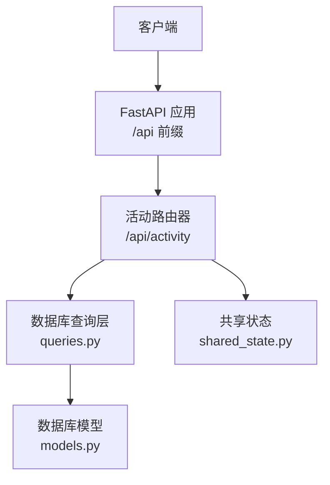
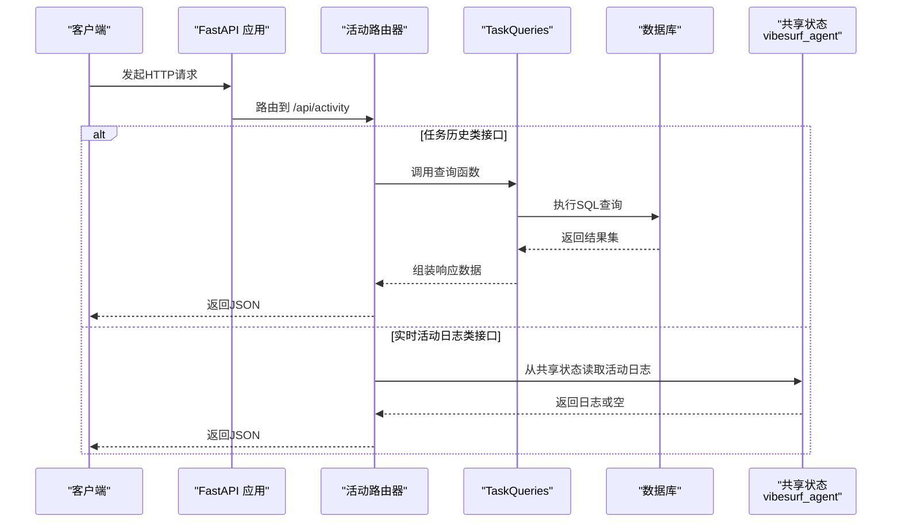
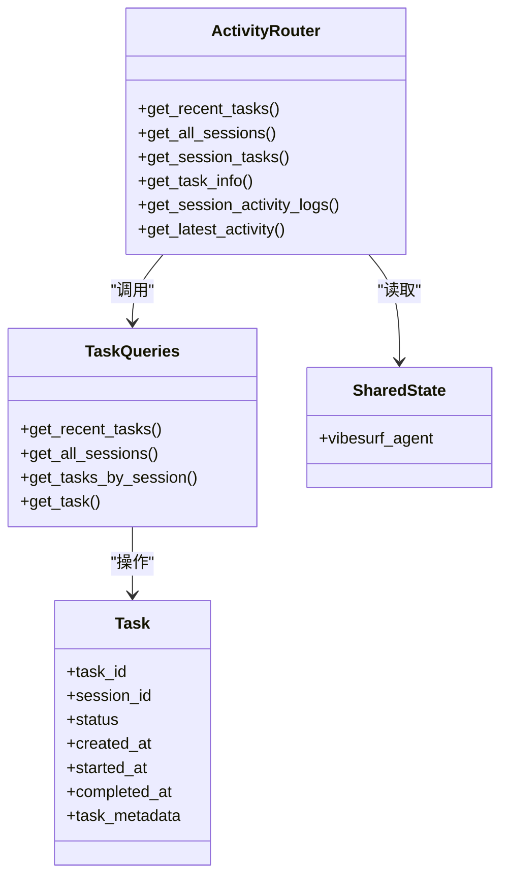

# 活动API

<cite>
**本文引用的文件列表**
- [vibe_surf/backend/api/activity.py](file://vibe_surf/backend/api/activity.py)
- [vibe_surf/backend/api/models.py](file://vibe_surf/backend/api/models.py)
- [vibe_surf/backend/database/models.py](file://vibe_surf/backend/database/models.py)
- [vibe_surf/backend/database/queries.py](file://vibe_surf/backend/database/queries.py)
- [vibe_surf/backend/main.py](file://vibe_surf/backend/main.py)
- [vibe_surf/backend/shared_state.py](file://vibe_surf/backend/shared_state.py)
- [tests/test_backend_api.py](file://tests/test_backend_api.py)
- [vibe_surf/chrome_extension/scripts/api-client.js](file://vibe_surf/chrome_extension/scripts/api-client.js)
</cite>

## 目录
1. [简介](#简介)
2. [项目结构与入口](#项目结构与入口)
3. [核心组件](#核心组件)
4. [架构总览](#架构总览)
5. [详细组件分析](#详细组件分析)
6. [依赖关系分析](#依赖关系分析)
7. [性能与可扩展性](#性能与可扩展性)
8. [故障排查指南](#故障排查指南)
9. [结论](#结论)
10. [附录：API参考与示例](#附录api参考与示例)

## 简介
本文件为 VibeSurf 活动API的权威文档，覆盖以下内容：
- 所有活动相关HTTP端点的定义与行为
- 请求/响应模式与字段说明（活动ID、时间戳、类型、状态、元数据）
- 认证与权限控制（JWT与API Key）
- 分页、过滤与排序能力
- 错误处理与常见错误码
- 使用Python requests库的实际调用示例（含查询特定时间段的活动记录）

注意：当前仓库中未发现“POST /activity”用于创建新活动的端点；活动API主要提供历史查询与实时会话活动日志读取能力。本文将基于现有实现进行完整说明，并在附录给出建议的扩展方向。

## 项目结构与入口
- 活动API路由位于后端模块，前缀为 /api/activity，挂载于 FastAPI 应用上。
- 路由器包含两类接口：
  - 任务历史接口：获取最近任务、按会话查询任务、获取会话列表等
  - 实时活动日志接口：获取指定会话的活动日志、最新活动摘要等
- 数据来源：
  - 任务历史来自数据库表 tasks 的查询封装
  - 实时活动日志来自共享状态中的 VibeSurfAgent 实例

图表来源
- [vibe_surf/backend/main.py](file://vibe_surf/backend/main.py#L580-L591)
- [vibe_surf/backend/api/activity.py](file://vibe_surf/backend/api/activity.py#L21-L246)
- [vibe_surf/backend/database/queries.py](file://vibe_surf/backend/database/queries.py#L441-L754)
- [vibe_surf/backend/database/models.py](file://vibe_surf/backend/database/models.py#L94-L137)
- [vibe_surf/backend/shared_state.py](file://vibe_surf/backend/shared_state.py#L37-L46)

章节来源
- [vibe_surf/backend/main.py](file://vibe_surf/backend/main.py#L580-L591)
- [vibe_surf/backend/api/activity.py](file://vibe_surf/backend/api/activity.py#L21-L246)

## 核心组件
- 活动路由器（/api/activity）
  - 提供任务历史与实时活动日志查询
- 数据库查询层（TaskQueries）
  - 封装任务历史的查询、分页、聚合统计
- 数据库模型（Task）
  - 定义任务表结构，包含状态、时间戳、元数据等字段
- 共享状态（vibesurf_agent）
  - 提供实时活动日志的读取能力

章节来源
- [vibe_surf/backend/api/activity.py](file://vibe_surf/backend/api/activity.py#L21-L246)
- [vibe_surf/backend/database/queries.py](file://vibe_surf/backend/database/queries.py#L441-L754)
- [vibe_surf/backend/database/models.py](file://vibe_surf/backend/database/models.py#L94-L137)
- [vibe_surf/backend/shared_state.py](file://vibe_surf/backend/shared_state.py#L37-L46)

## 架构总览
活动API的调用链路如下：

图表来源
- [vibe_surf/backend/api/activity.py](file://vibe_surf/backend/api/activity.py#L25-L246)
- [vibe_surf/backend/database/queries.py](file://vibe_surf/backend/database/queries.py#L524-L612)
- [vibe_surf/backend/shared_state.py](file://vibe_surf/backend/shared_state.py#L37-L46)

## 详细组件分析

### 任务历史接口
- GET /api/activity/tasks
  - 功能：获取最近的任务记录
  - 查询参数：
    - limit: 整数，默认 -1，表示不限制；有效范围 1..1000
  - 响应字段：
    - tasks: 列表，每项包含 task_id、session_id、task_description、status、task_result、error_message、report_path、created_at、started_at、completed_at
    - total_count: 返回数量
    - limit: 实际使用的限制
  - 错误：500 服务器内部错误

- GET /api/activity/sessions
  - 功能：获取所有会话（带任务计数与状态摘要）
  - 查询参数：
    - limit: 整数，默认 -1
    - offset: 整数，默认 0
  - 响应字段：
    - sessions: 列表，每项包含 session_id、task_count、created_at、last_activity、status
    - total_count、limit、offset
  - 错误：500 服务器内部错误

- GET /api/activity/sessions/{session_id}/tasks
  - 功能：按会话ID获取该会话的所有任务
  - 路径参数：session_id
  - 响应字段：
    - session_id、tasks（每项包含 task_id、task_description、status、task_result、llm_profile_name、workspace_dir、mcp_server_config、error_message、report_path、created_at、started_at、completed_at）、total_count
  - 错误：500 服务器内部错误

- GET /api/activity/{task_id}
  - 功能：按任务ID获取任务详情与结果
  - 路径参数：task_id
  - 响应字段：
    - task_id、session_id、task_description、status、upload_files_path、mcp_server_config、llm_profile_name、task_result、error_message、report_path、created_at、started_at、completed_at、metadata
  - 错误：404 未找到任务；500 服务器内部错误

章节来源
- [vibe_surf/backend/api/activity.py](file://vibe_surf/backend/api/activity.py#L25-L151)
- [vibe_surf/backend/database/queries.py](file://vibe_surf/backend/database/queries.py#L524-L612)
- [vibe_surf/backend/database/models.py](file://vibe_surf/backend/database/models.py#L94-L137)

### 实时活动日志接口
- GET /api/activity/sessions/{session_id}/activity
  - 功能：获取指定会话的实时活动日志
  - 查询参数：
    - limit: 整数，默认 -1，表示不限制
    - message_index: 可选整数，返回该索引的日志条目
  - 响应字段：
    - 当 message_index 未提供：session_id、activity_logs（数组）、total_count、original_total
    - 当 message_index 提供：session_id、activity_log（单条）、message_index、total_available
  - 错误：500 服务器内部错误；503 代理未初始化（当共享状态中的 VibeSurfAgent 未就绪时）

- GET /api/activity/sessions/{session_id}/latest_activity
  - 功能：获取指定会话的最新活动摘要
  - 响应字段：
    - session_id、latest_vibesurf_log（数组末尾条目，若存在）、latest_task（当前任务信息，若存在）
  - 错误：500 服务器内部错误

章节来源
- [vibe_surf/backend/api/activity.py](file://vibe_surf/backend/api/activity.py#L154-L246)
- [vibe_surf/backend/shared_state.py](file://vibe_surf/backend/shared_state.py#L37-L46)

### 请求/响应模式与字段说明
- 通用响应结构
  - 成功响应通常包含业务字段与统计字段（如 total_count、limit、offset 等）
  - 失败响应包含错误信息与时间戳（参见错误处理章节）

- 任务历史字段
  - 任务标识：task_id、session_id
  - 描述与配置：task_description、llm_profile_name、mcp_server_config、agent_mode
  - 文件与报告：upload_files_path、report_path
  - 结果与错误：task_result、error_message
  - 时间戳：created_at、started_at、completed_at
  - 状态：status（枚举值 pending/running/paused/completed/failed/stopped）
  - 元数据：task_metadata（JSON）

- 活动日志字段
  - 实时活动日志条目包含：timestamp、level、message、metadata（可选）
  - 最新活动摘要包含：最新日志条目

章节来源
- [vibe_surf/backend/api/models.py](file://vibe_surf/backend/api/models.py#L101-L160)
- [vibe_surf/backend/database/models.py](file://vibe_surf/backend/database/models.py#L94-L137)
- [vibe_surf/backend/api/activity.py](file://vibe_surf/backend/api/activity.py#L154-L246)

### 认证与权限控制
- 当前活动API未内置认证中间件或权限装饰器
- 若需启用认证，可在路由器或全局中间件中添加 JWT 或 API Key 验证逻辑
- 参考 Langflow 中的认证工具（JWT与API Key）可作为集成参考

章节来源
- [vibe_surf/backend/main.py](file://vibe_surf/backend/main.py#L580-L591)
- [vibe_surf/langflow/services/auth/utils.py](file://vibe_surf/langflow/services/auth/utils.py#L143-L221)

### 分页、过滤与排序
- 分页
  - sessions 接口支持 limit/offset
  - activity 接口支持 limit
- 过滤
  - 任务历史接口未提供显式过滤参数（如按状态、时间范围），可通过客户端侧筛选或扩展查询参数实现
- 排序
  - 任务历史默认按创建时间倒序排列
  - sessions 默认按最后活动时间倒序排列

章节来源
- [vibe_surf/backend/api/activity.py](file://vibe_surf/backend/api/activity.py#L61-L118)
- [vibe_surf/backend/database/queries.py](file://vibe_surf/backend/database/queries.py#L524-L612)

### 错误处理
- 404 未找到任务：当按 task_id 查询不存在的任务时返回
- 500 服务器内部错误：数据库异常、序列化异常等
- 503 服务不可用：共享状态中的 VibeSurfAgent 未初始化
- 通用错误响应包含错误消息与时间戳

章节来源
- [vibe_surf/backend/api/activity.py](file://vibe_surf/backend/api/activity.py#L119-L151)
- [vibe_surf/backend/api/activity.py](file://vibe_surf/backend/api/activity.py#L154-L218)
- [vibe_surf/backend/main.py](file://vibe_surf/backend/main.py#L696-L725)

## 依赖关系分析
- 模块耦合
  - 活动路由器依赖数据库查询层与共享状态
  - 数据库查询层依赖 SQLAlchemy 模型
- 外部依赖
  - FastAPI、SQLAlchemy、异步数据库连接
  - 日志与异常处理

图表来源
- [vibe_surf/backend/api/activity.py](file://vibe_surf/backend/api/activity.py#L25-L246)
- [vibe_surf/backend/database/queries.py](file://vibe_surf/backend/database/queries.py#L441-L754)
- [vibe_surf/backend/database/models.py](file://vibe_surf/backend/database/models.py#L94-L137)
- [vibe_surf/backend/shared_state.py](file://vibe_surf/backend/shared_state.py#L37-L46)

## 性能与可扩展性
- 查询优化
  - 为高频查询建立索引（如 session_id、status、created_at）
  - 合理设置 limit，避免一次性返回大量数据
- 异步执行
  - 使用异步数据库会话，减少阻塞
- 缓存策略
  - 对热点会话的活动日志可考虑短期缓存（需结合业务场景评估）

章节来源
- [vibe_surf/backend/database/models.py](file://vibe_surf/backend/database/models.py#L157-L167)
- [vibe_surf/backend/database/queries.py](file://vibe_surf/backend/database/queries.py#L524-L612)

## 故障排查指南
- 503 代理未初始化
  - 现象：调用 /api/activity/sessions/{session_id}/activity 返回 503
  - 排查：确认共享状态中的 VibeSurfAgent 已初始化
- 404 任务不存在
  - 现象：调用 /api/activity/{task_id} 返回 404
  - 排查：确认 task_id 是否正确，或检查数据库中是否存在该任务
- 500 服务器内部错误
  - 现象：数据库异常、序列化异常等
  - 排查：查看后端日志，定位具体异常堆栈

章节来源
- [vibe_surf/backend/api/activity.py](file://vibe_surf/backend/api/activity.py#L154-L218)
- [vibe_surf/backend/api/activity.py](file://vibe_surf/backend/api/activity.py#L119-L151)
- [vibe_surf/backend/main.py](file://vibe_surf/backend/main.py#L696-L725)

## 结论
- 当前活动API聚焦于“读取”能力，提供任务历史与实时活动日志查询
- 未内置认证机制，建议在生产环境中增加 JWT 或 API Key 验证
- 可通过扩展查询参数实现更细粒度的过滤与排序（如按时间范围、状态等）

## 附录：API参考与示例

### API参考清单
- GET /api/activity/tasks
  - 查询参数：limit
  - 响应：tasks、total_count、limit
- GET /api/activity/sessions
  - 查询参数：limit、offset
  - 响应：sessions、total_count、limit、offset
- GET /api/activity/sessions/{session_id}/tasks
  - 路径参数：session_id
  - 响应：session_id、tasks、total_count
- GET /api/activity/{task_id}
  - 路径参数：task_id
  - 响应：任务详情与元数据
- GET /api/activity/sessions/{session_id}/activity
  - 路径参数：session_id
  - 查询参数：limit、message_index
  - 响应：活动日志或单条日志
- GET /api/activity/sessions/{session_id}/latest_activity
  - 路径参数：session_id
  - 响应：最新活动摘要

章节来源
- [vibe_surf/backend/api/activity.py](file://vibe_surf/backend/api/activity.py#L25-L246)

### Python requests 示例
以下示例展示如何使用 Python requests 访问活动API。请根据实际部署地址调整 BASE_URL。

- 获取最近任务
  - 方法：GET /api/activity/tasks
  - 参数：limit
  - 示例路径：[vibe_surf/backend/api/activity.py](file://vibe_surf/backend/api/activity.py#L25-L56)

- 获取会话任务列表
  - 方法：GET /api/activity/sessions/{session_id}/tasks
  - 示例路径：[vibe_surf/backend/api/activity.py](file://vibe_surf/backend/api/activity.py#L85-L118)

- 获取指定任务详情
  - 方法：GET /api/activity/{task_id}
  - 示例路径：[vibe_surf/backend/api/activity.py](file://vibe_surf/backend/api/activity.py#L119-L151)

- 获取会话活动日志（分页）
  - 方法：GET /api/activity/sessions/{session_id}/activity
  - 参数：limit
  - 示例路径：[vibe_surf/backend/api/activity.py](file://vibe_surf/backend/api/activity.py#L154-L218)

- 获取最新活动摘要
  - 方法：GET /api/activity/sessions/{session_id}/latest_activity
  - 示例路径：[vibe_surf/backend/api/activity.py](file://vibe_surf/backend/api/activity.py#L220-L246)

- 使用 Chrome 扩展前端调用示例
  - 前端脚本中对活动API的调用封装，便于理解请求格式与参数传递
  - 示例路径：[vibe_surf/chrome_extension/scripts/api-client.js](file://vibe_surf/chrome_extension/scripts/api-client.js#L248-L271)

### 特定时间段查询建议
- 当前接口未提供直接的时间范围过滤参数
- 建议做法：
  - 在客户端侧对返回的 created_at/started_at/completed_at 字段进行过滤
  - 或在后续版本中扩展查询参数（如 start_time、end_time），并在查询层增加相应过滤条件

章节来源
- [vibe_surf/backend/api/activity.py](file://vibe_surf/backend/api/activity.py#L25-L118)
- [vibe_surf/backend/database/queries.py](file://vibe_surf/backend/database/queries.py#L524-L612)

### 测试用例参考
- 端到端测试展示了活动API的典型调用流程与断言
- 示例路径：
  - [tests/test_backend_api.py](file://tests/test_backend_api.py#L353-L427)