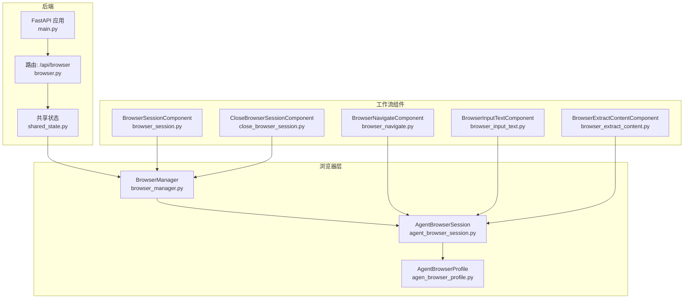
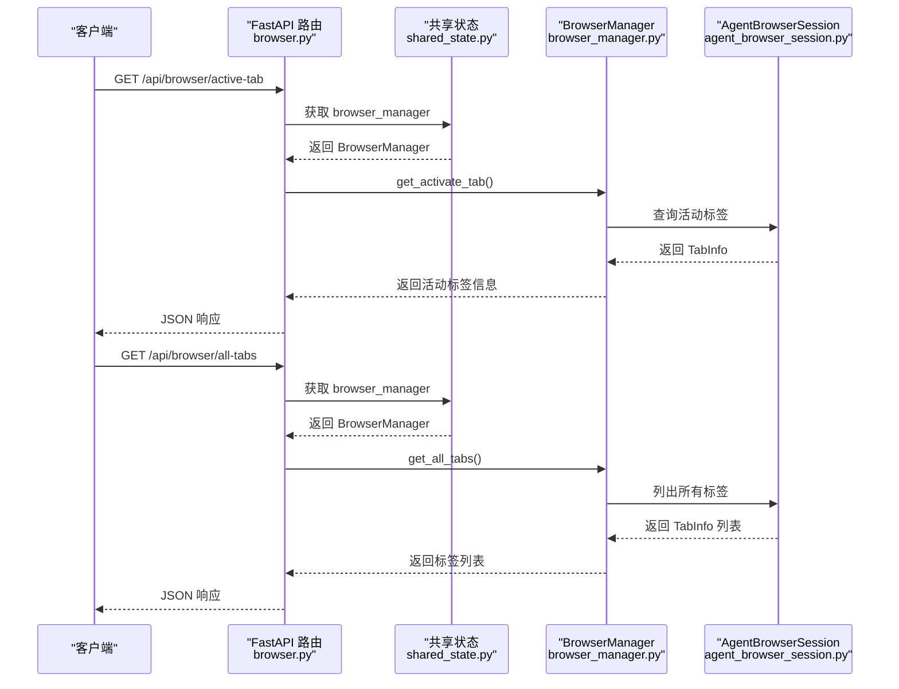
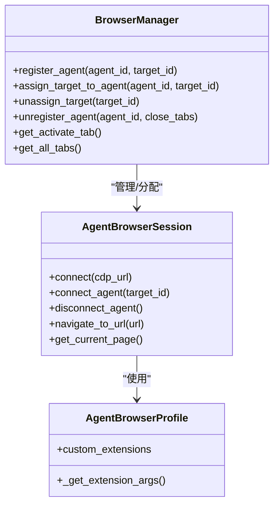

# 浏览器API

<cite>
**本文引用的文件列表**
- [main.py](file://vibe_surf/backend/main.py)
- [browser.py](file://vibe_surf/backend/api/browser.py)
- [shared_state.py](file://vibe_surf/backend/shared_state.py)
- [browser_manager.py](file://vibe_surf/browser/browser_manager.py)
- [agent_browser_session.py](file://vibe_surf/browser/agent_browser_session.py)
- [agen_browser_profile.py](file://vibe_surf/browser/agen_browser_profile.py)
- [browser_session.py](file://vibe_surf/workflows/Browser/browser_session.py)
- [close_browser_session.py](file://vibe_surf/workflows/Browser/close_browser_session.py)
- [browser_navigate.py](file://vibe_surf/workflows/Browser/browser_navigate.py)
- [browser_input_text.py](file://vibe_surf/workflows/Browser/browser_input_text.py)
- [browser_extract_content.py](file://vibe_surf/workflows/Browser/browser_extract_content.py)
- [models.py](file://vibe_surf/backend/api/models.py)
</cite>

## 目录
1. [简介](#简介)
2. [项目结构](#项目结构)
3. [核心组件](#核心组件)
4. [架构总览](#架构总览)
5. [详细组件分析](#详细组件分析)
6. [依赖关系分析](#依赖关系分析)
7. [性能与可靠性](#性能与可靠性)
8. [故障排查指南](#故障排查指南)
9. [结论](#结论)
10. [附录：API参考与示例](#附录api参考与示例)

## 简介
本文件为 VibeSurf 浏览器API的权威文档，覆盖浏览器会话生命周期管理、标签页控制、DOM操作与自动化流程。重点包括：
- 会话管理：获取会话、启动新会话、关闭会话
- 标签页控制：获取当前活动标签、列出所有标签
- 浏览器配置参数：用户代理、窗口大小、代理设置、扩展加载
- 自动化操作：导航、输入文本、内容提取等
- 错误处理与超时策略
- 实际使用示例（以路径引用代替具体代码）

## 项目结构
后端基于 FastAPI 提供统一入口，浏览器能力由共享状态中的 BrowserManager 统一调度，AgentBrowserSession 封装 CDP 连接与页面操作；前端通过 Langflow 工作流组件调用浏览器能力。

图表来源
- [main.py](file://vibe_surf/backend/main.py#L552-L775)
- [browser.py](file://vibe_surf/backend/api/browser.py#L1-L71)
- [shared_state.py](file://vibe_surf/backend/shared_state.py#L453-L598)
- [browser_manager.py](file://vibe_surf/browser/browser_manager.py#L24-L179)
- [agent_browser_session.py](file://vibe_surf/browser/agent_browser_session.py#L1-L120)
- [agen_browser_profile.py](file://vibe_surf/browser/agen_browser_profile.py#L24-L137)
- [browser_session.py](file://vibe_surf/workflows/Browser/browser_session.py#L1-L55)
- [close_browser_session.py](file://vibe_surf/workflows/Browser/close_browser_session.py#L1-L51)
- [browser_navigate.py](file://vibe_surf/workflows/Browser/browser_navigate.py#L1-L51)
- [browser_input_text.py](file://vibe_surf/workflows/Browser/browser_input_text.py#L1-L170)
- [browser_extract_content.py](file://vibe_surf/workflows/Browser/browser_extract_content.py#L1-L198)

章节来源
- [main.py](file://vibe_surf/backend/main.py#L552-L775)
- [browser.py](file://vibe_surf/backend/api/browser.py#L1-L71)
- [shared_state.py](file://vibe_surf/backend/shared_state.py#L453-L598)

## 核心组件
- FastAPI 应用与路由
  - 后端应用在入口处注册 /api/browser 路由，提供标签页查询接口。
  - 共享状态负责初始化主浏览器会话与 BrowserManager，并在生命周期内维护其可用性。
- 浏览器管理
  - BrowserManager 负责为不同 Agent 分配独立的浏览器目标（标签页），并提供活动标签查询、标签列表查询、目标分配与回收等能力。
  - AgentBrowserSession 封装 CDP 连接、扩展注入、代理认证、事件分发等。
- 工作流组件
  - 通过 Langflow 组件封装浏览器操作，如启动/关闭会话、导航、输入文本、内容提取等。

章节来源
- [main.py](file://vibe_surf/backend/main.py#L552-L775)
- [browser_manager.py](file://vibe_surf/browser/browser_manager.py#L24-L179)
- [agent_browser_session.py](file://vibe_surf/browser/agent_browser_session.py#L1-L120)
- [browser_session.py](file://vibe_surf/workflows/Browser/browser_session.py#L1-L55)
- [close_browser_session.py](file://vibe_surf/workflows/Browser/close_browser_session.py#L1-L51)

## 架构总览
浏览器API的调用链路如下：
- 客户端请求 /api/browser/* → FastAPI 路由 → 共享状态中的 BrowserManager → AgentBrowserSession → CDP Target/页面操作
- 工作流组件通过共享状态获取 BrowserManager，再注册/分配 Agent 会话，执行导航、输入、提取等动作

图表来源
- [browser.py](file://vibe_surf/backend/api/browser.py#L1-L71)
- [shared_state.py](file://vibe_surf/backend/shared_state.py#L453-L598)
- [browser_manager.py](file://vibe_surf/browser/browser_manager.py#L24-L179)

## 详细组件分析

### 1) 标签页查询接口
- GET /api/browser/active-tab
  - 功能：返回当前活动标签的 URL 与标题
  - 返回格式：包含目标ID后四位作为键，值为 {url, title}
  - 异常：未初始化或内部错误时返回 503/500
- GET /api/browser/all-tabs
  - 功能：返回所有标签的 URL 与标题
  - 返回格式：同上
  - 异常：未初始化或内部错误时返回 503/500

章节来源
- [browser.py](file://vibe_surf/backend/api/browser.py#L1-L71)

### 2) 会话管理（工作流组件）
- 创建会话
  - 使用 BrowserSessionComponent 获取会话，支持选择是否使用主会话或指定目标ID
  - 若未指定目标ID，将自动创建一个新标签页并绑定到该会话
- 关闭会话
  - 使用 CloseBrowserSessionComponent 关闭指定会话
  - 主会话不可关闭，否则返回提示信息

章节来源
- [browser_session.py](file://vibe_surf/workflows/Browser/browser_session.py#L1-L55)
- [close_browser_session.py](file://vibe_surf/workflows/Browser/close_browser_session.py#L1-L51)

### 3) 浏览器配置参数
- 用户代理、窗口大小、设备参数
  - 通过 AgentBrowserProfile 字段传递，例如 user_agent、screen、viewport、device_scale_factor 等
- 扩展加载
  - 支持自定义扩展目录 custom_extensions，以及默认扩展下载与启用
- 代理设置
  - 通过 ProxySettings 配置，连接时自动注入代理认证
- 其他行为参数
  - keep_alive、highlight_elements、wait_for_network_idle_page_load_time、minimum_wait_page_load_time、filter_highlight_ids 等

章节来源
- [agen_browser_profile.py](file://vibe_surf/browser/agen_browser_profile.py#L24-L137)
- [agent_browser_session.py](file://vibe_surf/browser/agent_browser_session.py#L1-L120)

### 4) 标签页控制与会话生命周期
- 活动标签检测
  - 通过 CDP Runtime.evaluate 检查 document.hasFocus()/visibilityState 等，优先返回可见且有焦点的标签
- 目标分配与回收
  - register_agent：为 Agent 注册会话并启动 watchdogs
  - assign_target_to_agent：为目标分配安全校验，避免跨会话抢占
  - unregister_agent：清理 Agent 的所有目标与会话
  - unassign_target：解除目标绑定并断开 CDP 会话
- 关闭管理
  - close：关闭所有 Agent 会话但保留主会话

章节来源
- [browser_manager.py](file://vibe_surf/browser/browser_manager.py#L24-L179)

### 5) DOM 操作与自动化
- 导航
  - BrowserNavigateComponent：传入 URL 并触发导航，等待稳定后再返回
- 输入文本
  - BrowserInputTextComponent：支持按元素文本、上下文提示、CSS 选择器、后端节点ID、LLM 提示等多种方式定位元素并输入文本
- 内容提取
  - BrowserExtractContentComponent：支持非结构化提取（Message）与结构化提取（基于输出Schema生成Pydantic模型）

章节来源
- [browser_navigate.py](file://vibe_surf/workflows/Browser/browser_navigate.py#L1-L51)
- [browser_input_text.py](file://vibe_surf/workflows/Browser/browser_input_text.py#L1-L170)
- [browser_extract_content.py](file://vibe_surf/workflows/Browser/browser_extract_content.py#L1-L198)

### 6) 错误处理与异常
- 标签页接口
  - 未初始化：返回 503
  - 运行时异常：捕获并返回 500
- 会话关闭
  - 主会话不可关闭：返回提示信息
- 通用异常
  - FastAPI 全局异常处理器将未处理异常转换为 JSON 响应
  - Pydantic 序列化错误有专门处理

章节来源
- [browser.py](file://vibe_surf/backend/api/browser.py#L1-L71)
- [close_browser_session.py](file://vibe_surf/workflows/Browser/close_browser_session.py#L1-L51)
- [main.py](file://vibe_surf/backend/main.py#L696-L725)

## 依赖关系分析

图表来源
- [browser_manager.py](file://vibe_surf/browser/browser_manager.py#L24-L179)
- [agent_browser_session.py](file://vibe_surf/browser/agent_browser_session.py#L1-L120)
- [agen_browser_profile.py](file://vibe_surf/browser/agen_browser_profile.py#L24-L137)

章节来源
- [browser_manager.py](file://vibe_surf/browser/browser_manager.py#L24-L179)
- [agent_browser_session.py](file://vibe_surf/browser/agent_browser_session.py#L1-L120)
- [agen_browser_profile.py](file://vibe_surf/browser/agen_browser_profile.py#L24-L137)

## 性能与可靠性
- 连接监控
  - 后台任务定期检查浏览器连接状态，若断开则触发优雅退出
- 会话隔离
  - 每个 Agent 拥有独立的 CDP 会话池，避免跨会话干扰
- 网络稳定性
  - 导航前后等待网络空闲，减少页面未加载完成导致的操作失败
- 扩展与代理
  - 默认扩展用于广告拦截与 Cookie 处理；代理认证失败时可回退或报错

章节来源
- [main.py](file://vibe_surf/backend/main.py#L103-L148)
- [agent_browser_session.py](file://vibe_surf/browser/agent_browser_session.py#L1-L120)
- [agen_browser_profile.py](file://vibe_surf/browser/agen_browser_profile.py#L24-L137)

## 故障排查指南
- “浏览器未初始化”
  - 现象：标签页接口返回 503
  - 排查：确认共享状态已初始化主会话与 BrowserManager
- “CDP 连接失败”
  - 现象：会话无法建立或页面无响应
  - 排查：检查 cdp-url 是否正确，必要时通过 /json/version 获取 WebSocket 地址；确认扩展注入成功
- “目标被占用/跨会话抢占”
  - 现象：assign_target_to_agent 返回失败
  - 排查：确认目标ID归属，避免跨 Agent 使用
- “主会话不可关闭”
  - 现象：关闭会话返回提示
  - 排查：仅允许关闭非主会话的 Agent 会话

章节来源
- [browser.py](file://vibe_surf/backend/api/browser.py#L1-L71)
- [browser_manager.py](file://vibe_surf/browser/browser_manager.py#L24-L179)
- [close_browser_session.py](file://vibe_surf/workflows/Browser/close_browser_session.py#L1-L51)

## 结论
VibeSurf 的浏览器API通过清晰的会话管理与标签页控制，结合工作流组件实现了稳定的自动化操作。配置参数覆盖用户代理、窗口、代理与扩展，满足多样化场景需求。建议在生产环境中配合连接监控与异常处理，确保长时间运行的稳定性。

## 附录：API参考与示例

### A. 标签页查询
- GET /api/browser/active-tab
  - 成功响应：包含活动标签的 {id后四位: {url, title}}
  - 异常：503（未初始化）、500（内部错误）
- GET /api/browser/all-tabs
  - 成功响应：包含所有标签的 {id后四位: {url, title}}
  - 异常：503（未初始化）、500（内部错误）

章节来源
- [browser.py](file://vibe_surf/backend/api/browser.py#L1-L71)

### B. 会话管理（工作流组件）
- 创建会话
  - 输入：use_main_session（布尔）、target_id（字符串，可选）
  - 输出：AgentBrowserSession
  - 参考实现路径：[browser_session.py](file://vibe_surf/workflows/Browser/browser_session.py#L1-L55)
- 关闭会话
  - 输入：browser_session（AgentBrowserSession）
  - 输出：Message（结果信息）
  - 参考实现路径：[close_browser_session.py](file://vibe_surf/workflows/Browser/close_browser_session.py#L1-L51)

章节来源
- [browser_session.py](file://vibe_surf/workflows/Browser/browser_session.py#L1-L55)
- [close_browser_session.py](file://vibe_surf/workflows/Browser/close_browser_session.py#L1-L51)

### C. 浏览器配置参数（字段说明）
- 用户代理与窗口
  - user_agent、screen、viewport、device_scale_factor
- 行为与安全
  - keep_alive、highlight_elements、filter_highlight_ids、disable_security、deterministic_rendering
- 等待策略
  - minimum_wait_page_load_time、wait_for_network_idle_page_load_time、wait_between_actions
- 代理与扩展
  - proxy（ProxySettings）、custom_extensions（扩展目录列表）
- DOM 提取
  - cross_origin_iframes、dom_highlight_elements、paint_order_filtering、max_iframes、max_iframe_depth

章节来源
- [agen_browser_profile.py](file://vibe_surf/browser/agen_browser_profile.py#L24-L137)
- [agent_browser_session.py](file://vibe_surf/browser/agent_browser_session.py#L1-L120)

### D. 自动化操作示例（以路径引用代替代码）
- 导航
  - 步骤：创建会话 → 调用导航组件 → 等待页面稳定
  - 参考实现路径：[browser_navigate.py](file://vibe_surf/workflows/Browser/browser_navigate.py#L1-L51)
- 表单填写
  - 步骤：创建会话 → 定位元素（文本/提示/CSS/节点ID/LLM）→ 输入文本（可选清空）
  - 参考实现路径：[browser_input_text.py](file://vibe_surf/workflows/Browser/browser_input_text.py#L1-L170)
- 内容提取
  - 步骤：创建会话 → 选择提取目标（自然语言描述）→ 非结构化或结构化输出
  - 参考实现路径：[browser_extract_content.py](file://vibe_surf/workflows/Browser/browser_extract_content.py#L1-L198)

章节来源
- [browser_navigate.py](file://vibe_surf/workflows/Browser/browser_navigate.py#L1-L51)
- [browser_input_text.py](file://vibe_surf/workflows/Browser/browser_input_text.py#L1-L170)
- [browser_extract_content.py](file://vibe_surf/workflows/Browser/browser_extract_content.py#L1-L198)

### E. 错误处理与响应模型
- 标准错误响应模型
  - 字段：error、detail、timestamp
  - 参考模型路径：[models.py](file://vibe_surf/backend/api/models.py#L178-L183)
- 控制操作响应模型
  - 字段：success、message、operation、timestamp、details
  - 参考模型路径：[models.py](file://vibe_surf/backend/api/models.py#L184-L191)

章节来源
- [models.py](file://vibe_surf/backend/api/models.py#L178-L191)