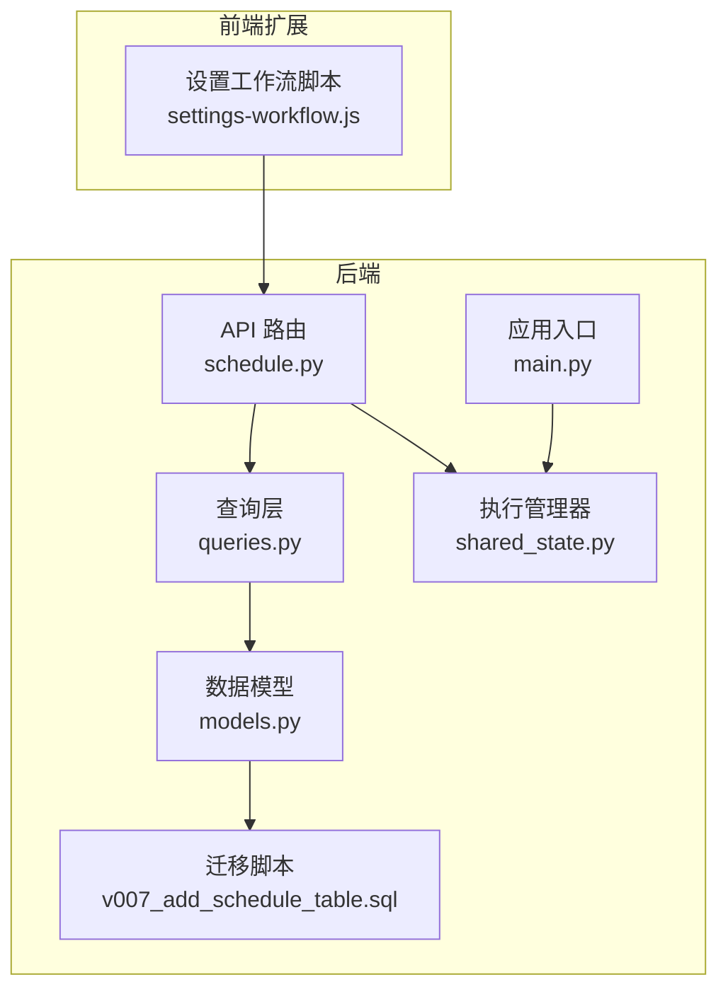
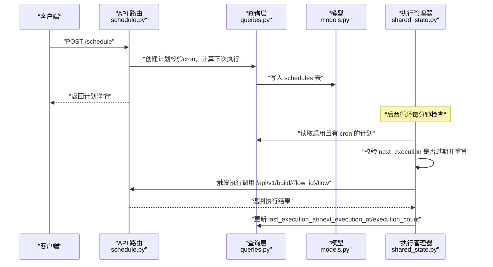

# 计划API

<cite>
**本文引用的文件**
- [schedule.py](file://vibe_surf/backend/api/schedule.py)
- [queries.py](file://vibe_surf/backend/database/queries.py)
- [models.py](file://vibe_surf/backend/database/models.py)
- [v007_add_schedule_table.sql](file://vibe_surf/backend/database/migrations/v007_add_schedule_table.sql)
- [shared_state.py](file://vibe_surf/backend/shared_state.py)
- [main.py](file://vibe_surf/backend/main.py)
- [settings-workflow.js](file://vibe_surf/chrome_extension/scripts/settings-workflow.js)
</cite>

## 目录
1. [简介](#简介)
2. [项目结构](#项目结构)
3. [核心组件](#核心组件)
4. [架构总览](#架构总览)
5. [详细组件分析](#详细组件分析)
6. [依赖关系分析](#依赖关系分析)
7. [性能与可扩展性](#性能与可扩展性)
8. [故障排查指南](#故障排查指南)
9. [结论](#结论)
10. [附录：API参考与示例](#附录api参考与示例)

## 简介
本文件为 VibeSurf 计划（定时调度）API 的权威文档，覆盖以下内容：
- 所有端点：GET /schedule、POST /schedule、GET /schedule/{flow_id}、PUT /schedule/{flow_id}、DELETE /schedule/{flow_id}
- 计划配置模式：cron 表达式、任务ID（flow_id）、启用状态、描述等
- 执行引擎：基于本地时区计算下一次执行时间，UTC 存储；最小执行间隔保护；过期下次执行时间自动重算
- 时区处理：以系统本地时区解析 cron，转换为 UTC 存储
- 错误处理：无效 cron 表达式、数据库异常、未找到资源、并发更新冲突等
- 实际示例：如何通过 API 设置定期自动化任务

## 项目结构
计划API位于后端模块中，围绕数据库模型、查询层、API路由与执行管理器协同工作，并通过前端扩展提供可视化构建 cron 的能力。



图表来源
- [schedule.py](file://vibe_surf/backend/api/schedule.py#L1-L331)
- [queries.py](file://vibe_surf/backend/database/queries.py#L1432-L1683)
- [models.py](file://vibe_surf/backend/database/models.py#L258-L289)
- [v007_add_schedule_table.sql](file://vibe_surf/backend/database/migrations/v007_add_schedule_table.sql#L1-L29)
- [shared_state.py](file://vibe_surf/backend/shared_state.py#L739-L1111)
- [main.py](file://vibe_surf/backend/main.py#L1-L200)
- [settings-workflow.js](file://vibe_surf/chrome_extension/scripts/settings-workflow.js#L2329-L2369)

章节来源
- [schedule.py](file://vibe_surf/backend/api/schedule.py#L1-L331)
- [queries.py](file://vibe_surf/backend/database/queries.py#L1432-L1683)
- [models.py](file://vibe_surf/backend/database/models.py#L258-L289)
- [v007_add_schedule_table.sql](file://vibe_surf/backend/database/migrations/v007_add_schedule_table.sql#L1-L29)
- [shared_state.py](file://vibe_surf/backend/shared_state.py#L739-L1111)
- [main.py](file://vibe_surf/backend/main.py#L1-L200)
- [settings-workflow.js](file://vibe_surf/chrome_extension/scripts/settings-workflow.js#L2329-L2369)

## 核心组件
- API 路由层：定义计划 CRUD 与查询接口，负责请求校验、错误处理与返回响应
- 查询层：封装对 schedules 表的增删改查、启用筛选、执行计数自增等操作
- 数据模型：定义 schedules 表字段、索引与约束
- 执行管理器：周期性检查并触发计划执行，维护本地缓存与数据库同步
- 应用入口：注册路由与启动执行管理器
- 前端扩展：提供简单 cron 构建器，生成标准 cron 表达式供 API 使用

章节来源
- [schedule.py](file://vibe_surf/backend/api/schedule.py#L1-L331)
- [queries.py](file://vibe_surf/backend/database/queries.py#L1432-L1683)
- [models.py](file://vibe_surf/backend/database/models.py#L258-L289)
- [shared_state.py](file://vibe_surf/backend/shared_state.py#L739-L1111)
- [main.py](file://vibe_surf/backend/main.py#L1-L200)
- [settings-workflow.js](file://vibe_surf/chrome_extension/scripts/settings-workflow.js#L2329-L2369)

## 架构总览
计划API采用“路由-查询-模型-执行管理器”的分层设计。API层负责输入校验与错误处理；查询层负责数据库访问与事务控制；模型层定义表结构与索引；执行管理器负责计划的周期性检查与触发；应用入口负责初始化与生命周期管理。



图表来源
- [schedule.py](file://vibe_surf/backend/api/schedule.py#L108-L148)
- [queries.py](file://vibe_surf/backend/database/queries.py#L1432-L1683)
- [models.py](file://vibe_surf/backend/database/models.py#L258-L289)
- [shared_state.py](file://vibe_surf/backend/shared_state.py#L739-L1111)

## 详细组件分析

### API 路由与端点
- GET /schedule
  - 功能：列出所有计划
  - 输入：无
  - 输出：计划数组（包含 id、flow_id、cron_expression、is_enabled、description、last_execution_at、next_execution_at、execution_count、created_at、updated_at）
  - 错误：内部服务器错误
- POST /schedule
  - 功能：创建新计划
  - 请求体：flow_id、cron_expression（可选）、is_enabled（默认启用）、description（可选）
  - 校验：cron 表达式格式校验；同一 flow_id 仅允许一个计划
  - 返回：新建计划详情
  - 错误：无效 cron、已存在同 flow_id 的计划、内部服务器错误
- GET /schedule/{flow_id}
  - 功能：按 flow_id 获取计划详情
  - 返回：计划详情
  - 错误：未找到、内部服务器错误
- PUT /schedule/{flow_id}
  - 功能：更新计划（支持部分字段）
  - 请求体：cron_expression（可选）、is_enabled（可选）、description（可选）
  - 校验：cron 表达式格式校验
  - 返回：更新后的计划详情
  - 错误：未找到、无效 cron、内部服务器错误
- DELETE /schedule/{flow_id}
  - 功能：删除计划
  - 返回：删除成功消息
  - 错误：未找到、内部服务器错误

章节来源
- [schedule.py](file://vibe_surf/backend/api/schedule.py#L77-L112)
- [schedule.py](file://vibe_surf/backend/api/schedule.py#L108-L148)
- [schedule.py](file://vibe_surf/backend/api/schedule.py#L159-L184)
- [schedule.py](file://vibe_surf/backend/api/schedule.py#L195-L280)
- [schedule.py](file://vibe_surf/backend/api/schedule.py#L290-L331)

### 数据模型与数据库
- 表：schedules
  - 字段：id、flow_id（唯一）、cron_expression（可空）、is_enabled、description、last_execution_at、next_execution_at、execution_count、created_at、updated_at
  - 索引：flow_id、is_enabled、next_execution_at、cron_expression
  - 触发器：更新 updated_at
- 模型：Schedule（SQLAlchemy）
  - 关键字段：flow_id、cron_expression、is_enabled、last_execution_at、next_execution_at、execution_count
  - 约束：flow_id 唯一

章节来源
- [models.py](file://vibe_surf/backend/database/models.py#L258-L289)
- [v007_add_schedule_table.sql](file://vibe_surf/backend/database/migrations/v007_add_schedule_table.sql#L1-L29)

### 查询层（ScheduleQueries）
- create_schedule：创建计划，若提供 cron_expression 则计算 next_execution_at；返回计划字典
- get_schedule/get_schedule_by_flow_id/list_schedules：按 id/flow_id/条件查询
- update_schedule/update_schedule_by_flow_id：更新计划，若更新 cron_expression 则重新计算 next_execution_at；返回布尔
- delete_schedule/delete_schedule_by_flow_id：删除计划
- get_enabled_schedules：获取启用的计划
- increment_execution_count：自增 execution_count 并更新时间戳

章节来源
- [queries.py](file://vibe_surf/backend/database/queries.py#L1432-L1683)

### 执行管理器（ScheduleManager）
- 启动/停止：start/stop，内部使用 asyncio 循环
- reload_schedules：从数据库加载启用且有 cron 的计划，若 next_execution 过期则重算并更新
- 主循环：每分钟检查一次
- 条件判断：是否到达 next_execution，且距离上次执行至少 30 秒
- 执行触发：向后端本地地址发起异步请求，调用 /api/v1/build/{flow_id}/flow
- 执行跟踪：成功后更新 last_execution_at、next_execution_at、execution_count，并刷新本地缓存

章节来源
- [shared_state.py](file://vibe_surf/backend/shared_state.py#L739-L1111)

### 时区与 cron 处理
- cron 校验：使用 croniter 验证表达式合法性
- 下次执行计算：以系统本地时区为基准，计算本地下次执行时间，再转换为 UTC 存储
- 过期重算：若 next_execution_at 已过期，则在加载与执行前重算并更新数据库
- 最小间隔：防止短时间内重复执行（30 秒）

章节来源
- [schedule.py](file://vibe_surf/backend/api/schedule.py#L52-L75)
- [queries.py](file://vibe_surf/backend/database/queries.py#L1432-L1683)
- [shared_state.py](file://vibe_surf/backend/shared_state.py#L739-L1111)

### 前端 cron 构建器
- 提供“每X分钟”、“每X小时”、“每日”、“每周”、“每月”等简单构建器，生成标准 cron 表达式
- 用于辅助用户在界面中快速生成合法 cron

章节来源
- [settings-workflow.js](file://vibe_surf/chrome_extension/scripts/settings-workflow.js#L2329-L2369)

## 依赖关系分析

```mermaid
classDiagram
class ScheduleAPI {
+GET /schedule
+POST /schedule
+GET /schedule/{flow_id}
+PUT /schedule/{flow_id}
+DELETE /schedule/{flow_id}
}
class ScheduleQueries {
+create_schedule()
+get_schedule()
+get_schedule_by_flow_id()
+list_schedules()
+update_schedule()
+update_schedule_by_flow_id()
+delete_schedule()
+delete_schedule_by_flow_id()
+get_enabled_schedules()
+increment_execution_count()
}
class Schedule {
+id
+flow_id
+cron_expression
+is_enabled
+last_execution_at
+next_execution_at
+execution_count
+created_at
+updated_at
}
class ScheduleManager {
+start()
+stop()
+reload_schedules()
+_schedule_loop()
+_should_execute_schedule()
+_execute_scheduled_flow()
+_update_execution_tracking()
+_update_next_execution_time()
}
ScheduleAPI --> ScheduleQueries : "调用"
ScheduleQueries --> Schedule : "读写"
ScheduleManager --> ScheduleQueries : "读取/更新"
ScheduleManager --> ScheduleAPI : "触发执行"
```

图表来源
- [schedule.py](file://vibe_surf/backend/api/schedule.py#L1-L331)
- [queries.py](file://vibe_surf/backend/database/queries.py#L1432-L1683)
- [models.py](file://vibe_surf/backend/database/models.py#L258-L289)
- [shared_state.py](file://vibe_surf/backend/shared_state.py#L739-L1111)

章节来源
- [schedule.py](file://vibe_surf/backend/api/schedule.py#L1-L331)
- [queries.py](file://vibe_surf/backend/database/queries.py#L1432-L1683)
- [models.py](file://vibe_surf/backend/database/models.py#L258-L289)
- [shared_state.py](file://vibe_surf/backend/shared_state.py#L739-L1111)

## 性能与可扩展性
- 索引优化：对 flow_id、is_enabled、next_execution_at、cron_expression 建立索引，提升查询与排序性能
- 批量更新：执行跟踪更新使用原子更新，避免并发写冲突
- 最小间隔保护：30 秒最小间隔减少重复触发风险
- 异步执行：API 与执行管理器均采用异步，降低阻塞
- 可扩展点：可增加计划优先级、失败重试策略、执行超时控制等

章节来源
- [v007_add_schedule_table.sql](file://vibe_surf/backend/database/migrations/v007_add_schedule_table.sql#L1-L29)
- [shared_state.py](file://vibe_surf/backend/shared_state.py#L739-L1111)

## 故障排查指南
- 无效 cron 表达式
  - 现象：创建/更新时返回 400
  - 排查：确认 cron 表达式符合标准格式；可使用前端构建器生成
  - 参考
    - [schedule.py](file://vibe_surf/backend/api/schedule.py#L114-L119)
    - [queries.py](file://vibe_surf/backend/database/queries.py#L1566-L1577)
- 计划不存在
  - 现象：GET/PUT/DELETE 返回 404
  - 排查：确认 flow_id 是否正确；检查数据库是否存在对应记录
  - 参考
    - [schedule.py](file://vibe_surf/backend/api/schedule.py#L165-L169)
    - [schedule.py](file://vibe_surf/backend/api/schedule.py#L243-L247)
    - [schedule.py](file://vibe_surf/backend/api/schedule.py#L300-L303)
- 重复计划
  - 现象：创建时报冲突
  - 排查：每个 flow_id 仅允许一个计划
  - 参考
    - [schedule.py](file://vibe_surf/backend/api/schedule.py#L121-L127)
- 执行未触发
  - 现象：next_execution_at 不变或未触发
  - 排查：检查执行管理器是否启动；确认 cron 表达式有效；查看日志中“过期重算”提示
  - 参考
    - [shared_state.py](file://vibe_surf/backend/shared_state.py#L739-L1111)
- 执行失败
  - 现象：触发执行但未更新 last_execution_at
  - 排查：检查后端本地端口环境变量；确认 /api/v1/build/{flow_id}/flow 可用
  - 参考
    - [shared_state.py](file://vibe_surf/backend/shared_state.py#L932-L961)

章节来源
- [schedule.py](file://vibe_surf/backend/api/schedule.py#L114-L127)
- [schedule.py](file://vibe_surf/backend/api/schedule.py#L165-L169)
- [schedule.py](file://vibe_surf/backend/api/schedule.py#L243-L247)
- [schedule.py](file://vibe_surf/backend/api/schedule.py#L300-L303)
- [shared_state.py](file://vibe_surf/backend/shared_state.py#L739-L1111)

## 结论
VibeSurf 计划API提供了简洁而健壮的定时调度能力：以标准 cron 表达式驱动，结合本地时区计算与 UTC 存储，配合执行管理器的周期检查与最小间隔保护，确保稳定可靠的自动化执行。API 层提供完善的校验与错误处理，查询层保证数据一致性，前端扩展提供易用的 cron 构建器，整体形成从配置到执行的完整闭环。

## 附录：API参考与示例

### 端点一览
- GET /schedule
  - 描述：获取所有计划
  - 成功响应：计划数组
  - 错误：500 内部服务器错误
- POST /schedule
  - 描述：创建新计划
  - 请求体字段：
    - flow_id：字符串，必填
    - cron_expression：字符串，可选（标准 cron 表达式）
    - is_enabled：布尔，默认 true
    - description：字符串，可选
  - 成功响应：计划详情
  - 错误：400 无效 cron；409 冲突（同 flow_id 已存在）
- GET /schedule/{flow_id}
  - 描述：按 flow_id 获取计划详情
  - 成功响应：计划详情
  - 错误：404 未找到；500 内部服务器错误
- PUT /schedule/{flow_id}
  - 描述：更新计划（支持部分字段）
  - 请求体字段：cron_expression、is_enabled、description（任选其一或多个）
  - 成功响应：更新后的计划详情
  - 错误：400 无效 cron；404 未找到；500 内部服务器错误
- DELETE /schedule/{flow_id}
  - 描述：删除计划
  - 成功响应：删除成功消息
  - 错误：404 未找到；500 内部服务器错误

章节来源
- [schedule.py](file://vibe_surf/backend/api/schedule.py#L77-L112)
- [schedule.py](file://vibe_surf/backend/api/schedule.py#L108-L148)
- [schedule.py](file://vibe_surf/backend/api/schedule.py#L159-L184)
- [schedule.py](file://vibe_surf/backend/api/schedule.py#L195-L280)
- [schedule.py](file://vibe_surf/backend/api/schedule.py#L290-L331)

### 计划配置模式
- cron_expression：标准 cron 表达式，可为空表示禁用自动执行
- flow_id：工作流标识，唯一约束
- is_enabled：启用/禁用
- description：描述信息
- 执行追踪字段：last_execution_at、next_execution_at、execution_count、created_at、updated_at

章节来源
- [models.py](file://vibe_surf/backend/database/models.py#L258-L289)
- [v007_add_schedule_table.sql](file://vibe_surf/backend/database/migrations/v007_add_schedule_table.sql#L1-L29)

### 时区与执行策略
- 时区：cron 解析使用系统本地时区，存储统一为 UTC
- 过期重算：若 next_execution_at 已过期，在加载与执行前重算并更新
- 最小间隔：两次执行之间至少间隔 30 秒
- 触发方式：执行管理器通过本地后端地址调用 /api/v1/build/{flow_id}/flow

章节来源
- [schedule.py](file://vibe_surf/backend/api/schedule.py#L52-L75)
- [queries.py](file://vibe_surf/backend/database/queries.py#L1432-L1683)
- [shared_state.py](file://vibe_surf/backend/shared_state.py#L739-L1111)

### 错误处理要点
- 无效 cron 表达式：400 Bad Request
- 资源不存在：404 Not Found
- 冲突（同 flow_id 已存在）：409 Conflict
- 数据库异常：500 Internal Server Error
- 执行失败：记录错误日志，不影响后续重试

章节来源
- [schedule.py](file://vibe_surf/backend/api/schedule.py#L114-L127)
- [schedule.py](file://vibe_surf/backend/api/schedule.py#L165-L169)
- [schedule.py](file://vibe_surf/backend/api/schedule.py#L243-L247)
- [schedule.py](file://vibe_surf/backend/api/schedule.py#L300-L303)
- [shared_state.py](file://vibe_surf/backend/shared_state.py#L932-L961)

### 实际示例：设置定期自动化任务
- 步骤
  1) 在前端扩展中使用“每日/每周/每月”等构建器生成 cron 表达式
  2) 调用 POST /schedule 创建计划，指定 flow_id 与 cron_expression
  3) 确认 is_enabled=true，等待执行管理器按周期触发
  4) 查看 GET /schedule/{flow_id} 的 execution_count 与 next_execution_at 变化
- 注意事项
  - cron 表达式必须合法
  - 每个 flow_id 仅允许一个计划
  - 若 cron 表达式变更，请使用 PUT 更新并观察 next_execution_at 是否更新

章节来源
- [settings-workflow.js](file://vibe_surf/chrome_extension/scripts/settings-workflow.js#L2329-L2369)
- [schedule.py](file://vibe_surf/backend/api/schedule.py#L108-L148)
- [schedule.py](file://vibe_surf/backend/api/schedule.py#L195-L280)
- [shared_state.py](file://vibe_surf/backend/shared_state.py#L739-L1111)