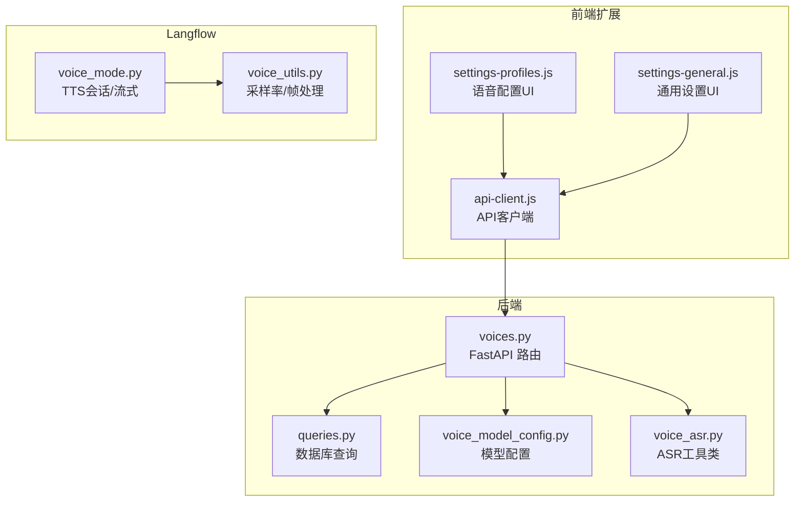
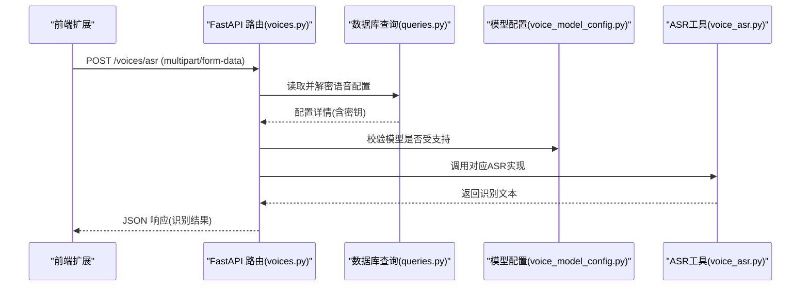
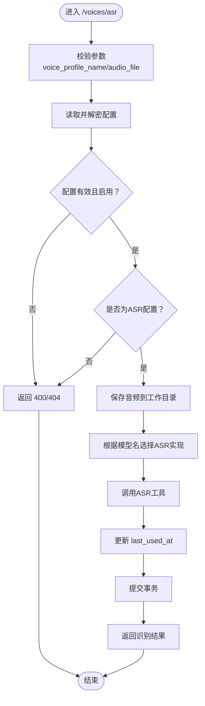
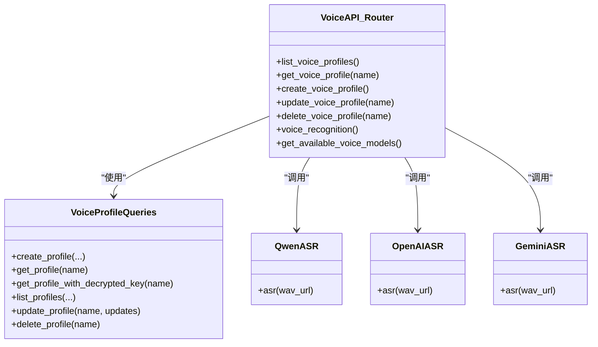

# 语音API

<cite>
**本文引用的文件**
- [voices.py](file://vibe_surf/backend/api/voices.py)
- [voice_model_config.py](file://vibe_surf/backend/voice_model_config.py)
- [voice_asr.py](file://vibe_surf/tools/voice_asr.py)
- [queries.py](file://vibe_surf/backend/database/queries.py)
- [v004_add_voice_profiles.sql](file://vibe_surf/backend/database/migrations/v004_add_voice_profiles.sql)
- [test_voice_api.py](file://tests/test_voice_api.py)
- [api-client.js](file://vibe_surf/chrome_extension/scripts/api-client.js)
- [settings-profiles.js](file://vibe_surf/chrome_extension/scripts/settings-profiles.js)
- [settings-general.js](file://vibe_surf/chrome_extension/scripts/settings-general.js)
- [voice_utils.py](file://vibe_surf/langflow/utils/voice_utils.py)
- [voice_mode.py](file://vibe_surf/langflow/api/v1/voice_mode.py)
</cite>

## 目录
1. [简介](#简介)
2. [项目结构](#项目结构)
3. [核心组件](#核心组件)
4. [架构总览](#架构总览)
5. [详细组件分析](#详细组件分析)
6. [依赖关系分析](#依赖关系分析)
7. [性能与并发特性](#性能与并发特性)
8. [故障排查指南](#故障排查指南)
9. [结论](#结论)
10. [附录：端点与数据模型](#附录端点与数据模型)

## 简介
本文件为 VibeSurf 语音API的权威技术文档，覆盖以下内容：
- 已实现的端点：GET /voices/voice-profiles、POST /voices/voice-profiles、PUT /voices/voice-profiles/{name}、DELETE /voices/voice-profiles/{name}、GET /voices/{name}、GET /voices/models、POST /voices/asr
- 语音配置文件模型与字段：名称、类型（ASR/TTS）、模型名、元参数、描述、状态等
- 语音识别后端集成：支持 Qwen、OpenAI Whisper、Gemini 的ASR模型
- 编解码器与采样率：本地音频文件处理与采样率转换工具
- 流式与实时交互：前端与Langflow侧的实时音频处理能力
- 错误处理与示例：服务不可用、音频格式不支持、鉴权失败等
- 实际示例：如何通过API完成语音输入输出流程

## 项目结构
语音API位于后端FastAPI路由中，并与数据库查询层、语音工具层以及前端扩展脚本协同工作。

图表来源
- [voices.py](file://vibe_surf/backend/api/voices.py#L1-L120)
- [queries.py](file://vibe_surf/backend/database/queries.py#L934-L1099)
- [voice_model_config.py](file://vibe_surf/backend/voice_model_config.py#L1-L25)
- [voice_asr.py](file://vibe_surf/tools/voice_asr.py#L1-L125)
- [api-client.js](file://vibe_surf/chrome_extension/scripts/api-client.js#L402-L443)
- [settings-profiles.js](file://vibe_surf/chrome_extension/scripts/settings-profiles.js#L130-L330)
- [settings-general.js](file://vibe_surf/chrome_extension/scripts/settings-general.js#L62-L93)
- [voice_mode.py](file://vibe_surf/langflow/api/v1/voice_mode.py#L208-L1305)
- [voice_utils.py](file://vibe_surf/langflow/utils/voice_utils.py#L1-L93)

章节来源
- [voices.py](file://vibe_surf/backend/api/voices.py#L1-L120)
- [voice_model_config.py](file://vibe_surf/backend/voice_model_config.py#L1-L25)

## 核心组件
- FastAPI 路由模块：提供语音配置文件管理与语音识别接口
- 数据库查询层：封装对 voice_profiles 表的增删改查、加密存储与解密读取
- 语音工具层：封装 Qwen、OpenAI Whisper、Gemini 的ASR调用
- 前端扩展：提供语音配置文件的增删改查与模型列表拉取
- Langflow：提供TTS会话、实时音频流与采样率转换工具

章节来源
- [voices.py](file://vibe_surf/backend/api/voices.py#L1-L120)
- [queries.py](file://vibe_surf/backend/database/queries.py#L934-L1099)
- [voice_asr.py](file://vibe_surf/tools/voice_asr.py#L1-L125)
- [api-client.js](file://vibe_surf/chrome_extension/scripts/api-client.js#L402-L443)

## 架构总览
语音API的请求-响应流程如下：

图表来源
- [voices.py](file://vibe_surf/backend/api/voices.py#L224-L373)
- [queries.py](file://vibe_surf/backend/database/queries.py#L1001-L1028)
- [voice_model_config.py](file://vibe_surf/backend/voice_model_config.py#L1-L25)
- [voice_asr.py](file://vibe_surf/tools/voice_asr.py#L1-L125)

## 详细组件分析

### 语音配置文件模型与字段
- 字段定义
  - profile_id：主键
  - voice_profile_name：唯一标识
  - voice_model_type：枚举值 asr 或 tts
  - voice_model_name：具体模型名（如 qwen-asr/openai-asr/gemini-asr）
  - encrypted_api_key：加密后的第三方API密钥
  - voice_meta_params：模型元参数（JSON），用于传递模型特定配置
  - description：描述
  - is_active：启用状态
  - created_at/updated_at/last_used_at：时间戳

- 关键约束
  - voice_model_type 仅允许 asr/tts
  - voice_profile_name 唯一
  - 提供自动更新 updated_at 的触发器

- 典型用途
  - 存储不同提供商的ASR/TTS配置
  - 通过 voice_meta_params 传入语言、采样率等参数
  - 通过 is_active 控制启用/禁用

章节来源
- [v004_add_voice_profiles.sql](file://vibe_surf/backend/database/migrations/v004_add_voice_profiles.sql#L1-L35)
- [queries.py](file://vibe_surf/backend/database/queries.py#L934-L1099)

### 语音识别端点：POST /voices/asr
- 请求
  - 方法：POST
  - 路径：/voices/asr
  - 内容类型：multipart/form-data
  - 参数：
    - audio_file：必填，音频文件（需有文件名）
    - voice_profile_name：必填，目标语音配置文件名称
- 处理流程
  - 校验参数与配置有效性
  - 从数据库读取并解密API密钥
  - 根据 voice_model_name 选择对应ASR实现
  - 将上传的音频保存到工作目录下的 audios 文件夹
  - 调用ASR工具返回识别文本
  - 更新配置 last_used_at 并提交事务
- 响应
  - 成功时返回识别文本、文件名、保存路径等
  - 失败时抛出HTTP异常（400/404/500）

图表来源
- [voices.py](file://vibe_surf/backend/api/voices.py#L224-L373)

章节来源
- [voices.py](file://vibe_surf/backend/api/voices.py#L224-L373)

### 语音配置文件管理端点
- GET /voices/voice-profiles
  - 查询参数：voice_model_type、active_only、limit、offset
  - 返回：配置列表与总数
- GET /voices/{name}
  - 获取指定配置（不含密钥）
- POST /voices/voice-profiles
  - 创建新配置，校验 voice_model_type 为 asr/tts，检查名称唯一性
- PUT /voices/voice-profiles/{name}
  - 更新配置，支持部分字段更新；若提供 api_key 则加密存储
- DELETE /voices/voice-profiles/{name}
  - 删除配置

章节来源
- [voices.py](file://vibe_surf/backend/api/voices.py#L49-L222)
- [queries.py](file://vibe_surf/backend/database/queries.py#L934-L1099)

### 模型清单端点：GET /voices/models
- 返回所有可用语音模型及其类型与是否需要API密钥
- 前端扩展通过该端点筛选ASR/TTS模型

章节来源
- [voices.py](file://vibe_surf/backend/api/voices.py#L424-L445)
- [voice_model_config.py](file://vibe_surf/backend/voice_model_config.py#L1-L25)

### 语音工具层：ASR实现
- QwenASR
  - 使用 DashScope 多模态ASR
  - 支持本地文件路径或file://协议URL
- OpenAIASR
  - 使用 OpenAI Whisper
  - 仅支持本地文件（file://或绝对路径）
- GeminiASR
  - 使用 Google GenAI
  - 仅支持本地文件
- 共同行为
  - 异常时记录警告并返回空字符串
  - 通过 voice_meta_params 传递模型参数（如语言、采样率等）

章节来源
- [voice_asr.py](file://vibe_surf/tools/voice_asr.py#L1-L125)

### 前端集成与配置管理
- API客户端封装了语音配置文件的增删改查与模型列表拉取
- 设置页面根据模型类型动态渲染ASR/TTS配置表单
- 通用设置页面将ASR/TTS配置分别填充到下拉框

章节来源
- [api-client.js](file://vibe_surf/chrome_extension/scripts/api-client.js#L402-L443)
- [settings-profiles.js](file://vibe_surf/chrome_extension/scripts/settings-profiles.js#L130-L330)
- [settings-general.js](file://vibe_surf/chrome_extension/scripts/settings-general.js#L62-L93)

### Langflow侧的TTS与实时音频
- TTS会话配置与客户端初始化
- 支持ElevenLabs与OpenAI TTS
- 流式音频输出（pcm/pcm_24000），并进行采样率转换
- 采样率转换工具：将24kHz帧按比例重采样至16kHz

章节来源
- [voice_mode.py](file://vibe_surf/langflow/api/v1/voice_mode.py#L208-L1305)
- [voice_utils.py](file://vibe_surf/langflow/utils/voice_utils.py#L1-L93)

## 依赖关系分析

图表来源
- [voices.py](file://vibe_surf/backend/api/voices.py#L1-L120)
- [queries.py](file://vibe_surf/backend/database/queries.py#L934-L1099)
- [voice_asr.py](file://vibe_surf/tools/voice_asr.py#L1-L125)

章节来源
- [voices.py](file://vibe_surf/backend/api/voices.py#L1-L120)
- [queries.py](file://vibe_surf/backend/database/queries.py#L934-L1099)
- [voice_asr.py](file://vibe_surf/tools/voice_asr.py#L1-L125)

## 性能与并发特性
- 并发与异步
  - 后端使用异步数据库会话与异步I/O，适合高并发场景
- I/O优化
  - 上传音频直接写入磁盘，避免内存峰值
  - 识别完成后可清理临时文件（在错误分支中已考虑）
- 采样率转换
  - 使用NumPy与scipy.signal.resample进行高效重采样
- 流式输出
  - Langflow侧支持流式音频输出，前端可边接收边播放

章节来源
- [voices.py](file://vibe_surf/backend/api/voices.py#L224-L373)
- [voice_utils.py](file://vibe_surf/langflow/utils/voice_utils.py#L1-L93)

## 故障排查指南
- 常见错误与定位
  - 400 语音配置不存在或未启用：检查 voice_profile_name 是否存在且 is_active 为真
  - 400 语音模型不受支持：确认 voice_model_name 在模型配置中存在
  - 400 仅支持本地文件：OpenAI/Gemini ASR 仅支持本地文件路径
  - 500 语音识别失败：检查第三方API密钥、网络连通性与日志
- 日志与调试
  - 后端记录请求参数与识别结果，便于定位问题
  - 前端扩展在加载/保存配置时打印错误信息
- 示例测试
  - 单元测试展示了各ASR工具的基本调用方式与期望输出

章节来源
- [voices.py](file://vibe_surf/backend/api/voices.py#L224-L373)
- [test_voice_api.py](file://tests/test_voice_api.py#L1-L45)

## 结论
VibeSurf语音API提供了完善的语音配置文件管理与语音识别能力，支持多家ASR提供商，并与前端扩展、Langflow侧的TTS与实时音频处理形成完整链路。通过统一的模型配置与加密存储机制，系统在安全性与易用性之间取得平衡。建议在生产环境中：
- 明确 voice_meta_params 的可用参数，确保与所选模型匹配
- 对上传音频进行格式与大小限制，避免资源滥用
- 在网关或中间件层增加限流策略，防止突发流量冲击
- 完善监控与告警，关注第三方API的可用性与延迟

## 附录：端点与数据模型

### 端点一览
- GET /voices/voice-profiles
  - 查询参数：voice_model_type、active_only、limit、offset
  - 返回：配置列表与总数
- GET /voices/{name}
  - 返回：指定配置（不含密钥）
- POST /voices/voice-profiles
  - 请求体：包含 voice_profile_name、voice_model_type、voice_model_name、api_key、voice_meta_params、description
  - 返回：创建成功信息与配置详情
- PUT /voices/voice-profiles/{name}
  - 请求体：可选字段（voice_model_type、voice_model_name、api_key、voice_meta_params、description、is_active）
  - 返回：更新成功信息与最新配置
- DELETE /voices/voice-profiles/{name}
  - 返回：删除成功信息
- GET /voices/models
  - 查询参数：model_type（可选）
  - 返回：模型清单（含是否需要API密钥）
- POST /voices/asr
  - 请求体：multipart/form-data，包含 audio_file 与 voice_profile_name
  - 返回：识别文本、文件名、保存路径等

章节来源
- [voices.py](file://vibe_surf/backend/api/voices.py#L49-L481)

### 语音配置文件字段说明
- profile_id：字符串，主键
- voice_profile_name：字符串，唯一
- voice_model_type：字符串，枚举 asr/tts
- voice_model_name：字符串，模型名
- api_key：字符串（可选），加密存储
- voice_meta_params：对象（可选），模型参数（如语言、采样率等）
- description：字符串（可选）
- is_active：布尔值，默认true
- created_at/updated_at/last_used_at：时间戳

章节来源
- [v004_add_voice_profiles.sql](file://vibe_surf/backend/database/migrations/v004_add_voice_profiles.sql#L1-L35)
- [queries.py](file://vibe_surf/backend/database/queries.py#L934-L1099)

### 支持的ASR模型与参数
- qwen-asr
  - 来源：DashScope
  - 是否需要API密钥：是
  - 可通过 voice_meta_params 传入模型名等参数
- openai-asr
  - 来源：OpenAI Whisper
  - 是否需要API密钥：是
  - 支持自定义 base_url（通过 voice_meta_params）
  - 仅支持本地文件
- gemini-asr
  - 来源：Google GenAI
  - 是否需要API密钥：是
  - 仅支持本地文件

章节来源
- [voice_model_config.py](file://vibe_surf/backend/voice_model_config.py#L1-L25)
- [voice_asr.py](file://vibe_surf/tools/voice_asr.py#L1-L125)

### 编解码器与采样率
- 输入音频：后端接受任意常见音频格式，但ASR工具仅支持本地文件
- 采样率转换：Langflow侧提供将24kHz帧重采样至16kHz的工具，适用于实时VAD与传输
- 输出音频：Langflow侧支持pcm与pcm_24000两种格式，便于流式传输

章节来源
- [voice_asr.py](file://vibe_surf/tools/voice_asr.py#L1-L125)
- [voice_utils.py](file://vibe_surf/langflow/utils/voice_utils.py#L1-L93)

### 实际示例：通过API实现语音输入输出
- 步骤
  1) 创建ASR语音配置文件
     - 使用 POST /voices/voice-profiles，填写 voice_profile_name、voice_model_type=asr、voice_model_name（如 qwen-asr/openai-asr/gemini-asr）、api_key、voice_meta_params（如语言、采样率）
  2) 上传音频并识别
     - 使用 POST /voices/asr，multipart/form-data，包含 audio_file 与 voice_profile_name
  3) 查看识别结果
     - 返回的 JSON 中包含 recognized_text、filename、saved_audio_path 等字段
- 前端辅助
  - 使用前端扩展的 API 客户端进行配置文件的增删改查与模型列表拉取
  - 设置页面根据模型类型动态渲染表单，便于用户配置

章节来源
- [voices.py](file://vibe_surf/backend/api/voices.py#L49-L481)
- [api-client.js](file://vibe_surf/chrome_extension/scripts/api-client.js#L402-L443)
- [settings-profiles.js](file://vibe_surf/chrome_extension/scripts/settings-profiles.js#L130-L330)