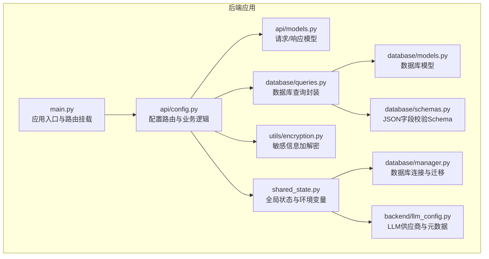
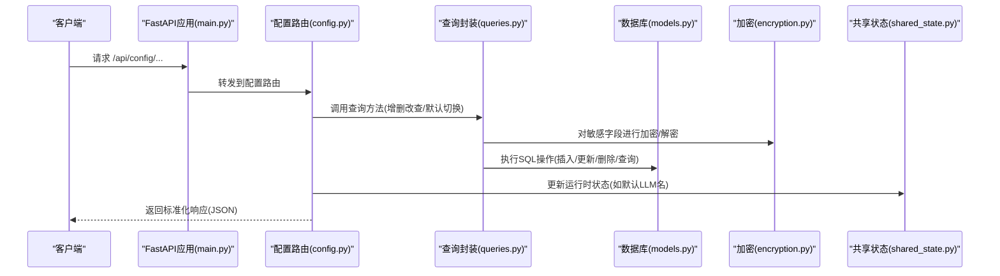
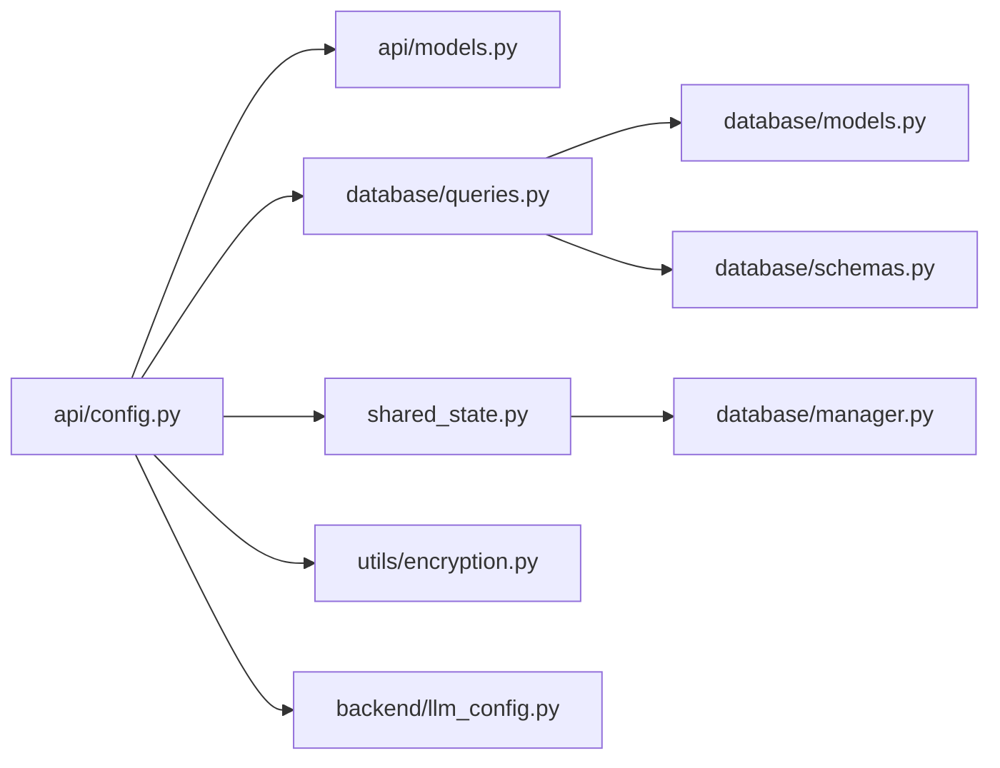

# 配置API

<cite>
**本文引用的文件**
- [main.py](file://vibe_surf/backend/main.py)
- [config.py](file://vibe_surf/backend/api/config.py)
- [models.py](file://vibe_surf/backend/api/models.py)
- [llm_config.py](file://vibe_surf/backend/llm_config.py)
- [encryption.py](file://vibe_surf/backend/utils/encryption.py)
- [shared_state.py](file://vibe_surf/backend/shared_state.py)
- [queries.py](file://vibe_surf/backend/database/queries.py)
- [models.py（数据库）](file://vibe_surf/backend/database/models.py)
- [schemas.py](file://vibe_surf/backend/database/schemas.py)
- [manager.py](file://vibe_surf/backend/database/manager.py)
</cite>

## 目录
1. [简介](#简介)
2. [项目结构](#项目结构)
3. [核心组件](#核心组件)
4. [架构总览](#架构总览)
5. [详细组件分析](#详细组件分析)
6. [依赖关系分析](#依赖关系分析)
7. [性能与可扩展性](#性能与可扩展性)
8. [故障排查指南](#故障排查指南)
9. [结论](#结论)
10. [附录：端点与数据模型参考](#附录端点与数据模型参考)

## 简介
本文件为 VibeSurf 后端“配置API”的权威技术文档，覆盖以下内容：
- 全部配置相关端点：LLM配置档案、MCP配置档案、可用LLM供应商与模型、配置状态、环境变量管理等
- 配置项结构：LLM提供商设置、浏览器选项、代理默认值、系统参数
- 验证规则、默认值继承、环境变量覆盖机制
- 安全考虑：敏感信息加密存储、访问控制建议
- 错误处理示例：无效配置值、权限不足、数据库约束冲突
- 实际使用示例：通过API动态调整系统行为（切换默认LLM、启用/禁用MCP服务器、更新代理）

## 项目结构
配置API位于后端模块的路由层，围绕 FastAPI 路由器组织，配合数据库查询层、共享状态与工具模块完成配置读取、写入与生效。

图表来源
- [main.py](file://vibe_surf/backend/main.py#L544-L648)
- [config.py](file://vibe_surf/backend/api/config.py#L1-L120)
- [models.py](file://vibe_surf/backend/api/models.py#L1-L120)
- [shared_state.py](file://vibe_surf/backend/shared_state.py#L453-L712)
- [encryption.py](file://vibe_surf/backend/utils/encryption.py#L65-L127)
- [queries.py](file://vibe_surf/backend/database/queries.py#L21-L120)
- [models.py（数据库）](file://vibe_surf/backend/database/models.py#L57-L117)
- [schemas.py](file://vibe_surf/backend/database/schemas.py#L32-L82)
- [manager.py](file://vibe_surf/backend/database/manager.py#L148-L240)
- [llm_config.py](file://vibe_surf/backend/llm_config.py#L202-L226)

章节来源
- [main.py](file://vibe_surf/backend/main.py#L544-L648)
- [config.py](file://vibe_surf/backend/api/config.py#L1-L120)

## 核心组件
- 配置路由路由器：集中定义配置相关端点，负责参数解析、调用查询层、返回标准化响应
- 数据库查询封装：统一LLM/MCP配置的增删改查、默认配置切换、时间戳更新
- 加密工具：对敏感字段（如API Key）进行机密性保护
- 共享状态：维护运行时组件、环境变量字典、默认LLM配置名等
- LLM配置元数据：提供支持的供应商、模型列表、特性开关与默认值
- JSON Schema：对任务中嵌套的配置JSON字段进行结构化校验与归一化

章节来源
- [config.py](file://vibe_surf/backend/api/config.py#L77-L120)
- [queries.py](file://vibe_surf/backend/database/queries.py#L21-L120)
- [encryption.py](file://vibe_surf/backend/utils/encryption.py#L65-L127)
- [shared_state.py](file://vibe_surf/backend/shared_state.py#L453-L712)
- [llm_config.py](file://vibe_surf/backend/llm_config.py#L202-L226)
- [schemas.py](file://vibe_surf/backend/database/schemas.py#L32-L82)

## 架构总览
配置API采用“路由层-查询层-模型层-工具层”的分层设计，结合共享状态与数据库，实现配置的持久化、校验与运行时生效。

图表来源
- [main.py](file://vibe_surf/backend/main.py#L580-L648)
- [config.py](file://vibe_surf/backend/api/config.py#L77-L120)
- [queries.py](file://vibe_surf/backend/database/queries.py#L21-L120)
- [models.py（数据库）](file://vibe_surf/backend/database/models.py#L57-L117)
- [encryption.py](file://vibe_surf/backend/utils/encryption.py#L65-L127)
- [shared_state.py](file://vibe_surf/backend/shared_state.py#L453-L712)

## 详细组件分析

### 1) LLM 配置档案
- 创建档案：POST /api/config/llm-profiles
- 列表查看：GET /api/config/llm-profiles
- 获取详情：GET /api/config/llm-profiles/{profile_name}
- 更新档案：PUT /api/config/llm-profiles/{profile_name}
- 删除档案：DELETE /api/config/llm-profiles/{profile_name}
- 设置默认：POST /api/config/llm-profiles/{profile_name}/set-default
- 获取默认：GET /api/config/llm-profiles/default/current
- 可用供应商：GET /api/config/llm/providers
- 指定供应商模型：GET /api/config/llm/providers/{provider_name}/models

关键行为与验证
- 名称唯一性：创建时检查同名冲突，返回400
- 默认切换：更新is_default或调用set-default会原子地取消其他默认
- API Key加密：写入时加密；读取带密钥的详情时解密
- 参数校验：Pydantic模型限制数值范围、必填字段、JSON字段类型
- 运行时生效：更新默认LLM后，共享状态中的当前默认名会被刷新

章节来源
- [config.py](file://vibe_surf/backend/api/config.py#L77-L367)
- [queries.py](file://vibe_surf/backend/database/queries.py#L21-L120)
- [models.py（数据库）](file://vibe_surf/backend/database/models.py#L57-L117)
- [encryption.py](file://vibe_surf/backend/utils/encryption.py#L65-L127)
- [shared_state.py](file://vibe_surf/backend/shared_state.py#L644-L682)
- [llm_config.py](file://vibe_surf/backend/llm_config.py#L202-L226)

### 2) MCP 配置档案
- 创建档案：POST /api/config/mcp-profiles
- 列表查看：GET /api/config/mcp-profiles
- 获取详情：GET /api/config/mcp-profiles/{mcp_id}
- 更新档案：PUT /api/config/mcp-profiles/{mcp_id}
- 删除档案：DELETE /api/config/mcp-profiles/{mcp_id}

关键行为
- 显示名称唯一性：创建时检查显示名冲突
- MCP服务器参数：以JSON对象形式存储，包含命令、参数、工作目录、超时等
- 运行时联动：共享状态维护活动MCP服务器映射，变更后会触发工具注册更新

章节来源
- [config.py](file://vibe_surf/backend/api/config.py#L368-L584)
- [queries.py](file://vibe_surf/backend/database/queries.py#L266-L439)
- [models.py（数据库）](file://vibe_surf/backend/database/models.py#L168-L191)
- [shared_state.py](file://vibe_surf/backend/shared_state.py#L255-L351)

### 3) 配置状态与环境变量
- 配置状态：GET /api/config/status
- 环境变量：GET /api/config/environments
- 更新环境变量：PUT /api/config/environments

关键行为
- 状态聚合：统计LLM档案总数、活跃数、默认档案、工具/浏览器/代理初始化状态
- 环境变量：从共享状态envs字典读取；同时注入HTTP/HTTPS/no_proxy
- 更新策略：允许传入键值对，仅接受共享状态已知的键；更新后保存到envs.json

章节来源
- [config.py](file://vibe_surf/backend/api/config.py#L645-L762)
- [shared_state.py](file://vibe_surf/backend/shared_state.py#L684-L712)
- [manager.py](file://vibe_surf/backend/database/manager.py#L148-L240)

### 4) 配置项结构与默认值继承

- LLM档案字段
  - 基本信息：provider、model、base_url、description
  - 推理参数：temperature、max_tokens、top_p、frequency_penalty、seed
  - 提供商特定配置：provider_config（JSON）
  - 标记位：is_active、is_default
  - 时间戳：created_at、updated_at、last_used_at
  - 敏感字段：api_key在数据库中加密存储

- MCP档案字段
  - 显示名、服务器标识、服务器参数（JSON），含命令、参数、工作目录、超时等
  - 标记位：is_active
  - 时间戳：同上

- 供应商与模型
  - 供应商清单、模型清单、元数据（是否需要API Key、是否需要base_url、默认模型、默认base_url等）
  - 通过接口动态获取，便于前端渲染与选择

- 默认值继承
  - 初始化LLM实例时优先使用数据库默认档案；若无则回退到环境变量（模型、端点、API Key）
  - 更新默认LLM档案后，运行时组件会重新创建LLM实例并注册到成本服务

- 环境变量覆盖
  - 启动时加载envs.json到共享状态envs字典，并同步设置系统环境变量
  - 更新环境变量接口仅接受已知键，更新后写回envs.json

章节来源
- [models.py（数据库）](file://vibe_surf/backend/database/models.py#L57-L117)
- [models.py（数据库）](file://vibe_surf/backend/database/models.py#L168-L191)
- [llm_config.py](file://vibe_surf/backend/llm_config.py#L202-L226)
- [shared_state.py](file://vibe_surf/backend/shared_state.py#L453-L712)
- [config.py](file://vibe_surf/backend/api/config.py#L645-L762)

### 5) 安全考虑
- 敏感信息加密存储
  - API Key在入库前加密，出库时解密用于运行时调用
  - 加密密钥基于机器MAC地址或本地用户ID派生，确保同一设备内一致且跨会话稳定
- 访问控制建议
  - 当前路由未内置鉴权中间件，建议在网关或反向代理层添加认证/授权
  - 对敏感端点（如更新环境变量、删除默认LLM）建议增加最小权限校验
- 数据传输
  - 建议在生产环境启用TLS终止于反向代理
- 日志与审计
  - 对敏感字段（如API Key）避免在日志中输出明文
  - 可记录配置变更事件，但不包含明文敏感信息

章节来源
- [encryption.py](file://vibe_surf/backend/utils/encryption.py#L65-L127)
- [queries.py](file://vibe_surf/backend/database/queries.py#L110-L140)
- [main.py](file://vibe_surf/backend/main.py#L566-L576)

### 6) 错误处理示例
- 无效配置值
  - 数值越界（如temperature不在[0,2]）：返回422，包含字段与范围提示
  - 缺少必填字段（如provider/model为空）：返回422
- 权限不足
  - 当前路由未内置鉴权，建议在上游网关层拦截未授权请求
- 数据库约束冲突
  - 同名LLM档案：返回400，提示名称已存在
  - 删除默认LLM：返回400，提示不可删除默认档案
- 运行时异常
  - 数据库查询失败：返回500，包含错误摘要
  - 解密失败：抛出值错误，返回500

章节来源
- [config.py](file://vibe_surf/backend/api/config.py#L120-L299)
- [models.py](file://vibe_surf/backend/api/models.py#L14-L45)
- [encryption.py](file://vibe_surf/backend/utils/encryption.py#L118-L127)

### 7) 实际使用示例（动态调整系统行为）
- 动态切换默认LLM
  - 步骤：创建新LLM档案 -> 将is_default设为true -> 调用设置默认端点 -> 观察运行时LLM实例被替换
  - 影响：后续任务与代理执行将使用新的LLM配置
- 启用/禁用MCP服务器
  - 步骤：创建MCP档案 -> 将is_active设为true -> 触发共享状态更新 -> 工具注册MCP客户端
  - 影响：Langflow MCP Composer服务按新配置启动对应服务器
- 更新代理与网络环境
  - 步骤：PUT /api/config/environments，传入HTTP_PROXY/HTTPS_PROXY/no_proxy等键值
  - 影响：envs.json更新，系统环境变量同步，后续网络请求遵循新代理设置

章节来源
- [config.py](file://vibe_surf/backend/api/config.py#L301-L367)
- [config.py](file://vibe_surf/backend/api/config.py#L691-L762)
- [shared_state.py](file://vibe_surf/backend/shared_state.py#L255-L351)
- [shared_state.py](file://vibe_surf/backend/shared_state.py#L684-L712)

## 依赖关系分析

图表来源
- [config.py](file://vibe_surf/backend/api/config.py#L1-L120)
- [models.py](file://vibe_surf/backend/api/models.py#L1-L120)
- [queries.py](file://vibe_surf/backend/database/queries.py#L21-L120)
- [shared_state.py](file://vibe_surf/backend/shared_state.py#L453-L712)
- [encryption.py](file://vibe_surf/backend/utils/encryption.py#L65-L127)
- [llm_config.py](file://vibe_surf/backend/llm_config.py#L202-L226)
- [models.py（数据库）](file://vibe_surf/backend/database/models.py#L57-L117)
- [schemas.py](file://vibe_surf/backend/database/schemas.py#L32-L82)
- [manager.py](file://vibe_surf/backend/database/manager.py#L148-L240)

## 性能与可扩展性
- 查询优化
  - 使用索引加速常用过滤（如LLMProfiles的is_active/is_default/provider）
  - 分页参数（limit/offset）避免一次性返回大量记录
- 连接池
  - 异步引擎与会话工厂，SQLite使用静态池，其他数据库使用预热连接池
- 迁移与版本
  - SQLite数据库支持迁移脚本，自动升级表结构
- 并发与异步
  - 全面使用async/await，避免阻塞I/O影响吞吐

章节来源
- [models.py（数据库）](file://vibe_surf/backend/database/models.py#L158-L167)
- [manager.py](file://vibe_surf/backend/database/manager.py#L148-L240)

## 故障排查指南
- 无法设置默认LLM
  - 检查目标档案是否is_active=true；否则返回400
  - 确认数据库中不存在多个默认档案（原子更新会取消其他默认）
- API Key无效或解密失败
  - 确认加密密钥来源（MAC地址或本地用户ID）未被重置
  - 若更换设备，需重新录入API Key并保存
- MCP服务器未生效
  - 确认MCP档案is_active=true
  - 检查共享状态active_mcp_server映射是否更新
  - 查看工具注册日志，确认MCP客户端已注册
- 环境变量未生效
  - 确认PUT /api/config/environments传入的是已知键
  - 检查envs.json是否成功写入
  - 确认系统环境变量已被同步设置

章节来源
- [config.py](file://vibe_surf/backend/api/config.py#L301-L367)
- [config.py](file://vibe_surf/backend/api/config.py#L691-L762)
- [shared_state.py](file://vibe_surf/backend/shared_state.py#L255-L351)
- [encryption.py](file://vibe_surf/backend/utils/encryption.py#L118-L127)

## 结论
配置API提供了完整的LLM与MCP配置生命周期管理，结合加密存储、运行时状态与数据库迁移，实现了安全、可扩展且易于运维的配置体系。通过标准化的端点与模型，用户可以动态调整系统行为，满足不同场景下的推理与工具集成需求。

## 附录：端点与数据模型参考

### 端点一览
- LLM档案
  - POST /api/config/llm-profiles
  - GET /api/config/llm-profiles
  - GET /api/config/llm-profiles/{profile_name}
  - PUT /api/config/llm-profiles/{profile_name}
  - DELETE /api/config/llm-profiles/{profile_name}
  - POST /api/config/llm-profiles/{profile_name}/set-default
  - GET /api/config/llm-profiles/default/current
- MCP档案
  - POST /api/config/mcp-profiles
  - GET /api/config/mcp-profiles
  - GET /api/config/mcp-profiles/{mcp_id}
  - PUT /api/config/mcp-profiles/{mcp_id}
  - DELETE /api/config/mcp-profiles/{mcp_id}
- 供应商与模型
  - GET /api/config/llm/providers
  - GET /api/config/llm/providers/{provider_name}/models
- 配置状态与环境
  - GET /api/config/status
  - GET /api/config/environments
  - PUT /api/config/environments

章节来源
- [config.py](file://vibe_surf/backend/api/config.py#L77-L762)

### 数据模型要点
- LLMProfileCreateRequest/UpdateRequest/Response
  - 字段：profile_name、provider、model、base_url、temperature、max_tokens、top_p、frequency_penalty、seed、provider_config、description、is_default/is_active
  - 敏感字段：api_key入库加密
- McpProfileCreateRequest/UpdateRequest/Response
  - 字段：display_name、mcp_server_name、mcp_server_params、description、is_active
- LLMConfigResponse（简化）
  - 字段：provider、model、temperature、max_tokens、available_providers
- ControllerConfigRequest/Response（历史兼容）
  - 字段：exclude_actions、max_actions_per_task、display_files_in_done_text

章节来源
- [models.py](file://vibe_surf/backend/api/models.py#L14-L120)
- [models.py（数据库）](file://vibe_surf/backend/database/models.py#L57-L117)
- [models.py（数据库）](file://vibe_surf/backend/database/models.py#L168-L191)