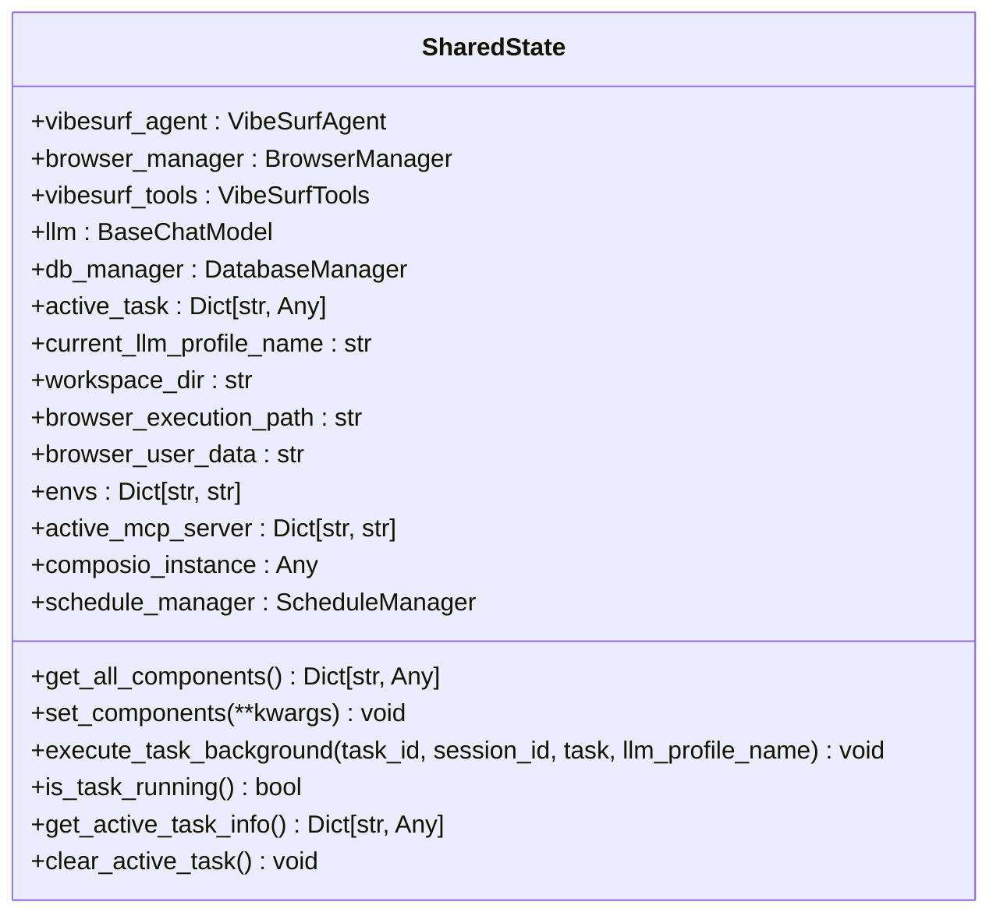
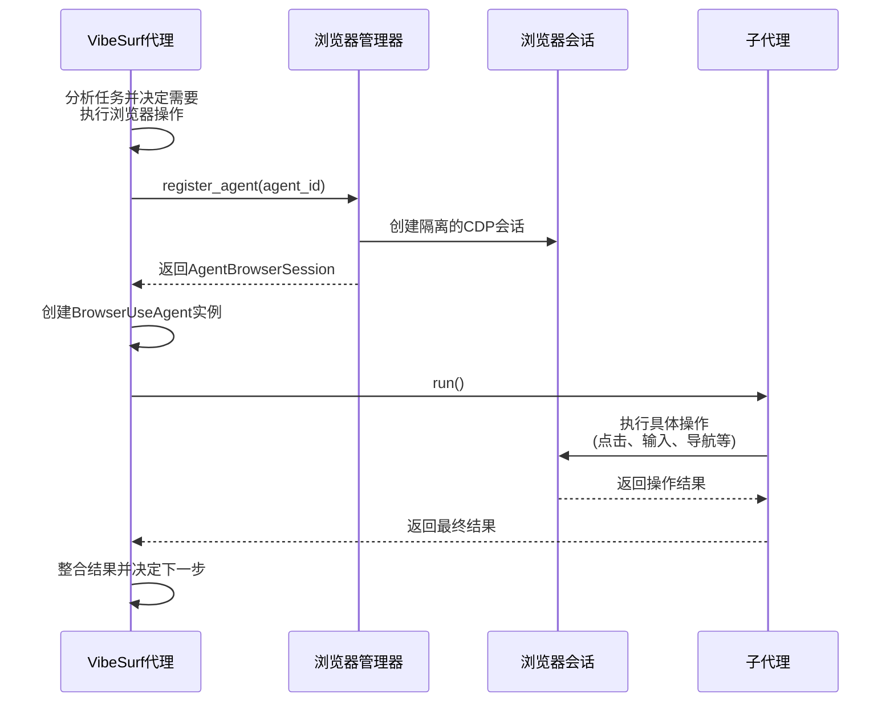
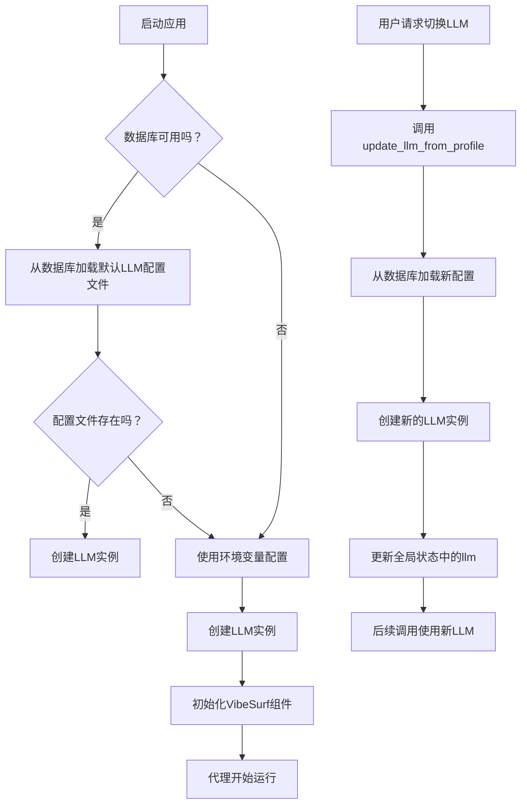
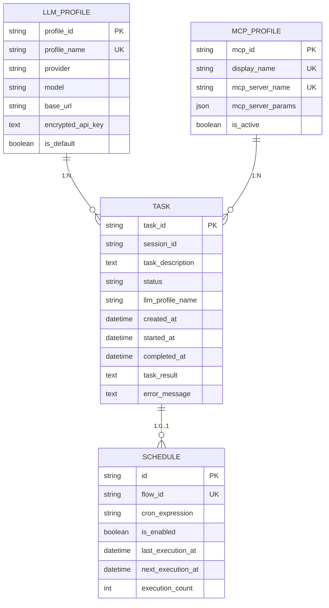

# 业务逻辑

<cite>
**本文档引用的文件**   
- [shared_state.py](file://vibe_surf/backend/shared_state.py)
- [workflow_converter.py](file://vibe_surf/backend/utils/workflow_converter.py)
- [main.py](file://vibe_surf/backend/main.py)
- [llm_config.py](file://vibe_surf/backend/llm_config.py)
- [vibe_surf_agent.py](file://vibe_surf/agents/vibe_surf_agent.py)
- [browser_manager.py](file://vibe_surf/browser/browser_manager.py)
- [vibesurf_tools.py](file://vibe_surf/tools/vibesurf_tools.py)
- [manager.py](file://vibe_surf/backend/database/manager.py)
- [task.py](file://vibe_surf/backend/api/task.py)
- [schedule.py](file://vibe_surf/backend/api/schedule.py)
- [models.py](file://vibe_surf/backend/database/models.py)
</cite>

## 目录
1. [全局状态管理机制](#全局状态管理机制)
2. [AI代理与浏览器管理协调](#ai代理与浏览器管理协调)
3. [LLM调用与配置](#llm调用与配置)
4. [工作流转换器](#工作流转换器)
5. [任务调度与执行](#任务调度与执行)
6. [业务逻辑层集成模式](#业务逻辑层集成模式)

## 全局状态管理机制

VibeSurf后端的全局状态管理通过`shared_state.py`模块实现，该模块定义了在`main.py`和各个API路由之间共享的全局状态变量，以避免循环导入问题。这种设计模式确保了核心组件在整个应用生命周期中的单一实例和状态一致性。

核心全局状态变量包括：
- `vibesurf_agent`: VibeSurf主代理实例
- `browser_manager`: 浏览器管理器实例
- `vibesurf_tools`: 工具集实例
- `llm`: 当前使用的语言模型实例
- `db_manager`: 数据库管理器实例
- `active_task`: 当前正在执行的任务信息
- `current_llm_profile_name`: 当前激活的LLM配置文件名称

状态管理通过`get_all_components()`和`set_components()`函数进行统一访问和更新，确保了状态变更的可控性和可追踪性。`execute_task_background()`函数作为后台任务执行的核心，利用这些全局状态来协调任务的执行、监控和结果保存。

**图源**
- [shared_state.py](file://vibe_surf/backend/shared_state.py#L37-L233)

**节源**
- [shared_state.py](file://vibe_surf/backend/shared_state.py#L1-L800)

## AI代理与浏览器管理协调

VibeSurf的业务逻辑层通过`vibe_surf_agent.py`中的`VibeSurfAgent`类协调AI代理、浏览器管理和任务执行。该代理采用基于LangGraph的状态机工作流，通过`VibeSurfState`数据类管理复杂的任务状态。

### 代理工作流

代理的工作流由多个LangGraph节点组成，形成一个闭环的决策-执行-反馈循环：
1.  **vibesurf_agent_node**: 主节点，负责分析当前状态并决定下一步行动。
2.  **browser_task_execution_node**: 负责执行由主代理分配的浏览器任务。
3.  **report_task_execution_node**: 负责生成报告。

主代理节点根据任务需求，可以路由到不同的执行节点。例如，当需要执行网页操作时，它会调用`execute_browser_use_agent`动作，将任务委派给`BrowserUseAgent`。

### 浏览器管理

`browser_manager.py`中的`BrowserManager`类负责管理多个代理共享的浏览器会话。它通过`AgentBrowserSession`为每个代理提供隔离的CDP（Chrome DevTools Protocol）会话，确保了多代理操作的安全性和隔离性。

关键功能包括：
- `register_agent()`: 为代理注册一个浏览器会话。
- `assign_target_to_agent()`: 将特定的浏览器标签页（tab）分配给代理。
- `get_activate_tab()`: 获取当前激活的标签页信息。

这种设计允许主代理在多个浏览器标签页之间协调操作，同时保持每个子代理的上下文独立。

**图源**
- [vibe_surf_agent.py](file://vibe_surf/agents/vibe_surf_agent.py#L344-L546)
- [browser_manager.py](file://vibe_surf/browser/browser_manager.py#L47-L72)

**节源**
- [vibe_surf_agent.py](file://vibe_surf/agents/vibe_surf_agent.py#L1-L800)
- [browser_manager.py](file://vibe_surf/browser/browser_manager.py#L1-L269)

## LLM调用与配置

LLM的调用和配置是VibeSurf业务逻辑的核心。系统通过`llm_config.py`和`shared_state.py`中的`_initialize_default_llm()`函数进行管理。

### LLM配置

`llm_config.py`模块定义了所有支持的LLM提供商及其模型。它提供了`get_supported_providers()`、`get_provider_models()`等函数，为前端提供动态配置选项。

### LLM初始化与切换

LLM的初始化在`shared_state.py`的`initialize_vibesurf_components()`函数中完成。系统首先尝试从数据库加载默认的LLM配置文件，如果失败则回退到环境变量配置。

LLM的动态切换通过`update_llm_from_profile()`函数实现。当用户在运行时更改LLM配置文件时，该函数会从数据库加载新的配置，创建新的LLM实例，并更新全局状态，确保后续的调用使用新的模型。

**图源**
- [llm_config.py](file://vibe_surf/backend/llm_config.py#L8-L226)
- [shared_state.py](file://vibe_surf/backend/shared_state.py#L604-L682)

**节源**
- [llm_config.py](file://vibe_surf/backend/llm_config.py#L1-L226)
- [shared_state.py](file://vibe_surf/backend/shared_state.py#L453-L682)

## 工作流转换器

`workflow_converter.py`模块负责将用户录制的浏览器操作工作流转换为Langflow兼容的JSON格式，并将其保存到数据库中。

### 转换流程

1.  **构建工作流图**: `build_workflow_graph()`函数解析原始工作流数据，创建一个`Graph`对象，并按顺序添加组件（如`BrowserSessionComponent`、`BrowserNavigateComponent`等）和连接。
2.  **生成Langflow格式**: `convert_raw_workflow_to_langflow()`函数调用`build_workflow_graph()`，然后对生成的图进行准备和转储。
3.  **格式化边**: `generate_langflow_edges()`函数将边的句柄对象转换为Langflow所需的特殊字符串格式（使用`œ`代替引号）。
4.  **布局算法**: `calculate_langflow_style_layout()`函数实现了一个层次化布局算法，使用NetworkX库对节点进行拓扑排序、减少交叉边，并计算最终的坐标位置，使工作流在Langflow界面上美观地展示。
5.  **保存到数据库**: `save_workflow_to_db()`函数将转换后的工作流JSON保存到数据库，并与Langflow的数据库服务集成。

这个转换器是连接用户录制操作和可编程工作流的关键桥梁。

```mermaid
flowchart LR
A[原始工作流JSON] --> B[build_workflow_graph]
B --> C[Graph对象]
C --> D[convert_raw_workflow_to_langflow]
D --> E[Langflow兼容的JSON]
E --> F[generate_langflow_edges]
F --> G[格式化边]
G --> H[calculate_langflow_style_layout]
H --> I[应用布局]
I --> J[save_workflow_to_db]
J --> K[保存到数据库]
```

**图源**
- [workflow_converter.py](file://vibe_surf/backend/utils/workflow_converter.py#L30-L126)
- [workflow_converter.py](file://vibe_surf/backend/utils/workflow_converter.py#L173-L220)
- [workflow_converter.py](file://vibe_surf/backend/utils/workflow_converter.py#L238-L284)

**节源**
- [workflow_converter.py](file://vibe_surf/backend/utils/workflow_converter.py#L1-L570)

## 任务调度与执行

任务的调度与执行由API路由、全局状态和数据库共同管理。

### 任务执行

`task.py`中的API路由处理任务的提交、控制和状态查询。
- `submit_task()`: 接收任务请求，检查是否有任务正在运行，初始化LLM连接，创建数据库记录，并通过`BackgroundTasks`异步调用`execute_task_background()`。
- `pause_task()`, `resume_task()`, `stop_task()`: 这些路由通过调用`VibeSurfAgent`的相应方法来控制任务的执行状态，并更新`shared_state.active_task`中的状态。

### 任务调度

`schedule.py`模块提供了对工作流调度的CRUD（创建、读取、更新、删除）操作。`ScheduleManager`类（定义在`shared_state.py`中）负责管理这些调度。
- `start()`: 启动一个后台循环，定期检查是否有调度任务需要执行。
- `reload_schedules()`: 从数据库加载所有启用的调度，使用`croniter`库计算下一次执行时间。
- `_schedule_loop()`: 核心循环，检查当前时间是否匹配任何调度的`next_execution_at`，如果匹配则触发执行。

这种设计实现了基于cron表达式的自动化工作流执行。

**图源**
- [task.py](file://vibe_surf/backend/api/task.py#L43-L146)
- [schedule.py](file://vibe_surf/backend/api/schedule.py#L108-L148)
- [models.py](file://vibe_surf/backend/database/models.py#L94-L288)

**节源**
- [task.py](file://vibe_surf/backend/api/task.py#L1-L379)
- [schedule.py](file://vibe_surf/backend/api/schedule.py#L1-L331)
- [models.py](file://vibe_surf/backend/database/models.py#L1-L289)

## 业务逻辑层集成模式

VibeSurf的业务逻辑层通过清晰的接口与系统的其他组件集成。

### 与前端集成

通过`main.py`中的FastAPI路由与前端通信。`task.py`和`schedule.py`等API路由提供了RESTful接口，用于提交任务、查询状态和管理调度。`get_system_status()`端点为前端提供了实时的系统健康状况。

### 与数据库集成

通过`manager.py`中的`DatabaseManager`和`get_db_session()`依赖项与数据库集成。`queries`模块中的各种`Queries`类（如`TaskQueries`、`ScheduleQueries`）封装了数据库操作，为业务逻辑提供了清晰的数据访问接口。

### 与外部服务集成

通过`vibesurf_tools.py`中的工具集与外部服务集成。`VibeSurfTools`类注册了多种工具，如`SkillFinanceAction`（用于金融数据）、`SkillXhsAction`（用于小红书API）等。这些工具通过`ComposioClient`和自定义的API客户端（如`XiaoHongShuApiClient`）与外部服务通信，将结果格式化后返回给代理。

这种分层的集成模式确保了业务逻辑的内聚性和可维护性。

**节源**
- [main.py](file://vibe_surf/backend/main.py#L38-L590)
- [manager.py](file://vibe_surf/backend/database/manager.py#L276-L285)
- [vibesurf_tools.py](file://vibe_surf/tools/vibesurf_tools.py#L100-L800)