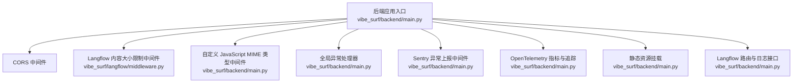
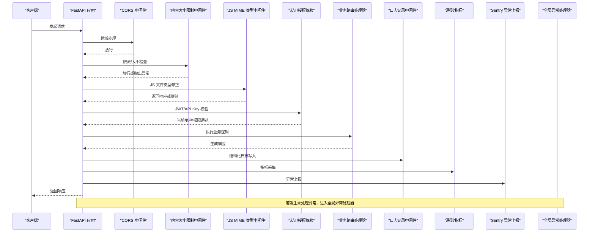
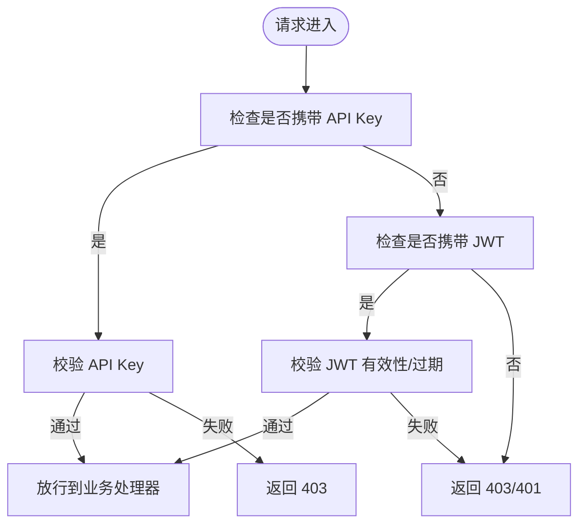
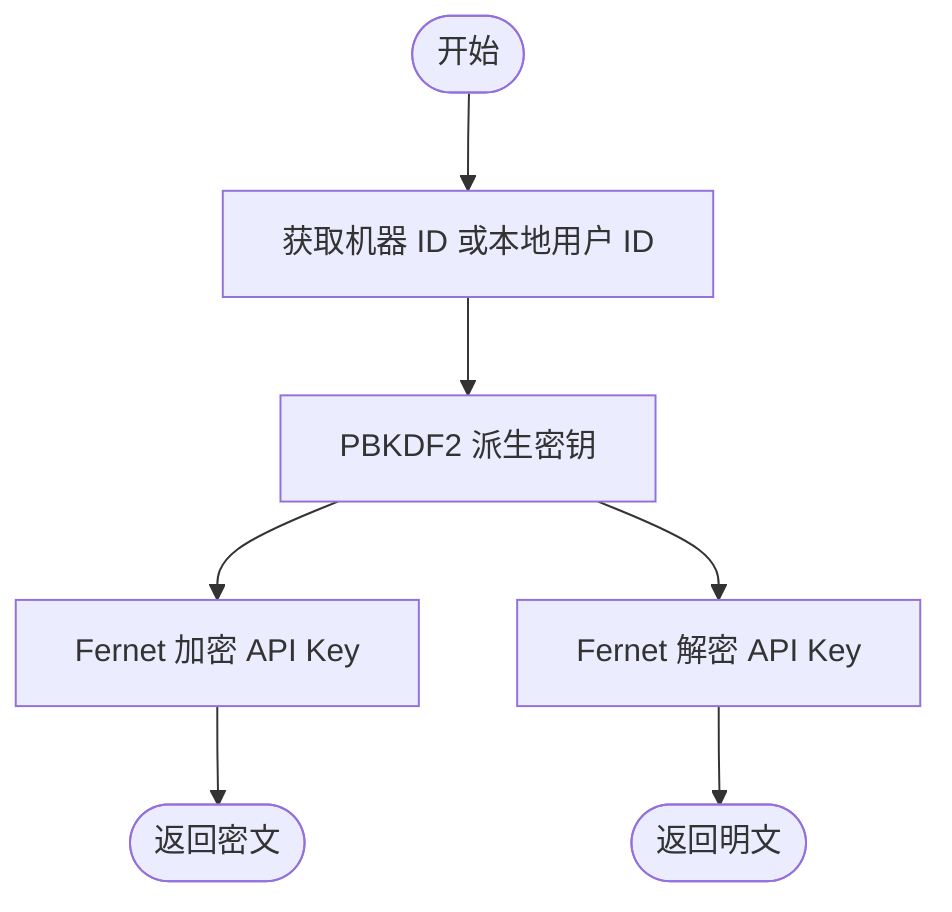
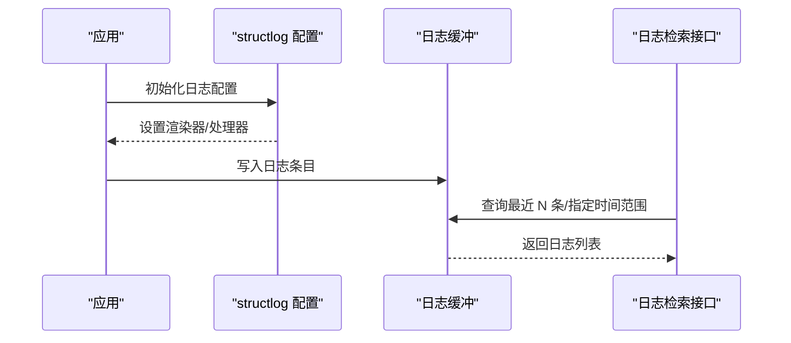
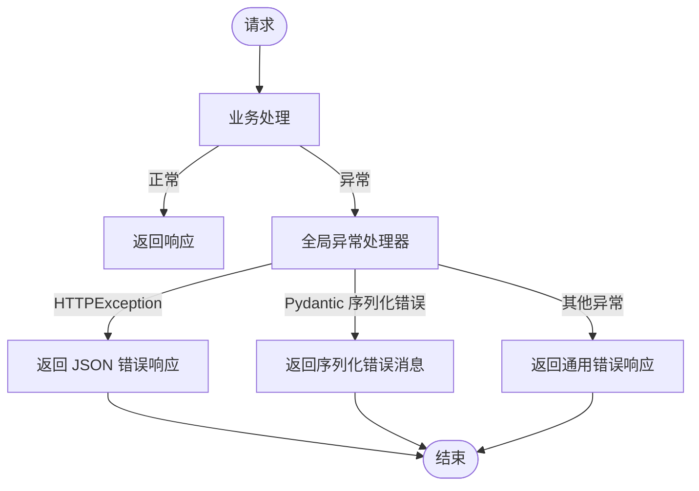
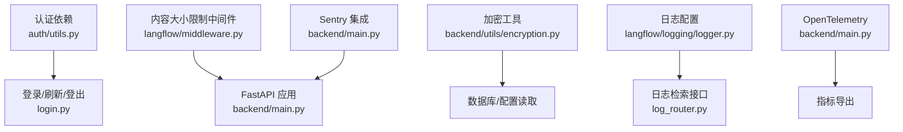

# 中间件

<cite>
**本文引用的文件**
- [vibe_surf/backend/main.py](file://vibe_surf/backend/main.py)
- [vibe_surf/backend/utils/encryption.py](file://vibe_surf/backend/utils/encryption.py)
- [vibe_surf/langflow/middleware.py](file://vibe_surf/langflow/middleware.py)
- [vibe_surf/langflow/logging/logger.py](file://vibe_surf/langflow/logging/logger.py)
- [vibe_surf/langflow/api/log_router.py](file://vibe_surf/langflow/api/log_router.py)
- [vibe_surf/telemetry/service.py](file://vibe_surf/telemetry/service.py)
- [vibe_surf/backend/shared_state.py](file://vibe_surf/backend/shared_state.py)
- [vibe_surf/langflow/services/auth/utils.py](file://vibe_surf/langflow/services/auth/utils.py)
- [vibe_surf/langflow/api/v1/login.py](file://vibe_surf/langflow/api/v1/login.py)
</cite>

## 目录
1. [简介](#简介)
2. [项目结构与入口](#项目结构与入口)
3. [核心中间件组件](#核心中间件组件)
4. [架构总览](#架构总览)
5. [组件详解](#组件详解)
6. [依赖关系分析](#依赖关系分析)
7. [性能与可观测性](#性能与可观测性)
8. [故障排查指南](#故障排查指南)
9. [结论](#结论)

## 简介
本文件系统化梳理 VibeSurf 后端使用的中间件组件，重点覆盖以下方面：
- 身份验证与授权：基于 JWT 的登录流程、API Key 校验、超级用户校验与会话 Cookie 管理
- 加密中间件：对敏感数据（如 API Key、用户信息）进行本地加密存储与解密
- 日志记录中间件：统一日志配置、输出目标与缓冲机制
- 性能监控中间件：OpenTelemetry 集成与指标导出
- 错误处理中间件：未处理异常捕获与一致化的错误响应
- 中间件链执行顺序与交互模式：从请求进入至响应返回的完整链路

## 项目结构与入口
后端应用通过 FastAPI 创建，注册了多类中间件与全局异常处理器，并在启动时初始化日志与遥测。核心入口位于后端主模块中，同时 Langflow 提供独立的中间件与日志配置。

图表来源
- [vibe_surf/backend/main.py](file://vibe_surf/backend/main.py#L543-L730)
- [vibe_surf/langflow/middleware.py](file://vibe_surf/langflow/middleware.py#L1-L60)

章节来源
- [vibe_surf/backend/main.py](file://vibe_surf/backend/main.py#L543-L730)

## 核心中间件组件
- 认证与授权中间件
  - 基于 API Key 的安全依赖与 WebSocket 校验
  - JWT 登录、刷新、登出与 Cookie 设置
  - 超级用户与活跃用户依赖
- 加密中间件
  - 以机器 MAC 或本地用户 ID 为种子派生对称密钥，使用 Fernet 对敏感数据进行加解密
- 日志记录中间件
  - 结构化日志、容器化输出、控制台美化、日志缓冲与检索接口
- 性能监控中间件
  - OpenTelemetry 自动注入与指标导出（Prometheus）
- 错误处理中间件
  - 全局异常捕获与统一错误响应；针对序列化失败的特殊处理

章节来源
- [vibe_surf/langflow/services/auth/utils.py](file://vibe_surf/langflow/services/auth/utils.py#L1-L260)
- [vibe_surf/langflow/api/v1/login.py](file://vibe_surf/langflow/api/v1/login.py#L40-L166)
- [vibe_surf/backend/utils/encryption.py](file://vibe_surf/backend/utils/encryption.py#L1-L172)
- [vibe_surf/langflow/logging/logger.py](file://vibe_surf/langflow/logging/logger.py#L1-L407)
- [vibe_surf/telemetry/service.py](file://vibe_surf/telemetry/service.py#L1-L114)
- [vibe_surf/backend/main.py](file://vibe_surf/backend/main.py#L521-L729)

## 架构总览
下图展示请求在中间件链中的流转与各组件之间的交互关系。

图表来源
- [vibe_surf/backend/main.py](file://vibe_surf/backend/main.py#L543-L729)
- [vibe_surf/langflow/middleware.py](file://vibe_surf/langflow/middleware.py#L1-L60)
- [vibe_surf/langflow/logging/logger.py](file://vibe_surf/langflow/logging/logger.py#L1-L407)
- [vibe_surf/telemetry/service.py](file://vibe_surf/telemetry/service.py#L1-L114)

## 组件详解

### 身份验证与授权中间件
- API Key 安全依赖
  - 支持查询参数与请求头两种方式传递 API Key，支持自动登录场景下的回退策略
  - 校验失败时返回 403
- JWT 登录与刷新
  - 登录成功设置访问与刷新 Cookie，并可选设置 API Key Cookie
  - 刷新接口读取刷新 Cookie 并签发新令牌
  - 登出删除相关 Cookie
- WebSocket 认证
  - 支持从 Cookie 或查询参数中提取令牌或 API Key
- 用户状态依赖
  - 活跃用户与超级用户依赖，用于路由保护

图表来源
- [vibe_surf/langflow/services/auth/utils.py](file://vibe_surf/langflow/services/auth/utils.py#L43-L159)
- [vibe_surf/langflow/api/v1/login.py](file://vibe_surf/langflow/api/v1/login.py#L40-L166)

章节来源
- [vibe_surf/langflow/services/auth/utils.py](file://vibe_surf/langflow/services/auth/utils.py#L1-L260)
- [vibe_surf/langflow/api/v1/login.py](file://vibe_surf/langflow/api/v1/login.py#L40-L166)

### 会话管理与用户会话
- 会话 ID 生成
  - 提供生成 UUID7 字符串作为会话 ID 的接口
- Cookie 策略
  - 登录/自动登录/刷新时设置访问令牌、刷新令牌与 API Key Cookie，包含 HttpOnly、SameSite、Secure 等安全属性
- 前端工具
  - 提供会话 ID 编码/解码与格式化工具，确保跨组件一致性

章节来源
- [vibe_surf/backend/main.py](file://vibe_surf/backend/main.py#L660-L670)
- [vibe_surf/langflow/api/v1/login.py](file://vibe_surf/langflow/api/v1/login.py#L40-L166)

### 加密中间件（encryption.py）
- 密钥派生
  - 优先使用本机 MAC 地址，若不可用则回退到本地用户 ID
  - 使用 PBKDF2-HMAC-SHA256 派生对称密钥
- 敏感数据保护
  - 对 API Key 进行加解密，支持检测是否已加密
  - 异常时抛出明确错误，避免静默失败

图表来源
- [vibe_surf/backend/utils/encryption.py](file://vibe_surf/backend/utils/encryption.py#L23-L127)

章节来源
- [vibe_surf/backend/utils/encryption.py](file://vibe_surf/backend/utils/encryption.py#L1-L172)

### 日志记录中间件
- 结构化日志
  - 使用 structlog，按环境选择 JSON/KeyValue/Console 渲染器
  - 可配置日志级别、输出文件、容器化输出、调用站点信息等
- 日志缓冲与检索
  - 提供固定容量环形缓冲区，支持按时间戳前后范围检索
  - 提供日志检索接口，支持禁用与参数校验

图表来源
- [vibe_surf/langflow/logging/logger.py](file://vibe_surf/langflow/logging/logger.py#L1-L407)
- [vibe_surf/langflow/api/log_router.py](file://vibe_surf/langflow/api/log_router.py#L73-L103)

章节来源
- [vibe_surf/langflow/logging/logger.py](file://vibe_surf/langflow/logging/logger.py#L1-L407)
- [vibe_surf/langflow/api/log_router.py](file://vibe_surf/langflow/api/log_router.py#L73-L103)

### 性能监控中间件
- OpenTelemetry 自动注入
  - 在应用创建时启用 FastAPI 仪表化，自动采集 HTTP 请求指标
- 指标导出
  - Prometheus Reader 注册，便于外部抓取
- Langflow 指标扩展
  - 提供 ObservableGauge/Counter/Histogram 等封装，便于业务指标观测

章节来源
- [vibe_surf/backend/main.py](file://vibe_surf/backend/main.py#L726-L729)
- [vibe_surf/telemetry/service.py](file://vibe_surf/telemetry/service.py#L1-L114)

### 错误处理中间件
- 全局异常处理
  - 捕获未处理异常，统一返回 JSON 响应
  - 对 HTTPException 与 Pydantic 序列化异常进行专门处理
- Sentry 集成
  - 通过 SentryAsgiMiddleware 将异常上报至 Sentry，支持采样率配置

图表来源
- [vibe_surf/backend/main.py](file://vibe_surf/backend/main.py#L696-L725)

章节来源
- [vibe_surf/backend/main.py](file://vibe_surf/backend/main.py#L696-L725)

## 依赖关系分析
- 中间件耦合与职责
  - 认证依赖与路由紧密耦合，确保每个受保护端点均经过 JWT/API Key 校验
  - 内容大小限制中间件与 Langflow 共享，统一上传限制策略
  - 日志中间件与检索接口解耦，通过缓冲区提供只读访问
  - 遥测中间件与 Sentry 通过配置注入，互不侵入业务代码
- 外部依赖
  - cryptography（Fernet）、cryptography.hazmat（PBKDF2）、structlog（日志）、opentelemetry（指标）、sentry_sdk（异常上报）

图表来源
- [vibe_surf/langflow/services/auth/utils.py](file://vibe_surf/langflow/services/auth/utils.py#L1-L260)
- [vibe_surf/langflow/api/v1/login.py](file://vibe_surf/langflow/api/v1/login.py#L40-L166)
- [vibe_surf/langflow/middleware.py](file://vibe_surf/langflow/middleware.py#L1-L60)
- [vibe_surf/backend/utils/encryption.py](file://vibe_surf/backend/utils/encryption.py#L1-L172)
- [vibe_surf/langflow/logging/logger.py](file://vibe_surf/langflow/logging/logger.py#L1-L407)
- [vibe_surf/langflow/api/log_router.py](file://vibe_surf/langflow/api/log_router.py#L73-L103)
- [vibe_surf/backend/main.py](file://vibe_surf/backend/main.py#L543-L729)

## 性能与可观测性
- 指标采集
  - FastAPI 自动注入 HTTP 指标（请求耗时、状态码分布等）
  - Prometheus Reader 用于指标导出，便于 Grafana 等可视化
- 日志可观测
  - 结构化日志与缓冲区结合，支持快速定位问题
  - 容器化环境下可切换 JSON/CSV 输出，满足不同运维需求
- 遥测事件
  - 启动/关闭事件通过 PostHog 匿名上报，支持调试开关

章节来源
- [vibe_surf/backend/main.py](file://vibe_surf/backend/main.py#L726-L729)
- [vibe_surf/langflow/logging/logger.py](file://vibe_surf/langflow/logging/logger.py#L1-L407)
- [vibe_surf/telemetry/service.py](file://vibe_surf/telemetry/service.py#L1-L114)

## 故障排查指南
- 认证失败
  - 检查 API Key 是否正确传递（查询参数或请求头），确认自动登录配置
  - 校验 JWT 是否过期或签名无效
- 上传失败
  - 检查 Content-Type 与 boundary 格式，确认内容大小限制中间件阈值
- 日志检索
  - 确认日志缓冲已启用，请求参数合法（时间戳与前后范围互斥）
- 异常上报
  - 检查 Sentry DSN 与采样率配置，确认异常被捕获并上报

章节来源
- [vibe_surf/langflow/services/auth/utils.py](file://vibe_surf/langflow/services/auth/utils.py#L43-L159)
- [vibe_surf/langflow/middleware.py](file://vibe_surf/langflow/middleware.py#L1-L60)
- [vibe_surf/langflow/api/log_router.py](file://vibe_surf/langflow/api/log_router.py#L73-L103)
- [vibe_surf/backend/main.py](file://vibe_surf/backend/main.py#L592-L626)

## 结论
VibeSurf 后端中间件体系围绕“安全、可观测、稳定”三大目标构建：
- 安全：API Key 与 JWT 双通道认证，Cookie 安全策略完善，支持 WebSocket 认证
- 可观测：结构化日志、缓冲检索、OpenTelemetry 指标与 Sentry 异常上报
- 稳定：全局异常处理与内容大小限制，保障服务稳定性与用户体验