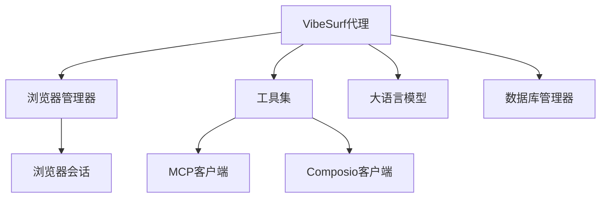
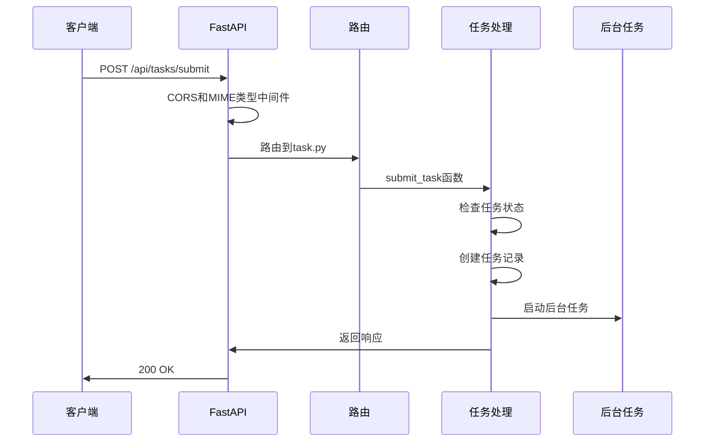
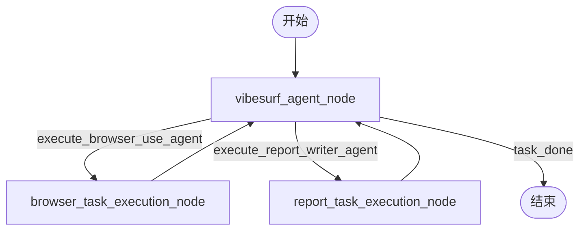

# 后端架构

<cite>
**本文档引用的文件**
- [main.py](file://vibe_surf/backend/main.py)
- [shared_state.py](file://vibe_surf/backend/shared_state.py)
- [task.py](file://vibe_surf/backend/api/task.py)
- [models.py](file://vibe_surf/backend/database/models.py)
- [queries.py](file://vibe_surf/backend/database/queries.py)
- [llm_factory.py](file://vibe_surf/backend/utils/llm_factory.py)
- [vibesurf_tools.py](file://vibe_surf/tools/vibesurf_tools.py)
- [vibe_surf_agent.py](file://vibe_surf/agents/vibe_surf_agent.py)
- [manager.py](file://vibe_surf/backend/database/manager.py)
</cite>

## 目录
1. [项目结构](#项目结构)
2. [核心组件](#核心组件)
3. [API端点组织](#api端点组织)
4. [请求处理流程](#请求处理流程)
5. [错误处理机制](#错误处理机制)
6. [业务逻辑层实现](#业务逻辑层实现)
7. [中间件使用](#中间件使用)
8. [数据库会话和事务管理](#数据库会话和事务管理)
9. [依赖注入](#依赖注入)
10. [任务队列和异步处理](#任务队列和异步处理)
11. [性能优化和安全加固](#性能优化和安全加固)

## 项目结构

VibeSurf后端项目采用模块化设计，主要目录结构如下：

- `vibe_surf/backend/`: 后端核心代码，包含API、数据库、工具和共享状态
- `vibe_surf/agents/`: 代理相关实现，包括VibeSurf代理和报告编写代理
- `vibe_surf/browser/`: 浏览器管理相关代码，包括浏览器会话和看门狗
- `vibe_surf/tools/`: 工具集，包括浏览器使用工具、VibeSurf工具和文件系统工具
- `vibe_surf/workflows/`: 工作流定义，包括浏览器操作、文件系统操作和集成操作

后端服务基于FastAPI构建，通过`main.py`作为入口点，初始化应用并配置路由。

**Section sources**
- [main.py](file://vibe_surf/backend/main.py#L1-L794)

## 核心组件

VibeSurf后端的核心组件包括：

- **VibeSurfAgent**: 主代理，负责协调任务执行
- **BrowserManager**: 浏览器管理器，管理浏览器会话和标签
- **VibeSurfTools**: 工具集，提供各种功能操作
- **LLM**: 大语言模型实例，用于生成响应
- **DatabaseManager**: 数据库管理器，处理数据库连接和会话

这些组件通过`shared_state.py`中的全局变量进行共享和协调。



**Diagram sources**
- [shared_state.py](file://vibe_surf/backend/shared_state.py#L38-L45)

**Section sources**
- [shared_state.py](file://vibe_surf/backend/shared_state.py#L1-L800)

## API端点组织

后端API端点组织在`vibe_surf/backend/api/`目录下，每个功能模块有独立的路由文件：

- `task.py`: 任务相关端点，如任务提交、暂停、恢复和停止
- `files.py`: 文件管理端点，如文件上传和下载
- `activity.py`: 活动日志端点，如获取任务活动日志
- `config.py`: 配置管理端点，如LLM配置和工具配置
- `browser.py`: 浏览器相关端点，如获取活动标签和所有标签
- `voices.py`: 语音相关端点，如语音配置和语音文件管理
- `agent.py`: 代理相关端点，如代理状态和代理控制
- `composio.py`: Composio集成端点，如Composio工具配置
- `schedule.py`: 调度相关端点，如工作流调度管理
- `vibesurf.py`: VibeSurf特定端点，如VibeSurf代理配置

所有路由在`main.py`中通过`include_router`方法注册到FastAPI应用。

**Section sources**
- [main.py](file://vibe_surf/backend/main.py#L38-L47)

## 请求处理流程

请求处理流程从FastAPI应用接收请求开始，经过中间件处理，然后路由到相应的API端点。以任务提交为例，流程如下：

1. 客户端发送POST请求到`/api/tasks/submit`端点
2. 请求经过CORS中间件和JavaScript MIME类型中间件处理
3. FastAPI解析请求体，验证`TaskCreateRequest`模型
4. `submit_task`函数处理请求，检查是否有正在运行的任务
5. 如果没有正在运行的任务，创建任务记录并启动后台任务
6. 返回任务提交成功的响应



**Diagram sources**
- [task.py](file://vibe_surf/backend/api/task.py#L43-L146)

**Section sources**
- [task.py](file://vibe_surf/backend/api/task.py#L1-L379)

## 错误处理机制

后端实现了全面的错误处理机制，包括：

- **HTTP异常处理**: 使用FastAPI的`HTTPException`处理HTTP错误
- **全局异常处理**: 在`main.py`中定义全局异常处理器，捕获未处理的异常
- **自定义异常处理**: 在`shared_state.py`中定义任务执行的错误处理

全局异常处理器在`main.py`中定义，捕获所有未处理的异常，并返回适当的错误响应。

```python
@app.exception_handler(Exception)
async def exception_handler(_request: Request, exc: Exception):
    if isinstance(exc, HTTPException):
        logger.error(f"HTTPException: {exc}", exc_info=exc)
        return Response(
            content=json.dumps({"message": str(exc.detail)}),
            status_code=exc.status_code,
            media_type="application/json"
        )
    
    if isinstance(exc, PydanticSerializationError):
        message = (
            "Something went wrong while serializing the response. "
            "Please share this error on our GitHub repository."
        )
        error_messages = json.dumps([message, str(exc)])
        logger.error(f"PydanticSerializationError: {error_messages}", exc_info=exc)
        return Response(
            content=error_messages,
            status_code=500,
            media_type="application/json"
        )
    
    logger.error(f"Unhandled error: {exc}", exc_info=exc)
    return Response(
        content=json.dumps({"message": str(exc)}),
        status_code=500,
        media_type="application/json"
    )
```

**Section sources**
- [main.py](file://vibe_surf/backend/main.py#L696-L724)

## 业务逻辑层实现

业务逻辑层的实现主要集中在`vibe_surf/agents/`和`vibe_surf/tools/`目录下。`VibeSurfAgent`负责协调代理、浏览器管理和LLM调用。

### VibeSurf代理工作流程

VibeSurf代理使用LangGraph构建工作流，包括以下节点：

- `vibesurf_agent_node`: 主代理节点，处理任务分配
- `browser_task_execution_node`: 浏览器任务执行节点
- `report_task_execution_node`: 报告生成节点

工作流通过`StateGraph`定义，状态在节点间传递。



**Diagram sources**
- [vibe_surf_agent.py](file://vibe_surf/agents/vibe_surf_agent.py#L346-L546)

### 工具协调

`VibeSurfTools`类负责协调各种工具，包括MCP服务器和Composio集成。工具通过注册表模式管理，支持动态注册和调用。

```python
class VibeSurfTools:
    def __init__(self, exclude_actions: list[str] = [], mcp_server_config: Optional[Dict[str, Any]] = None,
                 composio_client: ComposioClient = None):
        self.registry = VibeSurfRegistry(exclude_actions)
        self._register_file_actions()
        self._register_browser_use_agent()
        self._register_report_writer_agent()
        self._register_todo_actions()
        self._register_done_action()
        self._register_skills()
        self._register_extra_tools()
        self.mcp_server_config = mcp_server_config
        self.mcp_clients: Dict[str, MCPClient] = {}
        self.composio_toolkits: Dict[str, Any] = {}
        self.composio_client: ComposioClient = composio_client
```

**Section sources**
- [vibesurf_tools.py](file://vibe_surf/tools/vibesurf_tools.py#L72-L87)
- [vibe_surf_agent.py](file://vibe_surf/agents/vibe_surf_agent.py#L358-L362)

## 中间件使用

后端使用了多种中间件来增强功能和安全性：

- **CORS中间件**: 允许跨域请求
- **JavaScript MIME类型中间件**: 确保JavaScript文件返回正确的MIME类型
- **内容大小限制中间件**: 限制请求体大小
- **Sentry中间件**: 错误监控和报告

CORS中间件在`main.py`中配置，允许所有来源的请求。

```python
app.add_middleware(
    CORSMiddleware,
    allow_origins=origins,
    allow_credentials=True,
    allow_methods=["*"],
    allow_headers=["*"],
)
```

JavaScript MIME类型中间件确保JavaScript文件返回`text/javascript` MIME类型。

```python
class JavaScriptMIMETypeMiddleware(BaseHTTPMiddleware):
    async def dispatch(self, request: Request, call_next: RequestResponseEndpoint) -> Response:
        try:
            response = await call_next(request)
        except Exception as exc:
            if isinstance(exc, PydanticSerializationError):
                message = (
                    "Something went wrong while serializing the response. "
                    "Please share this error on our GitHub repository."
                )
                error_messages = json.dumps([message, str(exc)])
                raise HTTPException(status_code=HTTPStatus.INTERNAL_SERVER_ERROR, detail=error_messages) from exc
            raise
        if (
            "files/" not in request.url.path
            and request.url.path.endswith(".js")
            and response.status_code == HTTPStatus.OK
        ):
            response.headers["Content-Type"] = "text/javascript"
        return response
```

**Section sources**
- [main.py](file://vibe_surf/backend/main.py#L569-L575)
- [main.py](file://vibe_surf/backend/main.py#L518-L540)

## 数据库会话和事务管理

数据库会话和事务管理通过`DatabaseManager`类实现，使用SQLAlchemy的异步会话。

### 数据库模型

数据库模型定义在`vibe_surf/backend/database/models.py`中，包括：

- `Task`: 任务模型，存储任务信息
- `LLMProfile`: LLM配置文件模型
- `McpProfile`: MCP配置文件模型
- `UploadedFile`: 上传文件模型
- `Schedule`: 调度模型

```python
class Task(Base):
    """Task model with LLM profile reference and workspace directory"""
    __tablename__ = 'tasks'
    
    task_id = Column(String(36), primary_key=True, default=lambda: str(uuid4()))
    session_id = Column(String(36), nullable=False)
    task_description = Column(Text, nullable=False)
    status = Column(Enum(TaskStatus, values_callable=lambda obj: [e.value for e in obj]), nullable=False, default=TaskStatus.PENDING)
    llm_profile_name = Column(String(100), nullable=False)
    upload_files_path = Column(String(500), nullable=True)
    workspace_dir = Column(String(500), nullable=True)
    mcp_server_config = Column(Text, nullable=True)
    agent_mode = Column(String(50), nullable=False, default='thinking')
    task_result = Column(Text, nullable=True)
    error_message = Column(Text, nullable=True)
    report_path = Column(String(500), nullable=True)
    created_at = Column(DateTime, nullable=False, default=func.now())
    updated_at = Column(DateTime, nullable=False, default=func.now(), onupdate=func.now())
    started_at = Column(DateTime, nullable=True)
    completed_at = Column(DateTime, nullable=True)
    task_metadata = Column(JSON, nullable=True)
```

**Section sources**
- [models.py](file://vibe_surf/backend/database/models.py#L94-L136)

### 数据库查询

数据库查询操作封装在`vibe_surf/backend/database/queries.py`中，提供CRUD操作。

```python
class TaskQueries:
    """Database queries for task management with LLM Profile support"""

    @staticmethod
    async def save_task(
            db: AsyncSession,
            task_id: str,
            session_id: str,
            task_description: str,
            llm_profile_name: str,
            upload_files_path: Optional[str] = None,
            workspace_dir: Optional[str] = None,
            mcp_server_config: Optional[str] = None,
            task_result: Optional[str] = None,
            task_status: str = "pending",
            error_message: Optional[str] = None,
            report_path: Optional[str] = None,
            agent_mode: str = "thinking"
    ) -> Task:
        """Create or update a task record"""
        try:
            result = await db.execute(select(Task).where(Task.task_id == task_id))
            existing_task = result.scalar_one_or_none()

            if existing_task:
                update_data = {}
                if task_result is not None:
                    update_data['task_result'] = task_result
                if task_status:
                    update_data['status'] = TaskStatus(task_status)
                if error_message is not None:
                    update_data['error_message'] = error_message
                if report_path is not None:
                    update_data['report_path'] = report_path
                if task_status == "running" and not existing_task.started_at:
                    update_data['started_at'] = func.now()
                if task_status in ["completed", "failed", "stopped"]:
                    update_data['completed_at'] = func.now()

                await db.execute(
                    update(Task).where(Task.task_id == task_id).values(**update_data)
                )
                await db.refresh(existing_task)
                return existing_task
            else:
                task = Task(
                    task_id=task_id,
                    session_id=session_id,
                    task_description=task_description,
                    status=TaskStatus(task_status),
                    llm_profile_name=llm_profile_name,
                    upload_files_path=upload_files_path,
                    workspace_dir=workspace_dir,
                    mcp_server_config=mcp_server_config,
                    task_result=task_result,
                    error_message=error_message,
                    report_path=report_path,
                    agent_mode=agent_mode
                )

                db.add(task)
                await db.flush()
                await db.refresh(task)
                return task

        except Exception as e:
            logger.error(f"Failed to save task {task_id}: {e}")
            raise
```

**Section sources**
- [queries.py](file://vibe_surf/backend/database/queries.py#L441-L523)

### 依赖注入

数据库会话通过FastAPI的依赖注入系统提供，`get_db_session`函数作为依赖项。

```python
async def get_db_session() -> AsyncGenerator[AsyncSession, None]:
    """FastAPI dependency for database sessions"""
    from .. import shared_state

    if not shared_state.db_manager:
        raise RuntimeError("Database manager not initialized. Call initialize_vibesurf_components() first.")

    async for session in shared_state.db_manager.get_session():
        yield session
```

**Section sources**
- [manager.py](file://vibe_surf/backend/database/manager.py#L276-L284)

## 任务队列和异步处理

后端使用异步处理机制来执行长时间运行的任务，避免阻塞主线程。

### 后台任务执行

任务执行在后台线程中进行，通过`BackgroundTasks`添加到FastAPI应用。

```python
@router.post("/submit")
async def submit_task(
        task_request: "TaskCreateRequest",
        background_tasks: BackgroundTasks,
        db: AsyncSession = Depends(get_db_session)
):
    """Submit new task for execution (single task mode)"""
    # ... 任务提交逻辑 ...
    
    # Add background task
    background_tasks.add_task(
        execute_task_background,
        task_id=task_id,
        session_id=task_request.session_id,
        task=task_request.task_description,
        llm_profile_name=task_request.llm_profile_name,
        upload_files=task_request.upload_files_path,
        agent_mode=task_request.agent_mode,
        db_session=db
    )
    
    return {
        "success": True,
        "task_id": task_id,
        "session_id": task_request.session_id,
        "status": "submitted",
        "message": "Task submitted for execution",
        "llm_profile": task_request.llm_profile_name,
        "workspace_dir": workspace_dir
    }
```

**Section sources**
- [task.py](file://vibe_surf/backend/api/task.py#L126-L135)

### 任务执行背景

`execute_task_background`函数在后台执行任务，处理任务的整个生命周期。

```python
async def execute_task_background(
        task_id: str,
        session_id: str,
        task: str,
        llm_profile_name: str,
        upload_files: Optional[List[str]] = None,
        agent_mode: str = "thinking",
        db_session=None
):
    """Background task execution function for single task with LLM profile support"""
    global vibesurf_agent, active_task, current_llm_profile_name

    try:
        current_llm_profile_name = llm_profile_name

        # Check if MCP server configuration needs update
        await _check_and_update_mcp_servers(db_session)

        # Check if Composio tools configuration needs update
        await _check_and_update_composio_tools(db_session)

        # Update active task status to running
        active_task = {
            "task_id": task_id,
            "status": "running",
            "session_id": session_id,
            "task": task,
            "llm_profile_name": llm_profile_name,
            "workspace_dir": workspace_dir,
            "upload_files": upload_files or [],
            "active_mcp_servers": list(active_mcp_server.values()),
            "start_time": datetime.now(),
            "agent_id": task_id
        }

        logger.info(f"Task {task_id} started for session {session_id} with profile {llm_profile_name}")

        # Ensure correct workspace directory is set for this task
        if vibesurf_agent:
            vibesurf_agent.workspace_dir = workspace_dir

        # Execute the task
        result = await vibesurf_agent.run(
            task=task,
            upload_files=upload_files,
            session_id=session_id,
            agent_mode=agent_mode
        )

        # Update task status to completed
        if active_task and active_task.get("status") != "stopped":
            active_task.update({
                "status": "completed",
                "result": result,
                "end_time": datetime.now()
            })

        # Get session directory for report path
        session_dir = os.path.join(workspace_dir, session_id)
        report_path = None

        # Look for generated report
        reports_dir = os.path.join(session_dir, "reports")
        if os.path.exists(reports_dir):
            for file in os.listdir(reports_dir):
                if file.endswith('.html'):
                    report_path = os.path.join(reports_dir, file)
                    break

        # Save task to database
        if db_session:
            try:
                from .database.queries import TaskQueries
                await TaskQueries.update_task_completion(
                    db_session,
                    task_id=task_id,
                    task_result=result,
                    task_status=active_task.get("status", "completed") if active_task else "completed",
                    report_path=report_path
                )
                await db_session.commit()
            except Exception as e:
                logger.error(f"Failed to update task in database: {e}")

        logger.info(f"Task {task_id} completed for session {session_id}")

    except Exception as e:
        logger.error(f"Task execution failed: {e}")
        # Update task status to failed
        if active_task and active_task.get("task_id") == task_id:
            active_task.update({
                "status": "failed",
                "error": str(e),
                "end_time": datetime.now()
            })

        # Save failed task to database
        if db_session:
            try:
                from .database.queries import TaskQueries
                await TaskQueries.update_task_completion(
                    db_session,
                    task_id=task_id,
                    task_result=None,
                    task_status="failed",
                    error_message=str(e)
                )
                await db_session.commit()
            except Exception as e:
                logger.error(f"Failed to save failed task to database: {e}")

        logger.error(f"Task {task_id} failed for session {session_id}: {e}")
    finally:
        # Clear active task when execution is complete (success or failure)
        active_task = None
```

**Section sources**
- [shared_state.py](file://vibe_surf/backend/shared_state.py#L118-L233)

## 性能优化和安全加固

后端实现了多种性能优化和安全加固措施。

### 性能优化

- **数据库连接池**: 使用SQLAlchemy的连接池管理数据库连接
- **异步处理**: 使用异步I/O处理长时间运行的任务
- **缓存**: 在`llm_factory.py`中缓存LLM实例

```python
def create_llm_from_profile(llm_profile) -> BaseChatModel:
    """Create LLM instance from LLMProfile database record (dict or object)"""
    try:
        # ... LLM创建逻辑 ...
        
        # Create LLM instance based on provider
        if provider == "openai":
            params = {
                "model": model,
                "api_key": api_key,
                **common_params
            }
            if base_url:
                params["base_url"] = base_url
            return ChatOpenAI(**params)
            
        # ... 其他提供者 ...
        
    except Exception as e:
        logger.error(f"Failed to create LLM from profile: {e}")
        raise RuntimeError(f"Failed to create LLM from profile: {str(e)}")
```

**Section sources**
- [llm_factory.py](file://vibe_surf/backend/utils/llm_factory.py#L23-L220)

### 安全加固

- **输入验证**: 使用Pydantic模型验证API请求
- **速率限制**: 在`main.py`中配置速率限制
- **安全头设置**: 在响应中设置安全头

```python
# Input validation using Pydantic models
class TaskCreateRequest(BaseModel):
    """Request model for creating a new task"""
    session_id: str = Field(description="Session identifier")
    task_description: str = Field(description="The task description")
    llm_profile_name: str = Field(description="LLM profile name to use")
    upload_files_path: Optional[str] = Field(default=None, description="Path to uploaded files")
    mcp_server_config: Optional[Dict[str, Any]] = Field(default=None, description="MCP server configuration")
    agent_mode: str = Field(default="thinking", description="Agent mode: 'thinking', 'no-thinking', or 'flash'")
```

**Section sources**
- [models.py](file://vibe_surf/backend/api/models.py#L102-L109)