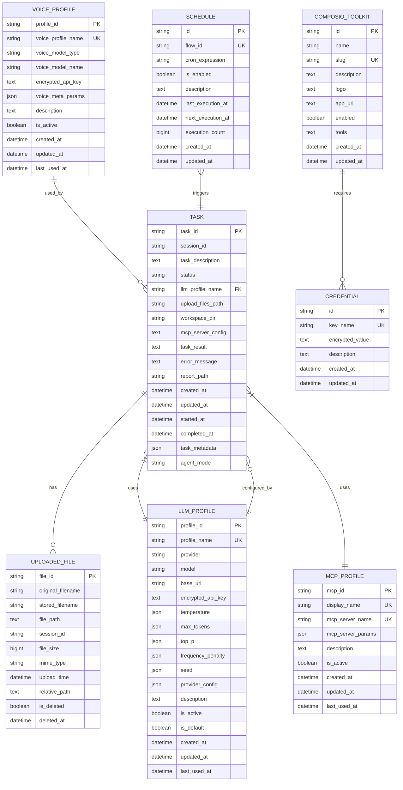
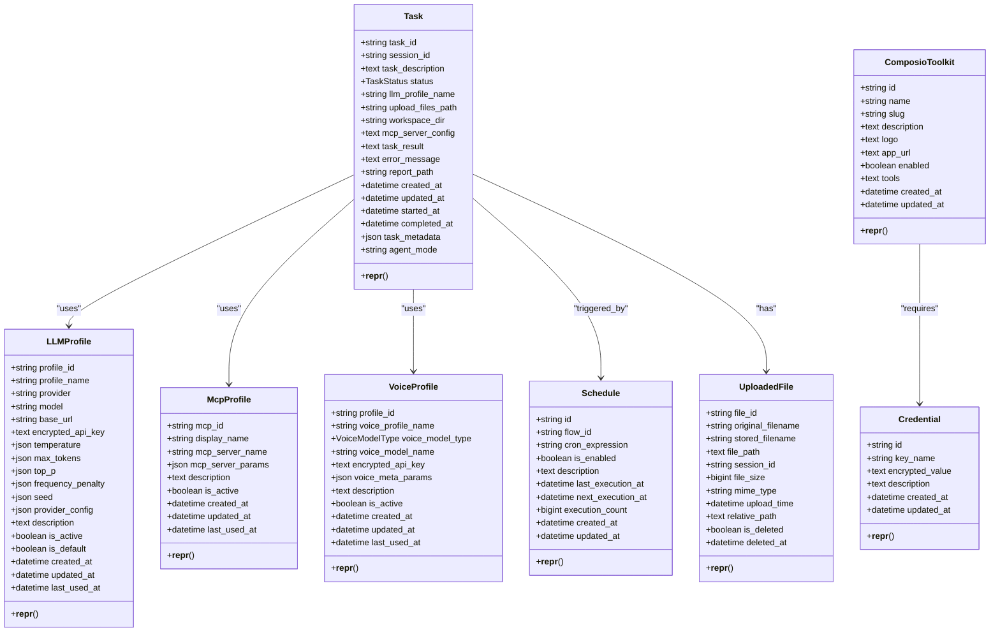
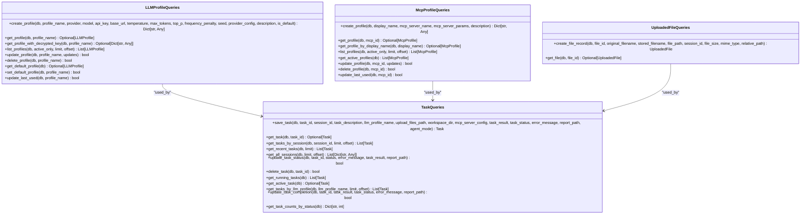
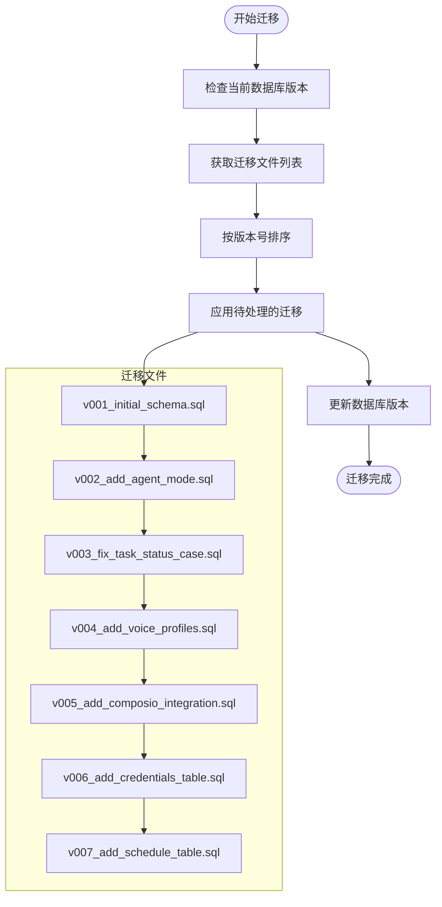
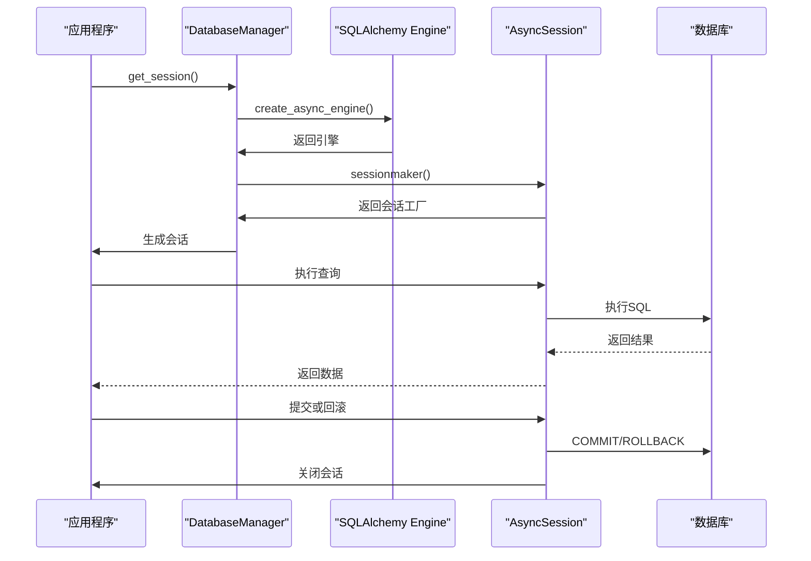

# 数据库集成

<cite>
**本文档中引用的文件**  
- [models.py](file://vibe_surf/backend/database/models.py)
- [queries.py](file://vibe_surf/backend/database/queries.py)
- [schemas.py](file://vibe_surf/backend/database/schemas.py)
- [manager.py](file://vibe_surf/backend/database/manager.py)
- [v001_initial_schema.sql](file://vibe_surf/backend/database/migrations/v001_initial_schema.sql)
- [v002_add_agent_mode.sql](file://vibe_surf/backend/database/migrations/v002_add_agent_mode.sql)
- [v003_fix_task_status_case.sql](file://vibe_surf/backend/database/migrations/v003_fix_task_status_case.sql)
- [v004_add_voice_profiles.sql](file://vibe_surf/backend/database/migrations/v004_add_voice_profiles.sql)
- [v005_add_composio_integration.sql](file://vibe_surf/backend/database/migrations/v005_add_composio_integration.sql)
- [v006_add_credentials_table.sql](file://vibe_surf/backend/database/migrations/v006_add_credentials_table.sql)
- [v007_add_schedule_table.sql](file://vibe_surf/backend/database/migrations/v007_add_schedule_table.sql)
</cite>

## 目录
1. [简介](#简介)
2. [数据库模式设计](#数据库模式设计)
3. [ORM模型与数据库表映射](#orm模型与数据库表映射)
4. [查询构建器使用](#查询构建器使用)
5. [数据库迁移策略](#数据库迁移策略)
6. [数据库连接管理与会话处理](#数据库连接管理与会话处理)
7. [性能优化建议](#性能优化建议)
8. [数据完整性与错误处理](#数据完整性与错误处理)

## 简介
VibeSurf的数据库设计旨在支持一个复杂的任务执行系统，该系统集成了LLM（大语言模型）配置管理、任务调度、浏览器会话管理、凭证存储和语音模型配置等功能。数据库采用SQLite作为默认存储引擎，同时支持其他SQL数据库。系统通过SQLAlchemy ORM实现数据持久化，使用异步会话管理确保高并发性能。核心实体包括任务（Task）、LLM配置（LLMProfile）、上传文件（UploadedFile）、MCP服务器配置（McpProfile）、语音配置（VoiceProfile）、Composio工具包（ComposioToolkit）、凭证（Credential）和计划（Schedule）。数据库设计遵循规范化原则，同时通过JSON字段提供灵活性，以适应动态配置需求。

## 数据库模式设计
VibeSurf的数据库模式设计围绕核心业务实体展开，通过一系列相互关联的表来管理任务执行环境和相关配置。主要实体包括任务、代理、浏览器会话、凭证和计划。

### 核心实体关系

**Diagram sources**
- [models.py](file://vibe_surf/backend/database/models.py#L94-L289)

### 实体详细说明
#### 任务（Task）
任务表是系统的核心，记录了每个任务的执行状态、配置和结果。任务与会话（session）关联，支持文件上传和工作区目录管理。通过`llm_profile_name`字段引用LLM配置，实现配置复用。`agent_mode`字段区分代理的执行模式（思考或直接执行）。任务状态采用枚举类型，包括待处理、运行中、暂停、已完成、失败和已停止。

#### LLM配置（LLMProfile）
LLM配置表存储了不同LLM提供商的配置信息，如OpenAI、Anthropic等。每个配置包含模型名称、基础URL、加密的API密钥以及各种参数（温度、最大令牌数等）。通过`is_default`标志指定默认配置，`is_active`标志控制配置的启用状态。该设计允许用户管理多个LLM配置，并在任务中灵活选择。

#### 上传文件（UploadedFile）
上传文件表跟踪用户上传的所有文件，包括原始文件名、存储路径、文件大小和MIME类型。通过`session_id`与会话关联，`is_deleted`标志实现软删除，保留文件删除历史。该表支持文件管理功能，如查看会话中的所有上传文件。

#### MCP服务器配置（McpProfile）
MCP服务器配置表管理MCP（Model Control Protocol）服务器的配置，如文件系统、MarkitDown等。每个配置包含显示名称、服务器标识符和启动参数。该设计支持动态添加和管理不同的MCP服务器，为任务提供扩展能力。

#### 语音配置（VoiceProfile）
语音配置表管理语音模型（ASR和TTS）的配置，包括模型名称、加密的API密钥和元参数。支持多种语音模型，允许用户根据需求选择合适的配置。

#### Composio工具包（ComposioToolkit）
Composio工具包表管理与Composio平台集成的应用工具。每个工具包包含名称、唯一标识符（slug）、描述和启用状态。支持工具级别的启用/禁用控制，实现细粒度的集成管理。

#### 凭证（Credential）
凭证表集中存储所有加密的API密钥和其他敏感数据。通过`key_name`唯一标识每个凭证（如"COMPOSIO_API_KEY"），实现安全的密钥管理。该设计避免了在多个表中重复存储敏感信息，提高了安全性。

#### 计划（Schedule）
计划表管理工作流的定时执行，使用cron表达式定义执行计划。每个计划关联一个工作流ID，支持启用/禁用控制。记录最后执行时间、下次执行时间和执行次数，便于监控和管理自动化任务。

## ORM模型与数据库表映射
VibeSurf使用SQLAlchemy ORM将Python类映射到数据库表，实现了对象-关系映射。每个核心实体都有对应的ORM模型，定义了表结构、字段类型和关系。

### 模型定义

**Diagram sources**
- [models.py](file://vibe_surf/backend/database/models.py#L94-L289)

### 映射机制
ORM模型通过`__tablename__`属性指定对应的数据库表名。每个字段使用`Column`定义，指定数据类型、约束和默认值。例如，`Task`模型的`task_id`字段定义为`Column(String(36), primary_key=True, default=lambda: str(uuid4()))`，映射到数据库的`tasks`表的`task_id`列，使用字符串类型，作为主键，并默认生成UUID。枚举类型通过`Enum`字段实现，如`TaskStatus`枚举映射到`status`列。JSON字段使用`JSON`类型，允许存储复杂的数据结构。索引通过`Index`类定义，优化查询性能。

## 查询构建器使用
查询构建器（queries.py）提供了对数据库操作的封装，简化了CRUD操作。它使用SQLAlchemy的异步API，支持非阻塞的数据库交互。

### 查询类结构

**Diagram sources**
- [queries.py](file://vibe_surf/backend/database/queries.py#L21-L800)

### 主要查询方法
#### LLM配置查询
`LLMProfileQueries`类提供了对LLM配置的完整管理功能。`create_profile`方法创建新的LLM配置，自动加密API密钥。`get_profile_with_decrypted_key`方法获取配置并解密API密钥，供运行时使用。`set_default_profile`方法设置默认配置，同时取消其他配置的默认状态，确保只有一个默认配置。

#### 任务查询
`TaskQueries`类管理任务的生命周期。`save_task`方法创建或更新任务，根据状态自动设置开始和完成时间。`get_all_sessions`方法聚合会话信息，返回每个会话的任务数、创建时间和最后活动时间，用于会话管理界面。`update_task_status`方法更新任务状态，并根据状态变化自动更新时间戳。

#### MCP服务器查询
`McpProfileQueries`类管理MCP服务器配置。`create_profile`方法创建新的MCP配置。`get_active_profiles`方法获取所有启用的配置，用于任务执行时的服务器选择。

#### 上传文件查询
`UploadedFileQueries`类管理上传文件记录。`create_file_record`方法创建新的文件记录。`get_file`方法根据文件ID获取文件信息，同时检查`is_deleted`标志，实现软删除。

## 数据库迁移策略
VibeSurf使用基于SQL脚本的迁移策略，通过版本化SQL文件管理数据库模式的演进。迁移系统支持SQLite数据库，使用`PRAGMA user_version`跟踪数据库版本。

### 迁移流程

**Diagram sources**
- [manager.py](file://vibe_surf/backend/database/manager.py#L27-L257)
- [v001_initial_schema.sql](file://vibe_surf/backend/database/migrations/v001_initial_schema.sql)
- [v002_add_agent_mode.sql](file://vibe_surf/backend/database/migrations/v002_add_agent_mode.sql)
- [v003_fix_task_status_case.sql](file://vibe_surf/backend/database/migrations/v003_fix_task_status_case.sql)
- [v004_add_voice_profiles.sql](file://vibe_surf/backend/database/migrations/v004_add_voice_profiles.sql)
- [v005_add_composio_integration.sql](file://vibe_surf/backend/database/migrations/v005_add_composio_integration.sql)
- [v006_add_credentials_table.sql](file://vibe_surf/backend/database/migrations/v006_add_credentials_table.sql)
- [v007_add_schedule_table.sql](file://vibe_surf/backend/database/migrations/v007_add_schedule_table.sql)

### 迁移文件说明
#### v001_initial_schema.sql
创建初始数据库模式，包括`llm_profiles`、`tasks`、`uploaded_files`和`mcp_profiles`表。定义主键、外键、检查约束和索引。创建触发器，自动更新`updated_at`时间戳。

#### v002_add_agent_mode.sql
向`tasks`表添加`agent_mode`列，支持代理的模式配置。默认值为'thinking'，允许任务在思考模式和直接执行模式之间切换。

#### v003_fix_task_status_case.sql
修复任务状态值的大小写问题，将大写状态值（如'PENDING'）更新为小写（'pending'），以匹配`TaskStatus`枚举的定义。

#### v004_add_voice_profiles.sql
添加`voice_profiles`表，用于管理语音模型配置。支持ASR和TTS模型，存储加密的API密钥和模型参数。

#### v005_add_composio_integration.sql
添加`composio_toolkits`表，用于管理Composio平台的集成工具包。支持启用/禁用控制和工具级别的配置。

#### v006_add_credentials_table.sql
添加`credentials`表，集中存储加密的API密钥。通过`key_name`唯一标识每个凭证，提高安全性。

#### v007_add_schedule_table.sql
添加`schedules`表，用于管理工作流的定时执行。支持cron表达式、启用/禁用控制和执行历史记录。

## 数据库连接管理与会话处理
VibeSurf使用`DatabaseManager`类管理数据库连接和会话，确保高效和安全的数据库交互。

### 连接管理架构

**Diagram sources**
- [manager.py](file://vibe_surf/backend/database/manager.py#L148-L240)

### 连接配置
`DatabaseManager`根据数据库URL选择配置。对于SQLite，使用`StaticPool`连接池，`check_same_thread=False`允许跨线程访问，`timeout=30`秒防止死锁。对于生产环境的PostgreSQL/MySQL，使用标准连接池配置，包括`pool_size=20`、`max_overflow=30`、`pool_pre_ping=True`和`pool_recycle=3600`，确保连接的可靠性和性能。

### 会话处理
`get_session`方法使用上下文管理器，确保会话在使用后正确关闭。事务管理通过`try-catch-finally`块实现：成功时提交，异常时回滚，最后关闭会话。这种模式保证了数据的一致性和资源的正确释放。

### 迁移管理
`DBMigrationManager`负责应用SQL迁移脚本。它读取`migrations`目录中的版本化SQL文件，按版本号排序并依次应用。使用`PRAGMA user_version`跟踪数据库版本，确保迁移的幂等性。迁移过程中，每个脚本在一个事务中执行，失败时回滚并抛出异常。

## 性能优化建议
为确保数据库的高性能，建议采取以下优化措施：

### 索引策略
- **任务表**：已在`status`、`session_id`、`llm_profile_name`和`created_at`上创建索引，优化常见查询。
- **LLM配置表**：在`profile_name`、`is_active`和`is_default`上创建索引，加速配置查找。
- **上传文件表**：在`session_id`和`upload_time`上创建复合索引，优化按会话和时间的查询。
- **凭证表**：在`key_name`上创建索引，确保凭证查找的高效性。

### 查询优化
- 使用`selectinload`等加载策略，避免N+1查询问题。
- 在聚合查询中使用`group_by`和`order_by`，利用数据库的排序和分组能力。
- 对大结果集使用分页（`limit`和`offset`），减少内存占用。

### 连接池配置
- **SQLite**：使用`StaticPool`，避免连接创建开销。
- **生产数据库**：配置合理的`pool_size`和`max_overflow`，平衡资源使用和并发性能。
- 启用`pool_pre_ping`，检测并替换失效的连接。

### 缓存策略
- 在应用层缓存频繁访问的数据，如默认LLM配置。
- 使用Redis等外部缓存系统，存储查询结果，减少数据库负载。

## 数据完整性与错误处理
VibeSurf通过多种机制确保数据完整性和健壮的错误处理。

### 数据完整性约束
- **主键约束**：每个表都有主键，确保记录的唯一性。
- **唯一约束**：`LLMProfile.profile_name`、`McpProfile.display_name`等字段具有唯一性，防止重复。
- **检查约束**：`Task.status`和`VoiceProfile.voice_model_type`使用`CHECK`约束，限制值域。
- **外键约束**：通过`PRAGMA foreign_keys = ON`启用外键，维护引用完整性。

### 验证规则
- **输入验证**：使用Pydantic模型（如`schemas.py`中的`TaskMetadata`）验证JSON字段，确保数据结构正确。
- **业务规则**：在`set_default_profile`方法中，确保只有一个默认LLM配置。

### 错误处理
- **异常捕获**：在所有数据库操作中使用`try-catch`，捕获并记录异常。
- **事务回滚**：在异常发生时回滚事务，保持数据一致性。
- **日志记录**：使用结构化日志记录错误详情，便于调试和监控。
- **API错误响应**：将数据库错误转换为适当的HTTP状态码和错误消息，提供清晰的反馈。

**Section sources**
- [models.py](file://vibe_surf/backend/database/models.py#L7-L289)
- [queries.py](file://vibe_surf/backend/database/queries.py#L7-L800)
- [schemas.py](file://vibe_surf/backend/database/schemas.py#L7-L100)
- [manager.py](file://vibe_surf/backend/database/manager.py#L8-L319)
- [v001_initial_schema.sql](file://vibe_surf/backend/database/migrations/v001_initial_schema.sql#L1-L118)
- [v002_add_agent_mode.sql](file://vibe_surf/backend/database/migrations/v002_add_agent_mode.sql#L1-L6)
- [v003_fix_task_status_case.sql](file://vibe_surf/backend/database/migrations/v003_fix_task_status_case.sql#L1-L11)
- [v004_add_voice_profiles.sql](file://vibe_surf/backend/database/migrations/v004_add_voice_profiles.sql#L1-L35)
- [v005_add_composio_integration.sql](file://vibe_surf/backend/database/migrations/v005_add_composio_integration.sql#L1-L33)
- [v006_add_credentials_table.sql](file://vibe_surf/backend/database/migrations/v006_add_credentials_table.sql#L1-L26)
- [v007_add_schedule_table.sql](file://vibe_surf/backend/database/migrations/v007_add_schedule_table.sql#L1-L29)