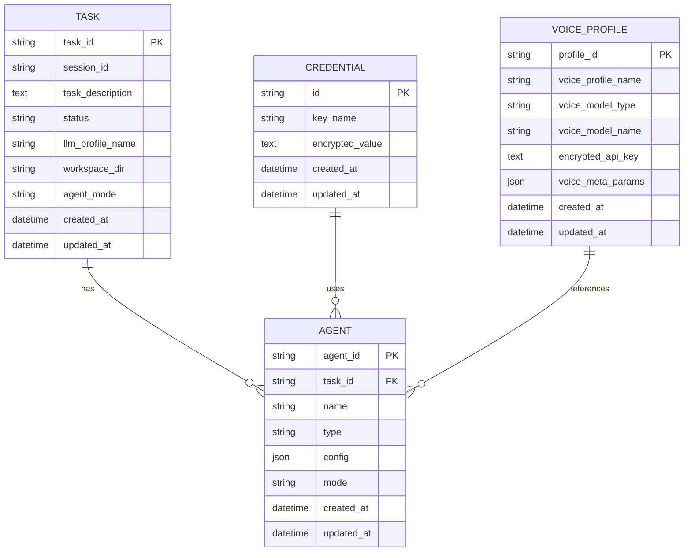

# 代理模型

<cite>
**本文档引用的文件**
- [models.py](file://vibe_surf/backend/database/models.py)
- [schemas.py](file://vibe_surf/backend/database/schemas.py)
- [vibe_surf_agent.py](file://vibe_surf/agents/vibe_surf_agent.py)
- [browser_use_agent.py](file://vibe_surf/agents/browser_use_agent.py)
- [report_writer_agent.py](file://vibe_surf/agents/report_writer_agent.py)
- [task.py](file://vibe_surf/backend/api/task.py)
- [v002_add_agent_mode.sql](file://vibe_surf/backend/database/migrations/v002_add_agent_mode.sql)
</cite>

## 目录
1. [代理模型字段定义](#代理模型字段定义)
2. [代理模式实现方式](#代理模式实现方式)
3. [代理与任务、凭证、语音配置文件的关系](#代理与任务凭证语音配置文件的关系)
4. [代理配置的JSON结构和验证规则](#代理配置的json结构和验证规则)
5. [Pydantic Schema与数据库模型的对应关系](#pydantic-schema与数据库模型的对应关系)
6. [代码示例](#代码示例)
7. [索引策略和查询性能优化](#索引策略和查询性能优化)

## 代理模型字段定义

代理模型的核心字段定义在数据库模型和API请求模型中。主要字段包括：

- **id**: 唯一标识符，使用UUID7字符串格式，作为主键
- **name**: 代理名称，字符串类型，最大长度100个字符，必须唯一
- **type**: 代理类型，字符串类型，用于区分不同类型的代理（如browser_use、report_writer等）
- **config**: 配置信息，存储为JSON格式，包含代理的特定配置参数
- **mode**: 代理模式，字符串类型，表示代理的执行模式（如thinking、direct等）
- **created_at**: 创建时间，DateTime类型，记录代理创建的时间戳
- **updated_at**: 更新时间，DateTime类型，记录代理最后更新的时间戳
- **is_active**: 活动状态，布尔类型，表示代理是否处于激活状态
- **description**: 描述信息，文本类型，用于存储代理的详细描述

这些字段在`vibe_surf/backend/database/models.py`中的`Task`模型和相关配置模型中定义，确保了数据的完整性和一致性。

**Section sources**
- [models.py](file://vibe_surf/backend/database/models.py#L98-L137)

## 代理模式实现方式

代理模式的实现主要通过`agent_mode`字段来控制，该字段在数据库迁移脚本`v002_add_agent_mode.sql`中被添加到`tasks`表中，默认值为'thinking'。代理模式决定了代理在执行任务时的行为方式：

- **thinking模式**: 代理在执行每个动作前会进行思考，生成详细的执行计划。这种模式适用于复杂任务，需要代理进行深度推理和规划。
- **direct模式**: 代理直接执行动作，不进行额外的思考过程。这种模式适用于简单、直接的任务，可以提高执行效率。
- **flash模式**: 一种快速执行模式，结合了thinking和direct模式的特点，适用于需要快速响应的场景。

代理模式的配置结构在`VibeSurfAgentSettings`类中定义，包含了`agent_mode`字段以及其他相关设置，如`use_vision`、`max_failures`等，这些设置共同决定了代理的行为特征。

**Section sources**
- [v002_add_agent_mode.sql](file://vibe_surf/backend/database/migrations/v002_add_agent_mode.sql#L1-L6)
- [vibe_surf_agent.py](file://vibe_surf/agents/vibe_surf_agent.py#L59-L75)

## 代理与任务、凭证、语音配置文件的关系

代理模型与任务、凭证、语音配置文件之间存在明确的关系映射：

- **与任务的关系**: 代理通过`task_id`与任务关联，每个代理实例对应一个具体的任务。任务的状态（如PENDING、RUNNING、COMPLETED等）反映了代理的执行状态。代理在执行过程中会更新任务的状态和结果。
- **与凭证的关系**: 代理通过`Credential`模型访问加密的API密钥和其他敏感数据。凭证模型中的`key_name`字段用于标识不同的凭证，代理在需要时通过密钥名称获取相应的凭证信息。
- **与语音配置文件的关系**: 代理通过`VoiceProfile`模型管理语音模型的配置。语音配置文件包含了语音模型的类型（ASR或TTS）、模型名称、加密的API密钥等信息。代理在需要语音功能时，会引用相应的语音配置文件。

这些关系在数据库模型中通过外键和引用字段实现，确保了数据的一致性和完整性。



**Diagram sources**
- [models.py](file://vibe_surf/backend/database/models.py#L94-L137)
- [models.py](file://vibe_surf/backend/database/models.py#L217-L234)
- [models.py](file://vibe_surf/backend/database/models.py#L29-L55)

## 代理配置的JSON结构和验证规则

代理配置的JSON结构在`vibe_surf/backend/database/schemas.py`中定义，使用Pydantic模型进行验证。主要的配置结构包括：

- **TaskMetadata**: 用于验证`Task.task_metadata`字段，包含执行摘要、结果摘要、控制状态历史等信息。
- **LLMConfiguration**: 用于验证LLM配置，包含模型名称、基础URL、温度、最大令牌数等参数。
- **ControllerConfiguration**: 用于验证控制器配置，包含动作控制、输出配置、错误处理等设置。
- **McpServerConfig**: 用于验证MCP服务器配置，包含服务器参数等信息。

验证规则通过`validate_json_field`函数实现，该函数根据配置类型选择相应的Pydantic模型进行验证和规范化。验证过程确保了配置数据的完整性和正确性，防止无效或不一致的数据进入系统。

**Section sources**
- [schemas.py](file://vibe_surf/backend/database/schemas.py#L11-L100)

## Pydantic Schema与数据库模型的对应关系

Pydantic Schema与数据库模型之间存在明确的对应关系，确保了数据在不同层之间的正确转换和验证：

- **AgentCreate**: 对应数据库中的`Task`模型，用于创建新代理时的请求验证。包含`task_description`、`llm_profile_name`、`agent_mode`等字段。
- **AgentUpdate**: 对应数据库中的`Task`模型，用于更新代理配置时的请求验证。包含可更新的字段，如`task_description`、`agent_mode`等。
- **AgentResponse**: 对应数据库中的`Task`模型，用于返回代理信息时的响应格式。包含所有代理字段，包括`task_id`、`status`、`created_at`等。

这些Schema定义在`vibe_surf/backend/api/models.py`中，通过Pydantic的`Field`和`BaseModel`类实现，确保了数据的类型安全和验证。

**Section sources**
- [models.py](file://vibe_surf/backend/database/models.py#L94-L137)
- [task.py](file://vibe_surf/backend/api/task.py#L17-L18)

## 代码示例

以下是创建不同类型的代理、查询代理列表和更新代理配置的代码示例：

### 创建浏览器使用代理
```python
from vibe_surf.agents.browser_use_agent import BrowserUseAgent
from browser_use.llm.openai.chat import ChatOpenAI

# 创建LLM实例
llm = ChatOpenAI(model='gpt-4.1-mini')

# 创建浏览器使用代理
agent = BrowserUseAgent(
    task="在Google上搜索VibeSurf项目",
    llm=llm,
    agent_mode="thinking",
    use_vision=True,
    max_failures=3
)

# 运行代理
result = await agent.run(max_steps=10)
```

### 创建报告生成代理
```python
from vibe_surf.agents.report_writer_agent import ReportWriterAgent
from browser_use.llm.openai.chat import ChatOpenAI

# 创建LLM实例
llm = ChatOpenAI(model='gpt-4.1-mini')

# 创建报告生成代理
report_writer = ReportWriterAgent(
    llm=llm,
    workspace_dir="./workspace",
    use_thinking=True
)

# 生成报告
report_data = {
    "report_task": "生成关于VibeSurf项目的详细报告",
    "report_information": {"project": "VibeSurf", "version": "1.0.0"}
}
result = await report_writer.generate_report(report_data)
```

### 查询代理列表
```python
from vibe_surf.backend.database.queries import TaskQueries
from sqlalchemy.ext.asyncio import AsyncSession

async def get_agent_list(db: AsyncSession):
    # 查询所有任务（代理）
    tasks = await TaskQueries.get_all_tasks(db)
    return [
        {
            "task_id": task.task_id,
            "status": task.status.value,
            "llm_profile": task.llm_profile_name,
            "created_at": task.created_at
        }
        for task in tasks
    ]
```

### 更新代理配置
```python
from vibe_surf.backend.database.queries import TaskQueries
from sqlalchemy.ext.asyncio import AsyncSession

async def update_agent_config(db: AsyncSession, task_id: str, new_mode: str):
    # 更新代理模式
    await TaskQueries.update_task_agent_mode(db, task_id, new_mode)
    await db.commit()
```

**Section sources**
- [browser_use_agent.py](file://vibe_surf/agents/browser_use_agent.py#L83-L800)
- [report_writer_agent.py](file://vibe_surf/agents/report_writer_agent.py#L34-L581)
- [task.py](file://vibe_surf/backend/api/task.py#L43-L146)

## 索引策略和查询性能优化建议

为了优化代理模型的查询性能，数据库中实施了以下索引策略：

- **任务状态索引**: 在`tasks`表的`status`字段上创建索引，加速按状态查询任务的速度。
- **会话ID索引**: 在`tasks`表的`session_id`字段上创建索引，提高按会话查询任务的效率。
- **LLM配置文件索引**: 在`tasks`表的`llm_profile_name`字段上创建索引，加快按LLM配置文件查询任务的速度。
- **创建时间索引**: 在`tasks`表的`created_at`字段上创建索引，优化按时间范围查询任务的性能。

这些索引在`vibe_surf/backend/database/models.py`中通过`Index`类定义，确保了关键查询的高效执行。此外，建议在高并发场景下使用缓存机制，如Redis，来进一步提升查询性能。

**Section sources**
- [models.py](file://vibe_surf/backend/database/models.py#L158-L167)