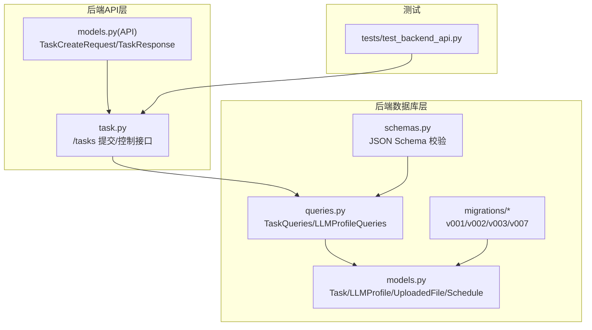
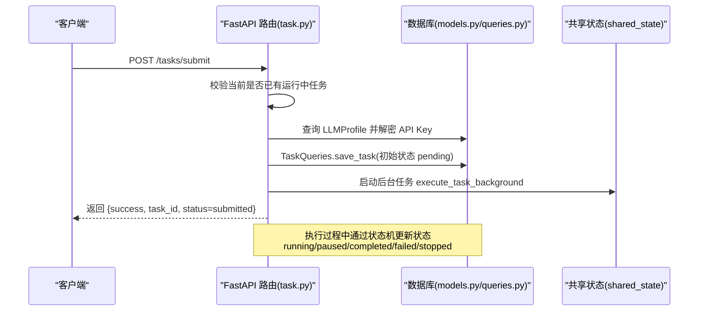
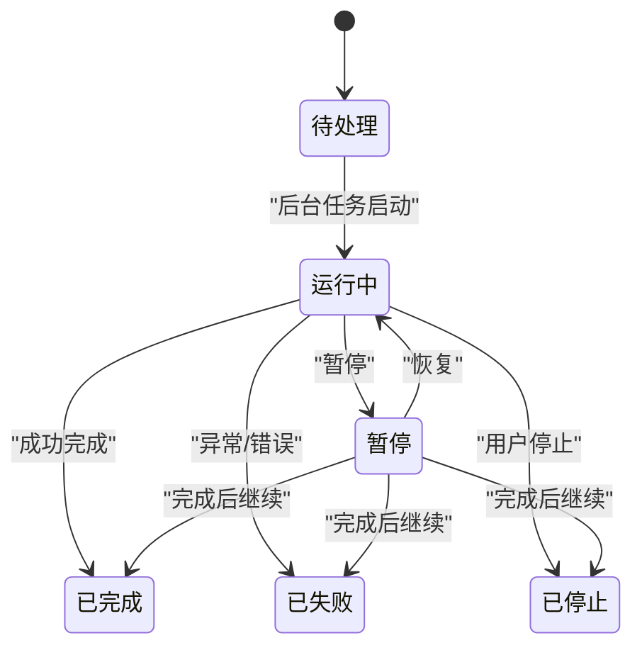
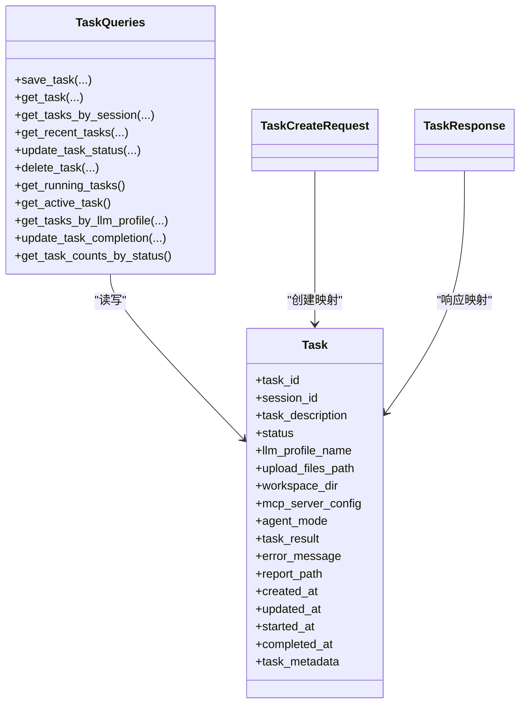

# 任务模型

<cite>
**本文引用的文件**
- [models.py](file://vibe_surf/backend/database/models.py)
- [schemas.py](file://vibe_surf/backend/database/schemas.py)
- [queries.py](file://vibe_surf/backend/database/queries.py)
- [task.py](file://vibe_surf/backend/api/task.py)
- [models.py（API）](file://vibe_surf/backend/api/models.py)
- [v001_initial_schema.sql](file://vibe_surf/backend/database/migrations/v001_initial_schema.sql)
- [v002_add_agent_mode.sql](file://vibe_surf/backend/database/migrations/v002_add_agent_mode.sql)
- [v003_fix_task_status_case.sql](file://vibe_surf/backend/database/migrations/v003_fix_task_status_case.sql)
- [v007_add_schedule_table.sql](file://vibe_surf/backend/database/migrations/v007_add_schedule_table.sql)
- [test_backend_api.py](file://tests/test_backend_api.py)
</cite>

## 目录
1. [简介](#简介)
2. [项目结构](#项目结构)
3. [核心组件](#核心组件)
4. [架构总览](#架构总览)
5. [详细组件分析](#详细组件分析)
6. [依赖关系分析](#依赖关系分析)
7. [性能考量](#性能考量)
8. [故障排查指南](#故障排查指南)
9. [结论](#结论)
10. [附录](#附录)

## 简介
本文件系统性地文档化 VibeSurf 的任务模型（Task），覆盖字段定义、数据类型与约束、状态机、与 Agent/BrowserSession/Schedule 的关系映射、Pydantic Schema 与数据库模型的对应关系，并提供 ORM 使用示例路径与索引策略建议，帮助开发者快速理解并正确使用任务模型。

## 项目结构
围绕任务模型的关键文件组织如下：
- 数据库模型与枚举：backend/database/models.py
- JSON Schema 校验：backend/database/schemas.py
- 查询与事务：backend/database/queries.py
- API 控制与提交：backend/api/task.py
- API 请求/响应模型：backend/api/models.py
- 数据迁移：backend/database/migrations/*
- 测试用例：tests/test_backend_api.py

图表来源
- [models.py](file://vibe_surf/backend/database/models.py#L94-L136)
- [schemas.py](file://vibe_surf/backend/database/schemas.py#L1-L100)
- [queries.py](file://vibe_surf/backend/database/queries.py#L441-L754)
- [task.py](file://vibe_surf/backend/api/task.py#L43-L146)
- [models.py（API）](file://vibe_surf/backend/api/models.py#L101-L177)
- [v001_initial_schema.sql](file://vibe_surf/backend/database/migrations/v001_initial_schema.sql#L30-L49)
- [v002_add_agent_mode.sql](file://vibe_surf/backend/database/migrations/v002_add_agent_mode.sql#L1-L6)
- [v003_fix_task_status_case.sql](file://vibe_surf/backend/database/migrations/v003_fix_task_status_case.sql#L1-L11)
- [v007_add_schedule_table.sql](file://vibe_surf/backend/database/migrations/v007_add_schedule_table.sql#L1-L29)
- [test_backend_api.py](file://tests/test_backend_api.py#L302-L325)

章节来源
- [models.py](file://vibe_surf/backend/database/models.py#L94-L136)
- [queries.py](file://vibe_surf/backend/database/queries.py#L441-L754)
- [task.py](file://vibe_surf/backend/api/task.py#L43-L146)
- [models.py（API）](file://vibe_surf/backend/api/models.py#L101-L177)
- [v001_initial_schema.sql](file://vibe_surf/backend/database/migrations/v001_initial_schema.sql#L30-L49)
- [v002_add_agent_mode.sql](file://vibe_surf/backend/database/migrations/v002_add_agent_mode.sql#L1-L6)
- [v003_fix_task_status_case.sql](file://vibe_surf/backend/database/migrations/v003_fix_task_status_case.sql#L1-L11)
- [v007_add_schedule_table.sql](file://vibe_surf/backend/database/migrations/v007_add_schedule_table.sql#L1-L29)
- [test_backend_api.py](file://tests/test_backend_api.py#L302-L325)

## 核心组件
- Task 模型：任务实体，包含会话标识、描述、状态、LLM 配置引用、文件上传路径、工作空间目录、MCP 配置、执行模式、结果与错误信息、时间戳以及元数据。
- TaskStatus 枚举：任务状态集合，统一为小写字符串值。
- TaskQueries：对 Task 表的增删改查、状态变更、聚合统计等操作。
- API 层：/tasks 接口负责提交任务、暂停/恢复/停止任务、查询状态；TaskCreateRequest/TaskResponse 定义请求与响应模型。
- JSON Schema：对 task_metadata、llm_configuration、mcp_server_config 等 JSON 字段进行校验与规范化。
- 迁移脚本：v001 初始表结构，v002 增加 agent_mode，v003 规范状态大小写，v007 新增 schedules 表。

章节来源
- [models.py](file://vibe_surf/backend/database/models.py#L16-L24)
- [models.py](file://vibe_surf/backend/database/models.py#L94-L136)
- [queries.py](file://vibe_surf/backend/database/queries.py#L441-L754)
- [task.py](file://vibe_surf/backend/api/task.py#L43-L146)
- [models.py（API）](file://vibe_surf/backend/api/models.py#L101-L177)
- [schemas.py](file://vibe_surf/backend/database/schemas.py#L1-L100)
- [v001_initial_schema.sql](file://vibe_surf/backend/database/migrations/v001_initial_schema.sql#L30-L49)
- [v002_add_agent_mode.sql](file://vibe_surf/backend/database/migrations/v002_add_agent_mode.sql#L1-L6)
- [v003_fix_task_status_case.sql](file://vibe_surf/backend/database/migrations/v003_fix_task_status_case.sql#L1-L11)
- [v007_add_schedule_table.sql](file://vibe_surf/backend/database/migrations/v007_add_schedule_table.sql#L1-L29)

## 架构总览
任务模型在系统中的位置与交互如下：

图表来源
- [task.py](file://vibe_surf/backend/api/task.py#L43-L146)
- [queries.py](file://vibe_surf/backend/database/queries.py#L441-L519)
- [models.py](file://vibe_surf/backend/database/models.py#L94-L136)

## 详细组件分析

### Task 字段定义与约束
- 主键与标识
  - task_id：字符串，主键，UUID7 字符串
  - session_id：字符串，非空，用于关联会话
- 任务定义
  - task_description：文本，非空
  - status：枚举，取值来自 TaskStatus，初始默认 pending
- 配置与引用
  - llm_profile_name：字符串，非空，引用 LLMProfile.profile_name
  - mcp_server_config：文本，存储 JSON 字符串形式的 MCP 配置
  - agent_mode：字符串，默认 'thinking'，支持 'thinking'/'direct' 等
- 文件与工作空间
  - upload_files_path：字符串，可空
  - workspace_dir：字符串，可空
- 结果与错误
  - task_result：文本，可空
  - error_message：文本，可空
  - report_path：字符串，可空
- 时间戳
  - created_at：日期时间，非空，默认当前时间
  - updated_at：日期时间，非空，默认当前时间（触发器自动更新）
  - started_at：日期时间，可空
  - completed_at：日期时间，可空
- 元数据
  - task_metadata：JSON，可空

约束与索引
- 状态检查约束：仅允许枚举值集合
- 索引：idx_tasks_status、idx_tasks_session、idx_tasks_llm_profile、idx_tasks_created

章节来源
- [models.py](file://vibe_surf/backend/database/models.py#L94-L136)
- [v001_initial_schema.sql](file://vibe_surf/backend/database/migrations/v001_initial_schema.sql#L30-L49)
- [v003_fix_task_status_case.sql](file://vibe_surf/backend/database/migrations/v003_fix_task_status_case.sql#L1-L11)

### 任务状态机
状态集合：pending、running、paused、completed、failed、stopped  
状态流转规则（基于实现逻辑总结）：
- 创建：初始状态 pending
- 提交后：进入 running（由 API 层提交时保存 pending，后台任务启动后由查询层更新为 running）
- 暂停：由外部控制接口触发，状态切换为 paused
- 恢复：从 paused 恢复为 running
- 完成：成功执行完成后设置 completed，同时写入 completed_at
- 失败：异常或错误时设置 failed，同时写入 completed_at
- 停止：用户强制停止时设置 stopped，同时写入 completed_at

图表来源
- [queries.py](file://vibe_surf/backend/database/queries.py#L614-L734)
- [task.py](file://vibe_surf/backend/api/task.py#L197-L303)

章节来源
- [queries.py](file://vibe_surf/backend/database/queries.py#L614-L734)
- [task.py](file://vibe_surf/backend/api/task.py#L197-L303)

### 与 Agent、BrowserSession、Schedule 的关系映射
- 与 Agent
  - 任务通过 llm_profile_name 引用 LLM 配置，Agent 在执行前会初始化并验证该配置可用性
  - 控制接口（暂停/恢复/停止）通过共享状态中的 Agent 实例进行操作
- 与 BrowserSession
  - 任务通过 session_id 关联会话，便于按会话维度查询任务历史与活动
  - 前端扩展通过 session_id 获取会话下的任务列表与活动日志
- 与 Schedule
  - Schedule 表独立存在，用于工作流调度，与 Task 表无直接外键关联，但可通过业务逻辑配合使用

章节来源
- [task.py](file://vibe_surf/backend/api/task.py#L43-L146)
- [queries.py](file://vibe_surf/backend/database/queries.py#L534-L567)
- [v007_add_schedule_table.sql](file://vibe_surf/backend/database/migrations/v007_add_schedule_table.sql#L1-L29)

### Pydantic Schema 与数据库模型对应关系
- TaskCreateRequest（API 请求）
  - 字段：session_id、task_description、llm_profile_name、upload_files_path、mcp_server_config、agent_mode
  - 对应数据库：Task.session_id、Task.task_description、Task.llm_profile_name、Task.upload_files_path、Task.mcp_server_config、Task.agent_mode
- TaskResponse（API 响应）
  - 字段：task_id、session_id、task_description、status、llm_profile_name、upload_files_path、workspace_dir、mcp_server_config、agent_mode、task_result、error_message、report_path、created_at、updated_at、started_at、completed_at、task_metadata
  - 映射：Task.* 字段，其中 status 使用枚举值字符串
- JSON Schema
  - task_metadata：Task.task_metadata（JSON）
  - llm_configuration：Task.mcp_server_config（JSON 字符串，存储 LLM 配置）
  - mcp_server_config：Task.mcp_server_config（JSON 字符串，存储 MCP 服务器配置）

章节来源
- [models.py（API）](file://vibe_surf/backend/api/models.py#L101-L177)
- [schemas.py](file://vibe_surf/backend/database/schemas.py#L1-L100)
- [models.py](file://vibe_surf/backend/database/models.py#L94-L136)

### ORM 使用示例（代码路径）
以下为常见操作的实现入口路径（不直接展示代码内容）：
- 创建新任务
  - API 提交：POST /tasks/submit
  - ORM 调用：TaskQueries.save_task(...)
  - 参考路径
    - [提交接口](file://vibe_surf/backend/api/task.py#L43-L146)
    - [保存任务实现](file://vibe_surf/backend/database/queries.py#L441-L519)
- 查询任务列表
  - 按会话查询：TaskQueries.get_tasks_by_session(...)
  - 最近任务：TaskQueries.get_recent_tasks(...)
  - 参考路径
    - [按会话查询](file://vibe_surf/backend/database/queries.py#L534-L567)
    - [最近任务](file://vibe_surf/backend/database/queries.py#L555-L567)
- 更新任务状态
  - TaskQueries.update_task_status(...)
  - TaskQueries.update_task_completion(...)
  - 参考路径
    - [更新状态](file://vibe_surf/backend/database/queries.py#L614-L648)
    - [完成更新](file://vibe_surf/backend/database/queries.py#L704-L734)
- 删除任务
  - TaskQueries.delete_task(...)
  - 参考路径
    - [删除任务](file://vibe_surf/backend/database/queries.py#L649-L658)
- 控制任务（暂停/恢复/停止）
  - /tasks/pause、/tasks/resume、/tasks/stop
  - 参考路径
    - [暂停](file://vibe_surf/backend/api/task.py#L197-L230)
    - [恢复](file://vibe_surf/backend/api/task.py#L232-L264)
    - [停止](file://vibe_surf/backend/api/task.py#L266-L303)

章节来源
- [task.py](file://vibe_surf/backend/api/task.py#L43-L146)
- [queries.py](file://vibe_surf/backend/database/queries.py#L441-L754)
- [models.py（API）](file://vibe_surf/backend/api/models.py#L101-L177)

### 索引策略与查询性能优化建议
- 现有索引
  - idx_tasks_status、idx_tasks_session、idx_tasks_llm_profile、idx_tasks_created
- 建议新增索引
  - 按 llm_profile_name 查询任务：已存在 idx_tasks_llm_profile
  - 按 created_at 聚合统计：已存在 idx_tasks_created
  - 按 session_id 分页查询：已存在 idx_tasks_session
- 性能优化点
  - 使用分页参数 limit/offset 控制返回量
  - 聚合统计使用 group by + count，避免全表扫描
  - 对频繁过滤字段（status、session_id、llm_profile_name）保持索引
  - 对 JSON 字段（task_metadata、mcp_server_config）避免在 WHERE 中做复杂解析，必要时拆分冗余列或使用虚拟列

章节来源
- [models.py](file://vibe_surf/backend/database/models.py#L157-L167)
- [queries.py](file://vibe_surf/backend/database/queries.py#L571-L612)
- [v001_initial_schema.sql](file://vibe_surf/backend/database/migrations/v001_initial_schema.sql#L85-L89)

## 依赖关系分析

图表来源
- [models.py](file://vibe_surf/backend/database/models.py#L94-L136)
- [queries.py](file://vibe_surf/backend/database/queries.py#L441-L754)
- [models.py（API）](file://vibe_surf/backend/api/models.py#L101-L177)

章节来源
- [models.py](file://vibe_surf/backend/database/models.py#L94-L136)
- [queries.py](file://vibe_surf/backend/database/queries.py#L441-L754)
- [models.py（API）](file://vibe_surf/backend/api/models.py#L101-L177)

## 性能考量
- 查询路径
  - 按会话分页查询：使用 session_id + created_at 组合索引
  - 按 LLM 配置名查询：使用 llm_profile_name 索引
  - 聚合统计：按 status 分组计数，利用索引减少扫描
- 写入路径
  - 状态更新时自动写入 started_at/completed_at，避免额外查询
  - JSON 字段以字符串存储，避免复杂 JSON 解析开销
- 缓存与并发
  - 建议在应用层对热点任务状态进行短期缓存
  - 控制接口幂等性与并发安全（如同一会话只允许一个运行中任务）

[本节为通用指导，无需具体文件引用]

## 故障排查指南
- 提交任务失败
  - 检查是否存在运行中任务（/tasks/status）
  - 校验 LLM 配置是否有效且可连接
  - 查看数据库保存是否成功（TaskQueries.save_task）
- 状态不一致
  - 确认状态机流转是否符合预期（pause/resume/stop）
  - 检查 started_at/completed_at 是否正确更新
- 查询异常
  - 确认 session_id、llm_profile_name 等过滤字段是否带索引
  - 检查 limit/offset 参数是否合理

章节来源
- [task.py](file://vibe_surf/backend/api/task.py#L34-L41)
- [task.py](file://vibe_surf/backend/api/task.py#L154-L195)
- [queries.py](file://vibe_surf/backend/database/queries.py#L614-L734)
- [test_backend_api.py](file://tests/test_backend_api.py#L302-L325)

## 结论
Task 模型通过清晰的字段划分、严格的枚举约束与完善的索引策略，支撑了任务生命周期管理与多会话场景下的高效查询。结合 API 控制接口与 JSON Schema 校验，系统在易用性与一致性之间取得良好平衡。建议在生产环境中持续监控状态更新与查询性能，并根据业务增长调整索引与缓存策略。

[本节为总结，无需具体文件引用]

## 附录

### 字段对照表（Task <-> Pydantic/JSON Schema）
- task_id：Task.task_id <-> TaskResponse.task_id
- session_id：Task.session_id <-> TaskCreateRequest.session_id
- task_description：Task.task_description <-> TaskCreateRequest.task_description
- status：Task.status <-> TaskResponse.status（枚举字符串）
- llm_profile_name：Task.llm_profile_name <-> TaskCreateRequest.llm_profile_name
- upload_files_path：Task.upload_files_path <-> TaskCreateRequest.upload_files_path
- workspace_dir：Task.workspace_dir <-> TaskResponse.workspace_dir
- mcp_server_config：Task.mcp_server_config <-> TaskCreateRequest.mcp_server_config
- agent_mode：Task.agent_mode <-> TaskCreateRequest.agent_mode
- task_result：Task.task_result <-> TaskResponse.task_result
- error_message：Task.error_message <-> TaskResponse.error_message
- report_path：Task.report_path <-> TaskResponse.report_path
- created_at/updated_at：Task.created_at/updated_at <-> TaskResponse.created_at/updated_at
- started_at/completed_at：Task.started_at/Task.completed_at <-> TaskResponse.started_at/TaskResponse.completed_at
- task_metadata：Task.task_metadata <-> TaskResponse.task_metadata

章节来源
- [models.py](file://vibe_surf/backend/database/models.py#L94-L136)
- [models.py（API）](file://vibe_surf/backend/api/models.py#L101-L177)
- [schemas.py](file://vibe_surf/backend/database/schemas.py#L1-L100)