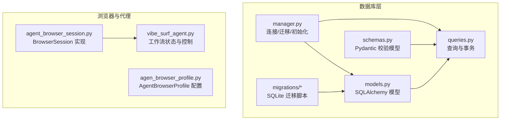
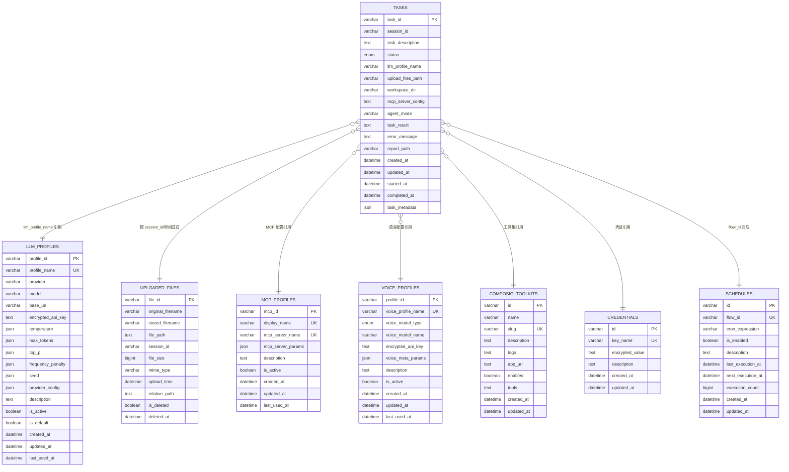
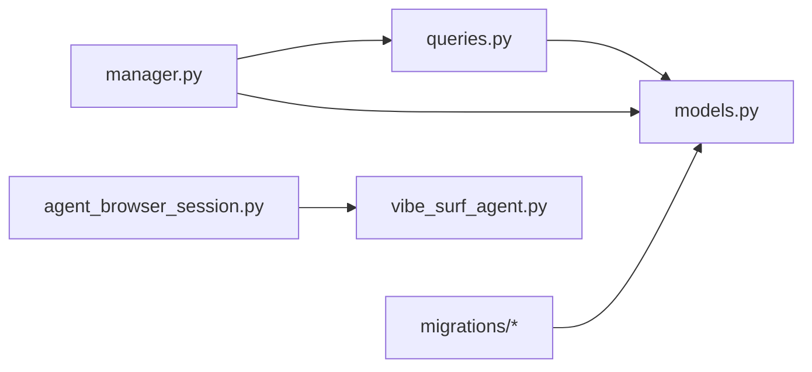

# 数据模型

<cite>
**本文引用的文件**
- [models.py](file://vibe_surf/backend/database/models.py)
- [schemas.py](file://vibe_surf/backend/database/schemas.py)
- [queries.py](file://vibe_surf/backend/database/queries.py)
- [manager.py](file://vibe_surf/backend/database/manager.py)
- [v001_initial_schema.sql](file://vibe_surf/backend/database/migrations/v001_initial_schema.sql)
- [v006_add_credentials_table.sql](file://vibe_surf/backend/database/migrations/v006_add_credentials_table.sql)
- [v007_add_schedule_table.sql](file://vibe_surf/backend/database/migrations/v007_add_schedule_table.sql)
- [agent_browser_session.py](file://vibe_surf/browser/agent_browser_session.py)
- [agen_browser_profile.py](file://vibe_surf/browser/agen_browser_profile.py)
- [vibe_surf_agent.py](file://vibe_surf/agents/vibe_surf_agent.py)
</cite>

## 目录
1. [简介](#简介)
2. [项目结构](#项目结构)
3. [核心组件](#核心组件)
4. [架构总览](#架构总览)
5. [详细组件分析](#详细组件分析)
6. [依赖分析](#依赖分析)
7. [性能考虑](#性能考虑)
8. [故障排查指南](#故障排查指南)
9. [结论](#结论)

## 简介
本文件系统性梳理 VibeSurf 后端数据模型，聚焦于核心实体：任务(Task)、代理(此处为应用层概念，非数据库模型)、凭证(Credentials)、计划(Schedule)、浏览器会话(BrowserSession)。文档覆盖 SQLAlchemy 模型字段定义、数据类型、关系映射与约束；同时说明 Pydantic 模型与数据库 JSON 字段的对应关系；通过 ERD 图展示实体间关联；并提供创建、查询、更新等操作的代码路径指引与性能优化建议。

## 项目结构
后端数据库模型位于 vibe_surf/backend/database，包含：
- models.py：定义 SQLAlchemy ORM 模型（含 Task、LLMProfile、McpProfile、VoiceProfile、ComposioToolkit、Credential、Schedule、UploadedFile）
- schemas.py：定义 Pydantic 模型用于校验 JSON 字段（如 TaskMetadata、LLMConfiguration、McpServerConfig 等）
- queries.py：封装 CRUD 与聚合查询（如 TaskQueries、LLMProfileQueries、UploadedFileQueries）
- manager.py：数据库连接、迁移与初始化管理
- migrations：SQLite 迁移脚本，定义各版本表结构与索引

图表来源
- [models.py](file://vibe_surf/backend/database/models.py#L1-L289)
- [schemas.py](file://vibe_surf/backend/database/schemas.py#L1-L100)
- [queries.py](file://vibe_surf/backend/database/queries.py#L1-L800)
- [manager.py](file://vibe_surf/backend/database/manager.py#L1-L319)
- [v001_initial_schema.sql](file://vibe_surf/backend/database/migrations/v001_initial_schema.sql#L1-L118)
- [agent_browser_session.py](file://vibe_surf/browser/agent_browser_session.py#L1-L800)
- [agen_browser_profile.py](file://vibe_surf/browser/agen_browser_profile.py#L1-L137)
- [vibe_surf_agent.py](file://vibe_surf/agents/vibe_surf_agent.py#L1-L800)

章节来源
- [models.py](file://vibe_surf/backend/database/models.py#L1-L289)
- [schemas.py](file://vibe_surf/backend/database/schemas.py#L1-L100)
- [queries.py](file://vibe_surf/backend/database/queries.py#L1-L800)
- [manager.py](file://vibe_surf/backend/database/manager.py#L1-L319)
- [v001_initial_schema.sql](file://vibe_surf/backend/database/migrations/v001_initial_schema.sql#L1-L118)

## 核心组件
本节概述数据库层五大核心实体及其职责：
- 任务(Task)：承载一次执行的工作单元，包含描述、状态、结果、错误信息、工作目录、上传文件路径、MCP 配置、LLM 配置引用等。
- 凭证(Credentials)：存储加密后的敏感键值，如第三方服务 API Key。
- 计划(Schedule)：基于 Cron 的工作流调度，记录启用状态、下次执行时间、执行计数等。
- 浏览器会话(BrowserSession)：应用层概念，非 SQLAlchemy 模型，但与任务生命周期强关联，负责浏览器连接、标签页管理、事件分发等。
- 代理(此处为应用层概念)：由 vibe_surf_agent.py 定义的状态机与节点流程，不直接对应数据库模型，但与任务、浏览器会话协同工作。

章节来源
- [models.py](file://vibe_surf/backend/database/models.py#L94-L137)
- [models.py](file://vibe_surf/backend/database/models.py#L217-L235)
- [models.py](file://vibe_surf/backend/database/models.py#L258-L284)
- [agent_browser_session.py](file://vibe_surf/browser/agent_browser_session.py#L1-L800)
- [vibe_surf_agent.py](file://vibe_surf/agents/vibe_surf_agent.py#L1-L800)

## 架构总览
下图展示数据库模型间的 ER 关系与约束要点（基于 models.py 中的字段与索引）：

图表来源
- [models.py](file://vibe_surf/backend/database/models.py#L1-L289)

章节来源
- [models.py](file://vibe_surf/backend/database/models.py#L1-L289)

## 详细组件分析

### 任务(Task)
- 表名：tasks
- 主键：task_id（UUID 字符串）
- 关键字段与类型
  - session_id：varchar(36)，非空，用于会话级聚合与查询
  - task_description：text，非空，任务描述
  - status：枚举，取值 pending/running/paused/completed/failed/stopped，默认 pending
  - llm_profile_name：varchar(100)，非空，引用 LLMProfile.profile_name
  - upload_files_path/workspace_dir：varchar(500)，可空，分别指向上传文件路径与工作目录
  - mcp_server_config：text，可空，JSON 字符串，存储 MCP 服务器配置
  - agent_mode：varchar(50)，默认 "thinking"
  - task_result/error_message/report_path：text/varchar(500)/text，可空，结果与错误信息
  - created_at/updated_at/started_at/completed_at：datetime，时间戳
  - task_metadata：json，可空，附加上下文
- 约束与索引
  - 状态检查约束（CHECK）
  - 索引：idx_tasks_status、idx_tasks_session、idx_tasks_llm_profile、idx_tasks_created
- 关系映射
  - 与 LLMProfile：一对多（一个 LLM 配置可被多个任务引用）
  - 与 UploadedFile：按 session_id 与 upload_time 组合索引，便于会话内文件检索
  - 与 McpProfile：通过 mcp_server_config JSON 字段引用
  - 与 Schedule：通过 flow_id 建立一对一（每 flow 仅一个计划）
- 典型操作
  - 创建/更新：参考保存接口路径
    - [保存任务](file://vibe_surf/backend/database/queries.py#L445-L519)
  - 查询
    - 按会话查询：[按会话查询](file://vibe_surf/backend/database/queries.py#L535-L551)
    - 获取最近任务：[最近任务](file://vibe_surf/backend/database/queries.py#L556-L567)
    - 获取所有会话统计：[会话聚合](file://vibe_surf/backend/database/queries.py#L572-L609)
    - 获取运行中任务：[运行中任务](file://vibe_surf/backend/database/queries.py#L660-L669)
    - 按 LLM 配置筛选：[按配置筛选](file://vibe_surf/backend/database/queries.py#L684-L700)
  - 更新状态与完成：[更新状态](file://vibe_surf/backend/database/queries.py#L614-L648)、[完成任务](file://vibe_surf/backend/database/queries.py#L705-L734)
- 与浏览器会话的关系
  - 任务通过 session_id 与浏览器会话建立逻辑关联；浏览器会话在应用层负责页面与标签页管理，任务负责执行与结果记录。

章节来源
- [models.py](file://vibe_surf/backend/database/models.py#L94-L137)
- [queries.py](file://vibe_surf/backend/database/queries.py#L445-L734)
- [v001_initial_schema.sql](file://vibe_surf/backend/database/migrations/v001_initial_schema.sql#L30-L49)

### 凭证(Credentials)
- 表名：credentials
- 主键：id（UUID 字符串）
- 关键字段
  - key_name：varchar(100)，唯一，如 "COMPOSIO_API_KEY"
  - encrypted_value：text，加密后的值
  - description：text，可空
  - created_at/updated_at：datetime
- 约束与索引
  - 索引：idx_credentials_key_name
- 用途
  - 存储第三方服务密钥等敏感信息，避免明文入库
- 典型操作
  - 创建/更新/删除/按名称查询等 CRUD 可通过通用查询封装实现（参考 queries.py 中的模式）

章节来源
- [models.py](file://vibe_surf/backend/database/models.py#L217-L235)
- [v006_add_credentials_table.sql](file://vibe_surf/backend/database/migrations/v006_add_credentials_table.sql#L1-L26)

### 计划(Schedule)
- 表名：schedules
- 主键：id（UUID 字符串）
- 关键字段
  - flow_id：varchar(36)，唯一，表示绑定的工作流标识
  - cron_expression：varchar(100)，可空，标准 Cron 表达式
  - is_enabled：boolean，默认 true
  - description：text，可空
  - last_execution_at/next_execution_at：datetime，可空
  - execution_count：bigint，默认 0
  - created_at/updated_at：datetime
- 约束与索引
  - 索引：idx_schedules_flow_id、idx_schedules_enabled、idx_schedules_next_execution、idx_schedules_cron
- 用途
  - 为工作流提供周期性调度能力，支持禁用与计数统计
- 典型操作
  - 获取启用计划：[启用计划](file://vibe_surf/backend/database/queries.py#L1-L800)
  - 更新执行时间与计数：可在业务侧按需扩展

章节来源
- [models.py](file://vibe_surf/backend/database/models.py#L258-L284)
- [v007_add_schedule_table.sql](file://vibe_surf/backend/database/migrations/v007_add_schedule_table.sql#L1-L29)

### 浏览器会话(BrowserSession)
- 说明
  - BrowserSession 是应用层概念，非 SQLAlchemy 模型，由浏览器库提供，负责与 Chromium/Chrome 的 CDP 连接、标签页管理、事件分发等。
  - 在 VibeSurf 中，BrowserSession 与任务生命周期紧密耦合：任务驱动浏览器行为，任务状态变化影响会话的启动/停止/清理。
- 关键点
  - 连接与断开：[connect](file://vibe_surf/browser/agent_browser_session.py#L171-L694)
  - 代理注册与断开：[connect_agent/disconnect_agent](file://vibe_surf/browser/agent_browser_session.py#L696-L719)
  - 会话池与目标页管理：[会话池](file://vibe_surf/browser/agent_browser_session.py#L720-L770)
  - 事件处理：[事件处理器注册](file://vibe_surf/browser/agent_browser_session.py#L771-L800)
- 与任务的关系
  - 任务通过 session_id 与浏览器会话建立逻辑关联；应用层在执行任务时创建/复用会话，并在完成后清理资源。

章节来源
- [agent_browser_session.py](file://vibe_surf/browser/agent_browser_session.py#L1-L800)
- [agen_browser_profile.py](file://vibe_surf/browser/agen_browser_profile.py#L1-L137)
- [vibe_surf_agent.py](file://vibe_surf/agents/vibe_surf_agent.py#L1-L800)

### 代理(应用层概念)
- 说明
  - 代理并非数据库模型，而是由 vibe_surf_agent.py 定义的状态机与节点流程，负责编排任务执行、浏览器任务执行、报告生成等。
- 关键点
  - 工作流节点：vibesurf_agent_node、browser_task_execution_node、report_task_execution_node 等
  - 控制态：暂停/停止/继续等控制逻辑
  - 日志与活动记录：通过回调函数记录步骤与结果

章节来源
- [vibe_surf_agent.py](file://vibe_surf/agents/vibe_surf_agent.py#L1-L800)

## 依赖分析
- 模型依赖
  - Task 依赖 LLMProfile（通过 llm_profile_name 外键引用）
  - Task 与 UploadedFile 通过 session_id/时间维度存在隐式关联（查询侧组合索引）
  - Task 与 Schedule 通过 flow_id 建立一对一
  - Task 与 McpProfile/VoiceProfile/ComposioToolkit/Credentials 通过 JSON 配置或名称引用
- 查询依赖
  - queries.py 将模型与业务操作解耦，提供统一的 CRUD 与聚合查询入口
- 运行时依赖
  - manager.py 负责数据库引擎创建、迁移应用与会话管理
  - migrations/* 提供 SQLite 初始化与演进脚本

图表来源
- [queries.py](file://vibe_surf/backend/database/queries.py#L1-L800)
- [models.py](file://vibe_surf/backend/database/models.py#L1-L289)
- [manager.py](file://vibe_surf/backend/database/manager.py#L1-L319)
- [v001_initial_schema.sql](file://vibe_surf/backend/database/migrations/v001_initial_schema.sql#L1-L118)
- [agent_browser_session.py](file://vibe_surf/browser/agent_browser_session.py#L1-L800)
- [vibe_surf_agent.py](file://vibe_surf/agents/vibe_surf_agent.py#L1-L800)

章节来源
- [queries.py](file://vibe_surf/backend/database/queries.py#L1-L800)
- [manager.py](file://vibe_surf/backend/database/manager.py#L1-L319)

## 性能考虑
- 索引策略
  - 已有关键索引：tasks.status、tasks.session_id、tasks.llm_profile_name、tasks.created_at；uploaded_files 的复合索引；profiles/schedules 的常用过滤列索引
  - 建议
    - 对高频过滤字段（如 tasks.llm_profile_name、tasks.status、uploaded_files.session_id）保持现有索引
    - 若存在大量按时间范围查询，可考虑在 tasks.created_at 上增加覆盖索引以支持排序与范围扫描
- 延迟加载与预加载
  - 对于需要跨表统计（如会话任务数）建议使用聚合查询而非 N+1 查询
  - 使用 selectinload 等策略减少多次往返（参考 queries.py 中的 selectinload 使用）
- JSON 字段校验
  - 使用 schemas.py 中的 Pydantic 模型对 JSON 字段进行严格校验，避免脏数据导致查询异常
- 迁移与版本控制
  - 仅 SQLite 支持迁移管理，生产环境建议使用 PostgreSQL/MySQL 并通过外部迁移工具维护版本

章节来源
- [models.py](file://vibe_surf/backend/database/models.py#L157-L289)
- [queries.py](file://vibe_surf/backend/database/queries.py#L1-L800)
- [manager.py](file://vibe_surf/backend/database/manager.py#L1-L319)

## 故障排查指南
- 数据库初始化失败
  - 检查数据库 URL 与工作空间路径是否正确
  - SQLite 仅支持迁移管理，若迁移失败，回退到直接建表
  - 参考：[初始化与迁移](file://vibe_surf/backend/database/manager.py#L203-L257)
- 迁移脚本问题
  - 确认迁移文件命名规范（vXXX_description.sql），并确保 user_version 正确更新
  - 参考：[迁移应用](file://vibe_surf/backend/database/manager.py#L87-L146)
- 查询异常
  - 检查 JSON 字段是否符合 schemas.py 中的模型定义
  - 使用 validate_json_field 与 get_schema_for_config_type 进行校验
  - 参考：[JSON 校验](file://vibe_surf/backend/database/schemas.py#L84-L100)
- 任务状态不一致
  - 使用 TaskQueries.update_task_status 与 update_task_completion 确保 started_at/completed_at 一致性
  - 参考：[状态更新](file://vibe_surf/backend/database/queries.py#L614-L734)

章节来源
- [manager.py](file://vibe_surf/backend/database/manager.py#L87-L146)
- [schemas.py](file://vibe_surf/backend/database/schemas.py#L84-L100)
- [queries.py](file://vibe_surf/backend/database/queries.py#L614-L734)

## 结论
本文从模型定义、关系映射、JSON 字段校验、典型操作与性能优化五个维度，系统梳理了 VibeSurf 的数据模型与相关应用层组件。Task 作为核心实体贯穿任务生命周期，Credentials 与 Schedule 分别承担安全与调度职责；BrowserSession 与 Agent 则在应用层支撑浏览器自动化与工作流编排。通过合理的索引策略与查询封装，可有效提升系统性能与稳定性。