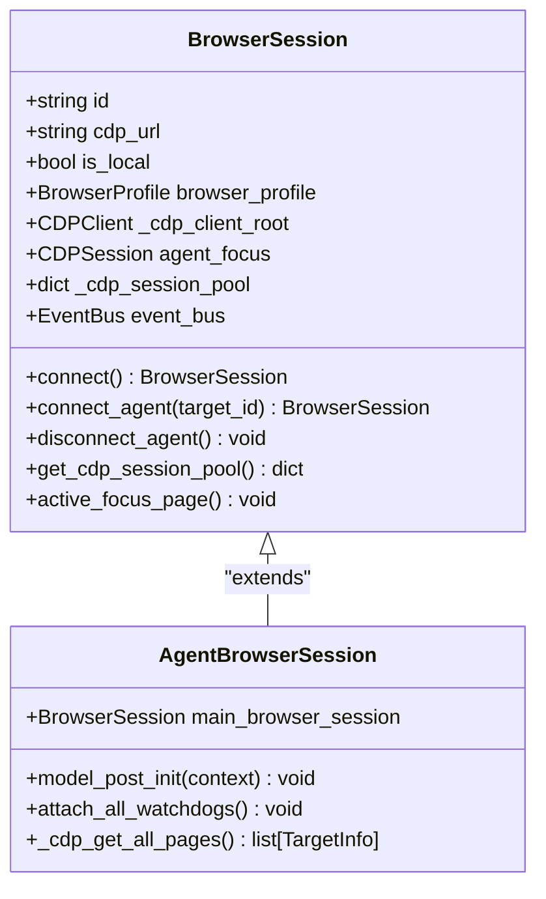
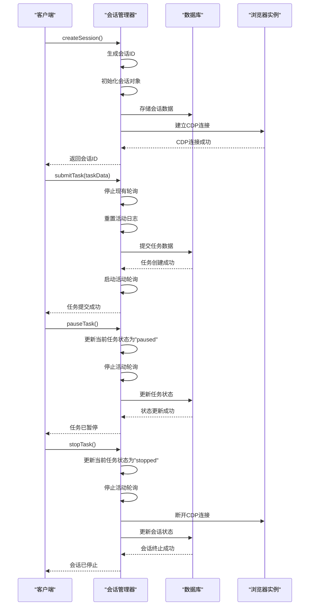
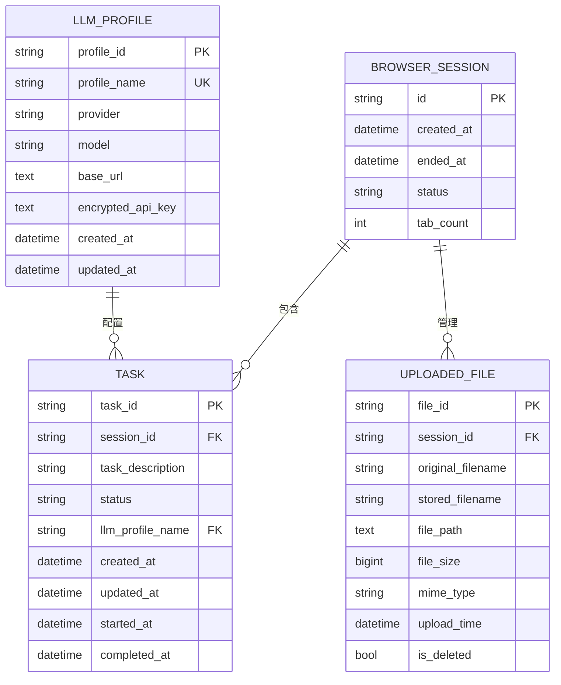
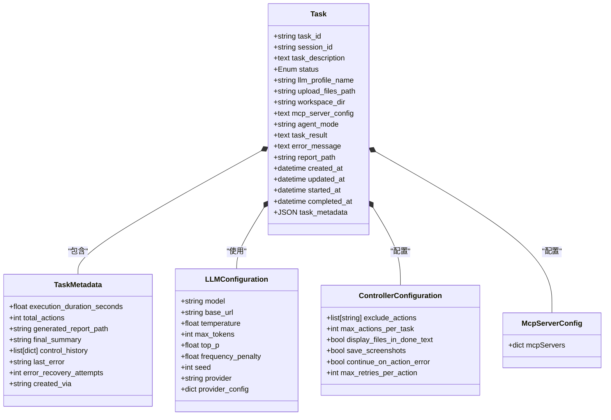
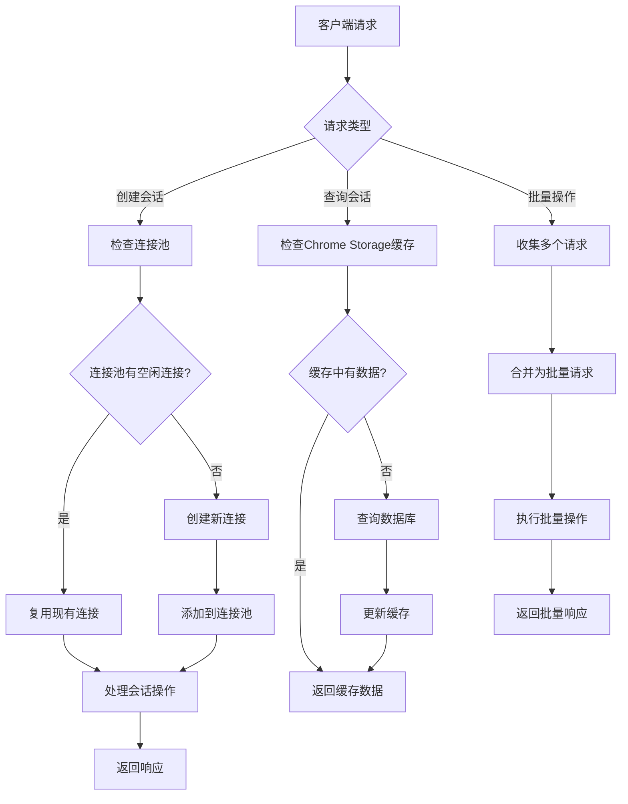

# 浏览器会话模型

<cite>
**本文档引用的文件**   
- [agent_browser_session.py](file://vibe_surf/browser/agent_browser_session.py)
- [session-manager.js](file://vibe_surf/chrome_extension/scripts/session-manager.js)
- [backend/database/models.py](file://vibe_surf/backend/database/models.py)
- [backend/database/schemas.py](file://vibe_surf/backend/database/schemas.py)
- [browser_manager.py](file://vibe_surf/browser/browser_manager.py)
- [api/browser.py](file://vibe_surf/backend/api/browser.py)
</cite>

## 目录
1. [简介](#简介)
2. [浏览器会话模型字段定义](#浏览器会话模型字段定义)
3. [会话生命周期管理](#会话生命周期管理)
4. [模型关系映射](#模型关系映射)
5. [Pydantic Schema与数据库模型对应关系](#pydantic-schema与数据库模型对应关系)
6. [代码示例](#代码示例)
7. [索引策略与性能优化](#索引策略与性能优化)
8. [结论](#结论)

## 简介

浏览器会话模型是VibeSurf系统的核心组件，负责管理浏览器实例的生命周期、状态跟踪和多代理协作。该模型通过Chrome DevTools Protocol (CDP)与浏览器进行通信，为AI代理提供安全隔离的浏览环境。会话模型不仅跟踪浏览器状态，还与任务、代理和操作日志等组件紧密集成，形成完整的自动化工作流。

**Section sources**
- [agent_browser_session.py](file://vibe_surf/browser/agent_browser_session.py#L1-L50)
- [session-manager.js](file://vibe_surf/chrome_extension/scripts/session-manager.js#L1-L50)

## 浏览器会话模型字段定义

浏览器会话模型包含多个关键字段，这些字段定义了会话的基本属性和状态信息。根据代码分析，主要字段包括：

- **id**: 会话的唯一标识符，使用UUID7字符串生成，确保全局唯一性
- **task_id**: 关联的任务ID，用于追踪会话所属的任务上下文
- **session_id**: 会话ID，与id字段类似，用于数据库和API通信中的会话标识
- **status**: 会话状态，包括"active"、"paused"、"stopped"等值，反映会话的当前运行状态
- **created_at**: 会话创建时间戳，记录会话的创建时间
- **ended_at**: 会话结束时间戳，记录会话的终止时间
- **tab_count**: 标签页计数，跟踪会话中打开的标签页数量

这些字段在不同的实现层级中有所差异。在前端JavaScript实现中，会话对象包含id、createdAt、status、taskHistory和currentTask等属性。而在后端Python实现中，AgentBrowserSession类继承自BrowserSession，通过Pydantic模型定义了更丰富的字段和约束。



**Diagram sources**
- [agent_browser_session.py](file://vibe_surf/browser/agent_browser_session.py#L51-L873)

## 会话生命周期管理

浏览器会话的生命周期从创建到结束经历多个状态转换。会话管理器负责协调这些状态变化，确保会话的正确初始化、运行和清理。

会话生命周期始于`createSession`方法的调用，该方法生成唯一的会话ID并初始化会话对象。创建后，会话进入"active"状态，此时可以接受任务和执行操作。当用户暂停任务时，会话状态转换为"paused"，此时会停止活动轮询但保持会话数据。当任务完成或被用户停止时，会话状态变为"stopped"，触发清理流程。

状态转换的关键方法包括：
- **createSession**: 创建新会话，初始化会话数据结构
- **loadSession**: 从数据库或缓存加载现有会话
- **pauseTask**: 暂停当前任务，将会话状态设为"paused"
- **resumeTask**: 恢复暂停的任务，将会话状态恢复为"running"
- **stopTask**: 停止任务执行，将会话状态设为"stopped"



**Diagram sources**
- [session-manager.js](file://vibe_surf/chrome_extension/scripts/session-manager.js#L52-L457)
- [agent_browser_session.py](file://vibe_surf/browser/agent_browser_session.py#L171-L694)

## 模型关系映射

浏览器会话模型与任务、代理和操作日志等组件存在明确的关系映射。这些关系通过外键和引用实现，形成了完整的系统架构。

在数据库层面，Task模型通过session_id字段与浏览器会话关联，每个任务都属于一个特定的会话。LLMProfile模型则通过llm_profile_name字段与任务关联，为任务提供语言模型配置。UploadedFile模型通过session_id字段与会话关联，管理会话中的文件上传。

在运行时层面，BrowserManager类管理多个AgentBrowserSession实例，每个代理都有自己的会话实例。AgentBrowserSession通过main_browser_session字段引用主浏览器会话，实现资源共享和隔离。EventBus用于在会话、看门狗和代理之间传递事件，实现松耦合的通信。



**Diagram sources**
- [backend/database/models.py](file://vibe_surf/backend/database/models.py#L94-L137)
- [browser_manager.py](file://vibe_surf/browser/browser_manager.py#L24-L185)

## Pydantic Schema与数据库模型对应关系

系统使用Pydantic Schema与SQLAlchemy数据库模型的对应关系来确保数据的一致性和类型安全。这种设计模式在前后端之间提供了清晰的数据契约。

在数据库模型中，Task类定义了任务的持久化结构，包含task_id、session_id、task_description等字段。对应的Pydantic Schema在schemas.py中定义了TaskMetadata、LLMConfiguration等模型，用于验证JSON字段的数据结构。

主要的Schema映射关系包括：
- **TaskMetadata**: 对应Task模型的task_metadata JSON字段，包含执行时长、操作计数等元数据
- **LLMConfiguration**: 对应LLMProfile模型的配置，包含模型名称、温度、最大令牌数等参数
- **ControllerConfiguration**: 对应任务的控制器配置，包含排除操作、最大操作数等控制参数
- **McpServerConfig**: 对应MCP服务器配置，包含命令、参数、环境变量等服务器设置



**Diagram sources**
- [backend/database/models.py](file://vibe_surf/backend/database/models.py#L94-L137)
- [backend/database/schemas.py](file://vibe_surf/backend/database/schemas.py#L11-L100)

## 代码示例

以下代码示例展示了如何创建浏览器会话、查询会话状态、更新会话信息和结束会话。

创建浏览器会话：
```python
# 通过BrowserManager创建代理会话
async def create_browser_session(agent_id: str, target_id: str = None):
    from vibe_surf.backend import shared_state
    browser_manager = shared_state.browser_manager
    browser_session = await browser_manager.register_agent(agent_id, target_id)
    return browser_session
```

查询会话状态：
```python
# 获取活动标签信息
async def get_active_tab_info():
    from vibe_surf.backend import shared_state
    browser_manager = shared_state.browser_manager
    active_tab = await browser_manager.get_activate_tab()
    return active_tab
```

更新会话信息：
```javascript
// 在前端更新会话状态
async function updateSessionStatus(sessionId, status) {
    const sessionManager = new VibeSurfSessionManager(apiClient);
    await sessionManager.loadSession(sessionId);
    if (sessionManager.currentSession) {
        sessionManager.currentSession.status = status;
        await sessionManager.storeSessionData();
    }
}
```

结束会话：
```python
# 注销代理并清理资源
async def end_browser_session(agent_id: str):
    from vibe_surf.backend import shared_state
    browser_manager = shared_state.browser_manager
    await browser_manager.unregister_agent(agent_id, close_tabs=True)
```

**Section sources**
- [browser_manager.py](file://vibe_surf/browser/browser_manager.py#L47-L72)
- [api/browser.py](file://vibe_surf/backend/api/browser.py#L18-L45)
- [session-manager.js](file://vibe_surf/chrome_extension/scripts/session-manager.js#L379-L407)

## 索引策略与性能优化

系统采用了多种索引策略和性能优化技术来支持高并发会话管理。数据库层面通过创建适当的索引提高查询效率，而运行时层面通过连接池和缓存机制优化资源使用。

在数据库模型中，为关键字段创建了复合索引：
- `idx_tasks_status`: 基于任务状态的索引，加速状态过滤查询
- `idx_tasks_session`: 基于会话ID的索引，加速会话相关查询
- `idx_tasks_llm_profile`: 基于LLM配置文件的索引，加速配置查询
- `idx_tasks_created`: 基于创建时间的索引，加速时间范围查询

性能优化建议包括：
1. **连接复用**: 使用CDP连接池复用浏览器连接，避免频繁创建和销毁连接
2. **数据缓存**: 在Chrome Storage中缓存会话数据，减少数据库查询
3. **批量操作**: 批量处理会话操作，减少API调用次数
4. **异步处理**: 使用异步I/O处理会话操作，提高并发性能
5. **资源限制**: 限制每个会话的标签页数量和资源使用，防止资源耗尽



**Diagram sources**
- [backend/database/models.py](file://vibe_surf/backend/database/models.py#L158-L167)
- [session-manager.js](file://vibe_surf/chrome_extension/scripts/session-manager.js#L488-L519)

## 结论

浏览器会话模型是VibeSurf系统的核心基础设施，提供了安全、高效和可扩展的浏览器自动化能力。通过精心设计的字段定义、清晰的生命周期管理、合理的模型关系映射和优化的性能策略，该模型能够支持复杂的多代理协作场景。

关键优势包括：
- **安全隔离**: 每个代理拥有独立的会话环境，防止相互干扰
- **状态持久化**: 会话状态在内存和数据库中双重存储，确保数据可靠性
- **高并发支持**: 连接池和缓存机制支持大量并发会话
- **灵活扩展**: 模块化设计允许轻松添加新功能和集成

未来优化方向包括进一步优化索引策略、实现更智能的资源调度算法，以及增强会话状态的实时同步能力。