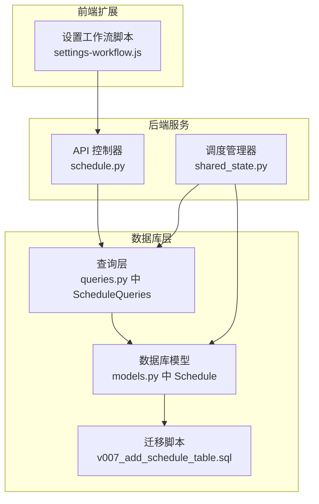
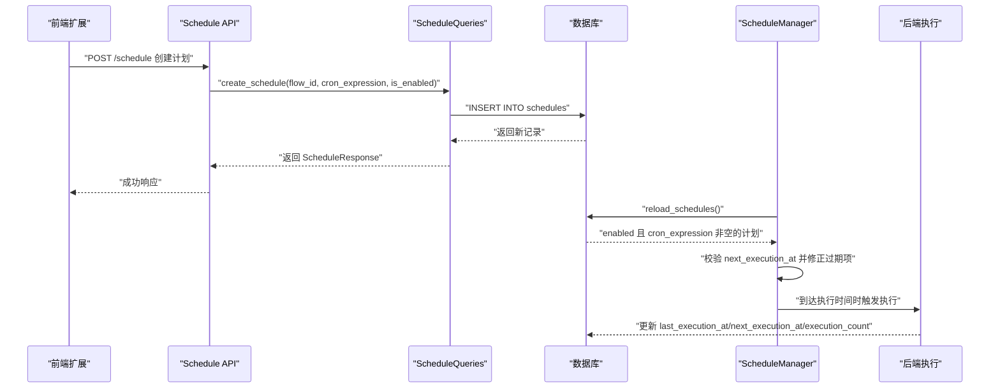
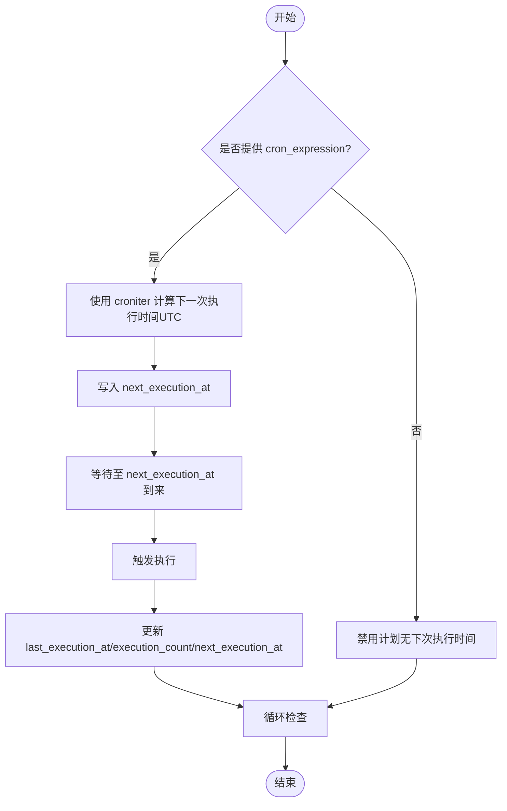
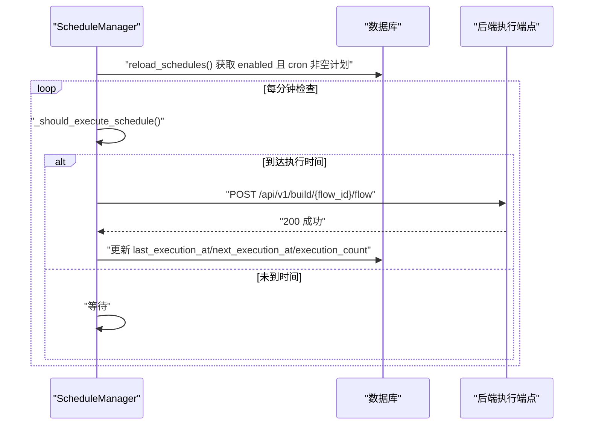
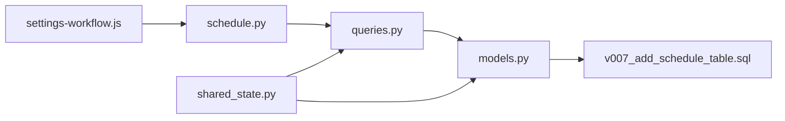

# 计划模型

<cite>
**本文引用的文件**
- [vibe_surf/backend/database/migrations/v007_add_schedule_table.sql](file://vibe_surf/backend/database/migrations/v007_add_schedule_table.sql)
- [vibe_surf/backend/database/models.py](file://vibe_surf/backend/database/models.py)
- [vibe_surf/backend/database/queries.py](file://vibe_surf/backend/database/queries.py)
- [vibe_surf/backend/api/schedule.py](file://vibe_surf/backend/api/schedule.py)
- [vibe_surf/backend/shared_state.py](file://vibe_surf/backend/shared_state.py)
- [vibe_surf/chrome_extension/scripts/settings-workflow.js](file://vibe_surf/chrome_extension/scripts/settings-workflow.js)
</cite>

## 目录
1. [简介](#简介)
2. [项目结构](#项目结构)
3. [核心组件](#核心组件)
4. [架构总览](#架构总览)
5. [详细组件分析](#详细组件分析)
6. [依赖分析](#依赖分析)
7. [性能考虑](#性能考虑)
8. [故障排查指南](#故障排查指南)
9. [结论](#结论)

## 简介
本文件系统性地文档化 VibeSurf 的“计划模型”（Schedule），覆盖以下方面：
- 字段定义与数据类型、约束条件
- 计划调度机制：cron 表达式解析与执行时间计算
- 与工作流（Flow）的关系映射与状态生命周期
- Pydantic Schema 与数据库模型的字段映射
- 实际使用示例：创建定时任务、查询计划列表、启用/禁用计划、触发执行
- 索引策略与性能优化建议（面向大规模计划调度）

## 项目结构
围绕计划模型的关键文件分布如下：
- 数据库迁移：定义 schedules 表结构与索引
- 数据库模型：定义 Schedule ORM 模型及索引
- 查询层：封装 CRUD 与调度相关操作
- API 层：提供 REST 接口与校验逻辑
- 调度器：在运行时加载计划并按 cron 触发执行
- 前端扩展：提供简单构建器生成 cron 表达式

图表来源
- [vibe_surf/backend/database/migrations/v007_add_schedule_table.sql](file://vibe_surf/backend/database/migrations/v007_add_schedule_table.sql#L1-L29)
- [vibe_surf/backend/database/models.py](file://vibe_surf/backend/database/models.py#L258-L289)
- [vibe_surf/backend/database/queries.py](file://vibe_surf/backend/database/queries.py#L1432-L1683)
- [vibe_surf/backend/api/schedule.py](file://vibe_surf/backend/api/schedule.py#L1-L331)
- [vibe_surf/backend/shared_state.py](file://vibe_surf/backend/shared_state.py#L740-L999)
- [vibe_surf/chrome_extension/scripts/settings-workflow.js](file://vibe_surf/chrome_extension/scripts/settings-workflow.js#L2234-L2480)

章节来源
- [vibe_surf/backend/database/migrations/v007_add_schedule_table.sql](file://vibe_surf/backend/database/migrations/v007_add_schedule_table.sql#L1-L29)
- [vibe_surf/backend/database/models.py](file://vibe_surf/backend/database/models.py#L258-L289)
- [vibe_surf/backend/database/queries.py](file://vibe_surf/backend/database/queries.py#L1432-L1683)
- [vibe_surf/backend/api/schedule.py](file://vibe_surf/backend/api/schedule.py#L1-L331)
- [vibe_surf/backend/shared_state.py](file://vibe_surf/backend/shared_state.py#L740-L999)
- [vibe_surf/chrome_extension/scripts/settings-workflow.js](file://vibe_surf/chrome_extension/scripts/settings-workflow.js#L2234-L2480)

## 核心组件
- 数据库表：schedules
  - 主键 id：字符串，唯一标识
  - flow_id：字符串，唯一，一对一绑定到某个工作流
  - cron_expression：字符串，可空；为空表示禁用计划
  - is_enabled：布尔值，默认启用
  - description：文本，可选描述
  - last_execution_at：时间戳，可空
  - next_execution_at：时间戳，可空
  - execution_count：整数，默认 0
  - created_at/updated_at：时间戳，默认当前时间
- 索引：flow_id、is_enabled、next_execution_at、cron_expression
- 触发器：更新 schedules 表时自动更新 updated_at

章节来源
- [vibe_surf/backend/database/migrations/v007_add_schedule_table.sql](file://vibe_surf/backend/database/migrations/v007_add_schedule_table.sql#L1-L29)
- [vibe_surf/backend/database/models.py](file://vibe_surf/backend/database/models.py#L258-L289)

## 架构总览
计划模型贯穿“API 层 → 查询层 → 数据库模型 → 调度器”的完整链路，并通过前端扩展提供 cron 表达式生成能力。

图表来源
- [vibe_surf/backend/api/schedule.py](file://vibe_surf/backend/api/schedule.py#L108-L148)
- [vibe_surf/backend/database/queries.py](file://vibe_surf/backend/database/queries.py#L1432-L1510)
- [vibe_surf/backend/shared_state.py](file://vibe_surf/backend/shared_state.py#L770-L855)
- [vibe_surf/backend/shared_state.py](file://vibe_surf/backend/shared_state.py#L932-L999)

## 详细组件分析

### 字段定义与约束
- id：字符串主键，UUID 风格
- flow_id：字符串，唯一，一对一绑定到工作流
- cron_expression：字符串，长度限制 100，可空；为空表示禁用计划
- is_enabled：布尔，非空，默认启用
- description：文本，可空
- last_execution_at/next_execution_at：时间戳，可空
- execution_count：整数，非负，默认 0
- created_at/updated_at：时间戳，默认当前时间，更新触发器自动刷新 updated_at

章节来源
- [vibe_surf/backend/database/migrations/v007_add_schedule_table.sql](file://vibe_surf/backend/database/migrations/v007_add_schedule_table.sql#L4-L21)
- [vibe_surf/backend/database/models.py](file://vibe_surf/backend/database/models.py#L258-L289)

### Pydantic Schema 与数据库模型字段映射
- ScheduleCreate
  - 字段：flow_id、cron_expression、is_enabled、description
  - 映射：直接对应数据库列（cron_expression 可空）
- ScheduleUpdate
  - 字段：cron_expression、is_enabled、description
  - 映射：同上，cron_expression 可置空以禁用
- ScheduleResponse
  - 字段：id、flow_id、cron_expression、is_enabled、description、last_execution_at、next_execution_at、execution_count、created_at、updated_at
  - 映射：与数据库列一一对应

章节来源
- [vibe_surf/backend/api/schedule.py](file://vibe_surf/backend/api/schedule.py#L29-L51)

### 调度机制与 cron 解析
- cron 表达式格式校验：使用 croniter 进行格式验证
- 执行时间计算：
  - 创建/更新时：若提供 cron_expression，则基于当前 UTC 时间计算下一次执行时间
  - 运行时：调度器每分钟检查一次，若 next_execution_at 到来则触发执行
  - 若 next_execution_at 已过期，则重新计算并写回数据库
- 最小执行间隔：同一计划在最近 30 秒内不会重复执行，避免抖动

图表来源
- [vibe_surf/backend/database/queries.py](file://vibe_surf/backend/database/queries.py#L1432-L1510)
- [vibe_surf/backend/database/queries.py](file://vibe_surf/backend/database/queries.py#L1590-L1617)
- [vibe_surf/backend/shared_state.py](file://vibe_surf/backend/shared_state.py#L875-L999)

章节来源
- [vibe_surf/backend/api/schedule.py](file://vibe_surf/backend/api/schedule.py#L52-L75)
- [vibe_surf/backend/database/queries.py](file://vibe_surf/backend/database/queries.py#L1432-L1617)
- [vibe_surf/backend/shared_state.py](file://vibe_surf/backend/shared_state.py#L875-L999)

### 与工作流（Flow）的关系映射
- 关系：每个计划仅绑定一个 flow_id，即一对一
- 生命周期：
  - 创建：为某 flow_id 绑定 cron 表达式或禁用
  - 更新：可修改 cron 表达式、启用/禁用、描述
  - 删除：移除该 flow_id 的计划
  - 执行：当到达 next_execution_at 时触发该 flow_id 对应的工作流执行

章节来源
- [vibe_surf/backend/database/models.py](file://vibe_surf/backend/database/models.py#L258-L289)
- [vibe_surf/backend/api/schedule.py](file://vibe_surf/backend/api/schedule.py#L108-L148)
- [vibe_surf/backend/database/queries.py](file://vibe_surf/backend/database/queries.py#L1633-L1643)

### 前端 cron 表达式生成
- 提供“每 X 分钟”、“每 X 小时”、“每日”、“每周”、“每月”等简单配置
- 自动生成标准 cron 表达式并支持保存/删除
- 当启用时要求表达式有效，禁用时允许保存（用于删除）

章节来源
- [vibe_surf/chrome_extension/scripts/settings-workflow.js](file://vibe_surf/chrome_extension/scripts/settings-workflow.js#L2234-L2480)

### API 使用示例（路径指引）
- 创建定时任务
  - POST /schedule
  - 请求体：ScheduleCreate（flow_id、cron_expression、is_enabled、description）
  - 返回：ScheduleResponse
  - 示例路径：[创建接口](file://vibe_surf/backend/api/schedule.py#L108-L148)
- 查询计划列表
  - GET /schedule
  - 返回：List[ScheduleResponse]
  - 示例路径：[查询接口](file://vibe_surf/backend/api/schedule.py#L77-L107)
- 启用/禁用计划与更新 cron
  - PUT /schedule/{flow_id}
  - 请求体：ScheduleUpdate（cron_expression、is_enabled、description）
  - 返回：ScheduleResponse
  - 示例路径：[更新接口](file://vibe_surf/backend/api/schedule.py#L195-L289)
- 删除计划
  - DELETE /schedule/{flow_id}
  - 返回：{"message": "..."}
  - 示例路径：[删除接口](file://vibe_surf/backend/api/schedule.py#L290-L331)

章节来源
- [vibe_surf/backend/api/schedule.py](file://vibe_surf/backend/api/schedule.py#L77-L331)

### 调度器与执行流程
- 启动/停止：ScheduleManager.start()/stop()
- 定时轮询：每 60 秒检查一次
- 加载策略：仅加载 is_enabled 且 cron_expression 非空的计划
- 执行策略：到达 next_execution_at 且满足最小间隔（30 秒）后触发
- 触发方式：向后端执行端点发起请求，随后更新执行跟踪字段

图表来源
- [vibe_surf/backend/shared_state.py](file://vibe_surf/backend/shared_state.py#L740-L999)

章节来源
- [vibe_surf/backend/shared_state.py](file://vibe_surf/backend/shared_state.py#L740-L999)

## 依赖分析
- 外部依赖
  - croniter：cron 表达式解析与下一次时间计算
  - FastAPI：API 定义与校验
  - SQLAlchemy：ORM 模型与查询
- 内部依赖
  - API 层依赖查询层
  - 查询层依赖模型层
  - 调度器依赖查询层与模型层
  - 前端扩展依赖 API 层

图表来源
- [vibe_surf/backend/api/schedule.py](file://vibe_surf/backend/api/schedule.py#L1-L331)
- [vibe_surf/backend/database/queries.py](file://vibe_surf/backend/database/queries.py#L1432-L1683)
- [vibe_surf/backend/database/models.py](file://vibe_surf/backend/database/models.py#L258-L289)
- [vibe_surf/backend/database/migrations/v007_add_schedule_table.sql](file://vibe_surf/backend/database/migrations/v007_add_schedule_table.sql#L1-L29)
- [vibe_surf/backend/shared_state.py](file://vibe_surf/backend/shared_state.py#L740-L999)
- [vibe_surf/chrome_extension/scripts/settings-workflow.js](file://vibe_surf/chrome_extension/scripts/settings-workflow.js#L2234-L2480)

章节来源
- [vibe_surf/backend/api/schedule.py](file://vibe_surf/backend/api/schedule.py#L1-L331)
- [vibe_surf/backend/database/queries.py](file://vibe_surf/backend/database/queries.py#L1432-L1683)
- [vibe_surf/backend/database/models.py](file://vibe_surf/backend/database/models.py#L258-L289)
- [vibe_surf/backend/database/migrations/v007_add_schedule_table.sql](file://vibe_surf/backend/database/migrations/v007_add_schedule_table.sql#L1-L29)
- [vibe_surf/backend/shared_state.py](file://vibe_surf/backend/shared_state.py#L740-L999)
- [vibe_surf/chrome_extension/scripts/settings-workflow.js](file://vibe_surf/chrome_extension/scripts/settings-workflow.js#L2234-L2480)

## 性能考虑
- 索引策略
  - flow_id：唯一索引，保证按工作流快速定位
  - is_enabled：索引，便于筛选启用计划
  - next_execution_at：索引，加速调度轮询时的筛选
  - cron_expression：索引，便于按表达式维度统计与分析
- 查询优化
  - 调度器仅加载启用且有 cron 的计划，减少扫描范围
  - 批量更新 next_execution_at 与执行计数，降低频繁 IO
- 运行时节流
  - 最小执行间隔（30 秒）避免高频抖动
  - 每分钟轮询，兼顾实时性与资源占用
- 大规模计划调度建议
  - 将 cron 表达式尽量均匀分布，避免在同一时刻大量计划触发
  - 对于极高并发场景，可考虑分片或外部队列（如 Celery）替代内置调度器
  - 定期清理历史执行记录（last_execution_at、execution_count）以控制表增长

章节来源
- [vibe_surf/backend/database/migrations/v007_add_schedule_table.sql](file://vibe_surf/backend/database/migrations/v007_add_schedule_table.sql#L17-L21)
- [vibe_surf/backend/shared_state.py](file://vibe_surf/backend/shared_state.py#L875-L999)

## 故障排查指南
- cron 表达式无效
  - 现象：创建/更新时报错，提示表达式格式不合法
  - 处理：使用 croniter 校验，确保符合标准格式
  - 参考：[校验函数](file://vibe_surf/backend/api/schedule.py#L52-L59)
- 下次执行时间过期
  - 现象：计划长时间未执行
  - 处理：调度器会自动重算并更新 next_execution_at；检查系统时区与本地时间
  - 参考：[重算逻辑](file://vibe_surf/backend/shared_state.py#L809-L835)
- 执行过于频繁
  - 现象：短时间内多次触发
  - 处理：确认最小执行间隔（30 秒）生效；调整 cron 表达式
  - 参考：[最小间隔判断](file://vibe_surf/backend/shared_state.py#L912-L924)
- 计划未被加载
  - 现象：调度器未发现计划
  - 处理：确认 is_enabled 为真且 cron_expression 非空；检查 reload 是否成功
  - 参考：[加载逻辑](file://vibe_surf/backend/shared_state.py#L770-L855)
- 删除计划失败
  - 现象：DELETE 返回错误
  - 处理：确认 flow_id 存在；查看日志追踪
  - 参考：[删除接口](file://vibe_surf/backend/api/schedule.py#L290-L331)

章节来源
- [vibe_surf/backend/api/schedule.py](file://vibe_surf/backend/api/schedule.py#L52-L59)
- [vibe_surf/backend/shared_state.py](file://vibe_surf/backend/shared_state.py#L809-L835)
- [vibe_surf/backend/shared_state.py](file://vibe_surf/backend/shared_state.py#L912-L924)
- [vibe_surf/backend/shared_state.py](file://vibe_surf/backend/shared_state.py#L770-L855)
- [vibe_surf/backend/api/schedule.py](file://vibe_surf/backend/api/schedule.py#L290-L331)

## 结论
VibeSurf 的计划模型以简洁的数据库表结构与清晰的 API/查询/调度链路实现了对工作流的定时调度。通过 croniter 的严格校验与调度器的周期性检查，系统能够在保证正确性的同时，提供稳定的计划执行能力。配合合理的索引与最小执行间隔策略，可在中大型规模下保持良好性能。对于更高并发需求，可进一步引入外部队列或分片策略。