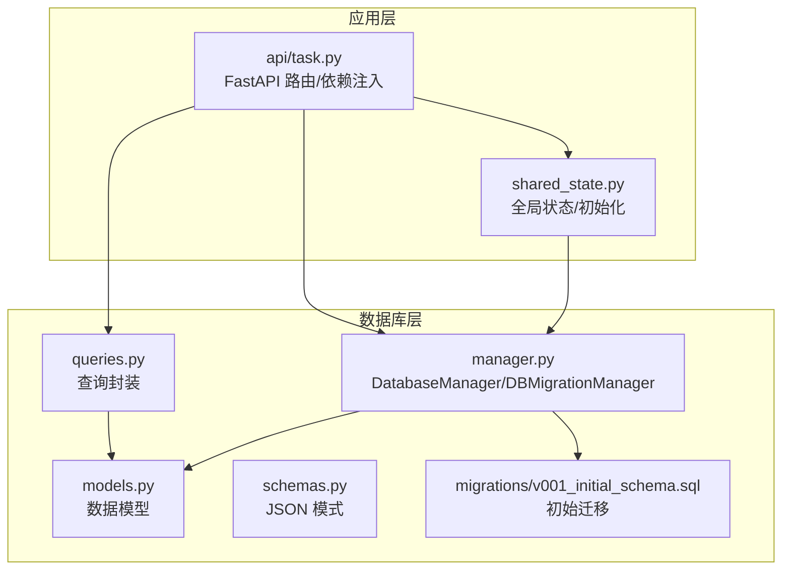
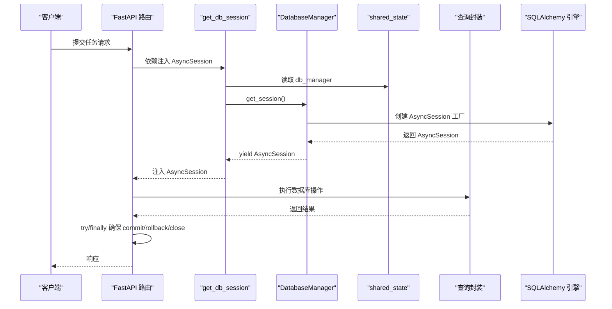
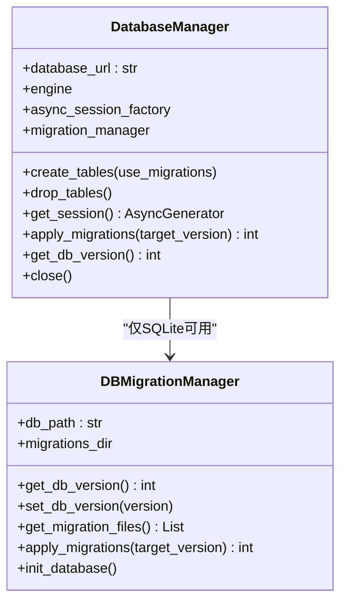
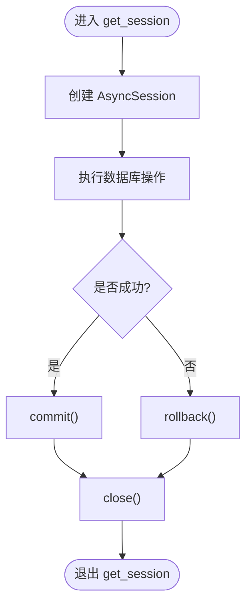
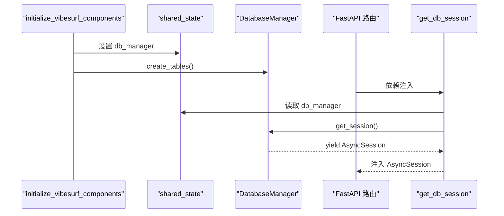
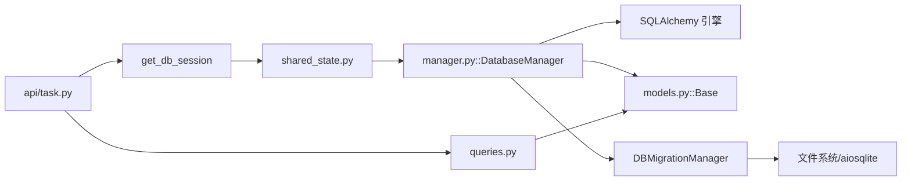

# 会话管理

<cite>
**本文引用的文件**
- [manager.py](file://vibe_surf/backend/database/manager.py)
- [models.py](file://vibe_surf/backend/database/models.py)
- [queries.py](file://vibe_surf/backend/database/queries.py)
- [schemas.py](file://vibe_surf/backend/database/schemas.py)
- [shared_state.py](file://vibe_surf/backend/shared_state.py)
- [task.py](file://vibe_surf/backend/api/task.py)
- [v001_initial_schema.sql](file://vibe_surf/backend/database/migrations/v001_initial_schema.sql)
</cite>

## 目录
1. [简介](#简介)
2. [项目结构](#项目结构)
3. [核心组件](#核心组件)
4. [架构总览](#架构总览)
5. [详细组件分析](#详细组件分析)
6. [依赖关系分析](#依赖关系分析)
7. [性能考量](#性能考量)
8. [故障排查指南](#故障排查指南)
9. [结论](#结论)
10. [附录](#附录)

## 简介
本文件系统性地文档化 VibeSurf 后端数据库会话管理服务，聚焦于 manager.py 中实现的异步数据库会话管理器（DatabaseManager）及其配套迁移管理器（DBMigrationManager）。内容涵盖：
- 连接池配置与管理（SQLite 开发与 PostgreSQL/MySQL 生产差异）
- 会话生命周期控制（获取、提交、回滚、释放）
- 事务处理机制与异常处理策略
- 多线程/并发环境下的会话隔离与线程安全
- 实际业务场景用法（原子事务、嵌套事务、长生命周期会话）
- 会话超时、连接泄漏检测与自动恢复机制
- FastAPI 依赖注入与全局共享状态集成

## 项目结构
与数据库会话管理直接相关的核心文件如下：
- 数据库会话管理：vibe_surf/backend/database/manager.py
- 数据模型定义：vibe_surf/backend/database/models.py
- 查询封装：vibe_surf/backend/database/queries.py
- JSON 模式校验：vibe_surf/backend/database/schemas.py
- 初始化与全局状态：vibe_surf/backend/shared_state.py
- API 路由与依赖注入：vibe_surf/backend/api/task.py
- 初始迁移脚本：vibe_surf/backend/database/migrations/v001_initial_schema.sql

图表来源
- [manager.py](file://vibe_surf/backend/database/manager.py#L148-L319)
- [models.py](file://vibe_surf/backend/database/models.py#L1-L289)
- [queries.py](file://vibe_surf/backend/database/queries.py#L1-L200)
- [schemas.py](file://vibe_surf/backend/database/schemas.py#L1-L100)
- [shared_state.py](file://vibe_surf/backend/shared_state.py#L453-L598)
- [task.py](file://vibe_surf/backend/api/task.py#L1-L150)
- [v001_initial_schema.sql](file://vibe_surf/backend/database/migrations/v001_initial_schema.sql#L1-L118)

章节来源
- [manager.py](file://vibe_surf/backend/database/manager.py#L148-L319)
- [models.py](file://vibe_surf/backend/database/models.py#L1-L289)
- [queries.py](file://vibe_surf/backend/database/queries.py#L1-L200)
- [schemas.py](file://vibe_surf/backend/database/schemas.py#L1-L100)
- [shared_state.py](file://vibe_surf/backend/shared_state.py#L453-L598)
- [task.py](file://vibe_surf/backend/api/task.py#L1-L150)
- [v001_initial_schema.sql](file://vibe_surf/backend/database/migrations/v001_initial_schema.sql#L1-L118)

## 核心组件
- DatabaseManager：负责引擎创建、会话工厂、表初始化、迁移、关闭等。
- DBMigrationManager：仅支持 SQLite 的迁移管理，负责版本号、迁移脚本扫描与执行。
- get_db_session：FastAPI 依赖注入函数，从共享状态获取 DatabaseManager 并提供会话生成器。
- 全局共享状态 shared_state：集中存放 db_manager，并在初始化阶段创建并迁移数据库。
- 查询封装 queries：围绕模型进行 CRUD 与聚合查询，配合 AsyncSession 使用。

章节来源
- [manager.py](file://vibe_surf/backend/database/manager.py#L148-L319)
- [shared_state.py](file://vibe_surf/backend/shared_state.py#L453-L598)
- [queries.py](file://vibe_surf/backend/database/queries.py#L1-L200)

## 架构总览
数据库会话管理采用“依赖注入 + 生命周期管理”的设计：
- 初始化阶段：shared_state.initialize_vibesurf_components 创建 DatabaseManager，调用 create_tables 使用迁移或直接建表。
- 请求阶段：FastAPI 路由通过 get_db_session 获取 AsyncSession，业务逻辑在 try/finally 中确保 commit/rollback/close。
- 异常阶段：捕获异常后回滚，最终关闭会话，避免泄漏。

图表来源
- [task.py](file://vibe_surf/backend/api/task.py#L43-L146)
- [manager.py](file://vibe_surf/backend/database/manager.py#L229-L239)
- [shared_state.py](file://vibe_surf/backend/shared_state.py#L518-L538)

## 详细组件分析

### DatabaseManager 组件
职责与关键点：
- 引擎配置
  - SQLite：使用 StaticPool，禁用同线程检查，设置超时；适合开发/单进程场景。
  - 非 SQLite：使用连接池参数（pool_size、max_overflow、pool_pre_ping、pool_recycle），适合生产。
- 会话工厂
  - sessionmaker(class_=AsyncSession, expire_on_commit=False)，避免提交后对象过期导致的懒加载问题。
- 表初始化
  - create_tables 支持迁移与直接建表两种路径；迁移失败时回退到直接建表。
- 迁移管理
  - 仅对 SQLite 可用；提供 get_db_version、apply_migrations。
- 会话生命周期
  - get_session 使用 async with 生成会话，try/finally 中 commit/rollback/close，保证异常安全。
- 关闭
  - close 调用 engine.dispose() 释放连接池资源。

图表来源
- [manager.py](file://vibe_surf/backend/database/manager.py#L148-L319)

章节来源
- [manager.py](file://vibe_surf/backend/database/manager.py#L148-L319)

### DBMigrationManager 组件
职责与关键点：
- 版本管理：通过 PRAGMA user_version 读写数据库版本。
- 迁移扫描：按 vNNN_description.sql 规则扫描目录，按版本号排序。
- 应用迁移：逐个执行 SQL 文件，更新版本号；异常时中断并记录错误。
- 适用范围：仅支持 SQLite，其他数据库类型不启用。

章节来源
- [manager.py](file://vibe_surf/backend/database/manager.py#L27-L146)
- [v001_initial_schema.sql](file://vibe_surf/backend/database/migrations/v001_initial_schema.sql#L1-L118)

### 会话生命周期与事务控制
- 获取会话：get_session 使用 async with 会话工厂创建会话。
- 提交/回滚：try 成功则 commit，异常则 rollback，最后 close。
- 释放：finally 中显式 close，避免连接泄漏。
- 事务语义：expire_on_commit=False，减少懒加载引发的异常；业务层可自行控制事务边界。

图表来源
- [manager.py](file://vibe_surf/backend/database/manager.py#L229-L239)

章节来源
- [manager.py](file://vibe_surf/backend/database/manager.py#L229-L239)

### FastAPI 依赖注入与全局状态
- get_db_session：从 shared_state 读取 db_manager，再委托其 get_session。
- shared_state.initialize_vibesurf_components：创建 DatabaseManager，调用 create_tables 完成初始化。
- API 路由中通过 Depends(get_db_session) 注入 AsyncSession，业务逻辑在 try/finally 中完成提交/回滚/关闭。

图表来源
- [shared_state.py](file://vibe_surf/backend/shared_state.py#L518-L538)
- [manager.py](file://vibe_surf/backend/database/manager.py#L275-L285)
- [task.py](file://vibe_surf/backend/api/task.py#L43-L146)

章节来源
- [shared_state.py](file://vibe_surf/backend/shared_state.py#L518-L538)
- [manager.py](file://vibe_surf/backend/database/manager.py#L275-L285)
- [task.py](file://vibe_surf/backend/api/task.py#L43-L146)

### 多线程/并发与线程安全
- SQLite：connect_args 中禁用同线程检查，允许跨线程使用；但需注意同一连接不可被多个协程同时使用。
- 生产数据库：使用连接池，每个请求获取独立连接，天然隔离。
- 会话隔离：每个请求一个 AsyncSession，避免跨请求污染。
- 会话过期：expire_on_commit=False，避免提交后访问已过期属性。

章节来源
- [manager.py](file://vibe_surf/backend/database/manager.py#L164-L184)
- [manager.py](file://vibe_surf/backend/database/manager.py#L186-L190)

### 业务场景用法示例（路径指引）
以下为常见业务场景的代码路径参考（不直接展示代码内容）：
- 原子事务（单请求内多条写操作）
  - 参考：[task.py](file://vibe_surf/backend/api/task.py#L110-L123) 中保存任务后立即提交
  - 参考：[queries.py](file://vibe_surf/backend/database/queries.py#L441-L523) 中保存任务的实现
- 嵌套事务（业务层拆分多次写入，统一提交）
  - 在路由中获取会话后，按顺序调用多个查询封装方法，最后统一 commit
  - 参考：[task.py](file://vibe_surf/backend/api/task.py#L43-L146) 的提交流程
- 长生命周期会话（后台任务）
  - 参考：[shared_state.py](file://vibe_surf/backend/shared_state.py#L118-L233) 中后台任务执行函数，传入 db_session 并在 finally 中提交
- 会话超时与连接泄漏检测
  - SQLite：connect_args.timeout 控制超时；get_session finally 显式 close 防泄漏
  - 生产数据库：pool_pre_ping + pool_recycle 自动健康检查与回收
  - 参考：[manager.py](file://vibe_surf/backend/database/manager.py#L164-L184)、[manager.py](file://vibe_surf/backend/database/manager.py#L229-L239)

章节来源
- [task.py](file://vibe_surf/backend/api/task.py#L43-L146)
- [queries.py](file://vibe_surf/backend/database/queries.py#L441-L523)
- [shared_state.py](file://vibe_surf/backend/shared_state.py#L118-L233)
- [manager.py](file://vibe_surf/backend/database/manager.py#L164-L184)
- [manager.py](file://vibe_surf/backend/database/manager.py#L229-L239)

## 依赖关系分析
- DatabaseManager 依赖 SQLAlchemy 异步引擎与 sessionmaker，以及 models.Base 进行表创建。
- DBMigrationManager 依赖 aiosqlite 与本地文件系统进行迁移脚本读取与执行。
- FastAPI 路由通过 get_db_session 依赖 shared_state 中的 db_manager。
- 查询封装 queries 依赖 models 与 AsyncSession。

图表来源
- [task.py](file://vibe_surf/backend/api/task.py#L1-L150)
- [manager.py](file://vibe_surf/backend/database/manager.py#L148-L319)
- [models.py](file://vibe_surf/backend/database/models.py#L1-L289)
- [queries.py](file://vibe_surf/backend/database/queries.py#L1-L200)
- [shared_state.py](file://vibe_surf/backend/shared_state.py#L453-L598)

章节来源
- [task.py](file://vibe_surf/backend/api/task.py#L1-L150)
- [manager.py](file://vibe_surf/backend/database/manager.py#L148-L319)
- [models.py](file://vibe_surf/backend/database/models.py#L1-L289)
- [queries.py](file://vibe_surf/backend/database/queries.py#L1-L200)
- [shared_state.py](file://vibe_surf/backend/shared_state.py#L453-L598)

## 性能考量
- 连接池参数
  - SQLite：StaticPool + timeout，适合开发；生产建议使用非 SQLite 并配置连接池。
  - 非 SQLite：pool_size、max_overflow、pool_pre_ping、pool_recycle，提升稳定性与吞吐。
- 会话过期
  - expire_on_commit=False，避免提交后访问属性触发额外查询。
- 索引与查询
  - models 中为高频字段建立索引，减少查询开销。
  - queries 中使用聚合与条件过滤，避免一次性拉取过多数据。

章节来源
- [manager.py](file://vibe_surf/backend/database/manager.py#L164-L184)
- [manager.py](file://vibe_surf/backend/database/manager.py#L186-L190)
- [models.py](file://vibe_surf/backend/database/models.py#L157-L289)
- [queries.py](file://vibe_surf/backend/database/queries.py#L571-L612)

## 故障排查指南
- 迁移失败
  - 现象：create_tables 回退到直接建表或抛出异常。
  - 排查：检查 DBMigrationManager.apply_migrations 的日志与异常堆栈。
  - 参考：[manager.py](file://vibe_surf/backend/database/manager.py#L203-L223)、[manager.py](file://vibe_surf/backend/database/manager.py#L100-L145)
- 会话泄漏
  - 现象：连接数增长、超时。
  - 排查：确认 get_session 是否在 finally 中执行 close；生产数据库检查 pool_recycle/pool_pre_ping。
  - 参考：[manager.py](file://vibe_surf/backend/database/manager.py#L229-L239)
- 依赖未初始化
  - 现象：get_db_session 抛出未初始化错误。
  - 排查：确认 shared_state.initialize_vibesurf_components 已调用。
  - 参考：[manager.py](file://vibe_surf/backend/database/manager.py#L275-L285)、[shared_state.py](file://vibe_surf/backend/shared_state.py#L518-L538)
- 事务未提交
  - 现象：业务数据未持久化。
  - 排查：检查路由中是否调用 db.commit() 或在 get_session 中自动提交。
  - 参考：[task.py](file://vibe_surf/backend/api/task.py#L110-L123)

章节来源
- [manager.py](file://vibe_surf/backend/database/manager.py#L100-L145)
- [manager.py](file://vibe_surf/backend/database/manager.py#L203-L223)
- [manager.py](file://vibe_surf/backend/database/manager.py#L229-L239)
- [manager.py](file://vibe_surf/backend/database/manager.py#L275-L285)
- [shared_state.py](file://vibe_surf/backend/shared_state.py#L518-L538)
- [task.py](file://vibe_surf/backend/api/task.py#L110-L123)

## 结论
VibeSurf 的数据库会话管理通过 DatabaseManager 与 DBMigrationManager 提供了：
- 清晰的连接池配置与生命周期管理
- 稳健的事务控制与异常处理
- 与 FastAPI 的无缝依赖注入集成
- 对 SQLite 与生产数据库的不同优化策略
在实际业务中，遵循“获取-操作-提交/回滚-释放”的标准流程，即可在多线程/并发环境下安全、高效地使用数据库会话。

## 附录
- 数据模型概览（部分）
  - LLMProfile、Task、UploadedFile、McpProfile、VoiceProfile、ComposioToolkit、Credential、Schedule
  - 参考：[models.py](file://vibe_surf/backend/database/models.py#L1-L289)
- JSON 模式校验
  - TaskMetadata、LLMConfiguration、McpServerConfig、ControllerConfiguration
  - 参考：[schemas.py](file://vibe_surf/backend/database/schemas.py#L1-L100)
- 初始迁移脚本
  - 包含表结构、索引与触发器
  - 参考：[v001_initial_schema.sql](file://vibe_surf/backend/database/migrations/v001_initial_schema.sql#L1-L118)