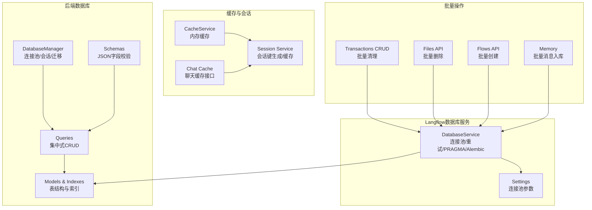
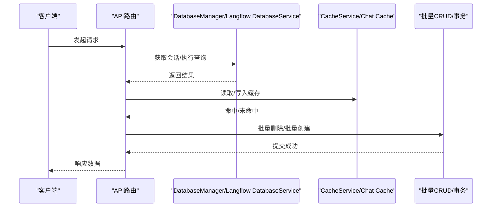
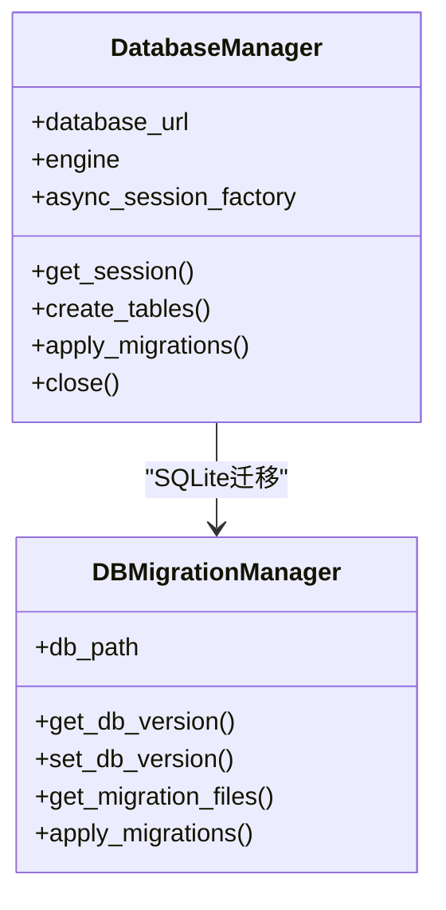
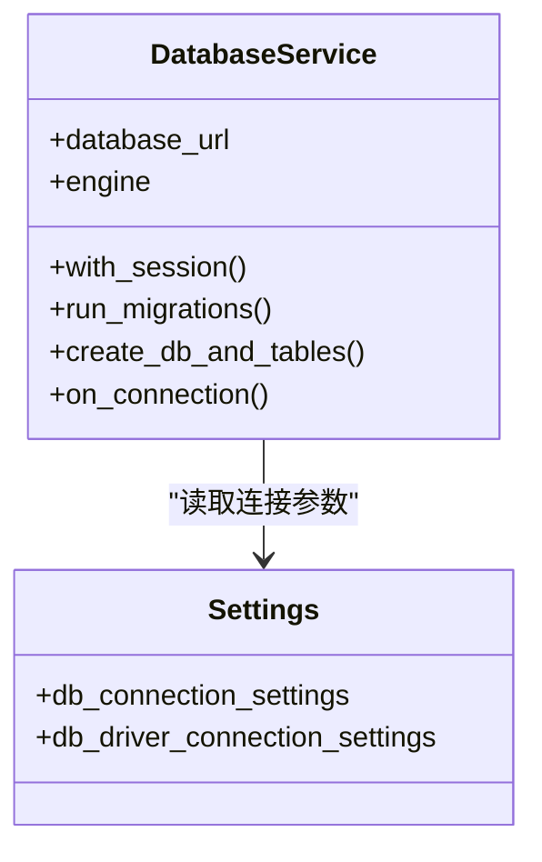
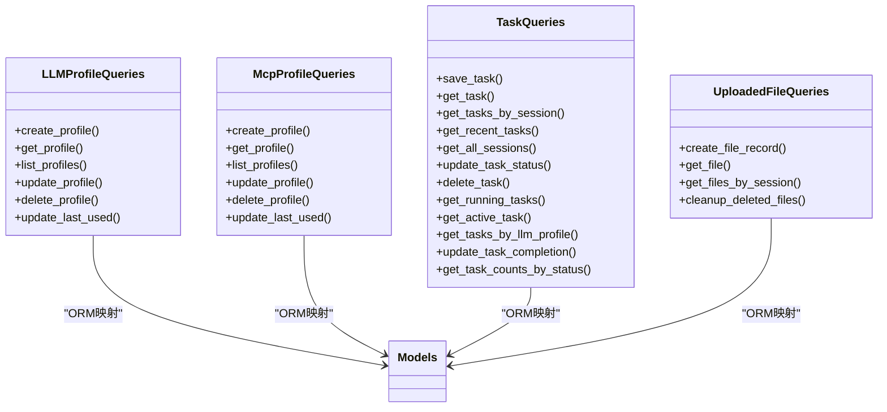
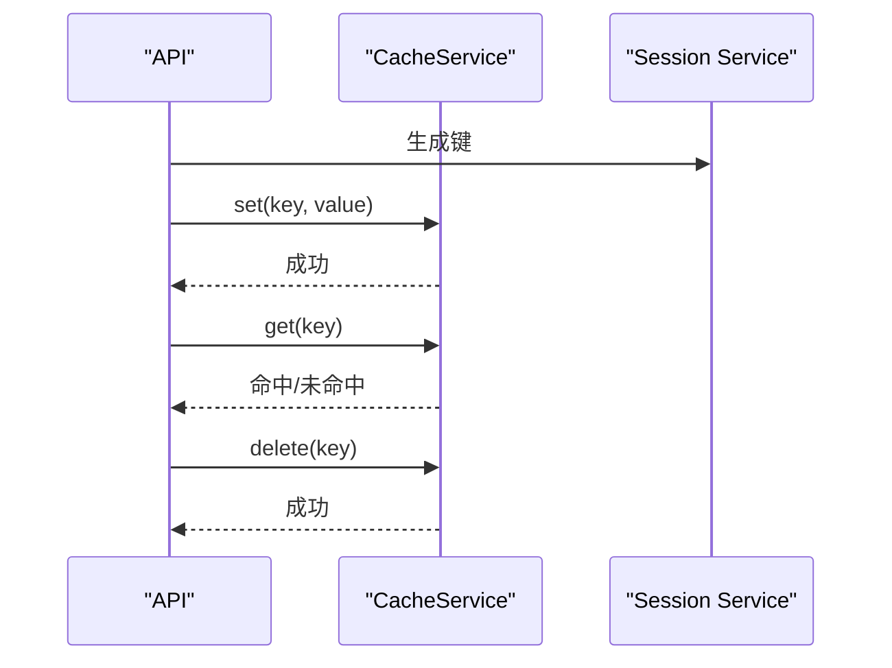
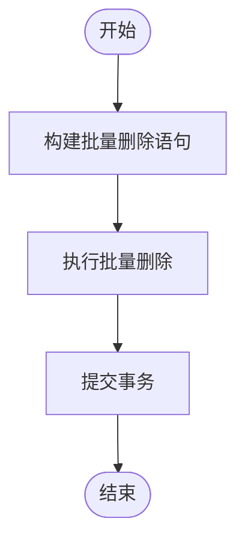
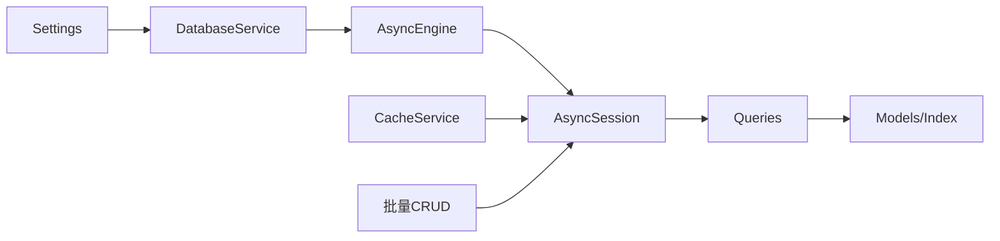

# 性能优化

<cite>
**本文引用的文件**
- [vibe_surf/backend/database/manager.py](file://vibe_surf/backend/database/manager.py)
- [vibe_surf/backend/database/models.py](file://vibe_surf/backend/database/models.py)
- [vibe_surf/backend/database/queries.py](file://vibe_surf/backend/database/queries.py)
- [vibe_surf/backend/database/schemas.py](file://vibe_surf/backend/database/schemas.py)
- [vibe_surf/backend/database/migrations/v001_initial_schema.sql](file://vibe_surf/backend/database/migrations/v001_initial_schema.sql)
- [vibe_surf/backend/shared_state.py](file://vibe_surf/backend/shared_state.py)
- [vibe_surf/langflow/services/database/service.py](file://vibe_surf/langflow/services/database/service.py)
- [vibe_surf/langflow/services/settings/base.py](file://vibe_surf/langflow/services/settings/base.py)
- [vibe_surf/langflow/services/cache/cache.py](file://vibe_surf/langflow/services/cache/cache.py)
- [vibe_surf/langflow/services/chat/cache.py](file://vibe_surf/langflow/services/chat/cache.py)
- [vibe_surf/langflow/services/chat/schema.py](file://vibe_surf/langflow/services/chat/schema.py)
- [vibe_surf/langflow/services/session/service.py](file://vibe_surf/langflow/services/session/service.py)
- [vibe_surf/langflow/services/database/models/transactions/crud.py](file://vibe_surf/langflow/services/database/models/transactions/crud.py)
- [vibe_surf/langflow/services/utils.py](file://vibe_surf/langflow/services/utils.py)
- [vibe_surf/langflow/api/v2/files.py](file://vibe_surf/langflow/api/v2/files.py)
- [vibe_surf/langflow/api/v1/flows.py](file://vibe_surf/langflow/api/v1/flows.py)
- [vibe_surf/langflow/memory.py](file://vibe_surf/langflow/memory.py)
- [pyproject.toml](file://pyproject.toml)
</cite>

## 目录
1. [简介](#简介)
2. [项目结构](#项目结构)
3. [核心组件](#核心组件)
4. [架构总览](#架构总览)
5. [详细组件分析](#详细组件分析)
6. [依赖关系分析](#依赖关系分析)
7. [性能考量与最佳实践](#性能考量与最佳实践)
8. [故障排查指南](#故障排查指南)
9. [结论](#结论)
10. [附录：索引与查询优化清单](#附录索引与查询优化清单)

## 简介
本文件聚焦于 VibeSurf 数据库性能优化，系统性阐述以下主题：
- 查询性能优化策略：识别与规避 N+1 查询问题、通过索引提升查询速度、实现查询缓存降低数据库负载
- 批量操作最佳实践：批量插入、更新与删除的高效实现
- 查询执行计划与性能瓶颈诊断方法
- 实战示例路径：延迟加载、急切加载与查询预编译的使用
- 连接复用策略、读写分离与分库分表的初步支持现状

## 项目结构
VibeSurf 的数据库相关能力主要分布在后端数据库层（SQLite/异步 SQLAlchemy）与 Langflow 数据库服务层（异步 SQLAlchemy + Alembic）。关键模块包括：
- 后端数据库管理器与模型定义：负责连接池、迁移、会话管理与基础索引
- 查询封装层：集中化 CRUD 操作，便于统一优化
- Langflow 数据库服务：提供连接池、重试、PRAGMA 设置、迁移与会话管理
- 缓存服务：基于内存字典的客户端隔离缓存，用于减少重复查询
- 批量操作：在事务中批量删除与批量创建，避免逐条提交带来的开销

图表来源
- [vibe_surf/backend/database/manager.py](file://vibe_surf/backend/database/manager.py#L148-L203)
- [vibe_surf/backend/database/queries.py](file://vibe_surf/backend/database/queries.py#L1-L120)
- [vibe_surf/backend/database/models.py](file://vibe_surf/backend/database/models.py#L157-L289)
- [vibe_surf/backend/database/schemas.py](file://vibe_surf/backend/database/schemas.py#L1-L100)
- [vibe_surf/langflow/services/database/service.py](file://vibe_surf/langflow/services/database/service.py#L123-L162)
- [vibe_surf/langflow/services/settings/base.py](file://vibe_surf/langflow/services/settings/base.py#L117-L141)
- [vibe_surf/langflow/services/cache/cache.py](file://vibe_surf/langflow/services/cache/cache.py#L1-L200)
- [vibe_surf/langflow/services/chat/cache.py](file://vibe_surf/langflow/services/chat/cache.py#L47-L83)
- [vibe_surf/langflow/services/session/service.py](file://vibe_surf/langflow/services/session/service.py#L39-L63)
- [vibe_surf/langflow/services/database/models/transactions/crud.py](file://vibe_surf/langflow/services/database/models/transactions/crud.py#L36-L74)
- [vibe_surf/langflow/api/v2/files.py](file://vibe_surf/langflow/api/v2/files.py#L273-L302)
- [vibe_surf/langflow/api/v1/flows.py](file://vibe_surf/langflow/api/v1/flows.py#L405-L422)
- [vibe_surf/langflow/memory.py](file://vibe_surf/langflow/memory.py#L154-L184)

章节来源
- [vibe_surf/backend/database/manager.py](file://vibe_surf/backend/database/manager.py#L148-L203)
- [vibe_surf/langflow/services/database/service.py](file://vibe_surf/langflow/services/database/service.py#L123-L162)

## 核心组件
- 数据库管理器（后端）
  - 提供异步引擎、静态池或生产池配置、会话工厂、迁移管理与关闭逻辑
  - 针对 SQLite 使用 StaticPool，针对 PostgreSQL/MySQL 使用可调参数连接池
- 查询封装层
  - 将 CRUD 聚合到类方法，便于统一优化与日志记录
  - 示例：LLMProfileQueries、McpProfileQueries、TaskQueries、UploadedFileQueries
- 模型与索引
  - 在模型层显式声明常用查询列的索引，覆盖任务状态、会话、LLM 名称等高频过滤条件
- Langflow 数据库服务
  - 异步引擎创建、连接参数合并、PRAGMA 设置、Alembic 迁移、带重试的引擎创建
- 缓存服务
  - 内存字典缓存，按客户端隔离；支持异步 set/get/delete
- 批量操作
  - 事务内批量删除与批量创建，减少往返与锁竞争

章节来源
- [vibe_surf/backend/database/manager.py](file://vibe_surf/backend/database/manager.py#L148-L203)
- [vibe_surf/backend/database/queries.py](file://vibe_surf/backend/database/queries.py#L1-L120)
- [vibe_surf/backend/database/models.py](file://vibe_surf/backend/database/models.py#L157-L289)
- [vibe_surf/langflow/services/database/service.py](file://vibe_surf/langflow/services/database/service.py#L123-L162)
- [vibe_surf/langflow/services/cache/cache.py](file://vibe_surf/langflow/services/cache/cache.py#L1-L200)
- [vibe_surf/langflow/services/chat/cache.py](file://vibe_surf/langflow/services/chat/cache.py#L47-L83)
- [vibe_surf/langflow/services/session/service.py](file://vibe_surf/langflow/services/session/service.py#L39-L63)
- [vibe_surf/langflow/services/database/models/transactions/crud.py](file://vibe_surf/langflow/services/database/models/transactions/crud.py#L36-L74)

## 架构总览
下图展示了数据库层与服务层的交互关系，以及连接池、缓存与批量操作在整体中的位置。

图表来源
- [vibe_surf/backend/database/manager.py](file://vibe_surf/backend/database/manager.py#L229-L239)
- [vibe_surf/langflow/services/database/service.py](file://vibe_surf/langflow/services/database/service.py#L187-L199)
- [vibe_surf/langflow/services/cache/cache.py](file://vibe_surf/langflow/services/cache/cache.py#L1-L200)
- [vibe_surf/langflow/services/database/models/transactions/crud.py](file://vibe_surf/langflow/services/database/models/transactions/crud.py#L36-L74)

## 详细组件分析

### 组件A：数据库连接与会话管理（后端）
- 关键点
  - SQLite：开发环境使用 StaticPool，connect_args 指定超时与线程检查
  - 生产环境：PostgreSQL/MySQL 使用可配置的 pool_size、max_overflow、pool_pre_ping、pool_recycle
  - 会话工厂：expire_on_commit=False，避免过早失效导致的二次查询
  - 迁移管理：仅 SQLite 支持迁移，其他数据库需自行维护
- 性能建议
  - 根据并发与写入压力调整 pool_size/max_overflow
  - 开启 pool_pre_ping 与合理 pool_recycle，避免连接失效
  - SQLite 在高并发写入场景下建议降低并发或采用 WAL 模式（当前代码未显式设置）

图表来源
- [vibe_surf/backend/database/manager.py](file://vibe_surf/backend/database/manager.py#L148-L203)
- [vibe_surf/backend/database/manager.py](file://vibe_surf/backend/database/manager.py#L27-L146)

章节来源
- [vibe_surf/backend/database/manager.py](file://vibe_surf/backend/database/manager.py#L148-L203)

### 组件B：Langflow 数据库服务（连接池与迁移）
- 关键点
  - 异步引擎创建、连接参数合并（兼容旧版 pool_size/max_overflow）、PRAGMA 设置（SQLite）
  - Alembic 初始化与迁移检查，支持自动升级/降级
  - 会话上下文管理，异常回滚
- 性能建议
  - 使用 db_connection_settings 统一配置连接池参数
  - SQLite PRAGMA 可根据工作负载调优（例如 WAL、journal_mode 等，当前代码通过 PRAGMA 注入）

图表来源
- [vibe_surf/langflow/services/database/service.py](file://vibe_surf/langflow/services/database/service.py#L123-L162)
- [vibe_surf/langflow/services/settings/base.py](file://vibe_surf/langflow/services/settings/base.py#L117-L141)

章节来源
- [vibe_surf/langflow/services/database/service.py](file://vibe_surf/langflow/services/database/service.py#L123-L162)
- [vibe_surf/langflow/services/settings/base.py](file://vibe_surf/langflow/services/settings/base.py#L117-L141)

### 组件C：查询封装与索引（模型与查询）
- 关键点
  - 模型层显式创建索引：LLMProfile、Task、UploadedFile、McpProfile、VoiceProfile、ComposioToolkit、Schedule 等
  - 查询封装：LLMProfileQueries/McpProfileQueries/TaskQueries/UploadedFileQueries 提供统一入口
- 性能建议
  - 基于高频过滤列建立复合索引（如 session_id+upload_time）
  - 对热点查询使用 selectinload 或 join 一次性获取关联数据，避免 N+1

图表来源
- [vibe_surf/backend/database/queries.py](file://vibe_surf/backend/database/queries.py#L1-L120)
- [vibe_surf/backend/database/queries.py](file://vibe_surf/backend/database/queries.py#L441-L754)
- [vibe_surf/backend/database/queries.py](file://vibe_surf/backend/database/queries.py#L755-L800)
- [vibe_surf/backend/database/models.py](file://vibe_surf/backend/database/models.py#L157-L289)

章节来源
- [vibe_surf/backend/database/queries.py](file://vibe_surf/backend/database/queries.py#L1-L120)
- [vibe_surf/backend/database/queries.py](file://vibe_surf/backend/database/queries.py#L441-L754)
- [vibe_surf/backend/database/queries.py](file://vibe_surf/backend/database/queries.py#L755-L800)
- [vibe_surf/backend/database/models.py](file://vibe_surf/backend/database/models.py#L157-L289)

### 组件D：缓存与会话（减少数据库负载）
- 关键点
  - CacheService：内存字典缓存，按 client_id 隔离
  - Chat Cache 接口：GetCache/SetCache 协议
  - Session Service：生成唯一键，支持异步 set/delete
- 性能建议
  - 对热点读取（如配置、会话元数据）启用缓存
  - 注意缓存键设计，避免跨用户污染

图表来源
- [vibe_surf/langflow/services/cache/cache.py](file://vibe_surf/langflow/services/cache/cache.py#L1-L200)
- [vibe_surf/langflow/services/chat/cache.py](file://vibe_surf/langflow/services/chat/cache.py#L47-L83)
- [vibe_surf/langflow/services/chat/schema.py](file://vibe_surf/langflow/services/chat/schema.py#L1-L10)
- [vibe_surf/langflow/services/session/service.py](file://vibe_surf/langflow/services/session/service.py#L39-L63)

章节来源
- [vibe_surf/langflow/services/cache/cache.py](file://vibe_surf/langflow/services/cache/cache.py#L1-L200)
- [vibe_surf/langflow/services/chat/cache.py](file://vibe_surf/langflow/services/chat/cache.py#L47-L83)
- [vibe_surf/langflow/services/chat/schema.py](file://vibe_surf/langflow/services/chat/schema.py#L1-L10)
- [vibe_surf/langflow/services/session/service.py](file://vibe_surf/langflow/services/session/service.py#L39-L63)

### 组件E：批量操作（批量插入/更新/删除）
- 关键点
  - 事务内批量删除：先计算需要保留的最大条数，再批量删除超出部分
  - 批量创建：在循环中 add，最后统一 commit，避免多次往返
  - 批量删除 API：一次请求删除多个文件
- 性能建议
  - 批量操作必须在单个事务中完成，确保一致性与性能
  - 大批量写入时注意内存占用与锁竞争

图表来源
- [vibe_surf/langflow/services/database/models/transactions/crud.py](file://vibe_surf/langflow/services/database/models/transactions/crud.py#L36-L74)
- [vibe_surf/langflow/api/v2/files.py](file://vibe_surf/langflow/api/v2/files.py#L273-L302)
- [vibe_surf/langflow/api/v1/flows.py](file://vibe_surf/langflow/api/v1/flows.py#L405-L422)
- [vibe_surf/langflow/memory.py](file://vibe_surf/langflow/memory.py#L154-L184)

章节来源
- [vibe_surf/langflow/services/database/models/transactions/crud.py](file://vibe_surf/langflow/services/database/models/transactions/crud.py#L36-L74)
- [vibe_surf/langflow/api/v2/files.py](file://vibe_surf/langflow/api/v2/files.py#L273-L302)
- [vibe_surf/langflow/api/v1/flows.py](file://vibe_surf/langflow/api/v1/flows.py#L405-L422)
- [vibe_surf/langflow/memory.py](file://vibe_surf/langflow/memory.py#L154-L184)

## 依赖关系分析
- 组件耦合
  - DatabaseManager 与 Queries 通过 AsyncSession 交互，耦合度适中
  - Langflow DatabaseService 与 Settings 解耦，通过配置对象注入参数
  - 缓存服务与会话服务解耦，通过键生成与协议接口协作
- 外部依赖
  - SQLAlchemy（异步）、Alembic（迁移）、aiosqlite（SQLite）
  - 连接池参数来自 pydantic settings，便于集中管理

图表来源
- [vibe_surf/langflow/services/settings/base.py](file://vibe_surf/langflow/services/settings/base.py#L117-L141)
- [vibe_surf/langflow/services/database/service.py](file://vibe_surf/langflow/services/database/service.py#L123-L162)
- [vibe_surf/backend/database/queries.py](file://vibe_surf/backend/database/queries.py#L1-L120)
- [vibe_surf/backend/database/models.py](file://vibe_surf/backend/database/models.py#L157-L289)
- [vibe_surf/langflow/services/cache/cache.py](file://vibe_surf/langflow/services/cache/cache.py#L1-L200)

章节来源
- [vibe_surf/langflow/services/settings/base.py](file://vibe_surf/langflow/services/settings/base.py#L117-L141)
- [vibe_surf/langflow/services/database/service.py](file://vibe_surf/langflow/services/database/service.py#L123-L162)
- [vibe_surf/backend/database/queries.py](file://vibe_surf/backend/database/queries.py#L1-L120)
- [vibe_surf/backend/database/models.py](file://vibe_surf/backend/database/models.py#L157-L289)
- [vibe_surf/langflow/services/cache/cache.py](file://vibe_surf/langflow/services/cache/cache.py#L1-L200)

## 性能考量与最佳实践

### 1. 识别与规避 N+1 查询问题
- 症状
  - 遍历列表时对每个元素再次发起数据库查询
- 解决方案
  - 使用 selectinload/join 一次性加载关联数据
  - 在查询封装层统一处理，避免业务层重复查询
- 参考实现路径
  - 查询封装层已提供多处聚合查询，建议在新增查询时遵循该模式

章节来源
- [vibe_surf/backend/database/queries.py](file://vibe_surf/backend/database/queries.py#L1-L120)
- [vibe_surf/backend/database/queries.py](file://vibe_surf/backend/database/queries.py#L441-L754)

### 2. 使用适当的数据库索引优化查询速度
- 已有索引
  - LLMProfile：profile_name、is_active、is_default、provider
  - Task：status、session_id、llm_profile_name、created_at
  - UploadedFile：session_id+upload_time、is_deleted+upload_time、original_filename
  - 其他：McpProfile、VoiceProfile、ComposioToolkit、Schedule 等
- 建议
  - 针对高频过滤列（如 session_id、status、created_at）建立复合索引
  - 定期评估查询计划，对慢查询补充索引

章节来源
- [vibe_surf/backend/database/models.py](file://vibe_surf/backend/database/models.py#L157-L289)
- [vibe_surf/backend/database/migrations/v001_initial_schema.sql](file://vibe_surf/backend/database/migrations/v001_initial_schema.sql#L79-L118)

### 3. 实现查询缓存机制以减少数据库负载
- 方案
  - 使用内存缓存（CacheService），按客户端隔离
  - 对热点读取（如配置、会话元数据）启用缓存
  - 通过协议接口（GetCache/SetCache）抽象缓存访问
- 参考实现路径
  - 缓存服务与会话服务键生成

章节来源
- [vibe_surf/langflow/services/cache/cache.py](file://vibe_surf/langflow/services/cache/cache.py#L1-L200)
- [vibe_surf/langflow/services/chat/cache.py](file://vibe_surf/langflow/services/chat/cache.py#L47-L83)
- [vibe_surf/langflow/services/chat/schema.py](file://vibe_surf/langflow/services/chat/schema.py#L1-L10)
- [vibe_surf/langflow/services/session/service.py](file://vibe_surf/langflow/services/session/service.py#L39-L63)

### 4. 批量操作的最佳实践
- 批量删除
  - 事务内一次性删除超出阈值的历史记录
- 批量创建
  - 循环 add 后统一 commit，避免多次往返
- 批量删除 API
  - 一次请求删除多个资源
- 参考实现路径
  - 事务批量清理、文件批量删除、流批量创建、消息批量入库

章节来源
- [vibe_surf/langflow/services/database/models/transactions/crud.py](file://vibe_surf/langflow/services/database/models/transactions/crud.py#L36-L74)
- [vibe_surf/langflow/api/v2/files.py](file://vibe_surf/langflow/api/v2/files.py#L273-L302)
- [vibe_surf/langflow/api/v1/flows.py](file://vibe_surf/langflow/api/v1/flows.py#L405-L422)
- [vibe_surf/langflow/memory.py](file://vibe_surf/langflow/memory.py#L154-L184)

### 5. 查询执行计划分析与性能瓶颈诊断
- 方法
  - 使用数据库自带 EXPLAIN/EXPLAIN QUERY PLAN 分析执行计划
  - 结合索引与查询封装层，定位慢查询
  - 通过连接池参数与 PRAGMA 设置进行底层调优
- 参考实现路径
  - Langflow DatabaseService 的 PRAGMA 注入与连接参数

章节来源
- [vibe_surf/langflow/services/database/service.py](file://vibe_surf/langflow/services/database/service.py#L164-L185)
- [vibe_surf/langflow/services/database/service.py](file://vibe_surf/langflow/services/database/service.py#L123-L162)

### 6. 实际代码示例（路径）
- 延迟加载与急切加载
  - 在查询封装层统一使用 selectinload/join，避免 N+1
  - 参考路径：[vibe_surf/backend/database/queries.py](file://vibe_surf/backend/database/queries.py#L1-L120)
- 查询预编译
  - 使用 SQLAlchemy 异步引擎与会话，避免重复解析 SQL
  - 参考路径：[vibe_surf/backend/database/manager.py](file://vibe_surf/backend/database/manager.py#L148-L203)
- 连接复用策略
  - 通过连接池参数与 pool_pre_ping/pool_recycle 保持连接有效性
  - 参考路径：[vibe_surf/langflow/services/settings/base.py](file://vibe_surf/langflow/services/settings/base.py#L117-L141)
- 读写分离与分库分表
  - 当前代码未实现读写分离与分库分表
  - 建议：在 DatabaseService 层扩展多引擎配置，并在查询封装层按路由选择引擎

章节来源
- [vibe_surf/backend/database/queries.py](file://vibe_surf/backend/database/queries.py#L1-L120)
- [vibe_surf/backend/database/manager.py](file://vibe_surf/backend/database/manager.py#L148-L203)
- [vibe_surf/langflow/services/settings/base.py](file://vibe_surf/langflow/services/settings/base.py#L117-L141)

## 故障排查指南
- 连接池相关
  - 现象：连接耗尽、超时
  - 排查：检查 pool_size、max_overflow、pool_timeout、pool_pre_ping、pool_recycle
  - 参考路径：[vibe_surf/langflow/services/settings/base.py](file://vibe_surf/langflow/services/settings/base.py#L117-L141)
- SQLite 并发写入
  - 现象：锁等待、写入阻塞
  - 排查：降低并发或考虑 WAL 模式（当前代码未显式设置）
  - 参考路径：[vibe_surf/backend/database/manager.py](file://vibe_surf/backend/database/manager.py#L164-L184)
- 缓存未命中
  - 现象：缓存命中率低
  - 排查：确认键生成规则、客户端隔离、缓存生命周期
  - 参考路径：[vibe_surf/langflow/services/session/service.py](file://vibe_surf/langflow/services/session/service.py#L39-L63)
- 批量操作失败
  - 现象：事务回滚、数据不一致
  - 排查：确认事务边界、异常捕获与回滚
  - 参考路径：[vibe_surf/langflow/services/database/models/transactions/crud.py](file://vibe_surf/langflow/services/database/models/transactions/crud.py#L36-L74)

章节来源
- [vibe_surf/langflow/services/settings/base.py](file://vibe_surf/langflow/services/settings/base.py#L117-L141)
- [vibe_surf/backend/database/manager.py](file://vibe_surf/backend/database/manager.py#L164-L184)
- [vibe_surf/langflow/services/session/service.py](file://vibe_surf/langflow/services/session/service.py#L39-L63)
- [vibe_surf/langflow/services/database/models/transactions/crud.py](file://vibe_surf/langflow/services/database/models/transactions/crud.py#L36-L74)

## 结论
- VibeSurf 在数据库层提供了完善的连接池与迁移能力，并在模型层建立了关键索引
- 查询封装层与缓存服务为性能优化提供了良好基础
- 批量操作已在事务内实现，显著降低往返与锁竞争
- 读写分离与分库分表尚未实现，可在 DatabaseService 层扩展多引擎配置

## 附录：索引与查询优化清单
- 已有索引
  - LLMProfile：profile_name、is_active、is_default、provider
  - Task：status、session_id、llm_profile_name、created_at
  - UploadedFile：session_id+upload_time、is_deleted+upload_time、original_filename
  - 其他：McpProfile、VoiceProfile、ComposioToolkit、Schedule
- 建议新增索引
  - 针对高频过滤列（如 session_id、status、created_at）建立复合索引
  - 对 JSON 字段查询（如 task_metadata）考虑函数索引或规范化存储
- 查询优化
  - 使用 selectinload/join 减少 N+1
  - 对热点读取启用缓存
  - 批量操作统一在事务内执行

章节来源
- [vibe_surf/backend/database/models.py](file://vibe_surf/backend/database/models.py#L157-L289)
- [vibe_surf/backend/database/migrations/v001_initial_schema.sql](file://vibe_surf/backend/database/migrations/v001_initial_schema.sql#L79-L118)