# 查询操作

<cite>
**本文引用的文件**
- [queries.py](file://vibe_surf/backend/database/queries.py)
- [manager.py](file://vibe_surf/backend/database/manager.py)
- [models.py](file://vibe_surf/backend/database/models.py)
- [schemas.py](file://vibe_surf/backend/database/schemas.py)
- [test_backend_api.py](file://tests/test_backend_api.py)
</cite>

## 目录
1. [简介](#简介)
2. [项目结构](#项目结构)
3. [核心组件](#核心组件)
4. [架构总览](#架构总览)
5. [详细组件分析](#详细组件分析)
6. [依赖关系分析](#依赖关系分析)
7. [性能考量](#性能考量)
8. [故障排查指南](#故障排查指南)
9. [结论](#结论)
10. [附录](#附录)

## 简介
本文件面向 VibeSurf 后端数据库查询与会话管理，系统性梳理 queries.py 中的查询构建器模式（以类为单位封装 CRUD 与复合查询）、manager.py 的数据库会话与迁移管理、models.py 的数据模型与索引设计、schemas.py 的 JSON 字段校验方案，并结合测试用例给出常见查询模式（过滤、排序、分页）与事务处理实践。同时提供性能优化建议（避免 N+1、索引使用、缓存策略）与错误处理与连接恢复机制说明。

## 项目结构
数据库相关代码集中在后端模块 vibe_surf/backend/database 下：
- queries.py：查询构建器（按模型分组的静态方法类），统一封装 CRUD、过滤、排序、分页与聚合统计等。
- manager.py：数据库引擎与会话管理、SQLite 迁移管理、FastAPI 依赖注入。
- models.py：SQLAlchemy 声明式模型与索引定义。
- schemas.py：JSON 字段的 Pydantic 校验与工具函数。

图表来源
- [manager.py](file://vibe_surf/backend/database/manager.py#L148-L319)
- [models.py](file://vibe_surf/backend/database/models.py#L1-L289)
- [queries.py](file://vibe_surf/backend/database/queries.py#L1-L1683)
- [schemas.py](file://vibe_surf/backend/database/schemas.py#L1-L100)
- [test_backend_api.py](file://tests/test_backend_api.py#L1-L777)

章节来源
- [manager.py](file://vibe_surf/backend/database/manager.py#L148-L319)
- [models.py](file://vibe_surf/backend/database/models.py#L1-L289)
- [queries.py](file://vibe_surf/backend/database/queries.py#L1-L1683)
- [schemas.py](file://vibe_surf/backend/database/schemas.py#L1-L100)
- [test_backend_api.py](file://tests/test_backend_api.py#L1-L777)

## 核心组件
- 查询构建器（Queries 类族）
  - LLMProfileQueries：LLM 配置档案的创建、查询、列表、更新、删除、默认档设置、最近使用时间更新。
  - McpProfileQueries：MCP 服务器配置档案的创建、查询、列表、更新、删除、最近使用时间更新。
  - TaskQueries：任务记录的保存、查询、按会话/LLM 档案筛选、运行中任务、状态统计、完成更新。
  - UploadedFileQueries：上传文件记录的创建、查询、列表、计数、软删/硬删、按会话检索、清理过期软删记录。
  - VoiceProfileQueries：语音模型配置档案的创建、查询、列表、更新、删除、最近使用时间更新。
  - ComposioToolkitQueries：Composio 工具包的创建、查询、列表、启用状态切换、工具配置更新、删除。
  - CredentialQueries：凭证存储与解密获取。
  - ScheduleQueries：调度计划的创建、查询、列表、更新（含 cron 校验与下次执行时间计算）、删除、启用计划查询、执行计数自增。
- 会话与迁移管理（DatabaseManager/DBMigrationManager）
  - 异步引擎创建（SQLite/PostgreSQL/MySQL），连接池参数（生产环境 pre_ping/recycle），会话工厂与生命周期管理（commit/rollback/close）。
  - SQLite 迁移管理（版本号 PRAGMA、迁移脚本扫描与顺序应用、失败回滚）。
  - FastAPI 依赖注入 get_db_session。
- 数据模型与索引（models.py）
  - TaskStatus/VoiceModelType 枚举；各实体主键、外键、字段类型、索引。
  - 大量针对高频查询的索引（LLM/MCP/Voice/UploadedFile/Schedule 等）。
- JSON 校验（schemas.py）
  - TaskMetadata、LLMConfiguration、McpServerParams、McpServerConfig、ControllerConfiguration 等。
  - validate_json_field/get_schema_for_config_type 提供统一校验与规范化输出。

章节来源
- [queries.py](file://vibe_surf/backend/database/queries.py#L1-L1683)
- [manager.py](file://vibe_surf/backend/database/manager.py#L148-L319)
- [models.py](file://vibe_surf/backend/database/models.py#L1-L289)
- [schemas.py](file://vibe_surf/backend/database/schemas.py#L1-L100)

## 架构总览
查询层通过 SQLAlchemy 异步会话访问数据库，所有写入操作在单个事务内完成（由 get_session 负责提交/回滚）。SQLite 使用迁移管理器初始化表结构，生产环境使用连接池参数保障稳定性。查询构建器以“按模型分组”的静态方法类组织，便于扩展与维护。

图表来源
- [manager.py](file://vibe_surf/backend/database/manager.py#L229-L240)
- [manager.py](file://vibe_surf/backend/database/manager.py#L148-L202)
- [queries.py](file://vibe_surf/backend/database/queries.py#L441-L523)

章节来源
- [manager.py](file://vibe_surf/backend/database/manager.py#L148-L240)
- [queries.py](file://vibe_surf/backend/database/queries.py#L441-L523)

## 详细组件分析

### 查询构建器模式（Queries 类族）
- 设计要点
  - 每个模型对应一个静态方法类，集中封装该模型的所有查询与变更逻辑。
  - 统一使用 AsyncSession 参数，便于在事务上下文中复用。
  - 写操作（save/update/delete）返回布尔或受影响行数，便于上层判断。
  - 读操作返回实体对象或序列化后的字典，减少 ORM 对象在协程间传递带来的 greenlet 问题。
  - 对敏感字段（API Key）进行加密存储与按需解密返回。
  - 列表查询支持 active_only、limit/offset、排序（如按 last_used_at/created_at 降序）。
  - 聚合统计（如任务状态计数）通过 SQL 函数实现。
- 典型流程
  - 创建：构造实体实例，db.add/flush/refresh，返回序列化数据。
  - 更新：update(...) + values(...)，返回受影响行数。
  - 删除：delete(...) + where(...)，返回受影响行数。
  - 查询：select(...) + where(...) + order_by(...) + limit/offset。
  - 聚合：select(func.count(...)) 或 group_by(...)。

```mermaid
classDiagram
class LLMProfileQueries {
+create_profile(...)
+get_profile(...)
+get_profile_with_decrypted_key(...)
+list_profiles(...)
+update_profile(...)
+delete_profile(...)
+get_default_profile(...)
+set_default_profile(...)
+update_last_used(...)
}
class McpProfileQueries {
+create_profile(...)
+get_profile(...)
+get_profile_by_display_name(...)
+list_profiles(...)
+get_active_profiles(...)
+update_profile(...)
+delete_profile(...)
+update_last_used(...)
}
class TaskQueries {
+save_task(...)
+get_task(...)
+get_tasks_by_session(...)
+get_recent_tasks(...)
+get_all_sessions(...)
+update_task_status(...)
+delete_task(...)
+get_running_tasks(...)
+get_active_task(...)
+get_tasks_by_llm_profile(...)
+update_task_completion(...)
+get_task_counts_by_status(...)
}
class UploadedFileQueries {
+create_file_record(...)
+get_file(...)
+list_files(...)
+count_files(...)
+delete_file(...)
+hard_delete_file(...)
+get_files_by_session(...)
+cleanup_deleted_files(...)
}
class VoiceProfileQueries {
+create_profile(...)
+get_profile(...)
+get_profile_with_decrypted_key(...)
+list_profiles(...)
+update_profile(...)
+delete_profile(...)
+update_last_used(...)
}
class ComposioToolkitQueries {
+create_toolkit(...)
+get_toolkit(...)
+get_toolkit_by_slug(...)
+list_toolkits(...)
+get_enabled_toolkits(...)
+update_toolkit(...)
+update_toolkit_by_slug(...)
+delete_toolkit(...)
+delete_toolkit_by_slug(...)
+toggle_toolkit_enabled(...)
+update_toolkit_tools(...)
}
class CredentialQueries {
+get_credential(...)
+store_credential(...)
+delete_credential(...)
+list_credential_names(...)
}
class ScheduleQueries {
+create_schedule(...)
+get_schedule(...)
+get_schedule_by_flow_id(...)
+list_schedules(...)
+update_schedule(...)
+update_schedule_by_flow_id(...)
+delete_schedule(...)
+delete_schedule_by_flow_id(...)
+get_enabled_schedules(...)
+increment_execution_count(...)
}
```

图表来源
- [queries.py](file://vibe_surf/backend/database/queries.py#L1-L1683)

章节来源
- [queries.py](file://vibe_surf/backend/database/queries.py#L1-L1683)

### 数据库会话管理与迁移（DatabaseManager/DBMigrationManager）
- 引擎配置
  - SQLite：StaticPool，禁用线程检查，超时设置，适合开发/单进程场景。
  - 生产数据库：pool_size/max_overflow/pre_ping/recycle，提升连接可用性与回收效率。
- 会话生命周期
  - get_session 使用 sessionmaker(class_=AsyncSession, expire_on_commit=False)，yield 会话，异常时回滚，finally 关闭。
  - FastAPI 依赖 get_db_session 直接复用共享状态中的 db_manager。
- 迁移管理（仅 SQLite）
  - DBMigrationManager：解析 vXXX_*.sql 文件，按版本号顺序应用；PRAGMA user_version 记录当前版本；失败抛出异常。
  - DatabaseManager.create_tables：优先尝试迁移，失败则回退到直接建表。
- 关闭与清理
  - close dispose 引擎，释放连接池资源。

图表来源
- [manager.py](file://vibe_surf/backend/database/manager.py#L148-L240)
- [manager.py](file://vibe_surf/backend/database/manager.py#L241-L319)

章节来源
- [manager.py](file://vibe_surf/backend/database/manager.py#L148-L319)

### 数据模型与索引（models.py）
- 实体与枚举
  - TaskStatus：pending/running/paused/completed/failed/stopped。
  - VoiceModelType：asr/tts。
  - 各模型包含主键、唯一约束、外键、JSON 字段、时间戳字段。
- 索引设计
  - LLMProfile：profile_name、is_active、is_default、provider。
  - Task：status、session_id、llm_profile_name、created_at。
  - UploadedFile：original_filename、session_id/upload_time、is_deleted/upload_time、relative_path。
  - McpProfile：display_name、mcp_server_name、is_active。
  - VoiceProfile：voice_profile_name、voice_model_type、is_active。
  - ComposioToolkit：name/slug/enabled。
  - Schedule：flow_id、is_enabled、next_execution、cron_expression。
- 作用
  - 加速过滤、排序、分页与聚合查询；降低锁竞争与全表扫描概率。

章节来源
- [models.py](file://vibe_surf/backend/database/models.py#L1-L289)

### JSON 字段校验与规范化（schemas.py）
- 校验模型
  - TaskMetadata：执行时长、动作总数、报告路径、控制历史、错误上下文、来源。
  - LLMConfiguration：模型、基础地址、温度、最大 token、top_p、频率惩罚、种子、提供商、提供商配置。
  - McpServerParams/McpServerConfig：命令、参数、环境变量、工作目录、超时、服务器配置集合。
  - ControllerConfiguration：动作排除、每任务最大动作数、输出行为、错误处理策略。
- 工具函数
  - validate_json_field：按名称选择 schema，返回排除空值的规范化字典。
  - get_schema_for_config_type：映射配置类型到 schema。

章节来源
- [schemas.py](file://vibe_surf/backend/database/schemas.py#L1-L100)

### 常见查询模式与示例（基于源码路径）
- 过滤与排序
  - 按状态过滤：TaskQueries.get_running_tasks 使用 in_([RUNNING, PAUSED])。
  - 按会话过滤：TaskQueries.get_tasks_by_session、UploadedFileQueries.get_files_by_session。
  - 按 LLM 档案过滤：TaskQueries.get_tasks_by_llm_profile。
  - 排序：按 created_at/desc(last_used_at) 降序。
- 分页
  - 通用模式：limit/offset，-1 表示“全部”。
  - 示例路径：
    - [TaskQueries.get_tasks_by_session](file://vibe_surf/backend/database/queries.py#L535-L551)
    - [TaskQueries.get_all_sessions](file://vibe_surf/backend/database/queries.py#L571-L609)
    - [TaskQueries.get_recent_tasks](file://vibe_surf/backend/database/queries.py#L555-L567)
    - [UploadedFileQueries.list_files](file://vibe_surf/backend/database/queries.py#L806-L835)
- 聚合统计
  - 任务状态计数：TaskQueries.get_task_counts_by_status 使用 group_by(status)。
  - 文件计数：UploadedFileQueries.count_files。
  - 示例路径：
    - [TaskQueries.get_task_counts_by_status](file://vibe_surf/backend/database/queries.py#L736-L750)
    - [UploadedFileQueries.count_files](file://vibe_surf/backend/database/queries.py#L840-L857)
- 事务与批量
  - 会话生命周期：get_session 在 yield 后自动提交，异常回滚，finally 关闭。
  - 示例路径：
    - [DatabaseManager.get_session](file://vibe_surf/backend/database/manager.py#L229-L240)
- 原子更新与自增
  - Schedule.increment_execution_count 使用表达式自增与时间戳更新。
  - 示例路径：
    - [ScheduleQueries.increment_execution_count](file://vibe_surf/backend/database/queries.py#L1664-L1683)
- 关联查询与懒加载注意
  - 查询构建器中对属性进行“访问触发加载”，避免后续协程上下文中的延迟加载问题。
  - 示例路径：
    - [LLMProfileQueries.get_profile](file://vibe_surf/backend/database/queries.py#L92-L108)
    - [McpProfileQueries.get_profile](file://vibe_surf/backend/database/queries.py#L308-L324)
    - [TaskQueries.save_task](file://vibe_surf/backend/database/queries.py#L445-L519)

章节来源
- [queries.py](file://vibe_surf/backend/database/queries.py#L441-L750)
- [manager.py](file://vibe_surf/backend/database/manager.py#L229-L240)

## 依赖关系分析
- 查询层依赖
  - queries.py 依赖 SQLAlchemy 异步会话、SQL 表达式（select/update/delete/func/and_/or_）与 models 定义。
  - 使用加密工具进行敏感字段的加解密。
- 会话层依赖
  - manager.py 依赖 SQLAlchemy 异步引擎与 sessionmaker，提供 SQLite 迁移能力。
- 模型层依赖
  - models.py 定义 Base、枚举、索引，被 queries.py 与迁移脚本共同使用。
- 校验层依赖
  - schemas.py 为 JSON 字段提供 Pydantic 校验，queries.py 在保存前可调用 validate_json_field 规范化。

图表来源
- [queries.py](file://vibe_surf/backend/database/queries.py#L1-L1683)
- [manager.py](file://vibe_surf/backend/database/manager.py#L148-L319)
- [models.py](file://vibe_surf/backend/database/models.py#L1-L289)
- [schemas.py](file://vibe_surf/backend/database/schemas.py#L1-L100)

章节来源
- [queries.py](file://vibe_surf/backend/database/queries.py#L1-L1683)
- [manager.py](file://vibe_surf/backend/database/manager.py#L148-L319)
- [models.py](file://vibe_surf/backend/database/models.py#L1-L289)
- [schemas.py](file://vibe_surf/backend/database/schemas.py#L1-L100)

## 性能考量
- 避免 N+1 查询
  - 使用 selectinload 或一次性加载所需关联属性，避免在循环中逐条访问未加载属性。
  - 查询构建器中已通过“访问属性触发加载”减少后续协程中的延迟加载风险。
- 索引优化
  - 已在高频过滤字段建立索引（如 Task.status、Task.session_id、UploadedFile.session_id/upload_time 等）。
  - 建议对新增查询条件补充相应索引，或使用复合索引覆盖常见查询模式。
- 分页与排序
  - 使用 limit/offset 控制结果集大小；对排序列建立索引以避免排序开销。
  - 对于大结果集，考虑游标分页或基于时间戳的增量拉取。
- 聚合与缓存
  - 将高频统计（如任务状态计数）结果缓存一段时间，减少重复聚合查询。
  - 对热点列表（如最近会话、活跃 MCP 档案）采用内存缓存或轻量级缓存层。
- 连接池与预热
  - 生产环境启用 pre_ping 与合理 recycle，确保连接健康。
  - 预热连接池，避免冷启动抖动。

[本节为通用指导，不直接分析具体文件]

## 故障排查指南
- 会话与事务
  - get_session 在异常时自动回滚，确认异常是否被捕获并正确传播。
  - 若出现“会话已关闭/过期”，检查 expire_on_commit 设置与协程上下文切换。
- SQLite 迁移
  - 迁移失败会抛出异常，检查 vXXX_*.sql 是否完整、版本号是否匹配、PRAGMA user_version 是否正确更新。
- 查询异常
  - 日志记录包含“Failed to ...”信息，定位具体方法与参数。
  - 对 JSON 字段保存前使用 validate_json_field 规范化，避免 schema 不匹配导致的异常。
- 连接恢复
  - 生产环境启用 pool_pre_ping，定期验证连接有效性。
  - 发生连接失效时，重建会话并重试关键操作。

章节来源
- [manager.py](file://vibe_surf/backend/database/manager.py#L229-L240)
- [queries.py](file://vibe_surf/backend/database/queries.py#L1-L1683)

## 结论
VibeSurf 的数据库查询体系以“按模型分组”的查询构建器为核心，配合异步会话管理、SQLite 迁移与完善的索引设计，提供了清晰、可扩展且高性能的数据访问层。通过统一的 JSON 校验与加密策略，兼顾了安全性与易用性。建议在新增查询时遵循现有模式，优先使用索引与分页，关注事务边界与异常处理，持续优化热点查询与缓存策略。

[本节为总结，不直接分析具体文件]

## 附录
- 快速参考（常用查询路径）
  - 任务列表与分页：[TaskQueries.get_tasks_by_session](file://vibe_surf/backend/database/queries.py#L535-L551)
  - 最近会话汇总：[TaskQueries.get_all_sessions](file://vibe_surf/backend/database/queries.py#L571-L609)
  - 任务状态计数：[TaskQueries.get_task_counts_by_status](file://vibe_surf/backend/database/queries.py#L736-L750)
  - 上传文件列表与分页：[UploadedFileQueries.list_files](file://vibe_surf/backend/database/queries.py#L806-L835)
  - 会话文件查询：[UploadedFileQueries.get_files_by_session](file://vibe_surf/backend/database/queries.py#L887-L914)
  - 会话生命周期管理：[DatabaseManager.get_session](file://vibe_surf/backend/database/manager.py#L229-L240)
  - SQLite 迁移应用：[DBMigrationManager.apply_migrations](file://vibe_surf/backend/database/manager.py#L99-L146)
  - JSON 字段校验：[validate_json_field](file://vibe_surf/backend/database/schemas.py#L84-L92)

章节来源
- [queries.py](file://vibe_surf/backend/database/queries.py#L535-L609)
- [queries.py](file://vibe_surf/backend/database/queries.py#L736-L750)
- [queries.py](file://vibe_surf/backend/database/queries.py#L806-L914)
- [manager.py](file://vibe_surf/backend/database/manager.py#L99-L146)
- [schemas.py](file://vibe_surf/backend/database/schemas.py#L84-L92)