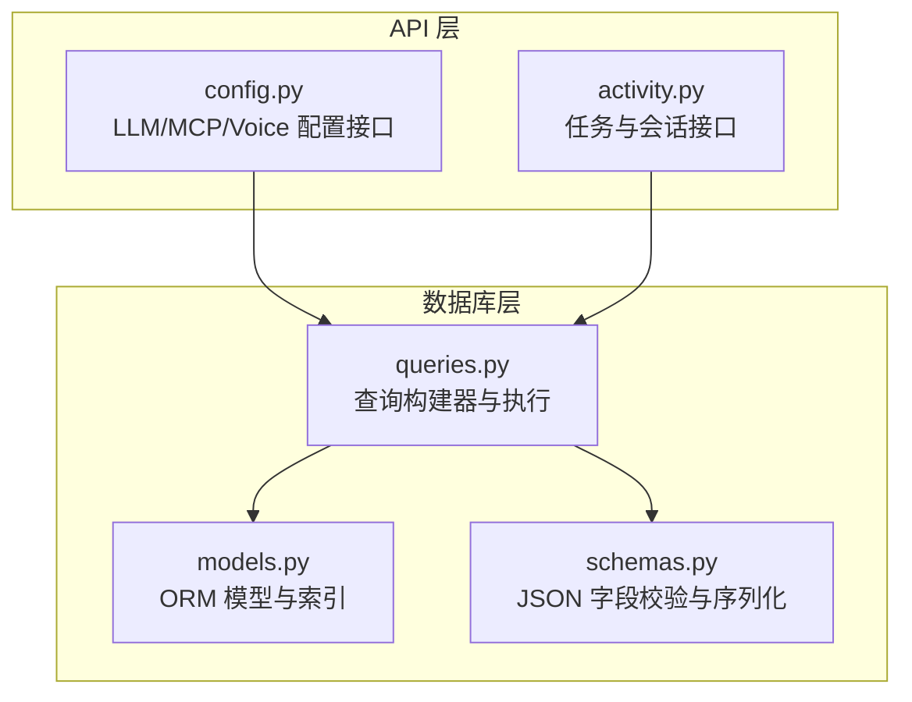
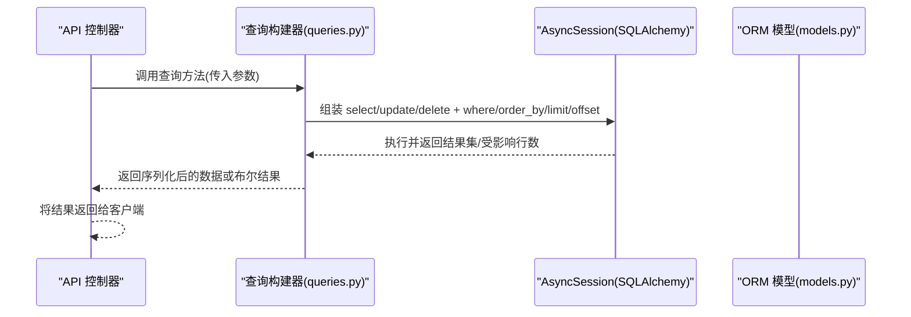
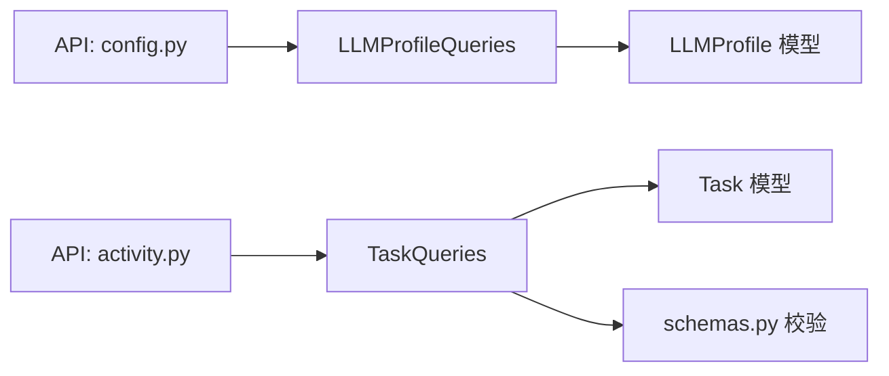

# 查询构建

<cite>
**本文引用的文件**
- [queries.py](file://vibe_surf/backend/database/queries.py)
- [models.py](file://vibe_surf/backend/database/models.py)
- [schemas.py](file://vibe_surf/backend/database/schemas.py)
- [config.py](file://vibe_surf/backend/api/config.py)
- [activity.py](file://vibe_surf/backend/api/activity.py)
</cite>

## 目录
1. [简介](#简介)
2. [项目结构](#项目结构)
3. [核心组件](#核心组件)
4. [架构总览](#架构总览)
5. [详细组件分析](#详细组件分析)
6. [依赖分析](#依赖分析)
7. [性能考量](#性能考量)
8. [故障排查指南](#故障排查指南)
9. [结论](#结论)
10. [附录](#附录)

## 简介
本文件系统性地文档化 VibeSurf 后端数据库查询构建器的设计与实现，重点聚焦于 vibe_surf/backend/database/queries.py 中的查询构建器模式。该模式采用“可组合”的查询构建方式，通过链式调用逐步添加过滤条件、排序规则与分页控制，最终生成 SQLAlchemy 异步查询语句。文档同时覆盖以下主题：
- 查询类型：等值查询、范围查询、模糊匹配（通过 JSON 字段与枚举）、复合条件查询
- 链式构建：where/order_by/limit/offset 的组合使用
- 安全处理：SQL 注入防护与参数绑定
- 与数据库模型映射：ORM 模型与查询方法的对应关系
- 结果序列化：通过 schemas.py 对 JSON 字段进行校验与规范化

## 项目结构
后端数据库层由三层组成：
- models.py：定义 ORM 模型与索引
- queries.py：集中化的查询构建与执行逻辑（异步）
- schemas.py：JSON 字段的 Pydantic 校验与序列化工具

图表来源
- [queries.py](file://vibe_surf/backend/database/queries.py#L1-L120)
- [models.py](file://vibe_surf/backend/database/models.py#L1-L120)
- [schemas.py](file://vibe_surf/backend/database/schemas.py#L1-L100)
- [config.py](file://vibe_surf/backend/api/config.py#L80-L160)
- [activity.py](file://vibe_surf/backend/api/activity.py#L30-L100)

章节来源
- [queries.py](file://vibe_surf/backend/database/queries.py#L1-L120)
- [models.py](file://vibe_surf/backend/database/models.py#L1-L120)
- [schemas.py](file://vibe_surf/backend/database/schemas.py#L1-L100)

## 核心组件
- 查询构建器模式：在 queries.py 中以类方法形式组织，每个模型对应一个查询类（如 LLMProfileQueries、TaskQueries、UploadedFileQueries 等），统一管理 CRUD 与聚合查询。
- 链式构建：通过逐步拼接 select/update/delete 语句与 where/order_by/limit/offset，形成可读且可扩展的查询链。
- 安全处理：所有外部输入均通过 SQLAlchemy 的参数绑定（values/where 条件）传递，避免字符串拼接引发 SQL 注入；敏感字段（API Key）在入库前加密。
- 结果序列化：对 JSON 字段（如任务元数据、LLM 配置、MCP 参数）使用 schemas.py 的 Pydantic 模型进行校验与规范化，确保输出一致性。

章节来源
- [queries.py](file://vibe_surf/backend/database/queries.py#L1-L120)
- [schemas.py](file://vibe_surf/backend/database/schemas.py#L1-L100)

## 架构总览
查询构建器与 API 层的交互流程如下：

图表来源
- [config.py](file://vibe_surf/backend/api/config.py#L80-L160)
- [activity.py](file://vibe_surf/backend/api/activity.py#L30-L100)
- [queries.py](file://vibe_surf/backend/database/queries.py#L440-L520)
- [models.py](file://vibe_surf/backend/database/models.py#L90-L140)

## 详细组件分析

### 查询构建器模式与链式调用
- 模式特征
  - 类方法封装：每个模型一个查询类，方法名直观表达操作意图（如 list_profiles、get_task、update_task_status）。
  - 可组合链路：先构造基础 select，再按需追加 where 条件、排序与分页，最后执行。
  - 参数绑定：where 与 values 均通过 SQLAlchemy 的表达式对象传参，避免 SQL 注入风险。
- 典型链路
  - 过滤：query = query.where(...)
  - 排序：query = query.order_by(...)
  - 分页：query = query.limit(...).offset(...)
- 复合条件：使用 and_、or_ 组合多条件，例如软删除过滤、状态集合筛选等。

章节来源
- [queries.py](file://vibe_surf/backend/database/queries.py#L140-L170)
- [queries.py](file://vibe_surf/backend/database/queries.py#L534-L554)
- [queries.py](file://vibe_surf/backend/database/queries.py#L801-L835)

### 查询类型与实现要点
- 等值查询
  - 示例：按名称、ID、状态等精确匹配。
  - 实现：query.where(Model.field == value)
- 范围查询
  - 示例：时间范围、数值范围（如分页 offset/limit）。
  - 实现：query.where(Model.field >= min).where(Model.field <= max)，或 limit/offset。
- 模糊匹配
  - 示例：JSON 字段的键值匹配、枚举字段匹配。
  - 实现：通过 Pydantic 模型对 JSON 字段进行结构化校验，保证查询与输出一致。
- 复合条件查询
  - 示例：软删除过滤、状态集合筛选、多字段组合。
  - 实现：and_、or_ 组合 where 条件；group_by + func 聚合统计。

章节来源
- [queries.py](file://vibe_surf/backend/database/queries.py#L791-L835)
- [queries.py](file://vibe_surf/backend/database/queries.py#L887-L914)
- [queries.py](file://vibe_surf/backend/database/queries.py#L1202-L1232)
- [schemas.py](file://vibe_surf/backend/database/schemas.py#L1-L100)

### 关联查询与子查询
- 关联查询
  - 通过外键字段（如 Task.llm_profile_name）进行等值关联，查询任务与其配置的关系。
  - 示例：按 LLM 配置名称查询任务列表。
- 子查询
  - 通过聚合函数与 group_by 实现“子查询式”统计（如按会话分组的任务计数、最新状态）。
  - 示例：按 session_id 分组统计任务数量与最新状态。

章节来源
- [queries.py](file://vibe_surf/backend/database/queries.py#L684-L703)
- [queries.py](file://vibe_surf/backend/database/queries.py#L571-L612)

### 聚合查询与分页
- 聚合查询
  - 使用 func.count、func.min、func.max、func.group_by 实现统计与汇总。
  - 示例：按状态分组统计任务数量；按会话分组统计任务数与时间范围。
- 分页
  - 通过 limit/offset 实现分页；-1 表示“获取全部记录”。

章节来源
- [queries.py](file://vibe_surf/backend/database/queries.py#L736-L752)
- [queries.py](file://vibe_surf/backend/database/queries.py#L571-L612)
- [queries.py](file://vibe_surf/backend/database/queries.py#L1202-L1232)

### 安全处理机制
- SQL 注入防护
  - 所有外部输入通过 SQLAlchemy 表达式传入 where/values，不进行字符串拼接。
  - 使用 and_、or_ 构造复合条件，避免动态拼接。
- 参数绑定
  - values(**kwargs) 自动参数化，避免直接拼接用户输入。
- 敏感信息保护
  - API Key 在入库前加密；查询时提供解密接口用于需要使用的场景。
  - JSON 字段存储不包含敏感信息，敏感字段仅在解密后用于运行时。

章节来源
- [queries.py](file://vibe_surf/backend/database/queries.py#L174-L200)
- [queries.py](file://vibe_surf/backend/database/queries.py#L1001-L1028)
- [queries.py](file://vibe_surf/backend/database/queries.py#L1348-L1406)

### 查询参数与结果序列化
- 查询参数
  - 输入参数统一通过方法签名传入，内部进行类型转换与校验（如枚举转换）。
- 结果序列化
  - JSON 字段通过 schemas.py 的 Pydantic 模型进行校验与规范化，确保输出字段一致。
  - 提供 validate_json_field 与 get_schema_for_config_type 工具函数，按配置类型选择合适模型。

章节来源
- [queries.py](file://vibe_surf/backend/database/queries.py#L1030-L1060)
- [schemas.py](file://vibe_surf/backend/database/schemas.py#L1-L100)

### 与数据库模型的映射关系
- TaskQueries 与 Task 模型：任务生命周期管理、状态更新、会话与 LLM 配置关联。
- LLMProfileQueries 与 LLMProfile 模型：LLM 配置的增删改查、默认配置切换、最近使用时间更新。
- UploadedFileQueries 与 UploadedFile 模型：文件上传记录的软删除、清理过期删除记录、按会话查询。
- 其他模型：McpProfile、VoiceProfile、ComposioToolkit、Credential、Schedule 等均有对应的查询类，遵循相同的链式构建与安全处理原则。

章节来源
- [models.py](file://vibe_surf/backend/database/models.py#L90-L140)
- [models.py](file://vibe_surf/backend/database/models.py#L168-L216)
- [models.py](file://vibe_surf/backend/database/models.py#L217-L289)
- [queries.py](file://vibe_surf/backend/database/queries.py#L440-L520)
- [queries.py](file://vibe_surf/backend/database/queries.py#L1-L120)

## 依赖分析
- 查询构建器依赖 SQLAlchemy 异步会话与 ORM 表达式，统一通过 AsyncSession 执行。
- 查询类之间低耦合，按模型职责划分，便于维护与扩展。
- 与 API 层的依赖：API 控制器负责参数解析与业务编排，查询构建器只关注数据访问细节。

图表来源
- [config.py](file://vibe_surf/backend/api/config.py#L80-L160)
- [activity.py](file://vibe_surf/backend/api/activity.py#L30-L100)
- [queries.py](file://vibe_surf/backend/database/queries.py#L440-L520)
- [models.py](file://vibe_surf/backend/database/models.py#L90-L140)
- [schemas.py](file://vibe_surf/backend/database/schemas.py#L1-L100)

章节来源
- [config.py](file://vibe_surf/backend/api/config.py#L80-L160)
- [activity.py](file://vibe_surf/backend/api/activity.py#L30-L100)
- [queries.py](file://vibe_surf/backend/database/queries.py#L440-L520)
- [models.py](file://vibe_surf/backend/database/models.py#L90-L140)
- [schemas.py](file://vibe_surf/backend/database/schemas.py#L1-L100)

## 性能考量
- 索引优化：models.py 中为常用查询字段建立索引（如任务状态、会话 ID、LLM 配置名称等），提升查询效率。
- 分页策略：合理设置 limit/offset，避免一次性加载大量数据；对高频查询字段建立索引。
- 聚合查询：使用 group_by 与聚合函数减少多次往返查询。
- 日志与异常：查询失败时记录错误日志，便于定位性能瓶颈与问题根因。

章节来源
- [models.py](file://vibe_surf/backend/database/models.py#L157-L200)
- [queries.py](file://vibe_surf/backend/database/queries.py#L571-L612)

## 故障排查指南
- 常见问题
  - 查询无结果：检查 where 条件是否正确、枚举值是否匹配、软删除过滤是否生效。
  - 分页异常：确认 limit/offset 是否为正数，-1 表示“获取全部记录”。
  - JSON 字段校验失败：检查 schemas.py 中对应模型字段定义，确保输入结构符合要求。
- 定位方法
  - 查看查询构建器中的 where/order_by/limit/offset 组合是否符合预期。
  - 检查 API 层传入参数是否正确解析与转换（如枚举转换）。
  - 关注日志输出，定位具体失败步骤。

章节来源
- [queries.py](file://vibe_surf/backend/database/queries.py#L140-L170)
- [queries.py](file://vibe_surf/backend/database/queries.py#L801-L835)
- [schemas.py](file://vibe_surf/backend/database/schemas.py#L1-L100)

## 结论
VibeSurf 的查询构建器采用清晰的类方法封装与链式构建模式，结合 SQLAlchemy 的参数绑定与 Pydantic 的 JSON 校验，实现了安全、可维护、可扩展的数据访问层。通过合理的索引设计与分页策略，能够在保证安全性的同时满足性能需求。建议在新增查询时遵循现有模式，保持 where/order_by/limit/offset 的链式组合与统一的错误处理风格。

## 附录
- 实际使用示例（路径参考）
  - 创建 LLM 配置：[LLMProfileQueries.create_profile](file://vibe_surf/backend/database/queries.py#L25-L90)
  - 列出任务（带分页）：[TaskQueries.get_tasks_by_session](file://vibe_surf/backend/database/queries.py#L534-L554)
  - 获取会话汇总（聚合查询）：[TaskQueries.get_all_sessions](file://vibe_surf/backend/database/queries.py#L571-L612)
  - 更新任务状态：[TaskQueries.update_task_status](file://vibe_surf/backend/database/queries.py#L614-L648)
  - 文件列表（含软删除过滤）：[UploadedFileQueries.list_files](file://vibe_surf/backend/database/queries.py#L806-L838)
  - JSON 字段校验与序列化：[schemas.validate_json_field](file://vibe_surf/backend/database/schemas.py#L84-L92)