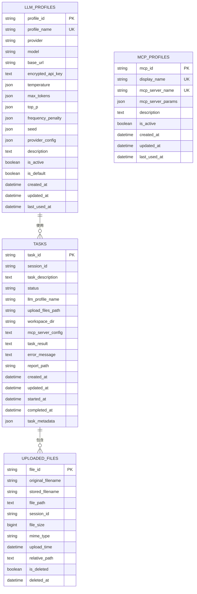
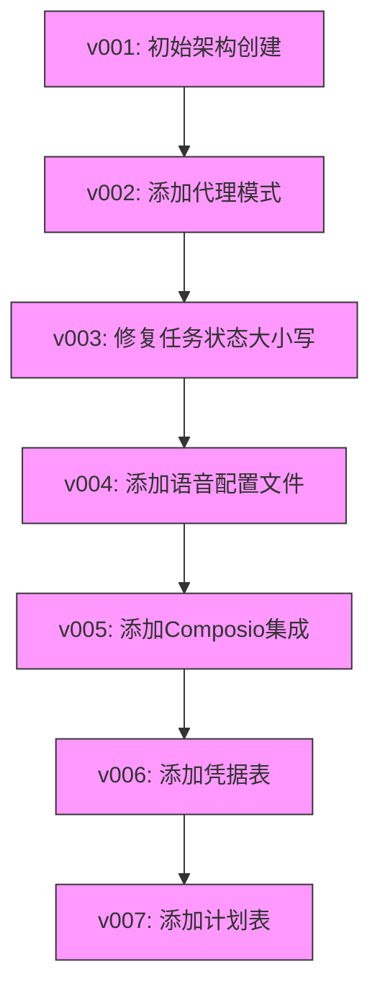
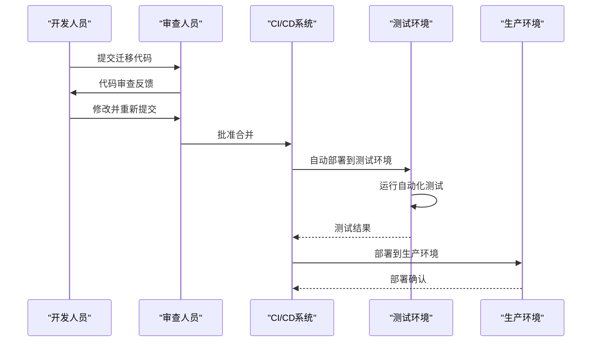
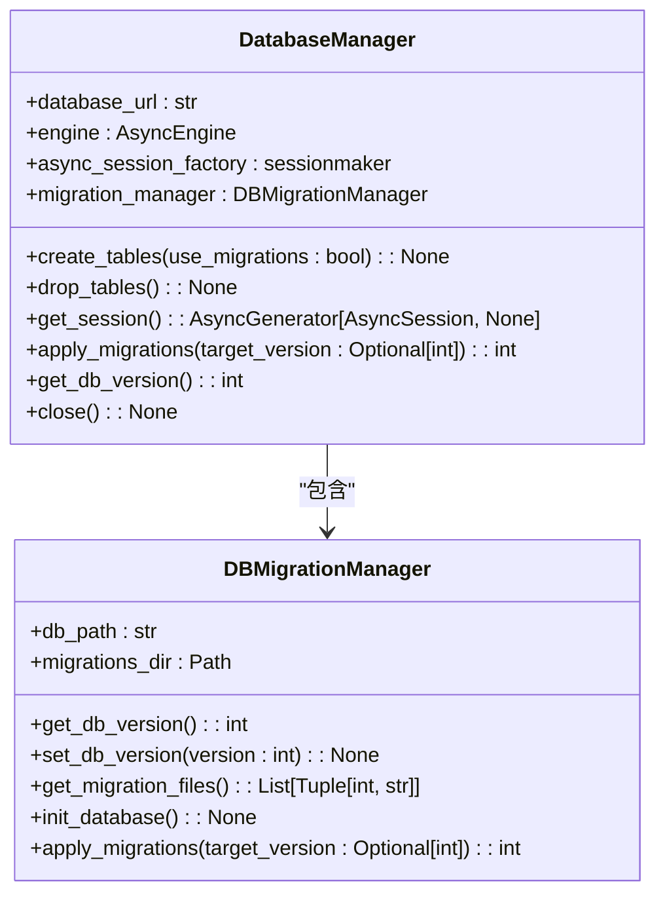

# 协作流程

<cite>
**本文档引用的文件**   
- [v001_initial_schema.sql](file://vibe_surf/backend/database/migrations/v001_initial_schema.sql)
- [v002_add_agent_mode.sql](file://vibe_surf/backend/database/migrations/v002_add_agent_mode.sql)
- [v003_fix_task_status_case.sql](file://vibe_surf/backend/database/migrations/v003_fix_task_status_case.sql)
- [v004_add_voice_profiles.sql](file://vibe_surf/backend/database/migrations/v004_add_voice_profiles.sql)
- [v005_add_composio_integration.sql](file://vibe_surf/backend/database/migrations/v005_add_composio_integration.sql)
- [v006_add_credentials_table.sql](file://vibe_surf/backend/database/migrations/v006_add_credentials_table.sql)
- [v007_add_schedule_table.sql](file://vibe_surf/backend/database/migrations/v007_add_schedule_table.sql)
- [manager.py](file://vibe_surf/backend/database/manager.py)
- [models.py](file://vibe_surf/backend/database/models.py)
- [schemas.py](file://vibe_surf/backend/database/schemas.py)
- [shared_state.py](file://vibe_surf/backend/shared_state.py)
</cite>

## 目录
1. [引言](#引言)
2. [数据库迁移演进历史](#数据库迁移演进历史)
3. [迁移创建与代码审查](#迁移创建与代码审查)
4. [测试验证与部署上线](#测试验证与部署上线)
5. [团队协作与冲突避免](#团队协作与冲突避免)
6. [迁移文档编写规范](#迁移文档编写规范)
7. [团队沟通机制](#团队沟通机制)
8. [自动化工具支持](#自动化工具支持)
9. [结论](#结论)

## 引言
VibeSurf团队在数据库迁移方面建立了一套完整的协作流程和最佳实践，确保数据库变更的安全性、可靠性和可追溯性。本文档基于现有迁移文件(v001-v007)的演进历史，全面描述了迁移开发的工作流，包括迁移创建、代码审查、测试验证和部署上线的完整生命周期。文档还详细说明了如何在团队协作中避免迁移冲突，包括分支管理策略和合并冲突解决方法。通过规范的迁移文档编写、有效的团队沟通机制和自动化工具支持，VibeSurf团队能够高效、可靠地管理数据库变更。

## 数据库迁移演进历史
VibeSurf项目的数据库迁移从v001版本开始，逐步演进到v007版本，每个版本都记录了数据库结构的重要变更。迁移文件采用SQL脚本形式，存放在`vibe_surf/backend/database/migrations/`目录下，文件名遵循`vXXX_description.sql`的命名规范，其中XXX为三位数字版本号。

### 初始架构创建
v001版本创建了数据库的初始架构，包括LLM配置文件表、任务表、上传文件表和MCP配置文件表。该迁移脚本不仅定义了表结构，还创建了必要的索引以提高查询性能，并设置了触发器来自动更新记录的修改时间戳。



**Diagram sources**
- [v001_initial_schema.sql](file://vibe_surf/backend/database/migrations/v001_initial_schema.sql#L1-L118)

**Section sources**
- [v001_initial_schema.sql](file://vibe_surf/backend/database/migrations/v001_initial_schema.sql#L1-L118)
- [models.py](file://vibe_surf/backend/database/models.py#L1-L289)

### 迁移版本演进
随着项目需求的变化，数据库结构也经历了多次迭代。v002版本向任务表添加了`agent_mode`列，用于区分代理的执行模式。v003版本修复了任务状态值的大小写问题，确保与枚举值一致。v004版本引入了语音配置文件表，用于管理语音模型配置。v005版本添加了Composio集成工具包表，支持第三方应用集成。v006版本创建了凭据表，用于存储加密的API密钥。v007版本增加了计划表，用于管理工作流的调度执行。



**Diagram sources**
- [v001_initial_schema.sql](file://vibe_surf/backend/database/migrations/v001_initial_schema.sql#L1-L118)
- [v002_add_agent_mode.sql](file://vibe_surf/backend/database/migrations/v002_add_agent_mode.sql#L1-L6)
- [v003_fix_task_status_case.sql](file://vibe_surf/backend/database/migrations/v003_fix_task_status_case.sql#L1-L11)
- [v004_add_voice_profiles.sql](file://vibe_surf/backend/database/migrations/v004_add_voice_profiles.sql#L1-L35)
- [v005_add_composio_integration.sql](file://vibe_surf/backend/database/migrations/v005_add_composio_integration.sql#L1-L33)
- [v006_add_credentials_table.sql](file://vibe_surf/backend/database/migrations/v006_add_credentials_table.sql#L1-L26)
- [v007_add_schedule_table.sql](file://vibe_surf/backend/database/migrations/v007_add_schedule_table.sql#L1-L29)

**Section sources**
- [v001_initial_schema.sql](file://vibe_surf/backend/database/migrations/v001_initial_schema.sql#L1-L118)
- [v002_add_agent_mode.sql](file://vibe_surf/backend/database/migrations/v002_add_agent_mode.sql#L1-L6)
- [v003_fix_task_status_case.sql](file://vibe_surf/backend/database/migrations/v003_fix_task_status_case.sql#L1-L11)
- [v004_add_voice_profiles.sql](file://vibe_surf/backend/database/migrations/v004_add_voice_profiles.sql#L1-L35)
- [v005_add_composio_integration.sql](file://vibe_surf/backend/database/migrations/v005_add_composio_integration.sql#L1-L33)
- [v006_add_credentials_table.sql](file://vibe_surf/backend/database/migrations/v006_add_credentials_table.sql#L1-L26)
- [v007_add_schedule_table.sql](file://vibe_surf/backend/database/migrations/v007_add_schedule_table.sql#L1-L29)

## 迁移创建与代码审查
VibeSurf团队的数据库迁移创建流程遵循严格的规范和最佳实践。每个迁移都从一个清晰的变更需求开始，开发人员在创建迁移脚本时需要遵循统一的模板和命名规范。

### 迁移创建规范
迁移文件必须以`v`开头，后跟三位数字版本号，然后是描述性的名称，最后以`.sql`结尾。每个迁移脚本都包含标准化的注释头，说明迁移的名称、描述和版本号。脚本内容应包含所有必要的SQL语句，包括表结构变更、数据迁移和索引创建。

```sql
-- Migration: v002_add_agent_mode.sql
-- Description: Add agent_mode column to tasks table
-- Version: 0.0.2

-- Add agent_mode column to tasks table with default value 'thinking'
ALTER TABLE tasks ADD COLUMN agent_mode VARCHAR(50) DEFAULT 'thinking';
```

**Section sources**
- [v002_add_agent_mode.sql](file://vibe_surf/backend/database/migrations/v002_add_agent_mode.sql#L1-L6)

### 代码审查流程
所有数据库迁移都必须经过代码审查才能合并到主分支。审查重点包括：SQL语句的正确性、性能影响评估、数据完整性保证、回滚方案的可行性以及文档的完整性。审查人员会检查迁移是否遵循了团队的编码规范，是否包含了必要的索引，以及是否考虑了潜在的并发问题。

## 测试验证与部署上线
在数据库迁移通过代码审查后，需要经过严格的测试验证才能部署上线。VibeSurf团队采用多层次的测试策略，确保迁移在各种环境下的稳定性和可靠性。

### 测试验证流程
测试流程包括单元测试、集成测试和端到端测试。单元测试验证单个SQL语句的正确性，集成测试检查迁移对应用程序功能的影响，端到端测试模拟真实用户场景。测试环境与生产环境保持一致，确保测试结果的可靠性。



**Diagram sources**
- [manager.py](file://vibe_surf/backend/database/manager.py#L1-L319)

**Section sources**
- [manager.py](file://vibe_surf/backend/database/manager.py#L1-L319)
- [shared_state.py](file://vibe_surf/backend/shared_state.py#L1-L800)

### 部署上线策略
VibeSurf团队采用渐进式部署策略，先在预生产环境验证迁移效果，然后在低峰时段部署到生产环境。部署过程中会监控数据库性能指标和应用程序日志，确保迁移不会对系统稳定性造成影响。如果发现问题，可以立即执行回滚预案。

## 团队协作与冲突避免
为了在团队协作中避免数据库迁移冲突，VibeSurf团队实施了有效的分支管理策略和合并冲突解决方法。

### 分支管理策略
团队采用Git Flow工作流，每个迁移都在独立的特性分支上开发。分支命名遵循`migration/vXXX-description`的规范，便于识别和管理。开发人员在创建分支前需要同步主分支的最新代码，确保基于最新的数据库结构进行开发。

### 合并冲突解决
当多个迁移同时开发时，可能会出现合并冲突。团队的解决方法是：首先评估冲突的性质，如果是简单的顺序问题，则调整迁移版本号；如果是结构性冲突，则需要协调相关开发人员共同解决。在解决冲突后，需要重新进行完整的测试验证。

## 迁移文档编写规范
每个数据库迁移都必须有清晰的变更说明和影响评估，确保团队成员能够理解迁移的目的和影响。

### 文档内容要求
迁移文档应包括：变更目的、影响范围、数据迁移方案、性能影响评估、回滚方案和测试计划。文档应使用清晰、简洁的语言编写，避免技术术语的过度使用，确保非技术人员也能理解。

### 影响评估
影响评估应详细说明迁移对现有功能的影响，包括API变更、数据结构变更和性能影响。对于重大变更，还需要评估对用户体验的影响，并制定相应的沟通计划。

## 团队沟通机制
VibeSurf团队建立了有效的沟通机制，确保数据库迁移的相关信息能够及时传达给所有相关人员。

### 迁移通知
在迁移创建和部署的关键节点，团队会通过邮件、即时通讯工具或项目管理平台发送通知。通知内容包括迁移的简要描述、影响范围、预计时间和联系人信息。

### 回滚预案协调
每个迁移都必须有明确的回滚预案，并在团队内部进行协调。回滚预案应包括：回滚条件、回滚步骤、预期影响和恢复时间。团队成员需要熟悉回滚流程，确保在紧急情况下能够快速响应。

## 自动化工具支持
VibeSurf团队通过自动化工具支持数据库迁移流程，提高效率和可靠性。

### 迁移管理工具
团队使用自定义的迁移管理器（DBMigrationManager）来自动化迁移应用过程。该工具能够检测当前数据库版本，按顺序应用未执行的迁移，并记录迁移状态。



**Diagram sources**
- [manager.py](file://vibe_surf/backend/database/manager.py#L27-L273)

**Section sources**
- [manager.py](file://vibe_surf/backend/database/manager.py#L27-L273)

### 自动化测试
团队建立了完整的自动化测试套件，包括单元测试、集成测试和端到端测试。这些测试在CI/CD流水线中自动执行，确保每次代码变更都不会破坏现有功能。

## 结论
VibeSurf团队通过建立完善的数据库迁移协作流程和最佳实践，确保了数据库变更的安全性、可靠性和可追溯性。从迁移创建、代码审查、测试验证到部署上线的完整生命周期管理，结合有效的团队协作、沟通机制和自动化工具支持，团队能够高效、可靠地管理数据库变更。这些实践不仅提高了开发效率，还降低了生产环境的风险，为项目的稳定运行提供了有力保障。