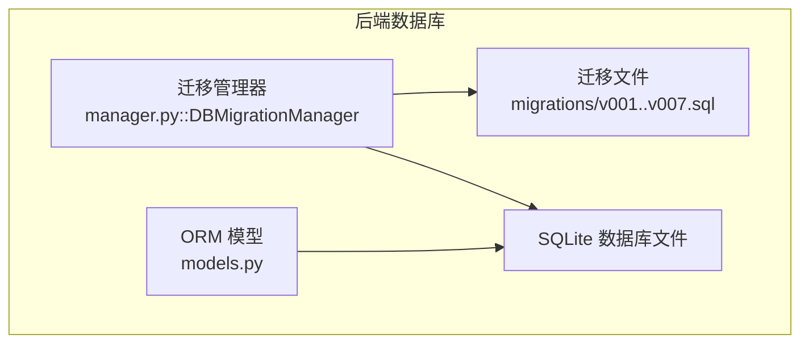
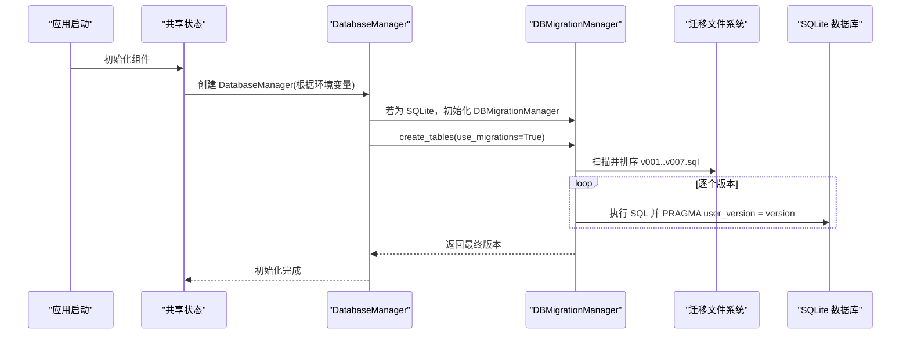
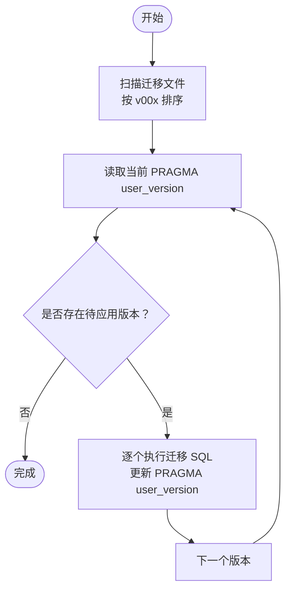

# 版本控制

<cite>
**本文引用的文件**
- [v001_initial_schema.sql](file://vibe_surf/backend/database/migrations/v001_initial_schema.sql)
- [v002_add_agent_mode.sql](file://vibe_surf/backend/database/migrations/v002_add_agent_mode.sql)
- [v003_fix_task_status_case.sql](file://vibe_surf/backend/database/migrations/v003_fix_task_status_case.sql)
- [v004_add_voice_profiles.sql](file://vibe_surf/backend/database/migrations/v004_add_voice_profiles.sql)
- [v005_add_composio_integration.sql](file://vibe_surf/backend/database/migrations/v005_add_composio_integration.sql)
- [v006_add_credentials_table.sql](file://vibe_surf/backend/database/migrations/v006_add_credentials_table.sql)
- [v007_add_schedule_table.sql](file://vibe_surf/backend/database/migrations/v007_add_schedule_table.sql)
- [manager.py](file://vibe_surf/backend/database/manager.py)
- [models.py](file://vibe_surf/backend/database/models.py)
- [schemas.py](file://vibe_surf/backend/database/schemas.py)
- [shared_state.py](file://vibe_surf/backend/shared_state.py)
- [main.py](file://vibe_surf/backend/main.py)
</cite>

## 目录
1. [简介](#简介)
2. [项目结构](#项目结构)
3. [核心组件](#核心组件)
4. [架构总览](#架构总览)
5. [详细组件分析](#详细组件分析)
6. [依赖关系分析](#依赖关系分析)
7. [性能考量](#性能考量)
8. [故障排查指南](#故障排查指南)
9. [结论](#结论)
10. [附录](#附录)

## 简介
本文围绕 VibeSurf 后端数据库迁移的版本控制系统进行系统性解析，聚焦于从 v001 到 v007 的迁移文件演进路径。文档将：
- 解释版本命名约定（v00x）与版本递增规则；
- 说明如何通过版本号追踪数据库模式历史变更；
- 文档化版本依赖关系与执行顺序管理机制，包括跨版本数据转换；
- 提供版本回滚策略与应急恢复流程；
- 给出版本冲突检测与解决策略，以及在多分支开发环境中的协调方法；
- 展示版本控制与 CI/CD 流程的集成方式。

## 项目结构
VibeSurf 的数据库迁移采用 SQLite 原生的 PRAGMA user_version 进行版本标记，并以独立的 SQL 文件按序执行。迁移文件位于后端数据库目录下，迁移管理器负责扫描、排序与应用这些 SQL 文件；同时，ORM 模型定义了表结构与索引，用于直接建表或与迁移协同工作。



图表来源
- [manager.py](file://vibe_surf/backend/database/manager.py#L27-L145)
- [v001_initial_schema.sql](file://vibe_surf/backend/database/migrations/v001_initial_schema.sql#L1-L118)
- [v007_add_schedule_table.sql](file://vibe_surf/backend/database/migrations/v007_add_schedule_table.sql#L1-L29)

章节来源
- [manager.py](file://vibe_surf/backend/database/manager.py#L27-L145)
- [models.py](file://vibe_surf/backend/database/models.py#L1-L289)

## 核心组件
- 迁移管理器（DBMigrationManager）
  - 负责发现、排序与应用迁移文件，设置/读取 PRAGMA user_version 实现版本跟踪。
  - 仅支持 SQLite 数据库。
- 数据库管理器（DatabaseManager）
  - 提供创建表、会话管理、迁移应用入口；当使用 SQLite 时自动注入迁移管理器。
- 迁移文件（migrations/v001..v007.sql）
  - 每个文件对应一个版本，包含完整的 DDL/DML 变更与必要的触发器、索引。
- ORM 模型（models.py）
  - 定义各表字段、索引与枚举，用于直接建表或与迁移保持一致。

章节来源
- [manager.py](file://vibe_surf/backend/database/manager.py#L27-L201)
- [models.py](file://vibe_surf/backend/database/models.py#L1-L289)

## 架构总览
迁移执行链路如下：应用启动时通过共享状态初始化数据库管理器，随后调用 create_tables/use_migrations，迁移管理器扫描迁移文件并按版本顺序执行，最终更新 PRAGMA user_version。



图表来源
- [shared_state.py](file://vibe_surf/backend/shared_state.py#L517-L539)
- [manager.py](file://vibe_surf/backend/database/manager.py#L148-L201)
- [manager.py](file://vibe_surf/backend/database/manager.py#L203-L273)

章节来源
- [shared_state.py](file://vibe_surf/backend/shared_state.py#L517-L539)
- [manager.py](file://vibe_surf/backend/database/manager.py#L148-L201)

## 详细组件分析

### 版本命名约定与递增规则
- 命名格式：v00x_描述.sql，其中 00x 为三位十进制版本号。
- 递增规则：版本号严格线性递增，v001 → v002 → ... → v007。
- 版本号解析：迁移管理器通过正则匹配文件名中的数字部分提取版本号并排序。

章节来源
- [manager.py](file://vibe_surf/backend/database/manager.py#L71-L86)

### 迁移文件演进路径与变更要点
- v001_initial_schema.sql
  - 创建核心表：llm_profiles、tasks、uploaded_files、mcp_profiles。
  - 建立关键索引与触发器，确保更新时间戳一致性。
- v002_add_agent_mode.sql
  - 在 tasks 表新增 agent_mode 字段，默认值为“thinking”。
- v003_fix_task_status_case.sql
  - 将 tasks.status 的大写枚举值统一转为小写，与 TaskStatus 枚举对齐。
- v004_add_voice_profiles.sql
  - 新增 voice_profiles 表，支持语音模型配置；建立索引与触发器。
- v005_add_composio_integration.sql
  - 新增 composio_toolkits 表，支持 Composio 工具集管理；建立索引与触发器。
- v006_add_credentials_table.sql
  - 新增 credentials 表，存储加密密钥；建立索引与触发器。
- v007_add_schedule_table.sql
  - 新增 schedules 表，支持工作流定时调度；建立索引与触发器。

章节来源
- [v001_initial_schema.sql](file://vibe_surf/backend/database/migrations/v001_initial_schema.sql#L1-L118)
- [v002_add_agent_mode.sql](file://vibe_surf/backend/database/migrations/v002_add_agent_mode.sql#L1-L6)
- [v003_fix_task_status_case.sql](file://vibe_surf/backend/database/migrations/v003_fix_task_status_case.sql#L1-L11)
- [v004_add_voice_profiles.sql](file://vibe_surf/backend/database/migrations/v004_add_voice_profiles.sql#L1-L35)
- [v005_add_composio_integration.sql](file://vibe_surf/backend/database/migrations/v005_add_composio_integration.sql#L1-L33)
- [v006_add_credentials_table.sql](file://vibe_surf/backend/database/migrations/v006_add_credentials_table.sql#L1-L26)
- [v007_add_schedule_table.sql](file://vibe_surf/backend/database/migrations/v007_add_schedule_table.sql#L1-L29)

### 版本依赖关系与执行顺序管理
- 顺序约束
  - v001 必须先于 v002、v003、v004、v005、v006、v007；
  - v002、v003 与后续版本无直接外键依赖，但存在逻辑依赖（如状态大小写修正）。
- 依赖检测
  - 迁移管理器按版本号升序遍历，跳过已应用版本与超过目标版本的文件。
  - 当目标版本未指定时，默认应用到最高可用版本。
- 跨版本数据转换
  - v003 中的状态大小写转换属于数据层转换，需在相应表上执行 UPDATE。

章节来源
- [manager.py](file://vibe_surf/backend/database/manager.py#L99-L145)
- [v003_fix_task_status_case.sql](file://vibe_surf/backend/database/migrations/v003_fix_task_status_case.sql#L1-L11)

### 版本回滚策略与应急恢复流程
- 回滚能力现状
  - 迁移管理器未内置回滚逻辑，仅能向前应用到指定版本。
- 应急恢复建议
  - 使用 SQLite 备份/快照：在升级前备份数据库文件，失败时回滚。
  - 通过目标版本参数降级：若未来实现回滚脚本，可先应用到较低版本再继续。
  - 手动修复：针对数据转换类问题（如大小写），可在应用前手动修正或在应用后执行反向 UPDATE。
- 注意事项
  - 迁移管理器仅支持 SQLite；非 SQLite 场景需另行处理。

章节来源
- [manager.py](file://vibe_surf/backend/database/manager.py#L241-L257)

### 版本冲突检测与解决策略
- 冲突类型
  - 文件命名不规范导致无法识别版本号；
  - 多分支引入同名版本号的迁移文件，造成重复。
- 检测手段
  - 迁移管理器扫描阶段会记录不符合命名模式的文件；
  - 排序后若出现重复版本号，应人工干预。
- 解决策略
  - 规范命名：确保文件名符合 v00x_描述.sql；
  - 分支隔离：不同分支使用不同版本号，合并前统一重排；
  - 升级策略：合并后统一提升版本号，避免重复。

章节来源
- [manager.py](file://vibe_surf/backend/database/manager.py#L71-L86)

### 多分支开发环境协调
- 版本号分配
  - 为每个分支预留连续版本号区间，避免冲突。
- 合并与发布
  - 合并前统一重排版本号，确保线性递增；
  - 发布前在主干上执行一次全量迁移验证。
- 并行开发
  - 开发分支间避免共享相同版本号，必要时通过临时命名或分支后缀区分。

章节来源
- [manager.py](file://vibe_surf/backend/database/manager.py#L71-L86)

### 与 ORM 模型的一致性
- 迁移与 ORM 的关系
  - 迁移文件定义完整表结构；ORM 模型用于直接建表或与迁移保持一致。
  - 当 use_migrations=True 时优先走迁移；否则走 Base.metadata.create_all。
- 一致性保障
  - 迁移文件中包含索引与触发器，ORM 模型也定义了等价索引，确保查询性能与数据完整性。

章节来源
- [models.py](file://vibe_surf/backend/database/models.py#L1-L289)
- [manager.py](file://vibe_surf/backend/database/manager.py#L203-L223)

### CI/CD 集成方式
- 启动阶段
  - 应用启动时通过共享状态初始化数据库管理器并应用迁移。
- 自动化流程
  - 在部署流水线中，先拉取代码，再运行数据库初始化步骤，确保迁移按序执行。
- 失败处理
  - 迁移失败时记录错误并抛出异常，便于 CI 捕获并终止部署。
- 环境变量
  - 通过环境变量 VIBESURF_DATABASE_URL 指定数据库位置，便于在不同环境复用同一迁移体系。

章节来源
- [shared_state.py](file://vibe_surf/backend/shared_state.py#L517-L539)
- [main.py](file://vibe_surf/backend/main.py#L327-L371)
- [manager.py](file://vibe_surf/backend/database/manager.py#L148-L201)

## 依赖关系分析
迁移管理器依赖于：
- 迁移文件系统：按文件名解析版本号并排序；
- SQLite 引擎：使用 aiosqlite 执行 SQL 与 PRAGMA；
- 共享状态：在应用启动时注入数据库管理器。

```mermaid
classDiagram
class DBMigrationManager {
+get_db_version() int
+set_db_version(version) void
+get_migration_files() List
+apply_migrations(target_version) int
}
class DatabaseManager {
+create_tables(use_migrations) void
+apply_migrations(target_version) int
+get_db_version() int
}
class MigrationFiles {
<<files>>
"v001_*.sql"
"v002_*.sql"
"v003_*.sql"
"v004_*.sql"
"v005_*.sql"
"v006_*.sql"
"v007_*.sql"
}
DatabaseManager --> DBMigrationManager : "委托"
DBMigrationManager --> MigrationFiles : "扫描/排序"
```

图表来源
- [manager.py](file://vibe_surf/backend/database/manager.py#L27-L145)
- [manager.py](file://vibe_surf/backend/database/manager.py#L203-L273)

章节来源
- [manager.py](file://vibe_surf/backend/database/manager.py#L27-L145)
- [manager.py](file://vibe_surf/backend/database/manager.py#L203-L273)

## 性能考量
- 索引设计
  - 迁移文件与 ORM 模型均定义了关键列上的索引，有助于查询性能。
- 触发器
  - 为多张表添加了更新时间戳的触发器，减少业务层维护成本。
- 迁移执行
  - 逐版本执行，避免一次性大事务；失败即中断，降低风险。

章节来源
- [v001_initial_schema.sql](file://vibe_surf/backend/database/migrations/v001_initial_schema.sql#L79-L118)
- [v004_add_voice_profiles.sql](file://vibe_surf/backend/database/migrations/v004_add_voice_profiles.sql#L24-L35)
- [v007_add_schedule_table.sql](file://vibe_surf/backend/database/migrations/v007_add_schedule_table.sql#L17-L29)
- [models.py](file://vibe_surf/backend/database/models.py#L157-L289)

## 故障排查指南
- 常见问题
  - 迁移文件未被识别：检查文件名是否符合 v00x_描述.sql。
  - 迁移失败：查看日志中具体错误信息，定位 SQL 语法或约束冲突。
  - 非 SQLite 数据库：迁移管理器不可用，需改用其他迁移方案。
- 排查步骤
  - 确认数据库 URL 是否为 SQLite；
  - 查看当前 PRAGMA user_version；
  - 逐步执行迁移，观察中间状态；
  - 如需回滚，采用数据库备份/快照策略。
- 相关接口
  - 获取/设置版本：get_db_version、set_db_version；
  - 应用迁移：apply_migrations；
  - 初始化：create_tables(use_migrations=True)。

章节来源
- [manager.py](file://vibe_surf/backend/database/manager.py#L55-L70)
- [manager.py](file://vibe_surf/backend/database/manager.py#L99-L145)
- [manager.py](file://vibe_surf/backend/database/manager.py#L241-L257)

## 结论
VibeSurf 的数据库迁移采用轻量、可移植的 SQLite 原生方案：以 PRAGMA user_version 作为版本锚点，以 v00x 命名的 SQL 文件作为版本单元，配合迁移管理器实现顺序化、幂等化的演进。该方案简单可靠，适合单机与开发环境；在生产与多环境场景中，建议结合备份/快照与 CI/CD 流水线，确保迁移安全可控。

## 附录
- 版本演进流程图（概念示意）



[此图为概念示意，无需图表来源]