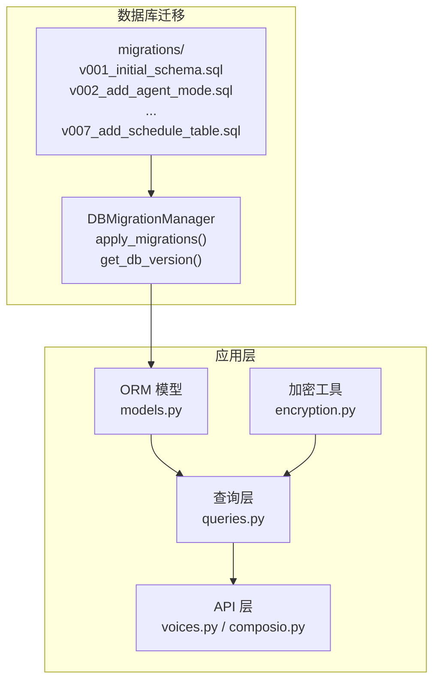
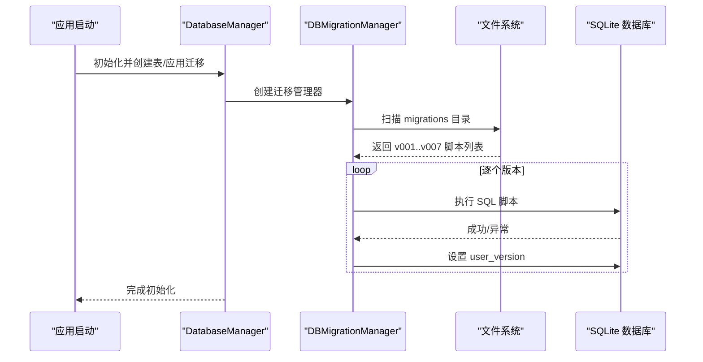
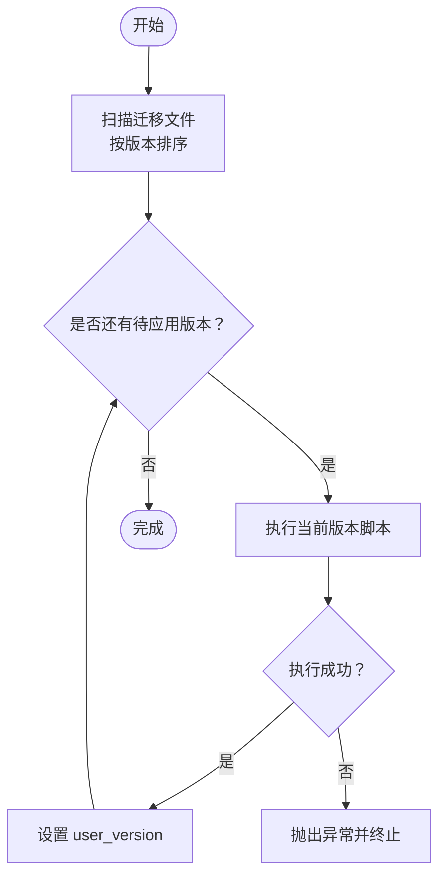
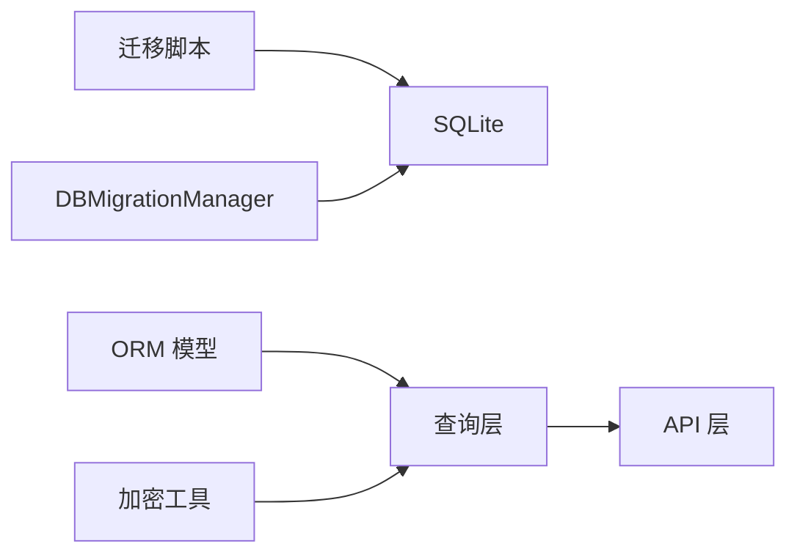

# 迁移策略

<cite>
**本文引用的文件**
- [v001_initial_schema.sql](file://vibe_surf/backend/database/migrations/v001_initial_schema.sql)
- [v002_add_agent_mode.sql](file://vibe_surf/backend/database/migrations/v002_add_agent_mode.sql)
- [v003_fix_task_status_case.sql](file://vibe_surf/backend/database/migrations/v003_fix_task_status_case.sql)
- [v004_add_voice_profiles.sql](file://vibe_surf/backend/database/migrations/v004_add_voice_profiles.sql)
- [v005_add_composio_integration.sql](file://vibe_surf/backend/database/migrations/v005_add_composio_integration.sql)
- [v006_add_credentials_table.sql](file://vibe_surf/backend/database/migrations/v006_add_credentials_table.sql)
- [v007_add_schedule_table.sql](file://vibe_surf/backend/database/migrations/v007_add_schedule_table.sql)
- [manager.py](file://vibe_surf/backend/database/manager.py)
- [models.py](file://vibe_surf/backend/database/models.py)
- [schemas.py](file://vibe_surf/backend/database/schemas.py)
- [queries.py](file://vibe_surf/backend/database/queries.py)
- [encryption.py](file://vibe_surf/backend/utils/encryption.py)
- [voices.py](file://vibe_surf/backend/api/voices.py)
- [composio.py](file://vibe_surf/backend/api/composio.py)
</cite>

## 目录
1. [引言](#引言)
2. [项目结构](#项目结构)
3. [核心组件](#核心组件)
4. [架构总览](#架构总览)
5. [详细组件分析](#详细组件分析)
6. [依赖关系分析](#依赖关系分析)
7. [性能考量](#性能考量)
8. [故障排查指南](#故障排查指南)
9. [结论](#结论)
10. [附录](#附录)

## 引言
本文件系统性梳理 VibeSurf 的数据库迁移策略，聚焦从 v001 到 v007 各个迁移脚本的设计理念与实现方式，解释增量式迁移方法的优势，并总结迁移类型（新增表、修改字段、数据转换等）的处理模式。文档还涵盖迁移的原子性原则与事务管理机制，结合实际案例说明如何在引入新功能（如 Composio 集成、语音配置文件）时保持向后兼容性，并给出迁移性能优化建议与风险评估框架。

## 项目结构
VibeSurf 的数据库迁移采用“独立 SQL 脚本 + 管理器”的模式：
- 迁移脚本位于 vibe_surf/backend/database/migrations/，按版本号命名（v001、v002…），每个脚本独立描述一次数据库变更。
- 数据库管理器负责扫描迁移目录、读取脚本、执行并维护 user_version 版本标记。
- ORM 模型与查询层定义了应用侧的数据结构与访问接口，确保迁移后业务逻辑可无缝对接。

图表来源
- [manager.py](file://vibe_surf/backend/database/manager.py#L1-L146)
- [models.py](file://vibe_surf/backend/database/models.py#L1-L289)
- [queries.py](file://vibe_surf/backend/database/queries.py#L1-L800)
- [voices.py](file://vibe_surf/backend/api/voices.py#L1-L481)
- [composio.py](file://vibe_surf/backend/api/composio.py#L1-L420)
- [encryption.py](file://vibe_surf/backend/utils/encryption.py#L1-L172)

章节来源
- [manager.py](file://vibe_surf/backend/database/manager.py#L1-L146)

## 核心组件
- 迁移管理器：负责发现迁移文件、按序执行、设置 user_version，以及在失败时抛出错误。
- 迁移脚本：每个版本一个 SQL 文件，描述新增表、索引、触发器或字段变更。
- ORM 模型与查询：为应用提供类型安全的模型与查询封装，保证业务与数据库结构一致。
- 加密工具：对敏感字段（如 API Key）进行机密性保护，配合迁移中的加密存储策略。

章节来源
- [manager.py](file://vibe_surf/backend/database/manager.py#L1-L146)
- [models.py](file://vibe_surf/backend/database/models.py#L1-L289)
- [encryption.py](file://vibe_surf/backend/utils/encryption.py#L1-L172)

## 架构总览
下图展示了从迁移脚本到应用层的调用链路与数据流：

图表来源
- [manager.py](file://vibe_surf/backend/database/manager.py#L87-L146)

## 详细组件分析

### v001_initial_schema：初始数据库结构
- 设计理念：一次性建立核心实体与索引，确保任务执行、LLM 配置、上传文件、MCP 配置等基础能力可用。
- 主要变更：
  - 新增 llm_profiles、tasks、uploaded_files、mcp_profiles 表。
  - 建立多处索引以提升查询性能。
  - 添加各表的更新时间戳自动更新触发器。
- 兼容性：为后续版本的字段扩展预留空间；状态枚举值在后续版本中统一为小写。

章节来源
- [v001_initial_schema.sql](file://vibe_surf/backend/database/migrations/v001_initial_schema.sql#L1-L118)
- [models.py](file://vibe_surf/backend/database/models.py#L94-L137)
- [models.py](file://vibe_surf/backend/database/models.py#L138-L191)
- [models.py](file://vibe_surf/backend/database/models.py#L192-L216)

### v002_add_agent_mode：新增字段
- 设计理念：在不破坏现有数据的前提下，为 tasks 表增加 agent_mode 字段，支持不同代理执行模式。
- 主要变更：ALTER TABLE 添加 agent_mode，默认值为 'thinking'。
- 兼容性：默认值确保旧任务记录也能正常运行；不影响既有状态机。

章节来源
- [v002_add_agent_mode.sql](file://vibe_surf/backend/database/migrations/v002_add_agent_mode.sql#L1-L6)
- [models.py](file://vibe_surf/backend/database/models.py#L118-L136)

### v003_fix_task_status_case：数据转换
- 设计理念：修复历史数据大小写不一致问题，使状态值与应用枚举保持一致。
- 主要变更：UPDATE 将大写状态转换为小写，确保后续状态校验与前端/后端一致性。
- 兼容性：仅做数据规范化，不改变表结构。

章节来源
- [v003_fix_task_status_case.sql](file://vibe_surf/backend/database/migrations/v003_fix_task_status_case.sql#L1-L11)
- [models.py](file://vibe_surf/backend/database/models.py#L16-L33)

### v004_add_voice_profiles：新增表
- 设计理念：引入 voice_profiles 表，集中管理语音模型配置（ASR/TTS），并与加密工具配合保护 API Key。
- 主要变更：
  - 新建 voice_profiles 表，含唯一名称、类型（asr/tts）、元参数、加密 API Key 等。
  - 建立索引与更新触发器。
- 兼容性：与现有任务流程解耦，新增功能不影响既有任务与 LLM 配置。

章节来源
- [v004_add_voice_profiles.sql](file://vibe_surf/backend/database/migrations/v004_add_voice_profiles.sql#L1-L35)
- [models.py](file://vibe_surf/backend/database/models.py#L29-L56)
- [voices.py](file://vibe_surf/backend/api/voices.py#L1-L180)
- [encryption.py](file://vibe_surf/backend/utils/encryption.py#L76-L127)

### v005_add_composio_integration：新增表
- 设计理念：为 Composio 工具集管理提供独立表，支持启用/禁用、工具同步与连接状态跟踪。
- 主要变更：
  - 新建 composio_toolkits 表，包含名称、slug、描述、logo、启用状态、工具清单等。
  - 建立索引与更新触发器。
- 兼容性：与语音配置文件类似，新增表不改变现有任务与 LLM 流程。

章节来源
- [v005_add_composio_integration.sql](file://vibe_surf/backend/database/migrations/v005_add_composio_integration.sql#L1-L33)
- [models.py](file://vibe_surf/backend/database/models.py#L192-L216)
- [composio.py](file://vibe_surf/backend/api/composio.py#L1-L120)

### v006_add_credentials_table：新增表
- 设计理念：统一存储加密后的敏感凭据（如 Composio API Key），避免散落于其他表或明文存储。
- 主要变更：
  - 新建 credentials 表，键名唯一，存储加密值与描述。
  - 建立索引与更新触发器。
- 兼容性：为未来更多外部服务凭据提供通用存储方案。

章节来源
- [v006_add_credentials_table.sql](file://vibe_surf/backend/database/migrations/v006_add_credentials_table.sql#L1-L26)
- [models.py](file://vibe_surf/backend/database/models.py#L217-L235)
- [composio.py](file://vibe_surf/backend/api/composio.py#L148-L195)

### v007_add_schedule_table：新增表
- 设计理念：为工作流调度提供统一入口，支持基于 cron 的周期执行与执行统计。
- 主要变更：
  - 新建 schedules 表，包含 flow_id 唯一约束、cron 表达式、启用状态、下次/上次执行时间、执行次数等。
  - 建立索引与更新触发器。
- 兼容性：与现有任务/LLM/语音/集成表解耦，新增调度能力不影响既有流程。

章节来源
- [v007_add_schedule_table.sql](file://vibe_surf/backend/database/migrations/v007_add_schedule_table.sql#L1-L29)
- [models.py](file://vibe_surf/backend/database/models.py#L258-L284)

### 迁移执行流程与原子性
- 执行流程：迁移管理器扫描版本号，按顺序执行未应用的脚本，每成功执行一个脚本即设置 user_version。
- 原子性与事务：
  - 当前实现以 executescript 逐个脚本执行，未显式包裹单事务块。
  - 若某脚本失败，会抛出异常并终止，避免部分应用导致不一致。
  - 建议在需要强一致性的场景（如跨表级联变更）考虑将相关 DDL/DML 合并到同一脚本内，减少中间态。

图表来源
- [manager.py](file://vibe_surf/backend/database/manager.py#L87-L146)

章节来源
- [manager.py](file://vibe_surf/backend/database/manager.py#L87-L146)

### 迁移类型与处理模式
- 新增表：v001、v004、v005、v006、v007
- 修改字段：v002（新增 agent_mode）
- 数据转换：v003（状态大小写规范化）
- 处理模式：
  - 新增表：在迁移脚本中直接 CREATE TABLE，并配套索引与触发器。
  - 修改字段：使用 ALTER TABLE 添加列并设置默认值，保证向后兼容。
  - 数据转换：使用 UPDATE 对历史数据进行规范化，避免破坏现有业务。

章节来源
- [v001_initial_schema.sql](file://vibe_surf/backend/database/migrations/v001_initial_schema.sql#L1-L118)
- [v002_add_agent_mode.sql](file://vibe_surf/backend/database/migrations/v002_add_agent_mode.sql#L1-L6)
- [v003_fix_task_status_case.sql](file://vibe_surf/backend/database/migrations/v003_fix_task_status_case.sql#L1-L11)
- [v004_add_voice_profiles.sql](file://vibe_surf/backend/database/migrations/v004_add_voice_profiles.sql#L1-L35)
- [v005_add_composio_integration.sql](file://vibe_surf/backend/database/migrations/v005_add_composio_integration.sql#L1-L33)
- [v006_add_credentials_table.sql](file://vibe_surf/backend/database/migrations/v006_add_credentials_table.sql#L1-L26)
- [v007_add_schedule_table.sql](file://vibe_surf/backend/database/migrations/v007_add_schedule_table.sql#L1-L29)

### 向后兼容性设计案例
- 语音配置文件（v004）：通过 voice_profiles 表集中管理，API 层提供创建/更新/删除接口，查询层支持带解密的凭据读取，既满足新功能又不改动任务与 LLM 配置。
- Composio 集成（v005/v006）：新增 composio_toolkits 与 credentials 表，API 层提供验证、同步、启用/禁用与 OAuth 流程，查询层封装凭据存取，业务侧无需侵入既有任务表。

章节来源
- [voices.py](file://vibe_surf/backend/api/voices.py#L1-L220)
- [composio.py](file://vibe_surf/backend/api/composio.py#L148-L223)
- [queries.py](file://vibe_surf/backend/database/queries.py#L1-L200)
- [encryption.py](file://vibe_surf/backend/utils/encryption.py#L76-L127)

## 依赖关系分析
- 迁移脚本依赖 SQLite PRAGMA 与 DDL 语法，且通过管理器统一执行。
- ORM 模型与查询层依赖 SQLAlchemy，确保应用侧类型安全与一致性。
- 加密工具贯穿凭据存储与读取，保障敏感信息的安全性。

图表来源
- [manager.py](file://vibe_surf/backend/database/manager.py#L1-L146)
- [models.py](file://vibe_surf/backend/database/models.py#L1-L289)
- [queries.py](file://vibe_surf/backend/database/queries.py#L1-L200)
- [encryption.py](file://vibe_surf/backend/utils/encryption.py#L1-L172)

章节来源
- [manager.py](file://vibe_surf/backend/database/manager.py#L1-L146)
- [models.py](file://vibe_surf/backend/database/models.py#L1-L289)
- [queries.py](file://vibe_surf/backend/database/queries.py#L1-L200)
- [encryption.py](file://vibe_surf/backend/utils/encryption.py#L1-L172)

## 性能考量
- 索引策略：各版本脚本均创建关键字段索引，有助于提升查询性能（如 tasks.status、tasks.session_id、voice_profiles.voice_model_type 等）。
- 触发器：自动更新 updated_at 的触发器减少应用侧重复逻辑，但需注意在大量写入场景下的额外开销。
- 迁移执行：逐脚本执行，便于定位问题；若迁移体量增大，可考虑合并相关变更至单脚本以减少多次解析与执行成本。

章节来源
- [v001_initial_schema.sql](file://vibe_surf/backend/database/migrations/v001_initial_schema.sql#L79-L118)
- [v004_add_voice_profiles.sql](file://vibe_surf/backend/database/migrations/v004_add_voice_profiles.sql#L24-L35)
- [v005_add_composio_integration.sql](file://vibe_surf/backend/database/migrations/v005_add_composio_integration.sql#L22-L33)
- [v006_add_credentials_table.sql](file://vibe_surf/backend/database/migrations/v006_add_credentials_table.sql#L17-L26)
- [v007_add_schedule_table.sql](file://vibe_surf/backend/database/migrations/v007_add_schedule_table.sql#L17-L29)

## 故障排查指南
- 迁移失败：检查对应版本脚本是否存在语法错误或依赖对象不存在；确认数据库路径与权限正确。
- 版本不一致：通过 get_db_version 查看当前 user_version，必要时手动回滚或重置数据库。
- 凭据读取失败：确认加密密钥派生是否可用（MAC 地址或本地用户 ID），检查加密/解密流程。
- API 层异常：核对查询层返回值与模型字段映射，确保 JSON 字段按 schemas 校验。

章节来源
- [manager.py](file://vibe_surf/backend/database/manager.py#L55-L70)
- [manager.py](file://vibe_surf/backend/database/manager.py#L120-L146)
- [encryption.py](file://vibe_surf/backend/utils/encryption.py#L65-L127)
- [schemas.py](file://vibe_surf/backend/database/schemas.py#L1-L100)

## 结论
VibeSurf 的迁移策略以“独立 SQL 脚本 + 管理器”为核心，通过版本化、幂等化的增量式迁移实现了数据库结构的平滑演进。从 v001 到 v007，逐步引入语音配置、Composio 集成与调度能力，均保持良好的向后兼容性。建议在需要强一致性的场景将相关变更合并到单脚本内，并持续完善索引与触发器策略以平衡性能与维护成本。

## 附录
- 迁移脚本清单与目标版本
  - v001：初始结构
  - v002：新增 agent_mode
  - v003：规范化任务状态大小写
  - v004：新增 voice_profiles
  - v005：新增 composio_toolkits
  - v006：新增 credentials
  - v007：新增 schedules

章节来源
- [v001_initial_schema.sql](file://vibe_surf/backend/database/migrations/v001_initial_schema.sql#L1-L118)
- [v002_add_agent_mode.sql](file://vibe_surf/backend/database/migrations/v002_add_agent_mode.sql#L1-L6)
- [v003_fix_task_status_case.sql](file://vibe_surf/backend/database/migrations/v003_fix_task_status_case.sql#L1-L11)
- [v004_add_voice_profiles.sql](file://vibe_surf/backend/database/migrations/v004_add_voice_profiles.sql#L1-L35)
- [v005_add_composio_integration.sql](file://vibe_surf/backend/database/migrations/v005_add_composio_integration.sql#L1-L33)
- [v006_add_credentials_table.sql](file://vibe_surf/backend/database/migrations/v006_add_credentials_table.sql#L1-L26)
- [v007_add_schedule_table.sql](file://vibe_surf/backend/database/migrations/v007_add_schedule_table.sql#L1-L29)