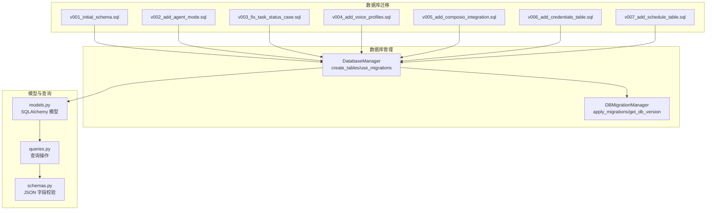
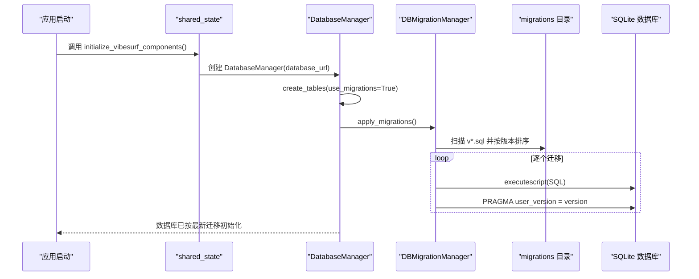
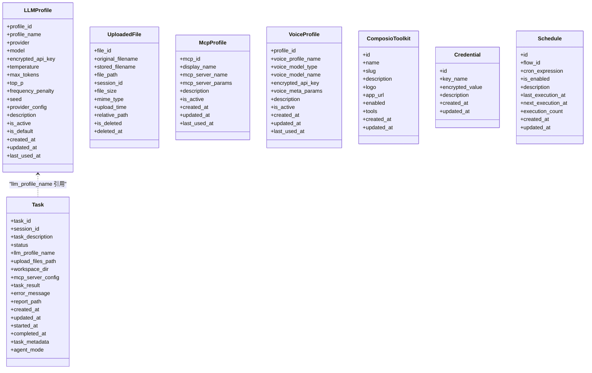
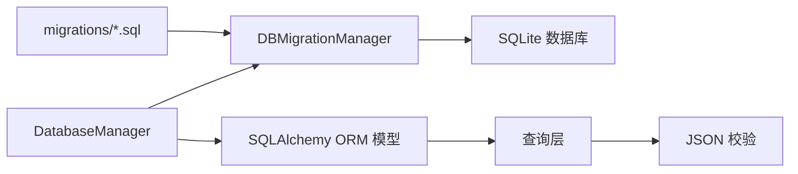

# 迁移管理

<cite>
**本文引用的文件**
- [v001_initial_schema.sql](file://vibe_surf/backend/database/migrations/v001_initial_schema.sql)
- [v002_add_agent_mode.sql](file://vibe_surf/backend/database/migrations/v002_add_agent_mode.sql)
- [v003_fix_task_status_case.sql](file://vibe_surf/backend/database/migrations/v003_fix_task_status_case.sql)
- [v004_add_voice_profiles.sql](file://vibe_surf/backend/database/migrations/v004_add_voice_profiles.sql)
- [v005_add_composio_integration.sql](file://vibe_surf/backend/database/migrations/v005_add_composio_integration.sql)
- [v006_add_credentials_table.sql](file://vibe_surf/backend/database/migrations/v006_add_credentials_table.sql)
- [v007_add_schedule_table.sql](file://vibe_surf/backend/database/migrations/v007_add_schedule_table.sql)
- [manager.py](file://vibe_surf/backend/database/manager.py)
- [models.py](file://vibe_surf/backend/database/models.py)
- [queries.py](file://vibe_surf/backend/database/queries.py)
- [schemas.py](file://vibe_surf/backend/database/schemas.py)
- [shared_state.py](file://vibe_surf/backend/shared_state.py)
</cite>

## 目录
1. [简介](#简介)
2. [项目结构](#项目结构)
3. [核心组件](#核心组件)
4. [架构总览](#架构总览)
5. [详细组件分析](#详细组件分析)
6. [依赖关系分析](#依赖关系分析)
7. [性能考量](#性能考量)
8. [故障排查指南](#故障排查指南)
9. [结论](#结论)
10. [附录：迁移编写与测试规范](#附录迁移编写与测试规范)

## 简介
本文件系统性梳理 VibeSurf 后端数据库迁移管理，围绕基于 SQL 脚本的迁移策略展开，覆盖从 v001 到 v007 的全部迁移文件及其变更内容、执行顺序与版本控制机制；解释模式演进流程与编写规范（新增表、修改结构、数据转换、回滚策略）；给出在开发、测试、生产环境中的应用流程与冲突解决方法，并总结团队协作最佳实践。

## 项目结构
- 数据库迁移位于后端模块的 migrations 目录，采用以版本号命名的 SQL 文件组织方式，每个文件对应一次模式或数据变更。
- 数据库管理器负责扫描迁移文件、按序应用、维护 user_version 版本标记，并在 SQLite 场景下支持迁移。
- ORM 模型定义与查询层为应用层提供类型安全的数据访问接口，迁移文件与 ORM 定义共同构成“DDL + DML”的双轨设计。

图表来源
- [manager.py](file://vibe_surf/backend/database/manager.py#L148-L319)
- [models.py](file://vibe_surf/backend/database/models.py#L1-L289)
- [queries.py](file://vibe_surf/backend/database/queries.py#L1-L800)
- [schemas.py](file://vibe_surf/backend/database/schemas.py#L1-L100)

章节来源
- [manager.py](file://vibe_surf/backend/database/manager.py#L148-L319)
- [models.py](file://vibe_surf/backend/database/models.py#L1-L289)

## 核心组件
- 迁移管理器（DBMigrationManager）
  - 扫描 migrations 目录，按版本号排序，逐个执行未应用的 SQL 脚本。
  - 使用 PRAGMA user_version 维护当前数据库版本，确保幂等与可追踪。
  - 在 SQLite 环境中启用外键约束，保证参照完整性。
- 数据库管理器（DatabaseManager）
  - 针对 SQLite 使用异步引擎与迁移路径；非 SQLite 则走 ORM 直接建表。
  - 提供 create_tables/use_migrations 接口，优先使用迁移系统，失败时回退到 ORM 建表。
  - 提供 apply_migrations/get_db_version 辅助运维与调试。
- ORM 模型与查询
  - models.py 定义了各表的字段、索引、检查约束与枚举，作为 ORM 层的权威定义。
  - queries.py 提供业务查询封装，配合 schemas.py 对 JSON 字段进行校验与规范化。

章节来源
- [manager.py](file://vibe_surf/backend/database/manager.py#L27-L146)
- [manager.py](file://vibe_surf/backend/database/manager.py#L148-L319)
- [models.py](file://vibe_surf/backend/database/models.py#L1-L289)
- [queries.py](file://vibe_surf/backend/database/queries.py#L1-L800)
- [schemas.py](file://vibe_surf/backend/database/schemas.py#L1-L100)

## 架构总览
迁移执行链路如下：
- 应用启动时通过 shared_state 初始化 DatabaseManager。
- DatabaseManager.create_tables 优先调用 DBMigrationManager.apply_migrations。
- DBMigrationManager 读取 migrations 目录，按版本顺序执行 SQL，更新 user_version。
- ORM 层 models.py 与 queries.py 为运行期提供数据访问能力，schema 校验保障 JSON 字段一致性。

图表来源
- [shared_state.py](file://vibe_surf/backend/shared_state.py#L517-L537)
- [manager.py](file://vibe_surf/backend/database/manager.py#L148-L201)
- [manager.py](file://vibe_surf/backend/database/manager.py#L99-L146)

## 详细组件分析

### 迁移版本与变更概览（v001–v007）
- v001_initial_schema.sql
  - 创建 llm_profiles、tasks、uploaded_files、mcp_profiles 表及索引、触发器。
  - 引入外键开关 PRAGMA foreign_keys = ON。
  - 为各表建立更新时间戳自动维护触发器。
- v002_add_agent_mode.sql
  - 为 tasks 表增加 agent_mode 字段，默认值为 “thinking”。
- v003_fix_task_status_case.sql
  - 将 tasks.status 中的大写枚举值统一转为小写，与 TaskStatus 枚举保持一致。
- v004_add_voice_profiles.sql
  - 新增 voice_profiles 表，包含语音模型类型（ASR/TTS）与元参数 JSON 字段。
  - 建立索引与更新触发器。
- v005_add_composio_integration.sql
  - 新增 composio_toolkits 表，存储 Composio 工具包信息与启用状态。
  - 建立索引与更新触发器。
- v006_add_credentials_table.sql
  - 新增 credentials 表，用于存储加密后的敏感配置项（如 API Key）。
  - 建立索引与更新触发器。
- v007_add_schedule_table.sql
  - 新增 schedules 表，支持基于 cron 的工作流调度。
  - 建立索引与更新触发器。

章节来源
- [v001_initial_schema.sql](file://vibe_surf/backend/database/migrations/v001_initial_schema.sql#L1-L118)
- [v002_add_agent_mode.sql](file://vibe_surf/backend/database/migrations/v002_add_agent_mode.sql#L1-L6)
- [v003_fix_task_status_case.sql](file://vibe_surf/backend/database/migrations/v003_fix_task_status_case.sql#L1-L11)
- [v004_add_voice_profiles.sql](file://vibe_surf/backend/database/migrations/v004_add_voice_profiles.sql#L1-L35)
- [v005_add_composio_integration.sql](file://vibe_surf/backend/database/migrations/v005_add_composio_integration.sql#L1-L33)
- [v006_add_credentials_table.sql](file://vibe_surf/backend/database/migrations/v006_add_credentials_table.sql#L1-L26)
- [v007_add_schedule_table.sql](file://vibe_surf/backend/database/migrations/v007_add_schedule_table.sql#L1-L29)

### 迁移版本控制与执行顺序
- 版本识别：迁移文件名以 vNNN_ 开头，DBMigrationManager 通过正则提取版本号并排序。
- 执行策略：仅应用大于当前 user_version 且不超过目标版本的迁移；若未指定目标版本，则默认应用到最高版本。
- 幂等性：每次成功应用后更新 user_version，避免重复执行；失败时抛出异常，便于上层回滚与告警。
- 外键约束：在执行迁移前显式开启 PRAGMA foreign_keys = ON，确保参照完整性。

章节来源
- [manager.py](file://vibe_surf/backend/database/manager.py#L71-L86)
- [manager.py](file://vibe_surf/backend/database/manager.py#L99-L146)

### 模式演进流程（ORM 与迁移的协同）
- 迁移驱动 DDL：通过 SQL 脚本创建/修改表结构与索引，确保数据库层面的演进。
- ORM 驱动 DML：models.py 定义字段、索引、检查约束与枚举，queries.py 提供 CRUD 与聚合查询，保证应用层类型安全与一致性。
- JSON 字段校验：schemas.py 对 JSON 字段进行 Pydantic 校验，避免脏数据进入数据库。

图表来源
- [models.py](file://vibe_surf/backend/database/models.py#L1-L289)

章节来源
- [models.py](file://vibe_surf/backend/database/models.py#L1-L289)
- [queries.py](file://vibe_surf/backend/database/queries.py#L1-L800)
- [schemas.py](file://vibe_surf/backend/database/schemas.py#L1-L100)

### 迁移编写规范与最佳实践
- 命名规范
  - 文件名格式：vNNN_description.sql，其中 NNN 为三位十进制版本号，描述语义化。
  - 描述注释：在文件顶部包含迁移目的、版本号与简要说明。
- 幂等性
  - 所有 DDL 必须具备 IF NOT EXISTS 或等价保护，避免重复执行导致错误。
  - 所有索引与触发器均应具备 IF NOT EXISTS。
- 参照完整性
  - 在迁移开始处显式开启外键约束 PRAGMA foreign_keys = ON。
- 枚举与大小写
  - 枚举值应统一为小写，避免与应用层枚举不一致。
- JSON 字段
  - 使用 JSON 存储动态配置，配合 schemas.py 的 Pydantic 校验，确保入库数据结构稳定。
- 回滚策略
  - 优先采用“向前修复”而非破坏性回滚；如确需回滚，应在新迁移中显式修正数据或结构。
  - 对于关键数据转换，建议先备份再迁移，保留回退路径。

章节来源
- [v001_initial_schema.sql](file://vibe_surf/backend/database/migrations/v001_initial_schema.sql#L1-L118)
- [v003_fix_task_status_case.sql](file://vibe_surf/backend/database/migrations/v003_fix_task_status_case.sql#L1-L11)
- [schemas.py](file://vibe_surf/backend/database/schemas.py#L1-L100)

### 实际示例：新增表、修改结构与数据转换
- 新增表：v004_voice_profiles、v005_composio_toolkits、v006_credentials、v007_schedules
  - 典型步骤：创建表、建立索引、注册更新触发器；在迁移文件中统一开启外键。
- 修改现有表结构：v002_agent_mode、v003_status_case
  - 新增列：ALTER TABLE ... ADD COLUMN；设置默认值与约束。
  - 数据转换：UPDATE 将历史大写枚举值转为小写，确保与应用层一致。
- 数据迁移与加密：credentials 表用于存储加密后的敏感配置，结合 queries.py 的加解密工具使用。

章节来源
- [v002_add_agent_mode.sql](file://vibe_surf/backend/database/migrations/v002_add_agent_mode.sql#L1-L6)
- [v003_fix_task_status_case.sql](file://vibe_surf/backend/database/migrations/v003_fix_task_status_case.sql#L1-L11)
- [v004_add_voice_profiles.sql](file://vibe_surf/backend/database/migrations/v004_add_voice_profiles.sql#L1-L35)
- [v005_add_composio_integration.sql](file://vibe_surf/backend/database/migrations/v005_add_composio_integration.sql#L1-L33)
- [v006_add_credentials_table.sql](file://vibe_surf/backend/database/migrations/v006_add_credentials_table.sql#L1-L26)
- [v007_add_schedule_table.sql](file://vibe_surf/backend/database/migrations/v007_add_schedule_table.sql#L1-L29)
- [queries.py](file://vibe_surf/backend/database/queries.py#L1-L800)

### 测试策略与环境应用流程
- 开发环境
  - 使用 SQLite 本地数据库，通过 DatabaseManager.create_tables(use_migrations=True) 自动应用迁移。
  - 可临时切换 use_migrations=False 进行快速验证，但不建议长期使用。
- 测试环境
  - 建议为测试数据库单独准备迁移脚本副本，确保与生产一致。
  - 使用独立的 VIBESURF_DATABASE_URL，避免与开发数据冲突。
- 生产环境
  - 严格遵循“只升不降”的原则，禁止回滚到旧版本；如需回滚，必须新增迁移进行修复。
  - 迁移前进行备份；迁移后验证 user_version 与关键表结构。
- 运维接口
  - 通过 DatabaseManager.apply_migrations(target_version) 指定目标版本，便于灰度发布与分阶段上线。

章节来源
- [manager.py](file://vibe_surf/backend/database/manager.py#L148-L201)
- [manager.py](file://vibe_surf/backend/database/manager.py#L241-L269)
- [shared_state.py](file://vibe_surf/backend/shared_state.py#L517-L537)

### 冲突解决与团队协作
- 冲突来源
  - 多人同时创建 vXXX.sql 导致版本号冲突；或同一表的多次 ALTER 导致顺序问题。
- 解决方法
  - 统一由负责人协调版本号分配，避免重号；合并相近变更到同一迁移文件。
  - 对复杂变更拆分为多个小迁移，降低回滚成本。
- 协作规范
  - 迁移文件必须包含清晰注释与变更说明；提交前在本地与测试库验证。
  - 迁移脚本不得包含业务逻辑，仅限 DDL/DML；业务逻辑放入应用层。
  - 严禁在迁移中删除或重命名关键列，必要时以“新增+迁移+弃用”两阶段实现。

章节来源
- [manager.py](file://vibe_surf/backend/database/manager.py#L71-L86)

## 依赖关系分析
- 迁移文件依赖 SQLite 语法与 PRAGMA 设置，因此仅在 SQLite 环境下由 DBMigrationManager 管理。
- DatabaseManager 在非 SQLite 环境下直接使用 ORM 建表，迁移路径不可用。
- ORM 模型与查询层依赖 SQLAlchemy，提供类型安全与索引优化。

图表来源
- [manager.py](file://vibe_surf/backend/database/manager.py#L148-L201)
- [models.py](file://vibe_surf/backend/database/models.py#L1-L289)
- [queries.py](file://vibe_surf/backend/database/queries.py#L1-L800)
- [schemas.py](file://vibe_surf/backend/database/schemas.py#L1-L100)

章节来源
- [manager.py](file://vibe_surf/backend/database/manager.py#L148-L201)
- [models.py](file://vibe_surf/backend/database/models.py#L1-L289)

## 性能考量
- 索引设计：迁移文件中为高频查询字段建立复合索引与单列索引，提升查询效率。
- 触发器：为各表注册更新时间戳触发器，减少应用层重复逻辑。
- JSON 字段：通过 schemas.py 校验与精简存储，避免冗余字段占用空间。
- 迁移执行：按版本顺序串行执行，避免并发写入导致锁竞争；建议在低峰时段执行大规模迁移。

章节来源
- [v001_initial_schema.sql](file://vibe_surf/backend/database/migrations/v001_initial_schema.sql#L79-L118)
- [v004_add_voice_profiles.sql](file://vibe_surf/backend/database/migrations/v004_add_voice_profiles.sql#L24-L35)
- [v005_add_composio_integration.sql](file://vibe_surf/backend/database/migrations/v005_add_composio_integration.sql#L22-L33)
- [v006_add_credentials_table.sql](file://vibe_surf/backend/database/migrations/v006_add_credentials_table.sql#L17-L26)
- [v007_add_schedule_table.sql](file://vibe_surf/backend/database/migrations/v007_add_schedule_table.sql#L17-L29)

## 故障排查指南
- 迁移失败
  - 现象：apply_migrations 抛出异常，日志记录失败版本。
  - 处理：定位具体迁移文件，检查语法与依赖；修复后重新执行。
- 版本不一致
  - 现象：user_version 与期望不符。
  - 处理：使用 get_db_version 查看当前版本；必要时手动调整 user_version（谨慎）。
- 非 SQLite 环境
  - 现象：迁移管理器不可用。
  - 处理：改用 ORM 直接建表；或切换到 SQLite 本地开发。
- 数据不一致
  - 现象：status 枚举大小写不一致。
  - 处理：执行 v003_fix_task_status_case.sql 或在迁移中补充数据修复。

章节来源
- [manager.py](file://vibe_surf/backend/database/manager.py#L99-L146)
- [manager.py](file://vibe_surf/backend/database/manager.py#L241-L269)
- [v003_fix_task_status_case.sql](file://vibe_surf/backend/database/migrations/v003_fix_task_status_case.sql#L1-L11)

## 结论
VibeSurf 的数据库迁移体系以 SQL 脚本为核心，结合 DBMigrationManager 的版本控制与幂等执行，实现了从初始模式到扩展功能（语音、Composio、凭证、调度）的平滑演进。ORM 层提供类型安全与查询封装，配合 JSON 校验保障数据质量。通过严格的编写规范、测试流程与运维接口，迁移可在多环境中稳定落地，满足开发、测试与生产的差异化需求。

## 附录：迁移编写与测试规范
- 编写步骤
  - 设计 DDL：确定新增/修改的表与字段，考虑索引与触发器。
  - 编写 SQL：使用 IF NOT EXISTS 保护，开启外键，设置默认值与约束。
  - 数据转换：如需修复历史数据，提供对应的 UPDATE 语句。
  - 注释与版本：在文件头部写明版本号与变更说明。
- 测试要点
  - 本地 SQLite 验证：执行 apply_migrations，检查 user_version 与表结构。
  - 数据一致性：验证枚举大小写、JSON 字段结构与索引命中情况。
  - 回退演练：对关键迁移准备修复性迁移，确保可逆。
- 团队协作
  - 统一版本号分配与评审流程；迁移文件纳入代码审查。
  - 严禁在迁移中引入业务逻辑；复杂场景拆分为多个小迁移。
  - 生产回滚遵循“只升不降”，必要时以新迁移修复。

章节来源
- [manager.py](file://vibe_surf/backend/database/manager.py#L71-L86)
- [manager.py](file://vibe_surf/backend/database/manager.py#L99-L146)
- [schemas.py](file://vibe_surf/backend/database/schemas.py#L1-L100)