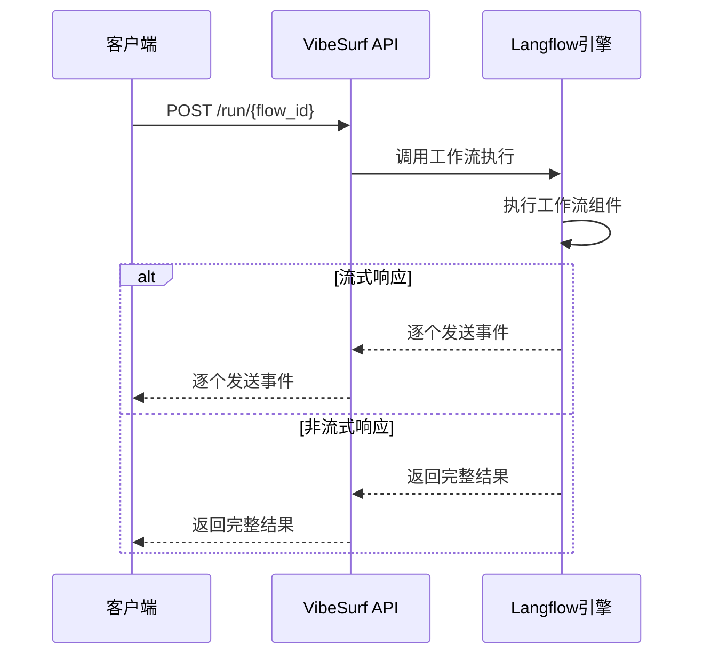
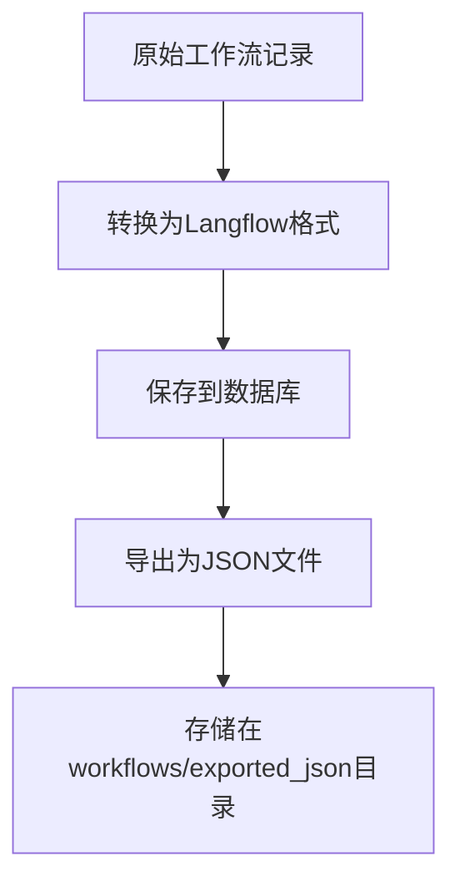
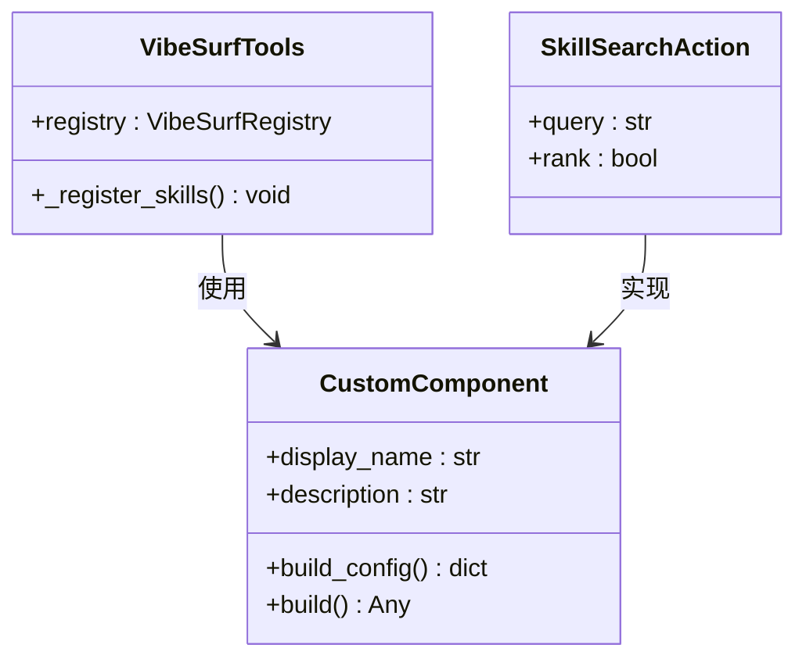

# Langflow集成

<cite>
**本文档引用的文件**
- [main.py](file://vibe_surf/langflow/main.py)
- [workflow_converter.py](file://vibe_surf/backend/utils/workflow_converter.py)
- [vibesurf_tools.py](file://vibe_surf/tools/vibesurf_tools.py)
- [flows.py](file://vibe_surf/langflow/api/v1/flows.py)
- [endpoints.py](file://vibe_surf/langflow/api/v1/endpoints.py)
- [vibesurf.py](file://vibe_surf/backend/api/vibesurf.py)
</cite>

## 目录
1. [简介](#简介)
2. [工作流加载与执行](#工作流加载与执行)
3. [工作流导入与导出](#工作流导入与导出)
4. [自定义组件系统](#自定义组件系统)
5. [通信协议与数据交换格式](#通信协议与数据交换格式)
6. [配置选项与最佳实践](#配置选项与最佳实践)
7. [代码示例](#代码示例)

## 简介

VibeSurf与Langflow工作流引擎的集成提供了一套完整的自动化解决方案，允许用户通过API加载、执行和管理复杂的工作流。该集成机制基于FastAPI构建，通过RESTful API接口实现与Langflow后端的通信。核心功能包括工作流的创建、读取、更新和删除（CRUD）操作，以及工作流的执行、导入和导出。系统采用模块化架构，将工作流管理、组件注册、执行引擎和API接口分离，确保了系统的可扩展性和可维护性。

集成的核心是Langflow工作流引擎，它提供了一个可视化界面来设计和管理工作流。VibeSurf通过API与这个引擎交互，允许用户在不直接访问可视化界面的情况下管理和执行工作流。这种设计使得VibeSurf可以作为后台服务运行，为前端应用或其他系统提供工作流执行能力。

**Section sources**
- [main.py](file://vibe_surf/langflow/main.py#L1-L551)

## 工作流加载与执行

VibeSurf通过API端点与Langflow工作流引擎进行交互，实现工作流的加载和执行。工作流的执行主要通过`/run`端点完成，该端点支持流式响应和非流式响应两种模式。当`stream`参数设置为`true`时，系统会以流式方式返回执行结果，这对于长时间运行的工作流特别有用，因为它允许客户端实时接收执行过程中的中间结果。

工作流执行的API调用需要提供工作流ID或名称，以及可选的输入参数、输出选择、调整参数和会话ID。输入参数允许用户为工作流中的特定组件提供自定义值，而调整参数则允许修改工作流的配置。会话ID用于利用现有的会话数据，这对于需要保持状态的工作流非常重要。



**Diagram sources**
- [endpoints.py](file://vibe_surf/langflow/api/v1/endpoints.py#L280-L600)

**Section sources**
- [endpoints.py](file://vibe_surf/langflow/api/v1/endpoints.py#L280-L600)

## 工作流导入与导出

VibeSurf提供了完整的工作流导入和导出功能，支持JSON格式的文件交换。工作流导入通过`/import-workflow`端点实现，该端点接受一个包含工作流定义的JSON字符串。系统会验证JSON格式的正确性，检查必需字段的存在，并通过HTTP请求将工作流创建到Langflow后端。

工作流导出通过`/export-workflow/{flow_id}`端点实现，该端点从Langflow后端获取指定工作流的数据，并将其保存为JSON文件。导出过程中，系统会移除敏感信息如API密钥，确保导出的文件可以在不同环境中安全使用。导出的文件会被保存在`workflows/exported_json`目录下，文件名基于工作流名称和ID生成。



**Diagram sources**
- [workflow_converter.py](file://vibe_surf/backend/utils/workflow_converter.py#L1-L570)
- [vibesurf.py](file://vibe_surf/backend/api/vibesurf.py#L227-L544)

**Section sources**
- [vibesurf.py](file://vibe_surf/backend/api/vibesurf.py#L227-L544)
- [workflow_converter.py](file://vibe_surf/backend/utils/workflow_converter.py#L1-L570)

## 自定义组件系统

VibeSurf的自定义组件系统基于Langflow的组件架构，允许开发者创建和注册自定义组件。组件通过继承`CustomComponent`类来定义，需要实现`build_config`方法来定义组件的配置界面，以及`build`方法来定义组件的执行逻辑。系统通过动态导入机制加载自定义组件，支持在运行时扩展功能。

组件注册通过`VibeSurfTools`类的`_register_skills`方法实现，该方法使用装饰器模式将函数注册为可执行的动作。每个动作都有一个描述性的名称和参数模型，系统会自动将这些信息转换为API端点。这种设计使得添加新功能变得简单，只需定义一个函数并用适当的装饰器标记即可。



**Diagram sources**
- [vibesurf_tools.py](file://vibe_surf/tools/vibesurf_tools.py#L1-L800)
- [custom_component.py](file://vibe_surf/langflow/custom/custom_component/custom_component.py#L1-L100)

**Section sources**
- [vibesurf_tools.py](file://vibe_surf/tools/vibesurf_tools.py#L1-L800)

## 通信协议与数据交换格式

VibeSurf与Langflow后端的通信基于HTTP/HTTPS协议，使用RESTful API进行交互。所有API调用都需要通过API密钥进行身份验证，密钥通过`x-api-key`请求头传递。系统采用JSON格式进行数据交换，请求和响应都遵循统一的结构。

工作流数据以JSON格式存储，包含工作流的名称、描述和数据结构。数据结构由节点和边组成，节点表示工作流中的组件，边表示组件之间的连接。每个节点包含组件的类型、配置和位置信息，而每条边包含源节点、目标节点和连接点信息。这种结构化的数据格式使得工作流可以在不同系统之间轻松交换和版本控制。

**Section sources**
- [flows.py](file://vibe_surf/langflow/api/v1/flows.py#L1-L580)
- [endpoints.py](file://vibe_surf/langflow/api/v1/endpoints.py#L1-L801)

## 配置选项与最佳实践

VibeSurf提供了多种配置选项来优化工作流的执行和管理。系统支持通过环境变量设置后端端口、组件路径和其他运行时参数。对于性能优化，建议使用流式响应处理长时间运行的工作流，以避免超时问题。同时，合理使用会话ID可以减少重复计算，提高执行效率。

错误处理策略包括详细的日志记录和异常捕获。系统会记录所有API调用的详细信息，包括请求参数、响应结果和执行时间。对于执行失败的工作流，系统会捕获异常并返回详细的错误信息，帮助用户快速定位问题。此外，建议定期备份工作流数据，以防止意外丢失。

**Section sources**
- [main.py](file://vibe_surf/langflow/main.py#L1-L551)
- [vibesurf.py](file://vibe_surf/backend/api/vibesurf.py#L1-L681)

## 代码示例

以下代码示例展示了如何在VibeSurf中调用和嵌入Langflow工作流。示例包括工作流的导入、执行和结果处理。

```python
import httpx
import json

# 导入工作流
async def import_workflow(workflow_json):
    async with httpx.AsyncClient() as client:
        response = await client.post(
            "http://localhost:9335/vibesurf/import-workflow",
            json={"workflow_json": workflow_json}
        )
        return response.json()

# 执行工作流
async def run_workflow(flow_id, inputs=None):
    async with httpx.AsyncClient() as client:
        response = await client.post(
            f"http://localhost:9335/api/v1/run/{flow_id}",
            json={"inputs": inputs or []},
            headers={"x-api-key": "vs-your-api-key"}
        )
        return response.json()

# 导出工作流
async def export_workflow(flow_id):
    async with httpx.AsyncClient() as client:
        response = await client.get(
            f"http://localhost:9335/vibesurf/export-workflow/{flow_id}"
        )
        return response.json()
```

**Section sources**
- [vibesurf.py](file://vibe_surf/backend/api/vibesurf.py#L227-L544)
- [endpoints.py](file://vibe_surf/langflow/api/v1/endpoints.py#L280-L600)