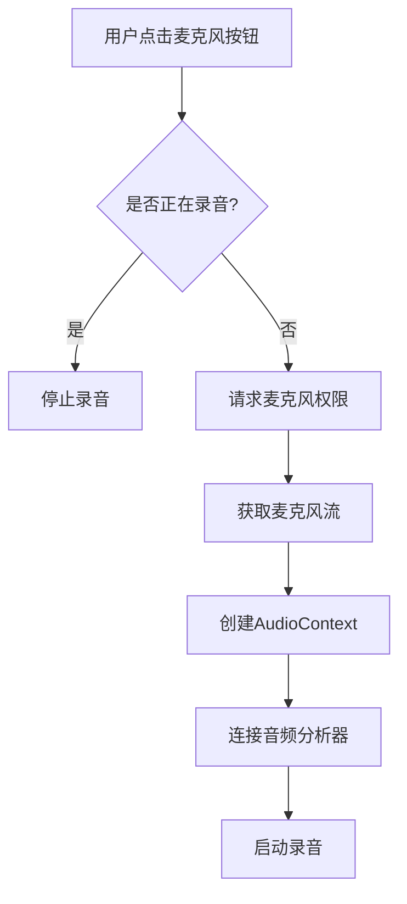
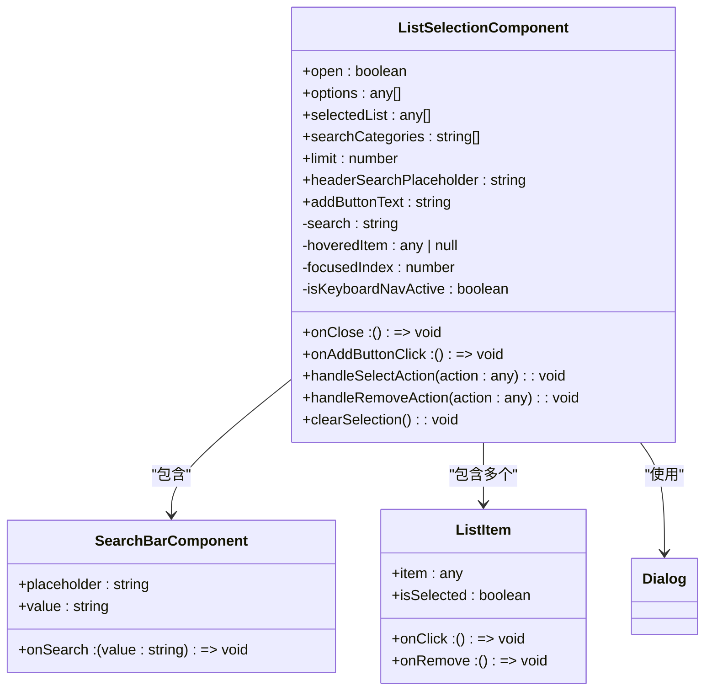
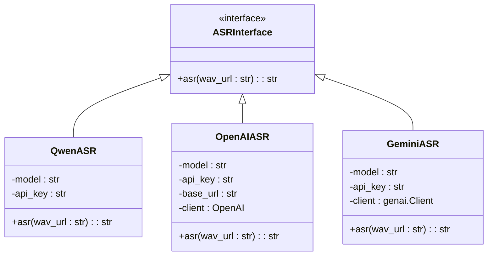
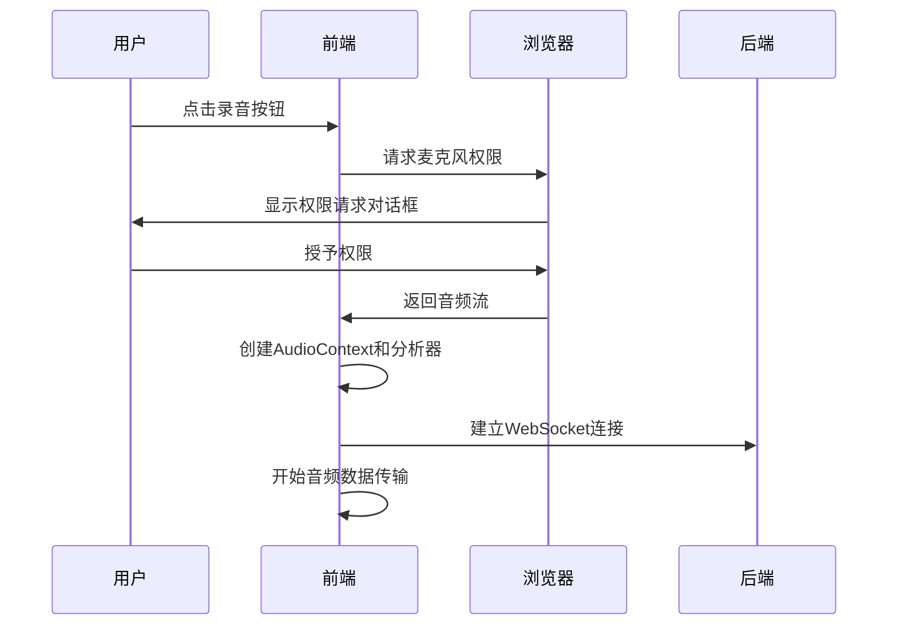
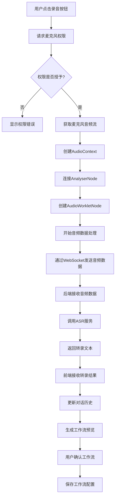

# 前端语音与对话集成

<cite>
**本文档引用的文件**  
- [voice-recorder.js](file://vibe_surf/chrome_extension/scripts/voice-recorder.js)
- [use-custom-start-recording.ts](file://vibe_surf/frontend/src/customization/hooks/use-custom-start-recording.ts)
- [voice_assistant.tsx](file://vibe_surf/frontend/src/modals/IOModal/components/chatView/chatInput/components/voice-assistant/voice-assistant.tsx)
- [use-start-recording.ts](file://vibe_surf/frontend/src/modals/IOModal/components/chatView/chatInput/components/voice-assistant/hooks/use-start-recording.ts)
- [microphone-select.tsx](file://vibe_surf/frontend/src/modals/IOModal/components/chatView/chatInput/components/voice-assistant/components/audio-settings/components/microphone-select.tsx)
- [voice_asr.py](file://vibe_surf/tools/voice_asr.py)
- [voices.py](file://vibe_surf/backend/api/voices.py)
- [ListSelectionComponent/index.tsx](file://vibe_surf/frontend/src/CustomNodes/GenericNode/components/ListSelectionComponent/index.tsx)
</cite>

## 目录
1. [引言](#引言)
2. [语音输入功能集成](#语音输入功能集成)
3. [SelectionMenuComponent与对话历史管理](#selectionmenutcomponent与对话历史管理)
4. [语音识别服务交互](#语音识别服务交互)
5. [录音钩子实现](#录音钩子实现)
6. [完整交互流程分析](#完整交互流程分析)
7. [结论](#结论)

## 引言
本文档全面阐述了前端如何实现对话式工作流创建的用户界面，重点分析了语音输入功能的集成机制。系统详细说明了SelectionMenuComponent如何与语音功能协同工作，voice_asr.py提供的语音识别服务如何与前端交互，以及use-custom-start-recording.ts中定义的录音钩子的实现细节。文档还深入分析了从用户按下录音按钮到语音转录文本发送至后端代理的完整交互流程。

## 语音输入功能集成
前端通过VoiceAssistant组件实现了完整的语音输入功能，该组件提供了用户友好的界面来激活语音输入、显示实时转录和管理对话历史。

### 语音激活机制
语音激活通过VoiceAssistant组件中的按钮实现，用户点击麦克风按钮即可开始或停止录音。组件通过`handleToggleRecording`函数处理录音状态的切换，当用户点击时，系统会检查当前录音状态并相应地启动或停止录音过程。

**Diagram sources**
- [voice_assistant.tsx](file://vibe_surf/frontend/src/modals/IOModal/components/chatView/chatInput/components/voice-assistant/voice-assistant.tsx#L351-L370)

### 实时转录显示
系统通过WebSocket连接将音频数据实时传输到后端，并将转录结果显示在界面上。VoiceAssistant组件使用`useBarControls`钩子来控制波形显示，根据音频输入的强度动态更新波形条的高度，为用户提供直观的视觉反馈。

**Section sources**
- [voice_assistant.tsx](file://vibe_surf/frontend/src/modals/IOModal/components/chatView/chatInput/components/voice-assistant/voice_assistant.tsx#L407-L423)

## SelectionMenuComponent与对话历史管理
SelectionMenuComponent在对话式工作流创建中扮演着关键角色，它允许用户从预设选项中选择并管理对话历史。

### 组件结构与功能
SelectionMenuComponent是一个通用的选择组件，支持搜索、过滤和多选功能。它通过`ListSelectionComponent`实现核心功能，提供了搜索栏、选项列表和选择按钮等UI元素。

**Diagram sources**
- [ListSelectionComponent/index.tsx](file://vibe_surf/frontend/src/CustomNodes/GenericNode/components/ListSelectionComponent/index.tsx#L1-L64)

### 对话历史管理
系统通过全局状态管理对话历史，使用`useMessagesStore`来存储和管理消息记录。当语音转录完成后，系统会将转录文本作为新的消息添加到对话历史中，并触发工作流预览的更新。

**Section sources**
- [voice_assistant.tsx](file://vibe_surf/frontend/src/modals/IOModal/components/chatView/chatInput/components/voice-assistant/voice_assistant.tsx#L69-L70)

## 语音识别服务交互
voice_asr.py模块提供了语音识别服务，支持多种ASR模型，包括Qwen、OpenAI和Gemini。

### ASR模型选择
系统支持多种ASR模型，用户可以在设置中选择合适的模型。voice_asr.py中定义了三个主要的ASR类：QwenASR、OpenAIASR和GeminiASR，每个类都实现了统一的`asr`接口。

**Diagram sources**
- [voice_asr.py](file://vibe_surf/tools/voice_asr.py#L12-L125)

### 转录结果后处理
系统对转录结果进行后处理，包括标点添加和术语标准化。在GeminiASR的实现中，系统通过向模型发送特定的提示来确保输出包含适当的标点符号。

**Section sources**
- [voice_asr.py](file://vibe_surf/tools/voice_asr.py#L117-L118)

## 录音钩子实现
use-custom-start-recording.ts文件定义了录音钩子，封装了音频采集的核心逻辑。

### 权限管理
系统在开始录音前会请求麦克风权限。`useStartRecording`钩子首先调用`navigator.mediaDevices.getUserMedia`来请求权限，如果用户拒绝，系统会显示相应的错误信息。

**Diagram sources**
- [use-start-recording.ts](file://vibe_surf/frontend/src/modals/IOModal/components/chatView/chatInput/components/voice-assistant/hooks/use-start-recording.ts#L22-L32)

### 音频采集
音频采集通过Web Audio API实现，系统创建AudioContext来处理音频流，并使用AnalyserNode来分析音频数据的频率和时域特征。

**Section sources**
- [use-start-recording.ts](file://vibe_surf/frontend/src/modals/IOModal/components/chatView/chatInput/components/voice-assistant/hooks/use-start-recording.ts#L38-L42)

### 错误处理机制
系统实现了完善的错误处理机制，捕获并处理各种可能的错误，包括权限拒绝、设备不可用和网络问题。错误信息会通过状态更新显示给用户。

**Section sources**
- [use-start-recording.ts](file://vibe_surf/frontend/src/modals/IOModal/components/chatView/chatInput/components/voice-assistant/hooks/use-start-recording.ts#L103-L106)

## 完整交互流程分析
从用户按下录音按钮到语音转录文本发送至后端代理的完整交互流程涉及多个组件和系统的协同工作。

### 交互流程

**Diagram sources**
- [voice-recorder.js](file://vibe_surf/chrome_extension/scripts/voice-recorder.js#L167-L255)
- [voices.py](file://vibe_surf/backend/api/voices.py#L224-L352)

### 前端处理生成的工作流预览
前端通过`useGetMessagesPollingMutation`定期轮询后端获取最新的消息和工作流状态。当收到新的转录文本后，系统会触发工作流预览的生成，并将预览结果显示给用户进行确认。

**Section sources**
- [voice_assistant.tsx](file://vibe_surf/frontend/src/modals/IOModal/components/chatView/chatInput/components/voice-assistant/voice_assistant.tsx#L131-L132)

## 结论
本文档详细分析了前端语音与对话集成的实现机制。系统通过精心设计的组件和钩子实现了完整的语音输入功能，从用户界面到后端服务形成了一个闭环的工作流。SelectionMenuComponent提供了灵活的选择界面，voice_asr.py支持多种ASR模型并进行后处理，use-custom-start-recording.ts实现了可靠的录音功能。整个系统展现了良好的架构设计和用户体验，为对话式工作流创建提供了强大的支持。