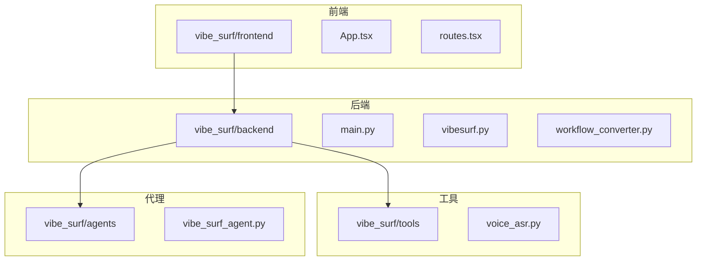
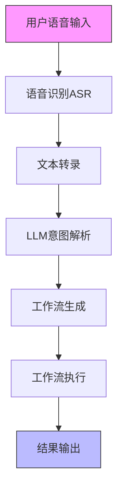
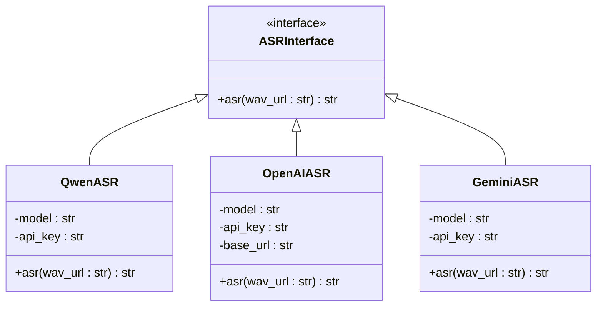
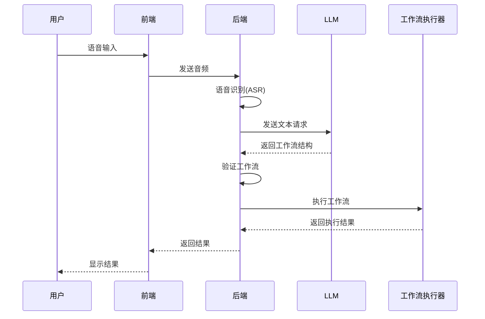
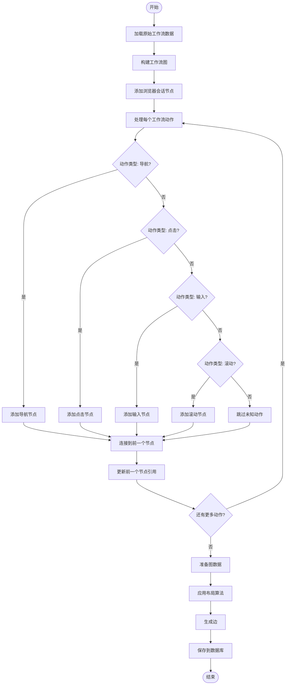
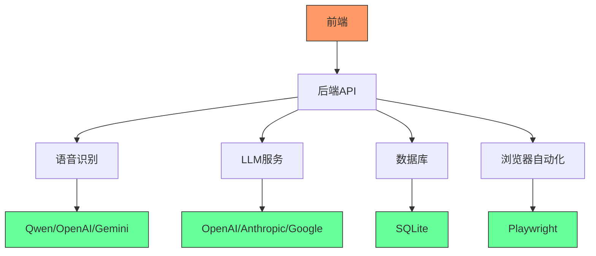

# 对话式工作流创建

<cite>
**本文档引用的文件**   
- [main.py](file://vibe_surf/backend/main.py)
- [voice_asr.py](file://vibe_surf/tools/voice_asr.py)
- [workflow_converter.py](file://vibe_surf/backend/utils/workflow_converter.py)
- [vibe_surf_agent.py](file://vibe_surf/agents/vibe_surf_agent.py)
- [vibesurf.py](file://vibe_surf/backend/api/vibesurf.py)
- [llm_factory.py](file://vibe_surf/backend/utils/llm_factory.py)
- [vibe_surf_prompt.py](file://vibe_surf/agents/prompts/vibe_surf_prompt.py)
</cite>

## 目录
1. [引言](#引言)
2. [项目结构](#项目结构)
3. [核心组件](#核心组件)
4. [架构概述](#架构概述)
5. [详细组件分析](#详细组件分析)
6. [依赖分析](#依赖分析)
7. [性能考虑](#性能考虑)
8. [故障排除指南](#故障排除指南)
9. [结论](#结论)

## 引言
本文档深入探讨了VibeSurf项目中对话式工作流创建功能的实现机制。该功能允许用户通过自然语言输入或语音指令来创建和执行复杂的工作流，系统会将描述性语言转换为可执行的工作流结构。文档详细说明了LLM在工作流生成中的角色、前端如何集成语音输入和对话界面，以及从用户语音指令到工作流节点生成的完整数据流。

## 项目结构
VibeSurf项目采用模块化设计，主要分为前端、后端和工具组件。后端使用FastAPI框架提供REST API，前端使用React构建用户界面，工具组件提供语音识别、浏览器自动化等功能。

**图源**
- [main.py](file://vibe_surf/backend/main.py#L1-L794)
- [voice_asr.py](file://vibe_surf/tools/voice_asr.py#L1-L125)

**节源**
- [main.py](file://vibe_surf/backend/main.py#L1-L794)
- [voice_asr.py](file://vibe_surf/tools/voice_asr.py#L1-L125)

## 核心组件
对话式工作流创建功能的核心组件包括语音识别、自然语言处理、工作流转换和执行引擎。这些组件协同工作，将用户的语音或文本输入转换为可执行的工作流。

**节源**
- [voice_asr.py](file://vibe_surf/tools/voice_asr.py#L1-L125)
- [vibe_surf_agent.py](file://vibe_surf/agents/vibe_surf_agent.py#L1-L1840)

## 架构概述
系统架构采用分层设计，从用户输入到工作流执行分为多个层次。语音输入首先通过ASR系统转换为文本，然后由LLM解析用户意图，生成工作流结构，最后由执行引擎执行工作流。

**图源**
- [voice_asr.py](file://vibe_surf/tools/voice_asr.py#L1-L125)
- [vibe_surf_agent.py](file://vibe_surf/agents/vibe_surf_agent.py#L1-L1840)

## 详细组件分析

### 语音识别组件分析
语音识别组件支持多种ASR服务，包括Qwen、OpenAI和Google Gemini。用户可以通过配置选择不同的ASR服务。

#### 语音识别类图

**图源**
- [voice_asr.py](file://vibe_surf/tools/voice_asr.py#L1-L125)

**节源**
- [voice_asr.py](file://vibe_surf/tools/voice_asr.py#L1-L125)

### 工作流生成组件分析
工作流生成组件使用LLM解析用户意图，并生成相应的工作流结构。系统支持多种LLM提供商，包括OpenAI、Anthropic和Google。

#### 工作流生成序列图

**图源**
- [vibe_surf_agent.py](file://vibe_surf/agents/vibe_surf_agent.py#L1-L1840)
- [vibesurf.py](file://vibe_surf/backend/api/vibesurf.py#L1-L681)

**节源**
- [vibe_surf_agent.py](file://vibe_surf/agents/vibe_surf_agent.py#L1-L1840)
- [vibesurf.py](file://vibe_surf/backend/api/vibesurf.py#L1-L681)

### 工作流转换组件分析
工作流转换组件负责将用户操作记录转换为Langflow兼容的JSON格式，并保存到数据库中。

#### 工作流转换流程图

**图源**
- [workflow_converter.py](file://vibe_surf/backend/utils/workflow_converter.py#L1-L570)

**节源**
- [workflow_converter.py](file://vibe_surf/backend/utils/workflow_converter.py#L1-L570)

## 依赖分析
系统依赖关系复杂，涉及多个组件之间的交互。主要依赖包括语音识别服务、LLM服务、数据库和浏览器自动化组件。

**图源**
- [main.py](file://vibe_surf/backend/main.py#L1-L794)
- [llm_factory.py](file://vibe_surf/backend/utils/llm_factory.py#L1-L275)

**节源**
- [main.py](file://vibe_surf/backend/main.py#L1-L794)
- [llm_factory.py](file://vibe_surf/backend/utils/llm_factory.py#L1-L275)

## 性能考虑
系统在设计时考虑了多项性能优化措施，包括异步处理、缓存机制和并发执行。语音识别和LLM调用都采用异步方式，避免阻塞主线程。工作流执行支持并行处理，提高执行效率。

## 故障排除指南
常见问题包括语音识别失败、LLM连接超时和工作流执行错误。建议检查网络连接、API密钥配置和系统资源使用情况。

**节源**
- [voice_asr.py](file://vibe_surf/tools/voice_asr.py#L1-L125)
- [vibe_surf_agent.py](file://vibe_surf/agents/vibe_surf_agent.py#L1-L1840)

## 结论
VibeSurf的对话式工作流创建功能通过整合语音识别、自然语言处理和自动化执行技术，为用户提供了一种直观高效的工作流创建方式。系统架构设计合理，组件职责清晰，支持多种扩展和定制选项。