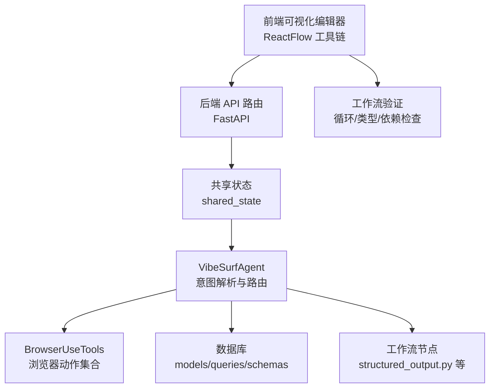
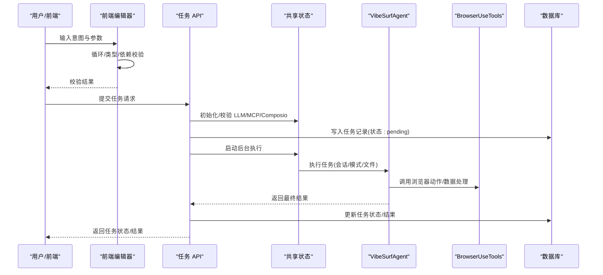
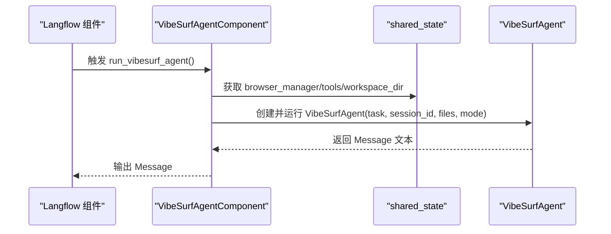
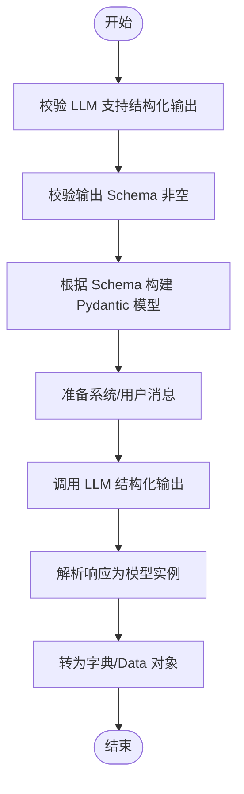
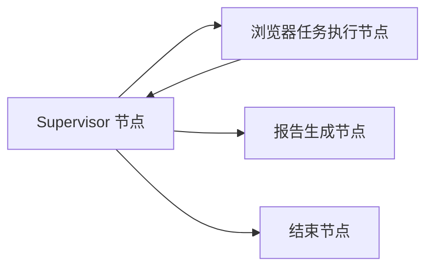
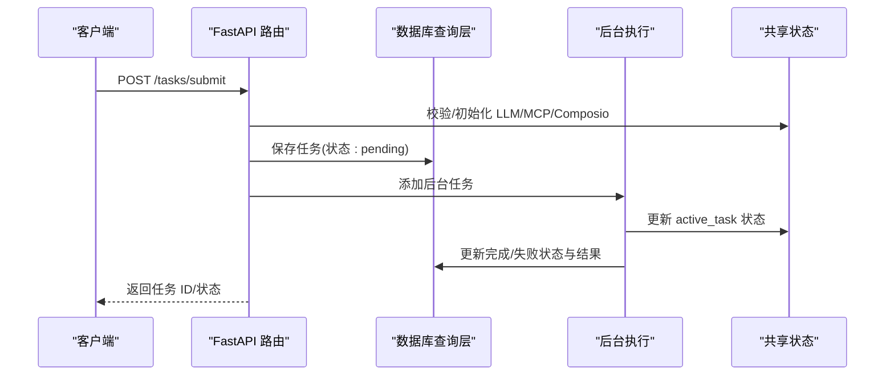
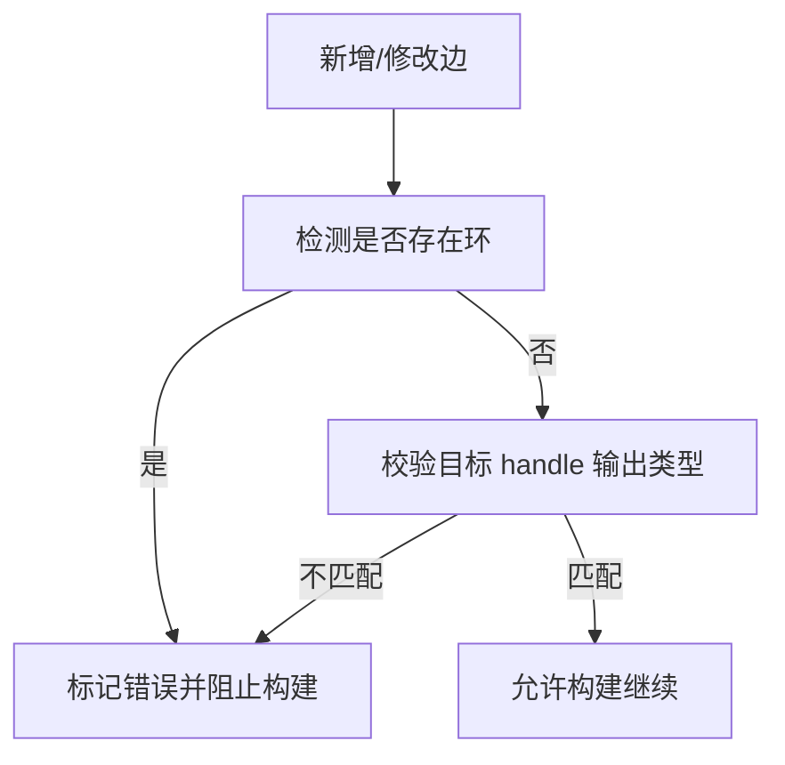
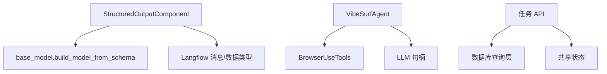

# 工作流生成与结构化

<cite>
**本文引用的文件**
- [vibe_surf/workflows/VibeSurf/vibesurf_agent.py](file://vibe_surf/workflows/VibeSurf/vibesurf_agent.py)
- [vibe_surf/workflows/VibeSurf/structured_output.py](file://vibe_surf/workflows/VibeSurf/structured_output.py)
- [vibe_surf/langflow/helpers/base_model.py](file://vibe_surf/langflow/helpers/base_model.py)
- [vibe_surf/backend/api/task.py](file://vibe_surf/backend/api/task.py)
- [vibe_surf/backend/database/models.py](file://vibe_surf/backend/database/models.py)
- [vibe_surf/backend/database/schemas.py](file://vibe_surf/backend/database/schemas.py)
- [vibe_surf/backend/database/queries.py](file://vibe_surf/backend/database/queries.py)
- [vibe_surf/backend/shared_state.py](file://vibe_surf/backend/shared_state.py)
- [vibe_surf/agents/vibe_surf_agent.py](file://vibe_surf/agents/vibe_surf_agent.py)
- [vibe_surf/tools/browser_use_tools.py](file://vibe_surf/tools/browser_use_tools.py)
- [vibe_surf/frontend/src/utils/reactflowUtils.ts](file://vibe_surf/frontend/src/utils/reactflowUtils.ts)
- [vibe_surf/frontend/src/stores/flowStore.ts](file://vibe_surf/frontend/src/stores/flowStore.ts)
</cite>

## 目录
1. [简介](#简介)
2. [项目结构](#项目结构)
3. [核心组件](#核心组件)
4. [架构总览](#架构总览)
5. [详细组件分析](#详细组件分析)
6. [依赖分析](#依赖分析)
7. [性能考虑](#性能考虑)
8. [故障排查指南](#故障排查指南)
9. [结论](#结论)
10. [附录](#附录)

## 简介
本文件面向“对话式工作流”的生成与结构化流程，围绕以下目标展开：
- 解释 VibeSurf Agent 如何接收解析后的“意图”并调用相应的工作流构建逻辑；
- 重点阐述 structured_output.py 中定义的“结构化输出模式”，以及如何通过 JSON Schema 约束生成的工作流节点；
- 说明系统如何将高级“意图”映射为具体工作流组件（浏览器操作、LLM 调用、数据处理等），并构建节点间的连接关系；
- 分析 task.py 中的任务创建 API 如何接收生成的工作流定义并持久化到数据库；
- 讨论生成过程中的验证机制：循环检测、依赖完整性检查与资源可用性验证，以确保生成的工作流可执行。

## 项目结构
本项目采用分层与功能域结合的组织方式：
- 前端可视化编辑器与工作流验证：位于 frontend/src，包含 ReactFlow 工具链与构建状态管理；
- 后端 API 与数据库：位于 backend/api、backend/database，提供任务提交、状态查询与持久化；
- 代理与工作流引擎：位于 agents 与 workflows/VibeSurf，负责意图解析、动作规划与节点执行；
- 工具集与浏览器交互：位于 tools，封装浏览器操作、文件系统与 MCP 客户端；
- Langflow 集成：位于 langflow/*，提供组件基类、输入输出类型与模型构建工具。

图表来源
- [vibe_surf/backend/api/task.py](file://vibe_surf/backend/api/task.py#L1-L120)
- [vibe_surf/backend/shared_state.py](file://vibe_surf/backend/shared_state.py#L1-L120)
- [vibe_surf/agents/vibe_surf_agent.py](file://vibe_surf/agents/vibe_surf_agent.py#L340-L520)
- [vibe_surf/tools/browser_use_tools.py](file://vibe_surf/tools/browser_use_tools.py#L60-L120)
- [vibe_surf/workflows/VibeSurf/structured_output.py](file://vibe_surf/workflows/VibeSurf/structured_output.py#L120-L154)
- [vibe_surf/frontend/src/utils/reactflowUtils.ts](file://vibe_surf/frontend/src/utils/reactflowUtils.ts#L687-L765)

章节来源
- [vibe_surf/backend/api/task.py](file://vibe_surf/backend/api/task.py#L1-L120)
- [vibe_surf/backend/shared_state.py](file://vibe_surf/backend/shared_state.py#L1-L120)
- [vibe_surf/agents/vibe_surf_agent.py](file://vibe_surf/agents/vibe_surf_agent.py#L340-L520)
- [vibe_surf/tools/browser_use_tools.py](file://vibe_surf/tools/browser_use_tools.py#L60-L120)
- [vibe_surf/workflows/VibeSurf/structured_output.py](file://vibe_surf/workflows/VibeSurf/structured_output.py#L120-L154)
- [vibe_surf/frontend/src/utils/reactflowUtils.ts](file://vibe_surf/frontend/src/utils/reactflowUtils.ts#L687-L765)

## 核心组件
- VibeSurfAgentComponent：作为 Langflow 组件入口，接收用户输入（任务、LLM、扩展提示、上传文件、代理模式）并调用 VibeSurfAgent 执行。
- VibeSurfAgent：基于 LangGraph 的状态机，负责将高级意图转化为具体动作序列，并在不同节点间路由（如浏览器任务、报告生成）。
- StructuredOutputComponent：通过 JSON Schema 定义输出结构，使用 LLM 的结构化输出能力生成符合约束的数据对象。
- BrowserUseTools：封装浏览器导航、点击、输入、截图、下载等动作，作为工作流节点的可复用能力。
- 任务 API（task.py）：提供任务提交、暂停/恢复/停止、状态查询接口；后台异步执行任务并将结果持久化。
- 数据库层（models/schemas/queries）：定义任务表结构、JSON 字段的 Pydantic 校验与查询操作。

章节来源
- [vibe_surf/workflows/VibeSurf/vibesurf_agent.py](file://vibe_surf/workflows/VibeSurf/vibesurf_agent.py#L24-L114)
- [vibe_surf/agents/vibe_surf_agent.py](file://vibe_surf/agents/vibe_surf_agent.py#L340-L520)
- [vibe_surf/workflows/VibeSurf/structured_output.py](file://vibe_surf/workflows/VibeSurf/structured_output.py#L120-L154)
- [vibe_surf/tools/browser_use_tools.py](file://vibe_surf/tools/browser_use_tools.py#L60-L120)
- [vibe_surf/backend/api/task.py](file://vibe_surf/backend/api/task.py#L43-L146)
- [vibe_surf/backend/database/models.py](file://vibe_surf/backend/database/models.py#L94-L137)
- [vibe_surf/backend/database/schemas.py](file://vibe_surf/backend/database/schemas.py#L1-L100)

## 架构总览
下图展示了从“意图输入”到“可执行工作流”的端到端路径，以及验证与持久化的关键节点。

图表来源
- [vibe_surf/frontend/src/utils/reactflowUtils.ts](file://vibe_surf/frontend/src/utils/reactflowUtils.ts#L687-L765)
- [vibe_surf/frontend/src/stores/flowStore.ts](file://vibe_surf/frontend/src/stores/flowStore.ts#L674-L719)
- [vibe_surf/backend/api/task.py](file://vibe_surf/backend/api/task.py#L43-L146)
- [vibe_surf/backend/shared_state.py](file://vibe_surf/backend/shared_state.py#L118-L233)
- [vibe_surf/agents/vibe_surf_agent.py](file://vibe_surf/agents/vibe_surf_agent.py#L340-L520)
- [vibe_surf/tools/browser_use_tools.py](file://vibe_surf/tools/browser_use_tools.py#L60-L120)
- [vibe_surf/backend/database/queries.py](file://vibe_surf/backend/database/queries.py#L441-L520)

## 详细组件分析

### VibeSurfAgentComponent：接收意图并触发工作流
- 输入项：任务文本、LLM 句柄、扩展系统提示、上传文件列表、代理模式（思考/非思考/闪速）。
- 输出项：消息型输出，承载最终结果。
- 执行流程：构造 VibeSurfAgent 实例，注入 LLM、浏览器管理器、工具集与工作空间目录，随后调用 run 方法执行。

图表来源
- [vibe_surf/workflows/VibeSurf/vibesurf_agent.py](file://vibe_surf/workflows/VibeSurf/vibesurf_agent.py#L81-L114)
- [vibe_surf/backend/shared_state.py](file://vibe_surf/backend/shared_state.py#L580-L598)

章节来源
- [vibe_surf/workflows/VibeSurf/vibesurf_agent.py](file://vibe_surf/workflows/VibeSurf/vibesurf_agent.py#L24-L114)
- [vibe_surf/backend/shared_state.py](file://vibe_surf/backend/shared_state.py#L580-L598)

### 结构化输出模式：JSON Schema 约束与 LLM 输出格式
- 输入：LLM 句柄、输入消息、系统提示（格式指令）、Schema 名称、输出 Schema（字段名、描述、类型、是否多值）。
- 核心逻辑：
  - 使用工具函数将表格型 Schema 转换为 Pydantic 模型；
  - 准备系统消息与用户消息；
  - 通过 LLM 的结构化输出能力（指定输出模型）生成符合 Schema 的对象；
  - 将结果转换为 Data 并返回。

图表来源
- [vibe_surf/workflows/VibeSurf/structured_output.py](file://vibe_surf/workflows/VibeSurf/structured_output.py#L120-L154)
- [vibe_surf/langflow/helpers/base_model.py](file://vibe_surf/langflow/helpers/base_model.py#L42-L72)

章节来源
- [vibe_surf/workflows/VibeSurf/structured_output.py](file://vibe_surf/workflows/VibeSurf/structured_output.py#L120-L154)
- [vibe_surf/langflow/helpers/base_model.py](file://vibe_surf/langflow/helpers/base_model.py#L42-L72)

### 意图到节点映射与连接关系
- VibeSurfAgent 通过状态机与节点路由，将高层意图拆解为具体动作：
  - 浏览器任务执行节点：并行/串行执行多个子任务，收集结果；
  - 报告生成节点：根据提取内容生成报告；
  - 结束节点：汇总响应与建议后续任务。
- 连接关系：
  - Supervisor 节点根据 LLM 输出的动作名称进行路由；
  - 浏览器任务完成后回退至 Supervisor；
  - 最终完成时进入结束节点。

图表来源
- [vibe_surf/agents/vibe_surf_agent.py](file://vibe_surf/agents/vibe_surf_agent.py#L434-L489)
- [vibe_surf/agents/vibe_surf_agent.py](file://vibe_surf/agents/vibe_surf_agent.py#L548-L605)

章节来源
- [vibe_surf/agents/vibe_surf_agent.py](file://vibe_surf/agents/vibe_surf_agent.py#L434-L489)
- [vibe_surf/agents/vibe_surf_agent.py](file://vibe_surf/agents/vibe_surf_agent.py#L548-L605)

### 任务创建 API：接收工作流定义并持久化
- 提交流程：
  - 校验是否存在正在运行的任务；
  - 加载/校验 LLM 配置并测试连通性；
  - 保存任务记录（状态 pending，写入会话、任务描述、上传文件、MCP 配置、代理模式等）；
  - 启动后台任务执行，更新状态并在完成后写回结果或错误信息。
- 关键点：
  - 使用数据库查询层统一管理任务生命周期；
  - 共享状态维护当前活动任务与全局组件（浏览器、工具、LLM）。

图表来源
- [vibe_surf/backend/api/task.py](file://vibe_surf/backend/api/task.py#L43-L146)
- [vibe_surf/backend/database/queries.py](file://vibe_surf/backend/database/queries.py#L441-L520)
- [vibe_surf/backend/shared_state.py](file://vibe_surf/backend/shared_state.py#L118-L233)

章节来源
- [vibe_surf/backend/api/task.py](file://vibe_surf/backend/api/task.py#L43-L146)
- [vibe_surf/backend/database/queries.py](file://vibe_surf/backend/database/queries.py#L441-L520)
- [vibe_surf/backend/shared_state.py](file://vibe_surf/backend/shared_state.py#L118-L233)

### 前端工作流验证：循环检测与依赖完整性
- 循环检测：在添加/修改边时，计算从目标节点出发的可达性，若能回到源节点则判定存在环；
- 类型/依赖检查：校验目标 handle 的输出类型与边的目标类型匹配，避免不完整连接；
- 构建状态：当校验失败时，更新节点构建状态为 ERROR，并阻止构建继续。

图表来源
- [vibe_surf/frontend/src/utils/reactflowUtils.ts](file://vibe_surf/frontend/src/utils/reactflowUtils.ts#L711-L765)
- [vibe_surf/frontend/src/stores/flowStore.ts](file://vibe_surf/frontend/src/stores/flowStore.ts#L674-L719)

章节来源
- [vibe_surf/frontend/src/utils/reactflowUtils.ts](file://vibe_surf/frontend/src/utils/reactflowUtils.ts#L711-L765)
- [vibe_surf/frontend/src/stores/flowStore.ts](file://vibe_surf/frontend/src/stores/flowStore.ts#L674-L719)

## 依赖分析
- 组件耦合与内聚：
  - VibeSurfAgentComponent 与 VibeSurfAgent 通过 shared_state 注入浏览器与工具，保持较高内聚；
  - StructuredOutputComponent 依赖 Langflow 的输入输出与消息类型，以及 base_model 的 Schema 构建；
  - 任务 API 与数据库层通过查询类解耦，便于扩展与测试。
- 外部依赖与集成点：
  - LLM：通过 LLM 句柄与结构化输出能力驱动意图解析与数据抽取；
  - 浏览器：通过 BrowserUseTools 提供的导航、点击、输入、截图、下载等动作；
  - MCP/Composio：通过共享状态动态加载配置并注册客户端，增强工具集能力。

图表来源
- [vibe_surf/workflows/VibeSurf/structured_output.py](file://vibe_surf/workflows/VibeSurf/structured_output.py#L120-L154)
- [vibe_surf/langflow/helpers/base_model.py](file://vibe_surf/langflow/helpers/base_model.py#L42-L72)
- [vibe_surf/agents/vibe_surf_agent.py](file://vibe_surf/agents/vibe_surf_agent.py#L340-L520)
- [vibe_surf/tools/browser_use_tools.py](file://vibe_surf/tools/browser_use_tools.py#L60-L120)
- [vibe_surf/backend/api/task.py](file://vibe_surf/backend/api/task.py#L43-L146)
- [vibe_surf/backend/database/queries.py](file://vibe_surf/backend/database/queries.py#L441-L520)

章节来源
- [vibe_surf/workflows/VibeSurf/structured_output.py](file://vibe_surf/workflows/VibeSurf/structured_output.py#L120-L154)
- [vibe_surf/langflow/helpers/base_model.py](file://vibe_surf/langflow/helpers/base_model.py#L42-L72)
- [vibe_surf/agents/vibe_surf_agent.py](file://vibe_surf/agents/vibe_surf_agent.py#L340-L520)
- [vibe_surf/tools/browser_use_tools.py](file://vibe_surf/tools/browser_use_tools.py#L60-L120)
- [vibe_surf/backend/api/task.py](file://vibe_surf/backend/api/task.py#L43-L146)
- [vibe_surf/backend/database/queries.py](file://vibe_surf/backend/database/queries.py#L441-L520)

## 性能考虑
- 并行执行：浏览器任务支持并行执行多个子任务，减少总体等待时间；
- 异步后台：任务提交后立即返回，后台异步执行并定期更新状态；
- LLM 连通性测试：在任务启动前进行轻量级连通性测试，避免无效等待；
- 文件系统与截图：将中间产物落盘，便于后续审计与重放。

[本节为通用指导，无需特定文件引用]

## 故障排查指南
- LLM 连接失败：
  - 现象：任务提交阶段返回连接失败；
  - 排查：确认 LLM 配置正确、密钥有效、网络可达；查看日志中的测试响应内容与异常信息。
- 任务状态异常：
  - 现象：任务卡在 pending 或运行中未更新；
  - 排查：检查共享状态 active_task 是否被清理、数据库更新是否成功、后台任务是否抛出异常。
- 循环/类型不匹配导致无法构建：
  - 现象：前端提示“存在环”或“类型不匹配”；
  - 排查：删除或调整相关边，确保输出类型与目标输入类型一致且无环。

章节来源
- [vibe_surf/backend/api/task.py](file://vibe_surf/backend/api/task.py#L154-L195)
- [vibe_surf/backend/shared_state.py](file://vibe_surf/backend/shared_state.py#L118-L233)
- [vibe_surf/frontend/src/utils/reactflowUtils.ts](file://vibe_surf/frontend/src/utils/reactflowUtils.ts#L711-L765)

## 结论
本系统通过“意图解析 + 结构化输出 + 动作编排 + 前端验证 + 后台持久化”的闭环，实现了从自然语言到可执行工作流的自动化生成与执行。其中：
- StructuredOutputComponent 以 JSON Schema 约束生成物，保证输出一致性；
- VibeSurfAgent 将高层意图映射为浏览器与数据处理动作，并通过节点路由形成可执行图；
- 任务 API 与数据库层提供可靠的生命周期管理；
- 前端工作流验证在构建阶段即拦截潜在问题，提升可执行性与稳定性。

[本节为总结性内容，无需特定文件引用]

## 附录
- 数据模型与 JSON 校验：
  - 任务元数据、LLM 配置、MCP 参数等均通过 Pydantic 模型进行校验与序列化，确保入库字段的一致性与可追溯性。

章节来源
- [vibe_surf/backend/database/models.py](file://vibe_surf/backend/database/models.py#L94-L137)
- [vibe_surf/backend/database/schemas.py](file://vibe_surf/backend/database/schemas.py#L1-L100)