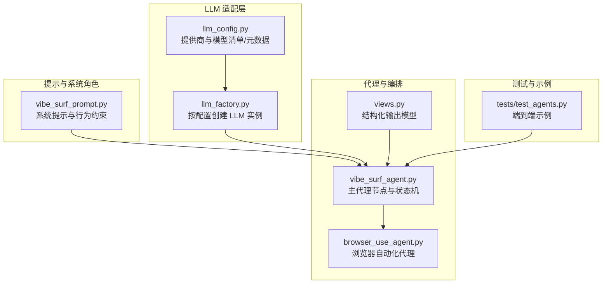
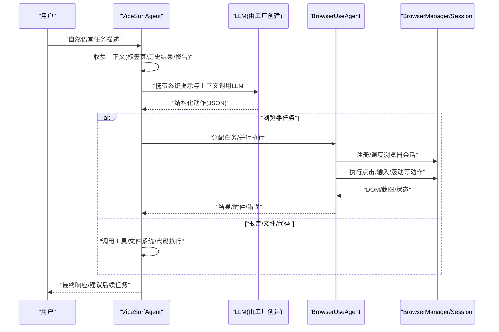
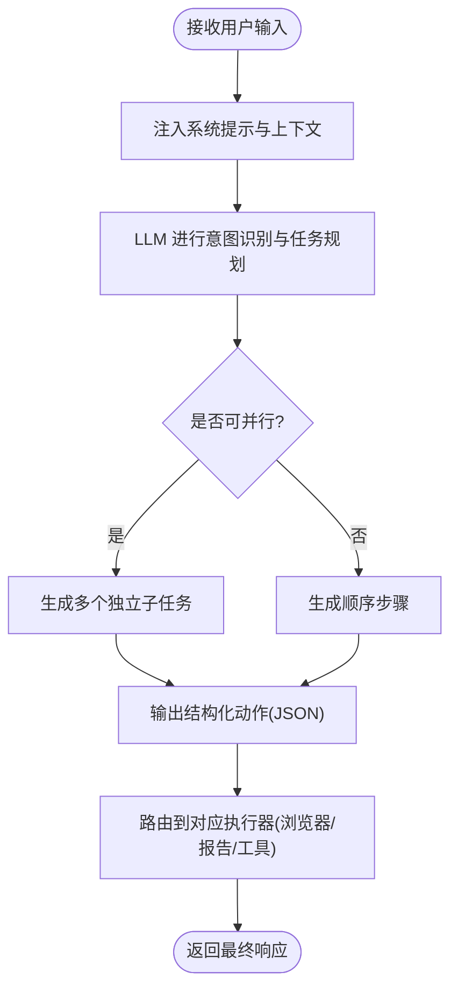
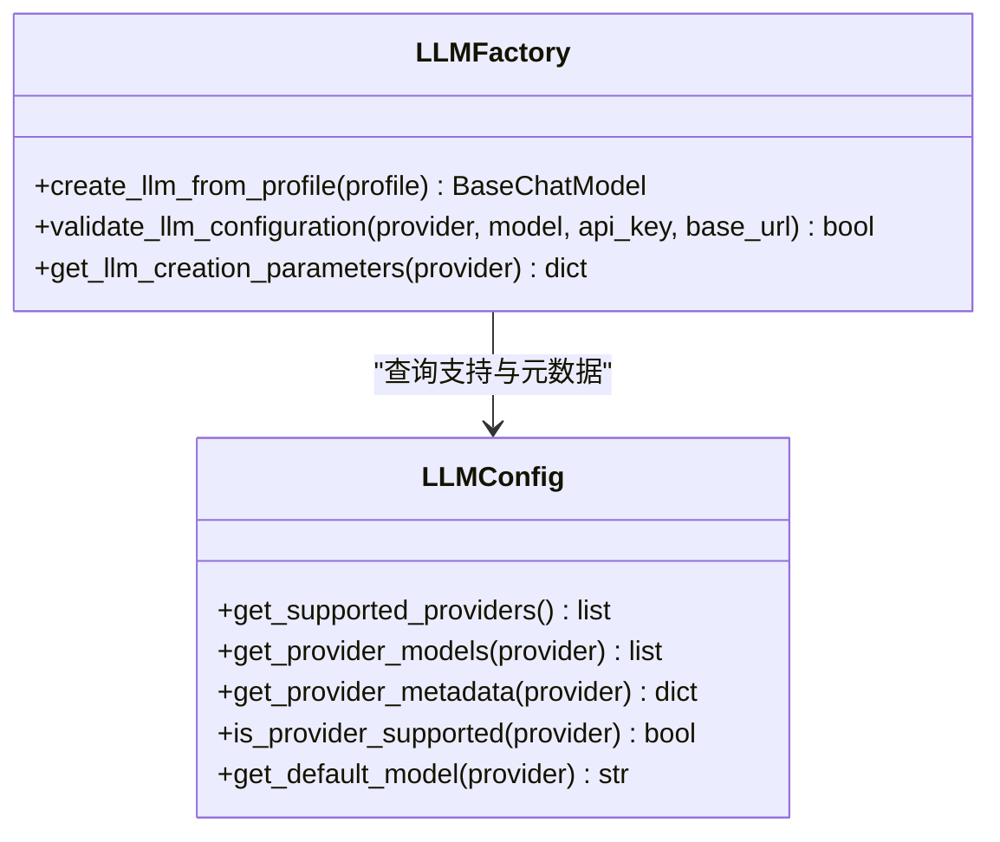
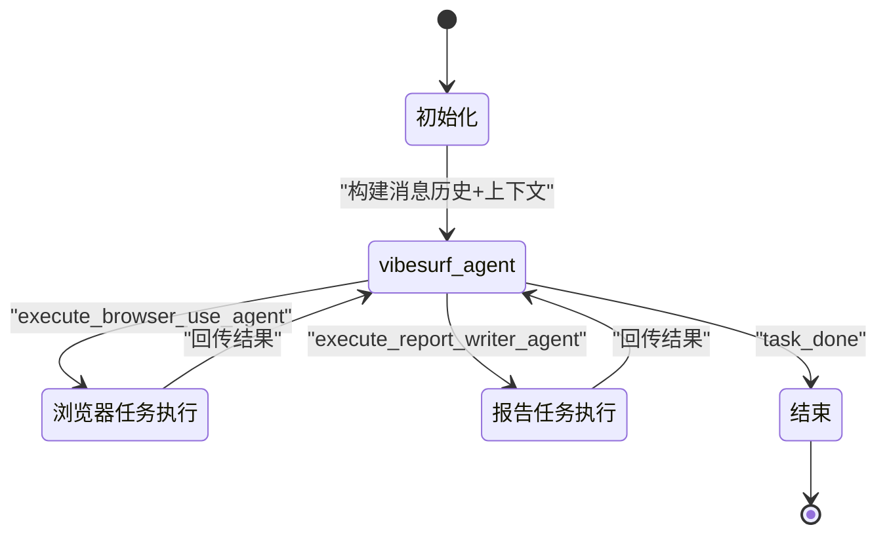
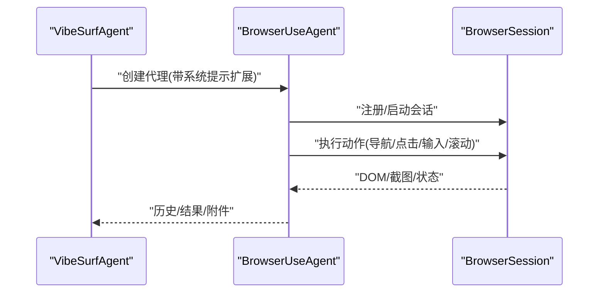
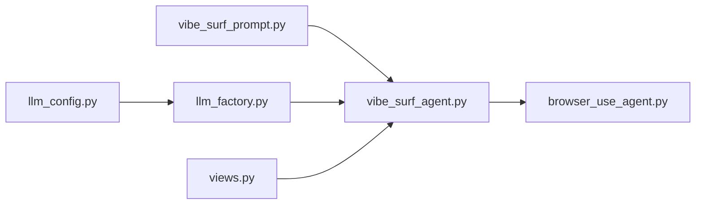

# 意图解析与自然语言处理

<cite>
**本文引用的文件**
- [vibe_surf/agents/prompts/vibe_surf_prompt.py](file://vibe_surf/agents/prompts/vibe_surf_prompt.py)
- [vibe_surf/backend/utils/llm_factory.py](file://vibe_surf/backend/utils/llm_factory.py)
- [vibe_surf/backend/llm_config.py](file://vibe_surf/backend/llm_config.py)
- [vibe_surf/agents/vibe_surf_agent.py](file://vibe_surf/agents/vibe_surf_agent.py)
- [vibe_surf/agents/browser_use_agent.py](file://vibe_surf/agents/browser_use_agent.py)
- [vibe_surf/agents/views.py](file://vibe_surf/agents/views.py)
- [tests/test_agents.py](file://tests/test_agents.py)
</cite>

## 目录
1. [引言](#引言)
2. [项目结构](#项目结构)
3. [核心组件](#核心组件)
4. [架构总览](#架构总览)
5. [详细组件分析](#详细组件分析)
6. [依赖关系分析](#依赖关系分析)
7. [性能考量](#性能考量)
8. [故障排查指南](#故障排查指南)
9. [结论](#结论)
10. [附录](#附录)

## 引言
本文件围绕 VibeSurf 代理系统的“意图解析与自然语言处理”主题，系统化阐述如何通过精心设计的提示工程（prompt engineering），将用户的自然语言指令转化为结构化的执行意图；解释大模型（LLM）在语义理解中的作用，包括上下文窗口管理、多轮对话状态跟踪以及歧义消除策略；剖析 vibe_surf_prompt.py 中提示模板的设计原理，涵盖系统角色设定、任务分解指令与输出格式约束；并说明 llm_factory.py 如何依据配置选择合适的 LLM 实例进行意图识别，同时讨论不同 LLM 提供商在理解能力上的差异对解析准确性的影响。最后给出从模糊用户请求到精确工作流操作的真实转换示例。

## 项目结构
本节聚焦与意图解析直接相关的模块与文件：
- 提示工程与系统角色定义：vibe_surf/agents/prompts/vibe_surf_prompt.py
- LLM 工厂与提供商适配：vibe_surf/backend/utils/llm_factory.py、vibe_surf/backend/llm_config.py
- 主代理与工作流编排：vibe_surf/agents/vibe_surf_agent.py
- 浏览器自动化代理与上下文注入：vibe_surf/agents/browser_use_agent.py
- 结构化输出模型与动作建模：vibe_surf/agents/views.py
- 示例与端到端测试：tests/test_agents.py

图表来源
- [vibe_surf/agents/prompts/vibe_surf_prompt.py](file://vibe_surf/agents/prompts/vibe_surf_prompt.py#L1-L219)
- [vibe_surf/backend/utils/llm_factory.py](file://vibe_surf/backend/utils/llm_factory.py#L1-L275)
- [vibe_surf/backend/llm_config.py](file://vibe_surf/backend/llm_config.py#L1-L226)
- [vibe_surf/agents/vibe_surf_agent.py](file://vibe_surf/agents/vibe_surf_agent.py#L346-L546)
- [vibe_surf/agents/browser_use_agent.py](file://vibe_surf/agents/browser_use_agent.py#L83-L210)
- [vibe_surf/agents/views.py](file://vibe_surf/agents/views.py#L77-L124)
- [tests/test_agents.py](file://tests/test_agents.py#L150-L228)

章节来源
- [vibe_surf/agents/prompts/vibe_surf_prompt.py](file://vibe_surf/agents/prompts/vibe_surf_prompt.py#L1-L219)
- [vibe_surf/backend/utils/llm_factory.py](file://vibe_surf/backend/utils/llm_factory.py#L1-L275)
- [vibe_surf/backend/llm_config.py](file://vibe_surf/backend/llm_config.py#L1-L226)
- [vibe_surf/agents/vibe_surf_agent.py](file://vibe_surf/agents/vibe_surf_agent.py#L346-L546)
- [vibe_surf/agents/browser_use_agent.py](file://vibe_surf/agents/browser_use_agent.py#L83-L210)
- [vibe_surf/agents/views.py](file://vibe_surf/agents/views.py#L77-L124)
- [tests/test_agents.py](file://tests/test_agents.py#L150-L228)

## 核心组件
- 系统提示与意图约束：通过系统提示明确代理职责、能力边界、安全与合规要求，确保 LLM 的输出符合预期的结构化动作模型。
- LLM 工厂：根据数据库或配置记录动态创建 LLM 实例，支持多提供商参数映射与校验。
- 主代理（VibeSurfAgent）：以 LangGraph 状态机驱动，结合上下文信息与系统提示，生成结构化动作并路由到浏览器或报告生成等子代理。
- 浏览器自动化代理（BrowserUseAgent）：负责具体网页任务执行，支持并行与多标签页管理，将页面状态与截图作为视觉上下文输入。
- 结构化输出模型：定义统一的 AgentOutput Schema，强制要求包含 action 字段，确保 LLM 输出可被可靠解析与执行。

章节来源
- [vibe_surf/agents/prompts/vibe_surf_prompt.py](file://vibe_surf/agents/prompts/vibe_surf_prompt.py#L1-L219)
- [vibe_surf/backend/utils/llm_factory.py](file://vibe_surf/backend/utils/llm_factory.py#L23-L216)
- [vibe_surf/agents/vibe_surf_agent.py](file://vibe_surf/agents/vibe_surf_agent.py#L346-L546)
- [vibe_surf/agents/browser_use_agent.py](file://vibe_surf/agents/browser_use_agent.py#L83-L210)
- [vibe_surf/agents/views.py](file://vibe_surf/agents/views.py#L77-L124)

## 架构总览
下图展示了从用户输入到结构化动作执行的关键路径，强调提示工程、LLM 适配、状态机编排与浏览器自动化之间的交互。

图表来源
- [vibe_surf/agents/vibe_surf_agent.py](file://vibe_surf/agents/vibe_surf_agent.py#L346-L546)
- [vibe_surf/agents/browser_use_agent.py](file://vibe_surf/agents/browser_use_agent.py#L658-L800)
- [vibe_surf/backend/utils/llm_factory.py](file://vibe_surf/backend/utils/llm_factory.py#L23-L216)

## 详细组件分析

### 系统提示与意图约束（vibe_surf_prompt.py）
- 系统角色设定：明确代理为“专业 AI 浏览器助手”，具备智能网页自动化、研究与报告生成、Python 数据处理与可视化等能力。
- 行为与安全约束：严格限制文件系统访问范围、禁止危险操作、明确认证错误处理流程与语言一致性要求。
- 任务分解与并发：指导 LLM 将复杂任务拆分为可并行的子任务，充分利用多标签页与资源复用。
- 输出格式约束：要求输出必须包含 action 字段，且遵循统一的结构化 JSON Schema，便于下游解析与执行。
- 视觉输入处理：当提供浏览器截图时，需结合元素索引与位置信息进行决策。
- 技能命令处理：对特定前缀命令进行解析与执行策略控制，避免误用与过度自动。

图表来源
- [vibe_surf/agents/prompts/vibe_surf_prompt.py](file://vibe_surf/agents/prompts/vibe_surf_prompt.py#L1-L219)

章节来源
- [vibe_surf/agents/prompts/vibe_surf_prompt.py](file://vibe_surf/agents/prompts/vibe_surf_prompt.py#L1-L219)

### LLM 工厂与提供商适配（llm_factory.py、llm_config.py）
- 提供商支持与参数映射：工厂根据 provider 动态创建对应 LLM 类型，支持温度、最大令牌、top_p、频率惩罚、种子等参数，并对不支持的参数进行过滤。
- 配置校验：validate_llm_configuration 对必填项与提供商特性进行校验（如 Azure OpenAI 必须提供 base_url）。
- 参数获取：get_llm_creation_parameters 返回所需与可选参数清单，便于前端或配置界面生成表单。
- 提供商元数据：llm_config.py 定义各提供商的显示名、是否需要 API Key、是否支持 base_url、工具与视觉能力、默认模型等。

图表来源
- [vibe_surf/backend/utils/llm_factory.py](file://vibe_surf/backend/utils/llm_factory.py#L23-L275)
- [vibe_surf/backend/llm_config.py](file://vibe_surf/backend/llm_config.py#L1-L226)

章节来源
- [vibe_surf/backend/utils/llm_factory.py](file://vibe_surf/backend/utils/llm_factory.py#L23-L216)
- [vibe_surf/backend/llm_config.py](file://vibe_surf/backend/llm_config.py#L1-L226)

### 主代理与状态机（vibe_surf_agent.py）
- LangGraph 状态机：VibeSurfState 维护原始任务、上传文件、会话 ID、当前步骤、浏览器任务队列、结果、最终响应等。
- 上下文拼装：从浏览器管理器获取标签页、活动标签、历史结果与报告生成状态，拼接为系统提示的上下文信息。
- 结构化输出：通过 CustomAgentOutput 或其变体，限定 LLM 输出必须包含 action 字段，确保可解析性。
- 节点路由：根据 action 名称路由到浏览器任务执行节点或报告生成节点，或直接结束任务。
- 并行执行：当存在多个浏览器任务时，使用多代理并行执行，最大化吞吐。
- 控制状态：支持暂停/恢复/停止，节点包装器在执行前检查控制信号。

图表来源
- [vibe_surf/agents/vibe_surf_agent.py](file://vibe_surf/agents/vibe_surf_agent.py#L346-L546)
- [vibe_surf/agents/vibe_surf_agent.py](file://vibe_surf/agents/vibe_surf_agent.py#L548-L763)

章节来源
- [vibe_surf/agents/vibe_surf_agent.py](file://vibe_surf/agents/vibe_surf_agent.py#L94-L142)
- [vibe_surf/agents/vibe_surf_agent.py](file://vibe_surf/agents/vibe_surf_agent.py#L346-L546)
- [vibe_surf/agents/vibe_surf_agent.py](file://vibe_surf/agents/vibe_surf_agent.py#L548-L763)

### 浏览器自动化代理与上下文注入（browser_use_agent.py）
- 系统提示扩展：在每步运行前，将 EXTEND_BU_SYSTEM_PROMPT 注入到系统提示中，强化浏览器操作的安全与规范。
- 视觉输入：支持页面截图与 DOM 元素高亮，结合层级上下文与坐标信息提升定位精度。
- 多代理并行：为每个浏览器任务创建独立代理实例，分配唯一任务 ID 与工作目录，支持并行执行与资源隔离。
- 步骤回调：每步执行后记录思考、评估、下一步目标与动作摘要，便于可观测性与调试。

图表来源
- [vibe_surf/agents/browser_use_agent.py](file://vibe_surf/agents/browser_use_agent.py#L83-L210)
- [vibe_surf/agents/vibe_surf_agent.py](file://vibe_surf/agents/vibe_surf_agent.py#L607-L763)

章节来源
- [vibe_surf/agents/browser_use_agent.py](file://vibe_surf/agents/browser_use_agent.py#L83-L210)
- [vibe_surf/agents/vibe_surf_agent.py](file://vibe_surf/agents/vibe_surf_agent.py#L607-L763)

### 结构化输出模型（views.py）
- CustomAgentOutput：定义统一的输出结构，强制 action 字段存在，支持“含思考/不含思考”的两种变体，便于在不同模式下切换。
- VibeSurfAgentOutput：与 browser_use 模式兼容，支持动作列表与最小数量约束。
- 与 LLM 的绑定：在调用 LLM 时指定输出格式为上述模型，确保返回内容满足 Schema。

章节来源
- [vibe_surf/agents/views.py](file://vibe_surf/agents/views.py#L77-L124)
- [vibe_surf/agents/vibe_surf_agent.py](file://vibe_surf/agents/vibe_surf_agent.py#L346-L420)

## 依赖关系分析
- 提示工程依赖：主代理在节点中将上下文拼装为消息历史，再调用 LLM，LLM 的输出经结构化模型解析后路由到具体执行器。
- LLM 适配依赖：工厂根据配置创建 LLM 实例，LLM 的能力（工具、视觉、参数支持）直接影响意图解析的稳定性与准确性。
- 执行器依赖：浏览器代理依赖浏览器会话与 DOM/截图上下文，其执行结果回传给主代理，用于后续决策。

图表来源
- [vibe_surf/agents/prompts/vibe_surf_prompt.py](file://vibe_surf/agents/prompts/vibe_surf_prompt.py#L1-L219)
- [vibe_surf/backend/utils/llm_factory.py](file://vibe_surf/backend/utils/llm_factory.py#L23-L216)
- [vibe_surf/backend/llm_config.py](file://vibe_surf/backend/llm_config.py#L1-L226)
- [vibe_surf/agents/vibe_surf_agent.py](file://vibe_surf/agents/vibe_surf_agent.py#L346-L546)
- [vibe_surf/agents/browser_use_agent.py](file://vibe_surf/agents/browser_use_agent.py#L83-L210)
- [vibe_surf/agents/views.py](file://vibe_surf/agents/views.py#L77-L124)

章节来源
- [vibe_surf/agents/vibe_surf_agent.py](file://vibe_surf/agents/vibe_surf_agent.py#L346-L546)
- [vibe_surf/backend/utils/llm_factory.py](file://vibe_surf/backend/utils/llm_factory.py#L23-L216)
- [vibe_surf/backend/llm_config.py](file://vibe_surf/backend/llm_config.py#L1-L226)

## 性能考量
- 上下文窗口管理：主代理在节点中仅拼接必要上下文（标签页、活动标签、历史结果、报告状态），避免冗余信息导致 token 消耗过高。
- 并行执行：当存在多个浏览器任务时，采用多代理并行执行，显著缩短整体时延；但需注意浏览器会话与资源占用。
- 参数优化：通过 llm_factory 的参数映射与 llm_config 的元数据，选择更高效/低成本的模型与提供商，平衡速度与质量。
- 可观测性：每步执行记录思考、评估、动作摘要与附件，便于定位瓶颈与异常。

[本节为通用指导，无需列出具体文件来源]

## 故障排查指南
- LLM 创建失败：检查提供商是否受支持、API Key 是否正确、base_url 是否缺失（Azure OpenAI 等）。工厂会抛出错误日志，可据此定位。
- 输出格式不符：若 LLM 返回非结构化内容，主代理会捕获异常并记录；确认已指定输出格式模型，且系统提示中包含严格的输出约束。
- 浏览器任务失败：检查标签页分配是否唯一、任务文件是否正确复制到代理工作目录、是否存在认证错误（如社交平台未登录）。
- 控制状态异常：若暂停/恢复/停止无效，检查节点包装器的控制信号逻辑与外部中断处理。

章节来源
- [vibe_surf/backend/utils/llm_factory.py](file://vibe_surf/backend/utils/llm_factory.py#L217-L275)
- [vibe_surf/agents/vibe_surf_agent.py](file://vibe_surf/agents/vibe_surf_agent.py#L300-L343)
- [vibe_surf/agents/prompts/vibe_surf_prompt.py](file://vibe_surf/agents/prompts/vibe_surf_prompt.py#L139-L143)

## 结论
VibeSurf 的意图解析机制通过“系统提示工程 + LLM 工厂 + 结构化输出模型 + 状态机编排”的组合，实现了从自然语言到精确工作流操作的稳健转换。系统提示明确了代理职责与安全边界，LLM 工厂保证了跨提供商的一致性与可配置性，而结构化输出模型则确保了下游执行的可靠性。在实践中，合理选择提供商与模型、优化上下文与并行策略，是提升解析准确性的关键。

[本节为总结性内容，无需列出具体文件来源]

## 附录

### 实际输入输出示例（从模糊到精确）
以下示例展示典型用户请求如何被解析与执行（以文字描述代替具体代码片段）：
- 输入：“帮我查一下今天北京天气，然后把结果发给我”
  - 解析：识别为“信息检索 + 文件/消息发送”类任务，主代理生成动作：搜索天气、提取文本、生成摘要。
  - 输出：最终响应包含天气摘要与建议后续任务（如“导出为报告”）。
- 输入：“打开三个新标签，分别访问 GitHub、LangGraph、Browser-Use，然后截图保存”
  - 解析：识别为“多标签并行访问 + 截图保存”任务，主代理生成多个浏览器任务并行执行。
  - 输出：返回每个标签的结果与截图路径，汇总到最终响应。
- 输入：“统计最近一周的股价波动并画图”
  - 解析：识别为“数据抓取 + 数据处理 + 可视化”任务，主代理生成动作：拉取数据、清洗与分析、绘图并保存。
  - 输出：返回图表文件链接与简要分析。

章节来源
- [tests/test_agents.py](file://tests/test_agents.py#L150-L228)
- [vibe_surf/agents/vibe_surf_agent.py](file://vibe_surf/agents/vibe_surf_agent.py#L548-L763)