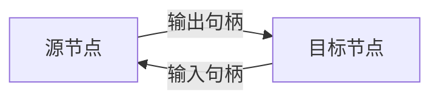
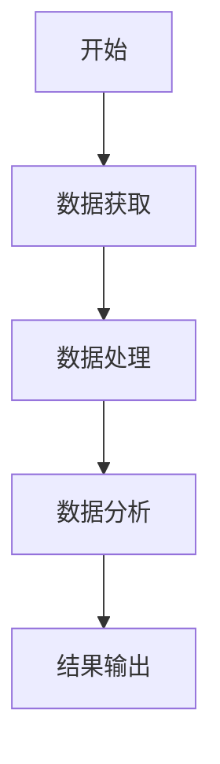
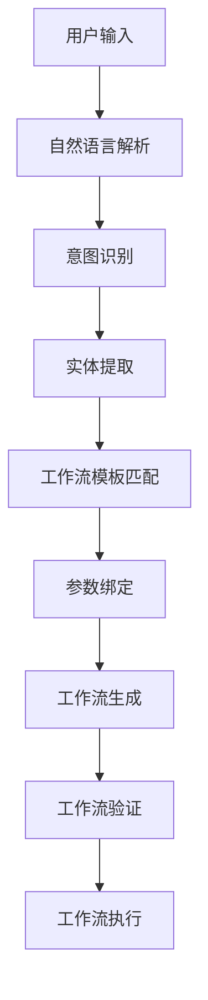
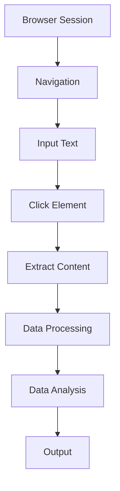

# 工作流创建

<cite>
**本文档中引用的文件**   
- [flowStore.ts](file://vibe_surf/frontend/src/stores/flowStore.ts)
- [reactflowUtils.ts](file://vibe_surf/frontend/src/utils/reactflowUtils.ts)
- [workflow_converter.py](file://vibe_surf/backend/utils/workflow_converter.py)
- [flowsManagerStore.ts](file://vibe_surf/frontend/src/stores/flowsManagerStore.ts)
- [buildUtils.ts](file://vibe_surf/frontend/src/utils/buildUtils.ts)
</cite>

## 目录
1. [简介](#简介)
2. [拖放式工作流编辑器](#拖放式工作流编辑器)
3. [对话式工作流创建](#对话式工作流创建)
4. [预定义工作流模板](#预定义工作流模板)
5. [工作流设计最佳实践](#工作流设计最佳实践)
6. [工作流创建示例](#工作流创建示例)
7. [结论](#结论)

## 简介
VibeSurf提供了一套全面的工作流创建系统，支持通过拖放式编辑器、对话式自然语言输入以及预定义模板等多种方式来构建自动化工作流。该系统基于Langflow框架构建，允许用户通过可视化界面连接各种组件来创建复杂的工作流，从而实现浏览器自动化、数据处理和AI集成等任务。

**Section sources**
- [flowStore.ts](file://vibe_surf/frontend/src/stores/flowStore.ts#L1-L1101)
- [reactflowUtils.ts](file://vibe_surf/frontend/src/utils/reactflowUtils.ts#L1-L2260)

## 拖放式工作流编辑器

### 用户界面设计
VibeSurf的拖放式工作流编辑器基于React Flow库构建，提供了一个直观的画布界面，用户可以在其中拖拽组件节点并连接它们以创建工作流。编辑器支持节点选择、连接、参数配置和布局管理等核心功能。

编辑器的主要UI组件包括：
- **节点面板**：显示可用的组件类型，用户可以从中拖拽节点到画布
- **画布区域**：用于放置和连接节点的工作区
- **属性面板**：显示所选节点的参数配置选项
- **工具栏**：提供撤销/重做、保存、构建等操作按钮

### 交互模式
工作流编辑器支持多种交互模式来管理节点和连接：

#### 节点选择
用户可以通过单击节点来选择单个节点，或通过框选来选择多个节点。选择的节点会高亮显示，其属性会在右侧的属性面板中展示。

#### 节点连接
节点之间的连接通过拖拽源节点的输出句柄到目标节点的输入句柄来创建。系统会验证连接的有效性，确保数据类型兼容。连接创建后，会以有向边的形式显示在画布上。

**Diagram sources**
- [flowStore.ts](file://vibe_surf/frontend/src/stores/flowStore.ts#L578-L618)
- [reactflowUtils.ts](file://vibe_surf/frontend/src/utils/reactflowUtils.ts#L371-L470)

#### 参数配置
每个节点都有可配置的参数，这些参数在节点的属性面板中显示。参数包括：
- **必填参数**：必须提供值的参数，用红色星号标记
- **可选参数**：可以留空的参数
- **高级参数**：默认隐藏的高级配置选项

用户可以直接在属性面板中输入参数值，或通过连接其他节点的输出来动态提供参数值。

#### 布局管理
编辑器提供了自动布局功能，可以智能地排列节点以减少边的交叉并优化视觉呈现。布局算法采用分层排序方法，将节点按执行顺序从左到右排列。

**Diagram sources**
- [workflow_converter.py](file://vibe_surf/backend/utils/workflow_converter.py#L238-L320)
- [reactflowUtils.ts](file://vibe_surf/frontend/src/utils/reactflowUtils.ts#L537-L558)

**Section sources**
- [flowStore.ts](file://vibe_surf/frontend/src/stores/flowStore.ts#L1-L1101)
- [reactflowUtils.ts](file://vibe_surf/frontend/src/utils/reactflowUtils.ts#L1-L2260)

## 对话式工作流创建

### 自然语言解析
VibeSurf支持通过自然语言描述来创建工作流。系统使用LLM（大语言模型）来解析用户的自然语言输入，并将其转换为结构化的工作流定义。

自然语言解析流程包括：
1. **意图识别**：识别用户想要执行的主要操作
2. **实体提取**：提取操作中的关键参数和目标
3. **上下文理解**：理解操作的上下文和约束条件

### 意图识别
系统通过分析用户输入的语义来识别其意图。常见的意图类型包括：
- **导航操作**：如"打开Google网站"
- **点击操作**：如"点击搜索按钮"
- **输入操作**：如"在搜索框输入'人工智能'"
- **滚动操作**：如"向下滚动页面"

### 工作流生成算法
一旦识别出用户的意图和相关参数，系统会使用工作流生成算法来创建相应的工作流。算法流程如下：

**Diagram sources**
- [workflow_converter.py](file://vibe_surf/backend/utils/workflow_converter.py#L30-L126)
- [buildUtils.ts](file://vibe_surf/frontend/src/utils/buildUtils.ts#L81-L138)

生成算法的核心是将自然语言描述映射到预定义的组件模板，并根据提取的参数配置这些组件。例如，"在Google搜索'人工智能'"会被转换为：
1. 导航到Google网站的组件
2. 在搜索框输入文本的组件
3. 点击搜索按钮的组件

**Section sources**
- [workflow_converter.py](file://vibe_surf/backend/utils/workflow_converter.py#L1-L570)
- [buildUtils.ts](file://vibe_surf/frontend/src/utils/buildUtils.ts#L1-L868)

## 预定义工作流模板

### 模板管理
VibeSurf提供了一套预定义的工作流模板库，用户可以浏览、搜索和使用这些模板来快速创建常见任务的工作流。模板管理功能包括：

- **模板分类**：按功能领域对模板进行分类，如浏览器自动化、数据处理、AI集成等
- **模板搜索**：通过关键词搜索相关模板
- **模板预览**：查看模板的结构和描述
- **模板导入**：将模板导入到当前工作区

### 模板使用方法
使用预定义模板创建工作流的步骤如下：

1. **选择模板**：从模板库中选择一个合适的模板
2. **导入模板**：将模板导入到当前工作区
3. **参数配置**：根据具体需求配置模板中的参数
4. **自定义修改**：根据需要添加、删除或修改节点
5. **保存工作流**：将修改后的工作流保存为新的工作流

### 基于模板创建自定义工作流
用户可以基于预定义模板创建自定义工作流。这包括：

- **参数化**：将模板中的具体值替换为参数，使其更具通用性
- **模块化**：将常用的工作流片段保存为可重用的子工作流
- **扩展**：在现有模板的基础上添加新的功能节点

例如，一个"网页数据抓取"模板可以被扩展为"带数据清洗的网页数据抓取"工作流，通过添加数据清洗和格式化节点。

**Section sources**
- [flowsManagerStore.ts](file://vibe_surf/frontend/src/stores/flowsManagerStore.ts#L1-L145)
- [workflow_converter.py](file://vibe_surf/backend/utils/workflow_converter.py#L420-L547)

## 工作流设计最佳实践

### 节点组织
良好的节点组织可以提高工作流的可读性和维护性。建议的组织原则包括：

- **逻辑分组**：将功能相关的节点放在一起
- **执行顺序**：按从左到右的顺序排列节点，反映执行流程
- **层次结构**：使用子工作流来管理复杂的工作流

### 命名规范
一致的命名规范有助于团队协作和工作流理解。建议的命名规范包括：

- **节点命名**：使用描述性的名称，如"Google搜索输入"而不是"输入框"
- **参数命名**：使用有意义的变量名，避免使用通用名称如"value"
- **工作流命名**：使用清晰的名称描述工作流的目的

### 文档化建议
良好的文档化可以提高工作流的可维护性。建议的文档化实践包括：

- **添加注释**：在复杂的工作流部分添加注释说明
- **编写描述**：为每个工作流编写清晰的描述，说明其目的和用法
- **版本控制**：记录工作流的变更历史

**Section sources**
- [flowStore.ts](file://vibe_surf/frontend/src/stores/flowStore.ts#L1-L1101)
- [reactflowUtils.ts](file://vibe_surf/frontend/src/utils/reactflowUtils.ts#L1-L2260)

## 工作流创建示例

### 简单工作流示例
创建一个简单的"打开网站"工作流：

1. 从组件面板拖拽"Browser Session"节点到画布
2. 拖拽"Navigation"节点到画布
3. 连接两个节点
4. 配置"Navigation"节点的URL参数为"https://www.google.com"
5. 构建并运行工作流

### 复杂工作流示例
创建一个复杂的"网页数据抓取和分析"工作流：

1. 使用"Browser Session"节点创建浏览器会话
2. 使用"Navigation"节点导航到目标网站
3. 使用"Input Text"节点在搜索框输入关键词
4. 使用"Click Element"节点点击搜索按钮
5. 使用"Extract Content"节点提取搜索结果
6. 使用"Data Processing"节点清洗和格式化数据
7. 使用"Data Analysis"节点分析数据
8. 使用"Output"节点保存结果

**Diagram sources**
- [workflow_converter.py](file://vibe_surf/backend/utils/workflow_converter.py#L55-L124)
- [flowStore.ts](file://vibe_surf/frontend/src/stores/flowStore.ts#L636-L721)

**Section sources**
- [workflow_converter.py](file://vibe_surf/backend/utils/workflow_converter.py#L1-L570)
- [flowStore.ts](file://vibe_surf/frontend/src/stores/flowStore.ts#L1-L1101)

## 结论
VibeSurf提供了强大而灵活的工作流创建系统，支持多种创建方式以满足不同用户的需求。通过拖放式编辑器，用户可以直观地构建复杂的工作流；通过对话式创建，用户可以用自然语言描述任务；通过预定义模板，用户可以快速启动常见任务。遵循最佳实践可以创建高效、可维护的工作流，提高自动化任务的开发效率。