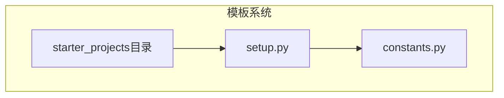
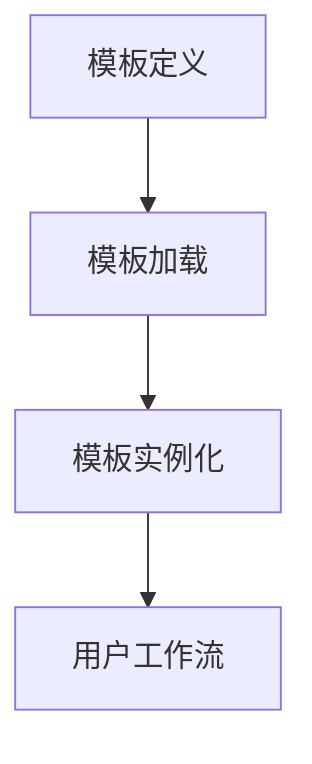
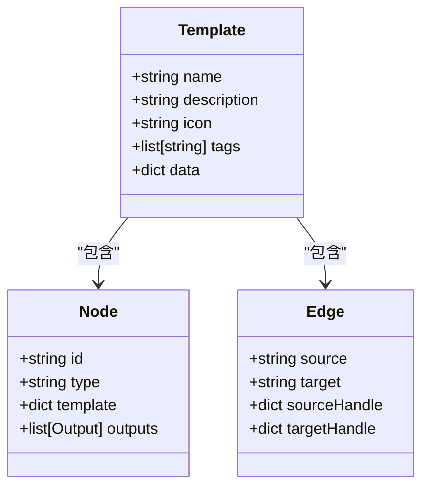
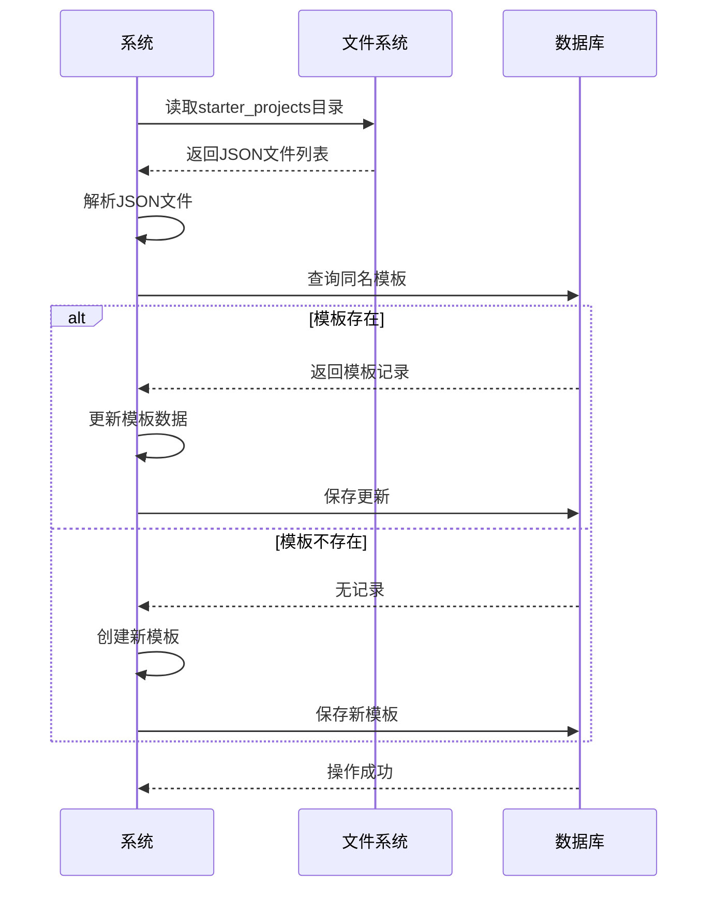
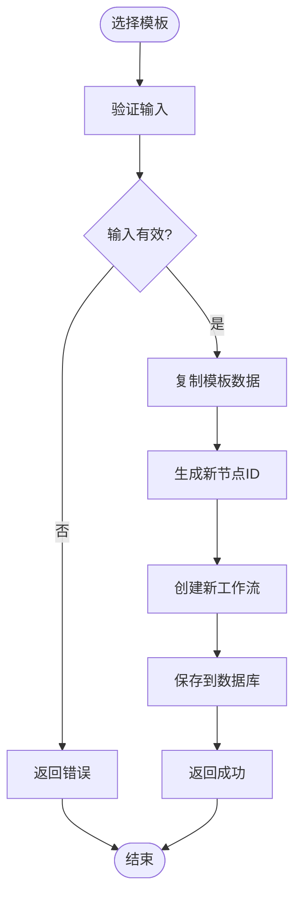
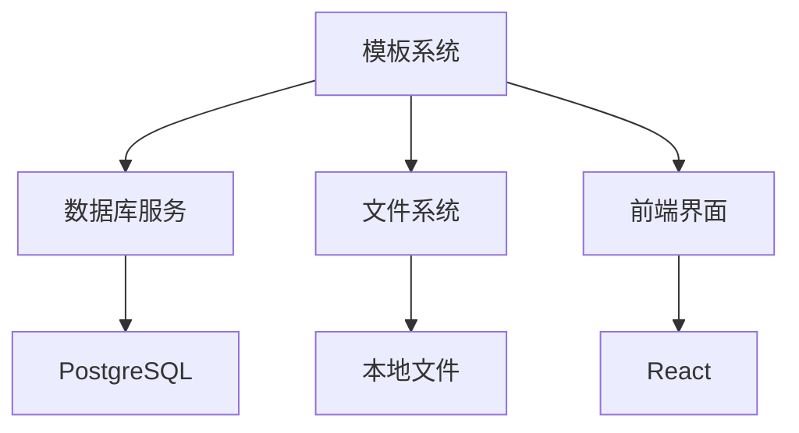

# 工作流模板管理

<cite>
**本文档引用的文件**   
- [setup.py](file://vibe_surf/langflow/initial_setup/setup.py)
- [constants.py](file://vibe_surf/langflow/initial_setup/constants.py)
- [Basic Prompting.json](file://vibe_surf/langflow/initial_setup/starter_projects/Basic Prompting.json)
- [Research Agent.json](file://vibe_surf/langflow/initial_setup/starter_projects/Research Agent.json)
- [utils.py](file://vibe_surf/langflow/template/utils.py)
- [basic_prompting.py](file://vibe_surf/langflow/initial_setup/starter_projects/basic_prompting.py)
- [settings-workflow.js](file://vibe_surf/chrome_extension/scripts/settings-workflow.js)
- [index.tsx](file://vibe_surf/frontend/src/modals/templatesModal/index.tsx)
- [TemplateGetStartedCardComponent/index.tsx](file://vibe_surf/frontend/src/modals/templatesModal/components/TemplateGetStartedCardComponent/index.tsx)
</cite>

## 目录
1. [引言](#引言)
2. [项目结构](#项目结构)
3. [核心组件](#核心组件)
4. [架构概述](#架构概述)
5. [详细组件分析](#详细组件分析)
6. [依赖分析](#依赖分析)
7. [性能考虑](#性能考虑)
8. [故障排除指南](#故障排除指南)
9. [结论](#结论)

## 引言
工作流模板系统是vibe_surf平台的核心功能之一，它为用户提供了一套预设的模板（starter_projects），帮助用户快速创建和配置工作流。这些模板以JSON格式定义，包含了工作流的结构、元数据和版本信息。用户可以基于这些模板创建新的工作流，系统还支持模板参数化配置，允许用户自定义模板中的变量。模板库会定期更新，用户也可以保存和共享自定义模板。本文档将全面介绍工作流模板系统的设计与实现，包括模板的组织结构、加载机制、创建流程、更新策略和最佳实践。

## 项目结构
工作流模板系统的主要文件位于`vibe_surf/langflow/initial_setup/starter_projects`目录下。该目录包含了多个JSON文件，每个文件代表一个预设模板。这些模板文件定义了工作流的节点、边、元数据和配置。系统通过`setup.py`文件中的`load_starter_projects`函数加载这些模板，并在启动时将它们存储到数据库中。`constants.py`文件定义了模板文件夹的名称和描述，确保模板在用户界面中正确显示。

**Diagram sources**
- [setup.py](file://vibe_surf/langflow/initial_setup/setup.py)
- [constants.py](file://vibe_surf/langflow/initial_setup/constants.py)

**Section sources**
- [setup.py](file://vibe_surf/langflow/initial_setup/setup.py)
- [constants.py](file://vibe_surf/langflow/initial_setup/constants.py)

## 核心组件
工作流模板系统的核心组件包括模板加载、模板实例化和模板更新。`setup.py`文件中的`load_starter_projects`函数负责从文件系统加载模板，并将它们存储到数据库中。`update_existing_project`和`create_new_project`函数用于更新或创建模板项目。`utils.py`文件中的`update_template_values`函数用于在实例化模板时更新模板值。

**Section sources**
- [setup.py](file://vibe_surf/langflow/initial_setup/setup.py)
- [utils.py](file://vibe_surf/langflow/template/utils.py)

## 架构概述
工作流模板系统的架构分为三个主要部分：模板定义、模板加载和模板实例化。模板定义以JSON格式存储在`starter_projects`目录中，包含工作流的节点、边和元数据。模板加载通过`setup.py`文件中的函数实现，系统在启动时自动加载所有模板并存储到数据库。模板实例化通过前端界面完成，用户选择模板后，系统创建一个新的工作流实例，并允许用户进行自定义配置。

**Diagram sources**
- [setup.py](file://vibe_surf/langflow/initial_setup/setup.py)
- [utils.py](file://vibe_surf/langflow/template/utils.py)

## 详细组件分析
### 模板定义分析
模板定义文件（如`Basic Prompting.json`）包含工作流的完整结构，包括节点、边和元数据。每个节点定义了其类型、输入、输出和配置。边定义了节点之间的连接关系。元数据包括模板的名称、描述、图标和标签。

**Diagram sources**
- [Basic Prompting.json](file://vibe_surf/langflow/initial_setup/starter_projects/Basic Prompting.json)

### 模板加载机制
模板加载机制通过`setup.py`文件中的`load_starter_projects`函数实现。该函数遍历`starter_projects`目录，读取所有JSON文件，并将它们解析为Python字典。然后，系统检查数据库中是否已存在同名模板，如果存在则更新，否则创建新模板。

**Diagram sources**
- [setup.py](file://vibe_surf/langflow/initial_setup/setup.py)

### 模板实例化流程
模板实例化流程通过前端界面完成。用户在模板选择界面选择一个模板后，系统调用`addFlow`函数创建一个新的工作流实例。该函数复制模板数据，并生成新的节点ID，确保新工作流与原模板隔离。

**Diagram sources**
- [TemplateGetStartedCardComponent/index.tsx](file://vibe_surf/frontend/src/modals/templatesModal/components/TemplateGetStartedCardComponent/index.tsx)

## 依赖分析
工作流模板系统依赖于多个核心模块，包括数据库服务、文件系统和前端界面。数据库服务用于存储和检索模板数据，文件系统用于加载模板文件，前端界面用于展示模板和处理用户交互。

**Diagram sources**
- [setup.py](file://vibe_surf/langflow/initial_setup/setup.py)
- [index.tsx](file://vibe_surf/frontend/src/modals/templatesModal/index.tsx)

## 性能考虑
工作流模板系统在性能方面进行了优化，特别是在模板加载和实例化过程中。系统使用异步I/O操作来提高文件读取效率，并通过批量操作减少数据库交互次数。此外，模板数据在加载时会进行缓存，以减少重复读取的开销。

## 故障排除指南
在使用工作流模板系统时，可能会遇到一些常见问题。例如，模板加载失败可能是由于JSON文件格式错误或文件路径问题。模板实例化失败可能是由于数据库连接问题或权限不足。建议检查日志文件以获取详细的错误信息，并确保所有依赖服务正常运行。

**Section sources**
- [setup.py](file://vibe_surf/langflow/initial_setup/setup.py)

## 结论
工作流模板系统为用户提供了一种高效、灵活的方式来创建和管理工作流。通过预设模板、参数化配置和版本管理，用户可以快速构建复杂的工作流，而无需从零开始。系统的模块化设计和优化的性能使其能够处理大规模的工作流实例。未来，可以进一步增强模板的复用性和共享机制，以支持更广泛的用户需求。