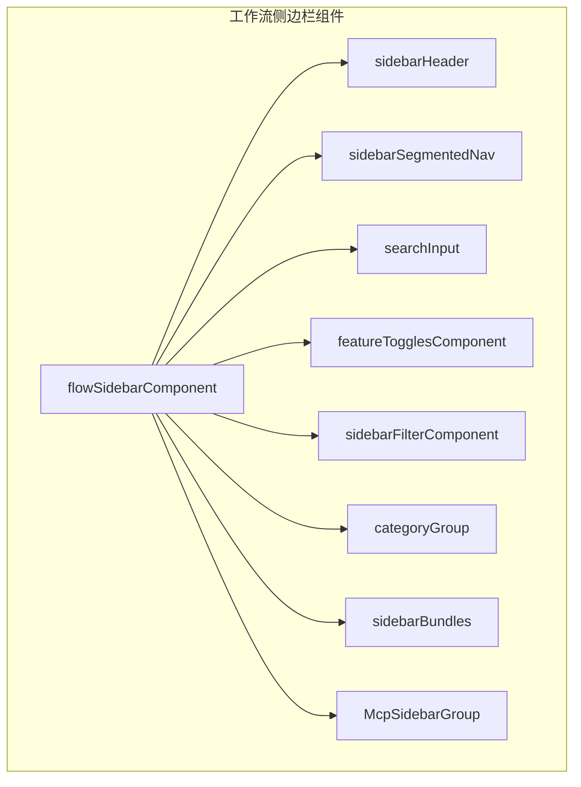
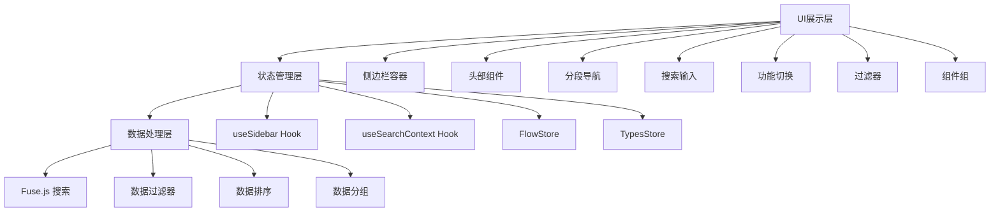
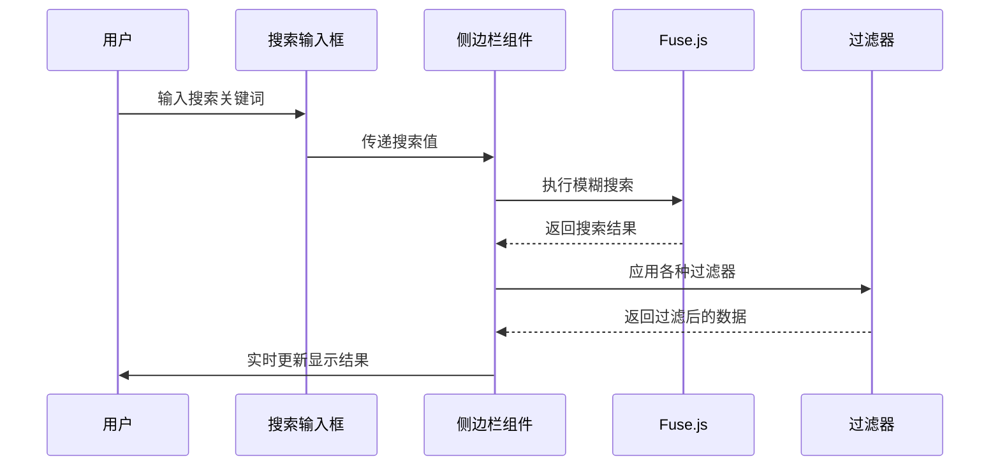
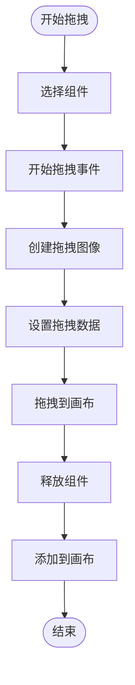
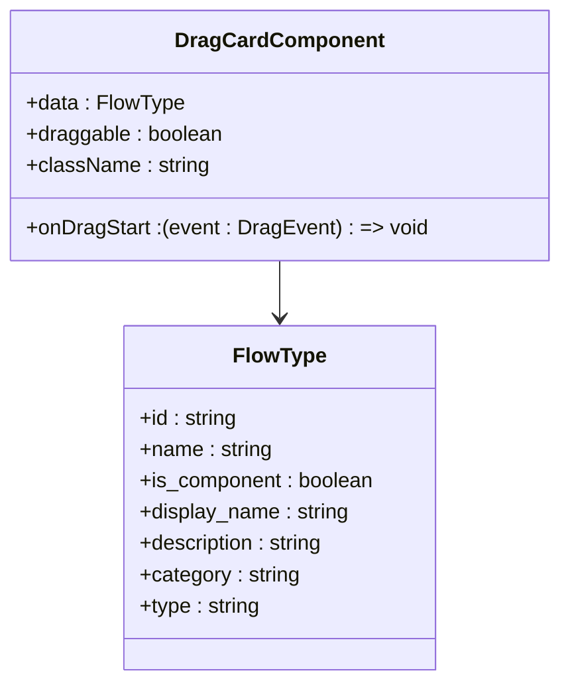
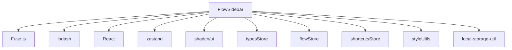

# 工作流侧边栏

<cite>
**本文档中引用的文件**  
- [flowSidebarComponent/index.tsx](file://vibe_surf/frontend/src/pages/FlowPage/components/flowSidebarComponent/index.tsx)
- [flowSidebarComponent/components/sidebarHeader.tsx](file://vibe_surf/frontend/src/pages/FlowPage/components/flowSidebarComponent/components/sidebarHeader.tsx)
- [flowSidebarComponent/components/sidebarSegmentedNav.tsx](file://vibe_surf/frontend/src/pages/FlowPage/components/flowSidebarComponent/components/sidebarSegmentedNav.tsx)
- [flowSidebarComponent/components/searchInput.tsx](file://vibe_surf/frontend/src/pages/FlowPage/components/flowSidebarComponent/components/searchInput.tsx)
- [flowSidebarComponent/components/featureTogglesComponent.tsx](file://vibe_surf/frontend/src/pages/FlowPage/components/flowSidebarComponent/components/featureTogglesComponent.tsx)
- [flowSidebarComponent/components/sidebarFilterComponent.tsx](file://vibe_surf/frontend/src/pages/FlowPage/components/flowSidebarComponent/components/sidebarFilterComponent.tsx)
- [flowSidebarComponent/components/categoryGroup.tsx](file://vibe_surf/frontend/src/pages/FlowPage/components/flowSidebarComponent/components/categoryGroup.tsx)
- [flowSidebarComponent/components/sidebarBundles.tsx](file://vibe_surf/frontend/src/pages/FlowPage/components/flowSidebarComponent/components/sidebarBundles.tsx)
- [flowSidebarComponent/components/McpSidebarGroup.tsx](file://vibe_surf/frontend/src/pages/FlowPage/components/flowSidebarComponent/components/McpSidebarGroup.tsx)
- [flowSidebarComponent/helpers/apply-beta-filter.ts](file://vibe_surf/frontend/src/pages/FlowPage/components/flowSidebarComponent/helpers/apply-beta-filter.ts)
- [flowSidebarComponent/helpers/apply-component-filter.ts](file://vibe_surf/frontend/src/pages/FlowPage/components/flowSidebarComponent/helpers/apply-component-filter.ts)
- [flowSidebarComponent/helpers/apply-edge-filter.ts](file://vibe_surf/frontend/src/pages/FlowPage/components/flowSidebarComponent/helpers/apply-edge-filter.ts)
- [flowSidebarComponent/helpers/apply-legacy-filter.ts](file://vibe_surf/frontend/src/pages/FlowPage/components/flowSidebarComponent/helpers/apply-legacy-filter.ts)
- [flowSidebarComponent/helpers/combined-results.ts](file://vibe_surf/frontend/src/pages/FlowPage/components/flowSidebarComponent/helpers/combined-results.ts)
- [flowSidebarComponent/helpers/filtered-data.ts](file://vibe_surf/frontend/src/pages/FlowPage/components/flowSidebarComponent/helpers/filtered-data.ts)
- [flowSidebarComponent/helpers/normalize-string.ts](file://vibe_surf/frontend/src/pages/FlowPage/components/flowSidebarComponent/helpers/normalize-string.ts)
- [flowSidebarComponent/helpers/sensitive-sort.ts](file://vibe_surf/frontend/src/pages/FlowPage/components/flowSidebarComponent/helpers/sensitive-sort.ts)
- [flowSidebarComponent/helpers/traditional-search-metadata.ts](file://vibe_surf/frontend/src/pages/FlowPage/components/flowSidebarComponent/helpers/traditional-search-metadata.ts)
- [components/core/cardComponent/components/dragCardComponent/index.tsx](file://vibe_surf/frontend/src/components/core/cardComponent/components/dragCardComponent/index.tsx)
</cite>

## 目录
1. [简介](#简介)
2. [项目结构](#项目结构)
3. [核心组件](#核心组件)
4. [架构概述](#架构概述)
5. [详细组件分析](#详细组件分析)
6. [依赖分析](#依赖分析)
7. [性能考虑](#性能考虑)
8. [故障排除指南](#故障排除指南)
9. [结论](#结论)
10. [附录](#附录)（如有必要）

## 简介
本文档全面记录了VibeSurf中工作流侧边栏的实现。详细说明了组件分类展示的组织结构，包括按功能、类型和使用频率的分组策略。解释了搜索过滤功能的实现机制，包括模糊匹配和实时反馈。描述了拖拽注入的工作流，从组件选择到画布添加的完整交互流程。提供了FlowCardComponent的视觉设计和交互细节，包括预览图、标签和操作按钮。包含代码示例，展示如何扩展侧边栏功能和自定义组件展示方式。

## 项目结构
工作流侧边栏的实现主要位于前端源代码的特定目录中。该组件采用模块化设计，将不同功能分离到独立的文件和组件中，以提高可维护性和可扩展性。



**Diagram sources**
- [flowSidebarComponent/index.tsx](file://vibe_surf/frontend/src/pages/FlowPage/components/flowSidebarComponent/index.tsx)
- [flowSidebarComponent/components/sidebarHeader.tsx](file://vibe_surf/frontend/src/pages/FlowPage/components/flowSidebarComponent/components/sidebarHeader.tsx)
- [flowSidebarComponent/components/sidebarSegmentedNav.tsx](file://vibe_surf/frontend/src/pages/FlowPage/components/flowSidebarComponent/components/sidebarSegmentedNav.tsx)

**Section sources**
- [flowSidebarComponent/index.tsx](file://vibe_surf/frontend/src/pages/FlowPage/components/flowSidebarComponent/index.tsx)
- [flowSidebarComponent/components/sidebarHeader.tsx](file://vibe_surf/frontend/src/pages/FlowPage/components/flowSidebarComponent/components/sidebarHeader.tsx)
- [flowSidebarComponent/components/sidebarSegmentedNav.tsx](file://vibe_surf/frontend/src/pages/FlowPage/components/flowSidebarComponent/components/sidebarSegmentedNav.tsx)

## 核心组件
工作流侧边栏的核心组件包括主侧边栏容器、头部组件、分段导航、搜索输入框、功能切换器、过滤器组件以及各类组件组。这些组件协同工作，为用户提供了一个直观且功能丰富的界面来管理和选择工作流组件。

**Section sources**
- [flowSidebarComponent/index.tsx](file://vibe_surf/frontend/src/pages/FlowPage/components/flowSidebarComponent/index.tsx)
- [flowSidebarComponent/components/sidebarHeader.tsx](file://vibe_surf/frontend/src/pages/FlowPage/components/flowSidebarComponent/components/sidebarHeader.tsx)
- [flowSidebarComponent/components/sidebarSegmentedNav.tsx](file://vibe_surf/frontend/src/pages/FlowPage/components/flowSidebarComponent/components/sidebarSegmentedNav.tsx)

## 架构概述
工作流侧边栏采用分层架构设计，从上到下分为UI展示层、状态管理层和数据处理层。这种架构确保了组件的高内聚和低耦合，使得各个功能模块可以独立开发和测试。



**Diagram sources**
- [flowSidebarComponent/index.tsx](file://vibe_surf/frontend/src/pages/FlowPage/components/flowSidebarComponent/index.tsx)
- [flowSidebarComponent/components/sidebarHeader.tsx](file://vibe_surf/frontend/src/pages/FlowPage/components/flowSidebarComponent/components/sidebarHeader.tsx)
- [flowSidebarComponent/components/sidebarSegmentedNav.tsx](file://vibe_surf/frontend/src/pages/FlowPage/components/flowSidebarComponent/components/sidebarSegmentedNav.tsx)

## 详细组件分析
### 组件分组策略
工作流侧边栏的组件分类展示采用多维度分组策略，包括功能、类型和使用频率。这种分组方式帮助用户快速找到所需的组件。

```mermaid
classDiagram
class CategoryGroup {
+dataFilter : Record<string, any>
+sortedCategories : string[]
+CATEGORIES : Array<Category>
+openCategories : string[]
+setOpenCategories : (categories : string[]) => void
+search : string
+nodeColors : Record<string, string>
+onDragStart : (event : DragEvent, data : {type : string, node? : APIClassType}) => void
+sensitiveSort : (a : string, b : string) => number
+showConfig : boolean
+setShowConfig : (show : boolean) => void
}
class SidebarBundles {
+BUNDLES : Array<Bundle>
+search : string
+sortedCategories : string[]
+dataFilter : Record<string, any>
+nodeColors : Record<string, string>
+onDragStart : (event : DragEvent, data : {type : string, node? : APIClassType}) => void
+sensitiveSort : (a : string, b : string) => number
+openCategories : string[]
+setOpenCategories : (categories : string[]) => void
+handleKeyDownInput : (e : KeyboardEvent, name : string) => void
+showSearchConfigTrigger : boolean
+showConfig : boolean
+setShowConfig : (show : boolean) => void
}
class McpSidebarGroup {
+mcpComponents : Array<any>
+nodeColors : Record<string, string>
+onDragStart : (event : DragEvent, data : {type : string, node? : APIClassType}) => void
+openCategories : string[]
+mcpLoading : boolean
+mcpSuccess : boolean
+search : string
+hasMcpServers : boolean
+showSearchConfigTrigger : boolean
+showConfig : boolean
+setShowConfig : (show : boolean) => void
}
CategoryGroup --> SidebarBundles
CategoryGroup --> McpSidebarGroup
```

**Diagram sources**
- [flowSidebarComponent/components/categoryGroup.tsx](file://vibe_surf/frontend/src/pages/FlowPage/components/flowSidebarComponent/components/categoryGroup.tsx)
- [flowSidebarComponent/components/sidebarBundles.tsx](file://vibe_surf/frontend/src/pages/FlowPage/components/flowSidebarComponent/components/sidebarBundles.tsx)
- [flowSidebarComponent/components/McpSidebarGroup.tsx](file://vibe_surf/frontend/src/pages/FlowPage/components/flowSidebarComponent/components/McpSidebarGroup.tsx)

**Section sources**
- [flowSidebarComponent/components/categoryGroup.tsx](file://vibe_surf/frontend/src/pages/FlowPage/components/flowSidebarComponent/components/categoryGroup.tsx)
- [flowSidebarComponent/components/sidebarBundles.tsx](file://vibe_surf/frontend/src/pages/FlowPage/components/flowSidebarComponent/components/sidebarBundles.tsx)
- [flowSidebarComponent/components/McpSidebarGroup.tsx](file://vibe_surf/frontend/src/pages/FlowPage/components/flowSidebarComponent/components/McpSidebarGroup.tsx)

### 搜索过滤功能
搜索过滤功能是工作流侧边栏的核心特性之一，它实现了模糊匹配和实时反馈，极大地提升了用户体验。



**Diagram sources**
- [flowSidebarComponent/components/searchInput.tsx](file://vibe_surf/frontend/src/pages/FlowPage/components/flowSidebarComponent/components/searchInput.tsx)
- [flowSidebarComponent/index.tsx](file://vibe_surf/frontend/src/pages/FlowPage/components/flowSidebarComponent/index.tsx)
- [flowSidebarComponent/helpers/apply-beta-filter.ts](file://vibe_surf/frontend/src/pages/FlowPage/components/flowSidebarComponent/helpers/apply-beta-filter.ts)
- [flowSidebarComponent/helpers/apply-component-filter.ts](file://vibe_surf/frontend/src/pages/FlowPage/components/flowSidebarComponent/helpers/apply-component-filter.ts)
- [flowSidebarComponent/helpers/apply-edge-filter.ts](file://vibe_surf/frontend/src/pages/FlowPage/components/flowSidebarComponent/helpers/apply-edge-filter.ts)
- [flowSidebarComponent/helpers/apply-legacy-filter.ts](file://vibe_surf/frontend/src/pages/FlowPage/components/flowSidebarComponent/helpers/apply-legacy-filter.ts)

**Section sources**
- [flowSidebarComponent/components/searchInput.tsx](file://vibe_surf/frontend/src/pages/FlowPage/components/flowSidebarComponent/components/searchInput.tsx)
- [flowSidebarComponent/index.tsx](file://vibe_surf/frontend/src/pages/FlowPage/components/flowSidebarComponent/index.tsx)
- [flowSidebarComponent/helpers/apply-beta-filter.ts](file://vibe_surf/frontend/src/pages/FlowPage/components/flowSidebarComponent/helpers/apply-beta-filter.ts)
- [flowSidebarComponent/helpers/apply-component-filter.ts](file://vibe_surf/frontend/src/pages/FlowPage/components/flowSidebarComponent/helpers/apply-component-filter.ts)
- [flowSidebarComponent/helpers/apply-edge-filter.ts](file://vibe_surf/frontend/src/pages/FlowPage/components/flowSidebarComponent/helpers/apply-edge-filter.ts)
- [flowSidebarComponent/helpers/apply-legacy-filter.ts](file://vibe_surf/frontend/src/pages/FlowPage/components/flowSidebarComponent/helpers/apply-legacy-filter.ts)

### 拖拽注入工作流
拖拽注入工作流实现了从组件选择到画布添加的完整交互流程，为用户提供了一种直观的组件添加方式。



**Diagram sources**
- [flowSidebarComponent/index.tsx](file://vibe_surf/frontend/src/pages/FlowPage/components/flowSidebarComponent/index.tsx)
- [components/core/cardComponent/components/dragCardComponent/index.tsx](file://vibe_surf/frontend/src/components/core/cardComponent/components/dragCardComponent/index.tsx)

**Section sources**
- [flowSidebarComponent/index.tsx](file://vibe_surf/frontend/src/pages/FlowPage/components/flowSidebarComponent/index.tsx)
- [components/core/cardComponent/components/dragCardComponent/index.tsx](file://vibe_surf/frontend/src/components/core/cardComponent/components/dragCardComponent/index.tsx)

### FlowCardComponent视觉设计
FlowCardComponent是侧边栏中每个组件的视觉表示，包含了预览图、标签和操作按钮等元素。



**Diagram sources**
- [components/core/cardComponent/components/dragCardComponent/index.tsx](file://vibe_surf/frontend/src/components/core/cardComponent/components/dragCardComponent/index.tsx)

**Section sources**
- [components/core/cardComponent/components/dragCardComponent/index.tsx](file://vibe_surf/frontend/src/components/core/cardComponent/components/dragCardComponent/index.tsx)

## 依赖分析
工作流侧边栏组件依赖于多个外部库和内部模块，这些依赖关系确保了组件的功能完整性和性能优化。



**Diagram sources**
- [flowSidebarComponent/index.tsx](file://vibe_surf/frontend/src/pages/FlowPage/components/flowSidebarComponent/index.tsx)

**Section sources**
- [flowSidebarComponent/index.tsx](file://vibe_surf/frontend/src/pages/FlowPage/components/flowSidebarComponent/index.tsx)

## 性能考虑
工作流侧边栏在设计时充分考虑了性能因素，采用了多种优化策略来确保流畅的用户体验。

- **虚拟化渲染**：对于大量组件的展示，采用虚拟化技术只渲染可见区域的组件
- **记忆化组件**：使用React.memo对组件进行记忆化，避免不必要的重新渲染
- **防抖搜索**：对搜索输入进行防抖处理，减少频繁的搜索操作
- **懒加载**：对非关键组件采用懒加载策略，减少初始加载时间
- **状态优化**：使用zustand进行状态管理，避免不必要的状态更新

[无来源，因为此部分提供一般性指导]

## 故障排除指南
### 常见问题及解决方案
1. **搜索功能不工作**
   - 检查Fuse.js是否正确初始化
   - 确认搜索数据源是否正确加载
   - 验证搜索输入事件是否正确绑定

2. **拖拽功能失效**
   - 检查onDragStart事件处理器是否正确设置
   - 确认dragData是否正确序列化
   - 验证画布是否正确处理drop事件

3. **组件分组显示异常**
   - 检查分类数据是否正确加载
   - 确认分组逻辑是否正确实现
   - 验证排序算法是否正常工作

**Section sources**
- [flowSidebarComponent/index.tsx](file://vibe_surf/frontend/src/pages/FlowPage/components/flowSidebarComponent/index.tsx)
- [flowSidebarComponent/components/categoryGroup.tsx](file://vibe_surf/frontend/src/pages/FlowPage/components/flowSidebarComponent/components/categoryGroup.tsx)
- [components/core/cardComponent/components/dragCardComponent/index.tsx](file://vibe_surf/frontend/src/components/core/cardComponent/components/dragCardComponent/index.tsx)

## 结论
VibeSurf的工作流侧边栏实现了一个功能丰富、用户友好的组件管理界面。通过合理的架构设计和组件划分，实现了高效的组件搜索、分类展示和拖拽注入功能。该实现不仅满足了当前的需求，还具有良好的可扩展性，便于未来添加新的功能和组件类型。

[无来源，因为此部分总结而不分析特定文件]